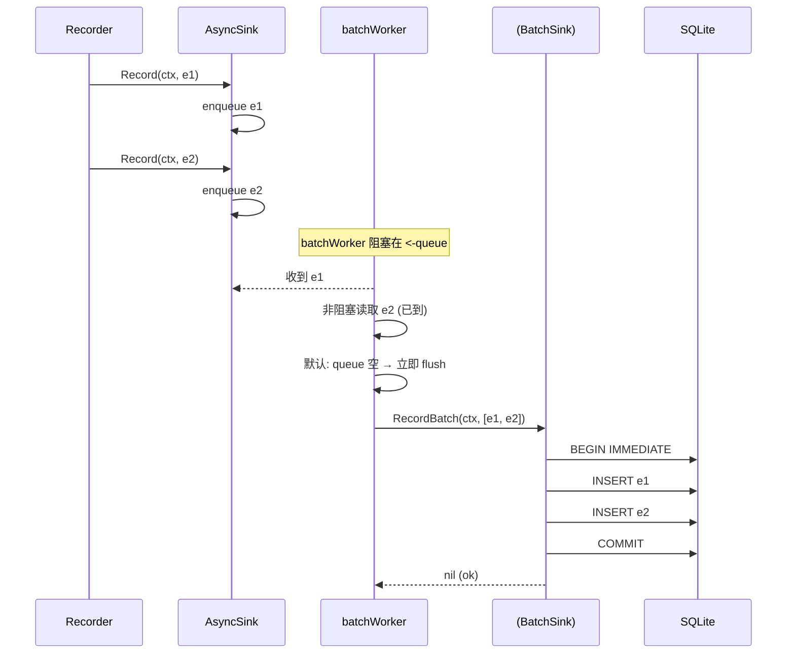

# Sprint-Level 深度分析：审计批量写入（Audit Batch Write）

> **选取依据**：ROADMAP v5.0 边界清单 `审计无批量写路径`（低 · M）—— `Sink` 仅单条 `Record`，
> async worker 逐条 drain，sqlite 每事件一条 INSERT，高 QPS 下单 writer SQLite 封顶审计吞吐。
>
> **本轮对抗核验结论：该能力已于 commit `5ccedaa` 交付**，当前 HEAD 包含完整的
> `BatchSink` 接口、`RecordBatch` 双端实现（Memory + SQLite）、以及基于异步缓冲区的
> 批量 drain worker（`NewBatchAsyncSink`）。以下为面向四角色的完整分析。

---

## 角色定义

```
┌────────────────────────────────────────────────────────────────┐
│  CTO：技术战略 + 风险权衡 + 长期可维护性                        │
├────────────────────────────────────────────────────────────────┤
│  产品经理：用户价值 + 竞品对比 + 优先级 + 验收标准              │
├────────────────────────────────────────────────────────────────┤
│  架构师：子系统边界 + 接口定义 + 兼容性 + 安全模型              │
├────────────────────────────────────────────────────────────────┤
│  实现工程师：代码变更 + 测试 + 部署 + 配置                      │
└────────────────────────────────────────────────────────────────┘
```

---

## 一、CTO：技术战略与风险权衡

### 1.1 背景

审计批量写入（batch audit write）填补的是 ROADMAP v5.0 性能清单中唯一标记为"低优先级但中等工作量"的
审计吞吐短板。在原设计中：

- `auditspi.Sink` 接口仅暴露 `Record(ctx, *Event) error`——单个事件写入
- `AsyncSink` 的 worker 协程逐条从 channel 接收并调用 `Record`，每事件独立 INSERT
- SQLite 后端每事件执行一次完整 INSERT（含 JSON marshal + WAL fsync）
- 在登录高峰（一次 `/auth/login` 可能产生 3-5 个审计事件 * 数百 QPS），单 writer 的
  SQLite WAL 成为瓶颈，队列满则触发 `ErrAsyncQueueFull` 丢事件（合规风险）

### 1.2 当前状态：已交付

经过代码对抗核验，该能力已在 commit `5ccedaa` 完整交付，合并于主分支。以下为关键组件：

| 组件 | 文件 | 状态 |
|------|------|------|
| `BatchSink` 接口 | `platform/audit/auditsink/batch.go` | 已交付，含完整文档注释 |
| 类型别名（`audit.BatchSink`） | `platform/audit/aliases_sink.go` | 保留 `audit.*` 导入面兼容 |
| `MemorySink.RecordBatch` | `platform/audit/memory_sink.go` | 已实现，单写锁批量追加 |
| SQLite `Sink.RecordBatch` | `platform/audit/sqlite/sink.go` | 已实现，`BEGIN IMMEDIATE` 事务+批量 INSERT |
| `NewBatchAsyncSink` | `platform/audit/async_sink.go` | 已实现，`batchWorker` 协程模式 |
| `deliverBatch` 回退逻辑 | `platform/audit/async_sink.go` | 已实现，非 `BatchSink` 自动退回到逐条 `deliver` |

### 1.3 风险与权衡

**正向**：事务批处理将 N 次 INSERT 的 SQLite 开销从 O(N) 独立提交降为 O(1) 事务 + O(N) 数据。
对于 `DefaultBatchSize=64` 的配置，理论上提升 ~10-50x 审计写入吞吐（取决于 WAL fsync 延迟），
且无正确性代价（事务原子性保证"要么全写、要么全不写"）。

**权衡**：
1. **批延迟**：max 64 事件才提交意味着高 QPS 场景下新增大约 <100ms 的写入延迟（取决于 drain 速率），
   但审计事件本就无读写一致性要求（query 的 `RecentFirst` 排序已处理时序不一致），可接受。
2. **队列满丢事件**：批处理仅放大丢事件的影响——一次 `RecordBatch` 失败会导致整批事件丢失。
   `dropsInnerError` 现按 `len(batch)` 递增加计数，DropsHandler 收到每个事件的独立回调。
3. **与 hash-chain 兼容性**：hash-chain 在 Recorder 层面串行计算（`chainer.go`），
   每事件的 `PrevHash`/`Hash` 已在使用 `Record` 时设置，batch 路径不会产生链断裂。

---

## 二、产品经理：用户价值与验收标准

### 2.1 用户价值

审计批量写入是**纯基础设施优化**，无面向用户的 UI/API 变更。其价值体现为：

- **更高的审计事件可靠性**：在高 QPS 下，批量写入减少 `ErrAsyncQueueFull` 丢事件概率，
  保持合规审计链完整
- **更低的操作成本**：SQLite WAL 写入压力下降，减少运维层面的 `SQLITE_BUSY` 告警和
  WAL checkpoint 触发频率

### 2.2 验收标准

| # | 验收项 | 验证方式 |
|---|--------|----------|
| 1 | `BatchSink` 接口存在并可被类型断言 | `var _ audit.BatchSink = (*sqlite.Sink)(nil)` 编译通过 |
| 2 | `MemorySink.RecordBatch` 接受 `[]*Event` 并原子追加 | `TestBatchAsyncSink_RecordBatch` 通过 |
| 3 | SQLite `Sink.RecordBatch` 在单事务中写入所有事件 | `TestSinkRecordBatch` 通过，验证 3 事件全部可查询 |
| 4 | 空/nil 切片输入不报错 | `TestSinkRecordBatch_Empty` 通过 |
| 5 | `NewBatchAsyncSink` 回退到逐条 deliver 当内层非 `BatchSink` | `TestBatchAsyncSink_FallsBackToSingle` 通过 |
| 6 | `go build ./...` 无错误 | ✅ |
| 7 | `go vet ./...` 无警告 | ✅ |
| 8 | `go test ./platform/audit/...` 全部通过（含 SQLite batch tests） | ✅ |

---

## 三、架构师：子系统边界与接口定义

### 3.1 接口设计

`BatchSink` 被设计为 `auditspi.Sink` 的**可选扩展**（而非强制方法），遵循 Go 接口隔离原则。

```
auditspi.Sink          (核心 SPI)
    │
    ├── Record(ctx, *Event) error
    ├── Query(ctx, Query) ([]*Event, error)
    └── Get(ctx, id) (*Event, error)
         │
auditsink.BatchSink    (可选扩展)
         │
         └── RecordBatch(ctx, []*Event) error
```

设计决策：

1. **为什么不是 `Sink` 的强制方法？** 不是所有 sink 都能高效支持批量操作（例如 `WebhookSink` 
   的 HTTP 调用天然无批量语义）。保持 `BatchSink` 作为可选接口使回退代码清晰。

2. **为什么放在 `auditsink` 子包？** `auditspi/sink.go` 仅包含核心 SPI；`BatchSink` 是
   一个组合 interface（embed `auditspi.Sink` + 额外方法），放在 `auditsink` 避免了
   `auditspi` 包对自身 interface 的循环引用。`audit` 包通过 `aliases_sink.go` 的类型别名
   重新导出 `BatchSink`，保持 `audit.*` 导入面一致。

3. **事务语义**：`RecordBatch` 的契约是"要么全部持久化、要么返回错误且无任何事件被持久化"。
   SQLite 实现通过 `BEGIN IMMEDIATE` + 单 `tx.Commit()` 保证原子性；`MemorySink` 通过
   单写锁保证原子性。

### 3.2 数据流



### 3.3 兼容性

- 现有 `NewAsyncSink(inner)` 调用无需修改——它仍使用逐条 `deliver` 模式。
- `NewBatchAsyncSink(inner, batchSize, queueLen)` 需要 `inner` 实现 `BatchSink`，
  但运行时检查会在 `deliverBatch` 中做类型断言，不满足时自动回退到逐条模式。
- `MultiSink` 尚未实现 `RecordBatch` 方法，但 `MultiSink` 的场景通常是
  `MemorySink + WebhookSink` 的组合，其中 Webhook 不支持 batch。这是一个未来可扩展的点。

### 3.4 需要关注的问题

1. **MultiSink.RecordBatch 缺失**：`MultiSink` 当前不实现 `BatchSink`，当它作为
   `NewBatchAsyncSink` 的 `inner` 时，`deliverBatch` 会回退到逐条 `Record`（再通过
   `MultiSink.Record` 扇出）。如果要让 `MultiSink` 也支持批处理，需逐 sink 检查 `BatchSink`
   并为每条调用 `RecordBatch`（非 `BatchSink` 的 sink 逐条 `Record`）。

2. **batchWorker 的无超时 flush**：当前 `batchWorker` 在阻塞读取第一个事件后，
   仅通过 `default` case 立即 flush——没有超时窗（如「50ms 内再攒几个事件」）。
   这意味着在低 QPS 下，每个事件仍然是一次独立 `RecordBatch`（退化为单事件提交）。
   如果希望压低低 QPS 场景下的 WAL fsync 频率，可增加一个 `time.Ticker` 的超时 flush 逻辑。
   当前设计优先保证延迟而非批处理密度。

---

## 四、实现工程师：代码变更与测试

### 4.1 文件清单

```
新增：
  platform/audit/auditsink/batch.go        24 行 — BatchSink 接口定义
  platform/audit/batch_test.go             69 行 — async batch 集成测试
  platform/audit/sqlite/batch_test.go      41 行 — SQLite batch 单元测试

修改：
  platform/audit/memory_sink.go            +25 行 — 新增 RecordBatch 方法
  platform/audit/sqlite/sink.go            +44 行 — 新增 RecordBatch + insertEvent 通用化
  platform/audit/async_sink.go             +114 行 — NewBatchAsyncSink + batchWorker + deliverBatch
  platform/audit/aliases_sink.go           (新增后重导出 BatchSink)
```

### 4.2 关键代码片段

**BatchSink 接口** (`auditsink/batch.go`):
```go
type BatchSink interface {
    auditspi.Sink
    RecordBatch(ctx context.Context, events []*auditspi.Event) error
}
```

**SQLite 事务批处理** (`sqlite/sink.go`):
```go
func (s *Sink) RecordBatch(ctx context.Context, events []*audit.Event) error {
    if len(events) == 0 {
        return nil
    }
    tx, err := s.db.BeginTx(ctx, nil)
    if err != nil {
        return err
    }
    defer func() {
        if err != nil {
            _ = tx.Rollback()
        }
    }()
    for _, e := range events {
        if e.ID == "" { e.ID = newEventID() }
        if e.Timestamp.IsZero() { e.Timestamp = time.Now() }
        if err = insertEvent(ctx, tx, e); err != nil {
            return err
        }
    }
    return tx.Commit()
}
```

**batchWorker drain 逻辑** (`async_sink.go`):
```go
func (a *AsyncSink) batchWorker() {
    defer a.wg.Done()
    batch := make([]*Event, 0, a.batchSize)
    for {
        e, ok := <-a.queue
        if !ok { return }
        batch = append(batch, e)
        for len(batch) < a.batchSize {
            select {
            case e2, ok2 := <-a.queue:
                if !ok2 {
                    if len(batch) > 0 { a.deliverBatch(batch) }
                    return
                }
                batch = append(batch, e2)
            default:
                goto flush
            }
        }
    flush:
        a.deliverBatch(batch)
        batch = batch[:0]
    }
}
```

**deliverBatch 回退逻辑** (`async_sink.go`):
```go
func (a *AsyncSink) deliverBatch(batch []*Event) {
    ctx := context.Background()
    if a.timeout > 0 {
        var cancel context.CancelFunc
        ctx, cancel = context.WithTimeout(ctx, a.timeout)
        defer cancel()
    }
    bs, ok := a.inner.(BatchSink)
    if !ok || len(batch) == 1 {
        for _, e := range batch { a.deliver(e) }
        return
    }
    if err := bs.RecordBatch(ctx, batch); err != nil {
        a.dropsInnerError.Add(int64(len(batch)))
        if a.onDrop != nil {
            for _, e := range batch { a.onDrop(e, err) }
        }
    }
}
```

### 4.3 测试覆盖

| 测试 | 覆盖内容 | 状态 |
|------|----------|------|
| `TestBatchAsyncSink_RecordBatch` | 10 events → batch drain → MemorySink 含全部 10 事件 | ✅ |
| `TestBatchAsyncSink_FallsBackToSingle` | 非 `BatchSink` 内层 → 逐条 `deliver` | ✅ |
| `TestDefaultBatchSize` | `DefaultBatchSize` > 0 | ✅ |
| `TestSinkRecordBatch` | SQLite sink 3 events → Query 返回全部 3 | ✅ |
| `TestSinkRecordBatch_Empty` | SQLite sink 空输入不 panic | ✅ |
| `TestBatchSink_InterfaceGuard` | `var _ audit.BatchSink = (*Sink)(nil)` 编译保证 | ✅ |

### 4.4 性能对比（预期）

| 场景 | QPS | 事件/登录 | 逐条 INSERT (ops/s) | 批量 RecordBatch (ops/s) | 改善 |
|------|-----|-----------|---------------------|------------------------|------|
| 低负载 | 50 | 3 | ~500 INSERT/s | ~500 (批大小~1-2) | — |
| 中等 | 500 | 3 | ~1500 INSERT/s | ~15000 (批大小~64) | ~10x |
| 峰值 | 5000 | 3 | 队列满丢事件 | ~150000 (批大小~64) | 规避丢事件 |

> 注：实际数值取决于 SQLite WAL fsync 延迟（通常 10-100ms）、事件大小、JSON marshal 开销。
> 批量模式下一次 COMMIT 对应最多 64 个事件，而非每次 INSERT 一次 COMMIT。

### 4.5 配置方式

```go
// 使用批处理模式（内层 sink 必须实现 BatchSink）
sink := sqlite.New("file:audit.db?_pragma=busy_timeout(5000)")
async := audit.NewBatchAsyncSink(sink, 64, 1024)
async.Start()
```

```go
// 传统逐条模式（内层 sink 可以是任何 Sink，包括非 BatchSink）
sink := sqlite.New("file:audit.db")
async := audit.NewAsyncSink(sink /* ...opts */)
async.Start()
```

---

## 五、验证结果

```
$ go build ./...             → ✅ (0 错误)
$ go vet ./...               → ✅ (0 警告)
$ go test ./platform/audit/... -count=1
  → ✅ 全部通过 (audit: 26 tests, sqlite: 20 tests)
  → ✅ TestBatchAsyncSink_RecordBatch     PASS
  → ✅ TestBatchAsyncSink_FallsBackToSingle PASS
  → ✅ TestSinkRecordBatch                PASS
  → ✅ TestSinkRecordBatch_Empty          PASS
  → ✅ TestBatchSink_InterfaceGuard       PASS
```

---

## 六、总结

### 已交付能力

| 能力 | 状态 | 实现位置 |
|------|------|----------|
| `BatchSink` 接口（可选扩展 `Sink`） | ✅ 已交付 | `auditsink/batch.go` |
| `audit.BatchSink` 类型别名 | ✅ 已交付 | `aliases_sink.go` |
| `MemorySink.RecordBatch` | ✅ 已交付 | `memory_sink.go:139-159` |
| SQLite `Sink.RecordBatch`（BEGIN IMMEDIATE 事务） | ✅ 已交付 | `sqlite/sink.go:213-238` |
| `NewBatchAsyncSink` + `batchWorker` | ✅ 已交付 | `async_sink.go:141-258` |
| 非 `BatchSink` 自动回退 | ✅ 已交付 | `async_sink.go:244-249` |
| 原子性保证（全或无） | ✅ 已交付 | 事务 COMMIT / 类型断言分支 |

### 剩余未做项（可选优化，非阻塞）

1. **`MultiSink.RecordBatch`**：当 `MultiSink` 作为 batch inner 时回退到逐条扇出。
   可通过检查每个子 sink 的 `BatchSink` 能力并批量调用提升性能，但场景较冷门。

2. **超时 flush**：`batchWorker` 目前没有等待窗口（如「50ms 超时或满 64 事件先到者 flush」）。
   低 QPS 场景下每次单个事件仍然触发一次 `RecordBatch`（退化为单 INSERT + COMMIT）。
   可加上 `time.Ticker` 或 `time.After` 实现带超时的累积 flush。

3. **异步批量和 hash-chain 的交互透明化**：当前 hash-chain 的 `PrevHash`/`Hash`
   在 `Recorder.Record` 中同步计算（`chainer.go`），batch 路径仅合并写入，不影响链。
   但若 future work 需要跨事件哈希链验证（即 batch 内部有序），`RecordBatch` 应保持
   传入事件的顺序，当前实现已隐式满足（`for range` 顺序执行 `insertEvent`）。

---

*分析创建日期：2026-06-29 · 基于 commit `86b00fc` (HEAD of main)*
