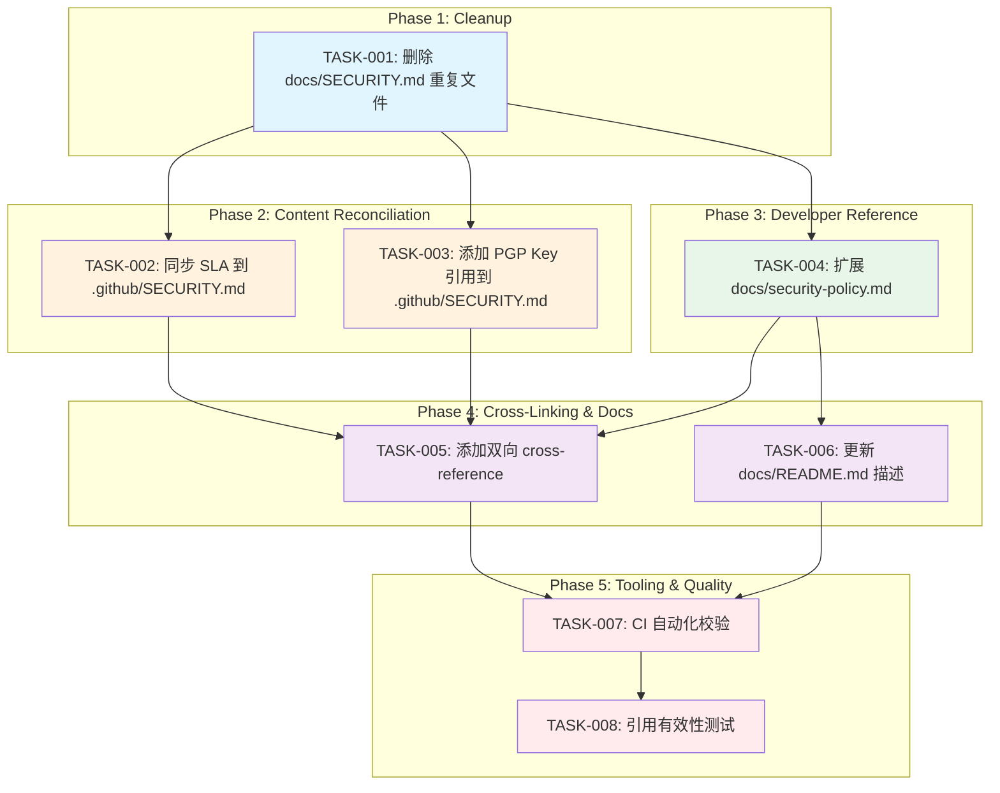
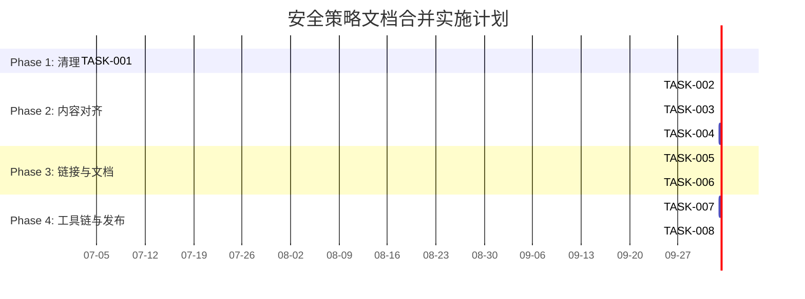

以下是对两个 SECURITY.md 文件合并/整理方案的 Tech Lead 分析。

---

# Tech Lead 分析报告：安全策略文档合并

## 现状诊断

通过文件审计发现实际有三份安全文档：

| 文件 | 用途 | 独有内容 |
|---|---|---|
| `.github/SECURITY.md` | GitHub 自动发现的外部披露策略 | 支持版本、SLA、Scope、Operator Checklist、CVE 协调 |
| `docs/SECURITY.md` | 与 `docs/security-policy.md` 字节相同 | —（纯重复） |
| `docs/security-policy.md` | 开发者的安全参考 | Hardened Areas 表、Fail-Open/Closed 矩阵、开发者 Checklist |

当前引用关系：
- `.github/CONTRIBUTING.md` → `.github/SECURITY.md`（✅ 正确）
- `docs/README.md` → `docs/security-policy.md`（✅ 正确）
- `docs/RELEASE.md` → `docs/security-policy.md`（✅ 正确）
- `.goreleaser.yaml` → `.github/SECURITY.md`（✅ 发布包应包含外部策略）
- 无人引用 `docs/SECURITY.md`

**根因**：`docs/SECURITY.md` 是 `docs/security-policy.md` 生成时的冗余副本，未被清理。

---

## 1. 任务分解

### 任务列表

| ID | 任务标题 | 方向 | 涉及文件 | 前置依赖 | 预估工时 |
|---|---|---|---|---|---|
| TASK-001 | 删除 `docs/SECURITY.md` 重复文件 | 整理 | `docs/SECURITY.md` | 无 | 0.5h |
| TASK-002 | 同步 SLA 到 `.github/SECURITY.md` | 内容对齐 | `.github/SECURITY.md` | TASK-001 | 1h |
| TASK-003 | 将 PGP Key 引用添加到 `.github/SECURITY.md` | 内容增强 | `.github/SECURITY.md` | TASK-001 | 0.5h |
| TASK-004 | 扩展 `docs/security-policy.md` 为完整开发者安全参考 | 内容重构 | `docs/security-policy.md` | TASK-001 | 3h |
| TASK-005 | 添加 cross-reference 链接（双向） | 内容对齐 | `.github/SECURITY.md`, `docs/security-policy.md` | TASK-002, TASK-004 | 0.5h |
| TASK-006 | 更新 `docs/README.md` 中对 `security-policy.md` 的描述 | 文档 | `docs/README.md` | TASK-004 | 0.5h |
| TASK-007 | 添加自动化校验（CI 中检查文档一致性） | 工具链 | `.github/workflows/ci.yml` or `Makefile` | TASK-001, TASK-002, TASK-003, TASK-004, TASK-005 | 2h |
| TASK-008 | 集成测试：验证所有文档引用有效 | 质量 | 测试脚本 | TASK-006 | 1h |

**总计预估工时：9 小时（约 1.5 人天）**

---

## 2. 执行顺序



**可并行执行的任务组（无需等待彼此）：**
- **TASK-002 + TASK-003**（修改同一文件 `SECURITY.md`，需协调，建议合并为一个 PR 提交）
- **TASK-002/003 + TASK-004**（修改不同文件，完全独立，可并行）

---

## 3. 技术风险

### 3.1 技术难点与不确定性

| 风险 | 等级 | 说明 | 缓解措施 |
|---|---|---|---|
| **SLA 差异的歧义风险** | **高** | `.github/SECURITY.md` 说 "3 business days ack"，`docs/SECURITY.md` 说 "24 hours"。若有人以 24h 标准期待而实际按 3 天回应，可能产生信任问题。 | 统一采用 3 business days（更现实，且 GitHub 通知的异步特性决定了人工响应需要更宽裕时间） |
| **PGP Key 可用性未知** | **中** | 引用 `https://snaplink.dev/.well-known/pgp-key.txt`，但不确定该端点是否已部署并可用。 | 添加 PGP key 前需验证域名解析和 HTTPS 端点；若不可用，暂时不添加引用 |
| **.goreleaser.yaml 引用** | **低** | `.goreleaser.yaml` 包含 `.github/SECURITY.md`。删除文件或改名会破坏发布构建。 | 保留 `.github/SECURITY.md`，只增强不删除 |
| **双向 cross-reference 导致内容漂移** | **中** | 两份文档若不同步维护，随着时间推移引用信息会过时。 | 用 CI 校验（TASK-007）自动化检测交叉引用的完整性 |

### 3.2 外部依赖

| 依赖项 | 用途 | 风险 |
|---|---|---|
| `snaplink.dev` 域名 + 服务器 | PGP key 端点可用性 | 若域名为预注册但未部署，则 PGP 引用是死链接 |
| GitHub Security Advisories 功能 | 首选报告渠道 | 无风险（GitHub 内置功能） |
| `.github/` 目录的 GitHub 自动识别 | GitHub 自动显示 repo 的安全策略 | 只有在 `.github/SECURITY.md` 存在时才会被识别为安全策略 |

### 3.3 性能考虑

此任务不涉及任何运行时性能。唯一需关注的"性能"是文档加载速度——文件大小均在 5KB 以内，无影响。

### 3.4 测试覆盖难点

- **文档内容一致性**：难以用传统单元测试覆盖。需要自定义脚本对比两个文件中的特定段落。
- **Cross-reference 完整性**：需正则解析 `see ...` 引用并验证文件存在性。

---

## 4. 资源评估

### 4.1 人员配置

| 角色 | 人数 | 职责 |
|---|---|---|
| Software Engineer (文档方向) | 1人 | 内容编辑、文件操作、PR 提交流程 |
| DevEx / Tooling Engineer | 0.5人 | CI 校验脚本编写（TASK-007） |
| **总人力** | **1.5 FTE** | 实际只需 1 人并行 + 0.5 人天工具链 |

### 4.2 关键里程碑

| 里程碑 | 时间点 | 交付物 |
|---|---|---|
| M1: 清理完成 | Day 1 AM | `docs/SECURITY.md` 已删除，`.github/SECURITY.md` 已更新 SLA + PGP |
| M2: 开发者参考就绪 | Day 1 PM | `docs/security-policy.md` 已扩展，包含 Hardened Areas + Fail-Open/Closed + Developer Checklist |
| M3: 交叉链接就绪 | Day 2 AM | 双向 cross-reference 已添加，`docs/README.md` 已更新 |
| M4: 工具链 + 发布 | Day 2 PM | CI 校验通过，PR 合并 |

### 4.3 阻塞点 (Blockers)

| Blocker | 影响 | 解决策略 |
|---|---|---|
| `snaplink.dev` 域名未上线 | 无法添加 PGP Key 引用 | 延迟 TASK-003 到域名上线后；先合并其他任务 |
| 需要安全团队审核 SLA 策略 | 所有内容对齐任务被阻塞 | 减少 SLA 差异消除步骤，先做纯粹的格式整理（TASK-001）和开发者内容（TASK-004） |

---

## 5. 质量保证

### 5.1 单元测试覆盖要求

| 目标 | 覆盖 | 说明 |
|---|---|---|
| CI 校验脚本 | 100% 功能覆盖 | 脚本本身（`scripts/check-docs-consistency.sh`）应测试文件存在性、交叉引用有效性 |
| Makefile target | N/A | 只需确保 `make check-docs` 正确调用脚本 |

### 5.2 集成测试策略

```
检查内容：
1. .github/SECURITY.md 存在且非空
2. docs/security-policy.md 存在且非空
3. docs/SECURITY.md 不存在（已删除）
4. .github/SECURITY.md 中不包含 "24 hours"（SLA 已同步）
5. .github/SECURITY.md 包含 "GitHub Security Advisories"
6. docs/security-policy.md 包含跨引用标记（如 "See .github/SECURITY.md"）
7. .github/SECURITY.md 包含跨引用标记（如 "See docs/security-policy.md"）
8. docs/README.md 中对 security-policy.md 的描述准确
```

实现方式：`bash scripts/check-docs-consistency.sh`

### 5.3 代码审查要点

| 审查项 | 重点 |
|---|---|
| SLA 时间统一 | 确认所有时间单位一致（business days vs calendar days vs hours） |
| 无内容丢失 | Compare 前后 `.github/SECURITY.md`：不应删除任何已存在的 Section |
| 文件名大小写 | `.github/SECURITY.md`（大写）与 `docs/security-policy.md`（小写）保持原有命名风格不变 |
| 引用路径正确性 | 相对路径根据文件位置计算是否正确 |
| `.goreleaser.yaml` 不受影响 | 确认发布构建配置未因变更而损坏 |
| Markdown 格式合规 | 表格对齐、列表嵌套、代码块标记等 |

### 5.4 性能测试需求

无。纯文本变更，无性能影响。

---

## 6. 实施计划

### 详细时间表

#### Phase 1：基础设施 & 清理（Day 1, 0.5h）

| 时间 | 活动 | 产出 |
|---|---|---|
| 09:00 - 09:15 | 审计所有引用，确认无遗漏依赖 | 安全地删除 `docs/SECURITY.md` |
| 09:15 - 09:30 | `git rm docs/SECURITY.md`，提交 | ✅ TASK-001 done |

#### Phase 2：核心内容对齐（Day 1, 2h）

| 时间 | 活动 | 产出 |
|---|---|---|
| 09:30 - 10:00 | 编辑 `.github/SECURITY.md` | TASK-002: 将 Response SLA 的 `24 hours` 更改为 `3 business days` |
| 10:00 - 10:30 | 编辑 `.github/SECURITY.md` | TASK-003: 添加 PGP key 引用（若可用） |
| 10:30 - 12:00 | 扩展 `docs/security-policy.md` | TASK-004: 保留原内容 + 添加从 `.github/SECURITY.md` 移植的 Supported Versions/Scope/Operator Checklist |
| 12:00 - 12:30 | Lunch break | — |

#### Phase 3：交叉链接 & 文档更新（Day 1, 1h）

| 时间 | 活动 | 产出 |
|---|---|---|
| 13:00 - 13:15 | 在 `.github/SECURITY.md` 尾部添加 "For architecture details, see `docs/security-policy.md`" | TASK-005 (1/2) |
| 13:15 - 13:30 | 在 `docs/security-policy.md` 头部添加 "For vulnerability disclosure, see `.github/SECURITY.md`" | TASK-005 (2/2) |
| 13:30 - 14:00 | 更新 `docs/README.md` 中对 `security-policy.md` 的描述 | TASK-006 |

#### Phase 4：工具链 & 验收（Day 2, 3h）

| 时间 | 活动 | 产出 |
|---|---|---|
| 09:00 - 10:30 | 编写 `scripts/check-docs-consistency.sh` | TASK-007 |
| 10:30 - 11:00 | 添加 Make target `check-docs` 并挂载到 CI | TASK-007 |
| 11:00 - 12:00 | 运行 full acceptance suite | TASK-008: 验证所有引用有效 |
| 13:00 - 14:00 | PR 提交流程 + 审核 + 合并 | 发布 |

### 甘特图



---

## 附录：推荐版本的文件结构（最终状态）

### 两份文档的角色分工

```
.github/SECURITY.md                    docs/security-policy.md
┌─────────────────────────┐            ┌──────────────────────────────┐
│ 外部漏洞报告策略         │  ←——→     │ 内部安全参考文档             │
│                         │ cross-ref  │                              │
│ • 报告方式（GitHub Ad） │            │ • Hardened Areas 表          │
│ • 响应 SLA              │            │ • Fail-Open/Fail-Closed 矩阵 │
│ • Supported Versions    │            │ • 开发者安全 Checklist       │
│ • Scope / Out-of-scope  │            │ • Operator Hardening Checklist│
│ • CVE 协调              │            │ • 架构详图（引用代码位置）   │
│ • PGP Key（可选）       │            │                              │
│ • 交叉引用 → docs/      │            │ • 交叉引用 → .github/       │
└─────────────────────────┘            └──────────────────────────────┘
```

### 操作建议

1. **首选方案**：采纳 Option 2（单一权威版本），但更精确地说是 **Two authoritative documents with clear role separation**。两份文档各自为不同受众服务，且通过 cross-reference 互相指向。

2. **不要做**：不要将两份文档合并为一份。外部漏洞披露策略（面向安全研究员）和内部安全架构参考（面向开发者）的读者不同，合并会降低两者的可读性。

3. **近期可立即执行的一步**：删除 `docs/SECURITY.md`（0 风险，0 依赖），然后根据域名状态决定是否将 PGP 引用加入 `.github/SECURITY.md`。
