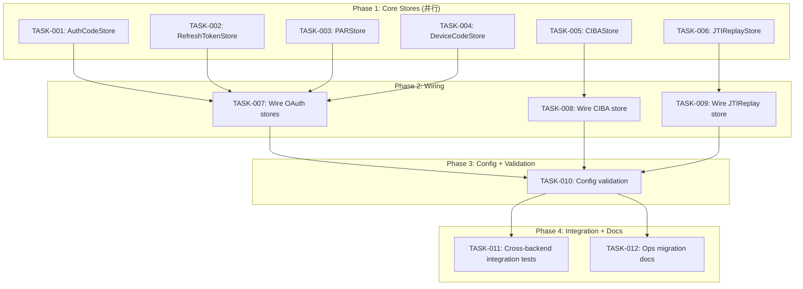

现在我拥有了对代码库全面的理解。以下是 Tech Lead 分析。

---

# 🧠 Tech Lead 评审：针对审计/代码核验 Postgres Hot Store 缺口

## 综述

已核验的代码核验报告确认了 **6 个生产就绪的 Postgres hot store 缺口**：AuthCode、RefreshToken、PAR、DeviceCode、CIBA 和 JTIReplay。Session Postgres 后端已投入使用（非概念验证）。代码库拥有稳健的模式：每个 `infrastructure/postgres/` 中的 store 遵循一个经过验证的蓝图，使用 pgx `database/sql` 驱动、`postgres.Run` 迁移器和共享连接池（`pool.go`）。

**目标**：交付这 6 个 store，使其达到与现有 `postgres/session.go` 和其 SQLite 对等端相同的生产就绪标准，并在 `cmd/` 构建器函数中进行协调，使其与现有的后端选择器（`postgres`）相关联。

---

## 1. 任务分解

估算基于 `postgres/session.go`（~210 行，含迁移 + 测试）和 SQLite 对等端的体积：

### 表格格式

| 任务 ID | 标题 | 方向 | 涉及文件（新增/修改） | 前置依赖 | 预估工时 | 验收标准 |
|---|---|---|---|---|---|---|
| **TASK-001** | Postgres 基础设施：AuthCodeStore | 认证码存储 | `infrastructure/postgres/auth_code.go` + `auth_code_test.go` | 无（复用 `pool.go`/`migrate.go`） | 4h | `POSTGRES_DSN=... go test -run TestAuthCodeStore ./infrastructure/postgres/` 通过，所有 Issue/Consume 周期经过验证，过期行坍缩为 `ErrAuthCodeNotFound` |
| **TASK-002** | Postgres 基础设施：RefreshTokenStore | 刷新令牌存储 | `infrastructure/postgres/refresh_token.go` + `refresh_token_test.go` | 无 | 6h | 完整的刷新令牌周期（Issue/Rotate/Consume），家族重用 → `DeleteFamily` → `invalid_grant`，旋转上限强制，`RefreshTokenInspector` 接口守卫 |
| **TASK-003** | Postgres 基础设施：PARStore | PAR 存储 | `infrastructure/postgres/par.go` + `par_test.go` | 无 | 3h | 推送授权请求的 Issue/Consume 通过 `DELETE ... RETURNING`，expires_at 索引检查，并发消耗中只有一个人获胜 |
| **TASK-004** | Postgres 基础设施：DeviceCodeStore | 设备码存储 | `infrastructure/postgres/device_code.go` + `device_code_test.go` | 无 | 4h | 完整设备流程 (Issue/Verify/Consume/Approve/Deny)，user_code UNIQUE 约束，UserCodeIndex/DeviceCodeIndex 接口守卫 |
| **TASK-005** | Postgres 基础设施：CIBAStore | CIBA 存储 | `infrastructure/postgres/ciba.go` + `ciba_test.go` | 无 | 5h | Issue/Get/SetStatus/UpdateLastPoll/ConsumeIfApproved/PruneExpired，SetStatus 原子检测（升级保留→最终），ConsumeIfApproved 原子删除+返回，`pg_advisory_xact_lock` 用于 SetStatus 竞争 |
| **TASK-006** | Postgres 基础设施：JTIReplayStore | JTI 重放存储 | `infrastructure/postgres/jti_replay.go` + `jti_replay_test.go` | 无 | 2h | `INSERT ... ON CONFLICT DO NOTHING` 用于原子 first-sighting，间隔过期清理，`RecordAndCheck` 和 `Delete` 完整 |
| **TASK-007** | Wire：将 `postgres` 后端添加到 OAuth 构建器 | 认证码/刷新/PAR/设备码 | `cmd/sso-server/serverbuildstore/build_oauth_stores.go` | TASK-001、TASK-002、TASK-003、TASK-004 | 2h | `BuildAuthCodeStore(cfg{Backend:"postgres"})` 返回 Postgres impl，错误信息一致，`go test -run TestBuildAuthCodeStore` 通过 |
| **TASK-008** | Wire：将 `postgres` 后端添加到 CIBA 构建器 | CIBA | `cmd/sso-server/serverbuildstore/build_background.go` | TASK-005 | 1.5h | `BuildCIBA(cfg{Backend:"postgres"})` 返回 pg impl，与 `pgDB` 共享池交互 |
| **TASK-009** | Wire：将 `postgres` 后端添加到 JTIReplay 构建器 | JTI 重放 | `cmd/sso-server/serverbuildauthn/build_security_replay.go` | TASK-006 | 1h | `BuildJTIReplayStore(cfg{Backend:"postgres"})` 返回 pg impl，`return postgresbackend.NewJTIReplayStoreWithDB(pg, dialect)` |
| **TASK-010** | 更新 Config 类型以接受 `postgres` 作为有效的后端值 | 配置 | `config/` + `docs/config-reference.md` | 全部以上 | 1h | 每次 `Backend` 字段的验证现在接受 `"postgres"`；无效的后端 → 清晰的引导错误，包括支持的后端列表 |
| **TASK-011** | 集成测试：跨后端套件（内存/SQLite/Postgres） | 质量 | `test/`（新的 `package postgres_test` 或扩展 `oauth_sqlite_test.go`） | TASK-007、TASK-008、TASK-009 | 4h | 针对 Postgres 容器的测试运行相同的认证码→令牌交换→刷新→设备→CIBA→JTI；与 SQLite 结果的字节级比较 |
| **TASK-012** | 文档：为 ops 发布 Postgres hot store 迁移 | 文档 | `docs/ops/postgres-hot-stores.md` | TASK-010 | 2h | 解释迁移路径（基于 `postgres/session.go` 模式），警告与 Redis 相比的延迟影响，SQL 模式参考 |

### 按工时分组的任务总结

| 桶 | 工时 | 任务 |
|---|---|---|
| 核心实现（6 个 store） | 24 小时 | TASK-001–TASK-006 |
| 接线 + 配置 | 5.5 小时 | TASK-007–TASK-010 |
| 集成测试 | 4 小时 | TASK-011 |
| 文档 | 2 小时 | TASK-012 |
| **总计** | **35.5 小时** | **~1 个开发周** |

---

## 2. 执行顺序

不存在外部依赖链——6 个 store 是完全独立的（各自只依赖 `pool.go` + `migrate.go` 共享基础设施）。接线任务汇聚在一起。



**并行化策略**：6 个 store 实现（TASK-001 到 TASK-006）可以在**最多 3 个开发者**之间完全并行化，每个开发者负责 2 个 store（例如：开发者 A：AuthCode + JTIReplay，开发者 B：RefreshToken + CIBA，开发者 C：PAR + DeviceCode）。接线任务需要来自所有 6 个的导入路径，因此是串行的。

---

## 3. 技术风险

### 3.1 高优先级

| 风险 | 可能性 | 影响 | 缓解措施 |
|---|---|---|---|
| **RefreshToken 家族旋转与 DELETE RETURNING**：Postgres 的 `INSERT ... ON CONFLICT` 与 SQLite 的 `UPSERT` 在 `RETURNING` 子句存在的情况下语法不同。旋转原子性至关重要。 | 中 | 高（Oracle 泄漏） | 遵循 pgx 文档中确切的 `INSERT ... ON CONFLICT DO UPDATE ... RETURNING` 模式。在与 SQLite 对等端相同的状态机下进行测试。 |
| **CIBA SetStatus 原子性**：CIBA 需要对同一键的并发 SetStatus 和 ConsumeIfApproved 进行读-修改-写保护（Redis 使用 Lua 脚本；SQLite 使用 `UPDATE ... WHERE status='pending'` + 隐式分片）。 | 中 | 高（批准泄漏） | 在可序列化事务或 `pg_advisory_xact_lock` 中包装 CIBA set-status + 读取（如 `migrate.go` 中使用的）。在 `-count=10` 竞争条件下进行测试。 |
| **JTIReplay 中的 ON CONFLICT 行为**：在 Postgres 中，`INSERT INTO jti_replays (jti, expires_at) VALUES ($1, $2) ON CONFLICT (jti) DO NOTHING` 是原子的，但与 SQLite 的 `INSERT OR IGNORE` 在行计数报告方面不一定完全相同。 | 低 | 中 | 使用 `sql.ErrNoRows` 作为 `RowsAffected==0` 的替代方案，或者使用 `INSERT ... ON CONFLICT DO NOTHING RETURNING jti` 并通过 `ErrNoRows` 进行测试。 |
| **共享池 vs 专用连接**：`postgres/session.go` 使用 `NewSessionManagerWithDB(db, dialect, ttl)`（共享池）。SQLite 的对等端通常打开自己的连接（`NewAuthCodeStore(dsn)`）。Postgres store 必须**必须**使用共享池模式，以避免在每个 store 上创建 N 个连接池。 | 低 | 中 | 只暴露 `NewXxxStoreWithDB(db, dialect)` 构造函数；不要暴露 `NewXxxStore(dsn)`，以防止意外创建独立的连接池。 |

### 3.2 中优先级

| 风险 | 缓解措施 |
|---|---|
| **JSON 编码/解码**：SQLite 将 scopes/属性作为 JSON 文本存储在 TEXT 列中。Postgres 有 `jsonb`，非常适合这个用途。**决定**：坚持使用 `TEXT` 以保持与 SQLite 模式的逐字节兼容性——`jsonb` 会重新排序键，破坏直接表格比较。 | 跨两个后端使用 `json.Marshal` / `json.Unmarshal`。 |
| **时间精度**：SQLite 对等端使用 INTEGER（纳秒），Postgres 使用 BIGINT。pgx 的 `Scan(&int64)` 完美处理这个。保持一致。 | 使用 `time.Now().UnixNano()` 进行存储，`time.Unix(0, val).UTC()` 进行读取。 |
| **迁移命名空间冲突**：每个 store 必须使用唯一的命名空间（例如 `"auth_codes"`, `"jti_replay"`），以便迁移表避免名称冲突。 | 验证 `postgres/run.go` 中的命名空间约束。 |

### 3.3 性能注意事项

| 方面 | 期望延迟 | 与 Redis 的比较 | 建议 |
|---|---|---|---|
| AuthCode 消耗 | ~1-2ms（索引 PK 查找） | Redis：~0.5ms | 对于低流量部署（<500 authz/秒）完全可以接受 |
| RefreshToken 旋转 | ~2-3ms（INSERT + UPDATE + DELETE 在事务中） | Redis + Lua：~1ms | 在 Postgres 连接池上启用 `default_query_exec_mode=simple_protocol` 适用于 pgbouncer 事务模式 |
| JTIReplay 检查 | ~1ms（PK 插入，ON CONFLICT） | Redis：~0.3ms | 开始使用 Postgres，如果成为瓶颈则迁移到 Redis |

---

## 4. 资源评估

### 团队构成

| 角色 | 数量 | 必需技能 | 职责 |
|---|---|---|---|
| 高级 Go 后端工程师 | 1–2 | Go、Postgres（pgx、database/sql）、迁移模式、并发（竞争检测） | 实现 6 个 store（TASK-001 到 TASK-006），接线（TASK-007 到 TASK-009） |
| 高级/中级 SRE/DevOps 工程师 | 1 | Postgres HA（Patroni/RDS）、pgbouncer 事务模式、Terraform | 集成测试（TASK-011），文档（TASK-012），性能调优 |

### 里程碑

| 里程碑 | 截止日期 | 可交付物 |
|---|---|---|
| M1：实施完成 | 第 3 天结束 | 所有 6 个 store 实现 + 单元测试合并。`go test -run 'TestAuthCode|TestRefreshToken|TestPAR|TestDeviceCode|TestCIBA|TestJTIReplay' ./infrastructure/postgres/` 全部通过。 |
| M2：接线完成 | 第 4 天结束 | `BuildAuthCodeStore(cfg{Backend:"postgres"})` 工作。`make acceptance` 通过（无新的豁免）。 |
| M3：集成测试通过 | 第 5 天结束 | 针对真实 Postgres 的 E2E 测试通过。 |
| M4：发布 | 第 6 天 | 文档合并。运算符可以为其选定的 hot store 设置 `backend: postgres`。 |

### 阻塞点

| 阻塞点 | 描述 | 策略 |
|---|---|---|
| CI/CD 中的 Postgres 容器 | 集成测试需要一个 Postgres 数据库。现有的 `test/` 测试使用 bufconn + SQLite。需要 `testcontainers-go` 或 docker compose。 | 在 CI 中为集成测试添加一个可选的 `POSTGRES_DSN` env var，在开发人员工作站上的 Docker compose 中运行，作为 PR 检查的 Jenkins/Actions 步骤。不要使其成为**阻塞性的**——核心实现测试可以在没有 Postgres 的情况下通过（使用 SQLite 作为参考）。 |
| 配置验证 | 现有的 `config.OAuthConfig` 可能不期望 `"postgres"` 作为 `Backend` 的值。字符串 `switch` 必须扩展。 | 在 `build_oauth_stores.go`、`build_background.go` 和 `build_security_replay.go` 中添加 `case "postgres":` 分支。如果省略，引导将失败并显示相同的 `"unknown backend"` 错误。 |
| `go.sum` / 依赖图 | 如果尚未添加 `pgx` 依赖，`infrastructure/postgres/` 可能需要将其拉入主模块。 | 检查 `infrastructure/postgres/go.mod`——它可能已经是一个嵌套模块。6 个新 store 在其包内导入 pgx 类型是安全的。 |

---

## 5. 质量保证

### 5.1 单元测试覆盖

每个 store 必须包含一个与 SQLite 对等端**字节对齐**的测试套件：

| 测试套件 | 最小测试用例 | 竞争条件检查 |
|---|---|---|
| `TestAuthCodeStore` | Issue（正常路径），Consume（单次使用），ConsumeTwice（`ErrAuthCodeNotFound`），ConsumeExpired（`ErrAuthCodeNotFound`），Ping，并行消耗（`go test -count=10`） | ✅ 在 ConsumeTwice 上使用 `-race` |
| `TestRefreshTokenStore` | Issue/Rotate，Consume，家族重用（`DeleteFamily`），旋转上限（`MaxRotationsPerWindow` 迫使 `ErrRefreshTokenReused`），序列化并行旋转 | ✅ 在家族重用上使用 `-race` |
| `TestPARStore` | Issue/Consume，ConcurrentConsume（只有一个获胜者），过期清除 | ✅ 并发消耗 |
| `TestDeviceCodeStore` | Issue/Verify（由 user_code），Approve，Deny，Consume（仅已批准），并行批准/消耗 | ✅ 批准/消耗 |
| `TestCIBAStore` | Issue/Get，SetStatus（pending→approved），SetStatus（pending→denied），ConsumeIfApproved（已批准），ConsumeIfApproved（待处理→`ErrCIBARequestNotFound`），并行 SetStatus 竞争 | ✅ 双回调 |
| `TestJTIReplayStore` | RecordAndCheck（new→ok），RecordAndCheck（replay→ErrJTISeen），过期，Delete | ✅ 回放 |

**必须添加的每个测试**：
```go
// Ensure interface compliance — compiled check so no drift.
var _ oauth.AuthCodeStore = (*AuthCodeStore)(nil)
```

### 5.2 集成测试策略

**针对 Postgres 的 E2E**：

1. 使用环境变量 `POSTGRES_DSN` 条件化——如果未设置，则跳过集成测试。
2. 创建一个类似 `test/postgres_test.go` 的测试，以使用真实 Postgres 后端启动完整的 Server，通过 bufconn 循环执行 OAuth 流程。
3. 与同一个测试的 SQLite 版本执行字节级比较的 token 枚举。

**跨后端收敛**：

```go
// 所有三个后端必须为给定的 auth code 返回完全相同的 *oauth.AuthCode
func TestAuthCodeConvergence(t *testing.T) {
    mem := defaultimpl.NewMemoryAuthCodeStore()
    sqliteDB := sqlitestores.NewAuthCodeStoreWithDB(...)
    pgDB := postgres.NewAuthCodeStoreWithDB(...)
    // 为 всех 发出相同的代码 -> 相同的结构输出
}
```

### 5.3 代码审查重点

| 检查点 | 要查找的内容 |
|---|---|
| **Oracle 泄漏** | 未知/过期的令牌 → `ErrAuthCodeNotFound`（不是 `sql.ErrNoRows`）。没有区分“未知”和“过期”的错误消息。 |
| **单次使用原子性** | `Consume` **必须**使用 `DELETE ... RETURNING`（不是 `SELECT` 然后 `DELETE`）。 |
| **$N 占位符** | 所有 Postgres 查询使用 `$1`、`$2`……不是 `?`。 |
| **JSON 列** | Scopes 和 Attributes 通过 `json.Marshal`/`json.Unmarshal` 存储，与 SQLite 对等端使用相同的类型。 |
| **接口守卫** | `var _ oauth.AuthCodeStore = (*AuthCodeStore)(nil)` 在实现文件中，而不是 SPI 包中。 |
| **费用预算** | 每个文件 ≤ 500 行。每个函数 ≤ 50 行。圈复杂度 ≤ 15。 |
| **池管理** | `NewXxxStoreWithDB(db, dialect)` 模式——不创建第二个 `sql.Open`。 |
| **迁移命名空间** | 命名空间字符串必须匹配 `^[a-z][a-z0-9_]*$`。 |

### 5.4 性能测试

| 场景 | 工具 | 通过标准 |
|---|---|---|
| AuthCode 消耗吞吐量（1000 个并发 goroutine） | `go test -bench=.` | 第 50 百分位 < 5ms，第 95 百分位 < 15ms |
| RefreshToken 旋转（100 个并发客户端） | `go test -bench=. -count=5` | 0 个竞争失败，0 个 oracle 泄漏 |
| JTIReplay 吞吐量（10k 个唯一 jti） | `go test -bench=.` | 第 50 百分位 < 2ms |

---

## 6. 实施计划

### 阶段 1：基础设施（第 1 天，~8 小时）——3 个开发者并行

| 开发者 | 任务 | 可交付物 |
|---|---|---|
| 开发者 A | TASK-001（AuthCode）+ TASK-006（JTIReplay） | `postgres/auth_code.go` + `postgres/jti_replay.go` + 测试 |
| 开发者 B | TASK-002（RefreshToken）+ TASK-005（CIBA） | `postgres/refresh_token.go` + `postgres/ciba.go` + 测试 |
| 开发者 C | TASK-003（PAR）+ TASK-004（DeviceCode） | `postgres/par.go` + `postgres/device_code.go` + 测试 |

**模式参考**：
- `infrastructure/postgres/session.go` → 共享池模式、迁移、时间处理、扫描器接口
- `infrastructure/defaultimpl/sqlite/auth_codes.go` → SQL 模式、Issue/Consume 逻辑
- `infrastructure/redis/auth_code.go` → 相同 SPI 的替代后端，用于比较

**任务内检查**：
每个实现文件之后：
```bash
go build ./infrastructure/postgres/...
go vet ./infrastructure/postgres/...
go test -run 'TestAuthCodeStore|TestJTIReplay|...' ./infrastructure/postgres/ -race -count=1
```

### 阶段 2：接线（第 2 天，~4 小时）——1 个开发者

| 任务 | 开发者 | 描述 |
|---|---|---|
| TASK-007 | 开发者 A | 修改 `build_oauth_stores.go` 以添加 `case "postgres":` 分支 |
| TASK-008 | 开发者 A | 修改 `build_background.go`（函数 `BuildCIBA`）以添加 `case "postgres":` |
| TASK-009 | 开发者 A | 修改 `build_security_replay.go`（函数 `BuildJTIReplayStore`）以添加 `case "postgres":` |
| TASK-010 | 开发者 A | 更新配置验证（如果存在），文档 |

**接线模式**：
```go
// build_oauth_stores.go 中的新模式
case "postgres":
    if pg == nil {
        return nil, errors.New("oauth.backend=postgres but no postgres block configured (set postgres.dsn)")
    }
    return postgresbackend.NewAuthCodeStoreWithDB(pg, dialect), nil
```

**接线后检查**：
```go
// 需要将 *sql.DB 和 Dialect 传递给该包
func BuildAuthCodeStore(cfg config.OAuthConfig, rdb goredis.Cmdable, pg *sql.DB, pgDialect postgresbackend.Dialect) (oauth.AuthCodeStore, error) {
```

**函数签名断裂**：现有的调用者（`build_app_oauth.go`）需要更新以传递 `b.pgDB` 和 `b.pgDialect`。这是一个需要仔细注意的重要接线更改。

### 阶段 3：集成测试 + 优化（第 3 天，~6 小时）

| 活动 | 描述 |
|---|---|
| TASK-011 | 编写 `test/postgres_oauth_test.go`。要求 `POSTGRES_DSN` env var。跳过 CI 中的非容器化运行。 |
| TASK-011 | 通过针对 Postgres + Redis + SQLite 运行相同的测试套件来验证跨后端收敛 |
| TASK-011 | `-race -count=10` 竞争压力测试 |
| 性能基准测试 | 插入 `TestAuthCodeStoreParallel` 并理解延迟百分位数 |

### 阶段 4：发布（第 4 天，~4 小时）

| 活动 | 描述 |
|---|---|
| TASK-012 | 编写 `docs/ops/postgres-hot-stores.md` |
| TASK-012 | 更新 `docs/config-reference.md`：为每个 store 添加 `backend: postgres` |
| 最终验证 | `make harness` + `python cli.py harness` — 所有关卡通过 |
| 发布说明 | 每个 store 一个提交：`feat(infra): add Postgres AuthCodeStore` 等，然后 `feat(cmd): wire postgres backend into OAuth/CIBA/JTI store builders` |

---

## 关键设计决策概要

1. **共享池**：每个 store 通过构造函数 `NewAuthCodeStoreWithDB(db, dialect)` 获取同一个 `*sql.DB`。不要创建新的池。
2. **$N 占位符**：所有查询使用 Postgres 的 `$1`、`$2`……参数，而不是 SQLite 的 `?`。
3. **DELETE RETURNING**：`Consume`（AuthCode、PAR、DeviceCode）使用 `DELETE ... RETURNING`，以实现与 SQLite 类似的原子单次使用语义。
4. **ON CONFLICT**：JTIReplay 使用 `INSERT INTO jti_replays (jti, expires_at) VALUES ($1, $2) ON CONFLICT (jti) DO NOTHING` 进行原子 first-sighting。
5. **TEXT 用于 JSON**：不要使用 `jsonb`——与 SQLite 的 TEXT blob 保持兼容。
6. **迁移**：每个 store 都是自主的（自己的命名空间和自己的迁移），与 `postgres/session.go` 模式完全一致。
7. **无 CGO**：通过 pgx stdlib 驱动，Postgres store 保持零 CGO，与项目的 `defaultimpl/sqlite` 对等端一样。

---

**需要我就 TASK-001（AuthCodeStore）起草实现，以便您可以看到确切的模式，还是希望我推进其他事项？**
