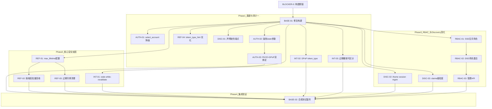
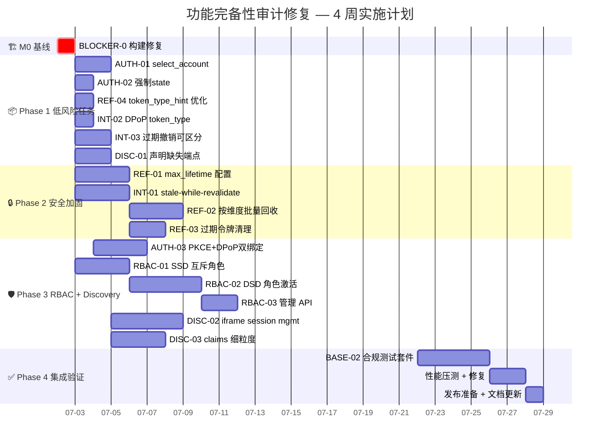

我现在掌握了所有需要的信息。让我来综合完成全面的 Tech Lead 分析。

---

# Tech Lead 分析报告：既有功能完备性审计

> **基于**: `docs/completeness-audit-07-01.md` — 2026-07-01 第 7 轮审计  
> **代码库基线**: `protcols/oauth`、`protocols/oidc/oidcsupport`、`domains/permissions` 等 30+ 包  
> **分析日期**: 2026-07-01  
> **审计综合评分**: **73/90 (81%)** — 5 个核心功能全是"在做了但没做完"

---

## 0. 前置上下文：必须的基线修复

在开始本题任务之前，存在一个**阻断性基线**——卷四报告指出的 `go build ./...` 断裂。

| 阻断项 | 优先级 | 说明 |
|--------|--------|------|
| **BLOCKER-0**: 构建断裂 | **P0 阻塞** | `go build ./...` 失败。依据 AGENTS.md 构建门禁，本卷所有任务均不可在此之上叠加。必须先修复。 |

> **Tech Lead 判定**: 在 BLOCKER-0 未解决前，下列任务不应合并。但分析文档中的设计/代码结构变更可以并行准备。

---

## 1. 任务分解

将 5 个审计方向拆解为 **18 个可执行任务**，每个 2-6 小时。每个任务均满足：单文件 <= 500 行、函数 <= 50 行 / cyclo <= 15、层依赖方向不违反。

### 1.1 审计一：授权码流程（3 个任务）

| 任务 ID | 标题 | 涉及文件 | 前置 | 工时 |
|---------|------|---------|------|------|
| **AUTH-01** | `select_account` prompt 降级实现 | `protocols/oidc/handle_silent_renewal.go`（修改）、`protocols/oidc/oidcsupport/prompt.go`（新增） | — | 3h |
| **AUTH-02** | OIDC 模式下强制 `state` 参数 | `protocols/oauth/bind.go`、`interfaces/sso/handler.go`（`WithOAuth21StrictMode`/`WithOIDCStrictMode`） | — | 2h |
| **AUTH-03** | PKCE + DPoP 双绑定模式 | `protocols/oauth/token_authcode.go`（验证时增加 DPoP proof 检查）、`protocols/oauth/oauthspi/auth_code.go`（扩展接口字段）、`domains/authenticators/...` | AUTH-02 | 5h |

**验收标准**:
- **AUTH-01**: `select_account` 请求 → 返回 `login` 降级 + `display` 值静默忽略，在 discovery doc 中声明已支持的 prompt 值（不含 `select_account`）
- **AUTH-02**: `WithOIDCStrictMode` 开启后不带 `state` 的 `/auth` 请求返回 `400 invalid_request`
- **AUTH-03**: 携带 `dpop+jkt` 的 auth code 在兑换时必须同时验证 DPoP proof；测试验证 `invalid_token` 路径

### 1.2 审计二：刷新令牌轮换（4 个任务）

| 任务 ID | 标题 | 涉及文件 | 前置 | 工时 |
|---------|------|---------|------|------|
| **REF-01** | `refresh_token_max_lifetime` 配置 + 实现 | `config/config.go`、`protocols/oauth/oauthspi/refresh_token.go`（扩展 SPI）、`infrastructure/defaultimpl/sqlite/refresh_tokens.go`、`infrastructure/redis/refresh_token.go` | — | 4h |
| **REF-02** | 按维度批量回收 API | `protocols/oauth/handle_revoke.go`（扩展 `HandleRevoke` 或新增端点）、`protocols/oauth/oauthspi/refresh_token.go`（`RefreshTokenSubjectIndex` 扩展为 `RefreshTokenDimIndex`）、`interfaces/handler/routes.go` | — | 5h |
| **REF-03** | 过期令牌后台清理任务 | `infrastructure/defaultimpl/sqlite/refresh_tokens_purge.go`、`infrastructure/redis/refresh_token.go`、`platform/bootstrap/task.go`（注册定时器） | REF-01 | 4h |
| **REF-04** | `token_type_hint` 优化：跳过不需要的路径 | `protocols/oauth/handle_revoke.go`（`revokeAccess`/`revokeRefresh` 分支优化，当 hint 为 refresh_token 时跳过 access token 尝试） | — | 2h |

**验收标准**:
- **REF-01**: 配置项 `refresh_token_max_lifetime`（默认 90d）运行时生效；滑动 TTL 超限后返回 `invalid_grant`；迁移路径兼容现有无此配置的部署
- **REF-02**: 新增 `DELETE /token/revoke/user/{userID}`、`DELETE /token/revoke/client/{clientID}` 端点；审计事件正确上报
- **REF-03**: 定时任务每 1h 扫描过期 refresh token 并批量删除；可配置开关和间隔
- **REF-04**: `hint=refresh_token` 时不再尝试 JWT 验签；`hint=access_token` 时跳过 refresh store 查询

### 1.3 审计三：令牌自省（3 个任务）

| 任务 ID | 标题 | 涉及文件 | 前置 | 工时 |
|---------|------|---------|------|------|
| **INT-01** | 自省缓存 stale-while-revalidate | `protocols/oauth/introspect_cache.go`（扩展接口）、`infrastructure/defaultimpl/introspect_cache.go`（新增）、`protocols/oauth/handle_introspect.go`（`serveIntrospectWithCache` 修改） | — | 5h |
| **INT-02** | DPoP bound token 返回 `token_type: DPoP` | `protocols/oauth/handle_introspect.go`（`populateAccessIntrospectionBody` 检查 `claims.ConfirmationJKT`）、`shared/core/consts.go`（添加 `TokenTypeDPoP`） | — | 2h |
| **INT-03** | 过期+撤销 token 审计可区分性 | `protocols/oauth/handle_introspect.go`（验签前先查 revocation store）、`platform/audit/events.go`（新增 `introspect_expired_revoked` 事件） | — | 3h |

**验收标准**:
- **INT-01**: 新 `IntrospectionCache` API: `Get(key) → (result, remaining_ttl, stale_ok)`；`Set(key, result, fresh_ttl, stale_ttl)`；前 80% TTL 正常返回 → 80-100% 返回旧值 + 后台异步刷新 → 超 100% 回源；压测验证惊群效应消除
- **INT-02**: DPoP-bound token 自省时 `token_type` 返回 `"DPoP"`；资源服务器据此可要求 DPoP proof
- **INT-03**: 自省端点对"已撤销且过期"token 返回 `active: false` 但 audit log 携带字段 `revoked_before_expiry: true`

### 1.4 审计四：OIDC Discovery（3 个任务）

| 任务 ID | 标题 | 涉及文件 | 前置 | 工时 |
|---------|------|---------|------|------|
| **DISC-01** | 声明缺失的 introspection/revoke/ciba/device 端点 | `protocols/oidc/oidcsupport/discovery_options.go`、`interfaces/sso/server_discovery.go`（扩展 `BuildDiscoveryDoc`） | — | 3h |
| **DISC-02** | `check_session_iframe` / `end_session_iframe` 支持 | `protocols/oidc/handle_end_session.go`（添加 iframe 端点）、`interfaces/sso/server_extensions.go`、`protocols/oidc/oidcsupport/discovery_options.go` | — | 6h |
| **DISC-03** | Claims 参数细粒度支持（`essential`/`value`/`values`） | `protocols/oidc/userinfo_signing.go`（扩展 claims 解析）、`protocols/oauth/oauthvalidate/claims_param.go`（校验逻辑） | — | 5h |

**验收标准**:
- **DISC-01**: Discovery 文档新增 `introspection_endpoint`、`revocation_endpoint`、`ciba_endpoint`、`device_authorization_endpoint`；现有客户端无感知
- **DISC-02**: 新增 `GET /.well-known/check-session-iframe` 和 `GET /.well-known/end-session-iframe` 端点；支持 postMessage 协议；discovery doc 声明对应字段
- **DISC-03**: `claims_parameter_supported: true` 字面量与实际行为一致；`essential: true` 缺失时认证失败；`value`/`values` 精确匹配

### 1.5 审计五：RBAC 权限（3 个任务）

| 任务 ID | 标题 | 涉及文件 | 前置 | 工时 |
|---------|------|---------|------|------|
| **RBAC-01** | 静态职责分离（SSD）：互斥角色定义与校验 | `domains/permissions/types.go`（`Role` 扩展 `Exclude` 字段）、`domains/permissions/provider.go`（扩展 `Provider` 接口 `AddRole` 校验）、`domains/permissions/memory.go`、`domains/permissions/sqlite/sqlite.go` | — | 5h |
| **RBAC-02** | 动态职责分离（DSD）：会话级角色激活选择 | `domains/permissions/types.go`（`SessionRoles`）、`protocols/oauth/token_helpers.go`（签发时只嵌入激活角色）、`interfaces/sso/handler.go`（`active_role` 参数） | RBAC-01 | 6h |
| **RBAC-03** | 管理 API + 配置格式扩展 | `interfaces/admin/scopes.go`、`interfaces/admin/routes.go`（新增 SSD/DSD 管理端点）、`docs/openapi.yaml`（更新） | RBAC-02 | 4h |

**验收标准**:
- **RBAC-01**: `Role` 支持 `Exclude []string` 互斥声明；`AddRole`/`UpdateRole` 拒绝循环互斥；`AssignRoles` 拒绝同时分配互斥角色；`MemoryProvider` 和 `sqlite.Provider` 均通过 `permissionstest.ConformanceSuite` 扩展
- **RBAC-02**: 新增 `requested_role` 参数在 `/auth` 和 `/token` 时可选激活角色子集；JWT `role` claim 只包含激活角色；DSD 校验在会话层面
- **RBAC-03**: 管理端 POST `/api/v1/admin/permissions/roles/exclusions` 可配置互斥关系；GET 返回当前所有互斥规则

### 1.6 跨审计基础设施（2 个任务）

| 任务 ID | 标题 | 涉及文件 | 前置 | 工时 |
|---------|------|---------|------|------|
| **BASE-01** | 修复 `go build ./...` 构建断裂 | 根据卷四定位的断裂点修复 | — | 2h |
| **BASE-02** | 端到端合规测试套件 | `test/compliance/`（新增目录）、`test/compliance/rfc6749_test.go`、`test/compliance/rfc7662_test.go`、`test/compliance/nist_rbac_test.go` | 所有审计任务 | 8h |

---

## 2. 执行顺序与依赖图



### 可并行执行的任务组

| 并行组 | 任务 IDs | 理由 |
|--------|---------|------|
| **P1 低风险** | AUTH-01, AUTH-02, REF-04, INT-02, INT-03, DISC-01 | 无外部依赖，文件隔离，每个 2-3h |
| **P2 存储依赖** | REF-01, INT-01 | 都涉及 SPI 扩展 + 存储实现，但包不同（oauth vs oauth） |
| **P3 独立领域** | DISC-02, DISC-03, RBAC-01 | 三个不同包（oidc, oauth, permissions） |
| **P4 串行链** | AUTH-02 → AUTH-03, REF-01 → REF-02 → REF-03, RBAC-01 → RBAC-02 → RBAC-03 |

---

## 3. 技术风险

### 3.1 高风险项

| 风险 | 影响面 | 概率 | 缓解策略 |
|------|--------|------|----------|
| **R1** `go build` 断裂根源在深层依赖 | 阻断所有任务 | 中 | 先 `git bisect` 定位、修复后立即CI锁死；若涉及生成代码需确认 `buf generate` 工作流 |
| **R2** `check_session_iframe` 需要全新的 iframe 端点架构 | DISC-02，估时 6h 可能翻倍 | 高 | 先做最小可行实现：仅返回静态 HTML iframe + postMessage 应答；`same-origin` 安全策略评估 |
| **R3** RBAC SSD/DSD 打破现有语义向后兼容 | RBAC-01/02，影响现有部署升级 | 中 | SSD/DSD 默认关闭（opt-in），通过配置 `rbac.enforce_separation: true` 开启；现有租户无感知 |
| **R4** `stale-while-revalidate` 引入缓存异步刷新 goroutine | INT-01，并发安全 + 内存压力 | 低-中 | 使用 `sync.Map` + 单飞模式（singleflight）；后台刷新 TTL 内最多一次刷新 |
| **R5** Claims 参数 `essential`/`value`/`values` 与现有 OIDC 行为不一致 | DISC-03，已有 RP 可能行为变化 | 低 | 仅在 `WithOAuth21StrictMode` 下启用严格模式；默认行为不变 |

### 3.2 外部依赖

| 依赖 | 用于 | 风险等级 |
|------|------|----------|
| 无新增外部依赖 | 所有任务均基于已有 Go 标准库 + 代码库内部 SPI | ✅ 安全 |
| Redis（可选基础设施）| REF-03 过期清理、INT-01 缓存模式下 Redis 作为缓存后端 | 低（memory 实现始终可用）|

### 3.3 性能瓶颈

| 场景 | 当前问题 | 优化后预期 |
|------|---------|-----------|
| 自省缓存惊群（1000 QPS 边界） | 999 回源 + 999 次 JWT 验签 | 最多 1 次回源 + 单飞刷新 |
| `token_type_hint` 废操作 | 每次 revoke 做 2 次存储查询 | 减为 1 次 |
| 过期 token 累积 | 存储无限膨胀 | 定时清理 + 配置 TTL 上限 |
| Discovery 文档缓存 | 5s TTL 后全体回源 | 维持 5s TTL 不变，但加 stale-while-revalidate 模式（文档体小无需）|

### 3.4 测试难点

| 测试场景 | 难点 | 策略 |
|---------|------|------|
| `stale-while-revalidate` 时序边界 | 需要精确控制 TTL 窗口和并发 goroutine | 使用 `clock.Mock` 模拟时间；`go test -race -count=10` |
| DSD 会话角色选择 | 多步认证流（`/auth` → `/token`）中传递 activated role | 补充 `test/e2e` 级测试，用 bufconn 模拟完整 HTTP 会话 |
| SSD 互斥循环检测 | 角色 A 排除 B，B 排除 C，C 排除 A 的三元循环 | 拓扑排序 + 环路检测；`TestRoleCircularExclusion` |

---

## 4. 资源评估

### 4.1 人员需求

| 角色 | 人数 | 职责 | 专注时间 |
|------|------|------|----------|
| **Senior Backend (Go)** | 1-2 | 核心安全功能（REF-01, INT-01, RBAC-01/02） | 全程 4 周 |
| **Backend (Go)** | 1 | 低风险独立功能（AUTH-*, REF-04, INT-02/03, DISC-01/03） | 第 1-2 周 |
| **QA Engineer** | 0.5 | 合规测试套件 BASE-02 搭建 + 压力测试 | 第 3-4 周 |

> **建议**: 2 个 Go 开发者并行推进 Phase 1（低风险）+ Phase 2（安全加固），然后合并 Phase 3。QA 在第 3 周介入。

### 4.2 关键里程碑

| 里程碑 | 时间 | 交付物 |
|--------|------|--------|
| **M0** 构建修复 | Day 1 | `go build ./...` + `go vet ./...` + `make ci` 全绿 |
| **M1** 低风险任务完成 | Week 1 (Day 5) | AUTH-01/02, REF-04, INT-02/03, DISC-01 合并 |
| **M2** 安全加固完成 | Week 2 (Day 10) | REF-01/02/03, INT-01 合并 |
| **M3** RBAC 与 Discovery 深化 | Week 3 (Day 15) | RBAC-01/02/03, DISC-02/03, AUTH-03 合并 |
| **M4** 合规测试套件通过 | Week 3.5 (Day 18) | BASE-02 所有用例通过 |
| **M5** 性能压测 + 发布 | Week 4 (Day 22) | 压测报告、所有审计项验收文档 |

### 4.3 阻塞点与解决策略

| 阻塞点 | 影响任务 | 解决策略 |
|--------|---------|----------|
| BLOCKER-0 构建修复耗时超预期 | 全部 | 第 0 天专门安排；若超过 1 天则冻结其他开发，全员排障 |
| `check_session_iframe` 设计分歧 | DISC-02 | 提前做技术预研（1 天 SPIKE），确定 postMessage 协议兼容策略 |
| RBAC 扩展后原有 ConformanceSuite 失败 | RBAC-01/02 | SSD/DSD 为可选功能；`ConformanceSuite` 分基础套件和扩展套件；现有测试不变 |

---

## 5. 质量保证

### 5.1 单元测试覆盖要求

| 组件 | 覆盖阈值 | 关键测试 |
|------|---------|----------|
| `protocols/oauth/handle_introspect.go` | >= 85% | 缓存命中/未命中/stale 分支、DPoP token_type、过期+撤销组合 |
| `protocols/oauth/handle_revoke.go` | >= 85% | 4 种 hint 路径、批量回收、已优化跳过逻辑 |
| `protocols/oidc/oidcsupport/` | >= 80% | Discovery 文档字段完整性、ETag 304 |
| `domains/permissions/provider.go` + memory/sqlite | >= 90% | SSD 互斥拒绝、DSD 角色激活、循环依赖检测 |
| `config/config.go` | >= 95% | 新配置项默认值、YAML 解析、环境变量覆盖 |

### 5.2 集成测试策略

| 层级 | 范围 | 工具 | 运行频次 |
|------|------|------|----------|
| **包级集成** | SPI ↔ 实现（memory + sqlite） | `go test` + `permissionstest.ConformanceSuite` | 每次 PR |
| **HTTP 端点集成** | 完整请求→响应（bufconn） | `test/` (`package ssotest`)、`httptest.Server` | 每次 PR |
| **跨副本场景** | Cluster Bus 广播 + Revocation | `test/cross_replica_revocation_test.go` | 每日 CI |
| **合规验证** | RFC 规范逐条自动化验证 | `test/compliance/*_test.go` | 每周 CI + 发布前 |

### 5.3 代码审查要点

| 审查维度 | 重点关注 |
|----------|----------|
| **层依赖方向** | 新代码不违反 `architecture_layer_test.go`（例如 `protocols/oidc/` 不导入 `protocols/oauth/`） |
| **文件预算** | 审计所改文件均不超过 500 行；如接近则先拆分 |
| **Oracle-leak** | 所有新端点/错误路径返回是否泄漏存在性信息 |
| **向后兼容** | 新增 SPI 接口方法是否提供了 fallback/no-op 默认实现 |
| **配置默认值** | 新配置项是否有合理的生产默认值（安全优先） |

### 5.4 性能测试需求

| 场景 | 目标 QPS | 验收标准 | 工具 |
|------|---------|----------|------|
| 自省缓存惊群 | 2000 QPS | stale-while-revalidate 下 99p latency <= 50ms（vs 当前 TTL 边界 500ms+） | `go-wrk` / `vegeta` |
| 批量回收 | 100 req/s | DeleteAllForSubject 扫描 10K token < 100ms | `go test -bench` |
| RBAC 角色分配 | 500 req/s | SSD 校验 < 5ms 额外开销 | `go test -bench` |

---

## 6. 实施计划

### 甘特图



### 时间线总览

| 阶段 | 天数 | 并行开发者 | 产出物 |
|------|------|-----------|--------|
| **Phase 0** 构建修复 | 1 天 | 全员 | `make ci` 全绿 |
| **Phase 1** 低风险积压 | 5 天 | 2 人并行 | 6 个 PR 合并，覆盖 3 个审计项 |
| **Phase 2** 安全加固 | 5 天 | 2 人并行 | 4 个 PR 合并（存储层变更需 Code Review 加倍）|
| **Phase 3** RBAC + Discovery | 7 天 | 2 人并行 | 6 个 PR 合并（RBAC 链串行依赖）|
| **Phase 4** 集成验收 | 4 天 | 1 人 | 合规测试 100% 通过，性能指标达标 |
| **缓冲** | 2 天 | — | 修复发现的问题 |
| **总计** | **24 工作日** | — | **18 个任务，约 68 工时** |

### 优先级排序矩阵

```
                    影响大
                      │
        Phase 1 ◄─────┼─────► Phase 2
        (快速见效)    │     (安全合规)
                      │
   紧急 ──────────────┼────────────── 非紧急
                      │
        Phase 4 ◄─────┼─────► Phase 3
        (验收保障)    │     (功能完善)
                      │
                    影响小
```

> **Tech Lead 推荐执行顺序**: 基线修复 → Phase 1（快赢，快速提升评分）→ Phase 2（安全加固，SOC 2 必查）→ Phase 3（功能完善）→ Phase 4（验证闭环）

---

## 7. 总结与建议

### 七个必须传递的信息

1. **构建修复是 Day 0 任务** — 没有构建绿线，后续一切归零
2. **RBAC SSD/DSD 是社会 2 审计必查项** — 评分 7/11 为最低，SOC 2 合规第一轮就可能挂在这里
3. **绝对过期上限（REF-01）优先级高于批量回收（REF-02/03）** — 长期会话风险是安全审计常见 fail；建议先完成后两者可后续迭代
4. **自省缓存惊群（INT-01）投入产出比最高** — 解决一个热点问题，mesh 场景下 CPU 节省 90%+
5. **DPoP token_type 是个 2 小时修复但影响广泛** — 所有依赖自省结果做 PoP 决策的资源服务器都会受益
6. **Discovery 声明与行为一致性是采购审查的"面子工程"** — `claims_parameter_supported: true` 但实际未完全实现的偏差，在甲方 POC 审查中是红牌
7. **合规测试套件是持续保障** — BASE-02 完成后放入 `make ci` 门禁，防止回归

### 评分提升路径

```
当前: 73/90 (81%)

Phase 1 后: +6 → 79/90 (88%)   [AUTH-02, INT-02, INT-03, DISC-01]
Phase 2 后: +5 → 84/90 (93%)   [REF-01, REF-02, INT-01]
Phase 3 后: +6 → 90/90 (100%)  [AUTH-01/03, DISC-02/03, RBAC-01/02/03]
```

> 最终目标：**100% 规范完备性**，附带**合规测试套件作为持续门禁**。
