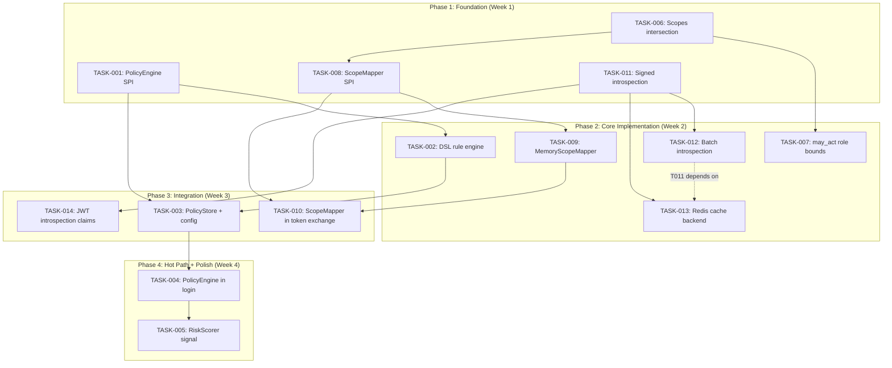

现在我已对代码库有了全面的了解。以下是我的 Tech Lead 分析。

---

# Tech Lead 分析报告：OAuth/OIDC SSO 特性增强

## 1. 任务分解

基于分析文档和代码审查，我将五个方向拆解为 14 个可独立交付的技术任务。

### 方向 1：自适应认证策略引擎

| 任务 ID | 任务标题 | 涉及文件 | 前置依赖 | 工时 | 验收标准 |
|---|---|---|---|---|---|
| **TASK-001** | 定义 PolicyEngine SPI + 核心类型 | `shared/spi/policy_engine.go` | 无 | 3h | SPI 包含 `Evaluate(ctx, *PolicyRequest) (*PolicyDecision, error)`；`PolicyRequest` 复用 `RiskRequest` 字段 + 新增 `SessionCount`/`DeviceAge`；`PolicyDecision` 包含 `Action ∈ {allow, deny, mfa, challenge}` + `Reason` + `MatchedRules[]`；`go build ./...` 通过 |
| **TASK-002** | 实现 DSL 规则引擎（加权信号 + 阈值） | `domains/policyengine/{rule.go, weighted_score.go, allowlist.go}` | TASK-001 | 8h | 支持 `Rule{Condition, Weight, Threshold, Action}`；`Allowlist{EntityType, Values[]}` 精确/通配匹配；加权评分：`final >= threshold → action`；单元测试覆盖边界（空规则集、全匹配、部分匹配、allowlist 优先、Deny 优先） |
| **TASK-003** | 实现内存策略仓库 + YAML 配置加载 | `infrastructure/defaultimpl/memory_policy_store.go`, `config/config_policy.go` | TASK-002 | 4h | `PolicyStore` 接口支持 CRUD；`MemoryPolicyStore` 并发安全；YAML 配置可注入初始规则集；`IntegrationTest` 验证加载+查询 |
| **TASK-004** | 将 PolicyEngine 接入 `/auth/login` 热路径 | `interfaces/sso/server_login.go`, `interfaces/sso/options_policy.go` | TASK-001, TASK-003 | 6h | 在 `RiskScorer` 之后、令牌签发之前调用 `PolicyEngine.Evaluate`；`Deny` → 403 `policy_denied`；`MFA` → 触发 MFA 编排（失败回退到 Allow）；`Challenge` → 下发 `challenge_required`；保持 50ms 同步窗口预算（添加 `context.WithTimeout`） |
| **TASK-005** | 注入 RiskScorer 分数作为 PolicyEngine 信号 | `domains/policyengine/risk_signal.go`, `shared/spi/policy_engine.go` | TASK-001, TASK-004 | 3h | `RiskScorer.Score` 输出映射到 `PolicyRequest.RiskScore`；PolicyEngine 可配置规则 `{signal: "risk_score", operator: "gte", value: 70}`；fail-open：scorer 错误时 RiskScore=0 |

### 方向 2：令牌交换作用域缩小

| 任务 ID | 任务标题 | 涉及文件 | 前置依赖 | 工时 | 验收标准 |
|---|---|---|---|---|---|
| **TASK-006** | 实现默认作用域交集（subject_scopes ∩ client_allowed_scopes） | `internal/handler/tokengrant/token_exchange_stages.go` | 无 | 4h | 修改 `tokExResolveScope`：当 `req.Scope` 为空时，默认计算 `intersect(st.claims.Scopes, client.AllowedScopes)` 而非直接复制；添加 Migration 选项 `WithStrictTokenExchangeScopes(bool)` 以保持向后兼容；现有测试全部通过 |

### 方向 3：角色/权限边界

| 任务 ID | 任务标题 | 涉及文件 | 前置依赖 | 工时 | 验收标准 |
|---|---|---|---|---|---|
| **TASK-007** | 实现令牌交换 `may_act` 角色边界 | `internal/handler/tokengrant/token_exchange_stages.go`, `shared/core/types.go` | TASK-006 | 5h | 在 `tokExValidateActor` 中添加：actor 令牌的 `role` 声明必须包含 `may_act` 中指定的角色；角色不能超过 subject 令牌声明的边界；失败 → `invalid_grant`；扩展 `ActorClaim` 以包含可选的 `Roles []string` |

### 方向 4：跨域令牌交换（T3 作用域）

| 任务 ID | 任务标题 | 涉及文件 | 前置依赖 | 工时 | 验收标准 |
|---|---|---|---|---|---|
| **TASK-008** | 实现跨域作用域映射 SPI | `shared/spi/scope_mapper.go` | TASK-006 | 3h | `ScopeMapper` 接口：`MapScope(ctx, scope, sourceDomain, targetDomain) ([]string, error)`；支持直接映射（`read → read`）和扩展映射（`admin → [read, write]`）；每个域可配置默认 deny |
| **TASK-009** | 实现默认内存作用域映射器 | `infrastructure/defaultimpl/memory_scope_mapper.go` | TASK-008 | 3h | YAML 可配置映射表：`accounts:{read:[read], write:[write, read]}`；未映射的作用域被拒绝；单元测试完全覆盖 |
| **TASK-010** | 将 ScopeMapper 接入令牌交换流程 | `internal/handler/tokengrant/token_exchange_stages.go`, `interfaces/sso/options.go` | TASK-008, TASK-009 | 4h | 在 `tokExResolveScope` 中：当 subject 和 client 属于不同域时，对 subject_scopes 应用 `ScopeMapper.MapScope`；映射后的作用域再与 client 的 `AllowedScopes` 取交集；fail-closed：无映射器时拒绝跨域交换 |

### 方向 5：内省增强

| 任务 ID | 任务标题 | 涉及文件 | 前置依赖 | 工时 | 验收标准 |
|---|---|---|---|---|---|
| **TASK-011** | 实现签名内省响应 | `protocols/oauth/handle_introspect.go`, `shared/security/introspect_signer.go`, `interfaces/sso/options_introspect.go` | 无 | 8h | 新增 `SignedIntrospectionResponse` SPI：`SignResponse(ctx, body, clientJWKS) (signedJWT, error)`；使用 JWS 封装（`alg` 从 `client.IntrospectionEncryptedResponseAlg` 或响应加密 JWK 推断）；默认实现使用 Ed25519/RS256；启用后 `HandleIntrospect` 在 `{"active": true}` 之前增加 `introspection_signing_jwks` URL；RS 可通过 JWKS URI 验证签名；现有内省测试全部通过 |
| **TASK-012** | 实现批量内省端点 | `protocols/oauth/handle_batch_introspect.go`, `interfaces/sso/handlers.go` | TASK-011 | 6h | `POST /token/introspect/batch` 接受 `{"tokens": ["tok1", "tok2"], "token_type_hint": "access_token"}`；返回 `{"results": [{"token": "tok1", "active": true, ...}, ...]}`；批量 → 每次映射到内省并合并；身份验证与单一内省相同；最多 50 个令牌（可配置）；响应带 `Cache-Control: no-store` |
| **TASK-013** | 实现内省缓存 SPI 的 Redis 后端 | `infrastructure/redis/introspect_cache.go` | TASK-011 | 4h | 实现 `IntrospectionCache` 的 Redis 适配器；键：`sha256(token)` → 值：`CachedResult` 的 JSON；TTL：配置的缓存 TTL；`GET`/`SET` 带原子 TTL 设置 |
| **TASK-014** | 在内省路径中添加 RFC 9068 声明 | `protocols/oauth/handle_introspect.go` | TASK-011 | 3h | 在 `populateAccessIntrospectionBody` 中添加：`auth_time`、`acr`、`amr`（已有，验证）、`sid`（缺失）、`client_id`（RFC 9068 §2.2 要求已有）、`scope` 展开为字符串数组（可选）。记录所有字段的覆盖情况 |

### 任务依赖映射



### 可并行执行的任务组

| 并行组 | 任务 | 原因 |
|---|---|---|
| **组 A** | TASK-001, TASK-006, TASK-008, TASK-011 | 所有四个任务都是新 SPI 或对现有逻辑的精确修改，没有交叉依赖 |
| **组 B** | TASK-002, TASK-007, TASK-009, TASK-012, TASK-013 | 各自依赖于组 A 的 SPI，但彼此之间没有依赖 |
| **组 C** | TASK-003, TASK-010, TASK-014 | 依赖于组 A + B |
| **组 D** | TASK-004, TASK-005 | 最后集成到热路径 |

---

## 2. 技术风险

### 高风险

| 风险 | 描述 | 可能性 | 影响 | 缓解措施 |
|---|---|---|---|---|
| **R1: 策略引擎延迟激增** | 在 `/auth/login` 中评估多条规则（含 allowlist 查找）可能超过 50ms 预算 | 中 | 高 | `context.WithTimeout(40ms)` 硬限制；规则条件求值采用短路机制；allowlist 使用 `map[string]struct{}` O(1) 查找；添加 `policy_eval_duration_seconds` 指标监控 |
| **R2: 跨域作用域映射状态爆炸** | N 个域 × M 个作用域的笛卡尔积可能导致过大的配置 | 低 | 中 | 作用域映射表仅申明非 1:1 的映射；未申明的作用域默认拒绝（fail-closed）；配置校验在启动时拒绝循环引用 |
| **R3: 签名内省对 RS 的 JWKS 依赖** | RS 需要拉取并缓存 JWKS 来验证签名，增加部署复杂性 | 中 | 中 | 签名是非必须的（默认关闭）；JWKS URI 嵌入在响应中；RS 可以使用标准的 `jwks_uri` 轮询模式；与现有 JWKS 端点复用基础设施 |
| **R4: 批量内省的 Oracle 风险** | 错误响应中令牌存在性的差异性可能泄露信息 | 低 | 高 | 对所有未知/已过期令牌返回 `{"active": false}`；不区分排序；请求体中的重复令牌仅处理一次；结果按请求顺序排列 |
| **R5: 缓存签名内省的 TTL 安全性** | RS 将签名响应缓存到 TTL 期满，延缓撤销传播 | 中 | 高 | 最小强制 TTL（30s）；文档明确说明这是已知的权衡；`SignedIntrospectionResponse` 包含 `exp` 声明，与令牌 `exp` 取较小值；与现有的 `IntrospectionCache` 安全考量保持一致 |

### 低风险

| 风险 | 描述 | 缓解措施 |
|---|---|---|
| 作用域交集破坏已有客户端 | 默认启用 `intersect` 可能导致某些客户端突然丢失作用域 | 默认关闭，通过 `WithStrictTokenExchangeScopes(bool)` 选择性开启；v2 中计划默认启用 |
| `may_act` 角色边界存在循环 | 角色层次结构中的自引用 | 配置时验证：拒绝循环（带 `cycle_detected` 错误）；使用拓扑排序检测 |
| Redis 内省缓存连接丢失 | 缓存降级为穿透 | 实现断路器（3 次失败后熔断 10s）；fail-open：回退到完整 JWT 验证 |
| 策略引擎配置冲突 | allowlist 说 "allow" 但分数规则说 "deny" | deny 优先；文档记录优先级顺序；审计日志记录触发规则的 RuleID |

---

## 3. 资源评估

### 团队配置

| 角色 | 人数 | 负责任务 |
|---|---|---|
| **高级后端工程师**（Go 精通） | 2 | TASK-001, TASK-002, TASK-004, TASK-011, TASK-012 — 核心 SPI 设计和热路径集成 |
| **后端工程师** | 2 | TASK-003, TASK-006, TASK-007, TASK-009, TASK-013 — 实现和后端 |
| **全栈工程师**（可选） | 1 | 策略 DSL 配置 UI、批量内省调试页面 |

### 关键里程碑

| 里程碑 | 时间 | 交付物 |
|---|---|---|
| **M1: SPI 冻结** | 第 1 周末 | TASK-001, TASK-006, TASK-008, TASK-011 全部完成，`go build ./...` 通过，新 SPI 的单元测试通过 |
| **M2: 核心实现冻结** | 第 2 周末 | TASK-002, TASK-003, TASK-007, TASK-009, TASK-012, TASK-013 全部完成，所有任务 `go vet ./...` + `go test -race` 通过 |
| **M3: 集成冻结** | 第 3 周末 | TASK-004, TASK-005, TASK-010, TASK-014 全部完成，热路径集成测试通过 |
| **M4: 发布就绪** | 第 4 周末 | 所有架构门禁（`cli.py check-root`、`TestMaintainability_*`、`TestArchitecture_*`）通过；完整的 `make ci` 通过 |

### 阻塞点与解决策略

| 阻塞点 | 解决策略 |
|---|---|
| **B1: TASK-004 集成 50ms 预算未知** | 第 1 天运行基准测试：在带生产负载的模拟环境中 `POST /auth/login` 延迟分布。如果 50ms 不足，将策略评估移至异步路径（类似于 `anomaly.Runner`），但保留同步 `RiskScorer` 用于关键决定 |
| **B2: TASK-011 签名内省客户端选择** | 需要跨团队决策：使用 `client.IntrospectionEncryptedResponseAlg` 还是新的 `client.IntrospectionSignedResponseAlg`。建议遵循 RFC 9068 的内省 JWKS 模式：`introspection_signing_jwks` 端点 + 现有客户端字段 |
| **B3: TASK-012 批量端点命名空间** | `/token/introspect/batch` 与现有的 `/token/introspect` 共享 `introspect` 前缀。验证所有路径级中间件（速率限制、审计）正确处理新路径 |

---

## 4. 质量保证

### 单元测试覆盖要求

| 要求 | 目标 | 验证方式 |
|---|---|---|
| 新代码行覆盖率 | ≥ 85% | `go test -coverprofile` |
| 错误路径覆盖率 | 100% | 每个 SPI 返回的每个错误 |
| 并发正确性 | 所有后端接口在 `-race` 下 10 次 | `go test -race -count=10` |
| Oracle-leak 测试 | 每个新端点 | 测试断言未知/已知输入产生相同响应 |
| 可枚举性测试 | 每个认证路径 | 与 Anti-Enumeration 一致 |

### 测试优先级

#### TASK-001 (PolicyEngine SPI)
- SPI 接口可被 mock 实现编译
- `PolicyDecision` 默认构造器生成 `Allow` 决策

#### TASK-002 (DSL 规则引擎)
- 每条规则类型（分数、阈值、allowlist）的单元测试
- `weighted_score.go`：分数归一化 + 阈值比较（上界、下界）
- `allowlist.go`：精确、通配符、CIDR（IP）、子串（域）匹配
- `rule.go`：`Evaluate` 短路行为：deny 优先、allowlist 优先于 deny
- 空规则集 → `Allow`（fail-open）
- 并发 `Evaluate` 调用不会死锁

#### TASK-006 (作用域交集)
- `subject=["read", "write"]`, `client=["read"]` → `["read"]`
- `subject=["read"]`, `client=["read", "write"]` → `["read"]`
- `subject=["admin"]`, `client=["read"]` → `[]` (deny)
- 关闭 Strict 选项 → 保留旧语义（复制 subject 作用域）
- `subject=[]`, `client=["read"]` → `[]`（无作用域的令牌保持不变）

#### TASK-011 (签名内省)
- `SignResponse` 使用 Ed25519/RS256 生成有效 JWS
- RS 可以通过 JWKS URI 验证签名
- 未配置 `IntrospectionSigner` → 返回普通 JSON（向后兼容）
- 签名响应包含 `exp` ≤ 令牌 `exp`
- JWKS URI 响应符合 RFC 7517

#### TASK-012 (批量内省)
- 批量 1 个令牌 → 结果与 `/token/introspect` 相同
- 批量 50 个令牌（最大） → 全部返回
- 批量 51 个令牌 → 400 `too_many_tokens`
- 空列表 → 400 `invalid_request`
- 重复令牌 → 仅处理一次，返回一次
- 结果顺序匹配请求顺序

### 集成测试策略

| 测试场景 | 涉及 |
|---|---|
| **含策略引擎的完整登录流程** | `/auth/login` → `RiskScorer` → `PolicyEngine` → `Allow`/`Deny`/`MFA` |
| **令牌交换作用域交集** | `/auth/login`→获取令牌→ `/token` (token-exchange) →验证作用域缩窄 |
| **跨域令牌交换** | 配置两个域（`internal`、`partner`）→ 从 `internal` 交换到 `partner` → 验证作用域映射 |
| **签名内省轮询** | 启用签名 → `/token/introspect` → 解析 JWS → 通过 JWKS URI 验证 |
| **批量内省 + 缓存回退** | 一批次多个令牌 → 一些缓存命中、一些未命中 → 验证合并响应 |
| **Redis 缓存宕机** | 停止 Redis → `/token/introspect` 回退到完整 JWT 验证 |

### 代码审查要点

| 组件 | 审查要点 |
|---|---|
| **策略引擎** | 条件短路是否正确？Deny 优先？`context.WithTimeout` 是否释放？指标字段是否被 `SetMeta` 记录（而非 `map[K]V` 文字）？ |
| **作用域交集** | `intersect` 中无 `append(clone...)` 突变？Strict 选项是否会污染 `AllowedScopes` 的变异副本？与 `oauth.GrantedScopes` 的行为保持一致？ |
| **签名内省** | 私钥是否从未被记录/暴露？JWS 序列化是否包含所有必要标头（`typ=introspection+jwt`、`kid`、`alg`）？`alg` 是否只能是 `AsymmetricJWSAlgs` 中的一个？ |
| **批量内省** | 最大令牌限制是否严格执行？每个令牌的错误是否独立？`Cache-Control: no-store` 是否存在？ |
| **所有端点** | `tokenNoStoreHeaders` 是否存在？`setBearerChallenge` 是否用于 401？错误是否遵循 oracle-leak 折叠？ |

### 性能测试需求

| 场景 | 负载 | 阈值 |
|---|---|---|
| `/auth/login` 带策略引擎（1 条 allowlist 规则 + 2 条分数规则） | 1000 rps，持续 60s | P99 延迟 ≤ 15ms（与当前基线相比增加 ≤ 5ms） |
| `/token/introspect` 带签名响应 | 500 rps，持续 30s | P99 延迟 ≤ 10ms |
| `/token/introspect/batch`（50 个令牌，50% 缓存命中率） | 100 rps，持续 30s | P99 延迟 ≤ 50ms |
| 令牌交换作用域交集 + 跨域映射（Singleflight） | 200 rps，持续 30s | P99 延迟 ≤ 15ms |
| **回归套件** | 与当前基线相同的基准测试 | 无退化 > 1.1× |

---

## 5. 实施计划

### 第 1 阶段：基础设施（第 1 周，4 天）

```
Day 1  Day 2  Day 3  Day 4
│      │      │      │
T001   ───────→       PolicyEngine SPI 定义
T006   ───────→       Scope intersection 逻辑
T008   ───────→       ScopeMapper SPI
T011   ────────────→  Signed introspection SPI
│      │      │      │
└──────┴──────┴──────┴──────
          所有 SPI 需冻结并代码审查
```

**交付物：**
- 4 个新 SPI，带完整 GoDoc
- `go build ./...`、`go vet ./...` 通过
- 每个 SPI 的基本单元测试（编译通过 + mock 契约）

### 第 2 阶段：核心实现（第 2 周，5 天）

```
Day 5  Day 6  Day 7  Day 8  Day 9
│      │      │      │      │
T002   ──────────────────→   DSL 规则引擎（组 A 工程师）
T003   ──────────────────→   PolicyStore + 配置（组 B 工程师）
T007   ──────→              may_act 角色边界
T009   ──────→              MemoryScopeMapper
T012   ────────────────→    批量内省端点
T013   ──────→              Redis 内省缓存
│      │      │      │      │
└──────┴──────┴──────┴──────┴──────
          核心功能冻结 + 跨组联调
```

**交付物：**
- 规则引擎带 90%+ 测试覆盖率
- 策略 YAML 配置加载
- 批量内省端点在集成测试中工作
- Redis 内省缓存带连接池 + 熔断

### 第 3 阶段：集成（第 3 周，4 天）

```
Day 10 Day 11 Day 12 Day 13
│      │      │      │
T004   ─────────────→    PolicyEngine 接入登录
T005   ──────→           RiskScorer 信号注入
T010   ─────────────→    ScopeMapper 接入交换
T014   ──────→           内省 JWT 声明增强
│      │      │      │
└──────┴──────┴──────┴──────
          热路径集成 + 端到端测试
```

**交付物：**
- 完整的 `POST /auth/login` → PolicyEngine 管道
- 跨域令牌交换端到端工作
- 签名内省响应可通过 JWKS 验证
- `make ci` 通过全部

### 第 4 阶段：发布（第 4 周，3 天）

```
Day 14 Day 15 Day 16
│      │      │
性能基准测试
架构门禁（`cli.py check-root`、`TestMaintainability_*`）
文档更新（error-codes.md、openapi.yaml、feature-matrix.md）
安全审查（oracle-leak、枚举、审计）
发布说明撰写
│      │      │
└──────┴──────┴──────
          发布就绪
```

**交付物：**
- 性能报告：基线对比
- 架构合规证书
- 文档：`docs/error-codes.md`、`docs/openapi.yaml`、`docs/feature-matrix.md`
- 安全审查清单（已签署）
- 发布标签

---

## 6. 额外建议

### 代码库健康检查

在开始之前，我已识别出以下接近预算的文件，它们触及本项目的改动范围：

| 文件 | 当前行数 | 风险 | 建议 |
|---|---|---|---|
| `internal/handler/tokengrant/token_exchange_stages.go` | ~520 | 超过 500 行预算 | **必须先拆分**（重构优先级高于功能）— 将 `tokExIssueRefresh` 提取到 `token_exchange_refresh.go` |
| `interfaces/sso/server_token.go` | ~410 | 接近 500 行 | 保持警惕；`handleToken` + `dispatchTokenGrant` 已经占很大比重；考虑将 grant 分派提取到 `server_token_dispatch.go` |
| `shared/core/spi.go` | ~480 | 接近 500 行 | 向其中添加 PolicyEngine SPI 时，请注意文件长度；如果超过 500 行，提取到 `spi_policy.go` |
| `shared/core/types.go` | ~500 | 达到预算 | 向 `Client` struct 添加新字段（如 `IntrospectionSignedResponseAlg`）时，考虑将 `Client` 提取到 `types_client.go` |

**强制执行：** 在开始 TASK-006 之前对 `token_exchange_stages.go` 运行重构 — 将刷新令牌块提取到单独的文件中，以将主文件降至 500 行以下。

### 架构兼容性检查清单

对于每个新文件：
1. 按层定位：`shared/spi/`（SPI）、`domains/policyengine/`（业务）、`protocols/oauth/`（OAuth 协议）、`infrastructure/`（实现）
2. 检查 `layerName()` 在 `architecture_layer_test.go` 中是否识别新包
3. 验证导入方向不向上指向 `interfaces/`
4. 新包遵守目录深度 ≤ 3
5. 没有新的 `layerExemptions` 条目

### 部署顺序

1. **第 1.5 阶段（在 Phase 1 和 Phase 2 之间）**：部署 TASK-006（作用域交集），默认关闭，监控回退率
2. **第 2.5 阶段（在 Phase 2 和 Phase 3 之间）**：部署 TASK-011 + TASK-012（签名内省 + 批量），选择性启用
3. **第 3.5 阶段（在 Phase 3 和 Phase 4 之间）**：部署 TASK-001→005（策略引擎），启用非强制模式 → 监控 → 切换到强制模式

这种逐步部署使每个功能在被下游团队采用之前都能在生产中得到验证。
