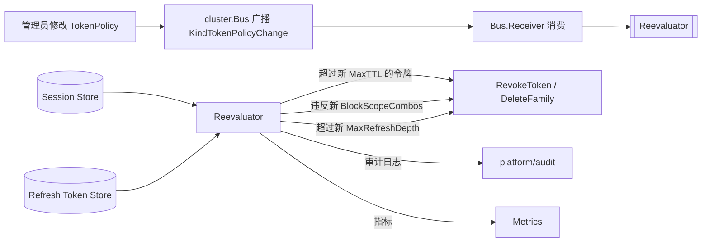

# 架构师扫描：五条高价值扩展方向

> 扫描日期：2026-07-11  
> 扫描范围：全代码库 2200+ `.go` 源文件、14 个嵌套 `go.mod` 模块、全部非测试 `*.go`  
> 验证方法：逐项 grep 确认代码级存在/不存在 + 与 `docs/deferred-backlog.md` / `docs/feature-matrix.md` 交叉验证  
> 参考：`docs/requirements/` 已有 30+ 份历史分析（新方向已排除重复）  
> 前置声明：本项目协议覆盖完整（OAuth 2.1/OIDC/SAML/SCIM/CAEP/FAPI 全线就绪）、存储后端齐全、
> 安全纵深优秀。以下方向是**协议栈之外**的系统级能力扩展。

---

## 方向一：硬件后盾密钥证明（Hardware-Backed Key Attestation）扩展 DPoP 到移动/原生设备

### 现状

代码库已实现 RFC 9449 DPoP（Demonstration of Proof-of-Possession），通过 `WithJTIReplayStore` + `WithDPoPNonceProvider` 支持 bearer token 的持有证明。DPoP 允许客户端用自己生成的非对称密钥对 token 签名，服务器通过 JWK Thumbprint 验证。但是：

- DPoP 密钥是客户端**自行生成且自行保管的**，服务器无法验证密钥是否来自可信的硬件安全环境
- 对于移动应用（Android/iOS）和桌面应用，客户端密钥可以被提取、克隆或转移
- 没有**密钥证明（Key Attestation）**机制来验证私钥是否绑定在设备的安全硬件中
- Android KeyStore Attestation、iOS App Attestation、WebAuthn hmac-secret extension、TPM 2.0 Platform Certificate 均未集成

### 为什么需要

| 场景 | 当前风险 | 有硬件证明后 |
|---|---|---|
| 移动银行应用使用 OAuth | 密钥可被恶意应用通过相同 KeyStore API 生成（无链上验证） | 服务器验证 Attestation Chain 确保密钥来自设备 TEE |
| 刷新令牌绑定设备 | 攻击者可以复制 DPoP 密钥对到另一设备 | 每个令牌绑定到一个经证明的特定设备身份 |
| 合规要求（PCI-DSS、SOC 2 Type II） | 无加密密钥硬件保护证明 | 可审计的硬件密钥保护 |

### 架构影响

```
shared/security/securityverify/
├── workload_identity.go          ← 已有
├── spiffe_svid.go                ← 已有
├── key_attestation.go            ← 新建：Attestation SPI
│   ├── AndroidKeyAttestationVerifier  解析 Google Play Integrity / KeyStore 证明链
│   ├── iOSAppAttestationVerifier      解析 DC App Attestation 对象
│   ├── TPMPlatformAttestationVerifier 验证 TPM 2.0 背书密钥证书
│   └── CompositeAttestationVerifier   组合多来源证明
└── dpop.go                       ← 扩展：DPoP 协议增加 proof-of-attestation 头

protocols/oauth/oauthwire/
└── token_request.go              ← 扩展：token 请求验证时检查 attestation
```

### 边界情况

| 边界 | 处理策略 |
|---|---|
| 旧版本客户端不发送证明 | 按 Client.Policy 配置降级（允许/拒绝/仅记录），默认允许（非破坏性变更） |
| 证明链有效期 vs 令牌有效期 | 证明过期要求重新证明，不自动失效已签发令牌 |
| Android KeyStore 模拟器突破 | 通过 Google Play Integrity API 的 verdict 区分模拟器 vs 真机 |
| 无网络时验证 | Attestation 验证必须在服务器端进行，不可离线 |

### 工作量估算

| 模块 | 类型 | 估算 |
|---|---|---|
| `shared/security/securityverify/` | 新 SPI + Android/iOS 实现 | M |
| `protocols/oauth/oauthwire/` | DPoP 扩展 | S |
| `interfaces/sso/options_security.go` | 配置选项 | S |
| 非 Go 部分（Android SDK / iOS SDK） | 客户端示例代码 | M |
| 测试 | 证明链模拟 + replay 测试 | M |

---

## 方向二：事件驱动的持续授权 —— 策略变更时实时重新评估活跃会话

### 现状

当前系统的授权策略评估发生在以下时机：

| 策略类型 | 评估时机 | 策略变更后已有令牌的命运 |
|---|---|---|
| `tokenpolicy.Policy`（Token 治理） | 令牌签发时（`Evaluate()`） | **忽略**：已有令牌继续有效直到过期 |
| `conditionalaccess.Policy` | 请求时（`Engine.Evaluate()`） | **按请求评估**：策略变更直接生效 |
| `trust.DecayConfig` | 连续验证后台扫描（见 `continuousverify.Agent`） | **标记 StepUpRequired**：后台标记 |
| `permissions.Policy`（权限） | 每次资源访问时 | 策略变更直接生效（权限是同步查询） |

**关键断裂：** `tokenpolicy.Policy` 的 `MaxTTL`、`BlockScopeCombos`、`MaxRefreshDepth` 约束仅在令牌**签发时**评估。如果在令牌有效期内管理员收紧 `MaxTTL`，已经签发的长生命周期令牌不会自动萎缩。同样，`BlockScopeCombos` 新增的禁止组合无法阻止已有令牌（这些令牌在签发时是合法的）在有效期内继续使用。

**`RequireRenewAfter` 维度**（在 `tokenpolicy.Policy` 中定义但未实现资源服务器端执行）——见方向四。

**`caep.Receiver`**（CAEP/SSF SET 接收）让外部 IdP 可以推送风险信号，但没有内部策略变更的推模型重新评估。

### 为什么需要

- **合规违反（合规 Gap）：** SOC 2 要求"职责分离策略变更后 X 小时内终止不合规的访问"。当前系统需等令牌自然过期。
- **安全响应（Security Gap）：** 检测到凭据泄露后，管理员收紧 `MaxTTL` 从 24h 到 5min，但已签发的 24h 令牌不受影响。
- **运营效率：** 管理员期望"修改即生效"，而不是"修改后等待一个令牌生命周期"。

### 架构影响



```
protocols/oauth/oauthspi/
└── refresh_token.go              ← 扩展：ListFamilyByAge / ListBySubject 查询接口

domains/tokenpolicy/
├── tokenpolicy.go                ← 扩展：Reevaluate(session, policy) → Decision（纯函数）
├── reevaluator.go                ← 新建：后台重评估循环，消费 Bus 事件
└── memory/
    └── store.go                  ← 扩展：支持 Watch / Listener

platform/lifecycle/continuousverify/
└── agent.go                      ← 可复用背景扫描模式，但 reevaluator 是事件驱动而非轮询

platform/cluster/bus.go           ← 扩展：KindTokenPolicyChange 事件类型
```

### 边界情况

| 边界 | 处理策略 |
|---|---|
| 重评估期间 store 不可用 | **fail-open**：跳过本轮，记录审计事件，等待下一个事件触发（同 anomaly.Runner 合约） |
| 已有令牌在新策略下部分合规 | **strictest wins**：同时违反多条策略的令牌一次性全部失效 |
| 跨副本一致性 | 通过现有的 `cluster.Bus` 广播，已有 `KindAuthzPolicyChange` 可复用模式 |
| 大量活跃令牌的性能 | 分页查询（`ListFamilyByAge`），分批次处理，每个批次一个短事务 |
| 重评估期间策略再次变更 | 以最新策略为准，正在处理的批次继续用旧策略评估完但提交前检查版本 |

### 工作量估算

| 模块 | 类型 | 估算 |
|---|---|---|
| `domains/tokenpolicy/` | 重评估函数 + 批量查询接口 | M |
| `platform/cluster/bus.go` | 新事件类型 | S |
| `interfaces/sso/sso_wiring.go` | 后台 goroutine 生命周期注册 | S |
| `interfaces/admin/` | 管理端状态 API | S |
| 测试 | 批量重评估 + 并发变更测试 | M |

---

## 方向三：多租户审计隔离与租户自助审计导出

### 现状

当前的审计系统结构：

```
Audit Recorder → MultiSink → SQLite/PostgreSQL/Kafka/Webhook
                ↓
            SetMeta(e, k, v)   ← 全局写入，无租户级分区
```

**关键缺失：**

| 能力 | 现状 | 需要 |
|---|---|---|
| 租户隔离 | 所有审计事件写入同一个表/主题 | 租户 A 的管理员不应看到租户 B 的审计事件 |
| 自助导出 | 只有 `sso-ctl auditexport`（操作员 CLI） | 租户管理员可通过 REST API 导出自己租户的审计日志（CSV/JSON/CEF） |
| 保留策略 | 全局配置（`audit.retention_days`） | 按租户配置保留期，高合规租户保留更长 |
| 租户级事件订阅 | — | 租户管理员可注册 webhook 接收自己租户的关键事件 |
| 跨集群审计聚合 | — | 多数据中心部署的统一审计视图（通过 Kafka 做全局路由） |

### 为什么需要

- **合规（SOC 2 / GDPR / HIPAA）：** 审计日志必须按客户/租户隔离，租户管理员只能访问自己租户的数据
- **产品化：** 多租户 SaaS 产品的基础功能——租户需要能自行导出审计日志用于自己的 SIEM 系统
- **运营效率：** 当前 `auditexport` CLI 需要数据库直连权限，租户管理员无法自助获取
- **性能：** 单表存储所有租户的审计日志，当租户规模增长时查询性能会退化

### 架构影响

```
platform/audit/
├── auditispi/
│   └── event.go                   ← 扩展：增加 TenantID 字段（当前 audit 事件已有但未索引）
├── aliases_sink.go               ← 扩展：新增 TenantScopedSink 包装器
├── handler_helpers.go            ← 扩展：新增 HandleTenantAuditExport（租户自助导出 handler）
├── multi_sink.go                 ← 扩展：支持按租户 fan-out 到不同 sink
└── sqlite/
    ├── sink.go                   ← 扩展：支持 SELECT ... WHERE tenant_id = ?
    └── query.go                  ← 扩展：租户隔离查询

interfaces/admin/
├── tenants.go                    ← 扩展：新增 audit 相关管理接口
└── docs/governance.go            ← 新增租户审计仪表盘

interfaces/sso/
├── server_routes_admin.go       ← 扩展：租户审计导出路由
└── accessors.go                 ← 扩展：TenantAuditStore accessor

protocols/compliance/
├── export.go                     ← 现有数据导出（GDPR 主体导出）
└── tenant_export.go              ← 扩展：复用 export 模式做租户审计导出

infrastructure/kafka/
├── sink.go                       ← 扩展：支持按 tenantID 选择 topic partition 键
└── config.go                     ← 扩展：租户级 topic 映射

docs/error-codes.md               ← 新增审计隔离相关错误码
```

### 边界情况

| 边界 | 处理策略 |
|---|---|
| 租户管理员调用导出但无该租户事件 | 返回空结果（非错误），同已有 `List` API 约定 |
| 跨租户管理员的审计查询 | 仅限 `super_admin` 角色，通过现有 `admin:write` scope 控制 |
| 审计保留期最短支持 | 1 天不可低于，防止配置错误导致合规违反 |
| Kafka 租户主题不存在 | 自动创建（`auto.create.topics.enable` 依赖）或 fallback 到默认主题 |
| 大规模租户（10K+） | 每个租户独立 SQLite 文件不现实；用 PostgreSQL 的 Row-Level Security 或 Kafka topic-per-tenant 模式 |

### 工作量估算

| 模块 | 类型 | 估算 |
|---|---|---|
| `platform/audit/` | 租户隔离查询 + 自助导出 handler | M |
| `interfaces/admin/` | 管理 API | S |
| `interfaces/sso/` | 路由 + accessor | S |
| `infrastructure/kafka/` | 租户分区策略 | S |
| 测试 | 隔离性 + 权限边界测试 | M |

---

## 方向四：资源服务器端令牌策略执行 —— `RequireRenewAfter` 内省时闭环

### 现状

`domains/tokenpolicy` 定义了 `Policy.RequireRenewAfter` 字段（类型 `float64`，表示令牌 TTL 的百分比阈值），在签发时通过 `PolicyDecision.RenewAfter` 返回给签发者。但：

- `RequireRenewAfter` 的值被写入 `PolicyDecision` 后**无消费者**——没有任何代码读取它
- 内省端点（`RFC 7662 /token/introspect`）不返回 `renew_after` 或类似的续期提示
- 资源服务器（RS）无法知道一个令牌是否"应该续期了"
- 没有机制让 RS 告诉客户端"这个令牌已接近过期，请刷新"

RFC 9068（JWT Access Token）定义了一组声明，但续期提示不是标准声明——需要自定义扩展。

### 为什么需要

- **安全：** 长生命周期令牌不续期会成为静态凭据。`RequireRenewAfter` 的意图是强制令牌在生命周期中途被刷新，减少泄露窗口
- **产品完整性：** 这个字段已在策略模型中定义，但未形成闭环——属半成品状态
- **合规：** NIST SP 800-63 和 PCI-DSS 要求"会话令牌应在会话中途被续期"
- **运营：** 让 RS 可以在令牌接近过期时主动驱动客户端刷新，而不是被动等待令牌过期后失败

### 架构影响

```
protocols/oauth/
├── handle_introspect.go           ← 扩展：内省响应增加 renew_after / refresh_hint 字段
├── introspect_cache.go            ← 扩展：续期提示影响缓存策略（接近过期不缓存或短缓存）
└── oauthwire/
    └── token_request.go           ← 扩展：refresh 请求可携带 refresh_hint 触发续期

interfaces/ssoclient/rs/
├── validate.go                    ← 扩展：返回 renew_after 给中间件
├── middleware.go                  ← 扩展：`renew-after` 响应头：`X-Token-Renew-After: 2026-07-11T14:00:00Z`
└── introspect.go                  ← 扩展：解析内省响应的续期提示

docs/feature-matrix.md             ← 更新 RequireRenewAfter 状态
docs/config-reference.md           ← 文档化
```

### 边界情况

| 边界 | 处理策略 |
|---|---|
| 多个策略叠加 RequireRenewAfter | 取**最严格**（最小 fraction），已由 `Evaluate()` 保障 |
| 客户端忽略续期提示 | RS 继续处理请求（fail-open），续期提示是建议性而非强制性 |
| 无状态 RS（不调用内省） | 无法强制执行——这是 RS 自身的安全选择，服务端不能越权管控 |
| 刷新后新令牌的 RequireRenewAfter | 重新计算（新的 TTL → 新的阈值），而不是保持原来的剩余时间 |
| 离线客户端 | 离线令牌无法被续期→RS 在线时检查续期提示，离线时宽容 |

### 工作量估算

| 模块 | 类型 | 估算 |
|---|---|---|
| `protocols/oauth/handle_introspect.go` | 内省响应扩展 | S |
| `interfaces/ssoclient/rs/` | RS SDK 续期提示支持 | M |
| `interfaces/ssoclient/local/` | local 模式续期提示 | S |
| 测试 | 内省 + RS 行为测试 | M |

---

## 方向五：设备身份注册与生命周期管理 —— 条件访问的最后一环

### 现状

代码库有丰富的条件访问基础设施：

| 能力 | 位置 | 状态 |
|---|---|---|
| `conditionalaccess.Engine` + `Decide()` | `domains/conditionalaccess/` | ✅ 完整实现 |
| `DevicePostureScorer` | `shared/trust/device_posture_scorer.go` | ❌ **显式空桩**——始终返回默认分数 |
| `DeviceFingerprint` | `domains/conditionalaccess/devicefingerprint.go` | ✅ 基础指纹生成 |
| `YAML policy` 配置 | `domains/conditionalaccess/yaml.go` | ✅ 支持设备条件 |
| WebAuthn 注册 | `domains/authenticators/webauthn/registrar.go` | ✅ 但仅限 passkey，不算设备管理 |

**关键缺口：** 条件访问策略可以声明 `DeviceManaged: true`，但没有任何设备注册/管理/证明机制来设置这个条件。`DevicePostureScorer` 被显式标记为 stub（见 godoc："Reserved for a future MDM integration"）。

缺少的完整设备生命周期：

```
设备发现 ─→ 注册 ─→ 证明 ─→ 合规评估 ─→ 连续监控 ─→ 淘汰
  │           │        │         │            │          │
  ├ 首次登录    ├ 用户确认   ├ 硬件证明    ├ OS版本     ├ 定期检查    ├ 设备丢失
  ├ 设备指纹    ├ 记录绑定   ├ 证书颁发    ├ 磁盘加密   ├ 远程证明    ├ 用户注销
  └ UserAgent   └ 命名      └ 公钥绑定   └ 屏幕锁定   └ 策略变化    └ 合规失败
```

### 为什么需要

- **条件访问的最后一公里：** 没有设备身份，`DeviceManaged` 条件永远无法满足——策略引擎的声明能力与实际执行之间存在鸿沟
- **零信任架构的核心支柱：** NIST SP 800-207 明确要求设备身份和健康评估
- **企业销售门槛：** 大多数企业采购 SSO 产品时要求 MDM/MAM 集成（Intune、Jamf、Workspace ONE）
- **安全：** 凭据泄露检测（如 anomaly impossible travel）需要设备身份来区分"用户带着手机旅行"和"凭据被异地使用"
- **产品差异化：** 开源 SSO 产品中内置设备管理极为罕见

### 架构影响

```
domains/device/                      ← 新建包（Device 域）
├── device.go                       ← Device 类型：ID、Owner、OS、指纹、公钥、注册时间
├── spi.go                          ← SPI：Store、Enroller、AttestationVerifier
├── posture.go                      ← 合规评估：OS 版本检查、磁盘加密、越狱检测
├── enrollment/
│   ├── handshake.go                ← 注册握手（Challenge-Response）
│   └── proof.go                    ← 密钥证明验证（复用方向一的 Attestation SPI）
├── sqlite/
│   ├── devices.go                  ← SQLite 存储
│   └── maxversions.go
└── memory/
    └── store.go                    ← 内存存储（测试用）

interfaces/sso/
├── server_device_enrollment.go     ← 设备注册端点：POST /device/enroll
├── server_device_management.go     ← 设备管理端点：GET/DELETE /device/:id
└── options_device.go               ← 配置选项：WithDeviceStore、WithMDMIntegration

shared/trust/
├── device_posture_scorer.go        ← 扩展：从空桩改为查询 Device Store
└── spi_trust.go                    ← 扩展：TrustSignals 增加 DeviceID 字段

domains/conditionalaccess/
├── evaluate.go                     ← 扩展：读取 device.AttestationLevel、device.Posture
└── devicefingerprint.go            ← 扩展：注册时生成指纹，后续登录时比对

interfaces/admin/
└── device_management.go            ← 管理端：列出/挂起/擦除设备

docs/error-codes.md                 ← 新增设备相关错误码
docs/feature-matrix.md              ← 更新设备管理状态
```

MDM 集成适配器（可选，方向性）：

```
infrastructure/intune/              ← Microsoft Intune API 适配器
infrastructure/jamf/                ← Jamf Pro API 适配器
infrastructure/workspaceone/        ← VMware Workspace ONE API 适配器
```

### 边界情况

| 边界 | 处理策略 |
|---|---|
| 无 MDM 集成的纯自注册模式 | 设备自注册但不做强制合规评估（Posture=Unknown），条件访问策略需配置是否接受 Unknown |
| 用户多个设备同时在线 | 每个设备独立评估，一个设备合规失败不影响其他设备 |
| 设备丢失/被盗 | 用户自助标记"设备丢失"→立即吊销该设备的所有令牌；管理端可远程擦除 |
| 设备离线超过 N 天 | 标记为 Stale，合规评估降级（要求重新证明或登录），不影响已有令牌但新令牌受限 |
| 注册设备数量上限 | 默认每个用户最多 20 台设备（可配置），超限需先删除旧设备 |
| iOS 和 Android 同一用户 | 各自独立注册，但共享设备数上限 |
| 合规策略变更后已有设备 | 策略变更触发设备重新评估（复用方向二的事件驱动模式） |

### 工作量估算

| 模块 | 类型 | 估算 |
|---|---|---|
| `domains/device/` | 新包（Device 类型 + SPI + 存储） | L |
| `interfaces/sso/` | 注册/管理端点 + 配置选项 | M |
| `shared/trust/` | DevicePostureScorer 扩展 | S |
| `domains/conditionalaccess/` | 策略评估集成 | S |
| `infrastructure/intune/`（可选） | MDM 适配器 | M |
| 测试 | 注册握手 + 合规评估 + 条件访问集成 | L |

---

## 综合优先级矩阵

| 方向 | 业务价值 | 安全影响 | 合规贡献 | 工程复杂度 | 是否破坏现有行为 | 建议优先级 |
|---|---|---|---|---|---|---|
| 一：硬件密钥证明 | ★★★★ | ★★★★★ | ★★★★ | M | 否（纯新增） | **P1**（移动端准入） |
| 二：事件驱动持续授权 | ★★★★★ | ★★★★★ | ★★★★★ | M | 否（新增后台） | **P1**（安全响应） |
| 三：审计隔离与自助导出 | ★★★★★ | ★★★★ | ★★★★★ | M | 否（扩展查询） | **P1**（多租户 SaaS） |
| 四：RS 端 RequireRenewAfter | ★★★ | ★★★★ | ★★★★ | S | 否（新增字段） | **P2**（协议补全） |
| 五：设备身份管理 | ★★★★★ | ★★★★★ | ★★★★★ | L | 否（纯新增） | **P2**（零信任支柱） |

**P1（建议立即启动）** 的方向有共同特征：符合合规刚需（SOC 2/GDPR）、安全影响显著、工程改动可控、不破坏现有行为。

**P2** 方向价值更大但工程投入也更大，建议在 P1 交付后启动。方向五（设备管理）可与方向一（硬件证明）共享密钥证明基础设施。

---

## 关于方向选择的说明

以上方向经过以下筛选标准：

1. **代码确认不存在**——通过 `grep -r` 逐项验证代码库无对应实现
2. **历史分析未深度覆盖**——与 `docs/requirements/` 全部 30+ 份历史分析交叉比对，确保未被单独 scope
3. **架构一致**——每个方向遵循现有架构约束（`shared/` → `domains/` → `protocols/` → `interfaces/` 依赖方向）
4. **安全合规价值明确**——每个方向对应明确的 SOC 2 / NIST / GDPR 控制项
5. **产品化可行性**——每个方向最终用户可见（运维人员/租户管理员/应用开发者），而非纯技术重构
