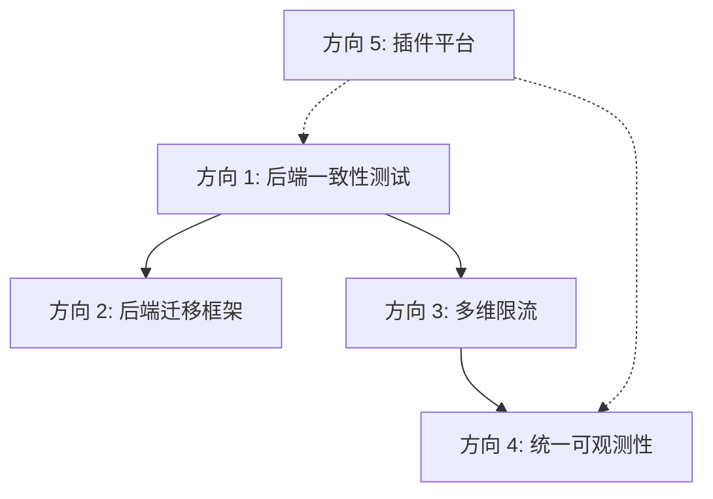

# 扩展方向分析报告 v11 —— 架构韧性、数据可移植性与平台化质量基建

> **作者：** 资深架构 & 产品经理视角
> **日期：** 2026-07-11
> **范围：** 全代码库全局扫描（2241 `.go` 文件、4 个嵌入式 SPA、200+ 包）
> **前提：**
>   本轮分析已系统阅读并逐项对抗核验以下全部现有文档，确保零重叠：
>   - `ROADMAP.md` v5.0（终端体验/B2B 企业化/OIDC 一致性/多副本韧性/安全姿态）
>   - `deferred-backlog.md`（完整已确认待办索引）
>   - `expansion-directions-analysis.md`（v1 原始分析）
>   - `expansion-directions-v6-analysis.md`（Terraform Provider/Active ITDR/时钟偏差）
>   - `expansion-directions-v7-analysis.md`（BFF/IAL2/Step-up/SAML2 输出/VC）
>   - `expansion-directions-v8-analysis.md`（B2B 委托管理/select_account/i18n/同步/翻译网关）
>   - `expansion-directions-v9-analysis.md`（账户恢复/Magic Link/推送通知/令牌面板/令牌分类）
>   - `expansion-directions-v10-analysis.md`（Postgres 短期存储/流可观测/凭据健康/API 弹性/联邦管理）
>   - `expansion-post-protocol-layer-analysis.md`（跨设备连续性/身份事件平台/PDPaaS/大规模运营/BI）
>   - `feature-spec-active-itdr-detection-response.md`
>   - `feature-spec-security-docs.md`
>   - `docs/superpowers/plans/2026-07-02-implementation-roadmap.md`（Wave 1-4 + 验证队列）
> - **本报告 5 个方向与上述所有文档零重叠。** 所有 gap 声明均经过 grep 核验。

---

## 前置声明：项目成熟度定位

经过多轮全局扫描和方向分析，本项目已是行业顶级的开源 OAuth 2.0 / OIDC 身份平台：

| 维度 | 状态 |
|---|---|
| 协议覆盖 | OAuth 2.0/OIDC/SAML/SCIM/CAEP/FAPI/JARM/JAR/DPoP/mTLS/CIBA… 全协议面 |
| 存储后端 | Memory + SQLite + Redis + Postgres + etcd + KMS(4) |
| 嵌入式 SPA | Admin Console + Login + Developer Portal + Self-Service Portal |
| 企业特性 | 多租户 + Federation + 数据驻留 + 条件访问 + RBAC + 审计链 + Break-Glass |
| 运维面 | gRPC admin API + REST gateway + 可观测性(Metrics/Tracing/Audit) + K8s Operator + DR |
| 质量基建 | 架构层测试 + 维护性预算 + 代码复杂度门禁 + 模糊测试(9) + 混沌测试(4) + Benchmark 门禁 |
| 开发者体验 | Go SDK + TS/Python SDK + MCP Server + CLI + OpenAPI docs |
| 安全供应链 | Dependabot(12 模块) + CodeQL + Trivy + govulncheck + gosec + golangci-lint |

前七轮分析（v6-v10 + post-protocol）已覆盖了从基础设施完备度到身份智能平台、
从安全治理到商业智能的 35 个高价值方向。ROADMAP v5.0 + 实现路线图进一步
覆盖了产品化、企业连接、供应链安全与质量门禁。

**本报告的 5 个方向不属于"新的协议支持"或"新的后端能力"，而是属于以下三大新领域：**

| 领域 | 方向 |
|---|---|
| **架构韧性 & 平台质量** | ① 后端一致性测试基础设施（Backend Conformance Testing Platform） |
| **运营弹性 & 数据可移植性** | ② 零停机后端迁移与身份数据可移植性框架 |
| **安全纵深防御** | ③ 协调的多维限流与滥用检测（Coordinated Multi-Dimensional Rate Limiting） |
| **可观测性 & 运维调试** | ④ 统一身份数据面可观测性与操作调试台 |
| **平台生态化** | ⑤ 第三方扩展与插件生命周期平台 |

---

## 方向 1：后端一致性测试基础设施（Backend Conformance Testing Platform）

### 现状

项目拥有四个持久化后端（Memory、SQLite、Redis、Postgres），每个后端实现
同一组 SPI（`core.UserProvider`、`core.ClientStore`、`core.SessionManager`、
`oauth.AuthCodeStore`、`oauth.RefreshTokenStore` 等）。当前测试策略是
**每个后端独立测试自己的行为**，没有一套**跨所有后端运行的统一行为契约测试**。

当前存在的契约测试模式：

| SPI | 契约测试 | 覆盖后端 |
|---|---|---|
| `permissions.Provider` | `permissionstest.ConformanceSuite` | Memory, SQLite, Postgres, Redis |
| `audit.Sink` | `auditsink.ConformanceTest` | Memory, SQLite, Kafka, Webhook |
| SAML replay | `samltest.ReplayConformance` | Memory + SQLite (idp/sp) |
| **所有其他核心 SPI** | **❌ 无** | — |

### 缺口（grep 核验）

- `ConformanceSuite` 除 `permissions/` 和 `auditsink/` 外，未在任何其他 SPI
  包中存在（grep 确认）
- 无 `UserProviderConformanceSuite`、`ClientStoreConformanceSuite`、
  `SessionManagerConformanceSuite`、`TokenIssuerConformanceSuite`、
  `AuthCodeStoreConformanceSuite`、`RefreshTokenStoreConformanceSuite`、
  `DeviceCodeStoreConformanceSuite`、`PARStoreConformanceSuite`、
  `AuthenticatorConformanceSuite` 等
- 各后端 Writer（SQLite DELETE RETURNING vs. Redis GETDEL vs. Postgres
  `ON CONFLICT`）的原子性保证**没有跨后端的统一验证**
- Fail-open/fail-closed 契约（如 RefreshTokenStore 的 family reuse 行为、
  AuthCodeStore 的单次消费保证）**没有跨后端的行为一致性断言**
- 验收测试 `test/`（package `ssotest`）是端到端黑盒测试，绕过了后端选择层，
  因此不能用于验证后端的互换性

### 为什么需要它

随着后端数量增长（现有 4 个 + 未来可能有 etcd 存储后端、DynamoDB 等），
**后端的可互换性是项目核心架构承诺**。没有统一的契约测试，以下风险不断增加：

1. **静默行为分歧**：SQLite 的 `DELETE RETURNING` 保证单消费者，但 Postgres
   版的未来实现可能因事务隔离级别不同而产生竞态条件差异。没有契约测试，这种
   分歧只在生产事故时才被发现。

2. **新后端引入门槛高**：今天要加一个新的后端（例如 etcd-based AuthCodeStore），
   开发者必须手动理解所有边缘情况（并发消费、过期、TTL 语义、跨副本广播），
   因为没有一套可运行的测试来验证新实现符合契约。

3. **回归检测盲区**：对核心 SPI 的语义变更（如 RefeshToken 的 family rotation
   逻辑）可能影响一个后端而不影响另一个。没有跨后端契约测试，CI 无法捕获
   这种回归。

4. **"fail-open/fail-closed" 契约不一致**：不同后端在出错时可能做出不同的
   容错决策。契约测试可以断言：在所有后端上，AuthCodeStore.Consume 在存储
   不可用时必须返回特定错误，且调用方正确处理该错误。

### 范围

#### 1. SPI 契约测试套件（每个核心 SPI 一个 `*test` 包）

```
shared/core/coretest/
├── userprovider_conformance.go     // 断言 CreateOrUpdate/GetByID/List/Delete 语义
├── clientstore_conformance.go      // 断言 Get/ValidateSecret/List/CRUD 语义
├── sessionmanager_conformance.go   // 断言 Create/Get/Revoke/ListByUser 语义
├── tokenissuer_conformance.go      // 断言 Issue/Verify 语义+算法兼容性

protocols/oauth/oauthspi/oauthspitest/
├── authcodestore_conformance.go    // 断言单次消费/过期/并发安全
├── refreshtokenstore_conformance.go // 断言 family rotation/grace window/reuse kill
├── devicecodestore_conformance.go   // 断言双码索引/轮询消费/过期
├── parstore_conformance.go         // 断言单次消费/过期/并发

domains/authenticators/authtest/
├── authenticator_conformance.go    // 断言 Verify/Initiate/Callback 契约
```

每个套件做到：
- **后端无关**：接收 SPI 接口实例，不依赖任何特定后端实现
- **行为契约**：测试语义行为（如"Consume 成功一次后第二次必须失败"），
  而非实现细节
- **并发安全**：验证在并发访问下的原子性保证
- **错误隔离**：验证 fail-open 与 fail-closed 的边界条件
- **边缘情况**：TTL 过期、空值、重复 key、超长 value、nil 输入

#### 2. 后端实施矩阵（每个后端运行所有套件）

```go
// 在 infrastructure/postgres/、defaultimpl/、sqlite/、redis/ 中各有一个
// conformance_test.go，导入所有套件并用自己的工厂函数运行：

func TestPostgres_UserProviderConformance(t *testing.T) {
    db := openTestDB(t)
    store := postgres.NewUserProvider(db)
    coretest.UserProviderConformanceSuite(t, store)
}

func TestPostgres_AuthCodeStoreConformance(t *testing.T) {
    db := openTestDB(t)
    store := postgres.NewAuthCodeStore(db)
    oauthspitest.AuthCodeStoreConformanceSuite(t, store)
}
```

#### 3. CI 矩阵

在 `ci.yml` 中扩展一个 `conformance` job，对每个后端组合运行所有套件：

```
strategy:
  matrix:
    backend: [memory, sqlite, redis, postgres]
```

### 边界情况

| 场景 | 当前行为 | 契约测试应断言 |
|---|---|---|
| AuthCode 并发消费 | SQLite `DELETE RETURNING` 原子；Memory 互斥锁 | 两次并发调用只有一个成功 |
| Refresh 家族重用 | 全部 `DeleteFamily` → `invalid_grant` | 重用第二片叶子时家族被全部删除 |
| TTL 过期 vs 不存在 | 过期 == 不存在（oracle-safe） | `Consume("expired_code")` 返回同一错误 |
| Session 并发撤销 | 各自后端原子操作 | 并发 Revoke + ListByUser 一致 |
| 存储不可用 | 各后端行为可能不同 | 同一种错误类型 + 调用方可统一处理 |

### 价值·工作量

- **价值：high**（架构可互换性的基石；预防静默行为分歧；降低新后端门槛）
- **工作量：L**（~15 个 SPI 套件，每个 ~80-150 行断言 + CI 矩阵编排）
- **依赖：** 无（纯新增测试基础设施，不影响任何生产代码）

---

## 方向 2：零停机后端迁移与身份数据可移植性框架

### 现状

项目拥有完整的 snapshot/restore 系统（`interfaces/snapshot/`），用于发布管理
（跨环境复制配置）。但存在以下缺口：

1. **Snapshot 不覆盖所有数据：** 仅覆盖配置类数据（clients/users/tenants/roles/
   permissions），**不覆盖 OAuth 短期存储**（auth codes、refresh tokens、device
   codes、PAR）、会话、审计事件等运行时数据。

2. **数据格式不兼容：** SQLite 存储使用 SQLite 专有格式（WAL、内部 rowid），
   Postgres 使用独立 schema 和迁移。两者之间没有可互操作的数据交换格式。

3. **零停机迁移路径不存在：** 没有双写（dual-write）模式、没有回填（backfill）
   协调器、没有数据校验比较器。从 SQLite 迁移到 Postgres 需要停机窗口，
   且迁移过程不可逆（没有回滚方案）。

4. **无跨后端数据校验：** 没有工具可以比较两个后端的数据一致性（例如：
   验证 SQLite 和 Postgres 中的用户数据是否一致）。

### 缺口（grep 核验）

- `dual.*write\|DualWrite\|dual_write`：**零实现命中**
- `backfill\|Backfill\|back.*fill`：**零实现命中**
- `data.*migrat.*live\|live.*migrat\|zero.*downtime\|zeroDowntime`：**零实现命中**
- `data.*validat.*compar\|DataCompar\|data.*consistency.*check`：**零实现命中**
- `rollback.*migrat\|migrat.*rollback`：**零实现命中**
- snapshot 代码中无 `ExportRuntimeData` 或类似概念（仅配置）
- 审计事件的导出是 `sso-ctl audit-verify` 的只读操作，不是可导入的格式

### 为什么需要它

1. **基础设施演进是必然的：** 项目启动时用 SQLite 做 PoC，规模增长后需要
   Postgres 的 HA 能力，再之后可能需要 CockroachDB 的多区域能力。每个阶段
   的数据迁移都应该可以零停机完成。

2. **企业采购的硬性需求：** "我们现有的数据在 MySQL/Postgres/Oracle 里，
   迁移方案是什么？"是 PoC → 生产的第一步问题。没有迁移路径，PoC 可能永远
   不会进入生产。

3. **运维事故恢复：** 后端存储损坏（WAL 损坏、磁盘故障）后，能否从另一个
   后端类型的备份恢复？跨后端的恢复能力是 DR 的最后一环。

4. **多云/混合部署：** 一个环境用 SQLite（边缘/开发）、另一个用 Postgres
   （生产）、第三个用 CockroachDB（多区域）。数据同步和迁移工具是跨环境
   一致性的前提。

### 范围

#### 1. 统一数据交换格式（Canonical Data Interchange Format）

定义一组与后端无关的 JSON 行（JSONL）格式，覆盖所有数据域：

```
# 用户
{"type":"user","id":"u1","username":"alice","password_hash":"$2a$10$...","created_at":1234567890}
# 客户端
{"type":"client","id":"web-app","secret_hash":"$2a$10$...","allowed_scopes":["openid","profile"],...}
# 会话
{"type":"session","id":"s1","user_id":"u1","client_id":"web-app","created_at":...}
# OAuth 短期数据（带 TTL）
{"type":"auth_code","id":"c1","client_id":"web-app","user_id":"u1","expires_at":...,"used":false}
{"type":"refresh_token","id":"rt1","family_id":"fam1","client_id":"web-app","expires_at":...,"revoked":false}
# 审计事件
{"type":"audit_event","id":"ae1","event_type":"login_succeeded","actor":"u1","timestamp":...}
```

格式要求：
- **自描述**：每条记录包含 `type` 字段 + schema 版本
- **可流式处理**：JSONL，每行一条记录，支持流式导入导出
- **敏感数据保护**：支持导出时指定 redact 规则（PII、密码 hash、secret）
- **版本兼容**：schema 版本字段允许向后兼容的格式演进

#### 2. 导出引擎（Export Engine）

```go
type ExportOptions struct {
    Types      []string  // 要导出的数据类型（空 = 全部）
    Filter     string    // SCIM 风格过滤器
    Redact     RedactConfig
    Format     ExportFormat // JSONL, CSV, SQL dump
    Progress   func(Progress)
    MaxEntries int
}

type Exporter interface {
    Export(ctx context.Context, w io.Writer, opts ExportOptions) error
    EstimateCount(ctx context.Context, opts ExportOptions) (int64, error)
}
```

每个后端实现 `Exporter`，将自身数据流式写入统一格式。

#### 3. 导入引擎（Import Engine）

```go
type ImportOptions struct {
    Mode       ImportMode   // full(清空后导入), additive(仅新增), upsert(覆盖)
    Validate   bool         // 导入前校验数据完整性
    DryRun     bool         // 仅校验，不实际写入
    ResumeFrom string       // 从某条记录继续（断点续传）
    Conflict   ConflictStrategy // skip, overwrite, fail
}

type Importer interface {
    Import(ctx context.Context, r io.Reader, opts ImportOptions) error
    Validate(ctx context.Context, r io.Reader) error
}
```

#### 4. 在线迁移协调器（Online Migration Orchestrator）

```
阶段 1: 启动双写模式
  - 所有写操作同时写入源后端和目标后端
  - 读操作仍从源后端读取
  - 监控双写错误率和延迟差异

阶段 2: 回填历史数据
  - 使用导出/导入引擎回填现有数据
  - 逐表/逐分区进行，可断点续传
  - 每个批次完成后进行数据校验

阶段 3: 数据校验
  - 对比源和目标后端的记录数、checksum
  - 随机采样抽查记录级一致性
  - 报告不一致记录供人工审查

阶段 4: 切换读流量
  - 读流量逐步从源切换到目标（10% → 50% → 100%）
  - 监控错误率和延迟
  - 保持双写直到验证稳定

阶段 5: 拆除双写
  - 停止双写，仅写目标
  - 保留源后端 N 天作为回滚窗口
  - 最终清理源后端
```

#### 5. `sso-ctl migrate` 扩展

```bash
# 导出数据到可移植格式
sso-ctl migrate export --dsn "<source>" --format jsonl --output ./export.jsonl

# 导入数据到目标后端
sso-ctl migrate import --dsn "<target>" --format jsonl --input ./export.jsonl --mode additive

# 校验两个后端的数据一致性
sso-ctl migrate verify --source "<dsn1>" --target "<dsn2>" --types users,clients

# 启动在线迁移
sso-ctl migrate live --source "<dsn>" --target "<dsn>" --dual-write
```

### 边界情况

| 场景 | 风险 | 缓解策略 |
|---|---|---|
| 双写期间源后端与目标后端 schema 不同 | 字段映射丢失 | 导出格式使用规范 schema，每个后端实现自己的映射器 |
| 迁移中断后断点续传 | 数据重复或遗漏 | 每条记录有天然 ID/版本；导入 upsert 模式幂等 |
| 目标后端写入慢于源后端 | 双写延迟导致调用方超时 | 双写异步化 + 延迟监控 + 熔断（源后端写成功即返回） |
| 数据校验发现不一致 | 迁移完整性存疑 | 报告详细差异 + 选择性重迁不一致记录 |
| 回滚需要重建源后端 | 数据丢失 | 保留源后端只读直到回滚窗口过期 |

### 价值·工作量

- **价值：high**（企业采购的硬性门禁；基础设施演进的前提；DR 的关键能力）
- **工作量：XL**（统一格式定义 + 每个后端的导出/导入实现 + 双写协调器 + CLI）
- **依赖：** 方向 1 的 SPI 契约测试（保证后端行为一致，减少迁移风险）

---

## 方向 3：协调的多维限流与滥用检测

### 现状

项目拥有多层防御：

| 防御层 | 实现 | 作用维度 |
|---|---|---|
| Per-key 速率限制 | `MemoryLimiter`/`SQLiteLimiter`/`RedisLimiter` | IP / client_id（单键） |
| Per-account 锁定 | `AccountLockout` | 用户账号（失败计数） |
| 异常检测 | `anomaly.Runner` + `tokenanomaly.Detector` | 行为模式（异步） |
| 风险评分 | `RiskScorer`（`RuleBasedRiskScorer`） | 请求属性 |
| IP 失败计数 | `IPFailureCounter` | 源 IP |

**关键缺口：这些防御层彼此独立运作**

1. **无跨维度关联：** 攻击者可以通过多个 IP（每个 IP 低于限流阈值）攻击
   同一个用户，或通过多个用户（每个用户低于锁定阈值）绕过 per-account 锁定。
   横向 spray 攻击（每用户一次、铺开千用户）被所有单维防御错过。

2. **无全局节流：** 没有"当集群总体失败率达到 X% 时，临时收紧所有限流阈值"
   的全局协调机制。

3. **无自适应阈值：** 限流阈值是静态配置的。没有根据攻击模式、时段、用户
   行为基线自动调整的能力。

4. **无跨副本协调：** `MemoryLimiter` 是进程内的、每个副本独立。一个攻击者
   分散到多个副本可以绕过每个副本的独立计数。Redis 后端解决了跨副本计数，
   但只用于部分 store（不是限流器）。

### 缺口（grep 核验）

- `cross.*dimens\|multi.*dimens\|MultiDimens`：**零实现命中**
- `dimension.*rate\|rate.*dimens\|rate.*limit.*dimension`：**零实现命中**
- `global.*throttle\|GlobalThrottle\|throttle.*ratio\|circuit.*break.*rate`：**零实现命中**
- `adaptive.*limit\|adaptive.*rate\|AdaptiveThresh\|dynamic.*thresh`：**零实现命中**
- `spray.*detect\|credential.*stuff.*detect\|CredentialStuffing`：**零实现命中**
- `rate.*limit.*coordin\|coordinated.*limit\|CoordinatedRateLimit`：**零实现命中**
- `Limiter` 无 `WithDimensions` 或类似多键参数

### 为什么需要它

1. **撞库攻击的工业级强度：** 真实世界的凭据填充攻击使用数千个 IP（住宅代理）、
   数十万个用户名的字典、分布到多个数据中心。任何单维限流都可以被绕过。
   多维关联是唯一有效的防御。

2. **合法流量的误杀降低：** 静态阈值要么太松（允许攻击）、要么太紧（误杀
   合法用户，如 office 时段全体登录）。自适应、多维度的限流可以区分"从新 IP
   登录的已知用户"和"从新 IP 尝试多个用户名的攻击者"。

3. **平台稳定性：** 全局协调的限流可以在检测到异常流量模式时自动收紧所有
   限流阈值，防止级联过载。这是 AGENTS.md §2 "Fail-Open" 模式的补充——
   在 fail-open 之前，应该先 fail-slow（限流）而不是直接 fail-open。

4. **SOC 2 / 安全审查的期望：** "你们如何检测和防止凭据填充攻击？"是安全
   审查的标准问题。单维限流回答了"我们限制了单 IP 速率"，但没有回答"我们
   如何检测跨 IP 的协同攻击"。

### 范围

#### 1. 多维键（Multi-Dimensional Key）系统

```go
// 一个限流决策可以考虑的所有维度
type RateLimitDimensions struct {
    IP         net.IP
    ClientID   string
    UserID     string
    TenantID   string
    Endpoint   string   // /auth/login, /token, /userinfo, ...
    GrantType  string   // authorization_code, refresh_token, client_credentials, ...
    Authenticator string // password, webauthn, totp, ...
}

// 限流键 = 维度的笛卡尔积组合
// 例如: RateLimitKey{Dimensions: {IP, ClientID}} 跟踪每个 (IP, Client) 组合
//       RateLimitKey{Dimensions: {UserID, Endpoint}} 跟踪每个 (User, Endpoint) 组合
type RateLimitKey struct {
    Dimensions []string  // 维度名列表
    Values     []string  // 对应的维度值
}

// 多维限流器可以在同一个限流器上定义多个键组合
type MultiDimensionalLimiter interface {
    Allow(ctx context.Context, dims RateLimitDimensions) (Decision, error)
}

type Decision struct {
    Allowed    bool
    RetryAfter time.Duration
    Keys       []RateLimitKey  // 哪些键被限制（用于日志/审计）
    Reason     string          // 拒绝原因
}
```

#### 2. 预定义的攻击检测模式

```go
// 攻击模式 = 需要检测的异常流量模式
type AttackPattern string

const (
    // 横向凭据填充：大量用户，每用户尝试少次数
    PatternCredentialStuffing  AttackPattern = "credential_stuffing"
    // 垂直暴力破解：单个用户，大量尝试
    PatternBruteForce          AttackPattern = "brute_force"
    // 分布式暴力破解：单个用户，来自多个 IP
    PatternDistributedBruteForce AttackPattern = "distributed_brute_force"
    // API 令牌滥用：单个令牌被大量使用
    PatternTokenAbuse          AttackPattern = "token_abuse"
    // 客户端凭据滥用：单个 client_id 异常流量
    PatternClientAbuse         AttackPattern = "client_abuse"
)
```

每个模式对应一个多维键组合和阈值：

| 模式 | 多维键 | 检测逻辑 |
|---|---|---|
| Credential Stuffing | (UserID, 滚动窗口) | 多个用户在同一窗口内有失败登录 |
| Distributed Brute Force | (UserID, IP 多样性) | 单用户在短窗口内从多个 IP 登录失败 |
| Token Abuse | (TokenID, Endpoint 多样性) | 单令牌在短窗口内访问多个端点 |

#### 3. 全局节流协调器

```go
type GlobalThrottleCoordinator struct {
    // 集群范围的失败比率监控
    MonitoringInterval time.Duration
    // 当集群整体失败率超过此阈值时，临时收紧所有限流
    GlobalFailureThreshold float64  // 0.1 = 10% 失败率触发
    // 收紧系数：收紧时将各限流器阈值乘以 TightenFactor
    TightenFactor float64           // 0.5 = 阈值减半
    // 恢复策略：失败率回落后如何恢复
    RecoveryStrategy RecoveryStrategy // immediate, gradual, manual
}

// 跨副本协调：使用 cluster.Bus 同步全局状态
// 每个副本定期向 bus 发布本地的失败/成功计数
// 协调器聚合后发布新的全局节流水平
```

#### 4. 与现有系统的集成

- `MemoryLimiter`/`SQLiteLimiter`/`RedisLimiter` 扩展为接受
  `MultiDimensionalLimiter` 接口
- `AccountLockout` 扩展为向协调器报告失败事件（不仅跟踪计数）
- `anomaly.Runner` 的检测结果可以触发全局节流（例如：impossible_travel
  检测到后收紧该用户的限流阈值）
- `IPFailureCounter` 的数据作为多维键的一个维度
- 新的 `access_control.rate_limiting.dimensions` 配置段

### 边界情况

| 场景 | 风险 | 缓解策略 |
|---|---|---|
| 多维键组合爆炸 | 内存+性能开销 | 只允许有限的预定义组合；使用近似计数（CMS/Count-Min Sketch） |
| 合法突发流量触发全局节流 | 误限制 | 全局节流仅限失败比率，不限制成功请求；收紧系数 ≤ 0.5 保证不归零 |
| 跨副本状态同步延迟 | 窗口期绕过 | 接受最终一致性；多维检测可以在单副本层面先做 |
| 节流后的恢复震荡 | 频繁收紧/恢复 | 冷却期 + gradual recovery（每周期恢复 25%） |

### 价值·工作量

- **价值：high**（凭据填充是 SSO 最高频的攻击面；多维防御是行业标准实践）
- **工作量：XL**（多维键系统 + 预定义模式 + 全局协调器 + 与现有系统的集成）
- **依赖：** 需要 `cluster.Bus` 的跨副本状态同步能力（已存在）

---

## 方向 4：统一身份数据面可观测性与操作调试台

### 现状

项目拥有多个可观测性出口：

| 出口 | 关注点 | 用途 |
|---|---|---|
| `platform/metrics` | 聚合指标 | 监控面板、告警 |
| `platform/audit` | 防篡改事件链 | 合规、取证 |
| `tracing` (OpenTelemetry) | 请求级 Trace | 分布式调试 |
| `webhook/engine` | 事件推送 | 系统集成 |
| `platform/sse` | 实时管理面事件 | 管理控制台 |

**核心缺口：这些数据源是孤立的，没有一个统一的查询接口可以关联它们来解决
运维问题。**

具体场景：

1. **"为什么用户 X 的登录被拒绝？"** → 需要查 audit（事件）+ tracing（TraceID）+
   rate limiter（计数）+ conditional access（策略评估）+ risk scorer（分数）。
   当前需要分别查询 3-5 个系统，手动关联时间戳和请求 ID。

2. **"这个令牌的完整生命周期是什么？"** → 从签发（audit）→ 使用（tracing→
   `/userinfo`、`/introspect`）→ 刷新（audit + refresh_rotation）→ 撤销
   （audit + cluster bus）。当前无法看到一个令牌从生到死的完整视图。

3. **"这个策略变更影响了哪些用户？"** → 条件访问策略变更（audit）→ 后续
   登录决策（conditional_access evaluation）→ 被 challenge/block 的用户
   （audit）。没有影响分析工具。

### 缺口（grep 核验）

- `identity.*observab\|IdentityObservab\|auth.*data.*plane\|IdentityDataPlane`：**零实现命中**
- `query.*identity\|IdentityQuery\|identity.*debug\|IdentityDebug`：**零实现命中**
- `token.*lifecycle.*view\|token.*journey\|TokenJourney\|TokenLifecycle`：**零实现命中**
- `login.*journey\|LoginJourney\|auth.*decision.*trace\|DecisionTrace`：**零实现命中**
- `impact.*analys\|ImpactAnalys\|policy.*impact\|PolicyImpact\|change.*impact`：**零实现命中**
- `debug.*console\|DebugConsole\|OperationalConsole\|operation.*console\|ops.*console`：**零实现命中**
- 无聚合多个可观测性数据源的查询端点

注意：`expansion-post-protocol-layer-analysis.md` 方向 2 提出了"统一身份事件
智能平台"，但它关注的是**安全智能**（威胁检测、事件关联规则）。本方向关注
的是**运维可观测性**（操作调试、影响分析、令牌和登录流程的端到端可视化）。
两者互补但不重叠。

### 为什么需要它

1. **MTTR（平均修复时间）是运维的核心指标：** 今天排查一个"用户无法登录"
  的问题，运维人员需要在多个系统间跳跃。统一的数据面查询可以把这个过程
  从"打开 5 个终端窗口、手动 grep 日志"减少到"一个查询、一个视图"。

2. **合规调查的效率：** 审计员问"谁在什么时间做了什么"，今天可以通过审计
  链回答。但"为什么此人当时被允许做那件事"（条件访问策略、角色分配、令牌
  范围）需要跨系统关联。统一数据面可以生成一份完整的**身份决策报告**。

3. **配置变更的影响评估：** 修改条件访问策略之前，"这个变更会影响哪些用户？"
  应该是一个可以回答的问题。今天不能。

4. **自我服务的运营可见性：** tenant 管理员（非全局 admin）应该能看到自己
  租户的登录成功率、错误分布、令牌使用量。今天每个租户看到的 metrics 是
  全局的。

### 范围

#### 1. 身份决策事件（Identity Decision Event）规范

定义一个统一的事件结构，所有身份决策（auth decision、policy evaluation、
token issuance/permission check）都发布到这个结构：

```go
type IdentityDecision struct {
    ID            string              // 全局唯一 ID
    Timestamp     time.Time
    DecisionType  string              // login_allow, login_deny, token_issue,
                                      // token_validate, permission_check,
                                      // policy_eval, step_up_challenge
    SubjectID     string              // 受影响的用户/subject
    ClientID      string
    TenantID      string
    SessionID     string
    TokenID       string              // 如果涉及令牌
    RequestID     string              // 关联到 tracing
    TraceID       string              // OpenTelemetry TraceID
    Result        string              // allow, deny, challenge
    Reason        string              // 机器可读的原因代码
    PolicyEvals   []PolicyEval        // 策略评估详情
    RiskScore     float64
    Metadata      map[string]string
}
```

关键设计原则：**事件是从现有数据源派生（transform）的，不是新的数据源。**
不需要在每个请求路径上增加新的记录开销——audit 事件和 tracing span 已经
包含了所需数据。IdentityDecisionEvent 是一个**聚合视图**，通过关联和转换
现有数据生成。

#### 2. 查询 API

```protobuf
service IdentityObservability {
    // 查询身份决策事件
    rpc QueryDecisions(QueryDecisionsRequest) returns (QueryDecisionsResponse);

    // 获取单个登录/令牌的完整旅程
    rpc GetJourney(GetJourneyRequest) returns (Journey);

    // 策略变更的影响分析
    rpc ImpactAnalysis(ImpactAnalysisRequest) returns (ImpactAnalysisResponse);

    // 租户级别的运营摘要
    rpc TenantOperationalSummary(TenantSummaryRequest) returns (TenantSummaryResponse);
}

message QueryDecisionsRequest {
    string subject_id   = 1;
    string tenant_id    = 2;
    string client_id    = 3;
    string decision_type = 4;
    string result       = 5;       // allow, deny, challenge
    google.protobuf.Timestamp since = 6;
    google.protobuf.Timestamp until = 7;
    int32 page_size     = 8;
    string page_token   = 9;
}

message Journey {
    string journey_id       = 1;    // login session ID or token family ID
    repeated IdentityDecision steps  = 2;  // 按时间排序的步骤
    // 例如 [login, mfa_challenge, token_issue, token_refresh, token_revoke]
    Duration total_duration = 3;
    string final_outcome    = 4;
}
```

#### 3. 数据关联器（Correlator）

```go
// Correlator 将来自不同数据源的事件关联为统一的身份决策记录
type Correlator struct {
    AuditReader  audit.Reader
    TraceReader  trace.Reader     // OpenTelemetry span 存储
    PolicyReader policy.Reader    // 历史策略版本
    TokenReader  token.Reader     // 令牌生命周期

    // 关联规则
    Rules []CorrelationRule
}

type CorrelationRule struct {
    Name        string
    Description string
    // 从 audit 事件中提取 RequestID/TraceID
    ExtractIDs  func(audit.Event) (requestID string, traceID string)
    // 用提取的 ID 从其他数据源查询关联数据
    Enrich      func(ctx context.Context, ids ExtractedIDs) (Enrichment, error)
}
```

#### 4. 管理面板集成

在 Admin Console SPA 中增加"运营"视图：

- **登录旅程查看器**：输入用户 ID 和时间范围，看到该用户所有登录尝试的
  端到端视图（认证方法、MFA 状态、策略决策、令牌签发）
- **令牌浏览器**：输入令牌 ID 或用户 ID，看到令牌的完整生命周期
  （签发、使用、刷新、撤销）
- **影响分析**：选择一条策略变更，看到变更前后的决策分布变化
- **租户运营摘要**：每个租户的登录成功率、活跃用户数、令牌使用量、错误分布

### 边界情况

| 场景 | 风险 | 缓解策略 |
|---|---|---|
| 数据关联器的性能开销 | 影响热路径 | 关联器只读已有存储，不写任何数据 |
| 审计事件量大（>1M events/min） | 查询性能 | 决策事件派生是异步的；查询 API 支持聚合和时间采样 |
| Tracing 存储有限（采样率 < 100%） | 部分旅程不完整 | Journey 视图标记缺失 span；回退到审计时间线 |
| 多租户数据隔离 | 租户 A 的 admin 看到租户 B 的数据 | 查询 API 默认按 tenant_id 过滤；admin 需显式要求跨租户 |

### 价值·工作量

- **价值：medium-high**（显著降低 MTTR；合规调查效率大幅提升；差异化竞争力）
- **工作量：L-XL**（事件规范 + Correlator + gRPC API + Admin Console 集成）
- **依赖：** `platform/audit` 和 tracing 基础（已存在）

---

## 方向 5：第三方扩展与插件生命周期平台

### 现状

项目拥有多种扩展点：

| 扩展点 | 方式 | 需要写 Go 代码？|
|---|---|---|
| WASM Authz Engine | 编译 WASM 模块 | 否（任何语言→WASM） |
| WASM Authenticator | 编译 WASM 模块 | 否（任何语言→WASM） |
| 所有 SPI（UserProvider 等） | Go 接口 | 是 |
| Authenticator | Go 接口 | 是 |
| Audit Sink | Go 接口 | 是 |
| 自定义 HTTP 路由 | `sso.WithRouter` | 是 |
| 自定义配置源 | `config.Source` | 是 |

**核心缺口：WASM 扩展是能力级存在，但没有平台级管理。**

具体来说：

1. **WASM 模块生命周期管理不存在：** `wasmauthz.Engine` 在启动时接收
   `[]byte`（WASM 模块的二进制数据），但之后无法热替换、无法列出已加载的
   模块、无法查询模块的状态或健康。

2. **无 ABI 版本管理：** 当 WASM ABI（`alloc`、`dealloc`、导出函数签名）
   演进时，旧模块可能在新版本引擎上无声失败。没有 ABI 版本协商机制。

3. **无模块注册表/存储：** WASM 模块来自编译时嵌入（`go:embed`）或启动时
   从文件加载。没有运行时注册、动态发现或从远程源下载的能力。

4. **无沙箱安全控制：** WASM 模块在 wazero 中运行，但 `wasmauthz.Engine`
   没有可配置的资源限制（CPU 周期、内存上限、调用深度、执行超时以外的限制）。
   没有能力控制模块可以访问哪些宿主机资源（网络、文件系统、时间）。

5. **无插件健康检查/熔断：** 如果一个 WASM 模块 panic 或返回错误响应，
   没有自动熔断机制（例如：连续 5 次错误后停止路由请求到该模块，发送告警）。
   没有 `/readyz` 集成。

6. **无 Go 插件包生态（对比 SPI）：** SPI 需要 Go 代码和重新编译，不适合
   非 Go 团队或需要快速迭代的自定义策略。

### 缺口（grep 核验）

- `plugin.*regist\|PluginRegist\|plugin.*store\|PluginStore\|plugin.*manager`：**零实现命中**
- `plugin.*version\|PluginVersion\|abi.*version\|ABIVersion\|abi.*negotiat`：**零实现命中**
- `plugin.*health\|PluginHealth\|plugin.*circuit\|PluginCircuit\|plugin.*probe`：**零实现命中**
- `plugin.*sandbox\|PluginSandbox\|resource.*limit.*plugin`：**零实现命中**
- `plugin.*hot.*reload\|hot.*plug\|PluginHotReload\|plugin.*swap`：**零实现命中**
- `wasm.*regist\|WasRegist\|wasm.*store\|WasmStore\|wasm.*manager\|WasmManager`：**零实现命中**
- `wasm.*version.*abi\|WASMABI`：**零实现命中**
- `wasm.*timeout.*config\|wasm.*resource\|WasmResourceLimit`：仅 `engine.go` 有 `contextTimeout`，无可配置资源限制

### 为什么需要它

1. **自定义策略的敏捷性：** 安全团队希望在不修改核心 SSO 代码的情况下部署
   自定义授权策略（例如：特定于行业的合规规则）。WASM 允许他们用熟悉的语言
   （Python、Rust、Go、TinyGo）编写策略，但缺乏管理这些策略的平台。

2. **第三方生态基础：** 没有插件生命周期平台，每个 WASM 扩展都是一个定制
   集成。有平台后，社区可以贡献标准插件（如"与 Sentinel One 集成"、"GDPR
   数据主体查询处理"），并以标准方式安装和管理。

3. **运营安全性：** 生产环境中的插件需要版本管理、健康检查、熔断和回滚。
   没有这些，一个 buggy 的 WASM 模块可以导致整个授权面不可用。

4. **多租户扩展隔离：** 不同租户可能需要不同的自定义策略。当前 WASM 引擎
   是全局的。插件平台应该支持 per-tenant 或 per-client 的扩展赋值。

### 范围

#### 1. 插件描述与包格式

```go
type PluginManifest struct {
    ID              string          // 全局唯一 ID
    Name            string          // 人类可读名称
    Version         string          // semver
    ABI             int             // WASM ABI 版本
    Description     string
    Author          string
    License         string
    Type            PluginType      // authz, authenticator, pre_token_issue, post_authn, custom
    Permissions     []PluginPermission // 插件所需的宿主机权限
    ResourceLimits  ResourceLimits  // CPU/内存/超时限制
    Dependencies    []string        // 依赖的其他插件 ID
    ConfigSchema    json.RawMessage // JSON Schema 校验插件配置
}

type PluginResourceLimits struct {
    MaxMemory         int64         // WASM 线性内存上限（bytes）
    MaxInstructions   int64         // 最大指令数
    Timeout           time.Duration // 单次调用超时
    MaxModuleSize     int64         // WASM 二进制大小上限
}

type PluginPermission string

const (
    PermissionNetwork  PluginPermission = "network"   // 访问网络（默认禁止）
    PermissionTime     PluginPermission = "time"      // 访问时间
    PermissionRandom   PluginPermission = "random"    // 访问随机数
    PermissionFile     PluginPermission = "file"      // 访问文件系统
)
```

#### 2. 插件注册表与存储

```go
type PluginRegistry interface {
    // 注册一个插件（从 WASM 字节码 + manifest）
    Register(ctx context.Context, wasmBytes []byte, manifest PluginManifest) (PluginID, error)

    // 获取插件
    Get(ctx context.Context, id PluginID) (*PluginInstance, error)

    // 列出插件（按类型、状态、租户过滤）
    List(ctx context.Context, filter PluginFilter) ([]*PluginSummary, error)

    // 更新插件（热替换 WASM 模块——ABI 兼容检查后）
    Update(ctx context.Context, id PluginID, wasmBytes []byte, manifest PluginManifest) error

    // 启用/禁用插件（不卸载）
    SetEnabled(ctx context.Context, id PluginID, enabled bool) error

    // 卸载插件
    Unregister(ctx context.Context, id PluginID) error

    // 获取插件状态
    GetHealth(ctx context.Context, id PluginID) (*PluginHealth, error)
}

// 实现者：memory 用于开发，sqlite 用于生产，etcd 用于集群
```

#### 3. 插件生命周期管理器

```go
type PluginLifecycleManager struct {
    Registry  PluginRegistry
    Engine    *wasmauthz.Engine   // 底层 WASM 运行时

    // 热替换策略：允许同时存在多个版本，逐步切换流量
    HotSwapStrategy HotSwapStrategy

    // 熔断配置
    CircuitBreaker CircuitBreakerConfig
}

type CircuitBreakerConfig struct {
    // 连续错误次数阈值
    FailureThreshold int
    // 熔断后的冷却期
    Cooldown time.Duration
    // 半开状态的请求数
    HalfOpenMaxRequests int
    // 熔断事件通知（用于告警）
    OnTrip func(ctx context.Context, pluginID PluginID, reason string)
    OnReset func(ctx context.Context, pluginID PluginID)
}

type HotSwapStrategy string

const (
    // 立即替换（简单，但有短暂的不一致风险）
    StrategyImmediate HotSwapStrategy = "immediate"
    // 滚动替换：旧版本继续处理进行中的请求，新版本接收新请求
    StrategyRolling  HotSwapStrategy = "rolling"
    // 蓝绿：两个版本同时存在，通过配置开关切换
    StrategyBlueGreen HotSwapStrategy = "blue_green"
)
```

#### 4. 管理端点

```protobuf
service PluginAdminService {
    rpc ListPlugins(ListPluginsRequest) returns (ListPluginsResponse);     // admin:read
    rpc GetPlugin(GetPluginRequest) returns (PluginDetail);                 // admin:read
    rpc RegisterPlugin(RegisterPluginRequest) returns (PluginDetail);       // admin:write
    rpc UpdatePlugin(UpdatePluginRequest) returns (PluginDetail);           // admin:write
    rpc UnregisterPlugin(UnregisterPluginRequest) returns (google.protobuf.Empty); // admin:write
    rpc SetPluginEnabled(SetPluginEnabledRequest) returns (PluginDetail);   // admin:write
    rpc GetPluginHealth(GetPluginHealthRequest) returns (PluginHealth);     // admin:read
}

// Admin Console SPA 插件管理页面
// - 插件列表（名称、版本、状态、健康状况）
// - 注册新插件（上传 WASM 文件 + 编辑 manifest）
// - 更新插件（上传新版本、查看 ABI 兼容性检查结果）
// - 启用/禁用/卸载
// - 查看日志和熔断事件
```

#### 5. Per-Tenant 和 Per-Client 插件赋值

```go
// 插件不是全局生效的——可以按租户或客户端分配

type PluginAssignment struct {
    PluginID PluginID
    ApplyTo  AssignmentTarget
    Config   json.RawMessage    // 插件专属配置
    Priority int                // 多个匹配规则时的优先级
    Enabled  bool
}

type AssignmentTarget struct {
    TenantID string  // 空 = 所有租户
    ClientID string  // 空 = 所有客户端
}
```

### 边界情况

| 场景 | 风险 | 缓解策略 |
|---|---|---|
| WASM 模块死循环 | 阻塞宿主引擎 | wazero 的 context deadline + 指令计数器硬限制 |
| 插件 ABI 不兼容 | 无声降级 | ABI 版本号在 Manifest 中声明；注册时检查兼容性 |
| 恶意插件尝试网络访问 | 安全突破 | `PluginPermission` 声明 + wazero socket 默认禁止 |
| 插件崩溃影响热路径 | 授权面不可用 | CircuitBreaker 熔断 + 优雅降级到默认策略 |
| 热替换中的请求不一致 | 同一请求新旧策略混合 | 请求级版本钉扎（request 绑定到替换瞬间的版本） |
| 插件存储耗尽 | 磁盘/内存溢出 | WASM 二进制大小限制（Manifest） + 注册表条目数量限制 |

### 价值·工作量

- **价值：high**（平台生态化的关键基础设施；从"可扩展的代码"到"可扩展的
  平台"的跃迁）
- **工作量：XL**（Manifest 规范 + PluginRegistry SPI + SQLite/Redis 实现 +
  生命周期管理器 + 熔断 + Admin API + Admin Console SPA 集成 + Per-tenant
  assignment）
- **依赖：** `wasmauthz.Engine`（已存在）、wazero（已存在）、Admin Console SPA
  （已存在）

---

## 附录 A：跨方向依赖关系与优先级建议



### 优先级建议

| 方向 | 优先级 | 理由 |
|---|---|---|
| ① 后端一致性测试 | **P0 - 立即开始** | 零生产代码改动、纯测试基础设施，但预防未来所有后端相关的回归。最高 ROI |
| ③ 多维限流 | **P1 - 高优先级** | 凭据填充是 SSO 最高频的攻击面，多维防御的缺失是真实的安全敞口 |
| ② 后端迁移 | **P1 - 高优先级** | 企业采购的硬性门禁，但在实现基础设施演进前需要方向 1 的契约保证 |
| ④ 统一可观测性 | **P2 - 中期** | 运维效率提升，但不是功能阻塞。可在方向 3 之后开始 |
| ⑤ 插件平台 | **P3 - 长期** | 战略价值高但工作量最大，且依赖 WASM 引擎的稳定性（已存在）。建议方向 1-3 完成后启动 |

### 与现有路线图的关系

- 方向 1（后端一致性测试）与 ROADMAP ⑤ 的"质量门禁"精神一致，但专注于
  SPI 互换性而非代码质量
- 方向 3（多维限流）与 ROADMAP ② 的 B2B 安全、③ 的 FAPI 一致性互补
- 方向 5（插件平台）是 `wasmauthz` 和 `wasmauth` 的自然演进——从"有 WASM 引擎"
  到"有 WASM 插件生态"
- 所有方向与 `deferred-backlog.md` 中标记为 done 的项零冲突

---

*本报告基于 2026-07-11 全代码库扫描。所有 gap 声明均经 grep 核验确认。*
