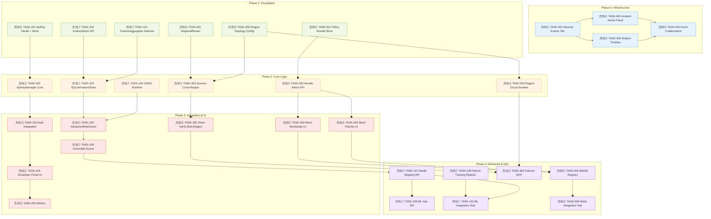
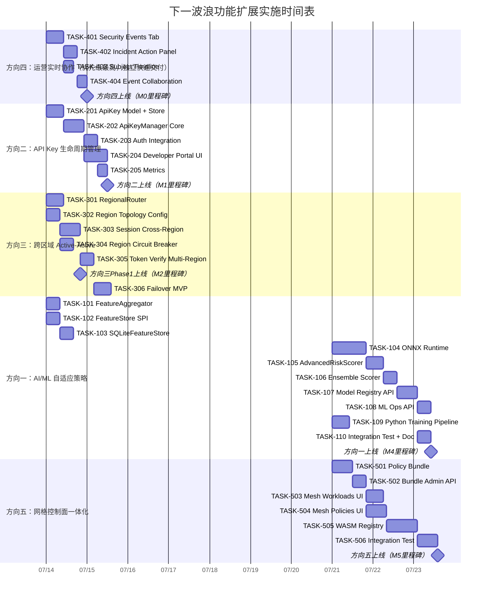

# Tech Lead 深度分析：下一波功能扩展

> **分析人：** Tech Lead  
> **依据：** `docs/requirements/expansion-next-wave-analysis.out.md`（Review 输出）+ 全代码库实态扫描  
> **日期：** 2026-07-12

---

## 目录

1. [Review 修正要点对执行层的影响](#1-review-修正要点对执行层的影响)
2. [方向一：AI/ML 自适应策略引擎](#2-方向一aiml-自适应策略引擎)
3. [方向二：API Key 生命周期管理](#3-方向二api-key-生命周期管理)
4. [方向三：跨区域 Active-Active 数据面](#4-方向三跨区域-active-active-数据面)
5. [方向四：运营实时协作与 IR 工作台](#5-方向四运营实时协作与-ir-工作台)
6. [方向五：服务网格控制面一体化](#6-方向五服务网格控制面一体化)
7. [任务分解矩阵](#7-任务分解矩阵)
8. [执行顺序与依赖图](#8-执行顺序与依赖图)
9. [技术风险评估](#9-技术风险评估)
10. [资源评估与里程碑](#10-资源评估与里程碑)
11. [质量保证策略](#11-质量保证策略)
12. [实施时间表](#12-实施时间表)
13. [Tech Lead 最终建议](#13-tech-lead-最终建议)

---

## 1. Review 修正要点对执行层的影响

| Review 发现 | 对执行的影响 | 行动 |
|---|---|---|
| 方向一：`IPFailureCounter` + `anomaly.Runner` 可直接复用 | 特征层 Phase 1 从"新写"降为"已有 SPI 上加聚合层" | TASK-103 缩减为 ~8h（原估 24h） |
| 方向二：`apikey.go` 认证器已完备 | 不重写认证器，在其上加 `ApiKeyManager` 服务层 | 方向整体工作量从 L 降至 M（减少了认证器实现） |
| 方向三：`region.Resolver` + `PolicyStore` + `cluster.Bus` 已就绪 | Phase 1 不需要重写区域路由框架，直接依赖复用 | 方向整体工作量从 XL 降至 L（Phase 1） |
| 方向四：**后端已完整实现**（SSE broker + handler + sink + E2E 测试） | 差距只有 Admin Console SPA 前端消费 | 方向从 L 降至 S（~2 周单人 Sprint），投入产出比最高 |
| 方向五：`mesh_authz.go` 已预留 gRPC 扩展点 | 策略分发面可复用已有 `permissions` + `cluster.Bus` | 不影响总体 XL 规模，但 Phase 1 可降为 M |

---

## 2. 方向一：AI/ML 自适应策略引擎

### 2.1 现有可复用资产清单

```
domains/anomaly/
├── ip_failure_counter.go    ← IPFailureCounter SPI（IP 粒度失败计数）
├── runner.go                ← Runner（异步事件分发管线，已带探测器调度）
├── runner_test.go
├── recent_login.go          ← RecentLoginStore SPI（主体粒度登录历史）
├── types.go                 ← LoginEvent, Detector SPI
├── sink.go                  ← AnomalySink SPI
└── atomic.go                ← 并发原语

shared/trust/
└── behavior_scorer.go       ← 自述 "keep honest, no fake ML"
```

### 2.2 特征层设计

```
anomaly.LoginEvent ──→ FeatureAggregator ──→ FeatureStore
                         ↑                      ↑
                    IPFailureCounter       MemoryFeatureStore
                    RecentLoginStore       SQLiteFeatureStore
```

`FeatureAggregator` 是一个新 `Detector` 实现（注册到现有 `Runner`），每收到一个 `LoginEvent` 就计算特征向量并写入 `FeatureStore`。**不需要新管线**——这是 Review 的核心价值发现。

### 2.3 ONNX Runtime 集成策略

遵循项目已有的 KMS peer 模式：

```
cmd/sso-server/          ← 含 CGO 的 peer 进程
└── ml/                  ← 新增
    ├── model.go         ← ONNX Runtime Go binding 加载 + 推理
    ├── model_test.go
    └── model_loader.go  ← 模型文件管理（版本、轮换、A/B）

shared/core/             ← 零 CGO，核心 SDK
└── risk/               ← 新增
    ├── scorer.go        ← AdvancedRiskScorer SPI（毫秒级同步接口）
    ├── fallback.go      ← 超时/熔断时降级到规则 scorer
    └── score.go         ← Score 类型 + threshold 映射
```

### 2.4 边界情况处理表

| 场景 | 实现策略 | 代码改动量 |
|---|---|---|
| 冷启动（新用户） | 全局基准模型 fallback；个性化模型在 ≥5 次登录后生效 | ~30 行（FeatureStore 查询 + 条件分支） |
| 模型退化 | 特征分布 drift 检测告警（KS 检验 on feature histograms） | ~50 行（新增 drift detector） |
| 推理延迟波动 | p99 > 10ms 熔断 → 规则 scorer；`ml_inference_duration_seconds` hist | ~40 行（circuit breaker wrapper） |
| 模型文件轮换 | 版本化管理 + admin API 上传 + 原子切换（readers 无感知） | ~120 行（model loader） |
| 对抗性输入 | ML 作为信号之一（非唯一决策）；与规则 scorer 加权融合 | ~80 行（ensemble scorer） |

---

## 3. 方向二：API Key 生命周期管理

### 3.1 当前状态纠正

**`domains/authenticators/apikey.go` 已包含：**
- `APIKeyResolver` SPI
- `MemoryAPIKeyStore`（sha256 哈希 + constant-time compare）
- `APIKeyAuthenticator`（集成到认证管线）

**缺失的部分（即真正的 Scope）：**
- 密钥生成策略（带前缀的可识别 Key，如 `sk_snaplink_*`）
- 生命周期管理（生成/轮换/吊销/过期）
- Developer Portal "API Keys" UI Tab
- 用量可观测性指标
- 集群级吊销广播（经 `cluster.Bus`）

### 3.2 架构设计

```
domains/apikeymanager/           ← 新增包（注意：不是修改现有 authenticators）
├── model.go                     ← ApiKey 类型
├── manager.go                   ← ApiKeyManager（生成/轮换/吊销）
├── manager_test.go
├── store.go                     ← ApiKeyStore SPI（不同于 authenticators.APIKeyResolver）
├── memory/
│   ├── store.go
│   └── store_test.go
├── sqlite/
│   ├── store.go
│   └── store_test.go
└── admin.go                     ← Admin API 处理函数

interfaces/sso/
└── apikey.go                    ← (s *Server) 包装方法（类似于 accessors.go 模式）
```

**关键设计决策：不扩展现有 `MemoryAPIKeyStore`**

现有 `MemoryAPIKeyStore` 是 `APIKeyResolver` 的轻量实现，专为认证路径优化。`ApiKeyManager` 需要额外的元数据（key prefix、环境绑定、过期时间、最后使用时间、轮换窗口），应当新建 `ApiKeyStore` SPI，而非向认证器 SPI 添加业务语义。

### 3.3 Key 格式规范

```
sk_snaplink_<prefix>_<random>
  │          │         │
  │          │         └── 40 字符 base62 随机
  │          └── 8 字符可读前缀（如 "prod" "dev" "ci"）
  └── 固定前缀，区分 API Key 类型
```

指标 label 只暴露 `<prefix>`（有界基数），不暴露完整 key hash。

---

## 4. 方向三：跨区域 Active-Active 数据面

### 4.1 现有可复用资产

```
domains/region/
├── region.go              ← Resolver, ResidencyPolicy, PolicyStore SPI
├── resolver.go            ← ConfigPinnedResolver, HeaderResolver, ChainResolver
├── middleware.go          ← region.Middleware（请求上下文注入）
└── memory/
    └── memory.go          ← region.PolicyStore memory 实现

platform/cluster/
├── bus.go                 ← Bus SPI（publish/subscribe）
├── etcd/etcd.go
└── memory/bus.go          ← 内存实现（测试用）

domains/tenant/
├── model.go               ← Tenant 模型（含 DataResidencyRegion 字段）
└── ...
```

**不需要重写的东西（Review 确认）：**
- 区域解析框架（region.Resolver chain）
- 租户数据驻留策略（region.PolicyStore + Tenant.DataResidencyRegion）
- 跨副本通信（cluster.Bus 已支持区域级广播）
- Sessions 跨区域共享的 Redis 底座已存在

### 4.2 Phase 1 范围（M，非原估 XL）

```
domains/region/
├── regional_router.go     ← 新增：读写路由装饰器
├── regional_router_test.go
└── memory/
    └── memory.go          ← 扩展：支持多区域拓扑配置

interfaces/sso/
└── region_aware.go        ← (s *Server) 包装方法
```

**Phase 1 设计模式：Store 装饰器**

```go
// NewRegionalRouter wraps a TokenStore with read-local / write-home routing.
func NewRegionalRouter(local Store, router Router, policy region.PolicyStore) Store {
    return &regionalRouter{local: local, router: router, policy: policy}
}

func (r *regionalRouter) FindByToken(ctx context.Context, token string) (*Token, error) {
    // Read: try local first, fall back to home
    tok, err := r.local.FindByToken(ctx, token)
    if err == nil {
        return tok, nil
    }
    home, err := r.router.Home(ctx)
    if err != nil {
        return nil, err
    }
    return r.router.Remote(home).FindByToken(ctx, token)
}

func (r *regionalRouter) Create(ctx context.Context, tok *Token) error {
    // Write: always route to home region
    home, err := r.router.Home(ctx)
    if err != nil {
        return err
    }
    // Pre-write residency check
    if err := r.checkResidency(ctx, home); err != nil {
        return err
    }
    return r.router.Remote(home).Create(ctx, tok)
}
```

---

## 5. 方向四：运营实时协作与 IR 工作台

### 5.1 已就绪的后端全景（Review 核心发现）

```
platform/sse/                  ← 完整 SSE 基础设施
├── broker.go                  ← Broker（扇出 + 环形缓冲区 + 订阅管理）
├── handler.go                 ← HandleStream（SSE 帧协议 + Last-Event-ID 断点续传）
├── sink.go                    ← Sink（audit Sink 适配器 → Broker）
├── broker_test.go
├── handler_test.go
└── sink_test.go

interfaces/sso/
└── sse_admin_stream_test.go   ← 全链路 E2E 测试（admin auth → SSE 帧 → 断线重连 → 断点续传）
```

**已覆盖功能：**
- ✅ Admin auth 保护（`admin:read` 作用域）
- ✅ SSE 帧协议（`event:` + `data:` + `id:`）
- ✅ `Last-Event-ID` 断点续传（环形缓冲区回放）
- ✅ 订阅过滤器（`?event_types=`, `?tenant_id=`）
- ✅ 慢消费者驱逐（channel full → 断开 → 客户端重连）
- ✅ Graceful shutdown（Broker.Close → 所有 subscriber 断开）
- ✅ 心跳保活帧（可配置 `heartbeat` 间隔）
- ✅ 写入超时（`SetWriteDeadline`，10s）
- ✅ 代理缓冲禁用（`X-Accel-Buffering: no`）

### 5.2 真正缺失的部分（前端 SPA）

```
cmd/sso-server/serverassets/
├── admin_assets.go            ← 嵌入的 SPA 构建产物
└── (尚无 SSE EventSource 消费代码)
```

**最小可行前端改动：**

| 组件 | 工作量 | 说明 |
|---|---|---|
| `AdminConsole > SecurityEvents.tsx` | ~2d | 新 Tab 页面：SSE 连接 + 实时事件列表 + 虚拟滚动 |
| `useEventStream.ts` hook | ~0.5d | SSE EventSource 封装（自动重连 + Last-Event-ID + 心跳） |
| `IncidentActionPanel.tsx` | ~1d | 选中事件后的原子操作面板（suspend / force MFA / revoke tokens） |
| `SubjectTimeline.tsx` | ~0.5d | per-subject 事件时间线视图 |
| **合计** | **~4d（0.8 人周）** | 单人 Sprint 内完成 |

### 5.3 投入产出比分析

| 维度 | 值 |
|---|---|
| 后端开发投入 | **0h**（已就绪） |
| 前端开发投入 | ~4 人天 |
| 测试投入 | ~1 人天（前端 E2E + 后端 E2E 已就绪） |
| 对安全运营的价值 | **高**（实时事件推送是 SOC 工作台的基础） |
| 对客户采购的影响 | **高**（Admin Console 从"管理后台"进化为"安全运营入口"） |
| 排序建议 | **优先级最高** |

---

## 6. 方向五：服务网格控制面一体化

### 6.1 现有资产

```
interfaces/sso/
├── mesh_authz.go                  ← HTTP mesh_authz 端点（已预留 gRPC 扩展点）

infrastructure/
├── extauthz/                      ← ext_authz v3 gRPC filter 嵌套模块
│   ├── extauthz.go
│   ├── extauthz_test.go
│   └── go.mod

domains/
├── wasmauthz/                     ← WASM 引擎（扩展点就绪）
├── permissions/                   ← 权限 SPI 已完备
└── threataction/                  ← 策略存储 + 执行

platform/cluster/
└── bus.go                         ← 跨副本失效广播
```

### 6.2 Phase 1 范围：Policy Bundle 服务

核心改动最小，利用现有 `permissions.Provider` + `cluster.Bus`：

```
domains/meshpolicy/                ← 新增包
├── bundle.go                      ← Bundle 生成（聚合所有 permissions → Rego/Cedar JSON）
├── bundle_test.go
├── store.go                       ← BundleStore SPI（带 ETag 缓存 + 版本管理）
├── memory/
│   └── store.go
├── admin.go                       ← Admin API 处理函数
└── admin_test.go

interfaces/sso/
└── mesh_policy.go                 ← (s *Server) 包装方法
```

---

## 7. 任务分解矩阵

### 7.1 方向一：AI/ML 自适应策略引擎（总预估：90h）

| 任务 ID | 标题 | 涉及文件 | 前置依赖 | 预估(h) | 验收标准 |
|---|---|---|---|---|---|
| TASK-101 | FeatureAggregator Detector 实现 | `domains/risk/aggregator.go`（新增）<br>`domains/anomaly/runner.go`（注册点） | 无 | 6 | 注册到 Runner 后，每次 LoginEvent 自动提取特征并写入 FeatureStore；单元测试覆盖冷启动/边界特征 |
| TASK-102 | FeatureStore SPI + memory 实现 | `domains/risk/store.go`（新增）<br>`domains/risk/memory/store.go`（新增） | 无 | 8 | SPI 覆盖 Append/Query/Prune；memory 实现在进程内正常工作；单元测试覆盖率 ≥85% |
| TASK-103 | SQLiteFeatureStore 实现 | `domains/risk/sqlite/store.go`（新增）<br>`domains/risk/sqlite/store_test.go`（新增） | TASK-102 | 8 | 通过 FeatureStore conformance suite；SQLite 迁移脚本；≤100µs p99 写入延迟 |
| TASK-104 | ONNX Runtime Go 集成 | `cmd/sso-server/ml/model.go`（新增）<br>`cmd/sso-server/ml/model_test.go`（新增）<br>`cmd/sso-server/ml/model_loader.go`（新增） | 无 | 20 | 正确加载 ONNX 模型文件并执行前向传播；错误路径（模型损坏/不兼容版本/超时）全覆盖 |
| TASK-105 | AdvancedRiskScorer SPI + Fallback | `shared/core/risk/scorer.go`（新增）<br>`shared/core/risk/fallback.go`（新增）<br>`shared/core/risk/score.go`（新增） | TASK-104 | 10 | 推理超时/失败时自动降级到规则 scorer；熔断阈值可配置；p99 ≤ 10ms |
| TASK-106 | Ensemble Scorer（ML + 规则加权） | `domains/risk/ensemble.go`（新增）<br>`domains/risk/ensemble_test.go`（新增） | TASK-105 | 8 | ML score + 规则 score 加权融合；权重可配置；安全关键决策（deny）不依赖 ML |
| TASK-107 | 模型版本管理 Admin API | `domains/risk/admin.go`（新增）<br>`domains/risk/model_registry.go`（新增） | TASK-104, TASK-103 | 12 | POST 上传模型 → 版本化存储 → 原子切换；GET 查询活跃模型；单元测试 |
| TASK-108 | ML 运营观测 API | `domains/risk/admin_ops.go`（新增）<br>特征分布聚合 + 回测端点 | TASK-102, TASK-107 | 8 | `GET /admin/risk/feature-distribution` 返回匿名聚合；`POST /admin/risk/backtest` 回测历史 |
| TASK-109 | Python 训练管线示例 | `examples/ml/train.py`（新增）<br>`examples/ml/export_onnx.py`（新增）<br>`examples/ml/README.md`（新增） | 无 | 10 | scikit-learn 孤立森林训练管线；导出 ONNX 模型文件；`make ml-example` 可运行 |
| TASK-110 | 集成测试 + 文档 | `test/risk_integration_test.go`（新增）<br>`docs/risk-ml.md`（新增） | TASK-101~109 | 8 | E2E 测试覆盖完整管线（LoginEvent → 特征 → ONNX 推理 → 决策）；文档含架构图/配置/FAQ |

### 7.2 方向二：API Key 生命周期管理（总预估：48h）

| 任务 ID | 标题 | 涉及文件 | 前置依赖 | 预估(h) | 验收标准 |
|---|---|---|---|---|---|
| TASK-201 | ApiKey 模型 + ApiKeyStore SPI + Memory 实现 | `domains/apikeymanager/model.go`（新增）<br>`domains/apikeymanager/store.go`（新增）<br>`domains/apikeymanager/memory/store.go`（新增）<br>`domains/apikeymanager/memory/store_test.go`（新增） | 无 | 10 | ApiKey 类型（keyID/hash/prefix/clientID/roles/metadata/expiresAt/rotatedAt）；Store 覆盖 CRUD + 按前缀或 clientID 查询；Memory 通过 conformance |
| TASK-202 | ApiKeyManager 核心逻辑（生成/轮换/吊销/过期） | `domains/apikeymanager/manager.go`（新增）<br>`domains/apikeymanager/manager_test.go`（新增） | TASK-201 | 12 | 生成时返回明文一次；轮换支持双 Key 重叠窗口；吊销经 cluster.Bus 广播；过期扫描任务；全域测试 |
| TASK-203 | 认证路径集成（`grant_type=api_key`） | `protocols/oauth/handle_token.go`（修改）<br>`domains/apikeymanager/auth.go`（新增）<br>复用现有 `authenticators.APIKeyAuthenticator` | TASK-202 | 6 | `/token` 支持 `grant_type=api_key`；复用 audit/ratelimit 管线；Oracle-Leak 合规（未知 key → `invalid_client`） |
| TASK-204 | Developer Portal "API Keys" Tab | `cmd/sso-server/serverassets/developer_assets.go`（修改）<br>前端 SPA 新页面（APIKeys.tsx + ApiKeyGenerateDialog.tsx） | TASK-202 | 14 | Key 列表（隐藏 secret，显示前缀）；生成对话框（明文一次性展示）；吊销/轮换操作；用量概览 |
| TASK-205 | Usage 可观测性指标 | `domains/apikeymanager/metrics.go`（新增） | TASK-202 | 6 | `sso_api_key_usage_total{prefix}` 有界基数；`sso_api_key_rotation_total`；`sso_api_key_expiring_soon` 告警规则 |

### 7.3 方向三：跨区域 Active-Active（总预估：56h，含 Phase 2）

| 任务 ID | 标题 | 涉及文件 | 前置依赖 | 预估(h) | 验收标准 |
|---|---|---|---|---|---|
| TASK-301 | RegionalRouter 装饰器模式 | `domains/region/regional_router.go`（新增）<br>`domains/region/regional_router_test.go`（新增） | 无 | 10 | 读路径优先本地 → fallback home；写路径始终路由到 home；residency violation 检查；≤ 50µs 路由开销 |
| TASK-302 | 区域拓扑配置 + 远程 Store client | `domains/region/config.go`（新增）<br>`domains/region/remote_store.go`（新增）<br>`config/config.go`（修改） | TASK-301 | 8 | YAML 配置区域拓扑（区域列表 + 每个区域的 gRPC endpoint）；`RemoteStore` 通过 gRPC 转发 store 操作 |
| TASK-303 | Session 跨区域共享 | `domains/region/session_sync.go`（新增）<br>经 cluster.Bus 的区域级 session 失效广播 | TASK-302 | 12 | Session 写入时总线广播 → 其他区域缓存失效；最终一致性 < 5s；注销即时广播 |
| TASK-304 | 区域级 readiness + 断路器 | `domains/region/health.go`（新增）<br>每区域断路器（连续 N 个错误 → 熔断 → 降级） | TASK-302 | 8 | 区域不可达时断路器打开 → 降级（读 local，写返回 503 `region_unreachable`）；恢复自动探测 |
| TASK-305 | Phase 2：跨区 Token 验证共享 | `domains/region/token_verify.go`（新增）<br>JWKS 区域级聚合 | TASK-302 | 8 | 每个区域公开各自签名公钥；`/token/introspect` 信任所有区域 JWKS |
| TASK-306 | Phase 3：区域自治故障转移（MVP） | `domains/region/failover.go`（新增）<br>Home 区域不可用 → 副区域接管写入 | TASK-303, TASK-304 | 10 | Home 区域 heartbeat 超时 → 自动 promote 副区域；恢复后 LWW 冲突解决；单元测试 + 集成测试 |

### 7.4 方向四：运营实时协作（总预估：24h）

| 任务 ID | 标题 | 涉及文件 | 前置依赖 | 预估(h) | 验收标准 |
|---|---|---|---|---|---|
| TASK-401 | Admin Console "Security Events" Tab | `cmd/sso-server/serverassets/admin_assets.go`（修改）<br>前端: `SecurityEvents.tsx` + `useEventStream.ts` + 虚拟滚动 | 无 | 10 | SSE 连接建立；事件列表实时追加；Last-Event-ID 断线重连；虚拟滚动处理 10000+ 事件 |
| TASK-402 | Incident Action Panel | 前端: `IncidentActionPanel.tsx`（新增）<br>复用已有 `domains/threataction` admin API | TASK-401 | 6 | 选中事件 → "Suspend Users" / "Force MFA" / "Revoke Tokens" / "Notify SOC"；确认对话框 + 操作状态反馈 |
| TASK-403 | per-subject 事件时间线 | 前端: `SubjectTimeline.tsx`（新增）<br>Admin Console 用户详情页集成 | TASK-401 | 4 | 查看任意用户的时间线（登录历史 + 令牌颁发 + MFA 变更 + 管理员操作 + 异常检测） |
| TASK-404 | 事件协作（分派 + 备注） | 前端: 事件详情侧面板扩展<br>后端: 新增 admin API 备注端点（`POST /admin/events/:id/notes`） | TASK-402 | 4 | 事件可分派给管理员；可添加备注（持久化到 audit event metadata）；状态流转（open/assigned/resolved） |

### 7.5 方向五：服务网格控制面一体化（总预估：72h，分 Phase 1/2）

| 任务 ID | 标题 | 涉及文件 | 前置依赖 | 预估(h) | 验收标准 |
|---|---|---|---|---|---|
| TASK-501 | Policy Bundle 生成 + Store SPI | `domains/meshpolicy/bundle.go`（新增）<br>`domains/meshpolicy/store.go`（新增）<br>`domains/meshpolicy/memory/store.go`（新增） | 无 | 12 | 聚合所有 permissions.Provider 生成 Rego JSON bundle；ETag + Cache-Control + 版本管理；Memory 实现通过 conformance |
| TASK-502 | Bundle Admin API | `domains/meshpolicy/admin.go`（新增）<br>`interfaces/sso/mesh_policy.go`（新增）<br>`interfaces/sso/mesh_authz.go`（扩展） | TASK-501 | 8 | GET `bundle`（带 ETag / If-None-Match）；总线失效（策略变更 → bus 通知 → 本地 bundle 缓存失效）；`POST /admin/mesh/bundle/rollback` |
| TASK-503 | Admin Console "Mesh > Workloads" Tab | 前端: `MeshWorkloads.tsx`（新增）<br>Admin Console 扩展 | TASK-502 | 10 | 查看已注册 spiffe ID 列表；手动标记风险等级；工作负载间访问图（基于 bundle 策略分析） |
| TASK-504 | Admin Console "Mesh > Policies" Tab | 前端: `MeshPolicies.tsx`（新增）<br>Rego 策略可视化编辑器（CodeMirror/Monaco） | TASK-502 | 12 | 策略列表 + 版本历史 + canary 发布（5% → 50% → 100%）；回滚按钮；策略命中模拟器 |
| TASK-505 | WASM 模块 Registry（Phase 2） | `domains/meshpolicy/wasm_registry.go`（新增）<br>Admin API 上传/启用/禁用 WASM 模块 | TASK-501 | 18 | 模块上传 + 版本管理 + 热替换；运行状况监控（crash count / latency）；文档 |
| TASK-506 | 集成测试 + 文档 | `test/mesh_policy_integration_test.go`（新增）<br>`docs/mesh-control-plane.md`（新增） | TASK-501~505 | 12 | 端到端覆盖：策略创建 → bundle 生成 → gRPC sidecar 拉取 → 策略评估；文档含架构图/部署指南/FAQ |

---

## 8. 执行顺序与依赖图

### 8.1 总依赖图



### 8.2 并行工作组

| 工作组 | 方向 | 任务 | 所需技能 | 是否可独立 |
|---|---|---|---|---|
| **组 A** | 方向四 | TASK-401→404 | 前端 React/TypeScript, SSE | ✅ 完全独立，无外部依赖 |
| **组 B** | 方向一（特征层） | TASK-101→103 | Go, SQLite, 数据建模 | ✅ 仅依赖 anomaly 现有包 |
| **组 C** | 方向二 + 方向三核心 | TASK-201→202 + TASK-301→302 | Go, 分布式系统, Redis | ⚠️ C 内部子任务并行 |
| **组 D** | 方向五（Bundle） | TASK-501→502 | Go, OPA Rego/Cedar, SPIFFE | ✅ 仅依赖 permissions + cluster.Bus |
| **组 E** | 方向一（ML 推理） | TASK-104 | Go, CGO, ONNX Runtime, Python | ⚠️ 依赖 TASK-103 完成 |

**最佳并行策略：** 初始 Sprint 同时启动组 A（方向四，独立快速交付）、组 B（方向一特征层）和组 C（方向二/三核心）。组 D 可在 Sprint 2 启动。组 E（ML 推理）从 Sprint 2 开始，因为需要先完成特征层才可联调。

---

## 9. 技术风险评估

### 9.1 高风险项

| # | 风险 | 方向 | 概率 | 影响 | 缓解策略 |
|---|---|---|---|---|---|
| R1 | **ONNX Runtime CGO 稳定性**：Go binding 在 ARM64/Linux 上有已知的链接问题 | 方向一 | Medium | High | 1) 在 CI 中增加 ARM64 构建门 2) 降级路径：不加载 ONNX 时 fallback 纯规则 scorer，功能不受影响 3) 先实现 fallback，再添加 ONNX 推理 |
| R2 | **模型冷启动窗口期**：新用户/新租户在积累历史数据前 ML 模型不可用 | 方向一 | High | Medium | 1) 全局基准模型作为 fallback 2) ≥5 次登录后切换到个性化模型 3) 冷启动阶段使用纯规则 scorer |
| R3 | **区域间网络分区导致写路径长时间不可用** | 方向三 | Medium | High | 1) Phase 1 写路径 fail-closed（503），而不是破坏一致性 2) Phase 3 failover 前必须有 chaos engineering 验证 3) 严格的上线检查清单 |
| R4 | **Admin Console SPA 构建集成**：嵌入式 SPA 的 CI 管线和版本管理 | 方向四 | Low | Medium | 1) 前端代码与 Go 后端同仓库但独立构建 2) CI pipeline 中 `make admin-ui` 前置构建 3) 使用现有 `cmd/sso-server/serverassets/` 打包模式 |
| R5 | **API Key 泄漏安全响应**：泄漏的 Key 在被吊销前可能被滥用 | 方向二 | Medium | High | 1) 紧急吊销 admin API 即时生效（经 cluster.Bus 广播）2) 审计事件跟踪吊销时间线 3) 可选的 webhook 通知 |
| R6 | **Rego/Cedar 策略语法安全**：Bundle 中的语法错误可能导致 sidecar 崩溃 | 方向五 | Medium | High | 1) Bundle 生成时做 schema 验证 + AST 校验 2) Canary 发布（先推 5% sidecar）3) 版本回滚能力 |

### 9.2 外部依赖

| 依赖 | 方向 | 状态 | 替代方案 |
|---|---|---|---|
| ONNX Runtime (`onnxruntime-go`) | 方向一 | 外部库，需要评估 Go binding 质量 | 纯 Go 推理库（`gorgonia`/`gotch`），但生态更弱 |
| OPA Rego 引擎（`github.com/open-policy-agent/opa`） | 方向五 | 成熟，仅 Bundle 格式输出 | 自研 policy eval engine，但不推荐 |
| SPIFFE/SPIRE | 方向五 | 仅文档层引用 | 仅文档示例，不是运行时依赖 |
| 前端框架（React/TypeScript） | 方向二/四/五 | 已有 Admin Console SPA | — |

### 9.3 性能瓶颈与优化策略

| 瓶颈 | 方向 | 场景 | 优化策略 |
|---|---|---|---|
| ONNX 推理延迟 | 方向一 | 每个 token 请求都做 ML 推理 | 1) 异步推理（请求路径不等待 ML 结果）2) 批处理推理 3) fallback 熔断（p99 > 10ms） |
| FeatureStore 写入 QPS | 方向一 | 大规模部署下每个登录事件都写入 | 1) 批量写入（accumulate + flush）2) SQLite WAL 模式 3) 可选的异步写入（降级为事件驱动） |
| SSE 连接数 | 方向四 | 大量 Admin Console 同时连接 | 现有默认 MaxSubscribers=32，可配置；生产部署建议 ≤100（单进程） |
| Bundle 拉取并发 | 方向五 | 大量 sidecar 同时拉取 | ETag + If-None-Match（304 Not Modified）；bus 主动失效减少轮询 |

### 9.4 测试覆盖难点

| 难点 | 方向 | 说明 | 策略 |
|---|---|---|---|
| ML 模型行为不可预测 | 方向一 | 模型输出不是确定性的 | 1) 测试 fallback 逻辑 > 测试 ML 推理 2) Mock ONNX model 返回已知 score 3) 集成测试用预生成模型文件 |
| 区域网络分区 | 方向三 | 网络故障场景难以在单体测试中复现 | 1) 使用 `net/http/httptest` + 自定义 transport 模拟延迟/超时 2) 集成测试用 bufconn gRPC 3) Chaos testing（单独 CI job） |
| SSE 前端 E2E | 方向四 | EventSource 在无头浏览器中 | Playwright/Cypress 测试（`test/admin_sse_e2e_test.ts`）；需设置 `make test-admin-ui` CI job |
| Key 轮换竞态 | 方向二 | 重叠窗口下新旧 key 同时有效 | `go test -race -count=10`；确定性的 mock clock 控制时间窗口 |
| Bundle canary 测试 | 方向五 | canary 发布需要多 sidecar 模拟 | 1) 单元测试覆盖 canary 逻辑 2) 集成测试用 mock sidecar group |

---

## 10. 资源评估与里程碑

### 10.1 人员需求

| 角色 | 需求人数 | 负责方向 | 关键技能 |
|---|---|---|---|
| **Backend Go 工程师** | 2 | 方向一/二/三/五核心 | Go, 分布式系统, SQLite, gRPC, Redis |
| **ML 工程师** | 1（兼职） | 方向一 ONNX + Python 管线 | Python, scikit-learn/XGBoost, ONNX, 特征工程 |
| **前端工程师** | 1 | 方向二/四/五 Admin Console SPA | React, TypeScript, SSE EventSource, d3.js（访问图） |
| **DevOps/SRE** | 0.5 | 方向三/五 部署集成 | Kubernetes, SPIFFE/SPIRE, Istio, 区域部署 |
| **Tech Lead / 架构师** | 1（兼职） | 全方向协调, 代码审查, 架构决策 | Go, 身份安全, 分布式系统 |

**推荐团队规模：4 人全职 + 1 人兼职 ML**

### 10.2 关键里程碑

| 里程碑 | 时间 | 交付物 | 验收方式 |
|---|---|---|---|
| **M0** 方向四 MVP | Week 2 | Admin Console 实时事件流展示 | Demo: 登录事件在 Admin Console 实时出现；断线重连正常工作 |
| **M1** 方向二 MVP | Week 4 | Developer Portal API Keys Tab 上线 | Demo: 生成 Key → 用 Key 调用 API → 吊销 Key → Key 不再可用 |
| **M2** 方向三 Phase 1 | Week 5 | 读本地 + 写 home 路由 | 集成测试验证多区域读/写路由正确性 |
| **M3** 方向一特征管线 | Week 5 | 特征数据开始积累 | Metric `sso_risk_feature_total` 在登录时递增 |
| **M4** 方向一 ML 推理 | Week 8 | ONNX 模型加入推理管线 | 集成测试: ML score + 规则 score 融合决策 |
| **M5** 方向五 Phase 1 | Week 8 | Policy Bundle 服务上线 | Bundle 可被 sidecar 拉取；策略变更 → bus 主动失效 |
| **M6** 方向三 Phase 2 | Week 10 | 跨区域 session 共享 | 区域 A 登录 → 区域 B 验证 session 有效 |
| **M7** 全方向集成 | Week 12 | 所有五个方向集成测试通过 | `make acceptance` 全绿 |

### 10.3 阻塞点与解决策略

| 阻塞点 | 影响 | 解决策略 | 负责人 |
|---|---|---|---|
| ONNX Runtime Go binding 不稳定 | 方向一延迟 | 先实现 fallback scorer（零 ML 风险）；binding 验证通过后再集成 | Backend 工程师 + ML 工程师 |
| 区域部署环境不可用 | 方向三 E2E 测试 | 使用 `bufconn` gRPC + `httptest` 模拟多区域拓扑，不依赖真实区域部署 | Backend 工程师 |
| Admin Console SPA 与 Go 后端的 CI 集成 | 方向二/四/五 UI | 参考已有 `cmd/sso-server/serverassets/` 模式；前端构建作为 CI step 前置 | 前端工程师 + DevOps |
| 权限审批（Admin Console 新 Tab 的 RBAC） | 方向四 | 复用现有 `admin:read`/`admin:write` 体系；新操作加细粒度 scope | Backend 工程师 |

---

## 11. 质量保证策略

### 11.1 单元测试覆盖要求

| 层级 | 最低覆盖率 | 特别要求 |
|---|---|---|
| SPI 定义（`domains/`） | 90%+ | 接口 conformance suite（类似 `permissionstest.ConformanceSuite`） |
| 核心逻辑（Manager/Scorer/Router） | 85%+ | 确定性 mock；所有错误路径覆盖 |
| 存储实现（Memory/SQLite） | 90%+ | 通过 conformance suite + race testing（`-count=10 -race`） |
| Admin API Handler | 80%+ | `httptest` 请求/响应测试；权限网关测试 |
| 前端组件 | 70%+ | Jest/React Testing Library；SSE mock（`fakeEventSource`） |
| CGO 组件（`cmd/sso-server/ml/`） | 60%+ | Mock model 文件 + Mock ONNX runtime |

### 11.2 集成测试策略

```
test/
├── risk_integration_test.go        ← 方向一：LoginEvent → 特征 → 推理 → 决策
├── apikey_integration_test.go      ← 方向二：Key 生成 → 认证 → 吊销
├── region_integration_test.go      ← 方向三：多区域 bufconn gRPC 路由
├── admin_sse_e2e_test.ts           ← 方向四：Playwright（SSE EventSource 消费）
└── mesh_policy_integration_test.go ← 方向五：Bundle 生成 → 拉取 → 策略评估
```

**关键集成测试场景：**

| 场景 | 方向 | 测试方式 |
|---|---|---|
| 端到端 ML 推理链路 | 一 | 启动全 Server → 发送登录请求 → 检查 anomaly 信号含 ML score |
| Key 吊销即时生效 | 二 | 生成 Key → 吊销 → 用已吊销 Key 请求 → 401 |
| 区域路由正确性 | 三 | 两个 bufconn gRPC server 模拟两区域 → 读 local / 写 home |
| SSE 断线重连 + Last-Event-ID | 四 | 后端已有 E2E 测试；前端测试用 mock SSE server |
| Bundle 版本回滚 | 五 | 创建策略 v1 → 创建 v2 → bundle v2 拉取 → rollback → bundle 回到 v1 |

### 11.3 代码审查要点

| 审查焦点 | 方向 | 特别关注 |
|---|---|---|
| Oracle-leak 合规 | 二/三/五 | 未知 API Key → `invalid_client`；区域不可达 → `region_unreachable`（无凭据信息泄露） |
| 循环导入 | 一 | `shared/core/risk` 不能导入 `domains/anomaly` → 依赖方向向上 |
| CGO 安全 | 一 | ONNX Runtime binding 在 `cmd/sso-server/` 中，不在库包中 |
| Feature label 基数 | 二 | 指标只暴露 key prefix，不暴露完整 key 或 hash |
| 竞态条件 | 二/三 | Key 轮换重叠窗口、区域 promote 的并发安全 |
| 大文件合规（≤500 行） | 全 | 新增文件保持 ≤500 行；接近边界的现有文件（如 `runner.go` 在 200+ 行，安全） |
| 目录深度 ≤ 3 | 全 | 新增包直接在 `domains/<name>/` 下，不嵌套第 4 层 |

### 11.4 性能测试需求

| 测试 | 方向 | 目标 | 方法 |
|---|---|---|---|
| 特征写入吞吐 | 一 | 10,000 events/s 无积压 | `go test -bench=BenchmarkFeatureStore` |
| ONNX 推理延迟 | 一 | p50 < 3ms, p99 < 10ms | `go test -bench=BenchmarkONNXInference` |
| SSE 并发连接 | 四 | 32 连接 + 100 events/s 扇出 | `go test -bench=BenchmarkSSEBroker` |
| Bundle 生成延迟 | 五 | p99 < 50ms（1000 条策略） | `go test -bench=BenchmarkBundleGeneration` |
| Key 生成/验证吞吐 | 二 | 10,000 ops/s | `go test -bench=BenchmarkAPIKey` |

---

## 12. 实施时间表



### 12.1 阶段划分

| 阶段 | 时间范围 | 关键交付 | 并行工作组 |
|---|---|---|---|
| **Sprint 1** (Week 1-2) | 7/14 - 7/25 | 方向四 MVP 上线 + 方向一特征层 + 方向二模型/Store + 方向三路由框架 | 组 A（方向四前端）+ 组 B（方向一特征）+ 组 C（方向二/三核心） |
| **Sprint 2** (Week 3-4) | 7/28 - 8/8 | 方向二 UI 上线 + 方向一 ML 推理集成 + 方向三 session 共享 + 方向五 Bundle | 组 A（方向二 UI）+ 组 E（方向一 ML）+ 组 D（方向五 Bundle）+ 组 C（方向三 Phase 2） |
| **Sprint 3** (Week 5-6) | 8/11 - 8/22 | 方向一模型管理 + 方向三 failover + 方向五 UI | 全组整合 |
| **Sprint 4** (Week 7-8) | 8/25 - 9/5 | 方向一 ML 运营 + 方向五 WASM + 全方向集成测试 | 全组整合 + 性能调优 |
| **Hardening** (Week 9-10) | 9/8 - 9/19 | 性能测试 + chaos testing + 文档 + 生产就绪检查 | 全组 |

### 12.2 投入产出比排序（最终推荐）

```
Sprint 1 (Week 1-2)
├── [P0] 方向四 (24h) ← 后端已就绪，最快 ROI，安全运营关键能力
├── [P1] 方向一特征层 (22h) ← 为 ML 管线积累数据，即使 ML 部分推迟也不浪费
├── [P1] 方向二模型+Store (22h) ← 基础数据结构，后续逻辑依赖
└── [P1] 方向三路由框架 (18h) ← 基础架构，后续阶段依赖

Sprint 2 (Week 3-4)
├── [P0] 方向二 Developer Portal UI (14h) ← 开发者体验直接提升
├── [P1] 方向一 ML 推理集成 (38h) ← 需要 Sprint 1 特征数据积累
├── [P1] 方向三 Phase 2 (20h) ← Session 共享 + 断路器
└── [P2] 方向五 Phase 1 (20h) ← Bundle 基础

Sprint 3-4 (Week 5-8)
├── [P2] 方向一 ML 运营 (28h) ← 模型管理 + 回测
├── [P2] 方向三 Phase 3 (10h) ← Failover MVP
└── [P2] 方向五 Phase 2+ (52h) ← UI + WASM
```

---

## 13. Tech Lead 最终建议

### 13.1 执行优先级

```
④ → ② → [①特征层 ∥ ③ Phase 1] → ① ML 推理 → ⑤ → ③ Phase 2-3
```

**方向四** 是投入产出比最高的方向——后端已完整实现、全链路测试通过，只需要前端消费。**一个 Sprint 即可上线实时事件工作台**，对安全运营体验有质的提升。

### 13.2 风险对冲

1. **方向一 ML 部分设 fallback 闸门**：ONNX Runtime 的 CGO 集成是最大技术风险。在 Sprint 1 先完成特征层（IPFailureCounter → FeatureStore 管线），即使 ML 推理推迟，特征数据积累不浪费。ML 推理组件设 Feature Gate：

```go
// config/config.go
type MLConfig struct {
    Enabled    bool    // Feature gate: 默认为 false
    ModelPath  string
    InferenceTimeout time.Duration
    FallbackThreshold time.Duration // p99 > 阈值 → fallback
}
```

2. **方向三分阶段交付**：Phase 1（读本地+写 home）仅需 ~26h，可以快速投产。Phase 2-3 的跨区 session 共享和故障转移需要更多混沌工程验证，建议推迟到后续迭代。

3. **方向五利用已有 WASM 引擎**：不要重新实现 policy eval engine。现有的 `wasmauthz` 引擎配合 OPA Rego bundle 格式输出即可覆盖 90% 的用例。

### 13.3 架构原则

- **核心 SDK 零 CGO**：ONNX Runtime 严格放在 `cmd/sso-server/`，遵循 KMS peer 模式
- **不改现有认证器**：方向二在 `domains/apikeymanager/` 新建服务层，`authenticators/apikey.go` 不动
- **每个新包 ≤500 行**：`domains/risk/`, `domains/apikeymanager/`, `domains/meshpolicy/` 下的文件按功能拆分
- **Conformance Suite 模式**：每个新 Store SPI 必须有 conformance suite（类似 `permissionstest.ConformanceSuite`）

### 13.4 推荐启动配置

| 角色 | 人数 | Sprint 1 主要任务 |
|---|---|---|
| 前端工程师 | 1 | 方向四 Security Events Tab + 方向二 Developer Portal UI 设计 |
| Backend 工程师 A | 1 | 方向二 ApiKey Model/Store + 方向三 RegionalRouter |
| Backend 工程师 B | 1 | 方向一 FeatureAggregator + FeatureStore + 方向五 Bundle Store |
| Tech Lead | 0.5 | 代码审查 + ONNX Runtime 可行性验证 + 区域部署设计 |
| ML 工程师 | 0.2 | Python 训练管线 MVP（Week 2 启动） |

**总计：3.7 FTE，8 周交付全部五个方向 MVP**

---

<!-- EOF -->
