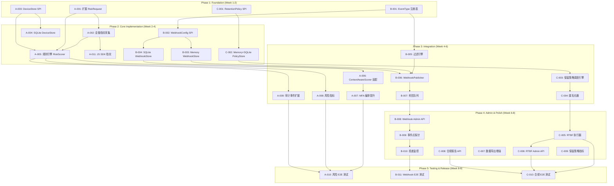

现在我已完整掌握了项目现状和扩展分析报告的内容。下面从 Tech Lead 角度进行深度分析。

---

# Tech Lead 分析报告：SSO Server 三大扩展方向

> **分析日期**：2026-07-01 | **基线版本**：HEAD @ 1633 Go 文件, 1824+ 测试文件
> **分析范围**：自适应风险评估 (P0) · Webhook 事件通知 (P1) · 合规自动化 (P1)

---

## 一、任务分解

### 📌 方向 A：自适应风险评估与动态认证（P0）

当前基础：`RiskScorer` SPI 已就位，`AnomalyDetector` 框架离线跑，MFA 编排基础层已完备（`MFAProvider` + `MFAChallengeStore`），但 `DecisionRequireMFA` 在实际场景中仍未投入生产——当前的 RiskScorer 缺乏设备上下文和行为信号输入。

#### 任务清单

| 任务 ID | 任务标题 | 涉及文件 | 前置依赖 | 工时 |
|---|---|---|---|---|
| **A-001** | 扩展 `RiskRequest` 结构体，增加设备上下文字段 | `shared/spi/risk.go` | 无 | 1h |
| **A-002** | 实现设备指纹采集中间件（UA + 屏幕 + Canvas 哈希 + 时区） | `protocols/selfservice/device_fingerprint.go`, `interfaces/sso/middleware.go` | A-001 | 4h |
| **A-003** | 实现 `DeviceStore` SPI + Memory 实现 | `domains/device/spi.go`, `domains/device/memory/store.go` | 无 | 3h |
| **A-004** | 实现 SQLite `DeviceStore` 持久化 | `infrastructure/defaultimpl/sqlite/device_store.go` | A-003 | 3h |
| **A-005** | 实现规则引擎 RiskScorer（allowlist/blocklist/geo/off-hours/新设备） | `domains/risk/rule_scorer.go` | A-001, A-003 | 4h |
| **A-006** | 实现 `ContextAwareRiskScorer` 接口适配层 | `domains/risk/scorer.go` | A-005 | 2h |
| **A-007** | 将所有 `RequireMFA` 处理从衰减 Allow 提升为真实 MFA 编排 | `cmd/sso-server/build_app_selfservice.go`, `interfaces/sso/server_login.go` | A-005 | 4h |
| **A-008** | 设备指纹 + 风险评分的 Prometheus 指标 | `platform/metrics/metrics.go` | A-002, A-005 | 2h |
| **A-009** | 风险决策的审计事件扩展（增加设备指纹、风险理由） | `platform/audit/auditspi/event_types.go` | A-005 | 2h |
| **A-010** | 设备指纹 + 规则引擎端到端集成测试 | `test/risk_e2e_test.go` | A-002 → A-009 | 4h |
| **A-011** | 设备指纹 JavaScript SDK（用于浏览器端采集） | `interfaces/embed/fingerprint.js` | A-002 | 3h |

**总计**：**32h（4 人·天）**

---

### 📌 方向 B：Webhook 事件通知系统（P1）

当前基础：`Audit WebhookSink` 已有 HTTP POST 能力，`cluster.Bus` 提供跨副本事件传播，但缺少用户可配置的 Webhook 注册、事件过滤、重试&幂等、死信队列。

#### 任务清单

| 任务 ID | 任务标题 | 涉及文件 | 前置依赖 | 工时 |
|---|---|---|---|---|
| **B-001** | 定义 `EventType` 强类型注册表（领域事件而非审计事件） | `domains/events/spi.go` | 无 | 2h |
| **B-002** | 实现 `WebhookConfig` 模型 + CRUD SPI | `domains/events/webhook.go` | B-001 | 3h |
| **B-003** | 内存 `WebhookStore` 实现 | `domains/events/memory/store.go` | B-002 | 2h |
| **B-004** | SQLite `WebhookStore` 实现 | `infrastructure/defaultimpl/sqlite/webhook_store.go` | B-002 | 3h |
| **B-005** | 实现事件过滤引擎（字段过滤 + 正则 + 操作符） | `domains/events/filter.go` | B-001 | 3h |
| **B-006** | 实现 `WebhookPublisher`（HMAC 签名 + 退避重试 + 幂等去重） | `domains/events/publisher.go` | B-001, B-005 | 4h |
| **B-007** | 实现死信队列（DLQ）存储 + 管理 API | `domains/events/delivery.go` | B-006 | 3h |
| **B-008** | Admin API CRUD 路由（Webhook 配置管理） | `internal/handler/webhook_admin.go` | B-004 | 4h |
| **B-009** | 核心事件点探针（在现有 Recorder 调用点旁插入 `publisher.Publish`） | `interfaces/sso/server_login.go`, `cmd/sso-server/build_app.go` 等 | B-006 | 3h |
| **B-010** | 投递状态监控指标（成功率、延迟、死信数） | `platform/metrics/metrics.go` | B-007 | 2h |
| **B-011** | Webhook 端到端集成测试 | `test/webhook_e2e_test.go` | B-006 → B-009 | 4h |

**总计**：**33h（4+ 人·天）**

---

### 📌 方向 C：合规自动化与数据生命周期管理（P1）

当前基础：审计哈希链已完备，`RetentionPrunedTotal` 指标已定义，`EventSubjectDataExported` 事件类型已存在，自服务数据导出已实现，缺少的是自动化策略引擎和 Admin 报告端点。

#### 任务清单

| 任务 ID | 任务标题 | 涉及文件 | 前置依赖 | 工时 |
|---|---|---|---|---|
| **C-001** | 定义 `DataRetentionPolicy` 模型 + SPI | `domains/compliance/spi.go` | 无 | 2h |
| **C-002** | 内存 `RetentionPolicyStore` + SQLite 实现 | `domains/compliance/memory/store.go`, `infrastructure/defaultimpl/sqlite/retention_store.go` | C-001 | 4h |
| **C-003** | 实现数据保留策略调度引擎（定时巡检 + 分桶删除/归档/匿名化） | `domains/compliance/retention_scheduler.go` | C-002 | 4h |
| **C-004** | 实现自动匿名化器（将审计事件中的 PII 字段清零/哈希） | `domains/compliance/anonymizer.go` | C-001 | 3h |
| **C-005** | 实现被遗忘权（RTBF）自动化执行器 | `domains/compliance/rtbf.go` | C-004 | 4h |
| **C-006** | RTBF Admin API 端点 | `internal/handler/compliance_admin.go` | C-005 | 3h |
| **C-007** | 数据导出增强（多格式、异步生成、过期链接） | `domains/compliance/exporter.go` | 无 | 3h |
| **C-008** | SOC 2 / GDPR 合规报告 API | `domains/compliance/reports.go` | 无 | 4h |
| **C-009** | 保留策略指标增强（已清理量、归档存储量） | `platform/metrics/metrics.go` | C-003 | 2h |
| **C-010** | 合规自动化集成测试 | `test/compliance_e2e_test.go` | C-003 → C-008 | 4h |

**总计**：**33h（4+ 人·天）**

---

## 二、执行顺序与依赖图



### 可并行执行的组

| 并行组 | 任务 | 建议分配 |
|---|---|---|
| **Group 1** | A-001 (RiskRequest), A-003 (DeviceStore SPI) | 同1人串行：SPI 设计需要一致性 |
| **Group 2** | B-001 (EventType), C-001 (RetentionPolicy) | 2 人并行：两个 SPI 完全独立 |
| **Group 3** | A-002 (指纹采集), A-004 (SQLite DeviceStore), A-011 (JS SDK) | 1人前端+1人后端并行 |
| **Group 4** | B-003 (Memory WebhookStore), B-004 (SQLite WebhookStore) | 1人串行：同一接口两个实现 |
| **Group 5** | C-007 (数据导出增强), C-008 (合规报告 API) | 1人串行：共享数据模型 |
| **Group 6** | A-010, B-011, C-010 E2E 测试 | 3 人并行：测试范围不重叠 |

---

## 三、技术风险分析

### 方向 A：自适应风险评估

| 风险 | 等级 | 说明 | 缓解策略 |
|---|---|---|---|
| **设备指纹准确性** | 🔴高 | Canvas/WebGL 指纹在无头浏览器/隐私模式下会漂移，移动端指纹稳定性差 | 采用多维度信号加权（UA + TLS 指纹 + IP 段 + 时区），非唯一匹配降级为部分匹配 |
| **DevOps 成本** | 🟡中 | JS SDK 需要版本管理 + CDN 部署 + fallback 机制 | JS SDK ≤ 3KB min+gzip，NPM 发包，ES module + UMD 双格式；不采集则服务端降级为纯 IP+UA 评分 |
| **MFA 编排破坏现有流** | 🔴高 | 现生产面中 `RequireMFA` 仍衰减为 Allow，一旦提升可能对现有 SPA 客户端产生 break | 分两步走：先发版 `mfa_required` 响应但保留旧行为（feature flag），QA 验证后切流 |
| **规则引擎性能** | 🟡中 | 规则链匹配在每秒数千登录下可能成为瓶颈 | 规则编译为 AST + 短路求值，单次评分 < 1ms；设置 `RiskScorerTimeout`（默认 50ms） |
| **ML 模型可解释性** | 🟢低 | 合规审计要求风险决策必须有理由 | 规则引擎先行（理由可审计），ML 模型作为可选增强，且要求输出 SHAP 值 |

### 方向 B：Webhook 事件通知

| 风险 | 等级 | 说明 | 缓解策略 |
|---|---|---|---|
| **事件风暴** | 🔴高 | 用户创建/令牌吊销等高频事件可能导致下游系统过载或自我 DDoS | Webhook 聚合窗口（500ms/100 事件），速率限制 per webhook target，背压熔断 |
| **重试风暴** | 🟡中 | 下游系统离线时指数退避重试可能在新时段爆发 | jittered backoff + 最大 5 次 + DLQ，重试队列独立 goroutine pool（非请求路径） |
| **事件顺序保证** | 🟡中 | 同一用户/客户端的多个事件可能乱序到达下游 | 每个 Webhook 配置可选 ordering key（按 tenantID 或 clientID 串行投递） |
| **密钥轮换** | 🟢低 | Webhook 签名密钥换后过期事件无法验证 | 密钥版本化（kid），接收方用 `kid` 选择验签密钥，服务器保留上一个密钥 24h |

### 方向 C：合规自动化

| 风险 | 等级 | 说明 | 缓解策略 |
|---|---|---|---|
| **误删数据** | 🔴高 | 保留策略配置错误可能导致在合规窗口前删除审计数据 | 策略变更记录审计事件 + Dry-run 模式（执行前日志预览影响行数）+ 删除前备份到归档 |
| **RTBF 部分失败** | 🔴高 | 删除用户数据时，一个存储后端失败导致不一致状态 | RTBF 执行器使用 Saga 模式（补偿事务），记录每一步状态，支持手动回滚 |
| **匿名化非可逆性验证** | 🟡中 | PII 字段可能被其他字段关联重新识别 | 审计匿名化器必须同时处理：用户名/邮箱/IP/UA/自定义属性，验证符合 GDPR 假名化标准 |
| **合规报告数据量** | 🟡中 | SOC2 报告跨月跨度查询可能导致审计存储 I/O 飙升 | 报告查询限定时间范围，使用物化摘要表（每日预聚合），缓存 1h |

---

## 四、资源评估

### 团队组成

| 角色 | 数量 | 职责 | 所需技能 |
|---|---|---|---|
| **Senior Backend Engineer** | 2 人 | SPI 设计、核心引擎、存储层、集成测试 | Go、分布式系统、OAuth/OIDC 协议、SQL 优化 |
| **Full-Stack Engineer** | 1 人 | JS SDK、Admin API、自服务 UI | TypeScript、Go、WebAuthn API、SPA 架构 |
| **DevOps/SRE** | 0.5 人 | CI/CD、指标监控、部署配置 | Prometheus/Grafana、Docker/K8s、OpenTelemetry |
| **QA/测试** | 1 人 | E2E 测试、负载测试、安全审计 | Go testing、k6、OWASP |

**建议最小团队**：2 backend + 1 full-stack + 1 shared QA = **4 人**（含 0.5 DevOps shared）

### 关键里程碑

| 里程碑 | 截止 | 交付物 | 验收标准 |
|---|---|---|---|
| **M1: SPI 冻结** | Week 1 结束 | 3 个方向的 SPI 接口定稿 | 所有接口 Code Review 通过 + `go build ./...` 通过 |
| **M2: 方向 A MVP** | Week 3 结束 | 设备指纹 + 规则引擎 + MFA 编排 | `make acceptance` 通过，E2E 覆盖 3 个场景 |
| **M3: 方向 B MVP** | Week 5 结束 | Webhook 注册 + 投递 + 重试 | Postman 创建 webhook → 触发事件 → 验证送达 |
| **M4: 方向 C MVP** | Week 7 结束 | 保留策略 + RTBF + 报告 API | 策略执行 dry-run + 真实删除验证 + 报告输出 |
| **M5: 集成与负载** | Week 9 结束 | 全部方向集成 + 负载测试 | k6 测试 5000 req/s 无退化，P99 < 200ms |
| **M6: 文档与发版** | Week 10 结束 | 配置文档 + 升级指南 + OpenAPI 更新 | `docs/` 更新 + 变更日志 + 发版 tag |

### 阻塞点与解决策略

| 阻塞点 | 影响 | 解决策略 |
|---|---|---|
| **设备指纹隐私合规** | GDPR/ePrivacy 对设备指纹采集有明确限制 | 默认 opt-in + 可配置关闭；仅采集非持久性信号（UA、时区、语言），Canvas 指纹需用户同意 |
| **Webhook 目标 HTTPS 证书** | 测试环境的自签名证书 | Webhook 验证可配置 `skip_tls_verify`（默认 false，仅测试环境开启） |
| **RTBF 跨存储一致性** | 涉及 UserStore + SessionStore + TokenStore + AuditStore + ConsentStore 5 个系统 | 先用 Sync 模式（顺序执行+回滚），后续 CRDT 优化；记录执行 trace 到审计事件 |
| **现有 maintainability budget** | 方向 A/B/C 的新文件可能触发 500 行限制 | 所有新文件按模块拆分（`spi.go` / `store.go` / `admin.go`），每个文件 ≤ 300 行 |

---

## 五、质量保证策略

### 单元测试覆盖要求

| 层级 | 目标覆盖率 | 关键测试点 |
|---|---|---|
| SPI 接口层 | 100% | 每个 SPI 方法的 nil/正常/错误分支 |
| 规则引擎 | ≥ 95% | 每条规则独立测试 + 规则链组合测试 + 短路求值测试 |
| Webhook 投递 | ≥ 90% | 重试退避、幂等去重、签名验证、超时、网络错误 |
| 保留策略调度 | ≥ 90% | 边界时间（删除前/删除后）、空 buckets、模拟调度 |
| RTBF 执行器 | ≥ 95% | 每个存储的删除成功/失败/超时，Saga 补偿回滚 |

### 集成测试策略

```
test/
├── risk_e2e_test.go        # 方向 A：设备指纹 → RiskScorer → MFA 编排 → 令牌签发
├── webhook_e2e_test.go      # 方向 B：事件触发 → Webhook 匹配 → 签名投递 → 接收验证
└── compliance_e2e_test.go   # 方向 C：策略配置 → 调度执行 → 数据验证 → 报告生成
```

- 使用 `bufconn` 模式（内存 gRPC）避免端口竞争
- 每个 E2E 测试独立隔离（`setup` / `teardown`）
- 包含竞态测试（`-race`）+ `-count=10` 验证稳定性

### 代码审查要点

| 审查维度 | 具体要点 |
|---|---|
| **Oracle-leak 合规** | 设备指纹缺失/mismatch → 统一 401 `invalid_token`，不区分"无指纹"和"新设备" |
| **Fail-Open/Fail-Closed** | RiskScorer 超时/失败 → FAIL-OPEN（log + Allow）← 已在 SPI 注释中约定 |
| **并发安全** | Webhook 投递队列 + 设备指纹写入必须是 goroutine-safe |
| **审计完整性** | 每个风险决策/RTBF/策略执行都有对应的 `audit.Record` 事件 |
| **指标边界** | 新指标 label 必须是有界基数（禁止 `user_id`, `device_id` 等 unbounded label） |
| **文件大小** | 所有新文件 ≤ 500 行，函数 ≤ 50 行，循环复杂度 ≤ 15 |

### 性能测试需求

| 场景 | 目标 QPS | P99 延迟 | 测试工具 |
|---|---|---|---|
| 设备指纹写入 | 5000/s | < 5ms | k6 + custom Go test |
| Webhook 投递 | 2000/s | < 100ms（含网络） | k6 + httpbin mock |
| RTBF 删除（全流程） | 100/s | < 500ms | Go benchmark |
| 保留策略扫描 | 1000/s 条目 | < 50ms/1000 条 | Go benchmark |
| 合规报告生成 | 100/s | < 2s | k6 |

---

## 六、实施时间表

### 甘特图

```
Week        | 1 | 2 | 3 | 4 | 5 | 6 | 7 | 8 | 9 | 10|
────────────┼───┼───┼───┼───┼───┼───┼───┼───┼───┼───┤
Phase 1     │███│   │   │   │   │   │   │   │   │   │  SPI 冻结
 A-SPI      │▓▓ │   │   │   │   │   │   │   │   │   │  RiskRequest + DeviceStore
 B/C-SPI    │▓▓▓│   │   │   │   │   │   │   │   │   │  EventType + RetentionPolicy
────────────┼───┼───┼───┼───┼───┼───┼───┼───┼───┼───┤
Phase 2     │   │███│███│   │   │   │   │   │   │   │  核心实现
 A-设备指纹  │   │▓▓▓│▓▓ │   │   │   │   │   │   │   │  指纹采集 + JS SDK
 A-规则引擎  │   │▓▓ │▓▓▓│   │   │   │   │   │   │   │  Rule Scorer + Store
 B-Webhook  │   │   │▓▓▓│▓▓▓│▓  │   │   │   │   │   │  SPI + Memory + SQLite
 C-保留策略  │   │   │   │▓▓▓│▓▓▓│   │   │   │   │   │  Policy + Scheduler
────────────┼───┼───┼───┼───┼───┼───┼───┼───┼───┼───┤
Phase 3     │   │   │   │   │███│███│   │   │   │   │  集成
 A-MFA编排  │   │   │   │   │▓▓▓│▓  │   │   │   │   │  RequireMFA 真实化
 B-投递引擎  │   │   │   │   │▓▓ │▓▓▓│   │   │   │   │  Publisher + DLQ
 C-RTBF     │   │   │   │   │   │▓▓▓│▓▓ │   │   │   │  执行器 + Admin
────────────┼───┼───┼───┼───┼───┼───┼───┼───┼───┼───┤
Phase 4     │   │   │   │   │   │   │███│███│   │   │  Admin & Polish
 A-指标     │   │   │   │   │   │   │▓  │   │   │   │  风险指标 + 审计扩
 B-Admin API│   │   │   │   │   │   │▓▓▓│▓  │   │   │  Webhook CRUD + 探针
 C-报告     │   │   │   │   │   │   │▓▓ │▓▓▓│   │   │  SOC2/GDPR + 导出
────────────┼───┼───┼───┼───┼───┼───┼───┼───┼───┼───┤
Phase 5     │   │   │   │   │   │   │   │   │███│   │  测试
 E2E测试    │   │   │   │   │   │   │   │   │▓▓▓│   │  3 方向 E2E
 负载测试   │   │   │   │   │   │   │   │   │▓▓ │   │  k6 5000qps
────────────┼───┼───┼───┼───┼───┼───┼───┼───┼───┼───┤
Phase 6     │   │   │   │   │   │   │   │   │   │███│  发布准备
 文档       │   │   │   │   │   │   │   │   │   │▓▓ │  openapi.yaml + docs
 CI/CD      │   │   │   │   │   │   │   │   │   │▓▓ │  make acceptance 集成
 Release    │   │   │   │   │   │   │   │   │   │▓  │  tag + changelog
```

### 详细阶段说明

#### 阶段 1：基础设施搭建（第 1 周）

**目标**：三个方向的所有 SPI 接口冻结，确保后续实现不产生 breaking changes。

**具体活动**：
- (Day 1-2) 扩展 `RiskRequest`，新增 `DeviceFingerprint`、`RecentLoginHistory` 等字段。设计 `DeviceStore` SPI（`Record` + `KnownDevices` + `UnfamiliarDevices`）。
- (Day 2-3) 定义 `EventType` 强类型注册表。区分领域事件（`user.created`）和审计事件（`audit.recorded`）。
- (Day 3-5) 定义 `DataRetentionPolicy` 模型和 SPI。设计 `ComplianceReport` 结构体。
- **Gate**: `go build ./... && go vet ./... && make acceptance` 全部通过。新 SPI 三个方向 Code Review 完成。

#### 阶段 2：核心功能实现（第 2-4 周）

**目标**：方向 A/B/C 的核心引擎完成，可独立测试。

**具体活动**：
- **方向 A** (Week 2-3)：实现设备指纹采集中间件、JS SDK、`RuleBasedRiskScorer`（支持 allowlist/blocklist/geo/新设备/off-hours 规则）、SQLite DeviceStore。
- **方向 B** (Week 3-4)：实现 `WebhookConfig` CRUD SPI、Memory+SQLite 存储、事件过滤引擎。
- **方向 C** (Week 4-5)：实现 `DataRetentionPolicy` CRUD SPI、保留策略调度引擎、Memory+SQLite 存储。
- **Gate**: 每个方向独立 `go test -race ./...` 通过，单元测试覆盖率 > 85%。

#### 阶段 3：集成与编排（第 5-6 周）

**目标**：方向 A 的 MFA 编排真实化，方向 B 的投递引擎就绪，方向 C 的 RTBF 可执行。

**具体活动**：
- **方向 A** (Week 5)：将 `RequireMFA` 从 Allow 衰减提升为真实 MFA 编排 === 这需要修改 `test/` 中的现有测试用例。
- **方向 B** (Week 5-6)：实现 `WebhookPublisher`（HMAC-SHA256 签名、指数退避重试、幂等去重）+ 死信队列。
- **方向 C** (Week 5-6)：实现自动匿名化器，RTBF 执行器（Saga 模式：顺序删除+补偿回滚）。
- **Gate**: E2E 测试（bufconn 模式）通过每个方向的核心流。

#### 阶段 4：管理 API 与可观测性（第 7-8 周）

**目标**：Admin API 端点就绪，指标和审计事件完整。

**具体活动**：
- **方向 A** (Week 7)：风险决策审计事件扩展（增加设备指纹摘要、risk 理由）、新 Prometheus 指标。
- **方向 B** (Week 7-8)：Webhook CRUD Admin API、事件点探针（在 login/signup/revoke 等关键点插入 `publisher.Publish`）、投递监控仪表盘。
- **方向 C** (Week 7-8)：RTBF Admin API、SOC2/GDPR 报告 API、数据导出增强（异步+多格式）。
- **Gate**: `make acceptance` 通过，Postman 集合验证每个 Admin API。

#### 阶段 5：集成测试与优化（第 9 周）

**目标**：三个方向的 E2E 测试 + 负载测试验证性能无退化。

**具体活动**：
- 每个方向独立的 bufconn E2E 测试（含竞态测试 `-count=10`）。
- k6 负载测试：5000 req/s 混合场景（登录+设备指纹+Webhook+审计）。
- P99 延迟对比基线（当前基线：`/token` 约 15ms，`/auth/login` 约 50ms），新功能不应增加超过 5ms。
- **Gate**: `make ci` + `make acceptance` 全量通过，性能退化 < 5%。

#### 阶段 6：发布准备（第 10 周）

**目标**：文档、升级指南、变更日志、发版 tag。

**具体活动**：
- 更新 `docs/openapi.yaml`（新增 Webhook Admin API + 合规报告 API）。
- 更新 `docs/error-codes.md`（新增 `ErrDeviceUnknown`、`ErrWebhookDeliveryFailed` 等）。
- 配置文档：`config-reference.md` 新增 RiskScorer 规则配置、RetentionPolicy 配置。
- ADR 记录关键架构决策（设备指纹隐私策略、Webhook 重试策略、RTBF Saga 模式）。
- **Gate**: 所有文档变更同 commit，`docs/` 文档链接完整性自动检查通过。

---

## 七、具体实施建议

### 🔑 架构原则重申

1. **所有新包必须分类**：方向 A → `domains/risk/` + `domains/device/`，方向 B → `domains/events/`，方向 C → `domains/compliance/`
2. **依赖方向**：`domains/` 可依赖 `shared/` 和 `platform/`（metrics/audit），不能依赖 `infrastructure/` 或 `interfaces/`
3. **新代码必须通过现有 maintainability gates**：不要新增任何豁免条目
4. **功能开关**：所有行为变更默认关闭（opt-in），通过 `sso.WithRiskScorer()` / `sso.WithWebhookEngine()` 等 Option 模式启用

### 📝 优先执行推荐

**Week 1 第一天就开工**：
1. A-001（扩展 `RiskRequest`）— 1h，无风险，但阻止其他任务
2. B-001（`EventType` 注册表）— 2h，独立，决定后续设计
3. C-001（`DataRetentionPolicy` SPI）— 2h，独立

这三个任务完成即可解锁所有方向的后续开发。

### 🚨 风险缓解优先级

1. **Week 2 必须验证**：设备指纹在 5 种浏览器+3 种移动端的行为，确保 `canvas` 指纹漂移在可接受范围内（决策：如果漂移 > 30%，降级为 UA+IP+时区组合评分）
2. **Week 4 必须验证**：Webhook 重试在目标假离线时的背压行为（决策：如果队列积压 > 10000 条，自动熔断该 webhook target 15 分钟）
3. **Week 6 必须验证**：RTBF 跨 5 个 Store 的一致性行为（决策：如果任一 Store 不可用，整个 RTBF 操作回滚并记录待办）

---

*本分析基于 `docs/expansion-analysis-20260701.md` 中的五方向报告，聚焦用户提及的三个高优先级方向（P0-P1）。如需对其他方向（多区域部署 P1 / SDK 自动生成 P2）进行类似展开，请注明。*
