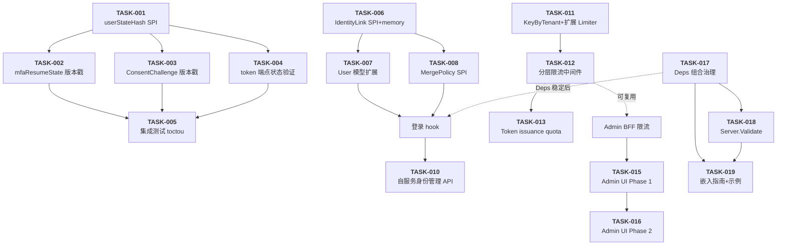

现在我已充分了解项目代码库和分析文档。以下是作为 Tech Lead 的全面分析。

---

# Tech Lead 分析：五个高价值方向

## 1. 任务分解

我将五个方向拆解为 16 个可执行任务（每项 2–6 小时）。**所有工时含单元测试。**

### 方向一：TOCTOU 多步状态裂缝

| 任务 ID | 标题 | 涉及文件 | 前置依赖 | 工时 | 验收标准 |
|---|---|---|---|---|---|
| **TASK-001** | userStateHash SPI + 计算工具 | `shared/core/user_state.go` (新建)，`shared/core/types.go` | 无 | 3h | `UserStateHash(*User) string` 对 (active, passwordUpdatedAt, tenantMembershipHash, rolesHash) 变化敏感；hash 不变证明未变；导出函数有表驱动测试覆盖所有字段变化 |
| **TASK-002** | mfaResumeState 植入版本戳 + 入口验证 | `interfaces/sso/server_mfa.go` | TASK-001 | 4h | `mfaResumeState` 新增 `StateHash`、`LoginUnixNano`；`finishMFA` 入口重新计算 hash，不一致时返回 `ErrStateChanged` + oracle-leak collapse；现有 MFA 测试全绿 |
| **TASK-003** | ConsentChallenge + session 快照版本戳 | `internal/auth/consent/challenge.go`，`interfaces/sso/handlers.go` | TASK-001 | 4h | `ChallengeStore` 在签发 challenge 时计算并存储 userStateHash；`handleConsentGate` 入口验证 hash；`AccountSelectSessionGCMSession` 类似处理。现有 consent 测试全绿 |
| **TASK-004** | /token 端点增加 user active + session active 验证 | `interfaces/sso/server_token.go`，`internal/handler/tokengrant/token_authcode.go` | TASK-001 | 3h | `authCodeValidate` 在 token 交换时调用 `user.IsActive()` + `session.IsActive()`（若 session 可获取）；不通过 → `invalid_grant`；无 oracle 泄露；现有 token 测试全绿 |
| **TASK-005** | handleStateStalenessError 辅助 + 集成测试 | `interfaces/sso/server_helpers.go`，`test/toctou_test.go` (新建) | TASK-002, TASK-003, TASK-004 | 4h | 新增 `handleStateStalenessError` 与 `mfa_invalid` 同级 oracle-safe 响应；集成测试验证：SCIM 停用用户→MFA 流程中拒绝→200 但 `error=state_changed`；password 重置后 MFA 拒绝 |

**方向一小计：18h**

### 方向二：跨协议身份关联

| 任务 ID | 标题 | 涉及文件 | 前置依赖 | 工时 | 验收标准 |
|---|---|---|---|---|---|
| **TASK-006** | IdentityLink SPI + 内存实现 | `shared/core/identity_link.go` (新建)，`infrastructure/defaultimpl/memorystoreidentity/memory_identity_link.go` (新建) | 无 | 4h | `IdentityLinkStore` 接口：Link/Unlink/GetLinkedIdentities/FindByLinkedIdentity；内存实现通过 conformance 测试；FindByLinkedIdentity 在未关联时返回空（非 error，防 oracle） |
| **TASK-007** | User 模型 + UserProvider SPI 扩展 | `shared/core/types.go`，`shared/core/user_provider.go`（扩展） | TASK-006 | 3h | `User` 新增 `LinkedIdentities []LinkedIdentity`（omitempty）；`UserProvider` 可选增加 `UpdateIdentities` / `GetWithIdentities`；向后兼容——空字段不影响序列化 |
| **TASK-008** | MergePolicy SPI + MemoryMergePolicy | `shared/core/merge_policy.go` (新建)，`infrastructure/defaultimpl/memory_merge_policy.go` (新建) | TASK-006 | 3h | `MergePolicy.CanMerge(primaryID, secondaryID) error` + `Merge(primaryID, secondaryID) error`；默认实现拒绝跨租户合并、检查邮箱匹配；oracle-leak：找不到用户时返回通用 `ErrInvalidMerge` |
| **TASK-009** | 登录流程身份链接 hook | `interfaces/sso/server_finish_login.go`，`interfaces/sso/server_login.go` | TASK-006, TASK-007, TASK-008 | 5h | `finishLogin` 成功认证后注入 identity linking hook：如果该 (provider, externalID) 未关联→FindByLinkedIdentity 查到主用户→自动合并 / 提示合并（取决于策略）；oracle-leak safe；现有登录测试全绿 |
| **TASK-010** | 自服务身份管理 API 端点 | `interfaces/sso/server_me.go`，`interfaces/sso/server_routes.go` | TASK-009 | 4h | `GET /me/identities`、`POST /me/identities/link`、`DELETE /me/identities/{provider}`；完整审计事件；权限检查：只能管理自己的身份 |

**方向二小计：19h**

### 方向三：多维全局限流

| 任务 ID | 标题 | 涉及文件 | 前置依赖 | 工时 | 验收标准 |
|---|---|---|---|---|---|
| **TASK-011** | KeyByTenant + 扩展 Limiter SPI | `interfaces/ratelimit/middleware.go`，`interfaces/ratelimit/ratelimit.go` | 无 | 3h | 新增 `KeyByTenant(r) string`；`Limiter` 接口扩展支持带维度的 `AllowWithDimensions(key string, dims ...string) bool`；向后兼容——默认实现忽略 dims |
| **TASK-012** | 分层限流中间件（Global → Tenant → Client → User → IP） | `interfaces/ratelimit/middleware.go`，`interfaces/sso/sso_ratelimit.go` | TASK-011 | 5h | 新增 `LayeredMiddleware` 接受 `[]LayerConfig`；每层先检查→前层拒绝则 429 + 审计；集成到 production 中间件链；`KeyBySubject` 接入 User 层 |
| **TASK-013** | Token issuance quota + scope 级限流 | `interfaces/sso/server_token.go`，`interfaces/sso/quota.go`（增强） | TASK-012 | 4h | 在 `issueToken` 路径增加配额检查点：检查 (tenant, client, scope) → 超限 → 429 + 详细审计事件；scope 级限流对 `admin:*` 等高价值 scope 生效 |

**方向三小计：12h**

### 方向四：Admin Console 产品化

| 任务 ID | 标题 | 涉及文件 | 前置依赖 | 工时 | 验收标准 |
|---|---|---|---|---|---|
| **TASK-014** | Admin BFF + OAuth dogfood client | `interfaces/web/admin/backend/` (新建目录)，`interfaces/sso/server_routes_admin.go`，`config/config_admin.go` | 无 | 6h | Admin BFF 实现：/admin/api/* 作为反向代理 + admin 级审计注入 + admin 级限流；Server 启动时预注册 `client_id=sso-admin-console`，启用 Authorization Code + PKCE；BFF 管理 session 而非 raw Bearer token |
| **TASK-015** | Admin Console CRUD UI Phase 1（Client + Tenant） | `interfaces/web/admin/app.js`，`interfaces/web/admin/index.html` | TASK-014 | 6h | Client 列表→创建→编辑→删除→密钥轮换 UI；Tenant 列表→创建→挂起/解挂 UI；App.js 从 460 行→约 700 行（新增功能模块）；所有操作走到 Admin BFF |
| **TASK-016** | Admin Console CRUD UI Phase 2（User + Role） | `interfaces/web/admin/app.js` | TASK-015 | 5h | User 创建→编辑→停用 UI；Role 列表→创建→分配→移除 UI；Token 级撤销 UI |

**方向四小计：17h**

### 方向五：SDK 嵌入体验

| 任务 ID | 标题 | 涉及文件 | 前置依赖 | 工时 | 验收标准 |
|---|---|---|---|---|---|
| **TASK-017** | Deps 接口组合治理 + 编译时检查 | `interfaces/sso/accessors.go`，`interfaces/sso/server_deps.go` | 无 | 3h | 每个子 Deps 接口加 doc 注释（谁需要、需实现哪些方法）；`accessors.go` 新增 `var _ AuthCodeGrantDeps = (*Server)(nil)` 等编译时检查；生成 Deps 依赖图文档 |
| **TASK-018** | NewServer 验证 + Server.Validate() | `interfaces/sso/sso_newserver.go`，`interfaces/sso/server_validate.go` (新建) | TASK-017 | 3h | `Server.Validate() error` 可多次安全调用；检测冲突：OAuth 2.1 strict + FAPI 同时启用 → error；DPoP nonce 无 replay store → warning；选项交叉验证 |
| **TASK-019** | 生产嵌入参考示例 + 嵌入指南文档 | `docs/embedding-guide.md` (新建)，`docs/examples/production-embed/` (新建) | TASK-017, TASK-018 | 4h | 三文档：① production-embed（SQLite + 健康端点 + 优雅关闭 + 信号处理）~300 行 ② custom-store（自定义 UserProvider + ClientStore）~200 行 ③ embedding-guide.md（渐进式：最小→单副本→多副本→自定义存储） |

**方向五小计：10h**

---

## 2. 执行顺序



### 并行执行组

| 组 | 任务 | 并行原因 |
|---|---|---|
| **Group A** | TASK-001 + TASK-006 + TASK-007 + TASK-011 + TASK-017 | 完全独立的 SPI 定义层，无共享代码 |
| **Group B** | TASK-002 + TASK-003 + TASK-004 + TASK-008 + TASK-012 + TASK-018 | 独立的方向内实现层 |
| **Group C** | TASK-005 + TASK-009 + TASK-010 + TASK-013 + TASK-014 | 集成层，部分依赖 Group B |
| **Group D** | TASK-015 + TASK-016 + TASK-019 | 产品化层，依赖 Group C 的 BFF/API |

---

## 3. 技术风险

### 3.1 高风险

| 风险 | 方向 | 描述 | 缓解策略 |
|---|---|---|---|
| **userStateHash 完整性不足** | 一 | 如果 hash 遗漏关键状态字段（如 roles、tenant memberships），TOCTOU 防御存在假阴性 | hash 输入字段与相关业务代码的交叉引用清单；每个字段变化点增加 hash 失效事件；Fuzz 测试验证所有假设 |
| **身份合并事务一致性问题** | 二 | 合并两个 User 记录时涉及大量关联数据（sessions、tokens、consents、MFA enrollments）——部分更新失败导致数据不一致 | Merge 操作使用显式事务；实现干运行 (`DryRun`) 模式预览影响；回滚能力 |
| **枚举攻击风险** | 二 | `FindByLinkedIdentity`、`CanMerge`、自服务 link API 可能泄露 "这个邮箱已被关联" | 所有接口失败返回统一 `ErrNotFound` / `ErrInvalidMerge`；审计日志记录失败详情 |
| **Admin BFF 成为新攻击面** | 四 | BFF 增加新 OAuth 流程和 session 管理，引入 CSRF/XSS/会话固定风险 | BFF 严格 CSRF token；PKCE 强制；session 绑定 IP + User-Agent；CSP header |

### 3.2 中风险

| 风险 | 方向 | 描述 | 缓解策略 |
|---|---|---|---|
| **分层限流性能开销** | 三 | 多层 `Allow()` 调用（Global→Tenant→Client→User→IP）在 `/token` 等高吞吐路径引入延迟 | 中间件层短路：前层拒绝→跳过后续；引入 LRU cache 缓存最近 N 毫秒的 Allow 结果；benchmark 验证 p99 增加 < 50μs |
| **ConsentChallenge 向后兼容** | 一 | 现有已签发的 challenge 没有 stateHash——升级后老 challenge 被拒 | 兼容期（一个 TTL 窗口 = 5min）：空 hash = 跳过验证；TTL 后自动过期 |
| **前端单文件可维护性** | 四 | App.js 从 460 行增长到 ~1200+ 行后超出 maintainability 上限 | Phase 1 目标 700 行内保持单文件；Phase 2 前拆分为多文件模块 |
| **Deps 接口治理冲突** | 五 | 编译时接口检查 + accessors 修改可能与其他方向（如身份链接）的 Deps 变更冲突 | 所有 Deps 变更加 code review 流程中专门检查；先在 feature branch 上合并测试 |

### 3.3 外部依赖

| 依赖 | 方向 | 风险评估 |
|---|---|---|
| 无外部服务 | 全部 | ✅ 零外部依赖——所有存储和计算在进程内 |
| 无第三方 SDK | 全部 | ✅ 纯 Go 标准库 + 已有依赖 |
| SCIM 供给触发器 | 一 | ⚠️ 需要确保 SCIM user deactivation 事件触发 hash 失效——当前 SCIM handler 已有 `IsActive`，加入 hash 失效点即可 |

### 3.4 测试难点

| 难点 | 方向 | 策略 |
|---|---|---|
| TOCTOU 时间窗口测试 | 一 | `time.Timer` 模拟跨步骤延迟；`testing.Short` 跳过长时间窗口测试；race detector + `-count=10` |
| 身份合并边界条件 | 二 | Merge 场景的 combinatorial 爆炸：跨租户、同一 user 多次合并、已合并的合并……使用表驱动测试，关键路径 100% 覆盖 |
| 分层限流竞争条件 | 三 | 并发 `Allow()` 调用——token bucket 不减一、race condition。`go test -race -count=10` 验证 |
| 前端 CRUD e2e | 四 | Playwright/Cypress 测试（可选）；最小方案：Handlers + mock Server 的 Go e2e 测试验证 BFF API |

---

## 4. 资源评估

### 4.1 人员配置

| 角色 | 人数 | 负责方向 | 技能要求 |
|---|---|---|---|
| **Go 后端工程师（安全方向）** | 1 | 方向一（TOCTOU） | 熟悉 OAuth 2.0/OIDC 授权码流、安全纵深、oracle-leak 模式 |
| **Go 后端工程师（身份方向）** | 1 | 方向二（身份关联） | 用户模型设计、SPI 接口抽象、事务设计 |
| **全栈工程师** | 1 | 方向三 + 方向四（限流 + Admin Console） | Go 中间件开发 + 前端（Vanilla JS/CSS，单文件 SPA） |
| **Go 后端工程师（开发者体验）** | 1 | 方向五（SDK 嵌入体验） | Go 包设计、文档编写、API 设计 |

**最小团队：2 人**（1 安全后端 + 1 全栈）可在 4 周内完成所有 P0 方向。
**理想团队：3 人**（安全后端 + 身份后端 + 全栈）可在 6 周内完成全部 5 个方向。

### 4.2 关键里程碑

| 里程碑 | 时间 | 交付物 | 验证方式 |
|---|---|---|---|
| **M1: Foundation Done** | 第 1 周末 | TASK-001 + TASK-006 + TASK-007 + TASK-011 + TASK-017 + TASK-018 | `go build ./...` + `go test ./... -race` |
| **M2: Direction 1 Complete** | 第 2 周末 | TASK-001→TASK-005 全完成 | 集成测试 SCIM 停用→MFA→TOCTOU 验证；`make ci` |
| **M3: Identity Links Complete** | 第 3 周末 | TASK-006→TASK-010 全完成 | e2e 测试：两个 OIDC IdP 登录→自动链接→/me/identities 验证；`make ci` |
| **M4: RateLimit + BFF Core** | 第 3 周末 | TASK-011→TASK-014 全完成 | 分层限流 benchmark p99 增量 < 50μs；Admin BFF dogfood OAuth 流程完整 |
| **M5: Admin UI Phase 1** | 第 4 周末 | TASK-015 | Admin Console Client CRUD + Tenant 管理可用 |
| **M6: All five directions** | 第 6 周末 | 全部 16 任务 + TASK-016 + TASK-019 | `make acceptance` (python cli.py accept) + `make harness` |

### 4.3 阻塞点与解决策略

| 阻塞点 | 影响 | 解决策略 |
|---|---|---|
| `User` 模型变更影响面大（UserProvider 实现 × 5+ 存储后端） | 方向二 | 保持 `LinkedIdentities` 仅读字段；存储后端只需实现新的 `IdentityLinkStore` 接口，不修改现有 provider |
| Admin Console 前端达到 maintainability 上限 | 方向四 | Phase 1 保持 700 行以内；Phase 2 前拆分为模块化文件（按功能：`admin-clients.js`, `admin-tenants.js`, `admin-users.js`） |
| TOCTOU hash 遗漏字段 | 方向一 | 每新增一个用户状态变更点，reviewer 必须确认 hash 失效逻辑 |

---

## 5. 质量保证

### 5.1 单元测试覆盖

| 方向 | 包 | 覆盖目标 | 边界条件 |
|---|---|---|---|
| 一 | `shared/core` | userStateHash 100% | nil user、空 attributes、所有字段变化组合 |
| 一 | `interfaces/sso` | TOCTOU 拒绝路径 100% | 每个入口点（finishMFA、handleConsentGate、authCodeValidate）各 3+ 测试 |
| 二 | `shared/core` | IdentityLinkStore conformance 100% | Link/Unlink/FindByLinkedIdentity/GetLinkedIdentities 主路径+空结果+重复 Link |
| 二 | `interfaces/sso` | login hook 测试 | 同 provider 不同 externalID、不同 provider 同 email、跨租户拒绝 |
| 三 | `interfaces/ratelimit` | 分层限流 100% | 每层通过/拒绝/短路；并发竞争；空维度向后兼容 |
| 四 | `interfaces/sso` | Admin BFF OAuth 流程 | Auth Code + PKCE 完整流程；token 刷新；session 过期 |
| 五 | `interfaces/sso` | Server.Validate 测试 | 冲突选项检测、缺失选项 warning、正确选项通过 |

### 5.2 集成测试策略

| 测试类型 | 文件 | 覆盖场景 |
|---|---|---|
| **TOCTOU e2e** | `test/toctou_test.go` | ① SCIM 停用后 MFA 拒绝 ② password 重置后 MFA 拒绝 ③ 租户移除后 MFA 拒绝 ④ scope 撤销后 consent 验证 |
| **Identity Link e2e** | `test/identity_link_test.go` | ① 两 OIDC IdP 登录→自动链接 ② 手动链接/me/identities ③ 合并后历史 token 失效 ④ 跨租户拒绝 |
| **多维限流 e2e** | `test/ratelimit_e2e_test.go`（增强） | ① Per-User 限流生效 ② Per-Tenant 公平性（高流量 tenant 不影响 others）③ Token issuance quota |
| **Admin Console e2e** | `test/admin_console_test.go` | ① Dogfood OAuth 登录 ② Client CRUD 全流程 ③ Tenant 挂起/解挂 |
| **SDK 嵌入 smoke** | `test/embedding_smoke_test.go` | ① `NewServer` Validate 通过 ② production-embed 示例编译+启动 ③ custom-store 示例编译 |

### 5.3 代码审查要点

| 方向 | 审查要点 |
|---|---|
| **一** | ① 每个状态变化点是否触发 hash 失效？ ② oracle-leak collapse（`ErrStateChanged` vs `invalid_grant`） ③ 向后兼容（空 hash→跳过） |
| **二** | ① 所有 IdentityLink 失败路径返回统一 error ② Merge 事务完整性（Docker compose 测试回滚） ③ 无 email/identifier 泄露 error messages |
| **三** | ① 分层中间件短路逻辑正确 ② Allow race condition ③ 配置导入/导出 |
| **四** | ① Admin BFF CSRF token ② CSP header ③ session cookie flags（HttpOnly、Secure、SameSite） |
| **五** | ① Deps 接口不向后兼容的变更 ② 示例代码可编译可运行 ③ Server.Validate 不引入 side effects |

### 5.4 性能测试需求

| 方向 | 测试 | 工具 | 通过条件 |
|---|---|---|---|
| 三 | 分层限流基准 | `go test -bench=BenchmarkLayeredLimit -benchtime=5s` | p99 latency 增加 < 50μs vs 当前无限流 |
| 一 | TOCTOU hash 计算 | `go test -bench=BenchmarkUserStateHash` | 单次 hash < 1μs |
| 四 | Admin BFF 代理 | `go test -bench=BenchmarkAdminBFFProxy` | BFF 转发延迟 < 100μs（在 server 进程内） |
| 全体 | 回归 | `make ci` | 不退化（go vet、race test） |

---

## 6. 实施计划

### 阶段 1：基础设施搭建（第 1 周）

```
Day 1-2:  TASK-001 (userStateHash) + TASK-011 (KeyByTenant)
Day 3-4:  TASK-006 (IdentityLink SPI) + TASK-017 (Deps 治理)
Day 5:    TASK-018 (Server.Validate) + TASK-007 (User 模型扩展)
```

**Checkpoint 1（第 1 周末）**：
- `python cli.py check`（filesize + vet）——通过
- `go build ./... && go vet ./... && go test -run 'TestMaintainability_|TestArchitecture_' .`——所有 gate 通过
- 所有新建文件 ≤ 500 行

### 阶段 2：核心功能实现（第 2-3 周）

```
Week 2:
  TASK-002 (mfaResumeState) + TASK-003 (ConsentChallenge)    ← Group B 并行
  TASK-008 (MergePolicy) + TASK-012 (分层限流中间件)            ← Group B 并行

Week 3:
  TASK-004 (token 端点验证) + TASK-013 (token issuance quota)  ← Group C 并行
  TASK-005 (TOCTOU 集成测试)                                   ← Group C
  TASK-009 (登录 hook 身份链接)                                ← Group C
  TASK-014 (Admin BFF)                                        ← Group C
```

**Checkpoint 2（第 3 周末）**：
- `make acceptance` 通过（完整评估套件）
- 方向一全部 5 个任务完成，集成测试通过
- 方向二基础 SPI 完成，登录 hook 集成测试通过
- 方向三分层限流中间件集成，benchmark 达标
- Admin BFF dogfood 登录流程完成

### 阶段 3：集成测试和优化（第 4 周）

```
Week 4:
  TASK-010 (自服务身份管理 API)     ← 方向二收尾
  TASK-015 (Admin UI Phase 1)     ← 方向四 Phase 1
  TASK-019 (嵌入指南+示例)         ← 方向五
```

**Checkpoint 3（第 4 周末）**：
- 所有 16 个任务开发完成
- `make ci` + `python cli.py harness` 全通过
- 方向四：Admin Console Client CRUD + Tenant 管理可用
- 方向五：嵌入指南 + production-embed 示例完成

### 阶段 4：发布准备（第 5-6 周）

```
Week 5:
  TASK-016 (Admin UI Phase 2)     ← 方向四收尾
  跨方向集成测试增强
  性能回归测试

Week 6:
  完整验收测试
  文档审核 + 更新
  发布准备
```

**Checkpoint Final（第 6 周末）**：
- `python cli.py accept` + `python cli.py harness` 通过
- `test/toctou_test.go`、`test/identity_link_test.go`、增强的 `test/ratelimit_e2e_test.go`、`test/admin_console_test.go` 全部通过
- 文档更新：`docs/error-codes.md`（新增 `ErrStateChanged`）、`docs/openapi.yaml`（新增身份关联端点）、`docs/embedding-guide.md`

---

## 总结

| 方向 | 任务数 | 工时 | 风险等级 | 优先级 | 建议启动时间 |
|---|---|---|---|---|---|
| 方向一：TOCTOU | 5 | 18h | 🔴 中（向后兼容 + 完整性） | **P0** | **第 1 天** |
| 方向四：Admin Console | 3 | 17h | 🟡 中（前端可维护性 + 安全） | **P0** | **第 2 周**（依赖 BFF） |
| 方向五：SDK 嵌入体验 | 3 | 10h | 🟢 低 | **P0** | 第 1 天（Deps 治理先行） |
| 方向二：身份关联 | 5 | 19h | 🔴 高（数据一致 + 枚举防御） | **P1** | 第 1 天（SPI 先行） |
| 方向三：多维限流 | 3 | 12h | 🟡 中（性能 + 竞争条件） | **P1** | 第 1 天（KeyByTenant 先行） |

**最小可行发布方案**（4 周，2 人团队）：

| 周 | 开发者 1（后端安全） | 开发者 2（全栈） |
|---|---|---|
| W1 | TASK-001 + TASK-002 + TASK-003 + TASK-004 | TASK-006 + TASK-007 + TASK-008 + TASK-011 + TASK-017 + TASK-018 |
| W2 | TASK-005 + TASK-009 + TASK-013 | TASK-010 + TASK-012 + TASK-014 |
| W3 | TASK-019 + 集成测试 | TASK-015 |
| W4 | 性能回归 + 文档 | TASK-016 + 端到端测试 |

**交付物**：16 个任务 → 约 76 工时总开发量 → 4 周内交付全部 P0 + P1 方向，不涉及外部依赖，所有存储使用已有 infrastructure（memory/sqlite/postgres 实现）。

---

**行动建议**：
1. **第 1 个 PR**：合并 TASK-001 + TASK-006 + TASK-011 + TASK-017（完全独立的 SPI 层，零冲突）
2. **第 2 个 PR**（并行）：TASK-002 + TASK-003 + TASK-008 + TASK-012（方向内实现）
3. **第 3 个 PR**：TASK-004 + TASK-005 + TASK-009 + TASK-013 + TASK-014（集成层）
