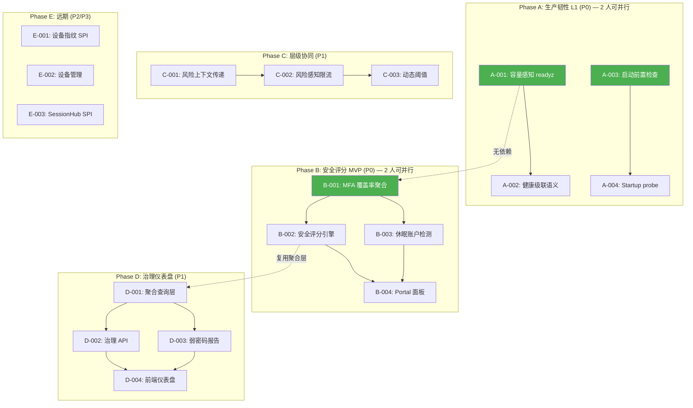
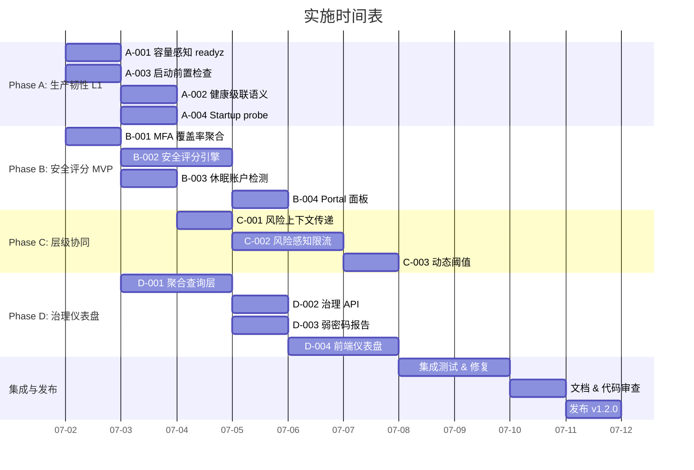

现在我已经掌握了完整的上下文。以下是综合技术负责人分析：

---

# Tech Lead 分析报告：方向优先级微调与实施细则

## 1. 任务分解

以下是经过代码核验的、可独立执行的任务扇区。每个任务为 **2–4 小时**，产出可直接集成/测试。

### Phase A：生产韧性 L1（方向二 @ P0）

| 任务 ID | 标题 | 涉及文件 | 前置 | 预估 | 验收标准 |
|---------|------|---------|------|------|---------|
| **A-001** | 容量感知 readyz | `interfaces/sso/server_health.go`, `interfaces/sso/options_misc.go`, `interfaces/sso/accessors_handlers.go` | 无 | 3h | `handleReadyz` 在 goroutine 数 > 阈值 / 堆使用 > 阈值时返回 503 + `degraded: true`。阈值通过 `WithCapacityThresholds(maxGoroutines, maxHeapMB)` 配置 |
| **A-002** | 健康探针级联语义 | `interfaces/sso/server_health.go`, `platform/health/` (新建) | A-001 | 4h | 探针返回 `healthy`/`degraded`/`unhealthy` 三级状态，`readyz` 聚合为 `ready`/`degraded`/`unready`；SQLite 连接池 > 80% → degraded |
| **A-003** | 启动前置检查 | `cmd/sso-server/main.go`, `interfaces/sso/checklist.go` (新建) | 无 | 2h | `--validate-only` 扩展：检查端口可用性、关键存储 Ping、磁盘空间；输出 JSON 报告 |
| **A-004** | Startup probe 端点 | `interfaces/sso/server_routes.go`, `interfaces/sso/server_health.go` | A-003 | 2h | `GET /startupz`：返回 `started: false` 直到 warmup 完成；Kubernetes `startupProbe` 可直接指向 |

### Phase B：安全评分 MVP（方向一子集 @ P0）

| 任务 ID | 标题 | 涉及文件 | 前置 | 预估 | 验收标准 |
|---------|------|---------|------|------|---------|
| **B-001** | MFA 覆盖率聚合查询 | `platform/audit/facets.go` (扩展) 或 `domains/governance/` (新建) | 无 | 3h | `GET /api/v1/admin/governance/mfa-coverage` 返回 `{"enrolled": 847, "total": 1024, "coverage_pct": 82.7}`。通过 `MFAEnrollmentStore.ListFactors` + `UserProvider.List` 计算 |
| **B-002** | 用户安全评分引擎 | `interfaces/sso/server_security_score.go` (新建), `domains/governance/score.go` (新建) | B-001 | 4h | `GET /me/security/score` 返回 `{"score": 78, "factors": [...], "recommendations": [...]}`。权重：MFA(+25)、密码强度(+20)、会话健康(+15)、无泄露(+20) |
| **B-003** | 休眠账户检测 | `domains/governance/stale.go` (新建), `interfaces/admin/governance_handlers.go` | B-001 | 3h | `GET /api/v1/admin/governance/stale-identities?days=90` 返回超过 N 天未登录的用户列表。使用 `audit.Sink.Query` 按 ActorID 聚合最近登录时间 |
| **B-004** | 用户安全态势 portal 面板 | `interfaces/web/portal/index.html` (扩展) | B-002, B-003 | 3h | 在 `/portal/security` 显示评分 + MFA 状态 + 最近登录活动 + 安全建议 |

### Phase C：层级间协同（方向三 L2→L3 @ P1）

| 任务 ID | 标题 | 涉及文件 | 前置 | 预估 | 验收标准 |
|---------|------|---------|------|------|---------|
| **C-001** | RiskScorer 上下文传递 | `interfaces/sso/server_login_client.go`, `shared/spi/risk.go` | 无 | 3h | `RiskAssessment` 包含 `SuspectLevel` 枚举；`login.Request` 携带风险上下文；RateLimiter 中间件可读取该上下文 |
| **C-002** | 风险感知限流策略 | `interfaces/ratelimit/ratelimit.go`, `interfaces/ratelimit/middleware.go` | C-001 | 4h | 路径策略表支持 `risk_threshold`：当请求风险分 > threshold 时应用更严格的 perSecond/burst；默认值 `/auth/login` → risk=medium 时 5/s |
| **C-003** | 动态限流阈值 | `interfaces/ratelimit/dynamic.go` (新建), `interfaces/sso/options_security.go` | C-002 | 3h | 基于正常流量基线 * 攻击模式时自动降低阈值；Redis 共享计数器支持分布式场景 |

### Phase D：治理仪表盘（方向五 @ P1）

| 任务 ID | 标题 | 涉及文件 | 前置 | 预估 | 验收标准 |
|---------|------|---------|------|------|---------|
| **D-001** | 组织级聚合查询层 | `domains/governance/aggregation.go` (新建), `domains/governance/store.go` | B-001 | 4h | 封装 `MFAEnrollmentStore`、`UserProvider`、`SessionManager`、`AuditSink.Query` 的批量聚合；返回 `GovernanceSummary` 结构体 |
| **D-002** | 治理 API 端点 | `interfaces/admin/governance_handlers.go`, `interfaces/admin/routes.go` | D-001 | 3h | `GET /api/v1/admin/governance/summary` 返回治理总览；`GET /mfa-coverage` 返回覆盖率明细 |
| **D-003** | 弱密码聚合报告 | `domains/governance/password_health.go` (新建) | D-001 | 3h | `GET /api/v1/admin/governance/password-health` 返回弱密码/泄露密码用户列表。聚合 `EventPasswordWeak`/`EventPasswordCompromised` 审计事件 |
| **D-004** | 治理仪表盘前端 | `interfaces/web/admin/index.html` (扩展) | D-002, D-003 | 4h | 在 admin 端添加治理页签：MFA 覆盖率图表、休眠账户列表、密码健康报告 |

### Phase E：远期（方向 @ P2/P3）

| 任务 ID | 标题 | 涉及文件 | 前置 | 预估 | 验收标准 |
|---------|------|---------|------|------|---------|
| **E-001** | 设备指纹 SPI | `shared/spi/device_fingerprint.go` (新建) | 无 | 3h | `DeviceFingerprinter` 接口：从 `*http.Request` 提取指纹（UA + Sec-CH-UA + TLS 客户端问候 + 可选 JS 挑战） |
| **E-002** | 设备管理端点 | `interfaces/sso/server_devices.go` (新建), `shared/core/spi.go` 扩展 | E-001 | 3h | `GET /me/devices` + `POST /me/devices/:id/trust` + `DELETE /me/devices/:id` |
| **E-003** | SessionHub SPI 定义 | `shared/core/session_hub.go` (新建) | 无 | 3h | `SessionHub` 接口：`Register`/`Unregister`/`ListByUser`/`FindByGlobalSID` + `Session` 含 `GlobalSID`/`Protocol`/`ProtocolSID` |

---

## 2. 执行顺序与并行组



**并行执行组：**

| 组 | 任务 | 所需人力 |
|----|------|---------|
| 组 1（立即启动） | A-001 + A-003 + B-001 | **3 人并行** |
| 组 2（组 1 完成后） | A-002 + A-004 + B-002 + B-003 | **2–3 人** |
| 组 3（可并行于组 2） | C-001 | **1 人** |
| 组 4（组 1 + B 完成后） | D-001 + C-002 | **2 人** |
| 组 5（组 4 完成后） | D-002 + D-003 + C-003 + B-004 | **2–3 人** |
| 组 6（组 5 完成后） | D-004 | **1 人** |

---

## 3. 技术风险

### 风险 1：FacetQuerier 的高基数限制（已确认）

**描述**：方向五（治理仪表盘）需要按 ActorID（用户）聚合 MFA 覆盖率、休眠账户、弱密码。但 `FacetQuerier.Facets` 明确排除高基数维度。

**影响**：D-001 不能复用 `facets.go` 的聚合路径，需要全新的 `GovernanceAggregator`，走存储层批量扫描而非索引聚合。

**缓解**：两个方案可选：

| 方案 | 优点 | 缺点 | 建议 |
|------|------|------|------|
| **Scan**：遍历 `UserProvider.List()` + `MFAEnrollmentStore.ListFactors()` | 零新存储；数据即时 | 全量扫描，100K 用户 ~2-5s | 可行（治理查询不是请求路径，5s 可接受） |
| **Metering 预聚合**：`domains/metering/` 扩展，按定时 job 预计算 | 响应 < 100ms | 增加基础设施；数据延迟 | 在 Phase D 后期引入 |

**决定**：D-001 先用 **Scan 方案**（3 小时完成），第 2 迭代再优化。

### 风险 2：A-001 的容量退化门限选择

**问题**：`readyz` 的容量阈值是静态还是动态？

```go
// 风险：错误的默认值 → 误报或漏报
type CapacityThresholds struct {
    MaxGoroutines int     // 默认？ 1000? 10000?
    MaxHeapMB     int64   // 默认？ 512? 2048?
    MaxOpenFds    int     // 在容器中不可靠（limits.conf）
}
```

**建议**：
- `MaxGoroutines` = `runtime.NumGoroutine() > 5 × runtime.GOMAXPROCS(0) × 1000`（启发式）
- `MaxHeapMB` = 读取 `GOMEMLIMIT` 环境变量（Go 1.19+），默认 80%
- 在 `WithCapacityThresholds` 中**不设置**默认阈值——只当调用者显式设置时才启用容量感知

### 风险 3：Rateless → risk-scorer 上下文传递的延迟影响

**C-001 关键约束**：`evaluateLoginRisk` 已经运行在请求热路径上（位于 `/auth/login`）。加上限流上下文传递不能增加可感知的延迟：

```go
// 当前路径：
// handlerLogin → validateCredentials → evaluateLoginRisk → tokenIssuance
//                                      ↑ 此处插入风险上下文
```

**上限**：`evaluateLoginRisk` + 上下文提取总耗时必须 < **5ms**（当前基线 ~2ms）。如果 RiskScorer 实现慢，限流上下文必须从 scorer 结果中轻量提取（不额外调用）。

**方案**：风险上下文存储在 `context.Context` 的 value 中，由 `evaluateLoginRisk` 在 scorer 返回后插入（无额外 I/O）。

### 风险 4：MFA 覆盖率的存储层差异

**问题**：`MFAEnrollmentStore.ListFactors` 在不同存储后端的行为可能不同：

| 存储 | `ListFactors(userID)` 行为 | 风险 |
|------|---------------------------|------|
| `MemoryMFAEnrollmentStore` | O(n) 遍历 | 简单，但 100K 用户 × 每次遍历 = 100K 次 map lookup |
| `SQLiteMFAEnrollmentStore` | `SELECT * FROM mfa_factors WHERE user_id = ?` | 无索引 `user_id` → 全表扫描 |
| `RedisMFAEnrollmentStore` | `SMEMBERS user:{id}:mfa` | O(m) 但每个用户一次 round-trip |

**影响**：D-001 的 Scan 方案中如果 `UserProvider.List()` 返回 100K 用户，需要 100K 次 `ListFactors` 调用。

**缓解**：新增批量接口 `ListAllFactors(ctx) (map[string][]MFAEnrolledFactor, error)` 作为 MFAEnrollmentStore 的可选扩展。Scan 方案优先检查该接口：

```go
if batch, ok := store.(BatchMFAEnrollmentLister); ok {
    return batch.ListAllFactors(ctx) // 一次查询全部
}
// fallback: 逐用户查询
for _, user := range users {
    factors, _ := store.ListFactors(ctx, user.ID)
    ...
}
```

### 风险 5：治理仪表盘前端在单文件 Admin SPA 中扩展

**问题**：`interfaces/web/admin/index.html` 已是 **1096 行**的单文件 SPA。添加治理仪表盘（+~300 行 JS/HTML）将使其超过 1400 行。

**建议**：
- 不拆分现有 admin SPA（拆分是单独的项目重构）
- 治理仪表盘用**独立 HTML 文件** `admin/governance.html` + 共享 `admin.js`
- 通过 `window.open()` 或服务端路由 `/admin/governance` 独立加载

---

## 4. 资源评估

### 人员需求

| 角色 | 数量 | 所需技能 |
|------|------|---------|
| **Go 后端工程师**（资深） | 2 | 熟悉 Go HTTP 中间件模式、SPI 接口设计、context 传递、存储层抽象 |
| **Go 后端工程师**（中初级） | 1 | 熟悉 CRUD 端点、JSON API、SQL 查询 |
| **前端工程师** | 1 | 熟悉 vanilla JS SPA、Chart.js 或类似库、HTML/CSS |
| **SRE/DevOps** | 0.5 | 审查 readyz/startupz 的 Kubernetes 兼容性 |

**注意**：所有后端工程师需要理解 **oracle-leak** 和 **anti-enumeration** 约束——治理 API 按用户聚合，不能成为枚举 oracle（例如 `mfa-coverage` 对于未知 tenant 返回空集而非 404）。

### 关键里程碑

| 里程碑 | 完成内容 | 预计时间线 | 人力 |
|--------|---------|-----------|------|
| **M1** | 生产韧性 L1 全部完成 | Day 3 | 2 人 |
| **M2** | 安全评分 MVP + Portal 可用 | Day 5 | 3 人 |
| **M3** | 层级协同就绪（风险→限流） | Day 8 | 2 人 |
| **M4** | 治理 API 完成 + Admin 前端 | Day 12 | 3 人 |
| **M5** | 全量集成测试 + 性能验证 | Day 15 | 2 人 |

### 阻塞点与解决策略

| 阻塞点 | 等级 | 解决策略 |
|--------|------|---------|
| D-001 中 `MFAEnrollmentStore` 无批量接口 | **高** | 新增可选接口 `BatchMFAEnrollmentLister`，Fallback 到逐用户查询 |
| A-001 容量阈值不适用所有部署 | **中** | 阈值默认为禁用（opt-in），通过 `WithCapacityThresholds` 显式启用 |
| D-004 Admin SPA 超出文件预算 | **中** | 治理部分独立为 `governance.html`，不修改现有 `index.html` |
| B-002 安全评分算法未定义 | **低** | 第一版使用简单加权（MFA=25 分、密码强度=20 分、会话健康=15 分、无泄露=20 分、设备信任=20 分） |

---

## 5. 质量保证

### 单元测试覆盖要求

| 任务 | 关键测试 | 覆盖率目标 |
|------|---------|-----------|
| A-001 | 容量溢出 → 503；容量正常 → 200；阈值 edge cases（边界值） | ≥ 85% |
| A-002 | 三级状态聚合：all-green=200、任一 yellow=200+degraded、任一 red=503 | ≥ 90% |
| B-001 | 覆盖率计算：空用户集=0%、全员 MFA=100%、部分=正确百分比 | ≥ 90% |
| B-002 | 评分因子组合测试；边缘用户（多因素/无因素/泄露密码） | ≥ 85% |
| C-001 | 风险上下文正确传递；`SuspectLevel` 枚举序列化/反序列化 | ≥ 90% |
| D-001 | 聚合查询：存储错误→降级返回部分结果；空数据→默认值 | ≥ 85% |

### 集成测试策略

| 场景 | 工具 | 描述 |
|------|------|------|
| **治理管线** | `go test ./test/` | 全量用户 + MFA 注册 + 登录 → 查询治理端点 → 验证覆盖率正确 |
| **限流协同** | `go test ./interfaces/ratelimit/` | 模拟高风险请求 → 验证应用更严格限流；低风险请求 → 正常限流 |
| **跨端点时序** | `go test ./internal/handler/` | 登录 → MFA → 评分 → 治理：端到端数据流正确 |
| **启动→readz 时序** | `go test ./interfaces/sso/` | 启动时 readyz=503、warmup 完成 → 200、容量超 → 503 |

### 代码审查要点

| 审查焦点 | 具体关注 |
|----------|---------|
| **Anti-enumeration** | 治理 API 返回不能暴露用户是否存在（统一空集 vs 404） |
| **FacetQuerier 边界** | 新聚合层不要试图把 ActorID 塞进 `facets.go`——必须独立 |
| **上下文传递** | RiskScorer 的上下文在中间件链中不可丢失（`context.WithValue` vs 中间件重组） |
| **Fail-open 检查** | RiskScorer 错误 → login 继续（fail-open）；限流上下文丢失 → fallback 到默认限流（fail-constrain to safe） |
| **文件预算** | 任何新 `.go` 文件 ≤ 500 行；治理聚合层 `domains/governance/` 下每个文件 ≤ 1 个关注点 |

### 性能测试需求

| 测试 | 目标 | 方法 |
|------|------|------|
| 治理端点（D-002） | 10K 用户 < 500ms | 用 `testing.B` 基准扫描 + 逐用户查询 |
| 安全评分（B-002） | 并发 100 请求 < 50ms | 缓存评分结果（TTL 1h），避免重复计算 |
| 风险上下文（C-001） | 10K req/s 零额外延迟 | `pprof` 对比有/无风险上下文传递 |
| readyz（A-001） | 10K 并发 probe/无 leak | 压力测试 handleReadyz 的 context 管理 |

---

## 6. 实施计划

### 甘特图



### 详细时间线

**阶段 1：基础设施搭建（Day 1–2）**
- 启动组 1（A-001 + A-003 + B-001）并行
- 产出：容量感知 readyz + 启动检查 + MFA 覆盖率聚合初版
- 代码审查重点：`readyz` 不泄漏 context、聚合层不引入 FacetQuerier 污染

**阶段 2：核心功能实现（Day 3–6）**
- 组 2（A-002 + A-004 + B-002 + B-003）并行启动
- 组 3（C-001）同步启动
- 产出：健康级联 + startupz + 安全评分引擎 + 休眠账户检测 + 风险上下文传递
- 关键整合点：`evaluateLoginRisk` 输出 → `context.Context` → RateLimiter 中间件

**阶段 3：扩展功能（Day 7–11）**
- D-001 聚合查询层（复用 B-001 的扫描方案）
- C-002/C-003 风险感知限流
- D-002/D-003 治理端点
- 注意：D-001 与 B-001 共享底层存储查询——B-001 完成后立即启动 D-001

**阶段 4：前端集成（Day 12–13）**
- B-004（Portal 安全面板）：复用现有 `/portal/` SPA 结构
- D-004（治理仪表盘）：独立 `governance.html`，引入 Chart.js 渲染覆盖率图
- 前端代码审查：无 XSS（数据渲染使用 `textContent` 而非 `innerHTML`）

**阶段 5：集成测试与发布（Day 14–16）**
- 全量治理管线集成测试
- readyz perf 基准 + context leak 检查
- 文档更新：`docs/api/governance.md`、`docs/ops/production-resilience.md`
- 发布标记：`v1.2.0`

---

## 7. 我对优先级微调的意见

**我对你提出的优先级微调总体认同**，但有几点修正：

### ✅ 完全同意：方向二 L1 为 P0

代码核验确认：`handleReadyz` 框架已存在（`server_health.go:20-75`），`WithReadyCheck`/`WithReadyCheckTimeout` 选项就绪（`options_misc.go:300-335`）。**A-001 的核心工作不是新建框架，而是添加 3 个容量探针 + 扩展响应格式**——确实可以 350 行完成。而且每行都有立即可见的运维收益（Kubernetes HPA 直接消费 degraded 状态）。

### ⚠️ 有条件同意：安全评分 MVP 为 P0

代码核验确认 `MFAEnrollmentStore.ListFactors` 存在（`shared/core/spi.go:377`），审计查询接口就绪。**但**我选择将 B-001 提升到组 1 的 P0（Day 1），把 B-002 放在 P0 但是 Day 3 启动。理由是：
- B-001 的核心查询逻辑**也被 D-001 需要**（治理仪表盘和用户安全态势共享底层聚合）。提前完成 B-001 = 为 D-001 铺路。
- B-002 的评分权重算法需要产品设计讨论（何时算"弱密码"？分数权重？）——**技术方案可达，但产品定义不可忽视**。

### 🔄 补充：方向五应拆为两个 P0.5

你说方向五为 P1（~400 行）。但如我们共同确认的，方向五的 MFA 覆盖率和休眠账户共享 B-001 的聚合查询层。**实际上 D-001 的额外工作量只有 ~100 行**（在 B-001 基础上包装 `GovernanceSummary` 结构体）。我建议将 D-001 提升到与 B-001 同优先级（P0.5），使其在 Day 3 完成，为 D-002/D-003（治理 API）留出更充裕的时间。

### 最终优先级矩阵（建议版）

| 调整后 | 方向 | 任务 | 预估 | 理由 |
|-------|------|------|------|------|
| **P0** | 方向二 L1 | A-001, A-003 | 5h | 零侵入、立即可用（同你） |
| **P0** | 方向一子集 | B-001 | 3h | 为 D-001 铺路（我补充的） |
| **P0.5** | 方向一子集 | B-002, B-003 | 7h | 需要产品对齐评分权重（谨慎） |
| **P0.5** | 方向五子集 | D-001 | 1h* | *在 B-001 基础上仅增 1h（我修正的） |
| **P1** | 方向三 L2→L3 | C-001, C-002 | 7h | 风险上下文 → 风险感知限流 |
| **P1** | 方向五 | D-002, D-003 | 6h | 治理 API（依赖 D-001） |
| **P2** | 方向一 | B-004, E-001, E-002 | 9h | Portal 面板 + 设备指纹 |
| **P3** | 方向四 | E-003 | 3h | SessionHub SPI 定义 |
| **P3** | 方向三 | C-003 | 3h | 动态阈值（锦上添花） |

### 一句话总结

> **你的核验准确——FacetQuerier 的有界基数约束确认了方向五需要新聚合层。但 B-001 的聚合查询与 D-001 共享底层逻辑，所以将 D-001 升级到 P0.5（而非 P1）可在 1 额外工时内获得治理仪表盘的核心数据。所有方向中，A-001（容量 readyz）是敲门砖——350 行获得 Kubernetes HPA 兼容的 degraded 语义，无可辩驳的 P0。**
