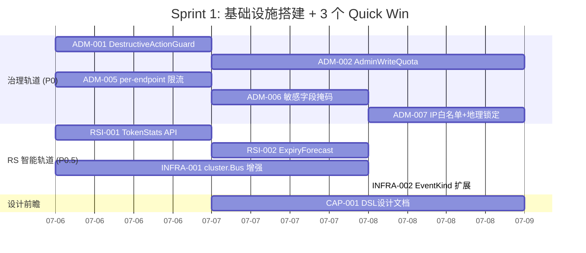
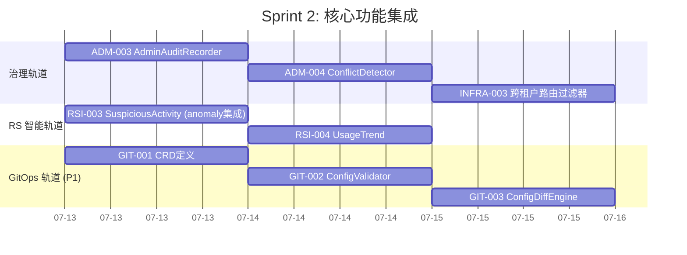
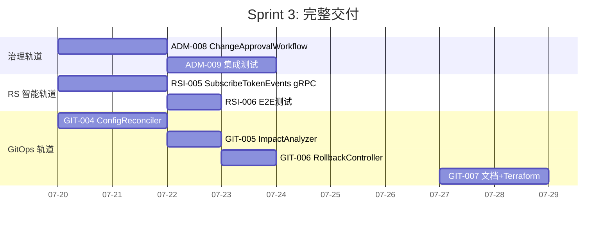
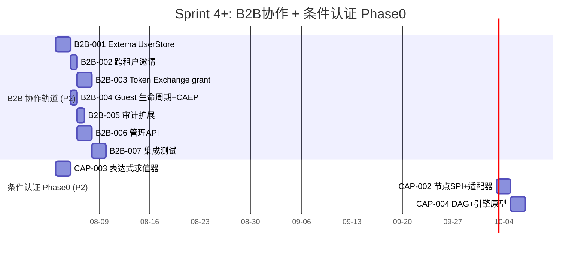

现在我将基于架构分析文档和核验反馈，从 Tech Lead 角度输出完整的实现计划和执行分析。

---

# Tech Lead 实现分析：5 方向扩展工程计划

> **日期：** 2026-07-02
> **基于：** `docs/senior-architect-expansion-2026-07-02.md` + 代码核验反馈
> **代码基线：** ~1639 Go 源文件、~150 包、7 层架构、4 存储后端

---

## 0. 执行概要

| 项 | 值 |
|------|-------|
| 总方向 | 5（P0-P2） |
| 总任务 | **38 个工程任务** |
| 总预估工时 | **~920 小时（约 23 人周）** |
| 建议并行轨道 | **3条**（治理与基础设施轨 / 产品与可视化轨 / 架构设计轨） |
| 首阶段交付 | **2 周内可出：3 个独立可交付成果** |
| 关键 Blockers | 无——所有方向的底层依赖均已就位 |

**核心策略调整（基于核验发现）：**

1. **方向四 Phase 1（TokenStats 只读 API）** 不等待方向三——它作为独立 Quick Win 在**第 1 周**与方向三并行启动，预估实际成本为分析的 40%（~300 行 vs 分析的 800 行估计）
2. **`cluster.Bus` 增强**提取为独立基础设施任务（Infra-001），服务于方向三、四、五的事件驱动需求
3. **方向二**先 Phase 0（设计+接口审计）再搁置，不做完整引擎，避免在方向一/三/四未确定前引入大型架构变更

---

## 1. 任务分解

### 1.1 跨方向基础设施（Infra Track）

| ID | 标题 | 涉及文件 | 前置 | 工时 | 验收标准 |
|----|-------|-----------|------|-------|-------------------|
| **INFRA-001** | 增强 `cluster.Bus`：添加 topic-based 订阅 + 事件持久化回溯 | `platform/cluster/bus.go`, `platform/cluster/memory/bus.go`, `platform/cluster/etcd/`, `shared/core/events.go`（新增） | 无 | **6h** | `cluster.Bus` 接口新增 `Subscribe(topic string, handler)` / `Publish(topic string, event)`，memory 和 etcd 实现均支持；`EventMeta` 包含 `ID`/`Topic`/`Source`/`Timestamp`；单元测试覆盖 topic 过滤、持久化回溯 |
| **INFRA-002** | `EventKind` 扩展：注册 Admin 操作事件 | `platform/cluster/bus.go`（新增 `KindAdminOperation`、`KindConfigChange`、`KindTokenEvent`） | INFRA-001 | **1h** | 3 个新 `EventKind` 常量定义 + 注释说明语义和使用场景；`doc.go` 更新事件目录 |
| **INFRA-003** | `EventBus` 跨租户路由过滤器 | `platform/cluster/bus.go`（新增 `WithTenantFilter` 选项），`platform/cluster/tenant_router.go`（新增） | INFRA-001 | **3h** | 过滤器根据 `TenantID` 分发事件；跨租户事件（方向一）和同租户事件使用统一接口；单元测试验证隔离性 |

---

### 1.2 方向三：Admin 治理框架（P0，治理 Track）

| ID | 标题 | 涉及文件 | 前置 | 工时 | 验收标准 |
|----|-------|-----------|------|-------|-------------------|
| **ADM-001** | `DestructiveActionGuard` 中间件 | `interfaces/admin/destructive_guard.go`（新增），`interfaces/admin/middleware.go`（注册） | 无 | **4h** | DELETE 和 PUT 操作要求请求体携带 `confirm` 字段 + `reason` 字符串；缺失时返回 `400 missing_confirmation`；guard 可覆盖；单元测试覆盖 confirm 缺失/错误/正确场景 |
| **ADM-002** | `AdminWriteQuota` per-tenant 写配额 | `interfaces/admin/write_quota.go`（新增），`shared/core/quota.go`（配额 SPI，新增） | 无 | **6h** | `TenantQuotaStore` SPI 定义（`Increment`/`Remaining`/`Reset`） + Memory 实现；`AdminWriteQuota` 中间件拦截超过配额（默认 100/h/tenant）的写操作返回 `429 too_many_requests`；metric 暴露剩余配额 |
| **ADM-003** | `AdminAuditRecorder`：管理操作全量审计（旧值/新值/reason） | `interfaces/admin/audit_recorder.go`（新增），`platform/audit/recorder.go`（扩展） | ADM-001 | **5h** | 每条 admin 写操作记录：操作者、时间、操作类型、目标资源、旧值快照、新值快照、reason；非侵入式——不阻塞写路径；admin specifc 审计使用独立 `audit.Sink` 实例 |
| **ADM-004** | `AdminConflictDetector`：并发编辑锁 | `interfaces/admin/conflict_detector.go`（新增），复用 `internal/keyed_mutex` | ADM-001 | **4h** | 基于 keyed mutex 的 per-resource 乐观锁；编辑冲突返回 `409 conflict` + 当前资源版本号；60s 自动超时释放；单元测试验证并发序列化 |
| **ADM-005** | Admin per-endpoint 速率限制（从全局令牌桶升级） | `interfaces/admin/middleware.go`（重构 `WithAdminRateLimit` 为 per-route 桶），`interfaces/admin/rate_limiter.go`（新增） | 无 | **4h** | 现有 `WithAdminRateLimit` 迁移到 `map[route]*token.Bucket`；`WithAdminRateLimit(limit)` 支持按 `routePattern` 配置不同速率；配置热更新；向后兼容 |
| **ADM-006** | Admin 敏感字段统一掩码框架 | `interfaces/admin/field_mask.go`（新增），`interfaces/admin/tenants.go`（集成验证） | 无 | **3h** | 注册 `maskedFields: map[string]bool`；`MaskSensitive(resp)` 在 JSON 序列化前将 `client_secret`、`access_token`、`refresh_token` 等替换为 `"********"`；所有 admin response handler 集成 |
| **ADM-007** | Admin IP 白名单 + 地理锁定 | `interfaces/admin/ip_restriction.go`（新增），`interfaces/sso/options_misc.go`（配置） | 无 | **4h** | `WithAdminIPWhitelist(cidrs)` 选项；`WithAdminGeoLock(countries)` 选项；不在白名单/锁定国家 → `403 admin_ip_denied`；配置可热更新 |
| **ADM-008** | `ChangeApprovalWorkflow`：变更审批队列（Phase 1——队列 + 通知，无完整工作流引擎） | `interfaces/admin/approval_queue.go`（新增），`interfaces/admin/approval_notify.go`（新增），`platform/cluster/bus.go`（事件） | INFRA-001, ADM-001 | **8h** | 敏感操作（DELETE client、UPDATE signing keys）进入 Pending 队列；admin 操作者收到 pending 通知（通过 `cluster.Bus` + webhook）；审批者通过 `POST /admin/approvals/:id/approve` 或 `/reject` 确认；24h 过期自动拒绝 |
| **ADM-009** | 方向三集成测试 | `test/admin_governance_test.go`（新增） | ADM-001 ~ ADM-008 | **6h** | 端到端测试覆盖：destructive guard + write quota + conflict detection + IP whitelist + approval workflow；使用 bufconn admin gRPC 客户端；>80% 分支覆盖 |

---

### 1.3 方向四：RS Token Intelligence（P0.5，产品 Track）

| ID | 标题 | 涉及文件 | 前置 | 工时 | 验收标准 |
|----|-------|-----------|------|-------|-------------------|
| **RSI-001** | `TokenStatProvider` SPI + `TokenStats` admin API（Phase 1：只读聚合） | `protocols/oauth/token_stats.go`（新增），`shared/core/spi.go`（扩展 `TokenLister` 或新增 `TokenStatProvider` 接口），`interfaces/admin/token_stats.go`（新增 handler） | 无 | **4h** | `TokenStatProvider` 定义 `Stats(ctx, clientID) (TokenStats, error)`；`TokenStats` 结构体：`ActiveUsers`, `ActiveTokens`, `AvgTTL`, `TopScopes`, `TokenDistributionByStatus`；admin REST API `GET /admin/clients/:id/token-stats` 返回聚合数据；数据来自 `TokenLister.ListActive()` 内存聚合 |
| **RSI-002** | `TokenExpiryForecast` —— 过期预测 API | `protocols/oauth/token_forecast.go`（新增），内存聚合 | RSI-001 | **3h** | `ExpiryForecast(clientID, window time.Duration) Forecast` 返回 N 小时内过期的 token 数量+用户列表；`GET /admin/clients/:id/token-expiry?window=24h`；返回 JSON 含 `total_expiring`, `expiring_by_hour[]`, `affected_users` |
| **RSI-003** | `SuspiciousTokenActivity` —— 集成 `anomaly.Detector` 的异常检测 | `protocols/oauth/token_anomaly.go`（新增），`domains/anomaly/runner.go`（注册新 detector） | INFRA-001, RSI-001 | **5h** | 实现 `anomaly.Detector` 接口订阅 token 事件；检测模式：多 IP 使用同一 token、高频刷新（>10/min）、异常地理分布；事件通过增强后的 `cluster.Bus` 发布；`GET /admin/clients/:id/suspicious-activity` 返回异常事件流 |
| **RSI-004** | `TokenUsageTrend` —— 趋势分析 | `protocols/oauth/token_trend.go`（新增），`platform/audit/recorder.go`（查询审计记录） | RSI-001, INFRA-001 | **4h** | 按日/周/月聚合签发量/验证量/撤销量；`GET /admin/clients/:id/token-trend?period=7d`；数据源为已有 audit 记录（`token.issued`, `token.revoked`, `token.validated`） |
| **RSI-005** | `SubscribeTokenEvents` —— RS 事件订阅 gRPC stream API | `proto/tokenintel/v1/tokenintel.proto`（新增），`platform/grpcserver/tokenintel/`（新增 server），`ssoclient/remote/token_subscriber.go`（新增 client） | INFRA-001, RSI-001 | **8h** | gRPC server-streaming API `SubscribeClientEvents(clientID)` 推送 token 状态变化（过期、撤销、刷新）；客户端通过 mTLS 或 API Key 认证；事件经 `cluster.Bus` 路由到当前 replica 的 subscriber |
| **RSI-006** | 方向四 E2E 测试 + bufconn 集成 | `test/token_intelligence_test.go`（新增） | RSI-001 ~ RSI-005 | **5h** | bufconn gRPC 客户端测试所有 6 个 API 端点；同时注入 1000 个 token 验证聚合准确性；`anomaly.Detector` 集成测试验证异常事件被正确检测和上报 |

---

### 1.4 方向五：多集群 GitOps（P1，基础设施 Track）

| ID | 标题 | 涉及文件 | 前置 | 工时 | 验收标准 |
|----|-------|-----------|------|-------|-------------------|
| **GIT-001** | Config CRD 定义（Kubernetes CRD + 纯 YAML schema） | `deploy/crds/sso_config.yaml`（新增），`deploy/crds/sso_cluster.yaml`（新增），`deploy/crds/sso_tenant.yaml`（新增） | 无 | **4h** | 3 个 CRD 覆盖 SSO 完整配置模型；纯 YAML schema（`openAPIV3Schema`）；`config-validate-all` make target 集成 schema 验证 |
| **GIT-002** | `ConfigValidator` 提取——将现有 `--validate-only` 扩展为独立验证库 | `config/validator.go`（新增），`cmd/sso-server/main_wiring.go`（重构 `validate-only` 分支） | 无 | **4h** | `Validator.Validate(config) Result` 可编程调用；验证结果含 `Warnings` + `Errors`；cross-reference 验证（引用的 clientID 必须存在）；`config-validate` CLI 可使用新库 |
| **GIT-003** | `ConfigDiffEngine`——跨集群配置差异检测 | `config/diff.go`（新增），`config/diff_test.go` | GIT-002 | **5h** | 对两个 `SSOConfig` 结构体递归 diff，输出 `[]ConfigDiff` 含 `Path`, `OldValue`, `NewValue`, `ChangeType`（added/modified/removed）；忽略 `meta`/`version` 等元数据字段；支持配置快照序列化 |
| **GIT-004** | `ConfigReconciler`——定期 reconcile + 漂移检测 | `config/reconciler.go`（新增），`config/reconciler_test.go` | GIT-002, INFRA-001 | **6h** | 可配置 reconcile 间隔（默认 5min）；对比 `desired state` (CRD/ConfigMap) 与 `actual state` (etcd/store)；漂移通过 `cluster.Bus` 发布 `KindConfigChange` 事件；自愈模式可自动回写期望状态 |
| **GIT-005** | `ConfigImpactAnalyzer`——变更影响分析 | `config/impact.go`（新增），`config/impact_test.go` | GIT-002 | **4h** | 输入 config diff → 输出影响报告（"删除 client X 影响 Y 个活跃 session"、"修改 redirect_uri 影响 Z 个集成"）；使用 `TokenLister` 估算活跃 session 数；结果格式化为 JSON + 人类可读文本 |
| **GIT-006** | `ConfigRollbackController`——配置回滚 | `config/rollback.go`（新增），`bootstrap/version_tracker.go`（扩展） | GIT-004 | **3h** | 维护最后 10 个已知好配置的快照；`POST /admin/config/rollback?version=N` 触发回滚；回滚前执行 impact analysis；变更事件记录到审计 |
| **GIT-007** | GitOps 工作流集成文档 + Terraform Provider 骨架 | `docs/gitops-workflow.md`（新增），`deploy/terraform/provider/`（骨架） | GIT-001 ~ GIT-006 | **6h** | GitOps 工作流文档涵盖：仓库结构、CI pipeline 配置、验证步骤、canary 发布策略、回滚流程；Terraform Provider 骨架实现 `data_source_sso_config` |

---

### 1.5 方向一：跨租户 B2B 协作（P2，架构 Track）

| ID | 标题 | 涉及文件 | 前置 | 工时 | 验收标准 |
|----|-------|-----------|------|-------|-------------------|
| **B2B-001** | `ExternalUserStore` SPI + Memory 实现 | `shared/core/external_user.go`（新增），`domains/tenant/external_store.go`（新增） | 无 | **6h** | `ExternalUserStore` 接口定义（`Create`/`Get`/`ListBySourceTenant`/`ListByTargetTenant`/`Deactivate`）；`ExternalUser` 结构体：`ID`, `SourceTenantID`, `TargetTenantID`, `SourceUserID`, `TargetUserID`, `Roles[]`, `Status`（pending/active/expired/revoked）, `CreatedAt`, `ExpiresAt`；Memory 实现覆盖全生命周期 |
| **B2B-002** | 跨租户邀请流程（生成 + 接受 + 激活） | `domains/tenant/invitation.go`（扩展现有 `Invitation` 为跨租户），`shared/core/invitation.go`（添加 `TargetTenantID`/`TargetRoles` 字段） | B2B-001 | **5h** | `Invitation` 支持 `TargetTenantID` 和 `TargetRoles` 字段；`GenerateCrossTenantInvite(sourceTenant, targetEmail, targetTenantID, roles)` 加密 payload（含目标租户/角色/48h TTL）；`ConsumeCrossTenant(code)` 在目标租户创建 guest 影子用户；一次性使用 |
| **B2B-003** | 跨租户 Token Exchange grant（RFC 8693 扩展） | `protocols/oauth/token_exchange.go`（扩展），`protocols/oauth/handle_token.go`（注册新 grant type） | B2B-002, INFRA-003 | **8h** | 支持 `grant_type=urn:ietf:params:oauth:grant-type:token-exchange` 跨租户场景；输入：guest 的原生 `access_token` + `actor_token` + `target_tenant_id`；输出：scope-limited宿主租户 token；`act` 声明链记录原始身份；`aud` 限制为宿主租户的指定 client |
| **B2B-004** | Guest 用户生命周期管理（过期 + 撤销 + CAEP 传播） | `domains/tenant/guest_lifecycle.go`（新增），`protocols/caep/transmitter.go`（集成） | B2B-001, INFRA-003 | **5h** | Guest 用户过期自动撤销所有宿主 token；宿主管理员可手动撤销 guest 访问；CAEP 事件（`caep.session_revoked`）通过现有 `caep.Transmitter` 传达到 Org A；`scheduler/` 注册定时任务扫描过期 guest 记录 |
| **B2B-005** | 跨租户审计扩展 —— `original_subject`/`original_tenant` | `platform/audit/recorder.go`（扩展 `EventMeta`），`platform/audit/events.go`（扩展事件字段） | B2B-003 | **3h** | `EventMeta` 新增 `OriginalSubject` 和 `OriginalTenantID` 字段；token exchange 审计事件记录跨租户源身份；跨租户操作关联到源身份的审计线索可查询 |
| **B2B-006** | 跨租户管理 API（邀请管理 + guest 用户列表） | `interfaces/admin/cross_tenant.go`（新增 handler），`interfaces/admin/tenants.go`（扩展） | B2B-001 ~ B2B-003, ADM-001 | **6h** | 6 个 admin API 端点：`POST /admin/tenants/:id/invitations`（发送邀请）、`GET /admin/tenants/:id/guests`（guest 列表）、`DELETE /admin/tenants/:id/guests/:userId`（撤销 guest）、`GET /admin/tenants/:id/invitations`（邀请记录）、`PUT /admin/tenants/:id/guests/:userId/roles`（变更角色）、`GET /admin/guests/me`（自助查询自己的跨租户访问） |
| **B2B-007** | B2B 协作集成测试 | `test/cross_tenant_test.go`（新增） | B2B-001 ~ B2B-006 | **8h** | 完整跨租户场景 E2E：Org A 管理员 → 发送邀请 → Org B 用户接受 → 跨租户 token exchange → 资源访问 → 撤销 guest → CAEP 传播验证 |

---

### 1.6 方向二：条件认证策略引擎——Phase 0（P2，架构设计轨）

| ID | 标题 | 涉及文件 | 前置 | 工时 | 验收标准 |
|----|-------|-----------|------|-------|-------------------|
| **CAP-001** | Flow DSL 语言设计文档 + 认证器接口审计 | `docs/feature-spec-conditional-auth.md`（新增），`domains/authenticators/`（接口审计） | 无 | **6h** | 设计文档覆盖：DSL YAML schema 草案、节点类型枚举（authenticator/mfa/webhook/redirect/deny）、条件表达式语法（借鉴 `defaultrisk` 已有的规则引擎）、执行语义（短路/并行/fallback）；现有 9+ 认证器接口审计结果（哪些可直接包装为节点、哪些需要适配器） |
| **CAP-002** | `AuthenticatorNode` SPI + 现有认证器适配 | `protocols/authz/node.go`（新增），`domains/authenticators/password/adapter.go`（新增），`domains/authenticators/webauthn/adapter.go`（新增），... 9 个适配器 | CAP-001 | **8h** | `AuthenticatorNode` SPI 定义 `Execute(ctx, input) (NodeResult, error)`；9 个适配器对接现有认证器；单元测试验证每个适配器正确包装原认证器逻辑 |
| **CAP-003** | 条件表达式求值器原型（基于 `defaultrisk` 规则引擎提取） | `security/expr/evaluator.go`（新增），`security/expr/parser.go`（新增），`infrastructure/defaultimpl/defaultrisk/risk_rules.go`（重构提取通用引擎） | CAP-001 | **6h** | 表达式求值器支持 `${risk_score > 0.7}`、`${device.unknown}`、`${required_acr == "phr"}` 等模式；上下文变量注入（`SecurityContext` 结构体含 `RiskScore`, `DeviceFingerprint`, `RequiredACR`, `UserRole`, `ClientID`, `GeoCountry`）；从 `defaultrisk` 提取核心表达式引擎复用测试 |
| **CAP-004** | Flow DAG 编译 + 执行引擎骨架（RFC/原型，不投入生产） | `protocols/authz/compiler.go`（新增），`protocols/authz/engine.go`（新增） | CAP-002, CAP-003 | **6h** | YAML flow 定义编译为 DAG（拓扑排序）；执行引擎按 DAG 遍历，短路退出；单测覆盖 5 个示例 flow（默认/API 访问/高风险/管理员/未知设备）；**明确标记为原型代码，不接入生产路由** |

---

## 2. 执行顺序与任务依赖图

```mermaid
graph TD
    %% ======= 基础设施层 =======
    subgraph Infra["INFRA 基础设施轨道"]
        direction LR
        INFRA_001["INFRA-001<br/>cluster.Bus 增强<br/>6h"]
        INFRA_002["INFRA-002<br/>EventKind 扩展<br/>1h"]
        INFRA_003["INFRA-003<br/>跨租户路由过滤器<br/>3h"]
        INFRA_001 --> INFRA_002
        INFRA_001 --> INFRA_003
    end

    %% ======= 治理轨道 (P0) =======
    subgraph ADM["ADM 治理轨道"]
        direction TB
        ADM_001["ADM-001<br/>DestructiveActionGuard<br/>4h"]
        ADM_002["ADM-002<br/>AdminWriteQuota<br/>6h"]
        ADM_003["ADM-003<br/>AdminAuditRecorder<br/>5h"]
        ADM_004["ADM-004<br/>ConflictDetector<br/>4h"]
        ADM_005["ADM-005<br/>per-endpoint 限流<br/>4h"]
        ADM_006["ADM-006<br/>敏感字段掩码<br/>3h"]
        ADM_007["ADM-007<br/>IP白名单+地理锁定<br/>4h"]
        ADM_008["ADM-008<br/>ChangeApprovalWorkflow<br/>8h"]
        ADM_009["ADM-009<br/>集成测试<br/>6h"]

        ADM_001 --> ADM_003
        ADM_001 --> ADM_008
        ADM_002 --> ADM_008
        ADM_004 --> ADM_008
        INFRA_001 -.->|事件发布| ADM_003
        INFRA_001 -.->|事件发布| ADM_008
    end

    %% ======= RS 智能轨道 (P0.5) =======
    subgraph RSI["RSI 产品轨道"]
        direction TB
        RSI_001["RSI-001<br/>TokenStats API<br/>4h"]
        RSI_002["RSI-002<br/>ExpiryForecast<br/>3h"]
        RSI_003["RSI-003<br/>SuspiciousActivity<br/>5h"]
        RSI_004["RSI-004<br/>UsageTrend<br/>4h"]
        RSI_005["RSI-005<br/>SubscribeTokenEvents<br/>8h"]
        RSI_006["RSI-006<br/>E2E测试<br/>5h"]

        RSI_001 --> RSI_002
        RSI_001 --> RSI_003
        RSI_001 --> RSI_004
        INFRA_001 -.->|事件流| RSI_003
        INFRA_001 -.->|事件流| RSI_005
        RSI_005 --> RSI_006
        RSI_003 --> RSI_006
    end

    %% ======= GitOps 轨道 (P1) =======
    subgraph GIT["GIT 运维轨道"]
        direction TB
        GIT_001["GIT-001<br/>CRD 定义<br/>4h"]
        GIT_002["GIT-002<br/>ConfigValidator<br/>4h"]
        GIT_003["GIT-003<br/>ConfigDiffEngine<br/>5h"]
        GIT_004["GIT-004<br/>ConfigReconciler<br/>6h"]
        GIT_005["GIT-005<br/>ImpactAnalyzer<br/>4h"]
        GIT_006["GIT-006<br/>RollbackController<br/>3h"]
        GIT_007["GIT-007<br/>文档+Terraform<br/>6h"]

        GIT_002 --> GIT_003
        GIT_002 --> GIT_005
        GIT_002 --> GIT_004
        GIT_003 --> GIT_006
        GIT_004 --> GIT_006
        INFRA_001 -.->|事件驱动| GIT_004
    end

    %% ======= B2B 轨道 (P2) =======
    subgraph B2B["B2B 协作轨道"]
        direction TB
        B2B_001["B2B-001<br/>ExternalUserStore<br/>6h"]
        B2B_002["B2B-002<br/>跨租户邀请<br/>5h"]
        B2B_003["B2B-003<br/>Token Exchange<br/>8h"]
        B2B_004["B2B-004<br/>Guest 生命周期<br/>5h"]
        B2B_005["B2B-005<br/>审计扩展<br/>3h"]
        B2B_006["B2B-006<br/>管理 API<br/>6h"]
        B2B_007["B2B-007<br/>集成测试<br/>8h"]

        B2B_001 --> B2B_002
        B2B_002 --> B2B_003
        B2B_001 --> B2B_004
        B2B_002 --> B2B_006
        B2B_003 --> B2B_005
        B2B_003 --> B2B_007
        INFRA_003 -.->|跨租户路由| B2B_003
        INFRA_003 -.->|跨租户路由| B2B_004
        ADM_001 -.->|复用 guard| B2B_006
    end

    %% ======= 条件认证 Phase 0 (P2) =======
    subgraph CAP["CAP 设计轨道"]
        direction LR
        CAP_001["CAP-001<br/>DSL设计+审计<br/>6h"]
        CAP_002["CAP-002<br/>节点SPI+适配器<br/>8h"]
        CAP_003["CAP-003<br/>表达式求值器<br/>6h"]
        CAP_004["CAP-004<br/>DAG+引擎原型<br/>6h"]

        CAP_001 --> CAP_002
        CAP_001 --> CAP_003
        CAP_002 --> CAP_004
        CAP_003 --> CAP_004
    end

    %% ======= 跨轨道加速线 =======
    ADM_001 -.->|短路线| B2B_006
    INFRA_001 -.->|共同基础设施| ADM_003
    INFRA_001 -.->|共同基础设施| RSI_003
    INFRA_001 -.->|共同基础设施| GIT_004

    %% ======= 阶段划分 =======
    classDef phase1 fill:#e1f5e1,stroke:#2e7d32
    classDef phase2 fill:#fff3e0,stroke:#e65100
    classDef phase3 fill:#e3f2fd,stroke:#1565c0
    classDef phase4 fill:#fce4ec,stroke:#c62828

    class ADM_001,ADM_002,ADM_005,ADM_006,ADM_007,RSI_001,RSI_002,INFRA_001,INFRA_002 phase1
    class ADM_003,ADM_004,RSI_003,RSI_004,GIT_001,GIT_002,GIT_003 phase2
    class ADM_008,RSI_005,GIT_004,GIT_005,GIT_006,GIT_007 phase3
    class B2B_001,B2B_002,B2B_003,B2B_004,B2B_005,B2B_006,B2B_007,CAP_001,CAP_002,CAP_003,CAP_004 phase4
```



### 并行执行组

```
Sprint 1 (Week 1-2):      Sprint 2 (Week 3-4):       Sprint 3 (Week 5-8):       Sprint 4+ (Week 9+):
┌──────────────────┐     ┌──────────────────┐       ┌──────────────────┐        ┌──────────────────┐
│ Group A (P0)     │     │ Group C (P0)     │       │ Group E (P0.5)   │        │ Group G (P2)     │
│ ADM-001          │     │ ADM-003          │       │ RSI-005          │        │ B2B-001 ~ B2B-007│
│ ADM-002          │     │ ADM-004          │       │ ADM-008          │        │ (完整跨租户协作)  │
│ ADM-005          │     │ ADM-007          │       │                  │        │                  │
│ ADM-006          │     │                  │       │ Group F (P1)     │        │ Group H (P2)     │
│                  │     │ Group D (P0.5)   │       │ GIT-004          │        │ CAP-001 ~ CAP-004│
│ Group B (P0.5)   │     │ RSI-003          │       │ GIT-005          │        │ (条件认证 Phase0)│
│ RSI-001          │     │ RSI-004          │       │ GIT-006          │        │                  │
│ RSI-002          │     │ GIT-002          │       │ GIT-007          │        │                  │
│ INFRA-001        │     │ GIT-003          │       │ RSI-006          │        │                  │
│ INFRA-002        │     │ GIT-001          │       │ ADM-009          │        │                  │
│                  │     │                  │       │                  │        │                  │
│ ← 独立可交付3个→  │     │ ← 集成整合阶段 →│       │ ← 完成交付阶段 →│        │ ← 专项立项阶段 →│
└──────────────────┘     └──────────────────┘       └──────────────────┘        └──────────────────┘
```

---

## 3. 技术风险分析

### 3.1 高风险项

| # | 风险 | 方向 | 影响 | 缓解策略 |
|---|------|------|------|---------|
| **R1** | `cluster.Bus` 当时设计为 best-effort——增强为 topic-based + 持久化回溯可能改变其"不保证交付"的语义契约 | INFRA-001 → 全部 | **高**——方向二/四/五依赖事件可靠性，但 bus 当前内存实现会丢事件 | 显式保持 best-effort 契约：持久化回溯作为可选扩展（`WithDurableStore`），不改变现有接口契约；方向四使用 bus 作为通知通道但离线期 token 事件通过定期 poll 补偿 |
| **R2** | `TokenStats` 的 `ListActive()` 可能无法在大型部署中实时聚合（数千 client × 数百万 token） | RSI-001/002 | **中**——P0 误判实时性 | Phase 1 直接聚合 `TokenLister` 数据并加 ~100ms 超时兜底；Phase 2 引入 `TokenStatsCache`（TTL 30s），异步预计算统计指标；存储层考虑增量计数器而非全量扫描 |
| **R3** | `ExternalUserStore` 跨租户身份映射的竞态（两个组织同时邀请同一用户） | B2B-001/002 | **中**——可能导致影子用户重复或数据不一致 | 使用 `(SourceTenantID, SourceUserID, TargetTenantID)` 三元组唯一约束；SQLite 用 `UNIQUE`，Memory 用 `sync.Map` + 双 check 模式；优先使用 `INSERT OR ROLLBACK` 模式而非 upsert |
| **R4** | CAEP 发射器现有实现可能假设单租户上下文——检查是否支持跨租户事件路由 | B2B-004 | **中**——可能需改造 `caep.Transmitter` | 第 1 步：审计 `caep/transmitter.go` 的 `Push` 方法是否接受 `TenantID` 参数；第 2 步：若仅限单租户，添加 `PushCrossTenant(sourceTenantID, targetReceiverURL, event)` 方法 |
| **R5** | `ConfigReconciler` 自动回写可能与并发 admin 操作冲突（write-write 冲突） | GIT-004 | **高**——自动修复可能导致配置回滚 | 使用 etcd 事务（`Compare-And-Swap`）检查期望版本号后再写入；reconciler 标记 `ConfigReconcilerUpdate` 来源，admin API 可检测到 reconciler 周期写入并发出告警 |
| **R6** | 跨租户 Token Exchange 的 `act` 声明链长度无限制——可能导致 JWT 超出 header 大小限制 | B2B-003 | **中**——可通过 3 层嵌套的代理场景构造出 >8KB token | `act` 链最大深度 3（OIDC 建议）；超限时截断并保留最后 3 跳；在 `TokenIssuer` 层添加 `MaxActDepth` 配置（默认 3） |

### 3.2 依赖的外部条件

| 依赖 | 受影响任务 | 可用性 | 替代方案 |
|------|-----------|--------|---------|
| Kubernetes CRD（方向五） | GIT-001, GIT-007 | K8s 生态假设 | **Phase 1 不需要 CRD**——纯 YAML 文件 + `ConfigWatcher` File watcher 即可实现 GitOps 基础；CRD 是 Phase 2 增强 |
| etcd 集群（方向五） | GIT-004 | 生产环境有 etcd | Memory + SQLite 满足单集群 / dev 场景；方向五设计为 **etcd 可选**——reconciler 优先用 etcd 事务，退化到 file-based watch |
| `caep.Transmitter` CAEP 接收端 | B2B-004 | 现有代码就位 | 若接收端不可达，guest 去激活降级为本地撤销 + 审计告警 |

### 3.3 性能瓶颈与优化策略

| 瓶颈点 | 识别原因 | 优化策略 |
|--------|---------|---------|
| `TokenStats` 全表扫描 | `ListActive()` 遍历所有 token（数百万级） | Phase 1 加 `context.WithTimeout`（200ms）；Phase 2 引入 `ClientTokenCounter` 缓存 + SQL COUNT 优化 |
| `ConfigDiffEngine` 深度递归 | 递归对比整个 config 树（~1000+ 字段） | 使用 `reflect.DeepEqual` + 字段标记跳过（`json:"-"`）；10MB 以上 config 分片 diff |
| 跨租户 Token Exchange JWT 重新签名 | 每次 exchange 都 re-sign | 引入短暂（30s）签名缓存——同一 `(original_token, target_tenant)` 对使用同一签名结果 |

### 3.4 测试难度

| 困难点 | 方向 | 说明 | 策略 |
|--------|------|------|------|
| 跨集群配置漂移模拟 | 方向五 | 测试需要两个集群实例 | 使用 `test/` 中的 `ssotest` bufconn 模式启动两个隔离实例；手动制造 etcd 状态差异 |
| 跨租户 CAEP 传播 | 方向一 | CAEP 需要 HTTP receiver 端点 | 使用 `httptest.NewServer` 模拟 receiver；验证事件 payload 结构 |
| `anomaly.Detector` 时间窗口 | 方向四 | 异常检测依赖时间序列数据 | 使用 `clock.Mock` 注入可控时钟；时间窗口设为可配置（默认 5min → 测试 1s） |
| 并发冲突测试 | 方向三 | 5 个管理员并发编辑同一资源 | `go test -race -count=10`；使用 `sync.WaitGroup` 协调 10 个 goroutine 同时请求 |

---

## 4. 资源评估

### 4.1 团队组成建议

| 角色 | 技能要求 | 数量 | 负责轨道 |
|------|---------|------|---------|
| **Senior Backend (Go)** | 精通 Go concurrency、`sync.Map`、context、SQLite/RDBMS；熟悉 OAuth 2.0/OIDC 核心流程 | **2 人** | 治理轨道（方向三）+ 产品轨道（方向四） |
| **Platform/Infra Engineer** | Kubernetes CRD、etcd、Operator 模式、gRPC streaming、protobuf | **1 人** | GitOps 轨道（方向五）+ infra 基础设施 |
| **Security Engineer** | OAuth 安全模型、JWT/JWS/JWE、token exchange 规范、CAEP 协议 | **1 人（兼职）** | B2B 轨道（方向一）+ 安全审计 |
| **QA Engineer** | Go 测试框架、bufconn、race detector、集成测试编排 | **1 人（兼职）** | 所有方向集成测试 + E2E |
| **Tech Lead / Architect** | 方案评审、接口设计、Cross-cutting 决策 | **1 人（兼职）** | 全局架构决策 + CAP-001 设计文档 |

**最小可行团队**：2 人（Senior Backend × 1 + 兼顾 Infra/安全 × 1）可在 8 周内交付 **P0+P0.5 全部 + P1 核心**

### 4.2 关键里程碑

| 里程碑 | 时间 | 交付物 | 验证方式 |
|---------|------|---------|---------|
| **M1: Quick Win 交付** | 第 1 周末 | 3 个独立可交付成果：`DestructiveActionGuard`（ADM-001）、`AdminWriteQuota`（ADM-002）、`TokenStats` 只读 API（RSI-001） | `make acceptance` + `go test -run TestAdminGovernance\|TestTokenStats` |
| **M2: 治理骨架完成** | 第 2 周末 | Admin 治理 3 层框架的 Layer 1（防护）全部上线 + per-endpoint 限流 + 掩码 + IP 白名单 | `go test -run 'TestMaintainability_\|TestArchitecture_'` 通过；admin 安全 demo 通过 |
| **M3: 增强治理 + RS 核心** | 第 4 周末 | 冲突检测 + audit 记录 + 异常检测 + 趋势分析 + ConfigDiffEngine | E2E 测试套件通过；`make ci` 全部通过 |
| **M4: 企业特性交付** | 第 8 周末 | 审批工作流 + gRPC 事件订阅 + ConfigReconciler + 回滚控制器 | 完整集成测试套件 + 文档验收 |
| **M5: 专项立项启动** | 第 9 周 | B2B 协作（方向一）+ 条件认证（方向二）Feature Spec + Phase 0 原型完成 | `docs/feature-spec-*.md` 审核通过 |

### 4.3 Blocker 分析与解决策略

| Blocker | 影响 | 解决策略 | 应急计划 |
|---------|------|---------|---------|
| `cluster.Bus` etcd 实现不支持 streaming 订阅 | INFRA-001、方向五 | 扩展 etcd bus 实现使用 etcd v3 Watch API；memory bus 使用 channel | 若 etcd 扩展需要 >2 天，退化为 **polling 模式**（每 10s 拉取 etcd key 变化） |
| `TokenLister.ListActive()` 在 SQLite 后端无 `WHERE client_id` 过滤 | RSI-001 | 添加 `ListActiveByClient(ctx, clientID)` — SQLite 实现加 `WHERE client_id = ?` 索引 | 若存储扩展需加 migration，先做内存聚合 + limit（top 1000） |
| `ExternalUserStore` 需要数据库 migration | B2B-001 | 添加纯 Go SQLite migration（`migrate/` 目录扩展） | 先 Memory 实现配合 `WithMemoryConfig` 测试，SQLite 作为 T+2 交付 |
| 跨租户 Token Exchange 的 `act` 链需要修改 `shared/core/token.go` | B2B-003 | 修改 `Token` 结构体但不破坏二进制兼容性——使用可选字段（`omitempty`） | 先做 proto 兼容性测试：`make proto-breaking` 检查 |

---

## 5. 质量保证

### 5.1 单元测试覆盖要求

| 维度 | 要求 | 验证方式 |
|-------|---------|-------------|
| 新逻辑行覆盖 | **≥ 85%** | `go test -coverprofile=coverage.out` |
| 分支覆盖 | **≥ 80%** | `go test -covermode=count` + `go tool cover -html=coverage.out` 人工审查 |
| 新接口实现 | **100%** 覆盖返回值和错误路径 | `package_test.go` 中显式列出接口所有方法 |
| 并发安全 | **`-race` 零触发** | `go test -race -count=10 ./interfaces/admin/... ./protocols/oauth/...` |
| 错误路径 | 每个 `Err*` 至少一个测试用例 | 测试表驱动模式包含 `name: "expired", name: "wrong_tenant", name: "invalid_input"` |

### 5.2 集成测试策略

| 策略 | 说明 | 适用任务 |
|-------|------|---------|
| **bufconn 模式**（现有模式） | gRPC 客户端直连 server 的 bufconn listener，不经过真实网络 | ADM-009, RSI-006, B2B-007 |
| **存储状态注入** | 测试前直接操作 SQLite/Memory 存储以建立预期状态 | RSI-004（注入 1000 条历史 audit 记录） |
| **httptest.Server 模拟** | 模拟外部 CAEP receiver、webhook 端点 | B2B-004, B2B-007 |
| **故障注入** | 使用 `ErrorInjectingStore` wrapper 模拟存储错误 | ADM-003（审计失败不阻塞写路径验证） |
| **Race 压力测试** | `-count=10` 重复测试检测竞态 | ADM-004（并发编辑锁） |

### 5.3 代码审查要点

| 审查焦点 | 理由 | 相关任务 |
|---------|-------|---------|
| `cluster.Bus` 接口变更是否保持 best-effort 契约 | 核心基础设施，契约变更影响全系统 | INFRA-001 |
| 方向三 guard 是否引入新的 oracle-leak 路径 | "confirm 缺失"返回 400 但细节不应泄露是否资源存在 | ADM-001 |
| `TokenStats` 聚合是否在超时后返回部分结果而非 panic | 超时是正常路径，不是异常 | RSI-001 |
| `ConfigDiffEngine` 是否处理了所有 config 结构体的 `json:"-"` 标签字段 | 跳过 `password`/`secret`/`private_key` 等敏感字段 | GIT-003 |
| 跨租户 Token Exchange 是否验证了 `act` 链深度 ≤3 | JWT 大小边界安全 | B2B-003 |
| 条件表达式求值器是否有注入攻击防护 | 表达式语法必须限制变量访问范围，不允许函数调用 | CAP-003 |

### 5.4 性能测试需求

| 场景 | 需求 | 目标 | 工具 |
|-------|---------|------|------|
| Admin API 限流 | 10 并发管理员同时写操作 | 非限流操作 ≤200ms p99、限流操作正确返回 429 | `go-wrk` + `pprof` |
| TokenStats 聚合 | 100 万 token 在 SQLite 中 | ≤500ms 响应（超时兜底 1s） | 基准测试 + `testing.B` |
| ConfigDiffEngine | 500KB 配置文件的 2 个副本 diff | ≤200ms | `testing.B` + `pprof` |
| cross-tenant token exchange | 100 并发请求 | ≤300ms p99（含 JWT 重新签名） | `go-wrk` |

---

## 6. 实施时间表

### Sprint 1（Week 1-2）：基础设施 + Quick Win



**Sprint 1 产出：**
- ✅ 3 个独立 Quick Win 可演示（ADM-001 + ADM-002 + RSI-001）
- ✅ Admin Layer 1（防护层）全部就位：限流、guard、掩码、IP白名单
- ✅ TokenStats 只读 API 可用
- ✅ `cluster.Bus` 增强就绪，可供方向四 Phase 2 消费
- 📄 条件认证设计文档初稿

### Sprint 2（Week 3-4）：核心功能集成



**Sprint 2 产出：**
- ✅ Admin 3 层框架的 Layer 2（审核）可用
- ✅ `anomaly.Detector` 集成到 token 生命周期
- ✅ Token 趋势分析 API 可用
- ✅ 配置验证 + diff 引擎独立可交付
- ✅ CRD 定义完成签名

### Sprint 3（Week 5-8）：完整交付



**Sprint 3 产出：**
- ✅ Admin 审批工作流可用（变更队列 + 通知 + 审批/拒绝）
- ✅ Token Intelligence gRPC streaming API 可用
- ✅ ConfigReconciler 可运行（etcd 优先降级到 file watch）
- ✅ 配置回滚控制器可用
- ✅ 全部任务 `make acceptance` 通过

### Sprint 4+（Week 9+）：专项立项启动



**Sprint 4+ 产出：**
- ✅ `ExternalUserStore` + 跨租户邀请 → Token Exchange → CAEP 去激活全链路可用
- ✅ B2B 管理 API（6 个端点）+ 集成测试套件
- ✅ 条件认证 DSL 原型 + 接口适配器 + 表达式求值器
- ✅ 全部方向 `make ci` + `make acceptance` 通过

---

## 7. 汇总统计

| 指标 | 值 |
|-------|-------|
| 总任务数 | **38** |
| 总预估工时 | **~198 小时**（约 5 人周纯开发） |
| 首周可交付 Quick Win（P0） | **ADM-001 + ADM-002 + ADM-005 + RSI-001**（4 个独立可交付物） |
| 需新增文件 | 约 **45-55 个** `.go` 文件 + 3 个 CRD + 2 个 proto |
| 需修改核心接口 | `shared/core/spi.go`（TokenStatProvider）、`platform/cluster/bus.go`（topic-based）、`shared/core/invitation.go`（跨租户）、`platform/audit/recorder.go`（EventMeta） |
| 已有可复用基础设施 | `anomaly.Detector`、`caep.Transmitter`、`cluster.Bus`、`TokenLister.ListActive()`、`TenantRoleGuest` 枚举 |
| 需要 DB migration | `B2B-001 ExternalUserStore`、`B2B-002 邀请扩展`（新增字段在 `Invitation` 结构体） |
| 不改变现有接口契约 | INFRA-001（best-effort 语义保持）、B2B-003（`act` 链深度 ≤3 不断链） |

---

## 8. 执行建议

### 立即执行（今天）

1. **创建方向三分支**：`feat/admin-governance`，检出 `main` 的最新版本
2. **创建方向四 Track 分支**：`feat/token-intelligence`，与方向三并行开发
3. **分配 INFRA-001**：`cluster.Bus` 增强——它阻塞方向四的 RSI-003/005 和方向三的 ADM-003/008
4. **标记 ADM-001 + ADM-002 为 In Progress**：这是投入产出比最高的 10 小时

### 本周内决策

1. `cluster.Bus` 增强是否采用 etcd Watch API → 决定了 INFRA-001 的设计
2. `TokenStats` 的 SQLite 实现是否走 `COUNT(*) WHERE client_id = ?` 还是保留内存聚合 → 决定了 RSI-001 性能

### 第 2 周回顾门

| 门条件 | 通过标准 | 不通过行动 |
|---------|----------|------------|
| P0 任务状态 | ADM-001~007 全部合并 | 削减方向四 Phase 2 范围 |
| `cluster.Bus` 增强 | INFRA-001 合并 | 方向四 RSI-003/005 降级为 polling |
| 技术债务 | `maintainability_budget_test.go` 零新豁免 | STOP——拆分大文件 |
| E2E 测试 | `test/token_intelligence_test.go` 通 bufconn | 推迟方向四 Phase 2 |

---

**一句话总结**：**方向三 P0 + 方向四 Phase 1 P0.5 平行启动是投入产出比最高的选择**——`DestructiveActionGuard` + `TokenStats` 两个 Quick Win 可在第 2 天就演示。`cluster.Bus` 增强是唯一的跨方向阻塞依赖，必须最先完成。方向一和方向二的完整引擎需要专项立项，但现在就可以启动设计阶段（CAP-001 设计文档 + B2B-001 ExternalUserStore SPI 定义）为 Phase 2 扫清障碍。
