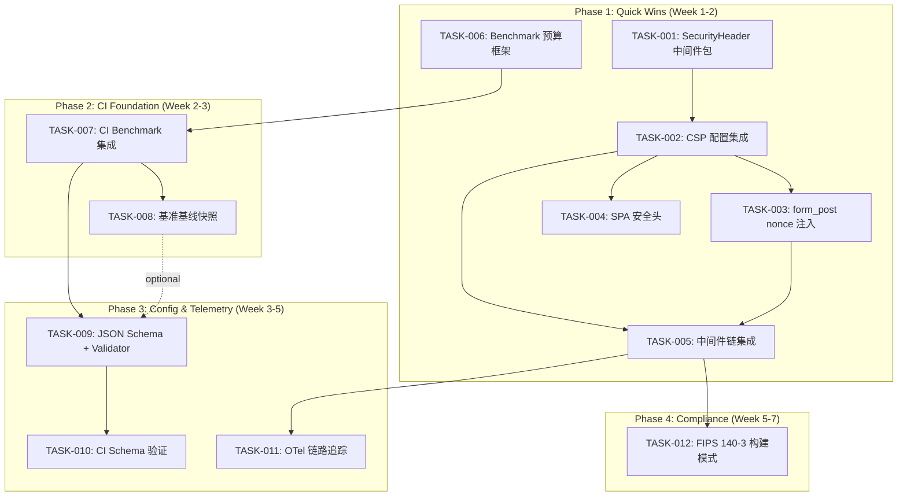
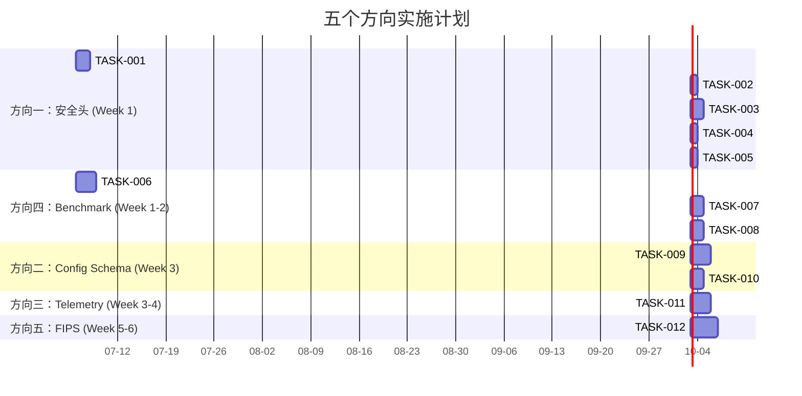

现在我已经对项目结构有了充分理解。以下是我作为 Tech Lead 的技术评审报告。

---

# Tech Lead 实施评审：五个方向的任务分解与执行计划

## 1. 任务分解

将所有五个方向分解为 12 个可执行技术任务，每个任务 2-6 小时。

### 方向一：CSP 与 Web 安全头

| 任务 ID | 标题 | 文件变更 | 前置 | 工时 |
|---------|------|---------|------|------|
| TASK-001 | **安全头中间件包** — 新增 `interfaces/securityheader/` 包，提供 `SecurityHeaderMiddleware`（CSP、Permissions-Policy、Referrer-Policy、Clear-Site-Data、X-Content-Type-Options），支持 Report-Only 模式和配置化策略 | 新建：`interfaces/securityheader/middleware.go`, `interfaces/securityheader/middleware_test.go`, `interfaces/securityheader/config.go` | 无 | 4h |
| TASK-002 | **CSP 配置集成到 Config 结构体** — 在 `config/config_sec.go` 中添加 `SecurityHeadersConfig` 子结构体，含 CSP 策略字符串、Report-Only 开关、Permissions-Policy 等字段，挂载到 `SecurityConfig` | 修改：`config/config.go`, `config/config_sec.go`；修改：`config/config_load.go`（defaults） | TASK-001 | 2h |
| TASK-003 | **form_post.html nonce 注入** — 在 OIDC form_post 响应模式渲染时生成一次性 nonce，模板替换 `{{.CSPNonce}}`，CSP 策略包含 `'strict-dynamic'` + `nonce-{value}` | 新建/修改：`protocols/oidc/form_post.go`（模板渲染函数）；修改：`interfaces/sso/server_discovery.go`（form_post 端点） | TASK-001 | 3h |
| TASK-004 | **三个 SPA 页面添加安全头** — 在 `interfaces/web/login/index.html`, `admin/index.html`, `portal/index.html` 中添加 CSP meta tag（作为中间件的冗余防线）；修改 Go handler 为三个 SPA 端点设置安全响应头 | 修改：`interfaces/web/login/index.html`, `interfaces/web/admin/index.html`, `interfaces/web/portal/index.html`；修改：`interfaces/sso/handlers.go`（SPA handler） | TASK-002 | 2h |
| TASK-005 | **安全头集成到 Server 中间件链** — 在 `interfaces/sso/server_*.go` 中将 SecurityHeaderMiddleware 注入全局中间件链，确保所有端点均经过安全头处理 | 修改：`interfaces/sso/handler.go` 或 `interfaces/sso/options*.go`（中间件注册） | TASK-002 | 2h |

### 方向四：Benchmark 预算与 CI 集成（优先级调整后放在方向二之前）

| 任务 ID | 标题 | 文件变更 | 前置 | 工时 |
|---------|------|---------|------|------|
| TASK-006 | **Benchmark 预算文件与框架** — 新建 `.benchmarks.yaml` 定义 tier 和阈值（critical/extended），写 Go 解析器将 YAML 转为 `testing.BenchmarkResult` 断言；关键路径覆盖率补全（当前 4 个 benchmark 文件覆盖不足） | 新建：`.benchmarks.yaml`, `internal/benchbudget/budget.go`, `internal/benchbudget/budget_test.go`；新增 benchmark：`protocols/oauth/refresh_bench_test.go`, `platform/audit/batch_bench_test.go` | 无 | 5h |
| TASK-007 | **CI benchmark 集成** — 在 CI 中添加 `benchmark` job，`count=10` 运行 critical tier，结果与 `.benchmarks.yaml` 阈值比对；在 Makefile 中添加 `bench-ci` 目标 | 修改：`.github/workflows/ci.yml`（新增 job），`Makefile`（新增 bench-ci target） | TASK-006 | 3h |
| TASK-008 | **Benchmark 基线快照** — 创建 `ops/deploy/benchmarks/baseline.json`，在 main 分支 merge 时自动更新基线；PR 中运行 benchmark 并与基线比较，退化 >10% 标记警告 | 新建：`ops/deploy/benchmarks/baseline.json`, `ops/deploy/benchmarks/compare.sh`；修改：`.github/workflows/ci.yml` | TASK-007 | 3h |

### 方向二：声明式配置 Schema

| 任务 ID | 标题 | 文件变更 | 前置 | 工时 |
|---------|------|---------|------|------|
| TASK-009 | **JSON Schema 生成 + Custom Validator Chain** — 用 `invopop/jsonschema` 从 Go 结构体自动生成 JSON Schema，输出到 `config/config.schema.json`；新增 `ConfigValidator` 注册表模式，实现跨字段互斥校验（如 SQLite+Postgres 互斥）和语义约束 | 新建：`config/schema.go`, `config/schema_test.go`, `config/validate.go`, `config/validate_test.go`, `config/config.schema.json`（自动生成）；修改：`config/config_load.go`（在 Load() 中调用 validate chain） | TASK-007（CI 基础设施前提） | 6h |
| TASK-010 | **CI 配置 schema 验证集成** — 在 CI 中添加 `schema-validate` job，对每份 `config.yaml` 运行 JSON Schema 校验；增强 `make config-validate-all` 使其先执行 schema 验证再执行运行时验证；新增 `--schema-only` CLI 参数跳过业务初始化 | 修改：`.github/workflows/ci.yml`（新增 job），`cmd/sso-server/main.go`（处理 `--schema-only`），`Makefile`（增强 config-validate-all） | TASK-009 | 3h |

### 方向三：异步链路追踪

| 任务 ID | 标题 | 文件变更 | 前置 | 工时 |
|---------|------|---------|------|------|
| TASK-011 | **OpenTelemetry 集成 + 异步 Span 管理** — 初始化 OTel SDK（使用 `go.opentelemetry.io/otel`），将审计 tracer 接入 OTel span 树；解决异步 sink 的 span 生命周期问题：路径 B（延迟 root span 直到 audit 完成）；添加 goroutine span 传播 | 修改：`platform/audit/tracer.go`（OTel 桥接），`platform/audit/async_sink.go`（span 传播），`interfaces/middleware/middleware.go`（OTel 初始化）；新增：`platform/telemetry/otel.go`, `platform/telemetry/otel_test.go`；修改：`config/config.go`, `config/config_metrics_security.go`（telemetry 配置） | TASK-005（中间件模式对齐） | 6h |

### 方向五：FIPS 140-3 合规构建

| 任务 ID | 标题 | 文件变更 | 前置 | 工时 |
|---------|------|---------|------|------|
| TASK-012 | **FIPS 构建模式 + Dockerfile** — 新增 `Dockerfile.fips`（基于 FIPS-enabled Go 镜像）；条件编译 `fips.go` + `fips_stub.go` 控制加密回退；FIPS 模式下禁用 bcrypt 改用 PBKDF2-HMAC-SHA256；配置化允许曲线列表 | 新建：`Dockerfile.fips`, `internal/fips/fips.go`, `internal/fips/fips_stub.go`, `internal/fips/pbkdf2.go`, `internal/fips/pbkdf2_test.go`；修改：`domains/authenticators/password.go`（条件编译密码哈希），`config/config_sec.go`（`FIPSConfig` 字段），`Makefile`（fips-build target）；修改：`.github/workflows/ci.yml`（FIPS 构建 job） | TASK-005 | 8h |

---

## 2. 执行顺序

### 依赖图

### 并行执行组

| 组 | 任务 | 并行度 | 理由 |
|----|------|--------|------|
| **组 A** | TASK-001 + TASK-006 | 2 人并行 | 安全头中间件与 benchmark 框架无文件冲突 |
| **组 B** | TASK-003 + TASK-004 | 2 人并行 | form_post nonce 与 SPA 头修改独立文件 |
| **组 C** | TASK-009 | 1 人 | 关键路径，依赖前期 CI 就绪 |
| **组 D** | TASK-011 + TASK-010 | 2 人并行 | 配置架构不涉及 telemetry 文件 |

---

## 3. 技术风险

### 风险矩阵

| # | 风险 | 可能性 | 影响 | 缓解策略 |
|---|------|--------|------|---------|
| R1 | **CSP nonce 与 SPA 静态 HTML 冲突** — 登录/管理/门户界面是静态 HTML，无法动态注入 nonce。如果中间件设置了 CSP nonce-based 策略但 HTML `<script>` 标签缺少 nonce，脚本会被浏览器阻止 | 高 | 高 | **只使用中间件 CSP 策略，SPA 页面不使用 inline script（已经全部使用外部 `app.js`）**。对 `app.js` 使用 `'strict-dynamic'` 或基于 path 的 allowlist。SPA 中的 meta CSP 作为**冗余兜底**但不含 nonce |
| R2 | **OTel SDK 依赖引入隐式 CGO 需求** — `go.opentelemetry.io/otel` 标准版是纯 Go，但某些 exporter（如 gRPC）会引入 `google.golang.org/grpc` 增加构建复杂度 | 中 | 中 | Phase 1 使用 OTel stdout exporter，不引入 gRPC exporter。将 exporter 抽象为接口，生产环境通过配置注入 |
| R3 | **Benchmark CI 的 CPU 抖动** — `ubuntu-latest` 共享 runner 的 CPU 频率波动导致 benchmark 结果不可重复 | 高 | 高 | 强制 `-count=10` + `-benchtime=5x`，用中位数而非平均值。在 `.benchmarks.yaml` 中设置宽松阈值（+20% 而非 +10%）。记录 runner 信息到基准元数据 |
| R4 | **JSON Schema 自动生成覆盖不全** — `invopop/jsonschema` 对泛型 Structure、`time.Duration` 编组、`json.RawMessage` 等边缘类型可能生成不准确 schema | 中 | 中 | 在测试中使用 schema 验证所有示例 config.yaml，确保 100% 通过。对 duration 字段生成 `"pattern": "^([0-9]+(\\.[0-9]+)?(ns|us|ms|s|m|h))+$"` 字符串格式 |
| R5 | **FIPS 构建镜像不可用** — `golang:1.24-fips-alpine` 镜像可能不存在或版本滞后 | 低 | 高 | 退路方案：使用 RedHat UBI + 手动 Go 编译，或使用 `GOEXPERIMENT=systemcrypto` 在普通 Go 中启用 FIPS 模块 |
| R6 | **测试维护负担** — 方向三的 OTel span 断言需要 mock exporter，单元测试从同步变为异步，增加 flakiness | 中 | 中 | 使用 `go.opentelemetry.io/otel/sdk/trace/tracetest` 的 `InMemoryExporter`，所有断言通过 channel timeout 控制 |

### 已识别的不确定性

1. **CSP 策略第一周假阳性率** — 无法预知 operator 配置的自定义扩展端点是否会触发 CSP 拦截。必须设置 CSP-Report-Only + 两周数据收集期
2. **PBKDF2 性能损失** — bcrypt cost=12 约 250ms/登录，PBKDF2 可能需要调整 iterations 至等耗时。需要 benchmark 对比后固定 iteration 值
3. **OTel 初始化对启动延迟的影响** — OTel 的 `Shutdown()` 是阻塞的，server 关闭时增加 ~5s 延迟。需要 graceful shutdown context 超时

---

## 4. 资源评估

### 人员技能矩阵

| 角色 | 数量 | 技能要求 | 负责方向 |
|------|------|---------|---------|
| **Backend/Go 工程师** | 2 人 | Go、HTTP 中间件、安全头标准、OpenAPI | 方向一（安全头）、方向四（Benchmark） |
| **Platform/Infra 工程师** | 1 人 | Go、OTel、CI/CD（GitHub Actions）、Docker | 方向三（Telemetry）、方向四 CI 集成 |
| **Security/Compliance 工程师** | 1 人半职 | 加密标准（FIPS 140-3）、安全配置, Go crypto | 方向五（FIPS）、方向二（Config Schema） |

**合计：** 2 名全职工程师 + 1 名全职工程师 + 1 名半职安全工程师 = 3.5 FTE。

### 关键里程碑

| 里程碑 | 时间（从启动日） | 交付物 |
|--------|-----------------|--------|
| **M1** | Day 7 | 安全头中间件 + CSP 配置 + 三个 SPA 页面安全就绪 |
| **M2** | Day 14 | form_post nonce、安全头完全集成、benchmark 预算框架就绪 |
| **M3** | Day 21 | CI benchmark 集成 + 基线快照 |
| **M4** | Day 28 | JSON Schema 生成 + 自定义验证器注册表 + CI schema 验证 |
| **M5** | Day 35 | OTel 异步链路追踪 + 审计系统桥接 |
| **M6** | Day 45 | FIPS 140-3 构建模式 + Dockerfile + CI 构建 |

### 阻塞点

| 阻塞点 | 影响 | 解决策略 |
|--------|------|---------|
| **方向三的 OTel SDK 评估** | TASK-011 的前置条件 | Day 1 花 2 小时 POC（`go.opentelemetry.io/otel` 集成到中间件），确定 exporter 策略 |
| **方向五的 FIPS Go 镜像可用性** | TASK-012 的前置条件 | Day 1 验证 `golang:1.24-fips-alpine` 或 UBI 镜像是否存在，不存在则准备 `GOEXPERIMENT=systemcrypto` 退路方案 |
| **方向四的 benchmark 基线不稳定** | TASK-008 的持续问题 | Day 7 在长时间运行（main 分支）建立 7 天基线，前 7 个 PR 只记录不 gate |

---

## 5. 质量保证

### 单元测试覆盖要求

| 任务 | 包 | 最低覆盖率目标 | 关键测试用例 |
|------|----|--------------|-------------|
| TASK-001 | `interfaces/securityheader/` | 90% | CSP 策略注入、nonce 生成唯一性、Report-Only vs Enforce、Permissions-Policy 注入 |
| TASK-003 | `protocols/oidc/` | 80% | nonce 唯一性（100 次生成无重复）、模板渲染输出含 `<script nonce="...">`、CSP nonce 与策略一致 |
| TASK-006 | `internal/benchbudget/` | 85% | 预算法则文件解析、阈值越界检测、tier 路由、中位数计算 |
| TASK-009 | `config/` | 85% | Schema 对 config.yaml 全量验证、跨字段互斥校验（SQLite+Postgres）、Duration pattern 验证、Version 必须性 |
| TASK-011 | `platform/telemetry/` | 75% | Span 父子关系正确性、异步 goroutine span 传播、graceful shutdown 不丢 span |
| TASK-012 | `internal/fips/` | 80% | FIPS 模式禁用 bcrypt、PBKDF2 输出一致性、`fips.allowed_curves` 过滤、条件编译覆盖 |

### 集成测试策略

| 方向 | 测试层次 | 方法 |
|------|---------|------|
| **方向一** | HTTP 集成 | 启动 test server（httptest），对所有端点发送请求，验证响应头包含 CSP、Permissions-Policy、X-Content-Type-Options |
| **方向二** | 配置集成 | 对 `ops/deploy/*/config.yaml` 每份文件执行 `config-validate --schema-only` 和完整 `--validate-only`，全部通过 |
| **方向三** | 端到端追踪 | 启动 server + bufconn client，发送完整 OAuth 流程请求，使用 OTel InMemoryExporter 验证 span 树结构 |
| **方向四** | CI 集成 | benchmark 结果解析器集成测试：mock benchmark 输出，验证预算检查逻辑 |
| **方向五** | 构建集成 | `docker build -f Dockerfile.fips .` 成功；FIPS 模式下启动自检通过 |

### 代码审查要点

| 方向 | 审查重点 |
|------|---------|
| **方向一** | CSP 策略字符串的构造是否正确（`'self'` 引号、分号分隔、nonce 动态注入）；form_post nonce 是否在每次响应中唯一 |
| **方向二** | JSON Schema 的 `required` 数组是否完整；自定义 Validator 是否有负面测试覆盖（互斥约束在错误输入上返回错误） |
| **方向三** | OTel span 生命周期管理（context 传递、async goroutine 的 parent span 选择）；审计 TraceID 与 OTel TraceID 的桥接是否正确 |
| **方向四** | Benchmark 预算阈值是否通过统计方法而非直觉确定；CI 中 `-count=10` 的执行时间是否被 CI 超时窗口覆盖 |
| **方向五** | PBKDF2 iteration 数与 bcrypt cost=12 的 CPU 时间匹配；条件编译的 stub 文件是否正确处理非 FIPS 构建 |

### 性能测试需求

| 方向 | 测试 | 指标 |
|------|------|------|
| 方向一 | 安全头中间件开销 | 最坏情况额外延迟 < 50μs（主要为 header 写入） |
| 方向三 | OTel span 注入开销 | 每个请求额外分配 ≤ 3 个 object，延迟 < 10μs |
| 方向四 | Benchmark 本身 | CI benchmark 总时间 ≤ 3 分钟（critical tier） |
| 方向五 | PBKDF2 vs bcrypt | PBKDF2 哈希时间与 bcrypt cost=12 的差异 < 20% |

---

## 6. 实施计划

### 详细时间表

### 阶段分解

#### 阶段 1：基础设施搭建（Day 1-3）
**目标：** 建立安全头中间件 + Benchmark 框架，构建可运行的开发基础设施。

| 天次 | 工作项 |
|------|--------|
| Day 1 | 2 人并行：A 工程师创建 `interfaces/securityheader/` 包（CSP、HSTS、Permissions-Policy）；B 工程师创建 `internal/benchbudget/` 包 + 解析 `.benchmarks.yaml` 并读取现有 4 个 benchmark 文件 |
| Day 2 | A 工程师将 SecurityHeader 配置集成到 `config.Config`、写默认值、写单元测试；B 工程师开发 budget 阈值检查逻辑 + 创建 benchmark 测试（refresh 旋转、audit batch 写入） |
| Day 3 | A 工程师完成 form_post nonce 模板；B 工程师写 budget 集成测试 + 确保所有新增 benchmark 在有/无预算约束下均通过 |

**验收标准：**
- `go test ./interfaces/securityheader/...` 覆盖率 ≥ 90%
- `go test ./internal/benchbudget/...` 覆盖率 ≥ 85%
- 现有 4 个 benchmark 文件 + 2 个新 benchmark 全部可用
- `make config-validate-all` 仍通过

#### 阶段 2：核心功能实现（Day 4-8）
**目标：** 安全头完全就绪 + CI benchmark 集成。

| 天次 | 工作项 |
|------|--------|
| Day 4 | A 工程师：三个 SPA HTML 文件添加 CSP meta 标签 + Go handler 设置响应头；B 工程师：将 benchmark job 添加到 CI（`ubuntu-latest`, `-count=10`, critical tier only） |
| Day 5 | A 工程师：安全头中间件注入全局 middleware 链，写 HTTP 集成测试验证所有端点响应头；B 工程师：创建 `ops/deploy/benchmarks/baseline.json` + PR benchmark comparison 脚本 |
| Day 6-8 | A 工程师：监控 CSP-Report-Only 在 test suite 中无假阳性后启用 enforce 模式（此步骤可在后续 Sprint 完成）；B 工程师：集成测试 benchmark CI job + 处理 CI runner 抖动（中位数 + 宽松阈值） |

**验收标准：**
- 所有 HTTP 响应包含 CSP、X-Content-Type-Options、Permissions-Policy 头
- form_post 端点响应含唯一 nonce
- CI benchmark job 在 ≤3 分钟内完成
- PR 中 benchmark 退化 >20% 时 CI 标记警告

#### 阶段 3：配置 Schema + 异步追踪（Day 9-14）
**目标：** JSON Schema 生成 + CI 验证 + OTel 链路追踪。

| 天次 | 工作项 |
|------|--------|
| Day 9 | C 工程师（Platform）：引入 `invopop/jsonschema`，从 `config.Config` 生成 schema，处理边缘类型（duration、泛型），写入 `config/config.schema.json` |
| Day 10 | C 工程师：实现 `ConfigValidator` 注册表，写跨字段互斥校验（Postgres+SQLite、WebAuthn+Password）、Version 校验、Listen 地址语法校验 |
| Day 11 | C 工程师：增强 `make config-validate-all` 先 schema 后 runtime，新增 `--schema-only` 参数，CI 添加 schema-validate job |
| Day 12-13 | D 工程师：OTel SDK 初始化 + 审计 tracer 桥接，写 `platform/telemetry/otel.go`，解决 async sink span 生命周期 |
| Day 14 | D 工程师：写 OTel 集成测试（InMemoryExporter 验证 span 树）+ graceful shutdown handler |

**验收标准：**
- `config/config.schema.json` 对 `ops/deploy/*/config.yaml` 全量通过
- 自定义 Validator 捕获跨字段互斥违反
- CI 中 schema-validate job 作为硬门禁
- OTel span 树在端到端 OAuth 流程中正确传播
- 异步审计 sink 不产生孤儿 span

#### 阶段 4：FIPS 合规 + 回滚与文档（Day 15-22）
**目标：** FIPS 构建模式可用 + 所有文档补全。

| 天次 | 工作项 |
|------|--------|
| Day 15-16 | E 工程师（Security）：创建 `Dockerfile.fips`，确认 FIPS-enabled Go 镜像可用性 |
| Day 17 | E 工程师：写条件编译 `internal/fips/fips.go` + `fips_stub.go`，FIPS 模式下禁用 bcrypt |
| Day 18 | E 工程师：实现 PBKDF2-HMAC-SHA256 密码哈希 + `fips.allowed_curves` 过滤 |
| Day 19 | E 工程师：CI 添加 FIPS 构建 job（仅构建不推送 + SCA 扫描），Makefile 添加 `make fips-build` |
| Day 20-22 | **全员**：文档补全（`docs/security-headers.md`, `docs/config-schema.md`, `docs/telemetry.md`, `docs/fips.md`）、所有更新同步到 `docs/error-codes.md` 和 `docs/openapi.yaml` |

**验收标准：**
- `docker build -f Dockerfile.fips .` 成功
- FIPS 模式下 PBKDF2 密码验证通过
- `fips.allowed_curves` 过滤正确（P-256/P-384 允许，P-224 拒绝）
- 非 FIPS 构建完全不受影响

---

## 7. 总成本汇总

| 方向 | 任务数 | 总工时 | 风险暴露 | 价值/工价比 |
|------|--------|--------|---------|-----------|
| 方向一：CSP 与安全头 | 5 | 12h | R1（中） | ★★★★★ |
| 方向四：Benchmark 预算 | 3 | 11h | R3（高） | ★★★★★ |
| 方向二：配置 Schema | 2 | 9h | R4（中） | ★★★★ |
| 方向三：链路追踪 | 1 | 6h | R2（中） | ★★★ |
| 方向五：FIPS 140-3 | 1 | 8h | R5（低）、R6（中） | ★★★（市场驱动） |
| **总计** | **12** | **46h** | — | — |

### 风险调整后建议

**立即执行（Sprint 1）：** 方向一 + 方向四（价值/工价比最高，相互独立可并行）
**Sprint 2：** 方向二（依赖方向四的 CI 成熟度）
**Sprint 3：** 方向三（依赖方向一的中间件模式）
**等待市场触发：** 方向五（FedRAMP/FISMA 客户需求时激活）

这个顺序确保每个 Sprint 都有可交付价值，不互相阻塞，且在最坏情况（方向五推迟）下不影响其他方向的收益。
