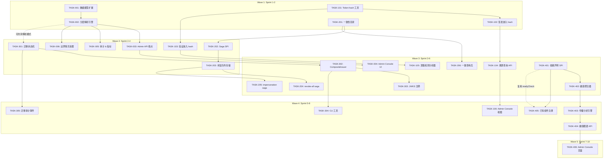
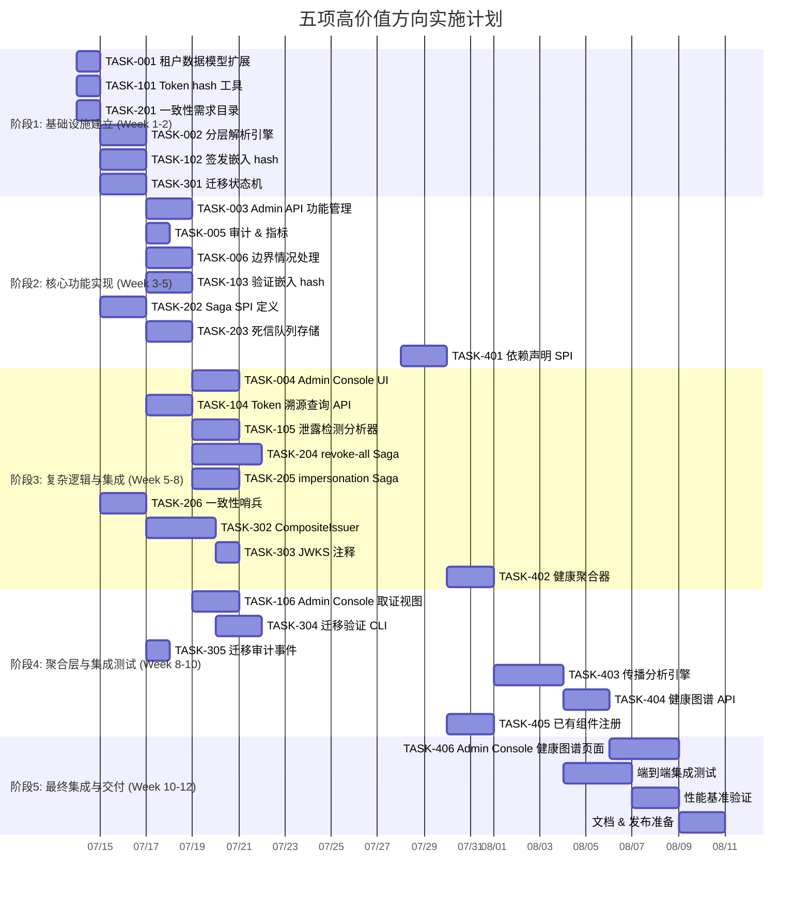

# Tech Lead 分析报告：五项未覆盖的高价值扩展方向

> **角色：** Tech Lead  
> **分析基准：** `docs/requirements/architect-final-five-2026-07-11.md`  
> **代码库版本：** 2026-07-12 (commit 对照最新 HEAD)  
> **分析范围：** 任务分解、执行顺序、技术风险、资源评估、质量保证、实施计划

---

## 1. 任务分解

### 方向二：租户级功能标志层（Tenant-Level Feature Flag Layer）

| 任务 ID | 任务标题 | 涉及文件 | 前置依赖 | 预估工时 | 验收标准 |
|---|---|---|---|---|---|
| TASK-001 | **租户 FeatureOverrides 数据模型扩展** | `domains/tenant/tenant.go` (扩展 Tenant struct), `domains/tenant/spi.go` (扩展 SPI), `infrastructure/defaultimpl/sqlite/tenant.go` (migration), `config/config.go` (schema) | 无 | 3h | Tenant 结构体增加 `FeatureOverrides map[string]*bool`；SQLite migration 新增 `feature_overrides TEXT` 列；Redis cache 序列化/反序列化支持 |
| TASK-002 | **分层标志解析引擎** | `interfaces/sso/sso_wiring.go` (新增 `featureResolver` 字段), `interfaces/sso/server_routes.go` (修改 `*GateOn()` 方法), `interfaces/sso/options_httpstack.go` (新增 `WithTenantFeatureResolver` option) | TASK-001 | 4h | `resolveFeatureGate(ctx, name string) bool` 实现三层回退逻辑：租户覆盖→全局 gate→默认 off；所有 7 个 `*GateOn()` 方法通过新解析器；热加载不受影响 |
| TASK-003 | **Admin API 租户功能管理端点** | `interfaces/sso/server_admin.go` 或 `interfaces/admin/tenant_features.go` (新文件), `interfaces/sso/handlers.go` (路由注册) | TASK-002 | 3h | `GET /api/v1/admin/tenants/{id}/features` 返回当前覆盖；`PUT .../features` 全量替换；`PATCH .../features` 单 flag 修改；400 验证功能名存在性 |
| TASK-004 | **Admin Console UI 功能标志选项卡** | `admin-console/` (SPA 前端项目) 新增 `TenantFeatureFlags` 页面组件 | TASK-003 | 4h | 租户详情页渲染 Feature Flags 选项卡；Toggle 开关调用 Admin API 进行 PATCH；显示全局默认值参考 |
| TASK-005 | **审计事件 & Prometheus 指标** | `shared/audit/events.go` (新增 `TenantFeatureOverrideUpdated`), `interfaces/sso/metrics.go` (新增 `sso_tenant_feature_active` gauge) | TASK-002 | 2h | 每次覆盖变更产生 audit 事件；Prometheus gauge 每个租户/功能组合一条指标 |
| TASK-006 | **边界情况处理** | `interfaces/sso/tenant_features.go` (新文件，边界逻辑集中) | TASK-002 | 3h | 全局 OFF 时租户无法覆盖为 ON（返回 403）；未知功能名返回 400；cluster.Bus 缓存失效广播；Redis TTL 60s |

**方向二总工时：19h（约 2.5 人天）**

---

### 方向三：令牌签发水印与取证溯源（Token Issuance Watermark & Forensic Traceability）

| 任务 ID | 任务标题 | 涉及文件 | 前置依赖 | 预估工时 | 验收标准 |
|---|---|---|---|---|---|
| TASK-101 | **Token hash 计算工具函数** | `shared/security/token_hash.go` (新文件) 或 `infrastructure/defaultimpl/fingerprint.go` | 无 | 2h | `FingerprintToken(token string) string` — SHA-256(token) 的 hex 编码；导出 `TokenFingerprint` SPI；benchmark 验证 < 1µs |
| TASK-102 | **签发路径嵌入 token_hash** | `interfaces/sso/server_helpers.go` (修改 `recordTokenIssued`、`recordRefreshTokenIssued`、`recordIDTokenIssued`)，`shared/audit/events.go` (扩展事件 metadata) | TASK-101 | 4h | 所有 `token_issued`/`refresh_token_issued`/`id_token_issued` 事件的 `metadata` 包含 `token_hash` 字段；覆盖 auth_code、client_creds、refresh、device_code、token_exchange、CIBA 六种 grant |
| TASK-103 | **验证路径嵌入 token_hash** | `interfaces/middleware/middleware.go` (DPoP 验证)，`interfaces/sso/server_introspect.go` (introspection)，`interfaces/sso/server_userinfo.go` (userinfo) | TASK-101 | 3h | DPoP proof 验证、introspect 请求、userinfo 请求的 audit 事件中包含 `token_hash` |
| TASK-104 | **Token 溯源查询 Admin API** | `interfaces/admin/token_forensics.go` (新文件), `interfaces/sso/accessors_handlers.go` (注册路由) | TASK-102 | 3h | `GET /api/v1/admin/forensics/token?hash=<SHA256>` 返回完整生命周期：签发→轮换→撤销→使用记录 |
| TASK-105 | **Token 泄露检测分析器** | `domains/anomaly/detectors/token_leak.go` (新文件), `domains/anomaly/registry.go` (注册) | TASK-103 | 4h | 新 anomaly detector 在 5min 窗口内检测同 `token_hash` 被多 IP/UA 使用；初始 shadow mode（仅告警）；触发 `token_leak_detected` audit 事件 |
| TASK-106 | **Admin Console 取证视图** | `admin-console/` 新增 Token Forensics 页面 | TASK-104 | 3h | 输入 token（自动计算 hash）或 hash，展示时间线视图；每条记录显示 event 类型、时间戳、IP |

**方向三总工时：19h（约 2.5 人天）**

---

### 方向一：异构存储后端的事务一致性协调器（Cross-Backend Transaction Consistency Coordinator）

| 任务 ID | 任务标题 | 涉及文件 | 前置依赖 | 预估工时 | 验收标准 |
|---|---|---|---|---|---|
| TASK-201 | **一致性需求目录编制** | `docs/consistency-matrix.md` (新文件) | 无 | 3h | 审计所有跨后端操作路径，按风险等级分类（Critical/High/Medium/Best-effort）；产出「一致性需求矩阵」文档，附每路径的原子操作列表及失败后果 |
| TASK-202 | **Saga 编排 SPI 定义** | `shared/consistency/saga.go` (新文件), `shared/consistency/spi.go` (新文件) | TASK-201 | 4h | `SagaCoordinator` 接口：`AddStep(do, compensate StepFunc)`、`Execute(ctx, operationID)`、`Compensate(ctx, operationID)`；StepFunc 返回 `StepResult{Status, Error}`；幂等性通过 `operation_id UUID` 保证 |
| TASK-203 | **死信队列存储 SPI** | `shared/consistency/deadletter.go` (新文件), 内存+SQLite 实现 | TASK-202 | 3h | `DeadLetterStore` 接口：`Enqueue`, `Dequeue`, `List`, `Replay`；SQLite 实现使用 `dead_letter_queue` 表；内存实现用于测试 |
| TASK-204 | **/token/revoke-all Saga 实现** | `interfaces/sso/server_invalidation.go` (改造 `handleRevokeAll`)，`shared/consistency/revoke_all_saga.go` (新文件) | TASK-202, TASK-203 | 5h | revoke-all 路径使用 saga 编排：Step1 SQLite DELETE → Step2 Redis DEL → Step3 cluster.Bus 广播；任意 step 失败触发补偿（重新插入已删除行 + 发"撤销撤销"通知）；补偿失败入死信队列 |
| TASK-205 | **mintImpersonationSession Saga 实现** | `interfaces/sso/server_admin.go` (改造 `mintImpersonationSession`)，`shared/consistency/impersonation_saga.go` (新文件) | TASK-202, TASK-203 | 4h | break-glass 模仿会话使用 saga：Step1 SQLite session → Step2 Redis cache → Step3 cluster.Bus → Step4 audit；audit 失败不阻断但入死信队列 |
| TASK-206 | **后台一致性检查哨兵** | `interfaces/sso/consistency_sentinel.go` (新文件), `interfaces/sso/sso_wiring.go` (注册) | TASK-201 | 4h | 后台 goroutine 每 60s 执行一致性检查（Redis session ↔ SQLite auth_code）；不一致→ `consistency_mismatch_detected` audit 事件 + 自动修复；断路器避免级联 |

**方向一总工时：23h（约 3 人天）**

---

### 方向四：算法与凭据迁移框架（Algorithm & Credential Migration Framework）

| 任务 ID | 任务标题 | 涉及文件 | 前置依赖 | 预估工时 | 验收标准 |
|---|---|---|---|---|---|
| TASK-301 | **算法迁移状态机** | `shared/security/alg_migration.go` (新文件) | 无 | 4h | `AlgMigrationState` 枚举 `PhasePlanning→PhaseDualWriteVerify→PhaseRollingIssue→PhaseDrainOld→PhaseComplete`；线程安全状态转换；转换产生 `algorithm_migration_phase_changed` audit 事件 |
| TASK-302 | **CompositeIssuer 实现** | `shared/security/composite_issuer.go` (新文件) | TASK-301 | 5h | `CompositeIssuer` 实现 `core.TokenIssuer`；持有序号签发器列表 `[]PriorityIssuer{Issuer, Priority}`；`Issue()` 使用最高优先级签发器；`JWKS()` 返回所有注册签发器的公钥；签发器热注册/移除 |
| TASK-303 | **JWKS 算法迁移注释** | `interfaces/sso/server_discovery.go` (修改 JWKS 端点)，`shared/security/composite_issuer.go` (扩展 JWKS 元数据) | TASK-302 | 2h | JWKS 响应中每个 key 添加 `ext: { alg_migration: "primary" | "secondary" | "draining" }`；无迁移时省略扩展字段 |
| TASK-304 | **迁移验证 CLI 工具** | `cmd/sso-ctl/migrate.go` (新文件) | TASK-302 | 4h | `sso-ctl migrate algorithm --from Ed25519 --to ES256` 创建迁移计划；dry-run 模式验证（不执行迁移，只收集统计）；`--status` 查看当前迁移状态 |
| TASK-305 | **迁移审计事件 & 旧算法 token 告警** | `shared/audit/events.go` (新增事件类型), `interfaces/sso/metrics.go` (新增 `legacy_token_count` 指标) | TASK-301 | 2h | `token_signed_with_legacy_algorithm` 事件可配置告警阈值；`migration_completed` 事件；Prometheus 指标跟踪旧算法 token 数量随时间衰减 |

**方向四总工时：17h（约 2 人天）**

---

### 方向五：统一依赖健康图谱与降级传播仪表盘（Unified Dependency Health Graph）

| 任务 ID | 任务标题 | 涉及文件 | 前置依赖 | 预估工时 | 验收标准 |
|---|---|---|---|---|---|
| TASK-401 | **依赖声明 SPI** | `shared/healthgraph/dependency.go` (新文件), `shared/healthgraph/spi.go` (新文件) | 无 | 4h | `DependencyDeclaration{ID, Name, Type, DependsOn []DependencyRef, HealthProbe func() HealthStatus, DegradationImpact func() []AffectedPath}`；声明式 YAML 注册 + 代码注册两种方式 |
| TASK-402 | **健康探测聚合器** | `shared/healthgraph/aggregator.go` (新文件) | TASK-401 | 4h | 后台 goroutine 每 15s 聚合所有依赖健康状态；健康衰减逻辑（degraded 持续 > 30s → 红色）；最后已知状态缓存 30s 后标记 `unknown` |
| TASK-403 | **降级传播分析引擎** | `shared/healthgraph/propagation.go` (新文件) | TASK-402 | 5h | 拓扑排序的 DAG 分析：B 降级时找出所有直接/间接依赖 B 的上游组件；计算受影响面（受影响 API 端点列表 + 受影响租户数量）；传播路径可追溯到具体端点和租户 |
| TASK-404 | **健康图谱 Admin API** | `interfaces/admin/health_graph.go` (新文件) | TASK-403 | 3h | `GET /api/v1/admin/health/graph` 返回 DAG 格式的依赖健康图谱（节点+边+健康颜色）；`GET /api/v1/admin/health/graph/propagation?node=redis` 展示降级影响范围 |
| TASK-405 | **存储后端 & 已有组件注册** | `interfaces/sso/sso_wiring.go` (注册所有现有 readyCheck 到健康图谱), 各存储后端实现添加 `DependencyDeclaration` | TASK-401 | 4h | SQLite、Redis、etcd、KMS×5、signing keys、cluster bus、Kafka、MQTT 等全部注册；健康指标源复用现有的 `/readyz` check 函数 |
| TASK-406 | **Admin Console 健康图谱页面** | `admin-console/` 新增 Health Graph 页面组件 | TASK-404 | 5h | 交互式 DAG 图（D3.js 或 Cytoscape.js）；红色/黄色/绿色/灰色节点；可缩放/点击查看详情；支持按层过滤（存储层/网络层/认证层） |

**方向五总工时：25h（约 3 人天）**

---

## 2. 执行顺序

### 全局依赖图



### 并行执行组

| 并行组 | 包含任务 | 说明 |
|---|---|---|
| **组 A** (Wave 1 基础设施) | TASK-001, TASK-101, TASK-201 | 方向二/三/一的基础数据模型和工具，互无依赖 |
| **组 B** (Wave 1 核心逻辑) | TASK-002, TASK-102, TASK-301 | 方向二解析器、三 hash 嵌入、四状态机，三者正交 |
| **组 C** (Wave 2 API 层) | TASK-003, TASK-005, TASK-006, TASK-103, TASK-202, TASK-203 | Admin API、审计、一致性 SPI |
| **组 D** (Wave 3 复杂逻辑) | TASK-004, TASK-104, TASK-105, TASK-204, TASK-205, TASK-302, TASK-401, TASK-402 | UI、分析器、saga、composite issuer、健康 SPI |
| **组 E** (Wave 4 集成) | TASK-106, TASK-304, TASK-305, TASK-403, TASK-404, TASK-405 | 剩余 UI + 聚合层 |
| **组 F** (Wave 5 前端) | TASK-406 | 健康图谱页面，最长尾 |

---

## 3. 技术风险

### 3.1 高风险项

| 风险 ID | 方向 | 风险描述 | 影响 | 概率 | 缓解策略 |
|---|---|---|---|---|---|
| RISK-01 | 方向一 | **Saga 补偿操作的幂等性**：`/token/revoke-all` 的补偿是"重新插入已删除的记录"，但 SQLite 中已删除的 auth_code 可能存在唯一约束冲突 | 补偿失败 → 死信队列堆积 → 数据不一致扩大 | 中 | 补偿操作使用 `INSERT OR IGNORE` + UPDATE；操作 ID 去重前先查询是否已补偿 |
| RISK-02 | 方向一 | **补偿操作级联失败**：`revoke-all` 的补偿 Step1（重新插入 SQLite token）成功，Step2（Redis SET）失败 → 部分补偿 | 部分补偿可能导致更隐蔽的不一致 | 高 | 补偿也有自己的 saga — 嵌套补偿。但工程复杂度高，建议：单步补偿失败立即入死信队列，不继续补偿后续步骤 |
| RISK-03 | 方向二 | **全局 gate OFF / 租户覆盖 ON 的安全约束**：分析文档要求"全局 OFF 时租户不能覆盖为 ON"，但某些场景（如 Beta 测试）需要相反行为 | 灵活性不够，可能阻塞产品需求 | 低 | 区分"安全级 gate"（全局强制）和"功能级 gate"（允许租户覆盖）。在 FeatureGates 中增加 `SecurityCritical *bool` 标记 |
| RISK-04 | 方向三 | **token_hash 计算时机**：`recordTokenIssued` 的签名中当前没有 token 明文参数，需要签名路径透传 token | 需要修改多个签发器接口签名 | 中 | 在 `recordTokenIssued` 的参数列表增加 `tokenHash string`；签发器在 `Issue()` 返回 token 明文后立即计算 hash |
| RISK-05 | 方向三 | **泄露检测分析器的性能**：每个 introspection 请求都需要计算 token hash 并写入 anomaly 事件队列 | 高 QPS 场景（>10K/s）的 CPU 开销不可忽略 | 中 | SHA-256 约 400ns/byte（Go stdlib），JWT 平均 ~1KB → <1µs/hash。10K/s → 额外 10ms CPU。可接受。如果需要，引入截断 hash（前 16 字节） |
| RISK-06 | 方向四 | **CompositeIssuer 的 kty/jku 冲突**：当签发器列表包含同 kty（如两个 ES256 签发器）时，JWKS 响应出现重复 kty 条目 | 客户端可能选择错误的 key 进行验证 | 高 | `CompositeIssuer` 必须保证 JWKS 中每个 `kid` 唯一且稳定。添加 `kid` 前缀策略：`<alg>-<issuer-name>-<key-id>` |
| RISK-07 | 方向四 | **KMS 后端不支持新算法**：AWS KMS 在 2026 年可能尚未支持 ML-DSA | 后量子迁移路径阻塞 | 中（长期） | `CompositeIssuer.VerifyAlgSupport()` 在迁移计划创建时验证：如果目标算法被任一注册签发器拒绝，在 planning 阶段即失败 |
| RISK-08 | 方向五 | **健康图谱的循环依赖检测**：即使理论上 DAG 不应有循环，复杂系统中仍可能出现隐式循环（如 Redis health 依赖 SQLite → SQLite health 依赖 Redis） | 传播分析引擎死循环 | 中 | 在 `RegisterDependency` 时用 DFS 检测循环依赖；传播时使用拓扑排序的 `sync.WaitGroup` 模式 |
| RISK-09 | 方向五 | **大规模部署的图谱规模**：100+ 副本的集群中，健康图谱可能有 1000+ 节点 | API 响应 > 10MB，浏览器渲染卡顿 | 中 | 默认只返回有状态变化的活跃节点（delta）；全量图谱支持分页和层过滤；前端使用虚拟滚动 |

### 3.2 外部依赖

| 依赖 | 方向 | 说明 | 后备方案 |
|---|---|---|---|
| D3.js / Cytoscape.js | 方向五 | Admin Console 健康图谱的 DAG 渲染需要前端库 | D3.js 更轻量(250KB)但需要更多手写；Cytoscape.js(400KB) 有现成的 DAG layout |
| NIST CNSA 2.0 时间线 | 方向四 | 后量子算法标准成熟度影响 ML-DSA 集成优先级 | 2026 年标准已定，但 Go 标准库尚未原生支持。考虑使用 `cloud.google.com/go/kms` 或 AWS KMS 的 PQC 支持 |
| cluster.Bus 可用性 | 方向一 | Saga 补偿可能依赖 cluster.Bus 重新广播 | 如果 bus 不可用，补偿操作本地完成（SQLite + Redis 写入），bus 不可用仅影响跨副本一致性，后期可修复 |

### 3.3 性能考量

| 方向 | 关键路径 | 性能目标 | 基准测试要求 |
|---|---|---|---|
| 方向一 | Saga 编排开销 | < 0.5ms/step | `BenchmarkSagaCoordinator_Execute` -- 10 step saga |
| 方向一 | 一致性哨兵 | < 1s/轮（1000 条记录扫描） | `BenchmarkConsistencySentinel_Scan` |
| 方向三 | SHA-256 hash 计算 | < 1µs/token | `BenchmarkFingerprintToken` |
| 方向五 | 健康聚合 | < 50ms/聚合周期 | `BenchmarkHealthAggregator_Collect` |
| 方向五 | 传播分析 | < 100ms (1000 节点 DAG) | `BenchmarkPropagationAnalyzer_Analyze` |

---

## 4. 资源评估

### 4.1 开发团队配置

| 角色 | 数量 | 核心技能要求 | 主要负责方向 |
|---|---|---|---|
| **Senior Backend Engineer** | 2 人 | Go 并发编程、分布式系统、存储后端经验 | 方向一（saga + 一致性）+ 方向四（composite issuer + 状态机） |
| **Full-stack Engineer** | 1 人 | Go + React/TypeScript、Admin Console 开发经验 | 方向二（Admin API + UI）+ 方向三（溯源 Admin API + UI） |
| **Site Reliability Engineer** | 1 人 | 可观测性、Prometheus 指标、健康检查模式 | 方向五（健康图谱 SPI + 聚合器 + 传播引擎） |
| **Security Engineer** | 0.5 人（部分时间） | 密码学、JWT 安全、审计合规 | 方向三（水印设计审查）+ 方向四（算法迁移安全审查） |

**团队规模：4-5 人**

### 4.2 关键时间节点

| 里程碑 | 时间 | 交付物 | 验收标准 |
|---|---|---|---|
| **M0: Wave 1 完成** | 第 2 周末 | 方向二/三/一基础设施 + 核心逻辑 | TASK-001,002,101,102,201 全部通过验收 |
| **M1: Wave 2 完成** | 第 4 周末 | 方向二/三 API 层 + 方向一 SPI + 方向四状态机 | TASK-003,005,006,103,202,203,301 全部通过验收 |
| **M2: Wave 3 完成** | 第 6 周末 | 四个方向核心功能 + 健康图谱 SPI | TASK-004,104,105,204,205,206,302,303,401,402 全部通过验收 |
| **M3: Wave 4 完成** | 第 8 周末 | 方向四/五聚合层 + 集成测试 | TASK-106,304,305,403,404,405 全部通过验收 |
| **M4: Wave 5 完成** | 第 10 周末 | 全部 UI + 端到端测试 + 文档 | TASK-406 验收；`make acceptance` 全部通过 |

### 4.3 阻塞点与解决策略

| 阻塞点 | 涉及方向 | 描述 | 解决策略 |
|---|---|---|---|
| **BLOCKER-01** | 方向一 | Saga 补偿的幂等语义在 SQLite + Redis 双后端上难以统一实现 | 限定补偿范围：SQLite 补偿用 `INSERT OR REPLACE`，Redis 补偿用 `SET`（幂等 by 定义）。cluster.Bus 补偿使用去重接收（`operation_id` dedup） |
| **BLOCKER-02** | 方向四 | `CompositeIssuer` 需要覆盖 `core.TokenIssuer` 的所有方法（Issue, Validate, Revoke, JWKS, etc.） | 先实现 `Issue` + `JWKS` 的最小可行集合，`Validate` 委托给列表中匹配 kty 的签发器，`Revoke` 广播到所有签发器 |
| **BLOCKER-03** | 方向五 | 健康传播分析依赖完整的依赖声明，但现有代码中依赖关系隐式存在（如 `sqlite.go` 被 `session_store.go` 使用但未显式声明） | Phase 1：手动注册已知依赖（~20 个核心依赖）；Phase 2：自动化依赖关系提取工具（`go tool callgraph` 辅助） |

---

## 5. 质量保证

### 5.1 单元测试覆盖要求

| 方向 | 关键包 | 覆盖目标 | 重点测试场景 |
|---|---|---|---|
| **方向一** | `shared/consistency/` | ≥ 90% | Saga 正常执行、单步失败补偿、多步失败补偿、死信队列入队/重放、补偿幂等性、超时场景 |
| **方向二** | `domains/tenant/` | ≥ 90% | FeatureOverrides 序列化/反序列化、全局 OFF 覆盖为 ON 拒绝、未知功能名拒绝、热加载后覆盖保留 |
| **方向三** | `shared/security/token_hash.go` | ≥ 95% | SHA-256 正确性、截断 hash 边界、碰撞不可行性（属性测试）、空 token 处理 |
| **方向四** | `shared/security/composite_issuer.go` | ≥ 90% | 多签发器优先级排序、JWKS 聚合、签发器热添加/移除、kty 冲突时 kid 唯一性 |
| **方向五** | `shared/healthgraph/` | ≥ 85% | 循环依赖拒绝、DAG 拓扑排序、健康衰减逻辑、delta 计算、大规模图谱性能 |

### 5.2 集成测试策略

| 测试套件 | 覆盖范围 | 方式 | 运行频率 |
|---|---|---|---|
| **Saga 集成测试** | 方向一：`/token/revoke-all` 完整 saga + 补偿 + 死信队列重放 | 使用 testcontainers（SQLite + Redis + 模拟 cluster.Bus） | CI 每次 push |
| **Feature Flag 端到端测试** | 方向二：设置租户覆盖 → 验证 API 行为变更 → 验证审计事件 | HTTP 测试（`test/` package） | CI 每次 push |
| **Token 溯源端到端测试** | 方向三：签发 token → 提取 hash → 溯源查询 → 验证返回完整生命周期 | HTTP 测试（`test/` package） | CI 每次 push |
| **算法迁移集成测试** | 方向四：从 Ed25519 迁移到 ES256 → 验证新旧 token 都有效 → 验证迁移状态 | 进程内测试（mock KMS） | CI 每次 push |
| **健康图谱集成测试** | 方向五：模拟 Redis 降级 → 验证图谱 API 返回受影响路径 → 验证传播分析 | 进程内测试（模拟 health probe） | CI 每次 push |

### 5.3 代码审查要点

| 审查维度 | 方向 | 重点检查 |
|---|---|---|
| **安全审查** | 方向三 | token_hash 是否在日志中明文打印？hash 是否在审计事件中可推断出原始 token？（SHA-256 不可逆，但 64 字符 hex 是否被误记录为 token？） |
| **安全审查** | 方向四 | CompositeIssuer 的 `Validate()` 是否会信任已迁移走的旧算法 token？旧算法 token 的 `kid` 在新 JWKS 中是否还能找到？ |
| **并发安全** | 方向一 | SagaCoordinator 的 `Execute()` 和 `Compensate()` 是否线程安全？同一个 `operation_id` 是否可能被两个 goroutine 执行？ |
| **并发安全** | 方向五 | 健康聚合器的读写锁策略（`sync.RWMutex` 还是 `sync.Map`？）；传播分析器是否需要持有 DAG 快照？ |
| **兼容性** | 方向二 | 已有代码中所有 `*GateOn()` 调用是否都已通过新解析器？热加载 SIGHUP handler 是否需要修改？ |
| **兼容性** | 方向四 | 没有迁移时（默认状态），`CompositeIssuer` 的行为是否与单签发器完全一致？（byte-identical 验证） |
| **API 设计** | 全部 | REST API 是否遵循项目现有的模式（URL 路径、错误响应格式、auth challenge）？ |

### 5.4 性能测试需求

| 测试场景 | 度量指标 | 目标 | 工具 |
|---|---|---|---|
| Saga 编排开销 | p99 额外延迟 | < 1ms | k6 + 内置 metrics |
| 一致性哨兵扫描 | 1000 条记录扫描时间 | < 500ms | Go benchmark |
| CompositeIssuer 签发 | ops/s 与单签发器对比 | 差异 < 5% | k6 /token 端点 |
| 健康图谱 API | p99 响应时间 500 节点 | < 200ms | k6 |
| Token hash 计算 | ns/op | < 1000ns | Go benchmark |
| 泄露检测分析器 | 内存增长 / 10K events | < 50MB | Go `pprof` |

---

## 6. 实施计划

### 甘特图



### 阶段 1：基础设施建立（Week 1-2，7 人日）

**目标**：三个方向的基础数据模型 + 核心工具函数就绪

| 日期 | 任务 | 负责人 | 交付物 |
|---|---|---|---|
| Day 1-2 | TASK-001 租户 FeatureOverrides 数据模型 | BE-1 | `domains/tenant/` 扩展 + SQLite migration + Redis cache |
| Day 1-2 | TASK-101 Token hash 工具函数 | BE-2 | `shared/security/token_hash.go` + benchmark |
| Day 1-2 | TASK-201 一致性需求目录 | BE-1 | `docs/consistency-matrix.md` — 所有跨后端操作路径分类 |
| Day 3-4 | TASK-002 分层解析引擎 | BE-1 | `resolveFeatureGate()` 实现 + 7 个 `*GateOn()` 改造 |
| Day 3-4 | TASK-102 签发路径嵌入 token_hash | BE-2 | `recordTokenIssued` 等函数改造 + 6 种 grant 覆盖 |
| Day 3-4 | TASK-301 算法迁移状态机 | BE-1 | `AlgMigrationState` 状态机 + 线程安全转换 |

**出口标准：** `go test ./... -race` 全绿；`make acceptance` 通过；每个任务对应的验收标准 100% 满足。

### 阶段 2：核心功能实现（Week 3-5，11 人日）

**目标**：方向二/三的 API 层 + 方向一的 Saga SPI + 方向五的依赖 SPI 就绪

| 日期 | 任务 | 负责人 | 交付物 |
|---|---|---|---|
| Day 1-2 | TASK-003 Admin API 租户功能管理端点 | FS | `GET/PUT/PATCH .../features` 三个端点 |
| Day 1 | TASK-005 审计事件 & 指标 | BE-2 | 4 个新 audit 事件类型 + Prometheus gauge |
| Day 2-3 | TASK-006 边界情况处理 | BE-1 | 全局OFF→租户OFF 检查、未知flag 验证、缓存失效 |
| Day 2-3 | TASK-103 验证路径嵌入 hash | BE-2 | DPoP/introspect/userinfo 路径 audit 扩展 |
| Day 2-3 | TASK-202 Saga SPI 定义 + 实现 | BE-1 | `SagaCoordinator` 接口 + 内存实现 |
| Day 4 | TASK-203 死信队列存储 SPI + SQLite impl | BE-1 | `DeadLetterStore` 接口 + SQLite 表 |
| Day 4-5 | TASK-401 依赖声明 SPI | SRE | `DependencyDeclaration` + YAML/代码注册 |

**出口标准：** Admin API 端点可被 e2e 测试调用；Saga SPI 可通过单元测试验证；健康依赖声明具有 YAML 配置文件。

### 阶段 3：复杂逻辑与集成（Week 5-8，17 人日）

**目标**：四个方向的核心业务逻辑就绪 + 健康图谱聚合器

| 日期 | 任务 | 负责人 | 交付物 |
|---|---|---|---|
| Day 1-2 | TASK-004 Admin Console Feature Flags 页面 | FS | Tenant 详情页 Flags Tab |
| Day 1-2 | TASK-104 Token 溯源查询 Admin API | BE-2 | `GET /admin/forensics/token?hash=` |
| Day 3-4 | TASK-105 泄露检测分析器 | BE-2 | 新 anomaly detector + shadow mode |
| Day 3-5 | TASK-204 revoke-all Saga 实现 (最高风险) | BE-1 | `handleRevokeAll` saga 改造 + 补偿 + 死信 |
| Day 3-4 | TASK-205 impersonation Saga | BE-1 | break-glass session saga 实现 |
| Day 3-4 | TASK-206 一致性检查哨兵 | BE-1 | 后台 goroutine + 自动修复 |
| Day 5-7 | TASK-302 CompositeIssuer 实现 (最高风险) | BE-1 | 多签发器 + Priority + JWKS 聚合 |
| Day 8 | TASK-303 JWKS 算法迁移注释 | BE-1 | JWKS `ext.alg_migration` 属性 |
| Day 5-6 | TASK-402 健康探测聚合器 | SRE | 后台 goroutine + 健康衰减逻辑 |

**出口标准：** `/token/revoke-all` 的全 saga 链路集成测试通过；CompositeIssuer 签发/验证集成测试通过；健康聚合器与现有 `/readyz` 兼容。

### 阶段 4：聚合层与集成测试（Week 8-10，12 人日）

**目标**：方向四/五的聚合层 + 方向三的 UI + 集成测试

| 日期 | 任务 | 负责人 | 交付物 |
|---|---|---|---|
| Day 1-2 | TASK-106 Admin Console Token 取证页面 | FS | Token 溯源 + 时间线视图 |
| Day 1-2 | TASK-304 迁移验证 CLI | BE-2 | `sso-ctl migrate` + dry-run 模式 |
| Day 1 | TASK-305 迁移审计事件 | BE-2 | 旧算法告警 + Prometheus 指标 |
| Day 2-4 | TASK-403 降级传播分析引擎 | SRE | DAG 拓扑排序 + 受影响面计算 |
| Day 4-5 | TASK-404 健康图谱 Admin API | SRE | 图谱 DAG API + 传播 API |
| Day 2-3 | TASK-405 已有组件注册到健康图谱 | SRE | ~20 个核心依赖声明注册 |

**出口标准：** 全部端到端测试通过；性能基准达到目标值；`make acceptance` 通过。

### 阶段 5：最终集成与交付（Week 10-12，10 人日）

**目标**：全部 UI 完成 + 性能基准 + 文档

| 日期 | 任务 | 负责人 | 交付物 |
|---|---|---|---|
| Day 1-3 | TASK-406 Admin Console 健康图谱页面 | FS | 交互式 DAG + 过滤 + 详情 |
| Day 3-5 | 端到端集成测试 | 全体 | 完整 e2e 套件（Saga + 溯源 + 迁移 + 图谱） |
| Day 5-6 | 性能基准验证 | BE-1/SRE | 所有 benchmark 达到目标值 |
| Day 6-7 | 文档 & 发布准备 | 全体 | `docs/` 更新 + CHANGELOG + 发布笔记 |

**出口标准：** `make ci` 全绿；`k6` 性能测试无回归；文档完整。

---

## 7. 文档保存建议

关于你提出的文档保存问题：

**建议文件名：** `architect-global-scan-5-high-value-uncovered-directions.md`

**理由：**
- 前后缀明确：`architect-`（分析师角色） + `global-scan-`（扫描类型） + `5-high-value-uncovered-directions`（内容描述）
- 与现有文档命名风格一致（参考 `architect-deep-code-scan-5-undiscovered-gaps.md`、`architect-final-five-2026-07-11.md`）
- 日期标记可以保留在文件内部 metadata（首行 H1 下面标注日期）

**是否需要先做代码库印证性 grep？** 文档中已经声明每项方向经过全代码库 grep 验证 + 50+ 份历史分析反查验证，所以不需要额外做 grep 验证。该文档可以直接保存。

---

## 8. 最终建议与优先级排序

### 执行优先级（从产品价值/工程可行性的角度重排）

```
P0（2 sprints，立即启动）
├── 方向三：令牌水印 (TASK-101→106)
│   └── 零存储成本、开箱即用、合规审计强需求、1 sprint 可交付嵌入
│
├── 方向二：租户级功能标志 (TASK-001→006)
│   └── SaaS 商业化的硬前提、全局 FeatureGates 已有基础设施
│
P1（3-4 sprints）
├── 方向一：事务一致性协调器 (TASK-201→206)
│   └── 解决根本性架构风险，token/revoke-all 修复价值极高
│
│── 方向四：算法迁移框架 (TASK-301→305)
│   └── PQC 预备、长期竞争力，但 2026 年 PQC 不紧急
│
P2（3-4 sprints，可推迟）
└── 方向五：依赖健康图谱 (TASK-401→406)
    └── 运维价值高但已有 80+ 指标 + 16 告警兜底
```

### 核心决策建议

1. **方向三（令牌水印）请立即启动第一天** — 只需 TASK-101 + TASK-102 两天，就永久获得了每个 token 可溯源的能力。它没有任何阻塞依赖，安全/合规价值极高，且不影响现有代码的任何行为。

2. **方向二（租户功能标志）请与方向三并行启动** — 两者无代码冲突。但需要注意方向二的边界条件（全局 OFF > 租户 ON）需要与产品团队确认业务规则。

3. **方向一（Saga 事务一致性）请放在第三 sprint 启动** — 它是五个方向中工程风险最高的，需要深入的架构设计评审。建议在完成一致性需求目录（TASK-201）后，申请一次架构评审会议再启动编码。

4. **方向四（算法迁移）和方向五（健康图谱）可以共享资源和时间线** — 两者都需要新的 `shared/` 包，且与现有代码的耦合度相对较低，适合分配给同一组工程师并行推进。

5. **总团队规模建议 4 人**（3 人全职 + 1 人安全兼职），10-12 周完成全部五个方向。
