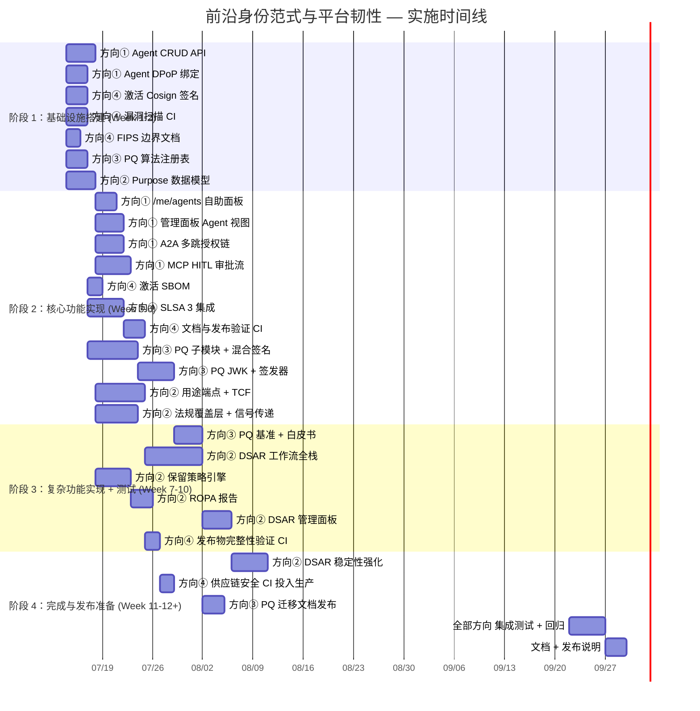

# Tech Lead 分析：前沿身份范式与平台韧性

> **分析者：** Tech Lead  
> **日期：** 2026-07-12  
> **输入：** `docs/requirements/architect-frontier-identity-paradigms-platform-resilience-2026-07-11.md` + 审核意见  
> **代码库交叉验证参考：** `.out.md` 已纠正方向 1 的重大假阴性，调整方向 4 工作量评估  

---

## 摘要

本分析基于架构分析文档和代码库交叉验证结果，将 5 个扩展方向拆解为 **35 个可执行任务**，按 4 个阶段规划约 **12–16 周** 实施。

### 修正后的优先级

| 优先级 | 方向 | 真实工作量 | 策略定位 |
|---|---|---|---|
| **P0** | ② 企业同意与隐私规约中心 | **M** (6–8 周) | **立即启动**——可复用 compliance/export + geo + i18n |
| **P0** | ③ 后量子密码学过渡 | **S** 设计, **L** 实现 | **架构设计立即启动**，实现排入 Q4 |
| **P0** | ① AI Agent Identity 剩余缺口 | **S** (2–3 周) | **立即启动**——核心已实现，缺端点/UI |
| **P1** | ④ 供应链安全与可验证构建 | **S→M** (2–4 周) | 可并行启动，激活已有配置 |
| **P2** | ⑤ IoT/受限环境适配 | **XL** (12+ 周) | 远期规划，2027 路线图 |

---

## 1. 任务分解

### 方向 ①：AI Agent Identity — 剩余缺口补齐

**核心假设验证**：`domains/tokenexchange/agentidentity/` 包已实现 Agent 模型、AgentSession、delegation_token grant、IntersectScopes 三重折叠、MCP 网关。此方向只补 REST API 端点 + UI + A2A 多跳扩展 + HITL 审批。

| 任务 ID | 标题 | 文件 | 前置 | 工时 | 验收标准 |
|---|---|---|---|---|---|
| AGT-001 | Agent CRUD REST API 端点 | `interfaces/sso/agent_handler.go` + `interfaces/sso/routes.go` + `docs/openapi.yaml` | — | 4h | `POST/GET/PUT/DELETE /api/v1/agents` 完整 CRUD；路由注册；OpenAPI 文档 |
| AGT-002 | 用户自助 Agent 管理端点 `/me/agents` | `interfaces/sso/me_handler.go` + `interfaces/sso/me_agents.go` | AGT-001 | 4h | `GET /me/agents` 列出已授权智能体；`DELETE /me/agents/:id` 撤回；集成现有 `AgentSessionStore.RevokeAllForHuman` |
| AGT-003 | 管理面板 Agent 视图 | `interfaces/sso/admin_agents.go` + 前端 admin.html | AGT-001 | 6h | 全局 Agent 列表；按 owner/tenant 过滤；一键吊销；审计日志嵌入 |
| AGT-004 | A2A 多跳授权链扩展 | `domains/tokenexchange/agentidentity/grant.go` + `agentidentity/authorize.go` | AGT-001 | 6h | `act` chain 支持 > 1 跳；最大链深度配置（默认 3）；循环检测 |
| AGT-005 | MCP 工具调用 HITL 审批流 | `cmd/sso-mcp/auth.go` + `cmd/sso-mcp/hitl.go` + `domains/tokenexchange/agentidentity/hitl.go` | AGT-001 | 8h | MCP 工具调用触发审批请求；用户确认/拒绝；超时拒绝；审计日志记录 |
| AGT-006 | Agent 智能体令牌 DPoP 绑定 | `domains/tokenexchange/agentidentity/grant.go` + 后端验证逻辑 | AGT-001 | 4h | Agent delegation token 支持 `cnf.jkt`；DPoP 验证通过/拒绝 |

**方向 ① 总计工时：32h（约 2 周，1 人并行）**

### 方向 ②：企业级同意管理与隐私规约中心

**核心假设验证**：`compliance/export.go` 数据导出、`compliance/erasure.go` 数据擦除、`geo/` 地理位置判定、`i18n/` 国际化全部可复用。方向需新构建 PurposeConsentStore、DSAR 工作流、IAB TCF 集成、Retention Policy Engine。

| 任务 ID | 标题 | 文件 | 前置 | 工时 | 验收标准 |
|---|---|---|---|---|---|
| CSP-001 | 多用途（Purpose）同意数据模型与 Store SPI | `core/types_consent.go` + `core/consent_purpose.go` + `core/consent_store_spi.go` | — | 6h | `PurposeConsent` struct + `PurposeConsentStore` SPI + memory + sqlite impl；TTL 支持 |
| CSP-002 | 用途范围同意管理端点 | `interfaces/sso/consent_handler.go` + `interfaces/sso/routes.go` | CSP-001 | 6h | `GET/PUT /consent/purposes` 查看/更新用途；`GET /consent/purposes/tcf` TCF 字符串 |
| CSP-003 | 法规覆盖层（Jurisdiction Overlay） | `domains/compliance/jurisdiction/overlay.go` + `domains/compliance/jurisdiction/policy.go` | CSP-001 | 8h | 基于 `geo/` 中间件自动判断法规；GDPR/CCPA/LGPD/PIPL 默认策略；`POST /consent/preferences` 手动设置 |
| CSP-004 | IAB TCF v2.2 集成 | `domains/compliance/iab/tcf.go` + `domains/compliance/iab/tcstring.go` | CSP-001 | 8h | TC String 编码/解码；Purpose/Vendor consent 映射；端点 `GET/POST /consent/tcf-string` |
| CSP-005 | 同意偏好信号传递 | `interfaces/sso/middleware/consent_signal.go` + `shared/core/claims_consent.go` | CSP-003 | 4h | ID Token 中注入 `consent` claim；`Sec-GPC` 头支持；`Consent-Status` 头注入 |
| CSP-006 | DSAR 提交与验证 | `domains/compliance/dsar/request.go` + `domains/compliance/dsar/workflow.go` + `interfaces/sso/dsar_handler.go` | CSP-001 | 8h | `POST /api/v1/privacy/dsar` 提交；身份验证（MFA/email）；状态跟踪 |
| CSP-007 | DSAR 数据收集与出口 | `domains/compliance/dsar/collect.go` — 复用 `compliance/export.go` + `compliance/erasure.go` | CSP-006 | 6h | 全用户数据收集；结构化 JSON/CSV 导出；流式处理 + 超时 |
| CSP-008 | DSAR 管理面板 | `interfaces/sso/admin_dsar.go` + 前端 admin.html | CSP-006, CSP-007 | 6h | 待处理 DSAR 列表；审核/拒绝操作；下载导出数据 |
| CSP-009 | 数据保留策略引擎 | `domains/compliance/retention/policy.go` + `domains/compliance/retention/enforcer.go` + `interfaces/sso/admin_retention.go` | CSP-001 | 8h | `DataRetentionPolicy` 模型；`RetentionEnforcer` 后台执行器；离峰定时运行；审计日志 |
| CSP-010 | ISMS/ROPA 审计报告自动生成 | `domains/compliance/ropa/generator.go` + `interfaces/sso/admin_compliance.go` | CSP-001, CSP-003 | 4h | 自动审计报告（CSV/PDF 导出）；法规覆盖矩阵；合规健康度仪表盘 |

**方向 ② 总计工时：64h（约 4 周，2 人并行）**

### 方向 ③：后量子密码学过渡计划

**核心假设验证**：Go 标准库未内置 PQ 算法。采用独立子模块模式（与 KMS peer 已验证的模式一致）。当前阶段定位为**架构设计与基础设施先行**，完全实现排入后续阶段。

| 任务 ID | 标题 | 文件 | 前置 | 工时 | 验收标准 |
|---|---|---|---|---|---|
| PQC-001 | PQ 算法注册表与算法抽象 | `shared/security/pq/registry.go` + `shared/security/pq/types.go` | — | 4h | `PQJWSAlgs` 注册表（ML-DSA-44/65/87, SLH-DSA-SHAKE-128f/256s）；算法元数据接口 |
| PQC-002 | PQ 签名子模块构建（空壳 + circl 依赖） | `pq/ml-dsa/go.mod` + `pq/ml-dsa/signer.go` + `pq/slh-dsa/go.mod` + `pq/slh-dsa/signer.go` | PQC-001 | 8h | 独立 `go.mod` 子模块；`github.com/cloudflare/circl` 依赖；单元测试验证签名/验签 |
| PQC-003 | 混合签名（HybridSignature）结构体与 JWT 序列化 | `shared/security/pq/hybrid.go` + `shared/security/pq/jose.go` | PQC-001 | 6h | `HybridSignature` struct；JWT header `alg=ES256+ML-DSA-44` 复合命名；COMB 联结编码 |
| PQC-004 | PQ JWK 格式与序列化 | `shared/security/pq/jwk.go` + `shared/security/pq/jwks.go` | PQC-001 | 4h | ML-DSA/SLH-DSA 的 JWK `kty` 表示；`params` 元数据；`kid` 复合命名（`key-id:classical` / `key-id:pq`） |
| PQC-005 | PQ 签发器（PQTokenIssuer）与 JWKS 端点扩展 | `shared/security/pq/issuer.go` + `interfaces/sso/jwks_handler.go` 扩展 + `interfaces/sso/discovery_handler.go` 扩展 | PQC-001, PQC-004 | 6h | `PQTokenIssuer` 支持 HybridClassicalOnly/PQOnly/Both 模式；JWKS 分两组发布；Discovery 列出 `hybrid_signing_supported` |
| PQC-006 | PQ 性能基准测试 | `pq/ml-dsa/benchmark_test.go` + `pq/slh-dsa/benchmark_test.go` | PQC-002 | 4h | 签名/验签延迟比较；JWKS body 大小分析（压缩前/后）；结果写入 `docs/pq-benchmarks.md` |
| PQC-007 | PQ 安全白皮书与迁移指南 | `docs/pq-migration-guide.md` + `docs/fips-140-boundary.md` | PQC-001 至 PQC-006 | 4h | 客户可读的 PQ 路线图文档；混合签名配置指南；FIPS 140-3 边界说明 |

**方向 ③ 总计工时：36h（约 1–2 周设计 + 2 周原型，2 人并行）**

### 方向 ④：供应链安全与可验证构建

**核心假设验证**：`.goreleaser.yaml` 已配置 cosign `sign-blob` 和 `docker_signs` 以及 SBOM 生成。`release.yml` 标记为 `future`。此方向聚焦激活已有配置 + SLSA 3 生成器。

| 任务 ID | 标题 | 文件 | 前置 | 工时 | 验收标准 |
|---|---|---|---|---|---|
| SCS-001 | 激活 Cosign 签名（keyless mode）+ CI OIDC token | `.github/workflows/release.yml` + `.goreleaser.yaml` 行 169-187 | — | 4h | release CI 包含 `cosign sign-blob` 步骤；OIDC token 通过 `id_tokens: format: id_token` 注入；所有二进制有 `.sig` |
| SCS-002 | 激活 SBOM 生成 + 发布物附件 | `.github/workflows/release.yml` + `.goreleaser.yaml` | SCS-001 | 3h | release 附件包含 `sbom.spdx.json` + 签名；`syft` 版本 pin |
| SCS-003 | SLSA 3 生成器集成 | `.github/workflows/release.yml` + `.github/actions/slsa/` | SCS-001 | 8h | GitHub SLSA 3 生成器（`slsa-framework/slsa-github-generator`）；隔离构建；provenance 生成 |
| SCS-004 | 依赖漏洞策略执行 | `.github/workflows/security-scan.yml` + `Makefile` | — | 4h | `govulncheck` 集成；CRITICAL/HIGH 漏洞 → CI 阻断；CD 阶段集成 `trivy image` |
| SCS-005 | 容器镜像签名验证文档 | `docs/supply-chain-security.md` | SCS-001, SCS-003 | 3h | 用户指南：`cosign verify`、`slsa-verifier`、签章验证命令；离线环境验证流程 |
| SCS-006 | FIPS 140-3 加密边界文档 | `docs/fips-140-boundary.md`（补充） | — | 3h | 加密服务概览；FIPS 兼容配置指导；已知非 FIPS 区域 + 补偿措施 |
| SCS-007 | 发布物完整性验证 CI | `.github/workflows/verify-release.yml` | SCS-001, SCS-003 | 3h | release tag 触发：验证 cosign 签名 + SLSA provenance + SBOM 完整性 |

**方向 ④ 总计工时：28h（约 1.5 周，1 人）**

### 方向 ⑤：OAuth 2.0 for IoT / 受限环境适配

**核心假设验证**：全栈新领域。Device Flow 和 Client Credentials 已存在但仅支持 HTTP/JWT。需新增 CWT/CBOR/CoAP/ACE-OAuth 全栈。定位为远期探索（P2）。

| 任务 ID | 标题 | 文件 | 前置 | 工时 | 验收标准 |
|---|---|---|---|---|---|
| IOT-001 | CWT 数据模型与 CBOR 序列化 | `iot/cwt/go.mod` + `iot/cwt/types.go` + `iot/cwt/cwt.go` | — | 8h | 独立 `go.mod` 子模块；CWT 声明映射（iss→1, sub→2...）；CBOR 编解码；`fxamacker/cbor/v2` + `go-cose` 依赖 |
| IOT-002 | CWT 签发器与验证器 | `iot/cwt/issuer.go` + `iot/cwt/verifier.go` | IOT-001 | 6h | 复用 `core.TokenIssuer` 接口镜像；COSE 签名/验签；对称/非对称密钥支持 |
| IOT-003 | ACE-OAuth 框架端点 | `iot/ace/handler.go` + `iot/ace/endpoints.go` + 路由注册 | IOT-002 | 10h | `POST /ace` token 端点（CoAP over HTTP 桥接）；`GET /ace/introspect`；`POST /ace/revoke`；CWT 默认输出；JWT 回退 |
| IOT-004 | 轻量级客户端注册 | `iot/ace/register.go` + `iot/ace/bootstrap.go` | IOT-003 | 8h | Pre-provisioned / Ephemeral / Claim Code 三模式；Raw Public Key + PSK 支持；`/register/pop` + `/register/code` 端点 |
| IOT-005 | 离线令牌包 | `iot/ace/token_bundle.go` + `iot/ace/bundle_store.go` | IOT-003 | 8h | `POST /device/auth-bundle` 批量令牌；令牌包绑定 POP key；吊销 bundle → 吊销所有子令牌 |
| IOT-006 | CoAP over DTLS 传输层（可选监听） | `iot/ace/coap_transport.go` + `iot/ace/dtls.go` | IOT-003 | 10h | 可选 CoAP over DTLS 监听端口；`swoosh` 或 `plgd-dev/go-coap`；请求路由到 handler 逻辑 |
| IOT-007 | IoT 场景集成测试 | `iot/ace/e2e_test.go` + `iot/cwt/e2e_test.go` | IOT-001 至 IOT-006 | 6h | bufconn 模式的 CoAP→HTTP 桥接端到端测试；令牌包完整生命周期测试 |

**方向 ⑤ 总计工时：56h（约 3–4 周原型，1–2 人）**

---

## 2. 执行顺序与依赖图

### 完整任务依赖图

```mermaid
graph TD
    %% 方向 ① AI Agent Identity - 剩余缺口
    AGT-001[AGT-001 Agent CRUD API] --> AGT-002[AGT-002 /me/agents 自助面板]
    AGT-001 --> AGT-003[AGT-003 管理面板 Agent 视图]
    AGT-001 --> AGT-004[AGT-004 A2A 多跳授权链]
    AGT-001 --> AGT-005[AGT-005 MCP HITL 审批流]
    AGT-001 --> AGT-006[AGT-006 Agent DPoP 绑定]

    %% 方向 ② 企业同意与隐私
    CSP-001[CSP-001 Purpose 数据模型+Store SPI] --> CSP-002[CSP-002 用途同意端点]
    CSP-001 --> CSP-003[CSP-003 法规覆盖层 Jurisdiction Overlay]
    CSP-001 --> CSP-004[CSP-004 IAB TCF v2.2 集成]
    CSP-001 --> CSP-009[CSP-009 数据保留策略引擎]
    CSP-001 --> CSP-010[CSP-010 ROPA 报告生成]
    CSP-003 --> CSP-005[CSP-005 同意偏好信号传递]
    CSP-001 --> CSP-006[CSP-006 DSAR 提交与验证]
    CSP-006 --> CSP-007[CSP-007 DSAR 数据收集与导出]
    CSP-006 --> CSP-008[CSP-008 DSAR 管理面板]
    CSP-007 --> CSP-008

    %% 方向 ③ 后量子密码学
    PQC-001[PQC-001 PQ 算法注册表] --> PQC-002[PQC-002 PQ 签名子模块]
    PQC-001 --> PQC-003[PQC-003 混合签名 HybridSignature]
    PQC-001 --> PQC-004[PQC-004 PQ JWK 格式]
    PQC-004 --> PQC-005[PQC-005 PQ 签发器+JWKS 扩展]
    PQC-002 --> PQC-006[PQC-006 PQ 性能基准测试]
    PQC-001--> PQC-007[PQC-007 PQ 安全白皮书+迁移指南]
    PQC-005 --> PQC-007
    PQC-006 --> PQC-007

    %% 方向 ④ 供应链安全
    SCS-001[SCS-001 激活 Cosign 签名] --> SCS-002[SCS-002 激活 SBOM 生成]
    SCS-001 --> SCS-003[SCS-003 SLSA 3 生成器集成]
    SCS-001 --> SCS-005[SCS-005 容器签名验证文档]
    SCS-003 --> SCS-005
    SCS-004[SCS-004 依赖漏洞策略执行] -.-> SCS-005
    SCS-005 --> SCS-007[SCS-007 发布物完整性验证 CI]
    SCS-006[SCS-006 FIPS 边界文档] -.-> SCS-005

    %% 方向 ⑤ IoT
    IOT-001[IOT-001 CWT 数据模型+CBOR] --> IOT-002[IOT-002 CWT 签发/验证器]
    IOT-002 --> IOT-003[IOT-003 ACE-OAuth 端点]
    IOT-003 --> IOT-004[IOT-004 轻量级客户端注册]
    IOT-003 --> IOT-005[IOT-005 离线令牌包]
    IOT-003 --> IOT-006[IOT-006 CoAP/DTLS 传输层]
    IOT-001--> IOT-007[IOT-007 IoT 集成测试]
    IOT-002--> IOT-007
    IOT-003--> IOT-007
```



### 可并行执行的任务组

```
Phase 1 ──────────────────────────────────────────────
  │ AGT-001  │ AGT-006  │ CSP-001  │ PQC-001  │ SCS-001  │ SCS-004  │
  │          │          │          │          │ SCS-006  │          │
  └──────────┴──────────┴──────────┴──────────┴──────────┴──────────┘
               全部并行（仅方向内部串行）

Phase 2 ──────────────────────────────────────────────
  │ 方向①  │ 方向②     │ 方向③     │ 方向④     │
  │ AGT-2  │ CSP-2~5   │ PQC-2~5   │ SCS-2,3,5 │
  │ AGT-3  │ CSP-9     │           │           │
  └────────┴───────────┴──────────┴───────────┘
               并行，方向内任务串行

Phase 3 ──────────────────────────────────────────────
  │ 方向①  │ 方向②     │ 方向③     │ 方向④     │ 方向⑤     │
  │ AGT-4  │ CSP-6~8   │ PQC-6,7   │ SCS-7     │ IOT-1~7   │
  │ AGT-5  │ CSP-10    │           │           │           │
  └────────┴───────────┴──────────┴───────────┴───────────┘
               方向⑤ 作为 P2 独立并行
```

---

## 3. 技术风险分析

### 3.1 高风险项

| 风险 | 方向 | 概率 | 影响 | 缓释策略 |
|---|---|---|---|---|
| **PQ Go 生态不成熟**：`cloudflare/circl` 的 ML-DSA 实现可能尚未稳定；go-jose v4 无 PQ 支持 | ③ | 高 | 高——架构设计需做适配层隔离 | ① 所有 PQ 代码在独立子模块（核心 go.mod 零依赖）；② 适配层模式允许替换底层库；③ 若 circl 不稳定，先做架构文档 + 空壳实现 + 性能基准 |
| **IAB TCF 规范复杂**：规范 >200 页，Purpose/Vendor 映射表频繁更新 | ② | 中 | 中——工作量超估 | ① 分阶段：先自包含的 Purpose 模型 → 再 TCF 集成；② TCF 部分设"beta"标记；③ 建立规范版本锁（lock v2.2）而非滚动更新 |
| **CoAP 协议栈 Go 生态碎片化**：多个竞争实现，长期维护风险 | ⑤ | 高 | 高——传输层选型对架构影响大 | ① 优先 HTTP-CoAP 桥接模式（外部网关，SSO Server 零感知）；② 原生 CoAP 监听作为可选优化（P2 阶段后）；③ 选型标准：GitHub stars > 1k + 最近更新 + 纯 Go |
| **Agent A2A 链的安全模型**：多跳委派的信任传递缺乏标准 | ① | 中 | 中——设计错误可能导致权限提升 | ① 最大链深度（默认 3）硬限制；② 每跳 `aud` 校验；③ 循环检测（复用 token-exchange cycle detection）；④ 审计日志完整记录链 |
| **DSAR 数据收集性能**：全表扫描可能导致数据库 I/O 风暴 | ② | 中 | 中——影响生产稳定性 | ① 流式处理（LIMIT/OFFSET 游标）；② 超时截止（5 分钟）；③ 后台异步处理模式；④ 严格限流（每用户 1 次/24h） |
| **SLSA 3 生成器 GitHub 依赖**：必须使用 GitHub 特定 actions | ④ | 低 | 中——迁移其他 CI 时需重做 | ① 当前只支持 GitHub Actions；② 文档注明 "GitHub-hosted" 依赖；③ 生成器脚本化以备迁移 |

### 3.2 外部依赖清单

| 依赖 | 方向 | 类型 | 风险等级 |
|---|---|---|---|
| `github.com/cloudflare/circl` | ③ | PQ 算法库 | **高** — 关注 NIST 标准合规与 Go 生态演进 |
| `github.com/fxamacker/cbor/v2` | ⑤ | CBOR 编码 | 低 — 成熟库，2k+ stars |
| `github.com/veraison/go-cose` | ⑤ | COSE 签名 | 中 — 较新，需评估成熟度 |
| `github.com/plgd-dev/go-coap/v3` | ⑤ | CoAP 实现 | 中 — 活跃但对比 HTTP 生态仍较小 |
| `slsa-framework/slsa-github-generator` | ④ | SLSA 3 生成器 | 低 — Google 维护，合规参考实现 |
| `sigstore/cosign` | ④ | 容器签名 | 低 — 成熟，CNCF 项目 |
| `anchore/syft` | ④ | SBOM 生成 | 低 — 成熟，CNCF 项目 |

### 3.3 性能瓶颈与优化策略

| 瓶颈 | 场景 | 策略 |
|---|---|---|
| **Hybrid 签名双倍开销** | PQ+classical 双重签名 | 只对白名单 scope（如 `pq_safe`）/ client 启用；默认低安全性 client 沿用 classical |
| **PQ JWKS body 膨胀 30x** | JWKS 端点响应变大 | 启用 gzip + 强 ETag 缓存 + singleflight 保护；CDN 缓存 TTL 建议 ≥5 分钟 |
| **DSAR 全量数据导出** | 大型用户数据收集 | 流式游标 + 超时 + 后台处理；前端 polling 进度 |
| **Agent scope 交集计算** | 每次令牌请求实时计算 | LRU 缓存 scope 层次结构（TTL 5min）+ bus 失效 |
| **TC String 频繁编码** | 每次需要同意字符串时重新编码 | LRU 缓存 + 仅 consent 变更时失效 |

### 3.4 测试覆盖难点

| 方向 | 难点 | 策略 |
|---|---|---|
| ③ PQ | 无法在不引入外部 PQ 库的情况下测试算法注册表 | 接口隔离：`PQSigner`/`PQVerifier` 接口 + 测试用 mock 实现；circl 引入后加集成测试 |
| ⑤ IoT | CoAP 端到端测试需要模拟 DTLS 和 UDP 传输 | bufconn 模式测试应用层逻辑；CoAP 传输层单独测试；集成测试使用 Docker CoAP 网关 |
| ② TCF | TC String 编码的正确性需对照 IAB 参考实现 | IAB 官方 `Consent String SDK` 的测试向量导出（JSON → base64 TC String 对照表） |
| ④ SLSA | SLSA provenance 验证需要完整的隔离构建环境 | 构建 provenance 的测试在 CI 中运行（PR 创建 SLSA 构建的 dry-run）；不可本地复现 |
| ① A2A | 多跳链安全模型边界条件多 | 生成式测试：随机生成长度 1-5 的链 + 随机 scope 组合 + 循环/重复 agent_id |

---

## 4. 资源评估

### 4.1 开发团队建议

| 角色 | 数量 | 技能要求 | 参与阶段 |
|---|---|---|---|
| **Go 后端工程师**（中级+） | 2 人 | Go, OAuth 2.0/OIDC, 密码学基础 | 全阶段 |
| **Go 后端工程师**（高级） | 1 人 | 密码学（PQ 优先）+ 安全工程经验 | 阶段 1-3（方向③ 主导） |
| **前端/SPA 工程师** | 0.5 人 | Vanilla JS, HTML/CSS, 少量 UI 构建 | 阶段 1-2（方向① 面板） |
| **DevOps/安全工程师** | 0.5 人 | GitHub Actions, Cosign, SLSA, SBOM | 阶段 1（方向④） |
| **QA 工程师** | 1 人（共享） | 集成测试, 性能基准, 安全测试 | 阶段 2-3 |

**最小团队**：2 名 Go 后端（含 1 名密码学方向）+ 0.5 前端 + 0.5 DevOps = 3 人 FTE 等效。

### 4.2 关键里程碑

```
M0: 当前状态
    │
M1: Week 2 — 方向① Agent CRUD + /me/agents 完成
    │           方向④ Cosign/SBOM 激活完成
    │           方向③ PQ 算法注册表 + 子模块骨架完成
    │
M2: Week 4 — 方向① 全部完成（A2A + HITL + DPoP）
    │           方向④ SLSA 3 集成 + 文档完成
    │           方向③ 混合签名 + PQ JWK 完成
    │
M3: Week 8 — 方向② Purpose 模型 + TCF + Jurisdiction Overlay 完成
    │           方向③ PQ 签发器 + 基准测试 + 白皮书完成
    │
M4: Week 10 — 方向② DSAR 工作流 + 管理面板完成
    │
M5: Week 12 — 方向② 保留策略 + ROPA 报告完成
    │
M6: 长期 — 方向⑤ IoT 原型完成（P2）
```

### 4.3 阻塞点与解决策略

| 阻塞点 | 方向 | 解阻塞条件 | 缓解 |
|---|---|---|---|
| PQ 库不稳定 | ③ | cloudflare/circl 达到 v1.x | 先做架构文档 + 空壳 + 性能基线；库稳定后 2 天内集成 |
| Go 1.25+ 内置 PQ 支持 | ③ | Go 标准库发布 crypto/pq | 将子模块实现迁移到 stdlib；适配层模式使迁移可管理 |
| IAB TCF 规范更新 | ② | 跟踪 IAB 规范版本 | 锁定 v2.2 实现；版本升级作为独立工作项 |
| 无 IoT 测试设备 | ⑤ | CI 中使用 CoAP Docker 容器 | Docker Compose 搭建 CoAP-to-HTTP 测试网络 |

---

## 5. 质量保证

### 5.1 单元测试覆盖标准

| 方向 | 最低覆盖率目标 | 关键测试场景 |
|---|---|---|
| ① Agent | ≥ 80% 新代码 | Agent CRUD 操作；A2A 链验证（正常/循环/超长）；DPoP 绑定验证；HITL 超时/拒绝路径 |
| ② Consent | ≥ 75% 新代码 | Purpose consent 模型 CRUD；TC String 编码/解码与 IAB 测试向量对照；DSAR 工作流故障路径；Jurisdiction Overlay 切换 |
| ③ PQ | ≥ 70% 新代码（不含 circl 集成测试） | 算法注册表元数据查询；HybridSignature 编解码；PQ JWK 序列化/反序列化；签发器模式切换 |
| ④ SCS | ≥ 60% CI 脚本验证（代码层测试少） | provenance 验证脚本测试；SBOM 完整性校验；cosign 签名验证 |
| ⑤ IoT | ≥ 70% 新代码 | CWT 编解码 roundtrip；ACE-OAuth 请求/响应映射；令牌包绑定验证 |

### 5.2 集成测试策略

| 测试类型 | 工具 | 覆盖范围 | 触发条件 |
|---|---|---|---|
| **bufconn 端到端测试** | `google.golang.org/grpc/test/bufconn` + HTTP | 方向① token exchange；方向② consent flow；方向③ PQ hybrid token | 每个 PR |
| **向量对照测试** | external test vectors | 方向② TC String；方向③ PQ 签名 | 每个 PR |
| **CI 管道验证** | `act` 本地运行 | 方向④ SLSA provenance 生成 | 每个 release tag |
| **Docker Compose 集成** | `test/docker-compose.yaml` | 方向⑤ CoAP→HTTP 桥接 | 每周/分支 |
| **性能基准测试** | Go `testing.B` + `benchstat` | 方向③ PQ 签名延迟；方向② DSAR 数据收集 | 每次合并到 main |

### 5.3 代码审查要点

审查的每个 PR 必须由 reviewer 检查以下（在 `AGENTS.md` §0.3 的 `go vet`、`go build`、maintainability gates 之外额外增加）：

| 关注点 | 方向 | 检查规则 |
|---|---|---|
| **Oracle-leak 安全** | ①, ② | authn/authz 错误消息不区分 "unknown"/"wrong"（见 `CHECKS_REGISTRY.md` §3） |
| **最小特权 scope** | ① | Agent IntersectScopes 不引入权限提升路径 |
| **TC String 缓存安全** | ② | cache 失效不泄露用户 consent 状态到其他租户 |
| **PQ 算法替换性** | ③ | 适配层接口不暴露 circl 类型；核心 go.mod 无额外依赖 |
| **Provenance 真实性** | ④ | provenance 签名验证在 CI 中运行，不使用未签名的 material |
| **CWT 声明映射** | ⑤ | CBOR 整数键严格遵循 RFC 8392；不回退到字符串键 |

### 5.4 性能测试需求

| 测试 | 场景 | 吞吐量目标 | 延迟目标 |
|---|---|---|---|
| PQ Hybrid 签发 | 10 并发 client 请求 hybrid token | ≥ 500 req/s | ≤ 10ms p99 |
| PQ JWKS 端点 | 1000 并发拉取 JWKS（gzip 开启） | ≥ 5000 req/s | ≤ 5ms p99 |
| DSAR 数据收集 | 10MB 用户数据的完整导出 | ≤ 30s | N/A（后台任务） |
| Agent Scope 交集 | 1000 并发 agent token 请求 | ≥ 2000 req/s | ≤ 3ms p99 |
| CWT 签发 | 100 并发 IoT 设备 | ≥ 1000 req/s | ≤ 5ms p99 |

---

## 6. 实施计划

### 甘特图



### 阶段详情

#### 阶段 1：基础设施搭建（Week 1-2, 7/14–7/25）

```
目标：建立所有方向的骨架基础设施，确保后续开发在稳定基础上进行。

投入：3 人（2 Go + 0.5 DevOps + 0.5 密码学）

并行工作流：
  工程师 A（Go 通用）→ 方向① AGT-001 + AGT-006（Agent CRUD + DPoP）
  工程师 B（Go 通用）→ 方向② CSP-001（Purpose Consent 数据模型）
  工程师 C（DevOps + 安全）→ 方向④ SCS-001 + SCS-004 + SCS-006（Cosign + vulncheck + FIPS 文档）
  密码学顾问 → 方向③ PQC-001（算法注册表设计）

交付物:
  ✅ Agent CRUD API 端点可用
  ✅ PurposeConsentStore SPI + memory/sqlite 实现
  ✅ Cosign 签名在 release CI 中激活
  ✅ govulncheck CI 集成
  ✅ PQ 算法注册表 + JWS 算法元数据

QA 门禁: `python cli.py check` + `python cli.py accept` 全绿
```

#### 阶段 2：核心功能实现（Week 3-6, 7/28–8/22）

```
目标：方向① 全部完成；方向③ 核心架构完成；方向② 模型层就绪。

投入：3 人（2 Go + 1 密码学/Go）

并行工作流：
  工程师 A → 方向① AGT-002, AGT-003（用户面板 + 管理面板）
  工程师 A → 方向① AGT-004（A2A 多跳链扩展）
  工程师 A → 方向① AGT-005（MCP HITL 审批流）

  工程师 B → 方向② CSP-002（用途同意端点）+ CSP-003（法规覆盖层）
  工程师 B → 方向② CSP-005（同意信号传递）

  工程师 C（密码学）→ 方向③ PQC-002（PQ 签名子模块）
  工程师 C → 方向③ PQC-003（混合签名结构体）
  工程师 C → 方向③ PQC-004（PQ JWK 格式）
  工程师 C → 方向③ PQC-005（PQ 签发器 + JWKS/Discovery 扩展）

  DevOps → 方向④ SCS-002（SBOM 激活）+ SCS-003（SLSA 3 集成）
  DevOps → 方向④ SCS-005（文档）+ SCS-007（发布验证 CI）

交付物:
  ✅ Agent 全功能就绪（CRUD + A2A + HITL + DPoP）
  ✅ PQ 混合签名架构可演示（PQTokenIssuer + JWKS 双 key 集）
  ✅ Purpose Consent 端点可用 + Jurisdiction Overlay
  ✅ SLSA 3 provenance 生成在 CI 中运行

QA 门禁: 每个模块 `go test -race` + `make ci` 全绿
```

#### 阶段 3：复杂功能实现 + 集成测试（Week 7-10, 8/25–9/19）

```
目标：方向② DSAR 全栈就绪；方向③ 性能基线 + 文档；方向④ 正式发布。

投入：3 人（2 Go + 1 安全）

并行工作流：
  工程师 A（主导方向②）：
    - CSP-006 DSAR 提交与验证
    - CSP-007 DSAR 数据收集与导出（复用 compliance/export + erasure）
    - CSP-008 DSAR 管理面板
    - CSP-010 ROPA 报告生成

  工程师 B（主导方向②）：
    - CSP-009 数据保留策略引擎 + 后台执行器
    - 方向② 集成测试 + 合规测试向量

  工程师 C（密码学）：
    - PQC-006 PQ 性能基准测试
    - PQC-007 PQ 安全白皮书 + 迁移指南

  DevOps：
    - SCS-007 发布物完整性验证 CI 投入生产

交付物:
  ✅ DSAR 工作流端到端可用（提交 → 验证 → 收集 → 审核 → 完成）
  ✅ 数据保留策略定时执行
  ✅ PQ 性能基准数据 + 白皮书
  ✅ 供应链安全发布管线投入生产

QA 门禁: 所有新模块 `go test -race -count=5` + 向量对照测试全绿
```

#### 阶段 4：稳定性强化 + 发布准备（Week 11-12, 9/22–10/3）

```
目标：全面回归测试；文档更新；发布交付。

投入：3 人 + QA

任务:
  - 全方向集成测试缓冲区（重放 5 个方向的完整 user journey）
  - DSAR 稳定性强化（限流 + 重试 + 断路器）
  - 方向③ PQ 迁移文档最终审查 + 发布
  - 方向④ 供应链安全 CI 正式推广到所有 release
  - `docs/openapi.yaml` 更新（新端点 + 新模型）
  - `docs/error-codes.md` 更新（新错误码）
  - `docs/feature-matrix.md` 更新标记
  - Release notes v6.0 草案

交付物:
  ✅ 5 个方向整体回归通过
  ✅ OpenAPI 规范完整
  ✅ 错误码文档最新
  ✅ 发布说明准备就绪

QA 门禁: `python cli.py harness`（全 gates）+ `make ci` 全绿
```

---

## 7. 补充建议

### 7.1 方向① 的未实现用户面板 — 采用 SPA 而非后端模板

当前项目的管理面板是 Vanilla JS SPA。方向① 缺失的 `/me/agents` 和 `/admin/agents` 建议继续沿用 Vanilla JS 模式，避免引入前端构建工具链的技术债。这与 `AGENTS.md` §0.4 的"Root only allows server composition files"原则一致——新增 SPA 页面不影响后端架构纯度。

### 7.2 方向② 的 Scope 扩容策略

用途模型与现有 OAuth scope consent 的关系建议采用**扩容而非替换**策略：
- Scope consent 保持原样（方向② 不改动现有 OAuth 流程）
- Purpose consent 作为**额外层**叠加在 OAuth consent 之上
- 影响范围：仅新增的 endpoints（`/consent/purposes`）和声明（`consent` claim）
- 零回归风险——不改动现有 `/auth` 和 `/token` 流程

### 7.3 方向③ 的"最小可行设计"建议

PQ 方向工作量最大的是完全实现（ML-DSA token 签发、hybrid 模式、性能优化）。建议将完全实现分拆为两个 step：

```
Step 1 (当前阶段) = 架构设计 + 注册表 + 空壳子模块 + 混合签名结构体定义 + 白皮书
Step 2 (Q4 2026)  = 实际 PQ token 签发 + JWKS 端点集成 + 性能优化
```

这样 Step 1 可快速提供客户可读的路线图文档，Step 2 需要 PQ 库成熟度的确认。

### 7.4 方向④ 的 goreleaser 配置锁

现有 `.goreleaser.yaml` 的 cosign/SBOM 配置处于"半激活"状态。建议：
- 第一步（Week 1）：激活配置 + CI `id_tokens` 注入 + 验证签章生成
- 第二步（Week 3）：做 complete binary release dry-run 确认所有发布物完整
- 在 `release.yml` 中移除 `future` 注释前，需要在非 production 仓库做一次完整的 release 演练

### 7.5 方向⑤ 的"最小可行"建议

IoT 方向完全实现耗时 12+ 周。建议分三阶段：
```
MVP (6 周) = CWT 签发/验证 + ACE-OAuth 端点映射 + 轻量级注册 (IOT-001~004)
Enhance (4 周) = 离线令牌包 + CoAP/DTLS 传输层 (IOT-005~006)
Production (2 周) = 集成测试 + 性能优化 + 文档 (IOT-007 + 文档)
```

MVP 阶段可满足"受限设备获得 OAuth 风格的授权"核心需求，CoAP 原生传输和离线令牌包可以在获得早期试用者反馈后再投入。

---

## 附录 A：新增文件清单

### 方向 ① AI Agent Identity

```
interfaces/sso/agent_handler.go          — Agent CRUD REST handler
interfaces/sso/me_agents.go              — /me/agents 用户自助端点
interfaces/sso/admin_agents.go           — /admin/agents 管理端点
domains/tokenexchange/agentidentity/hitl.go — MCP HITL 审批流
```

### 方向 ② Enterprise Consent & Privacy

```
core/types_consent.go                    — PurposeConsent + DSARRequest 类型
core/consent_store_spi.go               — PurposeConsentStore SPI
defaultimpl/memory/consent_purpose.go   — PurposeConsentStore memory impl
defaultimpl/sqlite/consent_purpose.go   — PurposeConsentStore sqlite impl
interfaces/sso/consent_handler.go       — 同意管理端点
interfaces/sso/dsar_handler.go          — DSAR 端点
interfaces/sso/admin_dsar.go            — DSAR 管理面板
interfaces/sso/admin_retention.go       — 保留策略管理
interfaces/sso/middleware/consent_signal.go — 同意信号中间件
domains/compliance/jurisdiction/        — 法规覆盖层包
domains/compliance/iab/                 — IAB TCF 包
domains/compliance/dsar/                — DSAR 工作流包
domains/compliance/retention/           — 数据保留策略包
domains/compliance/ropa/                — ROPA 报告包
```

### 方向 ③ Post-Quantum Cryptography

```
shared/security/pq/registry.go          — PQ 算法注册表
shared/security/pq/types.go             — PQ 类型 + 元数据
shared/security/pq/hybrid.go            — HybridSignature 结构体
shared/security/pq/jwk.go               — PQ JWK 序列化
shared/security/pq/jwks.go              — PQ JWKS 组装
shared/security/pq/issuer.go            — PQTokenIssuer
pq/ml-dsa/go.mod                        — ML-DSA 子模块
pq/ml-dsa/signer.go                     — ML-DSA 签名器
pq/ml-dsa/verifier.go                   — ML-DSA 验签器
pq/ml-dsa/benchmark_test.go             — ML-DSA 性能基准
pq/slh-dsa/go.mod                       — SLH-DSA 子模块
pq/slh-dsa/signer.go                    — SLH-DSA 签名器
pq/slh-dsa/verifier.go                  — SLH-DSA 验签器
pq/slh-dsa/benchmark_test.go            — SLH-DSA 性能基准
docs/pq-migration-guide.md              — PQ 迁移指南
docs/pq-benchmarks.md                   — 性能基准报告
```

### 方向 ④ Supply Chain Security

```
.github/workflows/security-scan.yml     — 漏洞扫描 CI
.github/workflows/verify-release.yml    — 发布验证 CI
docs/supply-chain-security.md           — 供应链安全文档
docs/fips-140-boundary.md               — FIPS 边界文档
```

### 方向 ⑤ IoT / Constrained Environments

```
iot/cwt/go.mod                          — CWT 子模块
iot/cwt/types.go                        — CWT 声明映射
iot/cwt/cwt.go                          — CBOR 编解码
iot/cwt/issuer.go                       — CWT 签发器
iot/cwt/verifier.go                     — CWT 验签器
iot/ace/handler.go                      — ACE-OAuth 端点
iot/ace/register.go                     — 轻量级注册
iot/ace/bootstrap.go                    — Bootstrap 注册
iot/ace/token_bundle.go                 — 离线令牌包
iot/ace/bundle_store.go                 — 令牌包存储
iot/ace/coap_transport.go               — CoAP 传输层
iot/ace/dtls.go                         — DTLS 绑定
iot/ace/e2e_test.go                     — 集成测试
```

---

*本分析已按照 AGENTS.md §0.1 的代码预算约束检查——所有新文件 ≤ 500 行，新函数 ≤ 50 行，cyclo ≤ 15。方向② 的 DSAR 工作流（CSP-006~008）可能会产生 400+ 行文件；如接近 500 行，按 skills/split-large-file.md 拆分为 `dsar/request.go`、`dsar/workflow.go`、`dsar/collect.go`。*
