# Tech Lead 分析报告：五个产品级扩展方向——修正版

> **分析者：** Tech Lead Agent  
> **基准：** 原始核验报告（2026-07-11 交叉核验）+ 代码库实地确认  
> **状态：** 对原始核验报告的 4/5 方向确认，1/5 修正后纳入  
> **前置分析：** `docs/architect-analysis-v6-five-directions.md`（后端基础设施） + `docs/feature-spec-architecture-analysis-five-verified-directions.md`（前端/工具链）  
> **方法：** 逐断言 grep 核验 + 工程依赖性推演 + 任务粒度的可执行分解

---

## 目录

1. [方向优先级重评估](#1-方向优先级重评估)
2. [任务分解](#2-任务分解)
3. [执行顺序与并行任务组](#3-执行顺序与并行任务组)
4. [技术风险评估](#4-技术风险评估)
5. [资源评估与里程碑](#5-资源评估与里程碑)
6. [质量保证策略](#6-质量保证策略)
7. [分阶段实施计划](#7-分阶段实施计划)
8. [附录：关键设计草图](#8-附录关键设计草图)

---

## 1. 方向优先级重评估

### 原始优先级（来自交叉核验报告，已修正方向②）

```
P0 │ 方向① 社交登录/CIAM      ← 真实产品缺口，无预构建 provider
P0 │ 方向③ 渐进式档案         ← 真实缺口，属性验证状态机 + 来源追踪
   │
P1 ├ 方向④ 事件导出管道       ← 已有保留框架 + Kafka/MQTT，缺目标平台连接器
P1 ├ 方向⑤ SOC Dashboard      ← SOC2 引擎已存在，缺整合层
   │
P2 └ 方向② Grant 管理 API      ← 修正为"后端已落地，缺 SPA 面板+CAEP 联动"
```

### Tech Lead 调整后优先级

```
P0 │ 方向② Grant 管理 SPA 面板  ← 升级：后端投资已沉没，~200 行前端代码即可兑现
   │ 方向③ 渐进式档案（第一阶段）← 升级：属性验证 SPI + 来源追踪是整个档案演进的基石
   │
P1 ├ 方向④ 事件导出管道（第一阶段：S3/Splunk 连接器）
   ├ 方向⑤ SOC Dashboard（第一阶段：安全时间线 API）
   │
P2 ├ 方向① 社交登录 / CIAM    ← 真实缺口但投入产出比最低，建议第三期启动
   ├ 方向③ 阶段二（策略引擎）   ← 依赖阶段一 SPI 稳定
   ├ 方向④ 阶段二（Schema 注册 + 治理）
   └ 方向⑤ 阶段二（安全评分引擎 + 一键响应）
```

### 调整理由

| 方向 | 调整 | 理由 |
|------|------|------|
| **方向②** | P2→P0 | 原始核验正确指出"零实现"是事实错误。但修正后更关键的是：`ConsentStore` + `RecordConsent` + `ListByUser` + `RevokeConsent` + SQLite/Redis/PostgreSQL/Memory 四套实现 + `/consents/me` API 全部已交付。这是沉没成本最高的方向——**后端已就绪，只差 SPA 面板即可上线可用功能**。 |
| **方向③** | P0→P0（升为两阶段） | 属性验证是整个身份档案的架构核心。第一阶段（属性验证 SPI + 来源追踪 + 元数据模型）是后续策略引擎、合规验证、GDPR 数据可携带性的基石。没有属性验证，档案就无法用于授权决策。 |
| **方向①** | P0→P2 | 社交登录是真实产品缺口，但投入产出比不如其他方向。OIDC Federation SPI 已存在，预构建 provider 主要工作量是各平台（Google/GitHub/Microsoft/Apple）的文档 + 配置样板。建议在**托管登录 UI**（ROADMAP v5 方向①）启动时并行做。 |
| **方向④** | P1→P1（两阶段） | 已有 Kafka/MQTT sink + 数据保留框架（`retention.go`）+ audit export（JSON/CSV）。方向正确，但第一阶段（S3/Splunk 连接器，~5 天）比第二阶段（Schema 注册 + 治理层，~8 天）有更明确的 ROI。 |
| **方向⑤** | P1→P1（两阶段） | SOC2 证据引擎存在，告警规则框架存在，三大构件（Anomaly + ThreatAction + Audit）已就位。第一阶段（安全时间线 API + SPA 面板，~6 天）可快速上线。第二阶段（安全评分引擎 + 一键响应工作流，~10 天）复杂度更高。 |

### 最终优先级矩阵

```
        高 │ 方向② Grant SPA 面板             方向③ 渐进式档案（阶段一）
           │     P0 ─── 后端投资兑现                 P0 ─── 档案基建
           │
   价值    │ 方向④ 事件导出（阶段一）         方向⑤ SOC 时间线（阶段一）
           │     P1 ─── 数据平台连接                P1 ─── 安全可观测性
           │
        低 │ 方向① 社交登录/CIAM              方向③/④/⑤ 阶段二
           │     P2 ─── 第三期启动                 P2 ─── 策略引擎/治理/评分
           │
           └──────────────────────────────────────────────
              低                        高
                    实现复杂度（投入工时）
```

---

## 2. 任务分解

### 2.1 方向②：Grant 管理 SPA 面板（P0，后端投资兑现）

**背景：** 后端 `ConsentStore` + `/consents/me` API + `/admin/users/:id/consents` API + 四个后端实现全部已交付。缺口仅为 SPA 前端"已授权应用"面板 + Grant 生命周期审计全链路 + CAEP 广播联动。

| 任务 ID | 标题 | 涉及文件 | 前置依赖 | 预估工时 | 验收标准 |
|---------|------|---------|---------|---------|---------|
| TASK-020 | Portal SPA "已授权应用"面板 | `interfaces/web/portal/app.js`（扩展），`interfaces/web/portal/index.html` | 无 | 4h | Portal SPA 新增"已授权应用"标签页；调用 `GET /consents/me` 显示应用列表（client_name、图标、授权范围、授权时间）；每行有"撤销授权"按钮 |
| TASK-021 | 撤销授权前端流程 + 确认对话框 | `interfaces/web/portal/app.js` | TASK-020 | 2h | 点击"撤销授权"→ 确认对话框 → `DELETE /consents/me/:client_id` → 成功后刷新列表；失败显示错误提示 |
| TASK-022 | Grant 生命周期审计事件全链路 | `protocols/selfservice/selfserviceaccount/consents.go`（扩展），`shared/core/audit_events.go`（扩展） | 无 | 3h | `RevokeConsent` 触发 `EventConsentRevoked`；`RecordConsent` 触发 `EventConsentGranted`；审计事件包含 `client_id`、`user_id`、`scopes`、`trace_id`；通过 `audit.Query` 可检索 |
| TASK-023 | Grant 到期自动撤销后台 Job | `protocols/selfservice/grant_sweeper.go`（新建），`interfaces/sso/options.go`（扩展） | TASK-022 | 4h | 可配置 `consent.sweep_interval`（默认 24h）；扫描 `ExpiresAt < now()` 的 grant 自动撤销；撤销触发审计事件；prometheus 指标 `sso_consent_auto_revoked_total` |
| TASK-024 | Admin SPA "用户授权管理"面板 | `interfaces/web/admin/app.js`（扩展） | TASK-020 | 2h | Admin SPA 用户详情页新增"授权"标签页；调用 `GET /admin/users/:id/consents` 显示授权列表；管理员可撤销单条授权 |
| TASK-025 | CAEP 广播联动—Grant 撤销时推送事件 | `protocols/caep/transmitter.go`（扩展），`protocols/selfservice/selfserviceaccount/consents.go` | TASK-022 | 4h | grant 撤销时如果客户端有 `caep_receiver_endpoint`，通过 CAEP 推送 `verification` 或 `session_revoked` 事件；fail-open（推送失败记录 audit 但不影响 grant 撤销） |

**方向②总计：** ~19 小时（约 2.5 开发日）

### 2.2 方向③：渐进式档案——阶段一：属性验证基建（P0）

**背景：** `core.User.Attributes` map 已存在但无验证状态机、无来源追踪、无元数据模型。第一阶段聚焦 SPI 定义 + 来源追踪 + 元数据模型，不做策略引擎。

| 任务 ID | 标题 | 涉及文件 | 前置依赖 | 预估工时 | 验收标准 |
|---------|------|---------|---------|---------|---------|
| TASK-030 | `AttributeMeta` 数据模型 + `AttributeStore` SPI | `shared/core/attribute.go`（新建） | 无 | 6h | `AttributeMeta` 包含 `Key`、`Value`、`Source`（user/admin/scim/system）、`VerifiedAt`、`ExpiresAt`、`ConfidenceLevel`；`AttributeStore` 接口：`GetAttributes(ctx, userID) → []AttributeMeta`、`SetAttribute()`、`VerifyAttribute()` |
| TASK-031 | `AttributeVerifier` SPI + 内置实现 | `shared/core/attribute.go`（扩展），`protocols/provisioning/attribute/verifier.go`（新建） | TASK-030 | 4h | `AttributeVerifier` 接口：`Verify(ctx, attrKey, value) → (ok bool, confidenceLevel)`；内置实现：`EmailVerifier`（通过 OTP）、`PhoneVerifier`（通过 SMS OTP）、`NoopVerifier`（直接标记已验证，仅 admin）；`VerificationResult` 包含 `VerifiedAt`、`Method`、`ExpiresAt` |
| TASK-032 | SCIM 属性同步 → `AttributeMeta` 映射 | `domains/scim/scim_attributes.go`（新建），`protocols/scim/...`（扩展） | TASK-030 | 4h | SCIM `urn:ietf:params:scim:schemas:core:2.0:User` 的属性在导入时写入 `AttributeStore`；`Source=scim`；`ConfidenceLevel=medium`；支持 SCIM 属性到 `AttributeMeta` 的映射配置 |
| TASK-033 | 属性来源追踪中间件 | `interfaces/middleware/attribute_provenance.go`（新建），`interfaces/sso/options.go`（扩展） | TASK-030 | 4h | 每当用户档案通过 API（`/admin/users/:id`、`/me/profile`、SCIM）更新时，自动记录 `AttributeMeta.Source`；不允许静默覆写（需要 source 声明）；冲突策略：`admin > scim > user` |
| TASK-034 | 属性置信度传播到授权决策 | `protocols/oauth/token.go`（扩展），`shared/core/claims.go`（扩展） | TASK-031 | 3h | ID Token 可选包含 `verified_claims`（OpenID Connect for Identity Assurance 规范）；`email_verified` claim 从 `AttributeMeta.VerifiedAt` 派生；token 签发时查询 `AttributeStore` |
| TASK-035 | 属性元数据 Audit 事件 | `shared/core/audit_events.go`（扩展），`domains/provisioning/attribute/` | TASK-030 | 2h | `EventAttributeSet`、`EventAttributeVerified`、`EventAttributeExpired` 三类审计事件；包含 `key`、`value`（敏感字段可哈希）、`source`、`trace_id` |

**方向③阶段一总计：** ~23 小时（约 3 开发日）

### 2.3 方向④：事件导出管道——阶段一：目标平台连接器（P1）

**背景：** 审计 Kafka/MQTT sink 已存在，`protocols/compliance/retention.go` 保留框架已存在，audit export（JSON/CSV）已存在。缺口是结构化导出到数据平台 + 租户级隔离。

| 任务 ID | 标题 | 涉及文件 | 前置依赖 | 预估工时 | 验收标准 |
|---------|------|---------|---------|---------|---------|
| TASK-040 | `AuditExporter` SPI 定义 | `protocols/compliance/export.go`（新建） | 无 | 3h | `Exporter` 接口：`Export(ctx, query AuditQuery, format ExportFormat, dest ExportDestination) → (stats ExportStats, err error)`；`ExportFormat` 枚举（JSON/CSV/Parquet/Avro）；`ExportDestination` 接口（`Write(ctx, data io.Reader, metadata) error` + `Close() error`） |
| TASK-041 | S3/GCS `ObjectStoreDestination` 实现 | `protocols/compliance/export_destination_objectstore.go`（新建） | TASK-040 | 4h | 实现 `ExportDestination` 写入 S3（`s3://bucket/key_prefix/{tenant_id}/{date}/audit.parquet`）；GCS 兼容；支持 `sse-s3`/`sse-kms` 加密；分块上传（>5GB 自动分段） |
| TASK-042 | Splunk HEC 目的地实现 | `protocols/compliance/export_destination_splunk.go`（新建），`infrastructure/splunk/`（新建） | TASK-040 | 4h | 实现 `ExportDestination` 通过 HTTP Event Collector（HEC）写入 Splunk；`index` 和 `sourcetype` 可配置；批处理（每批 100 事件/每秒/10MB 先到先发）；采集错误回退到本地缓冲区 |
| TASK-043 | 定时导出调度器 | `protocols/compliance/export_scheduler.go`（新建），`interfaces/sso/options.go`（扩展） | TASK-040 | 4h | `WithScheduledExport(ExportSchedule)` 选项；`ExportSchedule` 包含 `Interval`（每小时/每天）、`Query`、`Format`、`Destination`；背后由 `RunDataRetentionSweep` 机制运行；prometheus 指标 `sso_audit_export_total`、`sso_audit_export_bytes`、`sso_audit_export_errors` |
| TASK-044 | 租户级导出隔离 | `protocols/compliance/export.go`（扩展） | TASK-040 | 3h | 多租户部署时，导出调度器为每个租户创建独立文件（`/tenant_id/{date}/audit.parquet`）；一个租户的导出失败不影响其他租户；租户管理员只可导出自己租户的审计数据 |

**方向④阶段一总计：** ~18 小时（约 2.5 开发日）

### 2.4 方向⑤：SOC Dashboard——阶段一：统一安全时间线（P1）

**背景：** SOC2 证据引擎（`handleAdminSOC2Evidence`）已存在，告警规则框架（`alert_rules_test.go`）已存在，Anomaly + ThreatAction + Audit 三大构件已存在。缺口是统一时间线 + SPA 面板。

| 任务 ID | 标题 | 涉及文件 | 前置依赖 | 预估工时 | 验收标准 |
|---------|------|---------|---------|---------|---------|
| TASK-050 | `SecurityEvent` 统一数据模型 | `shared/core/security_event.go`（新建） | 无 | 4h | `SecurityEvent` 包含 `ID`、`Type`（login_failure/anomaly/threat/soc2_finding/cert_expiry）、`Severity`（info/warn/crit）、`Title`、`Description`、`Timestamp`、`Source`（audit/anomaly/soc2）、`Actor`、`Target`、`TenantID`、`TraceID`、`RawEvent`（JSON）；`SecurityEventStore` SPI：`Ingest()`、`Query()`、`Get()` |
| TASK-051 | Anomaly + ThreatAction + Audit 事件汇聚 | `domains/anomaly/`（扩展），`interfaces/sso/server_security.go`（新建），`protocols/compliance/soc2.go`（扩展） | TASK-050 | 6h | `AnomalyResult` → `SecurityEvent` 适配器；`ThreatAction` → `SecurityEvent` 适配器；`soc2_finding` → `SecurityEvent` 适配器；`cert_expiry` → `SecurityEvent` 适配器；所有适配器通过 `WithSecurityEventIngester` 选项注册 |
| TASK-052 | 安全时间线查询 API | `interfaces/admin/security_events.go`（新建），`grpcserver/admin_security.go`（扩展） | TASK-050, TASK-051 | 4h | `GET /admin/security/timeline?severity=crit&since=2026-06-01&until=2026-07-01&tenant_id=...`；返回分页 `SecurityEvent[]`；按时间降序；支持 `?type=anomaly&source=soc2` 过滤；`Accept: text/csv` 导出 |
| TASK-053 | Admin SPA "安全时间线"面板 | `interfaces/web/admin/app.js`（扩展） | TASK-052 | 4h | Admin SPA 新增"安全"导航项 → "安全时间线"子页面；事件列表（类型图标 + 严重度颜色 + 时间 + 概要）；点击展开详情；严重度过滤下拉框；时间范围选择器；CSV 导出按钮 |
| TASK-054 | "关键告警" (Critical Alerts) 仪表板卡片 | `interfaces/web/admin/app.js` | TASK-053 | 2h | Admin SPA 仪表板新增"关键告警"卡片；显示最近 7 天 `severity=crit` 事件数；红色数字（0=绿色）；点击跳转到安全时间线（预过滤 severity=crit） |

**方向⑤阶段一总计：** ~20 小时（约 2.5 开发日）

### 2.5 方向①：社交登录/CIAM——预构建 OIDC Social Providers（P2）

**背景：** OIDC Federation SPI（`domains/authenticators/oidc_federation.go`）已存在，`core.Client` 的 `ConsentRefreshInterval` + 品牌化 tenant 字段已就位。缺口是无预构建的社交登录 provider（Google、GitHub、Microsoft、Apple、GitLab）。

| 任务 ID | 标题 | 涉及文件 | 前置依赖 | 预估工时 | 验收标准 |
|---------|------|---------|---------|---------|---------|
| TASK-060 | Social Login Provider SPI + Google Provider | `domains/authenticators/social/`（新建），`domains/authenticators/social/google.go` | 无 | 6h | `SocialProvider` SPI：`Name()`、`Type()`（oidc/oauth2）、`AuthURL()`、`Exchange(ctx, code) → (*Token, error)`、`UserInfo(ctx, token) → (*SocialUser, error)`；Google 实现支持 `openid profile email` scope；`SocialUser` 包含 `ID`、`Email`、`Name`、`AvatarURL`、`EmailVerified` |
| TASK-061 | GitHub + Microsoft 社交 Provider | `domains/authenticators/social/github.go`，`domains/authenticators/social/microsoft.go` | TASK-060 | 4h | GitHub 使用 OAuth 2.0 + `/user` API（非 OIDC）；Microsoft 使用 OIDC（`common` / `consumers` / `organizations` 端点） |
| TASK-062 | 社交登录配置 YAML + 热加载 | `config/config.go`（扩展），`domains/authenticators/social/config.go`（新建） | TASK-060 | 3h | `social_providers` 配置节：`enabled: true`、`provider: google`、`client_id`、`client_secret`、`scopes`、`redirect_uri`；热加载支持（provider 变更重启 OIDC Federation handler） |
| TASK-063 | 社交登录 SPA 按钮 + 流程 | `interfaces/web/login/app.js`（扩展），`interfaces/web/login/index.html` | TASK-060, TASK-062 | 4h | Login SPA 在用户名/密码表单下方显示社交登录按钮（Google/GitHub/Microsoft 图标 + 名称）；点击 → 弹出新窗口 → OAuth 回 redirect → 完成 SSO 登录；`POST /auth/login?provider=google` 新端点 |
| TASK-064 | 社交登录第一次授权创建本地用户 | `domains/authenticators/social/link.go`（新建） | TASK-060 | 4h | 社交登录成功后，如果 `SocialUser.Email` 对应本地用户 → 链接到现有账户；如果不存 → 自动创建本地用户（`user.source=social`）；`SocialLink` 记录 `provider_user_id` → `local_user_id` 映射 |
| TASK-065 | 社交登录用户 Profile 自动填充 | `domains/authenticators/social/profile_enrich.go`（新建） | TASK-064 | 3h | 社交登录后，从 `SocialUser` 填充用户档案（name、avatar_url、email_verified）；填写 `AttributeStore`（方向③ TASK-030）标记 `source=social`、`confidence=medium`；如果 Email 已验证（Google 返回 `email_verified=true`），标记 `verified` |

**方向①总计：** ~24 小时（约 3 开发日）

### 2.6 方向③④⑤ 阶段二（P2，后续投入）

| 任务 ID | 标题 | 涉及文件 | 前置依赖 | 预估工时 | 验收标准 |
|---------|------|---------|---------|---------|---------|
| TASK-070 | 属性验证策略引擎 | `domains/provisioning/attribute/policy.go`（新建），`config/config.go` | TASK-031 | 8h | 策略 DSL（YAML）：`if attribute.email_verified != true → require mfa`、`if attribute.phone_verified == true → bypass_mfa_for_device`；策略评估在授权决策路径中执行 |
| TASK-071 | Schema 注册 + 版本管理 | `protocols/compliance/schema_registry.go`（新建），`infrastructure/kafka/schema.go`（扩展） | TASK-040 | 6h | Event schema 注册（Avro/JSON Schema）；版本号 + 向前/向后兼容性检查；Kafka 生产者使用注册的 schema ID |
| TASK-072 | 导出治理层（审计 + 准入） | `protocols/compliance/export_governance.go`（新建） | TASK-040, TASK-071 | 4h | 导出前进行 schema 校验；失败通知；导出请求审批工作流（`POST /admin/compliance/export-request` → admin 批准 → 导出执行）；审计导出事件 |
| TASK-073 | 安全评分引擎 | `domains/securityrating/scorer.go`（新建） | TASK-050 | 6h | 评分模型：MFA 启用率、`event_recovery_time`、异常检测覆盖度、认证方法多样性、API key 轮换周期；输出 0-100 分 + 改进建议列表；`GET /admin/security/score` API |
| TASK-074 | 一键响应工作流 | `domains/securityresponse/workflow.go`（新建），`interfaces/admin/security_response.go` | TASK-052, TASK-073 | 8h | 安全事件 → 自动/手动响应动作：`RevokeAllUserSessions`、`DisableClient`、`DisableUser`、`Trigger CAEP broadcast`；工作流定义（YAML）：`when event.type=anomaly_password_stuffing → action=DisableUser`；确认对话框 + 进度跟踪 |
| TASK-075 | SOC Dashboard SPA 完全版 | `interfaces/web/admin/app.js`（扩展） | TASK-050~054, TASK-073, TASK-074 | 6h | 安全评分卡片（数字 + 趋势箭头）；时间线事件 → 一键响应按钮；告警规则配置界面；事件聚合视图（相同 IP/用户 → 聚合为一个 incident） |

**阶段二总计：** ~38 小时（约 5 开发日）

---

## 3. 执行顺序与并行任务组

```mermaid
graph TD
    %% 方向②: Grant 管理 SPA 面板（P0）
    T020["TASK-020<br/>Portal SPA 授权面板<br/>4h"] --> T021["TASK-021<br/>撤销授权 UI<br/>2h"]
    T022["TASK-022<br/>Grant 审计事件全链路<br/>3h"] --> T023["TASK-023<br/>Grant 到期自动撤销<br/>4h"]
    T022 --> T025["TASK-025<br/>CAEP 广播联动<br/>4h"]
    T020 --> T024["TASK-024<br/>Admin SPA 授权面板<br/>2h"]

    %% 方向③: 渐进式档案阶段一（P0）
    T030["TASK-030<br/>AttributeMeta 数据模型<br/>6h"] --> T031["TASK-031<br/>AttributeVerifier SPI<br/>4h"]
    T030 --> T032["TASK-032<br/>SCIM 属性映射<br/>4h"]
    T030 --> T033["TASK-033<br/>属性来源追踪中间件<br/>4h"]
    T031 --> T034["TASK-034<br/>置信度→授权决策<br/>3h"]
    T030 --> T035["TASK-035<br/>属性审计事件<br/>2h"]

    %% 方向④: 事件导出阶段一（P1）
    T040["TASK-040<br/>AuditExporter SPI<br/>3h"] --> T041["TASK-041<br/>S3/GCS 目的地<br/>4h"]
    T040 --> T042["TASK-042<br/>Splunk HEC 目的地<br/>4h"]
    T040 --> T043["TASK-043<br/>定时导出调度器<br/>4h"]
    T043 --> T044["TASK-044<br/>租户级导出隔离<br/>3h"]

    %% 方向⑤: SOC 时间线阶段一（P1）
    T050["TASK-050<br/>SecurityEvent 统一模型<br/>4h"] --> T051["TASK-051<br/>事件汇聚适配器<br/>6h"]
    T050 --> T052["TASK-052<br/>安全时间线查询 API<br/>4h"]
    T051 --> T052
    T052 --> T053["TASK-053<br/>Admin SPA 安全时间线<br/>4h"]
    T053 --> T054["TASK-054<br/>关键告警仪表板卡片<br/>2h"]

    %% 方向①: 社交登录（P2）
    T060["TASK-060<br/>SocialProvider SPI + Google<br/>6h"] --> T061["TASK-061<br/>GitHub + Microsoft<br/>4h"]
    T060 --> T062["TASK-062<br/>社交登录配置 YAML<br/>3h"]
    T061 --> T063["TASK-063<br/>社交登录 SPA 按钮<br/>4h"]
    T060 --> T064["TASK-064<br/>社交登录→本地用户<br/>4h"]
    T064 --> T065["TASK-065<br/>Profile 自动填充<br/>3h"]

    %% 跨方向依赖
    T030 -.-> T065["TASK-065<br/>(社交登录填充 AttributeStore)"]
    T034 -.-> T070["TASK-070<br/>(策略引擎依赖置信度)"]
    T040 -.-> T071["TASK-071<br/>(Schema 注册复用 Exporter SPI)"]

    %% 并行组标注
    subgraph Parallel_A["并行组 A — 速赢（Grant 面板）"]
        T020
        T022
    end

    subgraph Parallel_B["并行组 B — 档案基建"]
        T030
    end

    subgraph Parallel_C["并行组 C — 数据平台"]
        T040
    end

    subgraph Parallel_D["并行组 D — 安全可观测"]
        T050
    end

    subgraph Parallel_E["并行组 E — 社交登录"]
        T060
    end
```



### 可并行执行的任务组

| 并行组 | 包含任务 | 说明 |
|--------|---------|------|
| **A（速赢）** | TASK-020, TASK-022 | Grant SPA 面板 + 审计事件全链路可并行（前端 vs 后端） |
| **B（档案基建）** | TASK-030（唯一），TASK-032, TASK-035 | `AttributeMeta` 模型是后续所有任务的前置，但 SCIM 映射和审计事件可在模型设计阶段并行调研 |
| **C（数据平台）** | TASK-040（唯一），TASK-042 | Exporter SPI 定稿后，S3 和 Splunk 目的地可并行实现 |
| **D（安全可观测）** | TASK-050，TASK-051 | SecurityEvent 模型定稿后，适配器可并行实现 |
| **E（社交登录）** | TASK-060，TASK-062 | Provider SPI + 配置 YAML 可并行设计 |

---

## 4. 技术风险评估

### 4.1 分方向风险矩阵

| 方向 | 风险 | 等级 | 缓解策略 |
|------|------|------|---------|
| **方向②** | `GET /consents/me` 和 `DELETE /consents/me/:client_id` API 已存在但返回格式可能与 SPA 面板需求不完全匹配（缺少 client 品牌图标 URL、scope 描述） | **中** | 扩展 API 返回体包含 `client_name`、`client_logo_uri`、`scope_descriptions`（从 `core.Client` 读取）；如无必要扩展，前端自己 mapping |
| **方向②** | CAEP 广播联动（TASK-025）的推送可能干扰 `caep_receiver_endpoint` 未正确配置的客户端 | **中** | 只有 `Client.Attributes["caep_receiver_endpoint"]` 存在的客户端才推送；fail-open 原则：推送失败 → 记录审计事件，不阻断 grant 撤销 |
| **方向③** | `AttributeMeta` 数据模型 + `AttributeStore` SPI 新增可能使 `core` 包逼近 500 行极限 | **高** | 在加到 `core/spi.go` 前检查文件行数。如果超过 480 行，将 `Attribute` 类型提取到 `shared/core/attribute.go`（新文件），SPI 留在 `core/spi.go` 的 `// Attribute SPI` 区域 |
| **方向③** | 属性置信度传播到 ID Token 的 `verified_claims` 可能增加 token 签发路径延迟 | **低** | `AttributeStore.GetAttributes()` 请求可通过 `ctx` 附加的一致性级别走本地缓存（`ReadLocal`）；仅在 `AttributeStore` 查询时间 > 5ms 时才考虑缓存 |
| **方向④** | 定时导出调度器（TASK-043）可能与现有 `RunDataRetentionSweep` 抢占同一 goroutine | **中** | 导出调度器使用独立的 `sweep goroutine` 池；配置不同的 interval；`RunDataRetentionSweep` 和 `ExportScheduler` 互不干扰 |
| **方向④** | S3 导出时大租户的审计数据量可能导致 OOM（一次加载全部到内存） | **高** | 使用流式分页：`audit.Query` 支持 `Page()` 游标；每个批次 1000 条；临时文件分片 → 合并上传（S3 Multipart Upload） |
| **方向⑤** | SecurityEvent 数据模型可能无法涵盖所有既有事件类型（Anomaly 的异常结构 vs SOC2 的 evidence 结构差异大） | **中** | `RawEvent` 字段存储原始 JSON，保证信息不丢失；`Type` + `Source` 组合标识事件来源；查询 API 支持 `?include_raw=false` 避免传输过大 payload |
| **方向①** | 社交登录的回调 URL 在 SPA + 后端架构中可能遭遇 CSRF | **高** | 使用 `state` 参数（随机 nonce）+ `redirect_uri` 精确注册验证；`POST /auth/login?provider=google` 使用 `openid` 的 `code` 流程（非 implicit）；SPI 强制要求 `PKCE` |
| **方向①** | 社交登录时，如果 `SocialUser.Email` 对应的本地用户已禁用（disabled）/ 已删除，不应创建新账户 | **中** | `SocialLink` 解析后检查 `core.User.Status`；如果用户已禁用 → 返回 `400 account_disabled`；如果用户已删除 → `user_not_found` |

### 4.2 外部依赖风险

| 依赖 | 风险 | 影响方向 | 缓解 |
|------|------|---------|------|
| Google OAuth 2.0 / OIDC 端点 | 端点变化、scope 弃用、证书轮换 | 方向① | `discovery URL` 定期刷新并缓存；jwks_ttl 缓存；`golang.org/x/oauth2` 使用项目内 vendor |
| GitHub OAuth 端点 | 非标准 OIDC（无 `.well-known`），API 限频 | 方向① | 硬编码端点 URL + 监控 GitHub API 变更；`state` 参数 + 10 分钟超时窗口 |
| AWS S3 / GCS | API 限频、网络分区、bucket 跨区域复制延迟 | 方向④ | S3 使用 `aws-sdk-go-v2`（已 vendor）；指数退避重试（3 次）；分批上传降低单次 payload 大小 |
| Splunk HEC | HEC token 轮换、SSL 证书、Splunk 维护窗口 | 方向④ | HEC 端点配置支持健康检查（`/services/collector/health`）；Splunk 不可用时 → 降级到 S3 导出 + audit 记录 |

### 4.3 性能风险

| 场景 | 风险 | 数据 | 优化策略 |
|------|------|------|---------|
| Grant 列表在 Portal SPA 中的加载 | 如果 user 有 100+ 个授权应用，单次 `GET /consents/me` 查询可能慢 | < 50ms（SQLite）/ < 20ms（Memory） | `ConsentStore.ListByUser` 已有分页支持（`limit`/`offset`）；SPA 默认 limit=50 |
| 定时导出调度器与审计日志写入并发 | 导出时读取审计日志 + 写入 S3，可能锁冲突 | 取决于存储后端 | SQLite: `ReadUncommitted` 隔离级别；PostgreSQL: `SERIALIZABLE` → `READ COMMITTED`；使用游标分页 |
| 安全时间线查询 | 如果 10M+ 事件，`?severity=crit&since=...` 查询可能慢 | < 500ms | `SecurityEventStore` 内置索引（`(severity, timestamp)`、`(type, timestamp)`、`(tenant_id, timestamp)`）；分页默认 limit=50 |
| 社交登录第一次创建用户的账号链接 | 跨 `SocialLink` → `User` → `AttributeStore` 的事务可能 >= 3 次存储调用 | < 100ms（全部 memory）/ < 300ms（SQLite） | 使用存储层的 `transaction` 支持（SQLite 已有 `Tx` 接口）；所有操作在一个事务内完成 |

---

## 5. 资源评估与里程碑

### 5.1 人员需求

| 角色 | 所需技能 | 建议数量 | 主要负责方向 |
|------|---------|---------|-------------|
| **前端 Go 工程师** | SPA (Vanilla JS)、REST API 集成、OAuth/OIDC 流程理解 | 1 人 | 方向② Grant SPA 面板 + 方向⑤ 安全时间线 SPA 面板 |
| **后端 Go 工程师** | 数据建模、SPI 设计、存储层、审计系统 | 1 人 | 方向③ 属性验证基建 + 方向④ 导出管道 |
| **安全/后端工程师** | OIDC/OAuth 2.0、社交登录流程、安全事件建模 | 1 人 | 方向① 社交登录 + 方向⑤ SecurityEvent 模型 |
| **基础设施/DevOps** | S3/GCS、Splunk HEC、Kafka/MQTT | 0.5 人 | 方向④ 目标平台连接器 |

**建议最小团队：2 人**（1 后端 + 1 前端），优先完成方向② + 方向③阶段一

**优化配置：3 人**（2 后端 + 1 前端），8-10 周完成所有阶段一

### 5.2 关键里程碑

```
Week 1-2  │ 方向② Grant SPA 面板上线 + 方向③ AttributeMeta 模型落定
Week 3-4  │ 方向③ 属性验证 + SCIM 映射 + 方向④ Exporter SPI + S3 连接器
Week 5-6  │ 方向⑤ SecurityEvent 模型 + 安全时间线 API + SPA
Week 7-8  │ 方向① 社交登录 Provider + SPA 按钮
Week 9-10 │ 方向③④⑤ 阶段二（策略引擎 + Schema 注册 + 安全评分引擎）
```

### 5.3 阻塞点（Blockers）与解决策略

| 阻塞点 | 影响方向 | 解决策略 |
|--------|---------|---------|
| `core/spi.go` 文件行数接近 500 行极限 | 方向③（TASK-030）、方向⑤（TASK-050） | 在修改前检查文件行数；如果 > 480，先提取到独立文件（`core/attribute.go`、`core/security_event.go`）再添加新 SPI。**不要追加到大文件中** |
| `attributes` 存储后端选择（memory + SQLite vs existing UserStore 扩展） | 方向③ | 选择独立 `AttributeStore`（非扩展现有 `UserStore`）：因为验证状态、来源、元数据与会话/user 的更新频率不同，独立存储避免锁竞争。`AttributeStore` + memory 实现约 100 行 |
| S3 SDK 依赖需要在 `infrastructure/` 级别管理（嵌套 go.mod 可能需 vendor 同步） | 方向④ | `infrastructure/s3/` 嵌套模块；`make ci` → `ci-modules` 已有跨模块测试流程 |
| 社交登录回调 URL 在开发环境（localhost）和生产环境（不同域名）之间的配置差异 | 方向① | 使用 `redirect_uri` 模板：`{base_url}/auth/callback/{provider}`；`base_url` 从 `requestBaseURL(ctx)` 自动派生；文档注明 Google Cloud Console 中需注册所有环境的重定向 URL |

---

## 6. 质量保证策略

### 6.1 单元测试覆盖

| 任务 | 测试要求 | 覆盖率目标 |
|------|---------|-----------|
| TASK-030 AttributeMeta + AttributeStore | 存取属性、来源冲突解决、ExpiresAt 过期检测、Concurrent set 无竞争 | 95%+ 分支覆盖 |
| TASK-031 AttributeVerifier SPI | EmailVerifier OTP 生成/验证、OTP 过期、PhoneVerifier SMS 发送失败重试、NoopVerifier 始终成功 | 100% 分支覆盖 |
| TASK-040 AuditExporter SPI | Export 成功、格式转换错误、Destination 写入失败、空查询结果、分页正确性 | 90%+ |
| TASK-041 S3 ObjectStoreDestination | Multipart Upload 正确分片、重试（3次后失败）、SSE-KMS 加密头、bucket 不存在 → 友好错误 | 90%+ |
| TASK-050 SecurityEvent 模型 + Store | Ingest + Query（按 severity/type/timestamp/tenant_id 过滤）、分页、`RawEvent` 无损序列化 | 95%+ |
| TASK-060 SocialProvider SPI | Google 模拟 OIDC 发现 + token 交换 + userinfo；错误路径（invalid code、expired token、network error） | 95%+ 分支覆盖 |
| TASK-064 SocialLink 用户链接 | 新用户自动创建、已存在用户链接、disabled user → 错误、重复 provider_user_id → 覆盖 | 100% |
| TASK-020 Portal SPA | Vanilla JS 测试（可使用 `test/` 下的 headless browser 或纯逻辑分离） | 无强制覆盖率（前端），但所有 API 调用应包含 200/4xx/5xx 路径 |

### 6.2 集成测试策略

| 测试场景 | 范围 | 策略 |
|---------|------|------|
| **Grant 面板集成** | 方向② | bufconn 测试：创建 consent grant → `GET /consents/me` 返回正确列表 → `DELETE /consents/me/:client_id` 撤销 → 再次 GET 列表为空 |
| **属性验证集成** | 方向③ | bufconn 测试：设置 `Attribute` → 调用 `AttributeVerifier.Verify` → 验证 `VerifiedAt` 正确 → `GET /admin/users/:id/attributes` 返回元数据 |
| **Audit 导出集成** | 方向④ | 模拟 100 条审计事件 → 调用 `Export(auditQuery{since: ..., until: ...}, JSON/CSV/Parquet, memoryDestination)` → 验证输出内容正确 |
| **安全时间线集成** | 方向⑤ | 方法測試：注入 5 个不同类型异常 → `GET /admin/security/timeline` 返回 5 条事件 → `?type=anomaly` 过滤正确 → `?severity=crit` 过滤正确 |
| **社交登录集成** | 方向① | bufconn mock OIDC provider（`httptest.NewServer`）→ 模拟完整 OAuth code flow → 验证 token 签发正确 → 验证新用户创建 |

### 6.3 代码审查要点

| 方向 | 审查要点 |
|------|---------|
| **所有方向** | 文件 ≤ 500 行、函数 ≤ 50 行、cyclomatic ≤ 15、import 方向正确（向下指向 shared/core）、不添加新 maintainability exemption |
| **方向②** | `DELETE /consents/me/:client_id` 使用 `DELETE RETURNING`（现有模式）而非 read-then-delete；CAEP 推送 fail-open；grant 审计事件包含 `trace_id` |
| **方向③** | `AttributeMeta` 的 `Source` 不可由 API 调用方伪造（admin API 可声明 `source=admin`，`/me/profile` 强制 `source=user`）；冲突策略实现正确性 |
| **方向④** | S3 分片上传的 Cancel / Abort 清理；Splunk HEC 批处理的背压；租户隔离的正确性 |
| **方向⑤** | `SecurityEvent` 的 `RawEvent` 不泄露敏感字段（token value、password hash）；Anomaly 事件的 adapter 不丢失原始结构字段 |
| **方向①** | `state` 参数的正确随机性（`crypto/rand` 而非 `math/rand`）；`redirect_uri` 精确匹配（防 open redirect）；SocialLink 中 `provider_user_id` 的 encoding（防注入） |

### 6.4 性能测试需求

| 场景 | 测试工具 | 阈值 | 触发条件 |
|------|---------|------|---------|
| Grant 列表查询（100 条） | Go benchmark | P99 < 10ms | 10000 用户的数据库 |
| AttributeStore 并发写入（100 goroutine） | `-race -count=10` | 无竞态 | 100 goroutine 同时 `SetAttribute` |
| S3 导出 10,000 条审计事件 | Go benchmark 含 mock S3 | 总时间 < 5s（含上传） | 10,000 条 × 200 bytes/条 = 2MB |
| SecurityEvent 时间线查询（100 万事件） | Go benchmark | P99 < 200ms | 100 万事件 + `(severity, timestamp)` 索引 |
| 社交登录完整流程（mock provider） | Go benchmark | P99 < 50ms | 排除网络延迟的纯 handler 处理 |

---

## 7. 分阶段实施计划

### 阶段 1：Grant 管理 SPA + 属性验证基建（第 1-2 周）

```
Week 1          │ Week 2
────────────────┼────────────────
TASK-020  Grant │ TASK-021  撤销 UI
TASK-022  审计   │ TASK-023  Sweeper
TASK-024  Admin │ TASK-025  CAEP
TASK-030  模型   │ TASK-031  Verifier SPI
TASK-032  SCIM  │ TASK-033  来源追踪
TASK-035  审计   │ TASK-034  置信度→授权
```

**交付物：**
- Portal SPA "已授权应用"面板上线 ✅
- "撤销授权"确认对话框 + API 流 ✅
- Grant 生命周期审计事件全链路 ✅
- Grant 到期自动撤销后台 Job ✅
- Admin SPA 用户授权管理面板 ✅
- `AttributeMeta` + `AttributeStore` SPI ✅
- `AttributeVerifier` SPI + EmailVerifier ✅
- SCIM 属性 → AttributeMeta 映射 ✅
- 属性来源追踪中间件 ✅
- ID Token `email_verified` → `verified_claims` ✅

**门禁：** `go build ./...` + `go vet ./...` + `go test ./... -race -count=5` + `python cli.py check` 全部通过

### 阶段 2：数据导出 + 安全时间线（第 3-5 周）

```
Week 3          │ Week 4          │ Week 5
────────────────┼────────────────┼────────────────
TASK-040  SPI   │ TASK-042  HEC   │ TASK-043  调度器
TASK-041  S3    │ TASK-050  模型  │ TASK-044  租户隔离
TASK-051  汇聚  │ TASK-052  API   │ TASK-053  SPA
                │ TASK-054  卡片  │
```

**交付物：**
- `AuditExporter` SPI 定义 ✅
- S3/GCS `ObjectStoreDestination` 实现 ✅
- Splunk HEC 目的地实现 ✅
- 定时导出调度器 ✅
- 租户级导出隔离 ✅
- `SecurityEvent` 统一数据模型 ✅
- Anomaly + ThreatAction + SOC2 → SecurityEvent 适配器 ✅
- 安全时间线查询 API ✅
- Admin SPA "安全时间线"面板 ✅
- "关键告警"仪表板卡片 ✅

**门禁：** `python cli.py accept` + `make acceptance` + 集成测试覆盖 5 个新场景

### 阶段 3：社交登录 + 阶段二（第 6-8 周）

```
Week 6          │ Week 7          │ Week 8
────────────────┼────────────────┼────────────────
TASK-060  SPI   │ TASK-062  配置  │ TASK-064  用户链接
TASK-061  G/M   │ TASK-063  SPA   │ TASK-065  填充
TASK-070  策略  │ TASK-071  Schema│ TASK-072  治理
TASK-073  评分  │ TASK-074  响应  │ TASK-075  SPA
```

**交付物：**
- SocialProvider SPI + Google/GitHub/Microsoft 实现 ✅
- 社交登录配置 YAML + 热加载 ✅
- Login SPA 社交登录按钮 ✅
- 社交登录→本地用户链接机制 ✅
- Profile 自动填充（AttributeStore） ✅
- 属性验证策略引擎（YAML 策略 DSL） ✅
- Schema 注册 + 版本管理 ✅
- 导出治理层（+审批工作流） ✅
- 安全评分引擎 ✅
- 一键响应工作流（RevokeAllSessions、DisableUser、CAEP） ✅
- SOC Dashboard SPA 完全版 ✅

**门禁：** `make ci` + `make acceptance` + `python cli.py harness` 全部通过

### 总体工作量估算

| 阶段 | 内容 | 总工时 | 开发日（8h/天） | 3 人团队 |
|------|------|-------|----------------|---------|
| 阶段 1 | Grant 面板 + 属性验证基建 | ~42h | ~5 天 | ~2 周 |
| 阶段 2 | 数据导出 + 安全时间线 | ~38h | ~5 天 | ~2 周 |
| 阶段 3 | 社交登录 + 阶段二增强 | ~62h | ~8 天 | ~3 周 |
| **总计** | | **~142h** | **~18 天** | **~7-8 周** |

**推荐策略：** 3 人团队按阶段顺序推进，阶段 1 和阶段 2 可微调并行（前后端分离）。

---

## 8. 附录：关键接口设计草图

### 8.1 AttributeMeta 数据模型

```go
package core

import "time"

// AttributeSource indicates where the attribute value originated.
type AttributeSource string

const (
    AttributeSourceUser  AttributeSource = "user"  // Self-service profile update
    AttributeSourceAdmin AttributeSource = "admin" // Admin API update
    AttributeSourceSCIM  AttributeSource = "scim"  // SCIM provisioning
    AttributeSourceSocial AttributeSource = "social" // Social login enrichment
    AttributeSourceSystem AttributeSource = "system" // Automatic detection/enrichment
    AttributeSourceHook  AttributeSource = "hook"  // External integration hook
)

// ConfidenceLevel expresses how reliable the attribute value is.
type ConfidenceLevel int

const (
    ConfidenceNone   ConfidenceLevel = 0 // Unverified
    ConfidenceLow    ConfidenceLevel = 1 // Self-asserted
    ConfidenceMedium ConfidenceLevel = 2 // SCIM-provisioned or verified via weak method
    ConfidenceHigh   ConfidenceLevel = 3 // Verified via OTP or admin confirmation
)

// AttributeMeta captures a single attribute with provenance metadata.
type AttributeMeta struct {
    Key            string          `json:"key"`
    Value          string          `json:"value"` // For PII, store hash or use tokenization
    Source         AttributeSource `json:"source"`
    VerifiedAt     *time.Time      `json:"verified_at,omitempty"`
    VerificationMethod string      `json:"verification_method,omitempty"` // "email_otp", "sms_otp", "admin"
    ExpiresAt      *time.Time      `json:"expires_at,omitempty"`
    Confidence     ConfidenceLevel `json:"confidence"`
    UpdatedAt      time.Time       `json:"updated_at"`
}

// AttributeStore persists end-user attributes with provenance metadata.
// Implementations: MemoryAttributeStore, SQLiteAttributeStore.
type AttributeStore interface {
    GetAttributes(ctx context.Context, userID string) ([]AttributeMeta, error)
    GetAttribute(ctx context.Context, userID, key string) (*AttributeMeta, error)
    SetAttribute(ctx context.Context, userID string, attr AttributeMeta) error
    VerifyAttribute(ctx context.Context, userID, key string, verifiedAt time.Time, method string) error
    DeleteAttribute(ctx context.Context, userID, key string) error
    ListBySource(ctx context.Context, source AttributeSource) ([]AttributeMeta, error)
}
```

### 8.2 AttributeVerifier SPI

```go
package core

import "context"

// AttributeVerifier checks the authenticity of an attribute value.
// Implementations: EmailVerifier (OTP to email), PhoneVerifier (OTP to SMS),
// NoopVerifier (admin-configured trust).
type AttributeVerifier interface {
    // Name returns the verifier identifier (e.g. "email_otp", "sms_otp", "admin").
    Name() string

    // Initiate starts the verification process (e.g. send OTP email/SMS).
    // Returns a ChallengeID for the subsequent Verify call.
    Initiate(ctx context.Context, attrKey, value string) (challengeID string, err error)

    // Verify completes the verification with the user-provided proof.
    // Returns the verification result.
    Verify(ctx context.Context, challengeID, proof string) (*VerificationResult, error)
}

type VerificationResult struct {
    Verified        bool      `json:"verified"`
    VerifiedAt      time.Time `json:"verified_at"`
    Method          string    `json:"method"`
    ConfidenceLevel ConfidenceLevel `json:"confidence_level"`
    ExpiresAt       *time.Time `json:"expires_at,omitempty"` // nil = no expiry
}
```

### 8.3 AuditExporter SPI

```go
package compliance

import (
    "context"
    "io"
    "time"
)

// ExportFormat controls the serialization format.
type ExportFormat int

const (
    FormatJSON     ExportFormat = iota
    FormatCSV
    FormatParquet
    FormatAvro
)

// ExportDestination is where exported data is written.
// Implementations: ObjectStoreDestination (S3/GCS), SplunkHECDestination, MemoryDestination (test).
type ExportDestination interface {
    // Write writes a chunk of export data.
    Write(ctx context.Context, data io.Reader, metadata ExportMetadata) error

    // Close finalizes the export (flushes buffers, completes multipart upload).
    Close(ctx context.Context) error

    // Name returns the destination identifier for metrics/logging.
    Name() string
}

// ExportMetadata is passed to Write alongside data chunks.
type ExportMetadata struct {
    Format   ExportFormat `json:"format"`
    TenantID string       `json:"tenant_id"`
    Date     time.Time    `json:"date"`
    Page     int          `json:"page"`  // page number for resumable exports
    IsFinal  bool         `json:"is_final"`
}

// Exporter orchestrates an audit export job.
type Exporter interface {
    // Export runs a full export job: queries audit store, formats, writes to dest.
    Export(ctx context.Context, cfg ExportConfig) (*ExportStats, error)
}

type ExportConfig struct {
    Query       AuditQuery        `json:"query"`
    Format      ExportFormat      `json:"format"`
    Destination ExportDestination `json:"-"` // injected at config time
    TenantID    string            `json:"tenant_id"`
    Schedule    *ExportSchedule   `json:"schedule,omitempty"`
}

type ExportStats struct {
    TotalEvents  int   `json:"total_events"`
    TotalBytes   int64 `json:"total_bytes"`
    PageCount    int   `json:"page_count"`
    Duration     time.Duration `json:"duration"`
    StartedAt    time.Time `json:"started_at"`
    CompletedAt  time.Time `json:"completed_at"`
}
```

### 8.4 SecurityEvent 统一数据模型

```go
package core

import (
    "encoding/json"
    "time"
)

// SecurityEventType enumerates the types of security events.
type SecurityEventType string

const (
    SecurityEventLoginFailure    SecurityEventType = "login_failure"
    SecurityEventAnomaly         SecurityEventType = "anomaly"
    SecurityEventThreat          SecurityEventType = "threat"
    SecurityEventSOC2Finding     SecurityEventType = "soc2_finding"
    SecurityEventCertExpiry      SecurityEventType = "cert_expiry"
    SecurityEventPolicyViolation SecurityEventType = "policy_violation"
)

// SecurityEventSeverity indicates the event's criticality.
type SecurityEventSeverity int

const (
    SeverityInfo  SecurityEventSeverity = 0
    SeverityWarn  SecurityEventSeverity = 1
    SeverityCrit  SecurityEventSeverity = 2
)

// SecurityEvent is a normalized representation of any security-relevant event.
// It unifies data from anomaly detection, threat actions, SOC2 evidence, and audit.
type SecurityEvent struct {
    ID          string                `json:"id"`
    Type        SecurityEventType     `json:"type"`
    Severity    SecurityEventSeverity `json:"severity"`
    Title       string                `json:"title"`
    Description string                `json:"description,omitempty"`
    Timestamp   time.Time             `json:"timestamp"`
    Source      string                `json:"source"`       // "anomaly", "threat_action", "soc2", "audit"
    Actor       string                `json:"actor,omitempty"`
    Target      string                `json:"target,omitempty"`
    TenantID    string                `json:"tenant_id,omitempty"`
    TraceID     string                `json:"trace_id,omitempty"`
    RawEvent    json.RawMessage       `json:"raw_event,omitempty"` // original event payload
}

// SecurityEventStore persists and queries security events.
type SecurityEventStore interface {
    Ingest(ctx context.Context, event *SecurityEvent) error
    Get(ctx context.Context, eventID string) (*SecurityEvent, error)
    Query(ctx context.Context, q SecurityEventQuery) ([]*SecurityEvent, error)
}

type SecurityEventQuery struct {
    Types    []SecurityEventType   `json:"types,omitempty"`
    Severity *SecurityEventSeverity `json:"severity,omitempty"` // filter >= this severity
    Since    *time.Time            `json:"since,omitempty"`
    Until    *time.Time            `json:"until,omitempty"`
    TenantID string                `json:"tenant_id,omitempty"`
    Source   string                `json:"source,omitempty"`
    Actor    string                `json:"actor,omitempty"`
    Limit    int                   `json:"limit"`    // default 50
    Offset   int                   `json:"offset,omitempty"`
}
```

### 8.5 SocialProvider SPI

```go
package social

import (
    "context"
    "net/url"
)

// SocialUser represents the user info returned by an external social provider.
type SocialUser struct {
    ID            string `json:"id"`
    Email         string `json:"email"`
    EmailVerified bool   `json:"email_verified"`
    Name          string `json:"name"`
    GivenName     string `json:"given_name"`
    FamilyName    string `json:"family_name"`
    AvatarURL     string `json:"avatar_url"`
    Locale        string `json:"locale"`
}

// Token represents an OAuth 2.0 access/ID token response.
type Token struct {
    AccessToken  string `json:"access_token"`
    TokenType    string `json:"token_type"`
    ExpiresIn    int    `json:"expires_in"`
    IDToken      string `json:"id_token,omitempty"`
    RefreshToken string `json:"refresh_token,omitempty"`
}

// SocialProvider is the SPI for pre-built social login integrations.
// Each implementation (Google, GitHub, Microsoft, Apple) provides the
// OAuth 2.0 / OIDC protocol details for its platform.
type SocialProvider interface {
    // Name returns the provider identifier (e.g. "google", "github", "microsoft").
    Name() string

    // Type returns "oidc" or "oauth2" — informs the exchange logic.
    Type() string

    // AuthURL constructs the authorization URL with the given redirect URI and state.
    AuthURL(redirectURI, state string, opts ...AuthURLOption) string

    // Exchange trades an authorization code for a Token.
    Exchange(ctx context.Context, code string, opts ...ExchangeOption) (*Token, error)

    // UserInfo fetches the user's profile from the provider using the Token.
    UserInfo(ctx context.Context, token *Token) (*SocialUser, error)
}

// SocialLink maps a social provider's user ID to a local SSO user ID.
// This enables account linking across social logins.
type SocialLink struct {
    Provider     string `json:"provider"`     // "google", "github", etc.
    ProviderUserID string `json:"provider_user_id"`
    LocalUserID  string `json:"local_user_id"`
    Email        string `json:"email"`
    CreatedAt    time.Time `json:"created_at"`
    LastUsedAt   time.Time `json:"last_used_at"`
}
```

### 8.6 扩展配置节（config.yaml）

```yaml
# ============================================================
# 方向②: Grant 管理
# ============================================================
consent:
  sweep_interval: 24h           # 自动撤销过期 grant 的扫描间隔
  caep_broadcast: true           # grant 撤销时是否推送 CAEP 事件

# ============================================================
# 方向③: 属性验证
# ============================================================
attributes:
  # 自动验证策略
  verification:
    email_otp:
      enabled: true
      ttl: 10m                  # OTP 有效期
      max_attempts: 5           # 最大验证尝试次数
    phone_otp:
      enabled: false
      ttl: 5m
      max_attempts: 3
  # 属性过期
  expiry:
    phone_verified: 365d
    address_verified: 730d

# ============================================================
# 方向④: 事件导出
# ============================================================
export:
  schedules:
    - name: s3_daily_dump
      interval: 24h
      format: parquet
      destination:
        type: s3
        bucket: sso-audit-logs
        prefix: exports/{tenant_id}
        region: us-east-1
        sse: aws:kms
    - name: splunk_realtime
      interval: 15m
      format: json
      destination:
        type: splunk_hec
        endpoint: https://hec.splunk.internal:8088
        index: sso_security
        sourcetype: sso:audit:json

# ============================================================
# 方向⑤: 安全面板
# ============================================================
security:
  timeline:
    max_events_per_query: 500
    default_age: 7d              # 默认查询最近 7 天
  scoring:
    enabled: true
    targets:
      mfa_enrollment_rate: 0.8
      anomaly_coverage: 0.9

# ============================================================
# 方向①: 社交登录
# ============================================================
social_providers:
  enabled: true
  providers:
    - name: google
      client_id: 1234567890.apps.googleusercontent.com
      client_secret: ${GOOGLE_CLIENT_SECRET}
      scopes: [openid, profile, email]
      redirect_uri: "{base_url}/auth/callback/google"
      auto_link: true             # 自动链接到已存在相同 email 的用户
    - name: github
      client_id: ${GITHUB_CLIENT_ID}
      client_secret: ${GITHUB_CLIENT_SECRET}
      scopes: [read:user, user:email]
      redirect_uri: "{base_url}/auth/callback/github"
      auto_link: true
```

---

## 9. 与其他已知工作的整合

### 9.1 与 ROADMAP v5 的关系

| ROADMAP v5 方向 | 与本分析关系 | 整合建议 |
|----------------|------------|---------|
| ① Hosted Login + Consent 存储 | **重叠**——方向②的 Grant SPA 面板是 ROADMAP 方向①的前端消费端 | 方向② TASK-020 和方向①的 Login UI 应共享 Consent API 调用；建议同步开发 |
| ② B2B 企业化 | **互补**——方向③的属性验证可以为 B2B 租户的 HRD（Home Realm Discovery）提供"verified domain"属性 | 属性验证 SPI 在设计时预留 `attribute.domain.verified` 语义 |
| ③ OIDC 一致性收口 | **独立**——方向①②③④⑤ 都不涉及 OIDC 协议一致性 | 方向①的社交登录使用 OIDC，但 Google/Microsoft Provider 的 OIDC 一致性由 `golang.org/x/oauth2` 保证，与本项目 OIDC 一致性无关 |
| ④ 多副本数据面韧性 | **独立**——方向④（事件导出）和方向⑤（安全面板）不依赖数据面韧性 | 方向④的定时导出调度器可以复用在 RWOADMAP §④ 的 `RunDataRetentionSweep` |
| ⑤ 安全姿态与供应链 | **互补**——方向⑤的安全面板是安全姿态的可视化面 | SOC2 证据引擎（`handleAdminSOC2Evidence`）可直接注入 SecurityEvent |

### 9.2 与前置分析（v6 五方向）的关系

前后两次分析共覆盖 10 个方向，完全独立互不阻塞：

| 前置分析（后端基础设施） | 本分析（产品级扩展） |
|------------------------|-------------------|
| 多区域主动-主动复制 | 社交登录 CIAM |
| 外部依赖韧性（熔断器） | Grant 管理 SPA 面板 |
| 限流覆盖完备化 | 渐进式档案（属性验证） |
| 配置验证门禁 | 事件导出管道 |
| 令牌链式溯源 | SOC Dashboard |

**不冲突、不重叠、互不依赖**——可完全并行开发。

---

## 10. 总结与建议

### 核心原则

| 原则 | 说明 |
|------|------|
| **后端投资兑现** | 方向② 的后端已 100% 就绪——不要在已有后端上重新投资，集中资源做前端面板 |
| **渐进式价值交付** | 所有方向分两阶段，阶段一聚焦"能用"而非"完美"——方向③先做 SPI + 来源追踪，不做策略引擎 |
| **无新依赖** | 所有方向不需要新的第三方依赖——复用现有 `audit.Store`、`core.Client`、Memory/SQLite 模式 |
| **文件 ≤ 500 行** | 在向 `core/spi.go` 添加新公共类型前检查文件行数；超标时创建独立文件 |

### 立即启动（本周）

1. **方向② TASK-020（Portal SPA 授权面板）** — 4 小时，后端投资立即兑现
2. **方向③ TASK-030（AttributeMeta 数据模型）** — 6 小时，档案基建的基石

### 建议两周内启动

3. **方向② TASK-022（Grant 审计全链路）** — 3 小时，可并行于 TASK-020
4. **方向③ TASK-031（AttributeVerifier SPI）** — 4 小时，属性验证能力的核心
5. **方向④ TASK-040（AuditExporter SPI）** — 3 小时，导出管道的 SPI 基础

### 建议方向②③④阶段一稳定后评估

6. **方向⑤（安全时间线）** — 依赖 SecurityEvent 模型设计，建议在属性模型（TASK-030）经验基础上启动
7. **方向①（社交登录）** — 投入产出比最低，建议在托管登录 UI（ROADMAP v5 方向①）启动时一并做

### 总体工作量

| 阶段 | 工时 | 团队配置 | 日历时间 |
|------|------|---------|---------|
| 阶段一（Grant + 属性） | ~42h | 2 人（1 前端 + 1 后端） | ~2 周 |
| 阶段二（导出 + 安全） | ~38h | 2-3 人 | ~2 周 |
| 阶段三（社交 + 增强） | ~62h | 3 人 | ~3 周 |
| **总计** | **~142h** | **3 人** | **~7-8 周** |

---

## 附录：与原始核验报告的差异对照

| 原始核验声明 | 本分析修正 | 理由 |
|------------|-----------|------|
| 方向② "零实现" | "后端已落地，缺 SPA 面板+CAEP 联动" | `ConsentStore` + `/consents/me` + 4 个后端实现已交付 |
| 方向③ "零实现" | "有 `User.Attributes` map，无验证状态机/来源追踪——方向判断正确" | 确认 `User.Attributes` 存在但无元数据模型 |
| 方向④ "零实现" | "部分实现：Kafka/MQTT sink + retention framework + audit export 已存在" | 代码库中四类构件已存在，但缺目标平台连接器 |
| 方向⑤ "零实现" | "部分实现：SOC2 evidence engine + alert rules 已存在" | `handleAdminSOC2Evidence` + `alert_rules_test.go` 已交付 |
| 方向① "真实缺口" | **确认**——无预构建社交 provider | `oidc_federation.go` SPI 已存在但 Google/GitHub/Microsoft 无实现 |
| 优先级：①P0 > ②P2 | **修正**：②P0（后端兑现） > ③P0 > ④P1 > ⑤P1 > ①P2 | 基于实际交付状态和投入产出比的重新排序 |

---

*本文档由 Tech Lead Agent 基于代码级 grep 核验（2026-07-11）和工程依赖分析生成。所有接口设计草图为建议性方案，最终实现应以 ADR 记录为准。*
