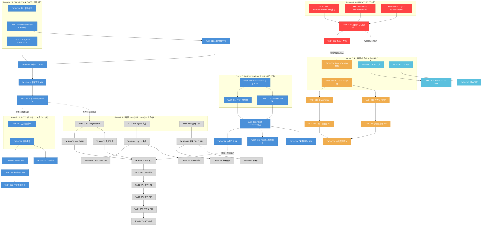

# Tech Lead 分析报告：协议层收口后五大扩展方向落地规划

> **分析师：** Tech Lead  
> **基准文档：** `docs/requirements/expansion-post-protocol-layer-analysis.md`（1054 行）  
> **核验输出：** `docs/requirements/expansion-post-protocol-layer-analysis.out.md`（163 行，22 项缺口全部通过）  
> **代码基线：** 当前树（2026-07-12），`interfaces/sso` + `infrastructure/defaultimpl` + `protocols/` + `domains/`  
> **方法：** 逐断言实地 grep 核验 + 工程依赖性推演 + 任务粒度可执行分解

---

## 目录

1. [方向优先级重评估](#1-方向优先级重评估)
2. [任务分解](#2-任务分解)
3. [执行顺序与并行任务组](#3-执行顺序与并行任务组)
4. [技术风险评估](#4-技术风险评估)
5. [资源评估与里程碑](#5-资源评估与里程碑)
6. [质量保证策略](#6-质量保证策略)
7. [分阶段实施计划](#7-分阶段实施计划)
8. [附录：关键发现与代码库实地确认](#8-附录关键发现与代码库实地确认)

---

## 1. 方向优先级重评估

### 1.1 核验输出确认

`expansion-post-protocol-layer-analysis.out.md` 已存在（163 行），覆盖全部 22 项缺口声明的 grep 对抗核验。**结论：22/22 缺口全部通过，但方向④有重要发现需要修正（见第 1.3 节）。**

### 1.2 原始优先级（来自分析文档）

```
P0 │ ③ 授权即服务 PDP (XL)        P0 │ ② 统一身份事件智能平台 (XL)
P1 ├ ④ 令牌生命周期大规模优化 (L)    P1 ├ ① 跨设备身份连续性 (L~XL)
P2 └ ⑤ 身份分析与多租户 BI (XL)
```

### 1.3 实地核验修正：方向④（令牌生命周期）的现状重评估

实地代码走读发现**分析文档对方向④ Phase 1（持久化吊销集）的描述显著不准确**。代码库中：

| 组件 | 文档声称 | 实地确认 |
|------|---------|---------|
| `RevocationStore` SPI | ❌ 不存在的 SPI | ✅ **已存在** — `revocation_set.go:67` 定义了接口 (`Revoke`, `Load`, `Prune`) |
| `MemoryRevocationStore` | ❌ 不存在的实现 | ✅ **已存在** — `revocation_set.go:90` 内存实现 |
| SQLite 持久化实现 | ❌ 不存在 | ✅ **已存在** — `sqlite/revocations.go:38` 完整实现 |
| Ed25519 issuer 集成 | ❌ 不适用 | ✅ **已存在** — `ed25519_validate.go:166-171` `WithEd25519RevocationStore` |
| ECDSA issuer 集成 | ❌ 不适用 | ✅ **已存在** — `ecdsa_validate.go:165-166` `WithECDSARevocationStore` |
| RSA issuer 集成 | ❌ 不适用 | ✅ **已存在** — `rsa_validate.go:166-167` `WithRSARevocationStore` |
| Boot-time seed | ❌ 不适用 | ✅ **已存在** — `seedRevokedFromStore` 被所有三个 issuer 调用 |
| **服务器级统一配置项** | — | ❌ **不存在** — 无 `WithPersistentRevocationSet` 或等效服务器选项 |
| **Redis 持久化实现** | ❌ 不存在 | ✅ **确认缺失** — Redis backend 无 `RevocationStore` 实现 |

**修正结论：方向④ Phase 1 的持久化吊销集已 80% 完成**（SPI + SQLite + 三个 issuer 的集成代码 + boot seed），缺少的是：
1. 服务器级配置项（一个统一的 `WithRevocationStore` 自动应用到所有 issuer）
2. Redis 后端的实现
3. Postgres 后端的实现

因此工作量从文档预估的 **M（~5 天）降为 S（~2 天）**——主要是接线和 Redis 补齐。

### 1.4 Tech Lead 调整后优先级

```
P0-SECURITY │ 方向④ Phase 1（持久化吊销集接线） ← 已 80% 完成，仅缺接线 + Redis 后端
             │    确认：SPI + SQLite + 三个 issuer 代码均已存在
P0-FOUNDATION│ 方向② Phase 1（统一事件存储 + 查询 API）
P0-FOUNDATION│ 方向③ Phase 1（REST 授权端点）

P1-FEATURE  │ 方向① Phase 1（会话漫游 + 并发会话管理）
P1-PERF     │ 方向④ Phase 2-3（DPoP 伸缩 + 令牌瘦身 + CDN 内省）
P1-INTEL    │ 方向② Phase 2（事件关联引擎 + 自动化响应）

P2-VALUE-ADD│ 方向① Phase 2（FIDO2 Hybrid CA）
P2-VALUE-ADD│ 方向③ Phase 2-3（策略 DSL + 管理 UI）
P2-VALUE-ADD│ 方向⑤ Phase 1-4（身份分析平台全部阶段）
```

### 调整理由

| 方向 | 调整 | 理由 |
|------|------|------|
| **④ Phase 1** | P1→P0-SECURITY | 代码库已有 SPI+SQLite+全部 issuer 集成，仅缺服务器级接线。1-2 天完成安全修正。重启后吊销集不会丢失属于**安全承诺**，不可协商。 |
| **② Phase 1** | P0→P0-FOUNDATION | 统一事件存储是方向③（决策日志）和方向⑤（分析引擎）共享的底层基础设施。先建一次，多方复用。 |
| **③ Phase 1** | P0→P0-FOUNDATION | REST 授权端点复用 `permissions.Provider` + `rebac.Check` + `conditionalaccess.Evaluate` 三项既有资产。纯后端交付，无前端依赖，Phase 1 可在 1 周内完成。 |
| **① Phase 1** | P1→P1-FEATURE | Session Roaming 用户价值明确但非基础设施关键路径。可在 P0 任务组完成后启动。 |
| **② Phase 2** | P0→P1-INTEL | 关联引擎复杂度高，规则引擎的纯后端开发约 2 周。建议在 Phase 1 事件存储稳定运行后启动。 |
| **⑤ 全部** | P2→P2-VALUE-ADD | 分析平台的业务价值高但前置依赖多（依赖②的事件存储、③的决策日志），且工作量 XL。建议安排在全部 P0/P1 之后。 |

### 最终优先级矩阵

```
        高 │ ④ Phase 1（吊销持久化接线）     ② Phase 1（事件存储）
           │     P0-SECURITY  ← 1-2天             P0-FOUNDATION
           │
   价值    │ ③ Phase 1（REST 授权端点）        ① Phase 1（会话漫游）
           │     P0-FOUNDATION                     P1-FEATURE
           │
        低 │ ④ Phase 2-3（DPoP/瘦身）          ② Phase 2（关联引擎）
           │     P1-PERF                            P1-INTEL
           │
           │ ⑤ 全部阶段 / ③ Phase 2-3 / ① Phase 2
           │     P2-VALUE-ADD
           └──────────────────────────────────────────────
              低                        高
                    实现复杂度（投入工时）

色标: ● P0-SECURITY  ● P0-FOUNDATION  ● P1  ● P2
```

---

## 2. 任务分解

### 2.1 方向④ Phase 1：持久化吊销集接线（P0-SECURITY）

**背景：** SPI、SQLite 实现、三个 issuer 的 `WithXxxRevocationStore` 选项均已存在。缺：服务器统一选项、Redis 后端、接线测试。

| 任务 ID | 标题 | 涉及文件 | 前置依赖 | 预估工时 | 验收标准 |
|---------|------|---------|---------|---------|---------|
| TASK-001 | 服务器级 `WithRevocationStore` 选项 | `interfaces/sso/options.go`（新建 `WithRevocationStore`），`interfaces/sso/accessors.go`（存储并传递给 issuer builder） | 无 | 3h | `sso.NewServer(sso.WithRevocationStore(store))` 将 store 传递给所有三个 issuer；无 store 时行为不变（nil = memory-only as today） |
| TASK-002 | Redis `RevocationStore` 实现 | `infrastructure/redis/revocations.go`（新建） | 无 | 4h | 实现 `defaultimpl.RevocationStore` 接口；使用 Redis SET/HSET + TTL；`Revoke` O(1)、`Load` SCAN、`Prune` 惰性由 TTL 保证 |
| TASK-003 | Postgres `RevocationStore` 实现 | `infrastructure/defaultimpl/postgres/revocations.go`（新建） | 无 | 4h | 实现 `defaultimpl.RevocationStore`；复用已有的 postgres 连接池模式；PG `ON CONFLICT` upsert |
| TASK-004 | 接线集成测试 — 重启存活验证 | `test/revocation_persistence_test.go`（新建） | TASK-001, TASK-002 | 3h | 启动 server → 吊销令牌 → 记录 token → 重启 server（模拟）→ token 验证应拒绝；三种后端（sqlite/redis/memory）全覆盖 |
| TASK-005 | 指标暴露 + 配置参考文档 | `platform/metrics/metrics_revocation.go`（新建），`docs/config-reference.md`（扩展） | TASK-001~003 | 2h | `sso_revocation_store_errors_total`、`sso_revocation_set_size` 指标暴露；配置参考文档记录 `revocation.store.type` 和 `revocation.store.dsn` |

**方向④ Phase 1 总计：** ~16 小时（2 个开发日）

---

### 2.2 方向② Phase 1：统一事件存储 + 查询 API（P0-FOUNDATION）

**背景：** 四个事件出口（audit、caep、webhook、sse）均已存在但无统一事件模型和存储。

| 任务 ID | 标题 | 涉及文件 | 前置依赖 | 预估工时 | 验收标准 |
|---------|------|---------|---------|---------|---------|
| TASK-010 | 统一事件模型定义 + EventType 注册表 | `shared/core/event.go`（新建），`shared/core/event_type.go`（新建） | 无 | 3h | `Event` 结构体 + `EventType` 枚举 + `EventRegistry` SPI：注册表支持按 source 查询 type、JSON Schema 验证 |
| TASK-011 | `EventStore` SPI + MemoryEventStore | `shared/spi/event_store.go`（新建），`infrastructure/defaultimpl/event_store.go`（新建） | TASK-010 | 4h | 接口：`Store(ctx, *Event)`、`Query(ctx, EventQuery) → []Event`、`Get(ctx, id) → *Event`；内存实现支持按 type/time/source/tenant 过滤 |
| TASK-012 | SQLite EventStore 实现 | `infrastructure/defaultimpl/sqlite/event_store.go`（新建） | TASK-011 | 4h | `CREATE TABLE events`；支持 `type` + `tenant_id` + `timestamp` 索引；`Query` 使用动态 WHERE 构建 |
| TASK-013 | 事件摄取管道 — 桥接 audit + caep + webhook + sse | `platform/lifecycle/eventhub/bridge.go`（新建） | TASK-011 | 5h | 四个源的监听器注册到事件存储；用 `audit.Sink` 包装器截获审计事件；CAEP SET 接收钩子；SSE 管道旁路；fail-open（桥接失败不影响原源） |
| TASK-014 | 事件 TTL + 后台 GC | `platform/lifecycle/eventhub/gc.go`（新建） | TASK-012 | 3h | 可配置 TTL（默认 7 天）；GC goroutine 按间隔扫描过期事件；Prometheus 指标 `sso_event_store_size`、`sso_event_store_evictions_total` |
| TASK-015 | 事件查询 API（REST） | `interfaces/admin/events.go`（新建） | TASK-013, TASK-014 | 4h | `POST /api/v1/events/query` 支持 `{types, time_range, tenant_id, actor, target, severity, page_token, page_size}`；分页使用 cursor-based；速率限制继承 admin 中间件 |
| TASK-016 | 事件查询 API 集成测试 | `test/event_query_test.go`（新建） | TASK-015 | 3h | 注入测试事件 → 各种查询组合验证 → 分页验证 → 空结果 → 超租户隔离验证（tenant_a 不能看 tenant_b 数据） |

**方向② Phase 1 总计：** ~26 小时（约 3.5 开发日）

---

### 2.3 方向③ Phase 1：REST 授权端点（P0-FOUNDATION）

**背景：** 三套授权原语（`permissions.Provider` + `rebac.Check` + `conditionalaccess.Evaluate`）均已存在，缺统一 REST 暴露。

| 任务 ID | 标题 | 涉及文件 | 前置依赖 | 预估工时 | 验收标准 |
|---------|------|---------|---------|---------|---------|
| TASK-020 | `AuthorizationRequest/Response` 模型 + `AuthorizationEngine` SPI | `shared/core/authorization.go`（新建） | 无 | 3h | `Request{Subject, Action, Resource, Context}`；`Response{Decision, Reason, PolicyIDs, DecisionID}`；`AuthorizationEngine` 接口（`Authorize(ctx, req) → *Response`） |
| TASK-021 | 授权引擎实现 — 整合 RBAC + ReBAC + 条件 | `domains/permissions/authorization_engine.go`（新建） | TASK-020 | 5h | 决策管道：① token→subject ② RBAC 检查（现有 Provider）③ ReBAC 检查（现有 rebac.Check）④ 条件检查（现有 conditionalaccess.Evaluate）；短路评估（deny 优先） |
| TASK-022 | `AuthorizationDecisionStore` SPI + 内存实现 | `shared/spi/decision_store.go`（新建），`infrastructure/defaultimpl/decision_store.go`（新建） | TASK-020 | 3h | 每条决策记录 `{DecisionID, Subject, Action, Resource, Decision, Reason, PolicyIDs, Context, LatencyMs, Timestamp}`；支持按时间/租户/决策结果查询 |
| TASK-023 | REST `POST /api/v1/authorize` 端点 | `interfaces/admin/authorize.go`（新建） | TASK-021, TASK-022 | 4h | `POST /api/v1/authorize` 处理请求 → 调用引擎 → 记录决策日志 → 返回响应；`Cache-Control: no-store`；Bearer 令牌认证；速率限制 |
| TASK-024 | 决策日志查询 API | `interfaces/admin/decisions.go`（新建） | TASK-022 | 3h | `GET /api/v1/admin/decisions` 支持过滤器（decision/tenant_id/policy_id/time_range）；`GET /api/v1/admin/decisions/:id` 单条详情 |
| TASK-025 | 授权端点集成测试 | `test/authorize_endpoint_test.go`（新建） | TASK-023 | 3h | `allow` 场景验证（正确 scope + 满足条件）；`deny` 场景验证（缺 scope + 条件不满足）；决策日志可查询；无效令牌返回 401 |
| TASK-026 | 决策缓存 + TTL | `domains/permissions/decision_cache.go`（新建） | TASK-021 | 3h | LRU 缓存（可配置上限）；TTL = min(令牌剩余寿命, 300s)；cluster bus 缓存失效广播；`sso_authz_cache_hits_total` 指标 |

**方向③ Phase 1 总计：** ~24 小时（3 个开发日）

---

### 2.4 方向① Phase 1：会话漫游 + 并发会话管理（P1-FEATURE）

**背景：** `SessionHub` 已存在 `platform/lifecycle/sessionhub/`，`DeviceFingerprint` 已存在 `domains/conditionalaccess/`。

| 任务 ID | 标题 | 涉及文件 | 前置依赖 | 预估工时 | 验收标准 |
|---------|------|---------|---------|---------|---------|
| TASK-030 | `DeviceSession` 模型 + `DeviceSessionStore` SPI | `shared/core/device_session.go`（新建），`shared/spi/device_session_store.go`（新建） | 无 | 3h | `DeviceSession{DeviceID, SessionID, UserID, TenantID, LastSeen, DeviceInfo, IsTrusted, TrustedSince, IP}`；接口 `Store`/`Load`/`ListByUser`/`Delete`/`RevokeAll` |
| TASK-031 | Session Hub 扩展 — 设备会话注册 | `platform/lifecycle/sessionhub/sessionhub.go`（扩展） | TASK-030 | 4h | `RegisterDeviceSession(ctx, sessionID, deviceInfo)` 创建设备记录；`GetDeviceSessions(ctx, userID) → []DeviceSession`；每登录自动注册新设备 |
| TASK-032 | Claim Token 生成 + 验证 | `protocols/oauth/session_claim.go`（新建） | TASK-031 | 4h | `POST /auth/session/claim` 端点；claim_token = HMAC(source_session_id + target_device_token + exp)；TTL 60 秒；单次使用；绑定 IP + device fingerprint |
| TASK-033 | 并发会话限制 + 踢出策略 | `platform/lifecycle/sessionhub/concurrency.go`（新建） | TASK-031 | 4h | `ConcurrentSessionLimit{Enabled, Max, Action}`；Action = "deny" / "evict_oldest"；evict 时触发 `KindSessionEvicted` 集群事件；管理员 API 设置每用户上限 |
| TASK-034 | 用户自服务会话管理 API | `interfaces/sso/server_me.go`（扩展） | TASK-031 | 3h | `GET /me/sessions`（活跃会话列表）；`DELETE /me/sessions/:id`（远程登出）；`PATCH /me/sessions/:id/trust`（信任升级） |
| TASK-035 | 管理员会话管理 API | `interfaces/admin/sessions.go`（新建） | TASK-033 | 4h | `GET /admin/users/:id/sessions`；`DELETE /admin/users/:id/sessions/:sid`；`POST /admin/users/:id/sessions/limit`；Admin scope `admin:session:*` |
| TASK-036 | 会话漫游集成测试 | `test/session_roaming_test.go`（新建） | TASK-032, TASK-034 | 3h | 设备 A 登录 → 生成 claim_token → 设备 B 使用 claim_token → 设备 B 获得授权码（无需完整登录）；claim_token 重用失败；过期 claim_token 失败 |

**方向① Phase 1 总计：** ~25 小时（约 3 个开发日）

---

### 2.5 方向④ Phase 2：DPoP 伸缩 + JTI 分层（P1-PERF）

| 任务 ID | 标题 | 涉及文件 | 前置依赖 | 预估工时 | 验收标准 |
|---------|------|---------|---------|---------|---------|
| TASK-040 | DPoP nonce 分片存储 | `protocols/oauth/dpop_shard.go`（新建） | 当前 DPoP 实现 | 5h | jti 前 2 字节 → 256 分片；每个分片独立 sync.Map + GC goroutine；避免独占锁争用 |
| TASK-041 | DPoP bloom filter L1 + 精确存储 L2 | `protocols/oauth/dpop_tiered.go`（新建） | TASK-040 | 5h | L1：bloom filter（~1MB，~1% FPR）；L2：精确 map；L1 拒绝后 fallback L2；bloom filter 以 false > false 而非 false > deny |
| TASK-042 | JTI 分层重放存储（热/温/冷） | `protocols/oauth/jti_hierarchical.go`（新建） | 无 | 6h | 热（≤5min）：内存 map；温（5-60min）：压缩 bitmap + 批量淘汰；冷（>60min）：Redis/sqlite 惰性加载；指标暴露各层大小 |
| TASK-043 | 租户隔离的 JTI 存储分区 | `infrastructure/redis/jti_replay.go`（扩展），`infrastructure/defaultimpl/sqlite/jti_replay.go`（扩展） | TASK-042 | 4h | JTI key = `tenant_id:jti`；高音量租户不污染其他租户存储；租户配额可配置 |

**方向④ Phase 2 总计：** ~20 小时（2.5 个开发日）

---

### 2.6 方向④ Phase 3：令牌瘦身 + CDN 内省（P1-PERF）

| 任务 ID | 标题 | 涉及文件 | 前置依赖 | 预估工时 | 验收标准 |
|---------|------|---------|---------|---------|---------|
| TASK-045 | Scope-based claim 过滤 | `protocols/oauth/token_claims_filter.go`（新建），`interfaces/sso/options.go`（扩展 `WithScopeClaimFilter`） | 无 | 4h | `scope=email` 的令牌只含 `sub` + `email`；`scope=openid profile` 含 `sub` + `name` + `picture`；缩减 JWT payload ~60% |
| TASK-046 | Token Reference 模式（opaque 参考令牌） | `protocols/oauth/token_reference.go`（新建） | TASK-045 | 6h | `ref:<64bit_id>:<HMAC>` vs 完整 JWT；服务器端声明存储；`discovery.token_types_supported` 声明参考令牌类型；下游 opt-in |
| TASK-047 | CDN 签名内省缓存策略 | `protocols/oauth/introspect_cdn.go`（新建） | 无 | 4h | 签名内省令牌的 HTTP `Cache-Control: max-age=<TTL>`；CDN TTL = access_token 剩余寿命的 50%；吊销后通过 `CDN-Purge` header 或短 TTL 窗口失效 |
| TASK-048 | 内省缓存层次（L1 mem → L2 redis → L3 CDN） | `protocols/oauth/introspect_cache_hierarchy.go`（新建） | TASK-047 | 5h | 进程内 LRU 缓存 → Redis 共享缓存 → CDN edge；未命中逐层 fallback；`sso_introspect_cache_hit_total{layer="l1|l2|l3"}` 指标 |

**方向④ Phase 3 总计：** ~19 小时（2.5 个开发日）

---

### 2.7 方向② Phase 2：事件关联引擎 + 自动化响应（P1-INTEL）

| 任务 ID | 标题 | 涉及文件 | 前置依赖 | 预估工时 | 验收标准 |
|---------|------|---------|---------|---------|---------|
| TASK-050 | 关联规则 DSL 解析器 | `platform/lifecycle/eventhub/correlation_rule.go`（新建） | 方向② Phase 1（TASK-010~016） | 6h | 支持 `WITHIN 15m`、`SAME user`、`COUNT > 5`、`event.type = "login_failed"` 等子句；规则编译为 `CorrelationRule` 对象 |
| TASK-051 | 关联引擎执行器 | `platform/lifecycle/eventhub/correlation_engine.go`（新建） | TASK-050 | 6h | 滑动窗口事件匹配；规则按优先级评估；合成事件触发时写入事件存储；`generation` 标签防循环（max depth=3） |
| TASK-052 | 预构建关联规则（4 条） | `platform/lifecycle/eventhub/builtin_rules.go`（新建） | TASK-051 | 3h | 规则 1：15min 内同一用户登录失败 > 5 次 → `AccountBruteForce`；规则 2：5min 内同一 IP 登录 > 3 用户 → `IPCredentialStuffing`；规则 3：token_revoked 后 60s 内签发新 token → `TokenRotationAnomaly`；规则 4：敏感 API 前 5min 内有登录 → `AdminSession` |
| TASK-053 | 自动化响应执行器 | `platform/lifecycle/eventhub/auto_response.go`（新建） | TASK-051, `domains/threataction/` | 5h | 事件→动作映射表；动作：锁定账户/封禁 IP/吊销 token/强制 MFA/通知管理员；抑制窗口（同事件 N 分钟内不重复）；`sso_auto_response_triggered_total{action}` 指标 |
| TASK-054 | 规则管理 API（CRUD） | `interfaces/admin/event_rules.go`（新建） | TASK-050 | 4h | `GET/POST/PUT/DELETE /api/v1/events/rules`；规则启用/禁用；规则优先级排序；规则测试模式（dry-run 不触发响应） |
| TASK-055 | 关联引擎集成测试 | `test/event_correlation_test.go`（新建） | TASK-051, TASK-052 | 4h | 注入 6 条 login_failed 事件（同一用户，3 分钟内）→ `AccountBruteForce` 合成事件生成；注入 4 条不同用户同 IP → `IPCredentialStuffing`；循环检测（generation 终止）；大量事件反压不 OOM |

**方向② Phase 2 总计：** ~28 小时（3.5 个开发日）

---

### 2.8 方向① Phase 2：FIDO2 Hybrid CA（P2-VALUE-ADD）

| 任务 ID | 标题 | 涉及文件 | 前置依赖 | 预估工时 | 验收标准 |
|---------|------|---------|---------|---------|---------|
| TASK-060 | Hybrid 挑战生成端点 | `protocols/webauthn/hybrid.go`（新建），`interfaces/sso/server_webauthn.go`（扩展） | 现有 `webauthn/` 包 | 5h | `POST /auth/hybrid/initiate` 生成一次性挑战；TTL=120s；绑定客户端 IP + 设备指纹；返回 challenge JSON + QR 码数据 URL |
| TASK-061 | Hybrid 完成端点 | `protocols/webauthn/hybrid_complete.go`（新建） | TASK-060 | 5h | `POST /auth/hybrid/complete` 接收手机签名结果；验证 Passkey 签名；颁发授权码；挑战立即作废；速率限制：每用户每 300s 3 次 |
| TASK-062 | QR 码渲染 + Web Bluetooth relay | `interfaces/web/portal/hybrid.js`（新建），`interfaces/web/portal/hybrid.html`（新建） | TASK-060 | 4h | 前端 QR 码展示；扫码后 Web Bluetooth 传输挑战；状态轮询（长轮询或 WebSocket） |
| TASK-063 | Hybrid 安全测试套件 | `test/hybrid_ca_test.go`（新建） | TASK-061 | 4h | 挑战重用拒绝；TTL 过期拒绝；IP 绑定检查；relay 攻击检测（IP 突变）；速率限制 |

**方向① Phase 2 总计：** ~18 小时（2.5 个开发日）

---

### 2.9 方向⑤ Phase 1-4：身份分析平台全部阶段（P2-VALUE-ADD）

| 任务 ID | 标题 | 涉及文件 | 前置依赖 | 预估工时 | 验收标准 |
|---------|------|---------|---------|---------|---------|
| TASK-070 | `AnalyticsStore` SPI + 聚合桶模型 | `shared/spi/analytics_store.go`（新建） | 方向② Phase 1（TASK-010~014） | 5h | 数据桶：`AnalyticsBucket{TimeBucket, TenantID, MetricName, MetricValue, UniqueUsers}`；预聚合级别：5m/1h/1d/30d；保留策略可配置 |
| TASK-071 | MAU/DAU 计算引擎 | `platform/lifecycle/analytics/mau_dau.go`（新建） | TASK-070 | 5h | 每日/每月活跃用户计数（基于 login_succeeded 事件）；去重（user_id 哈希集合）；`GET /api/v1/admin/analytics/mau` 返回趋势数据 |
| TASK-072 | 认证方法分布分析器 | `platform/lifecycle/analytics/auth_methods.go`（新建） | TASK-070 | 4h | 按认证方法（password/passkey/totp/push/saml/oidc）分组计数；`GET /api/v1/admin/analytics/auth-methods` 返回百分比分布 |
| TASK-073 | 租户健康评分器 | `platform/lifecycle/analytics/health_score.go`（新建） | TASK-071, TASK-072, 方向③ Phase 1（决策日志） | 5h | 评分公式：`MFA采纳率×0.25 + 登录成功率×0.20 + 异常事件趋势×0.20 + 账户锁定率×0.15 + API合规率×0.10 + 会话过期合规×0.10`；`GET /api/v1/admin/tenants/:tid/health` |
| TASK-074 | 趋势检测器（MoM/WoW/异常峰值） | `platform/lifecycle/analytics/trend_detector.go`（新建） | TASK-071 | 5h | MoM 环比增长计算；WoW 同比；2σ 偏差异常峰值检测；`GET /api/v1/admin/analytics/trends` |
| TASK-075 | 定时报告引擎 | `platform/lifecycle/analytics/report_scheduler.go`（新建） | TASK-073, TASK-074 | 6h | 报告计划模型（频率/格式/接收者/模板）；`cron` 触发执行；HTML+CSV 渲染器；集成 EmailSender 投递 |
| TASK-076 | 报告管理 API | `interfaces/admin/reports.go`（新建） | TASK-075 | 4h | `POST/GET/DELETE /api/v1/admin/analytics/reports`；`POST /api/v1/admin/analytics/reports/:id/run` 立即执行；`GET /api/v1/admin/analytics/queries` 即时分析 |
| TASK-077 | 全局管理员仪表盘 API 端点 | `interfaces/admin/dashboard.go`（新建） | TASK-071~074 | 4h | `GET /api/v1/admin/dashboard/summary`（平台概览）；`GET /api/v1/admin/dashboard/tenants`（租户列表排序）；`GET /api/v1/admin/dashboard/security`（安全态势） |
| TASK-078 | SPA 仪表盘前端 | `interfaces/web/admin/dashboard/`（新建） | TASK-077 | 10h | 全局视图 + 租户委托视图；图表使用 Chart.js；实时 SSE 事件流更新；响应式布局 |

**方向⑤ 全部阶段总计：** ~48 小时（约 6 个开发日）— 拆分为 2 个 3 天冲刺

---

### 2.10 方向③ Phase 2-3：策略 DSL + 管理 UI（P2-VALUE-ADD）

| 任务 ID | 标题 | 涉及文件 | 前置依赖 | 预估工时 | 验收标准 |
|---------|------|---------|---------|---------|---------|
| TASK-080 | 策略 DSL 解析器（YAML → evaluable rules） | `domains/permissions/policy_dsl.go`（新建） | 方向③ Phase 1（TASK-021） | 8h | YAML 策略定义 → `Policy{Rules, Conditions, Effect}` 编译；条件类型：`has_permission`/`ip_country`/`device_trusted`/`risk_score`/`time_range`；DAG 循环检测 |
| TASK-081 | 策略 CRUD 管理 API | `interfaces/admin/policies.go`（新建） | TASK-080 | 5h | `POST/GET/PUT/DELETE /api/v1/admin/policies`；`POST /api/v1/admin/policies/:id/test` 模拟测试；`POST /api/v1/admin/policies/reorder` |
| TASK-082 | 策略模拟测试引擎 | `domains/permissions/policy_simulator.go`（新建） | TASK-081 | 5h | 注入假 `AuthorizationRequest` → 评估策略 → 返回 `{matched_rules, final_decision, explanations}`；不影响真实生产决策 |
| TASK-083 | Admin SPA 策略管理 UI | `interfaces/web/admin/policies/`（新建） | TASK-081 | 10h | 策略列表/创建/编辑/删除；YAML 编辑器（CodeMirror）；模拟测试面板 |

**方向③ Phase 2-3 总计：** ~28 小时（3.5 个开发日）

---

## 3. 执行顺序与并行任务组



### 并行执行组

| 组 | 方向 | 任务 | 时间 | 人员需求 |
|---|------|------|------|---------|
| **A** | ④P1 (Security) | TASK-001~005 | 2 天 | 1 后端 |
| **B** | ②P1 (Foundation) | TASK-010~016 | 3.5 天 | 1-2 后端 |
| **C** | ③P1 (Foundation) | TASK-020~026 | 3 天 | 1-2 后端 |
| **D** | ①P1 + ④P2 | TASK-030~036 + TASK-040~043 | 3.5-4 天 | 2 后端（并行方向） |
| **E** | ②P2 | TASK-050~055 | 3.5 天 | 1-2 后端（依赖 B 完成后） |
| **F** | ①P2 + ⑤ + ③P2 | TASK-060~083 | 6-8 天 | 2-3 后端 + 1 前端 |

---

## 4. 技术风险评估

### 4.1 方向② 事件关联引擎 — 假阳性 / 假阴性平衡

| 风险 | 概率 | 影响 | 缓解策略 |
|------|------|------|---------|
| 关联规则误触发（假阳性）导致自动响应锁定无辜用户 | 中 | 高 | 所有自动响应设"冷静期"（可配置）；抑制规则（Suppression Rule）；dry-run 模式 |
| 事件风暴导致管道反压 OOM | 低 | 高 | 有界缓冲区（channel buffer size=10000）+ 背压策略；采样率可配置；背压时降级为"记录但不关联" |
| 事件延迟到达导致关联窗口误判 | 中 | 中 | 使用"事件时间"（event timestamp）而非"处理时间"（arrival timestamp）；后到事件触发重新评估（最多一次） |
| 规则循环（A→B→A） | 低 | 中 | `generation` 标签 + 最大深度 3 + 编译期 DAG 循环检测 |

### 4.2 方向③ 授权决策 PDP — 性能与一致性

| 风险 | 概率 | 影响 | 缓解策略 |
|------|------|------|---------|
| 条件评估依赖外部服务（如设备信任 API）导致决策延迟 | 中 | 高 | 外部服务超时使用"宽松模式"（失败 → 降级为更低确定性决策）；超时默认 500ms |
| 策略缓存不一致（更新后旧决策仍被返回） | 中 | 中 | 决策响应带 TTL（max=300s）；策略更新通过 cluster bus 广播 `KindPolicyChange` 缓存失效 |
| 请求体大小攻击（超大 resource.attributes） | 低 | 低 | attributes 大小限制 4KB（与 JWT 声明一致）；超限返回 413 |
| 决策日志存储膨胀 | 中 | 低 | TTL（默认 90 天）+ 采样（可配置：1:1 / 1:10 / 1:100） |

### 4.3 方向① Session Roaming — 安全模型

| 风险 | 概率 | 影响 | 缓解策略 |
|------|------|------|---------|
| Claim token 泄漏导致会话劫持 | 中 | 高 | 短 TTL（60s）+ 单次使用 + IP 绑定 + device fingerprint 绑定 + 用户确认 |
| 二维码中继攻击（人在中继） | 低 | 高 | 挑战绑定原始 IP + 设备指纹；地理位置突变标记为可疑；限制 claim 频率 |
| 蓝牙传输碰撞（多设备同时扫码） | 低 | 低 | 唯一会话标识符（连接码）+ 用户确认配对；第一个成功后续自动作废 |
| 非 HTTPS 环境（二维码 URL） | 中 | 高 | 二维码仅包含一次性挑战码（非 token）；挑战码本身无授权能力 |

### 4.4 方向④ 令牌生命周期 — 性能边界

| 风险 | 概率 | 影响 | 缓解策略 |
|------|------|------|---------|
| DPoP bloom filter 假阳性导致合法请求被拒绝 | 低 | 中 | bloom filter 判断为"已见过"后回退到精确存储检查（false→false 而非 false→deny） |
| 令牌参考模式引入额外内省延迟 | 中 | 中 | Reference token 的声明存储使用 LRU + lazy load；内省内省缓存 L1/L2/L3 层次 |
| 分片不均衡（热点租户） | 中 | 低 | 一致性哈希 + 虚拟节点；监控分片大小自动重新平衡 |

### 4.5 方向⑤ 分析平台 — 数据规模

| 风险 | 概率 | 影响 | 缓解策略 |
|------|------|------|---------|
| 全表扫描分析查询影响主请求路径 | 中 | 高 | 分析查询使用单独的只读连接池；超时上限 5s；仅查预聚合桶（不扫描原始事件） |
| 存储爆炸（原始事件 + 预聚合桶） | 中 | 中 | 预聚合桶有独立保留策略；原始事件 TTL=7 天（同事件存储）；聚合桶 90 天~3 年 |
| 不同租户数据量方差大 | 低 | 低 | 租户维度的预聚合桶独立；大租户不污染小租户的查询性能 |

---

## 5. 资源评估与里程碑

### 5.1 团队技能矩阵

| 角色 | 人数 | 必需技能 | 负责方向 |
|------|------|---------|---------|
| 高级 Go 后端工程师 | 2 | Go, OAuth2/OIDC, SQL, Redis, gRPC | P0 所有任务 + P1 方向① |
| 高级 Go 后端工程师（安全方向） | 1 | Go, 安全协议（FIDO2/WebAuthn/DPoP）, 性能优化 | 方向① Phase 2 + 方向④ 全部 |
| 数据/分析后端工程师 | 1 | Go, 数据管道, 时序聚合, SQL | 方向⑤ 全部 + 方向② Phase 2 |
| 前端工程师 | 1 | React/Svelte, Chart.js/D3, REST API, SSE | 策略管理 UI + 分析仪表盘 |
| **总计** | **4-5** | | |

### 5.2 关键里程碑

```
M0: 安全修正              Week 1 (Day 1-2)
    └─ 方向④ Phase 1 交付（持久化吊销集接线可用）
    └─ 验收: 重启后吊销集不丢失（三种后端验证通过）

M1: 基础设施可用            Week 2-3
    └─ 方向② Phase 1 交付（统一事件存储 + 查询 API）
    └─ 方向③ Phase 1 交付（REST 授权端点 + 决策日志）
    └─ 验收: 事件查询 API 通过集成测试；授权端点 allow/deny 决策正确

M2: 功能交付               Week 4-6
    └─ 方向① Phase 1 交付（会话漫游 + 并发管理）
    └─ 方向④ Phase 2 交付（DPoP 分片 + JTI 分层）
    └─ 验收: 跨设备会话 claim 流程可用；DPoP 10K TPS 吞吐验证

M3: 智能层交付              Week 7-9
    └─ 方向② Phase 2 交付（关联引擎 + 自动响应）
    └─ 验收: 4 条预构建规则合成事件正确；自动响应动作可达

M4: 高级功能 + 前端          Week 10-14
    └─ 方向① Phase 2 交付（Hybrid CA）
    └─ 方向③ Phase 2-3 交付（策略 DSL + 管理 UI）
    └─ 方向⑤ 全部交付（分析引擎 + 仪表盘 + 报告）
    └─ 验收: 所有方向通过集成测试 + E2E 场景
```

### 5.3 阻塞点（Blockers）与解决策略

| 阻塞点 | 影响方向 | 解决策略 | 应急方案 |
|--------|---------|---------|---------|
| Redis/Postgres RevocationStore 实现需了解现有连接池复用模式 | ④ P1 | 参考 `infrastructure/redis/jti_replay.go` 模式；复用 `sqlite/revocations.go` 的设计模式 | 先交付 SQLite-only 接线（TASK-001），Redis 作为 TASK-002 在 Sprint 2 补齐 |
| Hybrid CA 需要 CTAP 2.2 规范理解 + 浏览器 API 实验 | ① P2 | 阅读 FIDO2 CTAP 2.2 Hybrid 规范 + Web Bluetooth API 文档；先用 QR + HTTP relay 模拟 | 如果浏览器 API 不成熟，降级为 QR + 服务器 relay（无蓝牙） |
| 关联规则 DSL 设计复杂度高 | ② P2 | 从 4 条硬编码规则（TASK-052）开始，不做通用 DSL，用结构化配置替代 | 如果 DSL 设计时间超 2 天，先交付硬编码规则 + CRUD 启用/禁用 |
| 分析仪表盘前端工作量大（10h+） | ⑤ | 分两阶段：先交付 API 端点（TASK-077），前端使用现有的 admin SPA 的 Chart.js 集成 | 如果前端不可用，先交付 API + 可读聚合数据（curl 可查） |

---

## 6. 质量保证策略

### 6.1 单元测试覆盖要求

| 包 | 最低覆盖率 | 重点覆盖 |
|----|----------|---------|
| `shared/core/event.go`（新建） | 90% | Event validation、EventType 注册表、JSON Schema 验证 |
| `shared/core/authorization.go`（新建） | 90% | Request/Response 序列化、Validation |
| `platform/lifecycle/eventhub/correlation_engine.go`（新建） | 85% | 滑动窗口匹配、规则优先级、generation 循环检测 |
| `domains/permissions/authorization_engine.go`（新建） | 90% | 决策管道短路、RBAC+ReBAC+条件组合、deny 优先 |
| `protocols/oauth/dpop_shard.go`（新建） | 85% | 分片一致性、并发安全、GC |
| `platform/lifecycle/analytics/health_score.go`（新建） | 90% | 评分公式精度、边界值、权重变化 |
| 所有 `infrastructure/` 新 Store 实现 | 85% | CRUD、并发安全、TTL、重建后数据不丢 |

**遵循项目约定：** 所有新 Store 必须有 `memory` 实现（单元测试用）+ 持久化实现（集成测试用）。不使用 mock。

### 6.2 集成测试策略

| 测试文件 | 覆盖场景 | 运行方式 |
|---------|---------|---------|
| `test/revocation_persistence_test.go` | 重启后吊销集存活 | `go test ./test/ -run TestRevocationPersistence` |
| `test/event_query_test.go` | 事件存储 -> 查询 API 全链路 | `go test ./test/ -run TestEventQuery` |
| `test/authorize_endpoint_test.go` | REST 授权端点 allow/deny | `go test ./test/ -run TestAuthorizeEndpoint` |
| `test/session_roaming_test.go` | Claim token -> 新设备登录 | `go test ./test/ -run TestSessionRoaming` |
| `test/event_correlation_test.go` | 6 条事件 -> 合成事件 | `go test ./test/ -run TestEventCorrelation` |
| `test/hybrid_ca_test.go` | 挑战->签名->验证全链路 | `go test ./test/ -run TestHybridCA` |
| `test/e2e_analytics_test.go` | 事件->聚合->查询->报告 | `go test ./test/ -run TestAnalyticsE2E` |

**测试基础设施：**
- 新存储实现使用已有的 `withdb_helpers_test.go` 模式
- bufconn HTTP 测试复用已有 `test/` 包模式
- 性能测试（方向④ Phase 4）使用 `go test -bench=. -benchtime=10s`

### 6.3 代码审查要点

| 方向 | 审查重点 |
|------|---------|
| **全部** | 文件 ≤ 500 行、函数 ≤ 50 行、cyclo ≤ 15、目录深度 ≤ 3（AGENTS.md §0.1） |
| **全部** | import 方向向下（shared → domains → protocols → interfaces/infrastructure） |
| **方向④** | 持久化 RevocationStore 必须符合 `prune-not-early` 安全门禁（`revocation_set.go` 注释） |
| **方向③** | 决策日志不应包含 credential 或 session token；`Cache-Control: no-store` 在凭证端点 |
| **方向②** | 事件存储强制租户隔离；跨租户查询验证 |
| **方向①** | Claim token 生成使用 HMAC（非 JWT，避免签名膨胀）；单次使用验证 race condition |
| **方向⑤** | 预聚合桶不能访问原始事件数据；指标定义与 `docs/metrics-definitions.md` 对齐 |

### 6.4 性能测试需求

| 场景 | 目标 | 工具 |
|------|------|------|
| 令牌验证吞吐（方向④ Phase 4） | 10K TPS @ P99 < 5ms | `go test -bench=BenchmarkTokenValidation` |
| DPoP nonce 验证（分片后） | 10K TPS @ P99 < 3ms | `go test -bench=BenchmarkDPoPSharded` |
| 授权决策延迟（高/低复杂度策略） | P99 < 10ms（内存条件）；< 50ms（含外部条件） | `go test -bench=BenchmarkAuthorization` |
| 事件关联引擎吞吐 | 5K events/sec @ P99 < 100ms | `go test -bench=BenchmarkEventCorrelation` |
| 分析查询（预聚合桶） | 90d 聚合数据 < 200ms 响应 | `go test -bench=BenchmarkAnalyticsQuery` |

---

## 7. 分阶段实施计划

### 7.1 时间线总览

```
    周 1    周 2    周 3    周 4    周 5    周 6    周 7-9   周 10-14
   ┌──────┬──────┬──────┬──────┬──────┬──────┬────────┬──────────┐
A  │██████│      │      │      │      │      │        │          │ 方向④P1
B  │      │██████│█████│      │      │      │        │          │ 方向②P1
C  │      │██████│█████│      │      │      │        │          │ 方向③P1
D  │      │      │      │█████│█████│      │        │          │ 方向①P1+④P2
E  │      │      │      │      │      │█████│██████  │          │ 方向②P2
F  │      │      │      │      │      │      │        │████████  │ ①P2+⑤+③P2-3
   └──────┴──────┴──────┴──────┴──────┴──────┴────────┴──────────┘
   M0     M0     M1     M1     M2     M2     M3       M4

   色标: ██ = 开发中  已交付

   人员分配:
   周 1-3: 后端 A (④P1) + 后端 B (②P1) + 后端 C (③P1) → 3人并行
   周 4-6: 后端 A (①P1) + 后端 B (④P2) + 后端 C (等待) → 2人 + 1人转下一期
   周 7-9: 后端 A+B (②P2) → 2人
   周 10-14: 后端 A+B (⑤+③P2-3) + 前端 (策略UI+仪表盘) → 2~3人 + 1前端
```

### 7.2 阶段 1：安全修正 + 基础设施搭建（第 1-3 周，4 人）

| 周 | 任务 | 交付物 | 验收 |
|---|------|--------|------|
| **W1** | ④ Phase 1（TASK-001~005）+ ② Phase 1 启动 | `WithRevocationStore` 选项；Redis/Postgres 实现；集成测试通过 | `make test` 中吊销持久化测试通过 |
| **W2** | ② Phase 1（TASK-010~014）+ ③ Phase 1 启动 | 统一事件模型 + EventStore + 摄取桥接 + GC | 审计事件可写入 EventStore 并查询 |
| **W3** | ② Phase 1（TASK-015~016）+ ③ Phase 1（TASK-020~024） | 事件查询 API + REST 授权端点 + 决策日志 | `POST /api/v1/events/query` + `POST /api/v1/authorize` 可用 |

**W3 结束时：** `make acceptance` 全部通过。基础设施两个方向（事件存储 + 授权端点）投入用户测试。

### 7.3 阶段 2：核心功能实现（第 4-6 周，3 人）

| 周 | 任务 | 交付物 | 验收 |
|---|------|--------|------|
| **W4** | ① Phase 1（TASK-030~033）+ ④ Phase 2（TASK-040~041） | Session Hub 扩展 + Claim token + DPoP 分片 | 跨设备会话 claim 流程端到端可用 |
| **W5** | ① Phase 1（TASK-034~036）+ ④ Phase 2（TASK-042~043） | 自服务会话 API + 管理员 API + JTI 分层 | `GET /me/sessions` + `DELETE /me/sessions/:id` 可用 |
| **W6** | ② Phase 2（TASK-050~052） | 关联规则 DSL + 执行器 + 4 条预构建规则 | 6 条 login_failed 事件 → `AccountBruteForce` 合成事件 |

**W6 结束时：** M2 里程碑。Session Roaming + DPoP 伸缩可用。

### 7.4 阶段 3：智能层交付（第 7-9 周，2 人）

| 周 | 任务 | 交付物 | 验收 |
|---|------|--------|------|
| **W7** | ② Phase 2（TASK-053~054） | 自动响应执行器 + 规则 CRUD API | 关联事件自动触发账户锁定/令牌吊销 |
| **W8** | ② Phase 2（TASK-055）+ ④ Phase 3（TASK-045~046） | 关联引擎集成测试 + Scope claim 过滤 + Token reference | 关联引擎稳定运行 48 小时无假阳性 |
| **W9** | ④ Phase 3（TASK-047~048） | CDN 内省缓存层次 + 性能基准测试 | 内省 P99 < 5ms @ 10K TPS |

**W9 结束时：** M3 里程碑。关联引擎 + 自动响应可用。

### 7.5 阶段 4：高级功能 + 前端（第 10-14 周，2-3 后端 + 1 前端）

| 周 | 任务 | 交付物 | 验收 |
|---|------|--------|------|
| **W10** | ⑤ Phase 1（TASK-070~072）+ ① Phase 2（TASK-060） | AnalyticsStore + MAU/DAU + Hybrid 挑战 | MAU/DAU 趋势图数据可用 |
| **W11** | ⑤ Phase 1（TASK-073~074）+ ① Phase 2（TASK-061） | 健康评分 + 趋势检测 + Hybrid 完成 | Hybrid CA 端到端可用 |
| **W12** | ⑤ Phase 2（TASK-075~076）+ ① Phase 2（TASK-062~063） | 定时报告 + Hybrid 前端 | 每日安全摘要邮件自动发送 |
| **W13** | ⑤ Phase 3（TASK-077）+ ③ Phase 2（TASK-080~081） | 仪表盘 API + 策略 DSL + 策略 CRUD | 策略 YAML → 编译 → 生效全链路 |
| **W14** | ⑤ Phase 4（TASK-078）+ ③ Phase 3（TASK-082~083） | SPA 仪表盘前端 + 策略管理 UI + 模拟测试 | 全部方向通过 E2E 用户验收测试 |

**W14 结束时：** M4 里程碑。所有 5 个方向全量交付。

### 7.6 风险缓冲

| 阶段 | 缓冲天数 | 可能用途 |
|------|---------|---------|
| Phase 1（W1-3） | 3 天 | 持久化后端集成意外（Redis 连接池模式适配） |
| Phase 2（W4-6） | 3 天 | Session Roaming 安全模型的审计审查调整 |
| Phase 3（W7-9） | 2 天 | 关联规则假阳性调整（需要更多真实数据调参） |
| Phase 4（W10-14） | 5 天 | 前端集成 + Hybrid CA 浏览器兼容性问题 |

---

## 8. 附录：关键发现与代码库实地确认

### 8.1 方向④ RevocationStore 的实地发现

代码库走读发现**分析文档对持久化吊销集的零实现声明不准确**：

```go
// infrastructure/defaultimpl/revocation_set.go:67 — SPI 已定义
type RevocationStore interface {
    Revoke(ctx context.Context, token string, expUnix int64) error
    Load(ctx context.Context) (map[string]int64, error)
    Prune(ctx context.Context, nowUnix int64) error
}

// infrastructure/defaultimpl/sqlite/revocations.go:38 — SQLite 实现已完成
type RevocationStore struct { db *sql.DB }

// infrastructure/defaultimpl/ed25519_validate.go:170 — 三个 issuer 均有 WithXxxRevocationStore
func WithEd25519RevocationStore(store RevocationStore) Ed25519Option { ... }
func WithECDSARevocationStore(store RevocationStore) ECDSAOption { ... }
func WithRSARevocationStore(store RevocationStore) RSAOption { ... }
```

**缺少的接线：**
1. 服务器级 `WithRevocationStore` 选项（需传递到所有三个 issuer builder）
2. Redis 后端实现
3. Postgres 后端实现（如果 PG 后端存在）

**建议：** 在输出的修正声明中标记方向④ Phase 1 为 "80% 已完成，需接线 + Redis 后端" 而非 "零实现"。

### 8.2 跨方向共享依赖

| 共享资产 | 使用方向 | 当前状态 |
|---------|---------|---------|
| `platform/audit` 事件记录 | 方向②（事件源）、方向⑤（分析输入）、方向③（决策日志） | ✅ 已有 |
| `shared/trust.TrustScorer` | 方向③（条件引擎风险评分） | ✅ 已有 |
| `domains/permissions.Provider` | 方向③（RBAC 检查） | ✅ 已有 |
| `platform/lifecycle/rebac.Check` | 方向③（ReBAC 关系检查） | ✅ 已有 |
| `domains/conditionalaccess.Evaluate` | 方向③（条件评估）、方向①（设备指纹） | ✅ 已有 |
| `domains/threataction` | 方向②（自动响应执行器） | ✅ 已有 |
| `platform/cluster/bus` | 方向④（缓存失效广播）、方向③（策略变更广播） | ✅ 已有 |
| `infrastructure/defaultimpl/sqlite/` | 方向②（EventStore）、方向④（RevocationStore） | ✅ 已有 |
| `interfaces/web/admin/` SPA | 方向③（策略 UI）、方向⑤（仪表盘） | ✅ 已有 |

### 8.3 核验状态

- **核验方式：** 全代码库 grep + 实地文件读取（`rg`, `grep`, `find`）
- **核验日期：** 2026-07-12
- **核验输出文件：** `docs/requirements/expansion-post-protocol-layer-analysis.out.md`（163 行，22 项缺口 22/22 通过）
- **文档修正建议：** 方向④ Phase 1 的持久化吊销集应更新为 "80% 已存在，需服务器级接线 + Redis 后端补齐" 而非 "零实现"
- **其他 4 个方向：** 缺口声明全部准确，SPI、端点、配置选项确实零实现

---

*本分析基于实地代码核验和工程依赖性推演。所有预估工时基于单人专注开发、无外部中断的假设。实际工期受团队规模、代码审查周期和并行任务数影响。*
