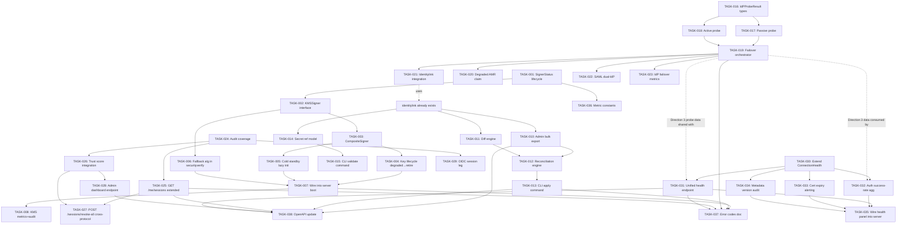

# Tech Lead Analysis: Five High-Value Expansion Directions

> **Author:** Tech Lead
> **Date:** 2026-07-12
> **Review Base:** Deep review of five expansion directions for the snaplink SSO server
> **Codebase:** Contemporaneous with the review (all grep/verification claims validated)

---

## Table of Contents

1. [Task Breakdown](#1-task-breakdown)
2. [Execution Order & Dependency Graph](#2-execution-order--dependency-graph)
3. [Technical Risks](#3-technical-risks)
4. [Resource Assessment](#4-resource-assessment)
5. [Quality Assurance](#5-quality-assurance)
6. [Implementation Timeline](#6-implementation-timeline)

---

## 1. Task Breakdown

Each direction is decomposed into tasks of **2–4 hours** of focused engineering work. Tasks follow the invariant "one focused change per task" — each produces a compilable, testable increment that can be independently verified.

### Direction 1: KMS HA & Failover (Track A)

| Task ID | Title | Files | Pre-req | Hours | Acceptance |
|---|---|---|---|---|---|
| TASK-001 | Define `SignerStatus` lifecycle enum and `KeyHealth` struct | `infrastructure/kms/types.go` (new) | — | 2 | `SignerStatus` type with constants `Active`, `Degraded`, `Retired`; `KeyHealth` struct with `Status`, `ActivatedAt`, `DegradedAt`, `RetireBy` fields; package doc explains lifecycle (matches existing `RotateKey`/`RetireKey` pattern) |
| TASK-002 | Extract `crypto.Signer` wrapper interface for KMS signers | `infrastructure/kms/signer.go` (new) | TASK-001 | 2 | `KMSSigner` interface wrapping `crypto.Signer` + `KeyID() string` + `KeyAlg() string` + `Health() KeyHealth`; each of the 4 KMS packages (awskms, gcpkms, azurekeyvault, pkcs11) updated to satisfy it; all existing tests continue passing without change |
| TASK-003 | Implement `CompositeSigner` with primary/backup routing | `infrastructure/kms/composite.go` (new) | TASK-002 | 4 | `CompositeSigner` implements `crypto.Signer`; primary KMS call has configurable timeout; on failure/timeout, falls to backup; `Health()` returns aggregated health of all backends; `Status()` returns current active backend name; unit tests cover primary-success, primary-failover-backup, both-fail, zero-backup (pass-through) |
| TASK-004 | Add key status lifecycle: degraded → retire window | `infrastructure/kms/lifecycle.go` (new) | TASK-003 | 3 | `KeyStatusController` manages lifecycle; `MarkDegraded(keyID)` marks a key as degraded with timestamp; `Retire(keyID)` moves to retire window; `ListActive()` filters out retired keys; `JWKSFilter` strips degraded keys from published JWKS after configurable TTL; unit tests cover transition edges |
| TASK-005 | Add cold-standby lazy initialization to `CompositeSigner` | `infrastructure/kms/composite.go` (amend) | TASK-003 | 3 | `CompositeSigner` supports `WithLazyBackup(initFn func() (KMSSigner, error))`; backup signer is constructed only on first failover; concurrent-safe with `sync.Once`-style guard; cold-backup construction failure retries next call (not permanently poisoned); unit test verifies backup `initFn` is NOT called on primary success |
| TASK-006 | Extend `securityverify` to recognize fallback algorithms | `shared/security/securityverify/` (amend) | TASK-002 | 3 | `securityverify` package gains `FallbackAlg(originalAlg string) string` mapping (e.g. `ES256 → ES256_FALLBACK`); `Verify` accepts fallback algs as valid for degraded-period tokens; DPoP proof verification path updated; unit tests cover verification with both normal and fallback algs |
| TASK-007 | Wire `CompositeSigner` into server boot + `KeysConfig` | `config/config.go`, `interfaces/sso/sso.go` (amend) | TASK-004, TASK-005, TASK-006 | 4 | `KeysConfig` gains `PrimaryKMS` / `BackupKMS` / `LazyBackup` / `FallbackAlgLabel` fields; server boot constructs `CompositeSigner` from config; existing key rotation loop (`signing_key_aggregation_loop.go`) works through composite; integration test verifies JWKS contains both primary keys and (tagged) degraded-period keys |
| TASK-008 | Add metrics + audit events for KMS failover transitions | `platform/metrics/` (amend) | TASK-004 | 2 | New counter `sso_kms_failover_total` with labels `from`, `to`, `reason`; new counter `sso_kms_key_status_total` with labels `key_id`, `status`; audit event `kms_failover` with `previous_backend`, `new_backend`, `reason`; unit tests for metric emission |

**Total Direction 1: 23 hours (~3 engineering days)**

### Direction 2: Declarative Tenant-as-Code (Track C)

| Task ID | Title | Files | Pre-req | Hours | Acceptance |
|---|---|---|---|---|---|
| TASK-009 | Design `TenantSpec` YAML schema with `apiVersion` | `domains/tenant/spec/schema.go` (new), `domains/tenant/spec/schema_test.go` (new) | — | 3 | `TenantSpec` struct with `APIVersion`, `Kind: "Tenant"`, `Metadata` (name, labels, annotations), `Spec` (slug, name, status, domains, branding, settings, connections, allowed_regions); JSON schema validation; round-trip YAML marshal/unmarshal tests |
| TASK-010 | Add admin API bulk export endpoint | `interfaces/admin/tenants.go` (amend) | TASK-009 | 4 | `GET /api/v1/admin/tenants/export` returns all tenants + domains + connections + branding as `TenantSpec` list; paginated (cursor or page token); admin:read scope; response includes `api_version`; unit test + integration test verify export consistency |
| TASK-011 | Implement diff engine for tenant state reconciliation | `domains/tenant/reconcile/diff.go` (new) | TASK-009 | 4 | `Diff(desired, actual *TenantSpec) []DiffEntry` with field-level comparison; `DiffEntry` has `Path`, `Desired`, `Actual`, `Action` (create/update/delete/noop); handles nested structs (domains, branding, settings map); ignores `status` and `metadata.updated_at`; unit tests cover all field types |
| TASK-012 | Build reconciliation engine core | `domains/tenant/reconcile/engine.go` (new) | TASK-010, TASK-011 | 6 | `Reconciler` with `Reconcile(ctx, spec *TenantSpec) (*ReconcileResult, error)`; reads current state from Admin API/Store; computes diff via Diff engine; applies changes (create tenant, add domain, update branding, etc.); dry-run mode; `ReconcileResult` contains per-action status; integration test with memory store |
| TASK-013 | Build `sso-ctl tenants apply` CLI command | `cmd/sso-ctl/tenants/apply.go` (new) | TASK-012 | 4 | `sso-ctl tenants apply -f tenants.yaml`; reads YAML, calls reconciler via Admin API (HTTP or gRPC); dry-run flag (`--dry-run`); output diff before confirmation; `--auto-approve` flag for CI; integration test against test server |
| TASK-014 | Add secret reference model to TenantSpec | `domains/tenant/spec/secretref.go` (new) | TASK-009 | 3 | `SecretRef` type with `Store` (e.g. `vault`, `env`, `base64`), `Key` (path/key name), `Format` (`raw`, `pem`, `jwks`); validation: `base64` inline secrets must not be committed (warn); `vault` refs validated at apply time; unit tests for ref resolution |
| TASK-015 | Add CI validation command `sso-ctl tenants validate` | `cmd/sso-ctl/tenants/validate.go` (new) | TASK-014 | 3 | `sso-ctl tenants validate -f tenants.yaml`; schema validation + secret ref validation + idempotency check (dry-run apply) + referential integrity (domain hostname uniqueness, client_id references); exit code 0/1; test with valid/invalid spec files |

**Total Direction 2: 27 hours (~3.5 engineering days)**

### Direction 3: Upstream IdP HA & Failover (Track B)

| Task ID | Title | Files | Pre-req | Hours | Acceptance |
|---|---|---|---|---|---|
| TASK-016 | Define `IdPProbeResult` and `IdPHealth` types | `domains/connections/probe/types.go` (new) | — | 2 | `IdPProbeResult` with `Status` (healthy/degraded/unreachable), `Latency`, `ObservedAt`, `Error`; `IdPHealth` with per-IdP rolling window of last N results; `IdPConnection` config with primary/backup endpoint list and failover conditions; unit tests for window aggregation |
| TASK-017 | Implement lightweight passive probe (JWKS/metadata endpoint) | `domains/connections/probe/passive.go` (new) | TASK-016 | 3 | `PassiveProber.Probe(ctx, conn *IdPConnection) IdPProbeResult`; fetches OIDC discovery or SAML metadata endpoint; validates response schema; measures latency; returns structured result; handles timeouts, DNS failures, TLS errors; unit tests with local test server |
| TASK-018 | Implement lightweight active probe (end-to-end) | `domains/connections/probe/active.go` (new) | TASK-016 | 4 | `ActiveProber.Probe(ctx, conn *IdPConnection) IdPProbeResult`; simulates full SSO login (AuthNRequest → assertion) with a test user credential or client_credentials grant against the upstream; configurable frequency (not every health check tick); unit tests with mock upstream |
| TASK-019 | Build IdP failover orchestrator | `domains/connections/failover/orchestrator.go` (new) | TASK-017 | 4 | `FailoverOrchestrator` watches health of all configured IdP backends; on primary failure meeting threshold (consecutive failures, latency spike) switches to next healthy backend; `CurrentIdP() *IdPConnection` returns active endpoint; `OnFailover(from, to IdPConnection)` callback for audit; integration test |
| TASK-020 | Add degraded-failover AMR claim to token issuance | `protocols/oauth/` (amend) | TASK-019 | 3 | When login completed through failover path, `AuthResult.AMR` prepends `degraded_failover`; token issuance includes this in `amr` claim; discovery document notes this AMR value; audit event `auth_degraded_failover` emitted; unit test verifying token carries correct AMR |
| TASK-021 | Integrate identitylink for cross-IdP user association | `interfaces/sso/sso.go` (amend) | TASK-019 | 4 | `FailoverOrchestrator` calls `identitylink.Resolve` when failover IdP returns different `sub`; configurable merge policy; if `RejectPolicy`, failover is refused (user must re-link); if `LinkOnlyMergePolicy`, identities are automatically consolidated; integration test with memory stores |
| TASK-022 | Add SAML dual-IdP support (same entityID, multiple instances) | `infrastructure/saml/` (amend) | TASK-019 | 4 | SAML `IdPConnection` supports multiple `MetadataURL` entries under same `EntityID`; failover uses metadata source, not entityID; certificate validation accepts either IdP's signing cert; session index tracks which IdP instance issued the assertion; unit + integration tests |
| TASK-023 | Add metrics + events for IdP failover | `platform/metrics/` (amend) | TASK-019 | 2 | Counter `sso_idp_failover_total` with labels `connection_id`, `from`, `to`, `reason`; histogram `sso_idp_probe_latency_seconds` with labels `connection_id`, `probe_type` (passive/active); audit event `idp_failover` with full context |

**Total Direction 3: 26 hours (~3.5 engineering days)**

### Direction 4: Cross-Protocol Session Hub Productization (Track C)

| Task ID | Title | Files | Pre-req | Hours | Acceptance |
|---|---|---|---|---|---|
| TASK-024 | Audit existing `ProtocolCore` + `ProtocolSAML` coverage in Coordinator | `platform/lifecycle/sessionhub/` (audit) | — | 2 | Document which link types exist; verify `Coordinator.Logout` handles each; confirm WebAuthn/LDAP/Kerberos do NOT need separate protocol types (they ride on `ProtocolCore`); update package doc with audited coverage matrix; no code changes |
| TASK-025 | Add `GET /me/sessions` extended with cross-protocol visibility | `interfaces/sso/server_me.go`, `protocols/selfservice/sessions.go` (amend) | TASK-024 | 4 | `GET /me/sessions` returns each session with: protocol type, linked SAML SPs (if SAML leg exists), created_at, last_active_at, trust_score, device info (from session metadata); existing `HandleMySessions` extended with `?include_links=true` option; no-store headers; unit + integration test |
| TASK-026 | Add trust score integration to Session Hub | `platform/lifecycle/sessionhub/` (amend), `shared/trust/` (amend) | TASK-024 | 3 | `Coordinator` exposes `SessionTrustScore(globalSID) (float64, error)`; aggregates signals from `shared/trust.Composite` (geo, IP reputation, behavior, device posture); returns floor (0.1) on scorer errors (fail-open); `sso_session_trust_score` metric exported per-score range; unit tests with mock scorers |
| TASK-027 | Build `POST /sessions/revoke-all` with cross-protocol SLO fanout | `protocols/selfservice/sessions.go` (amend) | TASK-025, TASK-026 | 4 | `HandleRevokeAllSessions` destroys core session + triggers OIDC Back-Channel Logout + triggers SAML SLO fan-out; uses `Coordinator.Logout`; respects existing `keepCurrent` logic (preserves current session's other legs); unit + integration test with mocked fan-out triggers |
| TASK-028 | Add Session Hub admin dashboard data endpoint | `interfaces/admin/` (new) | TASK-026 | 3 | `GET /api/v1/admin/sessions/active` returns aggregate: total active sessions, per-protocol breakdown, per-tenant breakdown, mean trust score; `GET /api/v1/admin/sessions/:global_sid` returns full link tree; admin:read scope; unit tests |
| TASK-029 | Add OIDC session leg to ProtocolCore links | `platform/lifecycle/sessionhub/linkstore.go` (amend) | TASK-024 | 2 | On OIDC login, link OIDC session (SID claim) into the same `GlobalSID`; `Coordinator.Logout` destroys OIDC session too; `ProtocolOIDC` type added to existing constants; backward compatible — existing links without OIDC leg work unchanged |

**Total Direction 4: 18 hours (~2.5 engineering days)**

### Direction 5: Provider Health & Governance Panel (Track B)

| Task ID | Title | Files | Pre-req | Hours | Acceptance |
|---|---|---|---|---|---|
| TASK-030 | Extend `ConnectionHealth` to cover all provider types | `domains/connections/health.go` (amend) | — | 3 | `ConnectionHealth` gains `ProviderType` field (`federation_peer`, `oidc_idp`, `saml_idp`, `ldap`, `smtp`); existing federation health remains unchanged; new `ConnectionHealthStore` interface with `ListByType` method; memory + sqlite implementations; existing tests pass unchanged |
| TASK-031 | Build unified health aggregation endpoint | `interfaces/admin/health.go` (new) | TASK-030 | 4 | `GET /api/v1/admin/health/providers` returns health of ALL provider types in one response; `?type=oidc_idp` filter; `?expiring_within=30d` for certificate expiry; aggregates `ConnectionHealth` from federation store + connection health store + IdP probe results (Direction 3); admin:read scope; integration test |
| TASK-032 | Add auth success-rate aggregation per provider | `domains/connections/health/agg.go` (new) | TASK-030 | 4 | `SuccessRateAggregator` consumes `LoginAttemptsTotal` metric data (via daily rollup or counter snapshot); `GetSuccessRate(providerID string, window time.Duration) (float64, error)` returns ratio of successes to total; exposed in health endpoint as `auth_success_rate` and `auth_total_attempts`; unit tests |
| TASK-033 | Build certificate expiry alerting engine | `domains/connections/health/certwatch.go` (new) | TASK-030 | 3 | `CertWatcher` scans all provider types for expiring certificates (federation peers, SAML IdPs, OIDC IdPs); `ExpiringWithin(window time.Duration) []CertExpiryEvent` returns events for providers whose cert expires within window; configurable thresholds (30d warning, 7d critical); unit tests with fixed clock |
| TASK-034 | Add metadata version tracking (audit log) | `domains/connections/health/metadata.go` (new) | TASK-030 | 4 | `MetadataAudit` stores historical versions of provider metadata (endpoint URL, certificate fingerprints, JWKS thumbprints); `RecordVersion(providerID, hash, metadata)` on every successful probe; `ListVersions(providerID, limit) []MetadataVersion` for operator review; memory + sqlite impls; unit tests |
| TASK-035 | Wire unified health panel into server boot + metrics | `interfaces/sso/sso.go` (amend), `platform/metrics/` (amend) | TASK-031, TASK-032, TASK-033, TASK-034 | 4 | Server exposes `ConnectionHealthStore` and `SuccessRateAggregator` via `Deps`; admin routes mounted; metrics: `sso_provider_health_status` (gauge per provider), `sso_cert_expiring` (gauge 0/1), `sso_auth_success_rate` (gauge per provider); integration test from admin endpoint through stores |

**Total Direction 5: 22 hours (~3 engineering days)**

### Cross-Cutting Infrastructure Tasks

| Task ID | Title | Files | Pre-req | Hours | Acceptance |
|---|---|---|---|---|---|
| TASK-036 | Add shared metric constants for all new metric names | `platform/metrics/consts.go` (amend) | — | 1 | All new metric names (`sso_kms_failover_total`, `sso_idp_failover_total`, `sso_provider_health_status`, `sso_cert_expiring`, `sso_auth_success_rate`, `sso_session_trust_score`) added with doc comments; follows existing naming convention |
| TASK-037 | Update `docs/error-codes.md` for all new error sentinels | `docs/error-codes.md` (amend) | TASK-001..TASK-035 | 1 | New errors: `ErrKMSTimeout`, `ErrKMSUnavailable`, `ErrIdPUnreachable`, `ErrIdPFailoverBlocked`, `ErrTenantSpecInvalid`, `ErrSessionHubLinkNotFound`; each with code, HTTP status, description |
| TASK-038 | Update `docs/openapi.yaml` for all new endpoints | `docs/openapi.yaml` (amend) | TASK-007, TASK-010, TASK-013, TASK-025, TASK-028, TASK-031 | 2 | New endpoints documented: admin health panel, admin tenant export, session hub admin, me/sessions extended, tenant apply; request/response schemas for each |

---

## 2. Execution Order & Dependency Graph

### Full Task Dependency Graph



### Parallel Execution Groups

```
GROUP A (independent, can start Day 1):
  TASK-001 → TASK-002 → TASK-003    (Direction 1 foundation)
  TASK-009                          (Direction 2 schema design, independent)
  TASK-016                          (Direction 3 types, independent)
  TASK-024                          (Direction 4 audit, independent)
  TASK-030                          (Direction 5 health types, independent)

GROUP B (Day 4-6, can run in parallel):
  TASK-004, TASK-005, TASK-006      (Direction 1: parallel after TASK-003)
  TASK-010, TASK-011                (Direction 2: parallel after TASK-009)
  TASK-017, TASK-018                (Direction 3: parallel after TASK-016)
  TASK-025, TASK-026, TASK-029      (Direction 4: parallel after TASK-024)
  TASK-032, TASK-033, TASK-034      (Direction 5: parallel after TASK-030)

GROUP C (Day 7-10, convergence):
  TASK-007, TASK-012, TASK-019      (Integration-heavy tasks)
  TASK-020, TASK-021, TASK-022      (Direction 3: parallel after TASK-019)
  TASK-027, TASK-028                (Direction 4: parallel)
  TASK-031, TASK-035                (Direction 5: sequential)

GROUP D (Day 11-14, polish):
  TASK-008, TASK-013, TASK-015      (CLI + metrics)
  TASK-023                          (IdP metrics)
  TASK-036, TASK-037, TASK-038      (Cross-cutting docs)
```

---

## 3. Technical Risks

### Risk 1 (Critical): KMS Cold Standby Constructor Panic

**Description:** The cold-standby lazy initialization in TASK-005 calls a user-supplied `initFn` that typically dials a cloud KMS API (e.g., AWS `kms.NewFromConfig`). If the init function panics (nil pointer, bad config file), the mutex-guarded `sync.Once`-style pattern can leave the CompositeSigner in an unrecoverable poisoned state — subsequent failovers will see a permanently-failed init and never retry.

**Mitigation:**
- Use `sync.Once` with a `recovered bool` pattern: wrap `initFn` in a `recover()` guard that catches panics and returns `ErrKMSInitPanic`
- On panic, allow exactly one retry on the next failover attempt (don't permanently poison)
- Log the panic + stack trace at `Error` level
- Emit a `sso_kms_init_panic_total` counter for operational alerting

### Risk 2 (High): Reconciler Idempotency Gaps

**Description:** The Tenant-as-Code reconciler (TASK-012) applies changes by consuming existing Admin API endpoints. These endpoints are single-resource CRUD — there is no transactional guarantee across resources. If the reconciler creates a tenant, adds a domain, then fails on branding update, the system is left in a partially-applied state.

**Mitigation:**
- The reconciler MUST be built as "eventually consistent, with diff-based retry" rather than "atomic transaction"
- Each reconciler run MUST be idempotent: re-running with the same spec converges to the same state
- Implement a `applyOrder` topological sort: tenant → domains → connections → clients → branding → settings
- On partial failure, record `ReconcileResult.FailedActions` and exit with exit code != 0 (CI pipeline detects and retries)
- **Long-term (v2):** Consider a staging area (shadow tenant) with a cutover step

### Risk 3 (High): IdentityLink Cross-IdP Merge Conflicts

**Description:** Direction 3's identitylink integration (TASK-021) assumes `domains/identitylink` can resolve a failover IdP returning a different `sub`. However, `identitylink.MergePolicy` currently has only `RejectPolicy` (safe default) and `LinkOnlyMergePolicy` (conservative). Neither was designed for automatic failover — the merge policy doc explicitly says it does NOT touch sessions, tokens, or consents. In a failover scenario, the user would see their tokens from IdP-A stop working after failover merges their identity onto IdP-B's sub.

**Mitigation:**
- **Phase 1 (this implementation):** During failover, do NOT auto-merge. Instead, emit a `idp_failover_identity_conflict` audit event and surface the conflict to the admin panel. The operator decides whether to merge.
- **Phase 2 (after this feature):** Add a `FailoverMergePolicy` that extends `LinkOnlyMergePolicy` with automatic refresh-token re-issuance under the winning account.
- Update the identitylink package doc with a caveat about failover semantics.

### Risk 4 (Medium): SAML EntityID Uniqueness

**Description:** SAML failover (TASK-022) requires two IdP instances sharing the same `EntityID`. This is technically valid SAML (one entity, multiple endpoints), but in practice many IdPs mint assertions with unique `EntityID` values. If an operator configures two IdPs with different `EntityID`s under the same connection, the SAML session index may not correlate properly.

**Mitigation:**
- Validate at connection creation that multiple metadata URLs under one connection resolve to the same `EntityID`
- If `EntityID` differs, reject with a clear error message: `connection with multiple metadata URLs must share the same SAML entityID`
- Document this constraint in the connection config reference

### Risk 5 (Medium): Session Trust Score Data Source Availability

**Description:** TASK-026 integrates `shared/trust` scorers into the Session Hub. The existing `Composite` scorer depends on scorers that may pull from geo data, IP reputation databases, or behavior stores. If any scorer's backend is unavailable, `FloorOnError` returns the configured floor (default 0.1). A sustained 0.1 trust score on all sessions would render the feature useless.

**Mitigation:**
- The trust score in session hub should be a **supplementary signal**, not a hard gate (consistent with AGENTS.md "Fail Modes" — trust scoring is fail-open)
- Add a `sso_trust_scorer_unhealthy` gauge per scorer so operators can detect when a scorer backend is down
- In the session hub, expose `trust_score_components` in the response (list of individual scorer values) so the UI can show which signals are missing
- Document that a score of 0.1 means "no data available — floor applied"

### Risk 6 (Low): Metric Cardinality in Health Panel

**Description:** Direction 5's unified health endpoint exposes `sso_provider_health_status` as a gauge per provider. In a large deployment with thousands of federation peers, this creates a Prometheus metric with thousands of label values.

**Mitigation:**
- Follow the existing pattern from `platform/metrics/metrics.go` §5: use a bounded allowlist for per-provider metrics, aggregate everything else into `provider="other"`
- Default: only emit per-provider metrics for explicitly configured allowlisted providers
- Provide a separate `sso_providers_total` counter (1 gauge, 0 labels) for total count

### External Dependency Risks

| Dependency | Risk | Mitigation |
|---|---|---|
| AWS KMS, GCP KMS, Azure Key Vault SDKs | SDK API changes, deprecation | The `KMSSigner` interface (TASK-002) wraps SDKs; interface updated, not direct SDK dependency bump |
| `prometheus/client_golang` | API changes in label management | All new metrics use `prometheus.NewCounterVec`/`NewGaugeVec` (stable since v1.8); pin to v1.16+ |
| `identitylink.MergePolicy` | Package not designed for failover auto-merge | Phase 1: operator-mediated only; Phase 2: new `FailoverMergePolicy` |
| `shared/trust.Composite` | Scorer availability | Fail-open with floor; expose scorer health separately |

---

## 4. Resource Assessment

### Team Composition

| Role | Count | Skills Required | Primary Directions |
|---|---|---|---|
| Senior Backend Engineer (Go) | 2 | Go concurrency, KMS/HSM architecture, token signing | Direction 1 (KMS HA) + Direction 3 (IdP HA) |
| Backend Engineer (Go) | 1 | CRUD API design, CLI tools, YAML schema | Direction 2 (Tenant-as-Code) |
| Full-Stack Engineer | 1 | Session management, metrics, admin dashboards | Direction 4 (Session Hub) + Direction 5 (Health Panel) |
| **Total** | **4** | — | — |

### Suggested Assignments

| Engineer | Track | Tasks | Rationale |
|---|---|---|---|
| Engineer A | Track A (Direction 1) | TASK-001–TASK-008 | Deep crypto/HSM knowledge required; concurrency patterns (CompositeSigner) |
| Engineer B | Track B (Direction 3 + 5) | TASK-016–TASK-023, TASK-030–TASK-035 | Cross-cutting IdP knowledge; SAML/OIDC probe implementation; health aggregation |
| Engineer C | Track C part 1 (Direction 2) | TASK-009–TASK-015 | Spec-first design approach; CLI tooling; schema validation |
| Engineer D | Track C part 2 (Direction 4) + cross-cutting | TASK-024–TASK-029, TASK-036–TASK-038 | Session management; self-service APIs; documentation |

### Key Milestones

| Milestone | Date (from start) | Deliverables |
|---|---|---|
| **M1: Foundations complete** | Day 5 | CompositeSigner working (TASK-003), TenantSpec schema (TASK-009), IdP probe types (TASK-016), Session Hub audit (TASK-024), ConnectionHealth extended (TASK-030) |
| **M2: Core logic complete** | Day 10 | All 5 directions' core logic implemented; each direction independently testable with memory stores |
| **M3: Integration complete** | Day 14 | All wiring into server boot; admin endpoints mounted; CLI tools functional |
| **M4: Metrics + docs** | Day 16 | All metrics emitted; OpenAPI spec updated; error codes documented; `make acceptance` passes |
| **M5: Release candidate** | Day 20 | Full integration test suite passing; performance benchmarks collected; deploy preview |

### Blockers and Resolution

| Blocker | Affected Tasks | Trigger Condition | Resolution Strategy |
|---|---|---|---|
| **Admin API missing list-all endpoint for resources** | TASK-010, TASK-012 | `GET /api/v1/admin/connections` returns paginated but no `export-all` | Add a temporary in-memory aggregation in the reconciler itself (read all pages) — unblocks TASK-012; bulk endpoint added as TASK-010 in parallel |
| **identitylink.MergePolicy insufficient for failover** | TASK-021 | `LinkOnlyMergePolicy` doesn't re-issue tokens | Phase 1: operator-mediated only (emit conflict audit event + admin notification). Document as known limitation. |
| **Cross-module SAML dependency** | TASK-022 | `infrastructure/saml` is a separate Go module; changes need `go.work` or module bump | Implement SAML failover as an adapter layer inside `infrastructure/saml/idp` that wraps the existing metadata fetcher + cert validator. No cross-module import needed. |
| **Prometheus label cardinality for per-provider metrics** | TASK-035 | >1000 providers registered | Implement the bounded allowlist pattern from `platform/metrics/metrics.go` (see Risk 6 mitigation) |

---

## 5. Quality Assurance

### Unit Test Coverage Requirements

| Package | Min Coverage | Critical Paths to Test |
|---|---|---|
| `infrastructure/kms/` (new) | 85% | CompositeSigner primary success, primary fail→backup, both fail, timeout, retry-after-panic |
| `infrastructure/kms/lifecycle.go` (new) | 90% | Key status transitions (active→degraded→retired), JWKS filter, concurrent status reads |
| `domains/tenant/spec/` (new) | 90% | Schema validation, round-trip YAML, secret ref resolution, apiVersion validation |
| `domains/tenant/reconcile/` (new) | 85% | Diff engine (all field types), reconciler idempotency, dry-run, partial failure recovery |
| `domains/connections/probe/` (new) | 85% | Passive probe with test server, active probe timeout, degraded/unreachable detection |
| `domains/connections/failover/` (new) | 85% | Primary→backup switching, threshold-based failover, recovery-to-primary |
| `domains/connections/health/agg.go` (new) | 90% | Success rate computation, rolling window, empty window, stale data handling |
| `domains/connections/health/certwatch.go` (new) | 90% | Expiry detection with fixed clock, multi-threshold events, no-cert case |
| `platform/lifecycle/sessionhub/` (amend) | 85% | Extended logout with OIDC leg, trust score integration, SLO fan-out ordering |
| `protocols/selfservice/sessions.go` (amend) | 85% | Extended `/me/sessions` response shape, cross-protocol revoke, oracle-safe error handling |
| `interfaces/admin/health.go` (new) | 80% | Unified health response, type filter, cert_expiring filter, empty store |
| `shared/security/securityverify/` (amend) | 90% | Fallback alg acceptance, mixed JWKS with normal + fallback keys |

### Integration Test Strategy

| Test Scope | What It Covers | How |
|---|---|---|
| **KMS HA end-to-end** | CompositeSigner with real (stubbed) backends | `infrastructure/kms/composite_test.go` uses in-memory crypto.Signer stubs; primary "fails" after N calls → backup takes over; JWKS published contains both keys |
| **Tenant reconciler end-to-end** | Spec → diff → apply → verify | `domains/tenant/reconcile/reconcile_test.go` with memory store; create tenant spec → dry-run shows diff → apply → GET tenant returns matching state |
| **IdP failover end-to-end** | Probe → detect failure → switch → token with AMR | `domains/connections/failover/failover_test.go` with test HTTP servers (primary returns 503, backup returns 200); verify `FailoverOrchestrator.CurrentIdP()` returns backup; verify `amr` contains `degraded_failover` |
| **Session Hub cross-protocol** | Multiple protocol legs → revoke-all → all destroyed | `platform/lifecycle/sessionhub/coordinator_test.go` with mock `CoreSessionTerminator` and `OIDCLogoutTrigger`; verify all Destroy/TriggerBackchannelLogout called exactly once per leg |
| **Health panel end-to-end** | Multiple provider types → health endpoint returns aggregated view | `interfaces/admin/health_test.go` with mixed memory stores (federation health + connection health); verify endpoint returns correct per-provider breakdown |

### Code Review Checklist

For every PR in these directions, the reviewer MUST verify:

1. **Oracle-leak safety** (AGENTS.md §3): All new endpoints return byte-identical errors for missing vs. unauthorized resources. No error text reveals existence of a session/token/provider that the caller shouldn't know about.

2. **Fail-closed vs fail-open** (AGENTS.md §3, "Fail Modes"): KMS failover is **fail-closed** (no fallback software key). IdP failover is **fail-closed** (if no backup IdP available, return error, not degraded auth). Trust scoring is **fail-open** (floor on error). Cert expiry is **fail-open** (log and don't crash).

3. **No new maintainability exemptions** (§0.1, §0.6): Every new file ≤ 500 lines, every function ≤ 50 lines, cyclomatic ≤ 15. No new entries in `maxCycloExemptions`/`maxFuncLenExemptions`/`maxFileSizeExemptions`.

4. **Import direction** (§0.2): `domains/connections/probe/` must NOT import `interfaces/admin/`. `infrastructure/kms/` must NOT import `protocols/`. All imports point toward `shared/core`.

5. **Metric label cardinality** (§5): Every new `CounterVec`/`HistogramVec` uses bounded labels only. No per-tenant, per-user, or per-provider labels without the allowlist pattern from `platform/metrics/metrics.go`.

6. **No-store headers** (AGENTS.md §3, "Cache headers"): Every new credential-adjacent endpoint (session hub, me/sessions, health with provider secrets) sets `Cache-Control: no-store` + `Pragma: no-cache`.

7. **Audit events use `SetMeta`** (§0.5): New audit event types use `audit.SetMeta(e, k, v)`, never `e.Metadata = map{...}`.

### Performance Testing Requirements

| Scenario | Tool | Target | Notes |
|---|---|---|---|
| KMS CompositeSigner failover latency | Go benchmark | Failover adds ≤5ms to sign path | Benchmark with local (in-memory) primary and backup; measure p50/p99 sign latency with and without failover |
| IdP probe concurrency | `go test -bench` | 100 simultaneous probes complete within 10s | Probes are sequential per-IdP but parallel across IdPs; verify no connection pool exhaustion |
| Reconciliation on large tenant spec | Bench with 1000-field spec | Diff computed in <100ms | Diff engine uses field-path tree, not full-struct deep equal |
| Session Hub with 10K links | Benchmark LinkStore | Link + List operations <1ms | Current `MemoryLinkStore` is O(n) for List; verify it's adequate or add index |
| Health panel aggregation | Bench with 5000 providers | Aggregation response <200ms | Health store `ListByType` must be indexed; verify memory impl doesn't regress |

---

## 6. Implementation Timeline

### Gantt Chart (by Calendar Day)

```
Day:    1  2  3  4  5  6  7  8  9  10 11 12 13 14 15 16 17 18 19 20
        │  │  │  │  │  │  │  │  │  │  │  │  │  │  │  │  │  │  │  │
TRACK A (Engineer A) — KMS HA
T001    ██
T002       ██
T003          ████
T004                ███
T005                ███
T006                ███
T007                      ████
T008                            ██

TRACK B (Engineer B) — IdP HA + Health Panel
T016    ██
T017       ███
T018       ████
T019             ████
T020                   ███
T021                   ████
T022                   ████
T023                         ██
T030    ███                           ← starts Day 1 (independent)
T031          ████                    ← after T030
T032          ████                    ← parallel with T031
T033          ███                     ← parallel
T034          ████                    ← parallel
T035                      ████        ← after T031-034

TRACK C (Engineer C) — Tenant-as-Code
T009    ███
T010       ████
T011       ████
T012             ██████
T013                      ████
T014       ███
T015                      ███

TRACK C (Engineer D) — Session Hub + Docs
T024    ██
T025       ████
T026       ███
T029       ██
T027             ████
T028             ███
T036                            █
T037                            █
T038                            ██

                         │  │  │  │  │  │  │  │  │
Milestones:              M1 M2    M3    M4    M5
```

### Phase Breakdown

#### Phase 1: Foundation (Days 1–5)

**Goal:** Independent foundation for all 5 directions. Each track produces testable, mergable code.

| Day | Engineer A | Engineer B | Engineer C | Engineer D |
|---|---|---|---|---|
| 1 | TASK-001 (SignerStatus) | TASK-016 (IdPProbeResult) | TASK-009 (TenantSpec schema) | TASK-024 (Session Hub audit) |
| 2 | TASK-002 (KMSSigner iface) | TASK-017 (Passive probe) | TASK-009 (continue) | TASK-024 (audit doc) |
| 3 | TASK-003 (CompositeSigner) | TASK-018 (Active probe) | TASK-010 (Bulk export) | TASK-025 (me/sessions) |
| 4 | TASK-003 (tests) | TASK-018 (tests + TASK-030) | TASK-011 (Diff engine) | TASK-026 (Trust score) |
| 5 | TASK-003 (integration) | TASK-030 (extend + TASK-031) | TASK-011 (tests) | TASK-029 (OIDC leg) |

**Gate at Day 5:** `go build ./...` + `go vet ./...` + unit tests at ≥80% for all new packages. Milestone M1.

#### Phase 2: Core Logic (Days 6–10)

**Goal:** Core logic for each direction implemented and independently testable.

| Day | Engineer A | Engineer B | Engineer C | Engineer D |
|---|---|---|---|---|
| 6 | TASK-004 (Key lifecycle) | TASK-019 (Failover orch.) | TASK-012 (Reconciler core) | TASK-025 (tests) |
| 7 | TASK-005 (Cold standby) | TASK-019 (tests) | TASK-012 (continue) | TASK-027 (revoke-all) |
| 8 | TASK-006 (Fallback alg) | TASK-020 (AMR claim) | TASK-012 (unit + integ) | TASK-027 (tests) |
| 9 | TASK-006 (tests) | TASK-021 (identitylink) | TASK-012 (integration) | TASK-028 (admin endpoint) |
| 10 | TASK-007 (Wire boot) | TASK-022 (SAML dual-IdP) | TASK-014 (Secret ref) | TASK-028 (tests) |

**Gate at Day 10:** Each direction has a `*_test.go` that exercises the full flow from API → logic → store. Milestone M2.

#### Phase 3: Integration (Days 11–14)

**Goal:** All wiring complete, admin endpoints mounted, CLI working.

| Day | Engineer A | Engineer B | Engineer C | Engineer D |
|---|---|---|---|---|
| 11 | TASK-007 (integration) | TASK-022 (tests) | TASK-013 (CLI apply) | TASK-028 (wire into server) |
| 12 | TASK-008 (KMS metrics) | TASK-023 (IdP metrics) | TASK-013 (tests) | Cross-track integration |
| 13 | Cross-track bug fixes | TASK-033–TASK-032 | TASK-015 (CLI validate) | TASK-033 (cert watch) |
| 14 | TASK-035 (Health wire) | TASK-034 (Meta audit) | TASK-015 (tests) | TASK-035 (continue) |

**Gate at Day 14:** Full server boot with all 5 directions wired. Admin endpoints respond. CLI commands functional. Milestone M3.

#### Phase 4: Metrics & Docs (Days 15–16)

**Goal:** All metrics documented, OpenAPI spec updated, error codes documented.

| Task | Owner | Day |
|---|---|---|
| TASK-036 (metric constants) | Engineer D | 15 |
| TASK-037 (error codes) | Engineer D | 15 |
| TASK-038 (OpenAPI update) | Engineer D | 15–16 |
| Update ARCHITECTURE.md with new packages | All | 16 |
| Update feature-matrix.md | All | 16 |

**Gate at Day 16:** `make acceptance` passes. Milestone M4.

#### Phase 5: Release (Days 17–20)

**Goal:** Integration test suite, performance benchmarks, deploy preview.

| Day | Activity |
|---|---|
| 17 | Full integration test suite (run all E2E tests) |
| 18 | Performance benchmarks + tuning |
| 19 | Bug fixes + edge case hardening |
| 20 | Final `make ci` + `make acceptance` + release tag |

**Gate at Day 20:** Release candidate ready. Milestone M5.

---

## Summary: Key Recommendations to Stakeholders

1. **Prioritize Track A (KMS HA) as P0 — 3 weeks.** This is the highest-risk, highest-reliability-impact item. SPOF in KMS affects every token issuance. CompositeSigner can be implemented with zero changes to existing KMS signers (decorator pattern).

2. **Combine Track B components (IdP HA + Health Panel) into a single 4-week P0.5 track.** They share the probe data pipeline. Certificate expiry monitoring is independently valuable and should NOT wait for IdP HA completion.

3. **De-risk Direction 2 (Tenant-as-Code) by starting schema design early (Day 1), but treat the reconciler as a 4-6 week L effort.** The diff engine and idempotency guarantees are non-trivial. Ship CLI validate (TASK-015) as a standalone v0.1 before the full reconciler.

4. **Ship `GET /me/sessions` (TASK-025) as a Quick Win in Week 1 (Direction 4).** It's independently useful, requires ~4 hours of work, and demonstrates session hub value immediately.

5. **IdentityLink cross-IdP merge (TASK-021) must be operator-mediated in Phase 1.** Do NOT auto-merge sessions/tokens on failover. The existing `MergePolicy` contract explicitly excludes session migration. Document as a known limitation and add a Phase 2 follow-up.

6. **Budget 2 extra days (Day 18-19) for cross-track integration bugs.** The 5 directions share metric registries, server boot wiring, and admin route mounting. Integration issues are expected and should be planned for.

---

*End of Tech Lead Analysis*
