# Tech Lead 深度分析：交叉核验后的五个新扩展方向

> **分析师：** Tech Lead Agent  
> **日期：** 2026-07-12  
> **输入：**  
> - 交叉验证报告（Passkey Hybrid / Verifiable Credentials / 移动端 SDK / GitOps / 跨集群联邦）  
> - ROADMAP.md v5.0  
> - deferred-backlog.md  
> - `docs/architect-analysis-v6-five-directions.md`（多区域/熔断器/限流/配置门禁/令牌溯源）  
> - `docs/requirements/architect-next-five-horizons-2026-07-11.md`（原始五方向分析）  
> - `docs/tech-lead-analysis/analysis.md` 和 `docs/tech-lead-analysis/implementation-plan-five-directions.md`  
>
> **方法：** 每任务均对标 AGENTS.md §0.1 门禁（文件≤500行、函数≤50行、cyclo≤15、import方向正确）；  
> 工作量基于代码行数实证估计，非 ROI 文本推测。

---

## 执行摘要

交叉验证确认了三个**真缺口**（Passkey Hybrid、Verifiable Credentials、移动端 SDK）和两个**部分重叠但有独立价值**的方向（GitOps、跨集群联邦）。这五个方向与本项目其余已规划的架构扩展（生产韧性工程、合规审计、多区域复制等）**正交**——它们聚焦于**身份协议扩展和产品化**，而非后端韧性/运维。

| 方向 | 交叉验证结论 | Tech Lead 优先级 | 预估总工时 | 类型 |
|------|-------------|-----------------|-----------|------|
| ① Passkey 跨设备认证 | ✅ 真缺口 | **P2** | ~140h (17.5d) | 协议/UX 扩展 |
| ② Verifiable Credentials | ✅ 真缺口 | **P3** | ~240h (30d) | 新协议族 |
| ③ 原生移动端 SDK | ✅ 真缺口 | **P1** | ~200h (25d) | 产品化/平台 |
| ④ 声明式 GitOps | 🟡 部分重叠 | **P2** | ~112h (14d) | 运维/声明式 |
| ⑤ 跨集群联邦 | 🟡 部分重叠 | **P1** | ~144h (18d) | 架构/数据面 |

**推荐启动策略：** ③（移动端 SDK）→ ⑤（跨集群联邦）→ ①（Passkey）→ ④（GitOps）→ ②（VC）

**为什么不按交叉验证的顺序？**  
- **移动端 SDK（P1）** 是 ROADMAP v5.0 方向②（B2B 企业化）的自然延伸——企业客户采购 SSO 时需要 iOS/Android SDK 集成，这是与 Auth0/Okta 竞争的门槛项。  
- **跨集群联邦（P1）** 直接继承 ROADMAP v5.0 C①（网格身份数据面已单集群完成），扩展到多集群后解锁"全球多活 IDP"能力，与多区域复制方向互补。  
- **Passkey Hybrid（P2）** 是 FIDO2 标准第三支柱，但市场规模尚在增长中，且依赖浏览器/OS 厂商的广泛支持（2025-2026 年才逐步落地），战略正确但时机可择。  
- **Verifiable Credentials（P3）** 是最大投入方向（新协议族、新数据模型、新互操作层），市场仍处于"标准驱动、少量落地"阶段，建议先做小范围可行性验证再决定投入规模。

---

## 1. 任务分解

### 1.1 方向③：原生移动端 SDK（iOS / Android）— P1（~200h）

**为什么是 P1：** 交叉验证证实全树零 `.swift` / `.kt` / `.kts` 文件。当前 SSO 客户端集成仅能通过 HTTP REST 手动调用——所有 App 开发者必须自建 OAuth 状态机、令牌刷新、PKCE、密钥存储。这是采购方常见的"你们有原生 SDK 吗？Okta/ Auth0 有"的筛选问题。

**架构决策：** 移动端 SDK 零后端改动。SDK 消费现有 REST 端点（`/auth`、`/token`、`/userinfo`、`/end_session`、`/jwks`），复用发现文档。后端侧只需增加 DPoP nonce 端点的一致性（已有 `/token` 路径的 `DPoP-Nonce` header）。

#### 阶段一：iOS SDK Core（~100h）

| 任务 ID | 标题 | 涉及文件 | 前置依赖 | 预估工时 | 验收标准 |
|---------|------|---------|---------|---------|---------|
| MSDK-001 | iOS SDK 包结构 + `SSOClient` 类设计 | `sdks/ios/Sources/SnapLinkSSO/SSOClient.swift`（新建），`sdks/ios/Package.swift`（新建） | 无 | 4h | Swift Package Manager 结构；`SSOClient` 类带 `init(configuration:)`；公开 `authorize()` / `refreshToken()` / `userInfo()` / `logout()` 方法签名；包编译通过 |
| MSDK-002 | OAuth 2.0 授权码流实现（ASWebAuthenticationSession） | `sdks/ios/Sources/SnapLinkSSO/AuthorizationFlow.swift`（新建） | MSDK-001 | 8h | 打开 `ASWebAuthenticationSession` 发起 `/auth` 请求；`redirect_uri` 捕获回调；提取授权码；自动包含 S256 PKCE 和 `state` 防 CSRF；PKS CE 挑战码在 `SecRandomCopyBytes` 中生成；`state` 存储使用 `Keychain` 而非 UserDefaults |
| MSDK-003 | 令牌管理 + 安全存储（Keychain） | `sdks/ios/Sources/SnapLinkSSO/TokenManager.swift`（新建） | MSDK-002 | 6h | `TokenManager` 类使用 `Security.framework` 的 `SecItemAdd`/`SecItemCopyMatching` 存储 access_token / refresh_token / id_token；`kSecAttrAccessible=kSecAttrAccessibleWhenUnlockedThisDeviceOnly`；refresh 自动/手动降级策略；JWT 解码（`Payload` 结构体，无外部 JWT 库依赖——用标准库 `Data(base64URLEncoded:)` + `JSONSerialization`） |
| MSDK-004 | DPoP 支持（客户端 nonce + proof 生成） | `sdks/ios/Sources/SnapLinkSSO/DPoPManager.swift`（新建） | MSDK-003 | 6h | `DPoPManager` 生成 DPoP proof JWT（ES256 或 EdDSA）；`SecKeyGeneratePair` 密钥对生成；`ath` 计算；`DPoP-Nonce` header 管理；server nonce 更新回写；支持 `SecAccessControl` 阻止私钥导出 |
| MSDK-005 | Token Refresh 自动管理 + 并发安全 | `sdks/ios/Sources/SnapLinkSSO/TokenManager.swift`（扩展） | MSDK-003 | 4h | `TokenManager` 自动在 token 过期前 ~30s 触发 refresh；`resolveToken()` 方法用 `os_unfair_lock` 防止并发 refresh 竞态（多个线程同时请求 token 时，仅一个触发 refresh，其余等待）；refresh 失败降级到重登录而不是静默失败 |
| MSDK-006 | 用户信息 API 调用 + 模型 | `sdks/ios/Sources/SnapLinkSSO/UserInfo.swift`（新建） | MSDK-003 | 3h | `UserInfo` 模型（sub, email, name, picture, updated_at, email_verified）；`getUserInfo(completion:)` 调用 `/userinfo`；Bearer token 自动注入；401 自动触发 token refresh + 重试 |
| MSDK-007 | Session 注销 + 前端登出（RP-Initiated Logout） | `sdks/ios/Sources/SnapLinkSSO/LogoutManager.swift`（新建） | MSDK-003 | 4h | `FrontChannelLogoutManager` 打开 `ASWebAuthenticationSession` 到 `/end_session` 端点；`redirect_uri` 回调后清除本地 Keychain 令牌；支持 `id_token_hint` 参数 |
| MSDK-008 | 静默令牌刷新（后台 token refresh 策略） | `sdks/ios/Sources/SnapLinkSSO/SilentRefreshManager.swift`（新建） | MSDK-003 | 3h | 应用进入前台时检查令牌过期；后台只刷新即将过期的 token（剩余 TTL < 5 min）；`BGTaskScheduler` 注册后台刷新任务；失败不报错——回退到下次 `resolveToken()` 时做同步 refresh |
| MSDK-009 | 集成测试框架（Mock HTTP + 存根服务器） | `sdks/ios/Tests/SnapLinkSSOTests/MockServer.swift`（新建） | MSDK-001~008 | 6h | `URLProtocol` 子类 mock HTTP 响应；预加载发现文档/JWKS/token 响应；测试授权码流完整路径（state 验证、PKCE 计算往返、token 存储）；测试 refresh 自动触发；测试 DPoP proof 正确性；测试并发竞态 |
| MSDK-010 | iOS SDK 文档 + 示例 App | `sdks/ios/README.md`（新建），`sdks/ios/Examples/BasicLogin/`（新建） | MSDK-008 | 4h | README 含安装步骤、5 分钟快速开始、API 参考链接；示例 App 展示"登录→显示用户信息→注销"最小完整流程；Xcode 项目编译通过；无第三方依赖 |

**阶段一小计：~48h（6 个开发日）**

#### 阶段二：Android SDK Core（~68h）

| 任务 ID | 标题 | 涉及文件 | 前置依赖 | 预估工时 | 验收标准 |
|---------|------|---------|---------|---------|---------|
| MSDK-011 | Android SDK 包结构 + `SsoClient` 类设计 | `sdks/android/snaplink-sso/build.gradle.kts`（新建），`sdks/android/snaplink-sso/src/main/kotlin/com/snaplink/ssoclient/SsoClient.kt`（新建） | 无 | 4h | Gradle module 结构；`SsoClient` 类带 `SsoConfig` 数据类；`authorize()` suspend 函数返回 `AuthorizationResult`；`refreshToken()` / `getUserInfo()` / `logout()` 签名；库通过 `publishToMavenLocal` |
| MSDK-012 | Android 授权码流实现（Chrome Custom Tabs） | `sdks/android/snaplink-sso/src/main/kotlin/com/snaplink/ssoclient/auth/AuthorizationFlow.kt`（新建） | MSDK-011 | 8h | `CustomTabsIntent` 打开 `/auth` URL；自定义 `tab` 颜色匹配品牌；`RedirectUriReceiverActivity` 那捕获回调；PKCE 使用 `MessageDigest(SHA256)`；`state` 自动生成 + `SharedPreferences` 存储；Intent Filter 声明自动注入 |
| MSDK-013 | Android 令牌管理 + 安全存储（EncryptedSharedPreferences） | `sdks/android/snaplink-sso/src/main/kotlin/com/snaplink/ssoclient/auth/TokenManager.kt`（新建） | MSDK-012 | 6h | `TokenManager` 使用 EncryptedSharedPreferences 或 AndroidKeyStore（API 23+）加密令牌；`auth_time` 记录用于 step-up 判断；refresh 逻辑为 suspend 函数；`StateFlow<SsoAuthState>` 暴露给 UI 层 |
| MSDK-014 | Android DPoP 支持 | `sdks/android/snaplink-sso/src/main/kotlin/com/snaplink/ssoclient/dpop/DPoPManager.kt`（新建） | MSDK-013 | 6h | `DPoPManager` 使用 AndroidKeyStore 生成 ES256 密钥对；DPoP proof JWT 构建（无外部 JWT 库——手写 base64url 编码 + 拼接 + `Signature.getInstance("SHA256withECDSA")`）；`DPoP-Nonce` 自动管理；`ath` 计算与 iOS 一致 |
| MSDK-015 | Android 自动 Token Refresh + Coroutine 安全 | `sdks/android/snaplink-sso/src/main/kotlin/com/snaplink/ssoclient/auth/TokenManager.kt`（扩展） | MSDK-013 | 4h | `Mutex`（`kotlinx.coroutines.sync`）保护 refresh 竞态；`refreshIfNeeded()` 自动在过期前 30s 触发；refresh 失败抛 `SsoAuthException.RefreshFailedException`（调用方可决定重试/回退到登录）|
| MSDK-016 | Android 用户信息模型 + API 调用 | `sdks/android/snaplink-sso/src/main/kotlin/com/snaplink/ssoclient/api/UserInfo.kt`（新建） | MSDK-013 | 3h | `UserInfo` data class；`SsoClient.getUserInfo()` 调用 `/userinfo`；自动注入 Bearer；401 自动 refresh + 重试 |
| MSDK-017 | Android 注销 + 前端登出 | `sdks/android/snaplink-sso/src/main/kotlin/com/snaplink/ssoclient/auth/LogoutManager.kt`（新建） | MSDK-013 | 4h | `CustomTabsIntent` 打开 `/end_session`；`redirect_uri` 回传后清除本地存储 |
| MSDK-018 | Android 静默刷新（WorkManager） | `sdks/android/snaplink-sso/src/main/kotlin/com/snaplink/ssoclient/auth/PeriodicTokenRefreshWorker.kt`（新建） | MSDK-013 | 4h | `WorkManager` PeriodicWorkRequest（最小间隔 15min）；仅刷新即将过期的 token；失败不重试（避免饿死）；`SsoClient` 初始化时判断是否需要立即 refresh |
| MSDK-019 | Android 集成测试框架（MockWebServer） | `sdks/android/snaplink-sso/src/test/kotlin/com/snaplink/ssoclient/auth/AuthorizationFlowTest.kt`（新建） | MSDK-011~018 | 6h | OkHttp MockWebServer mock 发现/token/userinfo 端点；测试完整授权码流+PKCE+state 验证；测试 DPoP proof 生成与验证；测试 refresh 自动触发+并发竞态；测试注销后 KeyStore 清除 |
| MSDK-020 | Android SDK 文档 + 示例 App | `sdks/android/README.md`（新建），`sdks/android/app/`（新建） | MSDK-018 | 4h | README 含 Gradle 依赖配置、5 分钟快速开始；示例 App（Jetpack Compose）展示完整登录流程；编译通过；零第三方依赖（除 Kotlin 协程和 OkHttp）|

**阶段二小计：~49h（6 个开发日）**

#### 阶段三：跨平台共享 + Passkey 集成 + CI（~52h）

| 任务 ID | 标题 | 涉及文件 | 前置依赖 | 预估工时 | 验收标准 |
|---------|------|---------|---------|---------|---------|
| MSDK-021 | iOS Passkey 注册/断言适配 | `sdks/ios/Sources/SnapLinkSSO/PasskeyManager.swift`（新建） | MSDK-002 | 8h | `ASAuthorizationController` 集成；注册：调用 `ASAuthorization(.platformPublicKeyCredentialRegistration)` → 发送 `credential` 到 `/auth/webauthn/register`；登录：调用 `ASAuthorization(.platformPublicKeyCredentialAssertion)` → 发送到 `/auth/webauthn/login`；`challenge` 自动生成 |
| MSDK-022 | Android Passkey 注册/断言适配（Credential Manager） | `sdks/android/snaplink-sso/src/main/kotlin/com/snaplink/ssoclient/passkey/PasskeyManager.kt`（新建） | MSDK-012 | 8h | Android Credential Manager API（androidx.credentials）集成；创建 `CreatePublicKeyCredentialRequest` 响应后端注册端点；`GetPublicKeyCredentialRequest` 响应断言端点；`challenge` 从后端获取 |
| MSDK-023 | 跨平台 Token 交换协议（DTO 共享） | `sdks/shared/`（新建），`sdks/shared/Tokens.swift` + `sdks/shared/Tokens.kt`（手工维护） | MSDK-010, MSDK-020 | 4h | iOS/Android 共享 Token 模型定义（`AccessToken`、`RefreshToken`、`IDToken`、`TokenPair`、`DPoPKeyPair`）；文档标记两个文件必须同步更新；CI 检查 `diff` 一致性 |
| MSDK-024 | SDK 版本管理 + 发布流水线（GitHub Actions） | `.github/workflows/sdk-ios.yml`（新建），`.github/workflows/sdk-android.yml`（新建） | MSDK-010, MSDK-020 | 6h | iOS: `xcodebuild` 编译 + `swift test` 运行；Android: `./gradlew build test`；发布：tag 触发 podspec/Maven Central 发布（初始版本 v0.1.0-alpha）；CI 失败阻断合并 |
| MSDK-025 | SDK 安全性审计 + 攻击面文档 | `docs/sdks/security-audit.md`（新建） | MSDK-010, MSDK-020 | 4h | 覆盖：Keychain/KeyStore 导出风险、Custom Tab URL 伪造、state 随机数强度、PKCE 挑战码混乱；每个风险附带缓解策略 + 代码引用 |
| MSDK-026 | SDK 兼容性测试矩阵 | `sdks/ios/Tests/Compatibility/`（新建），`sdks/android/snaplink-sso/src/androidTest/`（新建） | MSDK-010, MSDK-020 | 8h | iOS: iOS 16/17/18 模拟器 + 真机（iPhone SE/14/15/16）；Android: API 26/30/34/35 模拟器 + Pixel/三星真机；OIDC 提供商兼容性（自建 SSO + Auth0 + Okta）；每季度自动更新 |
| MSDK-027 | ROADMAP v6.0 + 文档更新 | `docs/ROADMAP.md`（扩展），`docs/feature-matrix.md`（扩展） | MSDK-024 | 2h | 记录 v0.1.0 发布版本、支持特性列表、已知限制；更新特性矩阵"原生移动 SDK"行为行 |

**阶段三小计：~42h（5 个开发日）**

**方向③总计：~139h（17.5 个开发日）**

---

### 1.2 方向⑤：跨集群联邦身份数据面 — P1（~144h）

**为什么是 P1：** ROADMAP v5.0 C① 已完成单集群网格身份数据面（ext_authz + SPIFFE JWT-SVID + 去中心化 authz bundle）。本方向将单集群能力扩展到多集群维度：

- 多 trust domain 联合（当前仅支持单一 `trustDomain`）
- 跨集群 token 桥接端点
- 工作负载身份注册表
- 边缘身份缓存
- 跨集群 mTLS CA 自动签发

#### 阶段一：多 Trust Domain 联合（~44h）

| 任务 ID | 标题 | 涉及文件 | 前置依赖 | 预估工时 | 验收标准 |
|---------|------|---------|---------|---------|---------|
| CF-001 | `TrustDomainConfig` 值类型 + 发现端点扩展 | `shared/security/spiffe/config.go`（新建），`shared/security/spiffe/types.go`（扩展） | 无 | 4h | `TrustDomainConfig` 含 `domain`、`jwks_url`、`ca_bundle`、`expires_at`；`PUT /admin/trust-domains` 注册对端域名；`GET /admin/trust-domains` 列出已注册域；所有字段校验（HTTPS URL 必须、CA bundle base64 解码） |
| CF-002 | SPIFFE JWT-SVID 多域验证器 | `shared/security/spiffe/validator.go`（新建） | CF-001 | 6h | `MultiDomainVerifier` 验证多个 trust domain 签发的 JWT-SVID；扩展 JWT-SVID 中的 `sub` 格式 `spiffe://domain/ns/sa`；JWKS 按 domain 缓存；验证时按 `sub` 中的 domain 选择对应 JWKS |
| CF-003 | 跨域 token 交换端点 | `protocols/tokenexchange/cross_cluster.go`（新建），`interfaces/sso/handler_tfe.go`（扩展） | CF-002 | 6h | `POST /token/exchange` 新增 `subject_token_type=spiffe://domain/ns/sa`（跨集群 JWT-SVID）；确认对端 trust domain 已注册、JWKS 可验证、`aud` 含本集群目标；返回本集群签发的 access_token（SVID 映射到 Subject） |
| CF-004 | 跨域信任广播（cluster.Bus） | `platform/cluster/trust_domain_bus.go`（新建） | CF-001 | 4h | `KindTrustDomainChange` 总线事件：`{"event":"trust_domain_updated","domain":"other-cluster.example","jwks_hash":"sha256:..."}`；接收方更新本地缓存；事件带 `timestamp` + `sequence` 防乱序 |
| CF-005 | 跨域吊销同步 | `platform/cluster/revocation.go`（扩展） | CF-003, CF-004 | 4h | 跨域 token 吊销通过 `cluster.Bus` 同步到原始 trust domain；`KindTokenRevoked` 事件新增 `origin_domain` 字段（向后兼容：`origin_domain=""` 视为本域） |
| CF-006 | 多域 JWKS 聚合端点 | `interfaces/sso/jwks_handler.go`（扩展） | CF-002 | 4h | `GET /.well-known/jwks.json` 返回本集群 + 所有已注册对端 trust domain 的公钥；`kid` 加域名前缀 `peer:other-cluster.example:kid_abc`；Discovery 声明 `trust_domains_supported` |
| CF-007 | 跨域 SPIFFE 工作负载映射策略 | `shared/security/spiffe/mapping.go`（新建） | CF-002 | 4h | `WorkloadMappingPolicy` YAML 配置：`spiffe://domain-a/ns/ns1/sa/sa1 → subject:"user@domain-a"`；`AuthorizationPolicy` 映射 `spiffe://domain-b/ns/ns2/sa/sa2 → roles:["readonly"]`；策略热加载（SIGHUP）；`ErrMappingNotFound` 返回 `401 unknown_workload` |
| CF-008 | 集成测试：双集群 trust domain 联合 | `test/multicluster_federation_test.go`（新建） | CF-001~007 | 8h | bufconn 模拟两个 SSO 集群；每个集群独立 trust domain + 签名 key；集群 A 注册集群 B 的 trust domain；从集群 A 发起跨域 JWT-SVID token exchange；集群 B 验证交换后的 token；跨域吊销事件传播 |
| CF-009 | 可观测性：多域验证指标 | `platform/metrics/`（扩展） | CF-002 | 4h | `sso_spiffe_multidomain_verify_total{domain, status}`、`sso_cross_cluster_token_exchange_total{from_domain, to_domain, status}`、`sso_trust_domain_jwks_refresh_total{domain, status}` |

**阶段一小计：~44h（5.5 个开发日）**

#### 阶段二：工作负载身份注册表 + 边缘缓存（~48h）

| 任务 ID | 标题 | 涉及文件 | 前置依赖 | 预估工时 | 验收标准 |
|---------|------|---------|---------|---------|---------|
| CF-010 | `WorkloadIdentityRegistry` SPI + Memory 实现 | `shared/security/workload/registry.go`（新建），`shared/security/workload/memory.go`（新建） | 无 | 6h | `WorkloadIdentityRegistry` 接口：`Register(ctx, *WorkloadEntry)`、`Get(ctx, workloadID)`、`ListByCluster(ctx, clusterID)`、`ListByTrustDomain(ctx, domain)`；`WorkloadEntry` 含 `spiffe_id`、`cluster_id`、`trust_domain`、`service_account`、`namespace`、`expires_at`；Memory 实现线程安全（`sync.RWMutex`）；启动时可注入种子条目 |
| CF-011 | 工作负载注册 Admin API | `interfaces/admin/workload.go`（新建），`grpcserver/admin_workload.go`（新建） | CF-010 | 6h | `POST /admin/workload/register`（admin:write）、`GET /admin/workload`（admin:read, 支持 `?cluster=` 和 `?domain=` 过滤）、`DELETE /admin/workload/{id}`（admin:write）；注册自动设置 `expires_at`（默认 72h）；续期端点 `POST /admin/workload/{id}/renew` |
| CF-012 | 工作负载身份自动发现（Kubernetes 集成） | `platform/discovery/workload.go`（新建） | CF-011 | 6h | 可选集成：监听 ServiceAccount + Pod 变化（通过 K8s Informer）→ 自动注册/注销 workload entry；`WithKubernetesWorkloadDiscovery` 选项；kubeconfig 加载；启动连接失败不阻断 boot（fail-open，log warning） |
| CF-013 | 边缘身份缓存 `DistributedCache` | `shared/cache/distributed.go`（新建），`shared/cache/metrics.go`（新建） | CF-010 | 6h | `DistributedCache[K, V]` 泛型接口：`Get(key) (value, bool)`、`Set(key, value, ttl)`、`Invalidate(key)`、`OnInvalidation(fn)`；Redis 实现（`GET`/`SETEX`/`DEL`）；local LRU 实现（`hashicorp/golang-lru`，~10000 entry）；`CacheAside` 模式：`GetOrFetch(key, fetchFn, ttl)` 原子性；metrics：`sso_cache_hit_total`、`sso_cache_miss_total`、`sso_cache_miss_latency_seconds` |
| CF-014 | 边缘缓存与 WorkloadRegistry 集成 | `shared/security/workload/cached_registry.go`（新建） | CF-010, CF-013 | 4h | `CachedWorkloadRegistry` 装饰器：`Get` 路径先查缓存（TTL=30s），miss 后查底层 store 并填充缓存；`Register` 路径走底层 store + 广播 `KindWorkloadRegistrationChange` 总线事件；`Invalidate(key)` 通过 cluster.Bus 同步到其他副本 |
| CF-015 | 边缘身份决策缓存（ext_authz 侧） | `extauthz/cached_decision.go`（新建） | CF-013 | 4h | `CachedAuthorizer` 装饰器：`Check` 路径缓存 `(workload_id, resource, action) → Allow/Deny` 决策（TTL=10s）；缓存条目在 `KindAuthzPolicyChange` 总线事件后清空；lazy invalidation（不清空，而是缩短 TTL 至 1s 自然淘汰） |
| CF-016 | 跨集群 ext_authz 代理 | `extauthz/multicluster_proxy.go`（新建） | CF-010 | 4h | `MultiClusterExtAuthzProxy`：接收 Envoy `ext_authz` gRPC 请求；根据 `source_workload` 的 `trust_domain` 选择本地/远程 Authz；跨集群请求通过 gRPC 代理到对端集群的 ext_authz；熔断器保护跨集群 gRPC（复用 `platform/resilience`）|
| CF-017 | 跨集群授权策略同步 | `platform/configaudit/policy_sync.go`（新建） | CF-016 | 4h | `CrossClusterPolicySync` 定期（默认 5min）从主集群拉取 OPA/Cedar policy bundle → 写入从集群本地 bundle 存储；`cluster.Bus` 事件 `KindPolicySyncTriggered` → 收件方立即同步；版本向量防回滚（`policy_version` 单调递增） |
| CF-018 | 集成测试：跨集群 ext_authz E2E | `test/multicluster_extauthz_test.go`（新建） | CF-009~017 | 8h | bufconn 双集群 + envoy ext_authz 模拟；workload A（集群1）→ workload B（集群2）请求通过 ext_authz 代理；策略同步后从集群 2 正确拒绝 + 允许场景；缓存 hit/miss 可观测性 |

**阶段二小计：~48h（6 个开发日）**

#### 阶段三：跨集群 mTLS CA + 收尾（~52h）

| 任务 ID | 标题 | 涉及文件 | 前置依赖 | 预估工时 | 验收标准 |
|---------|------|---------|---------|---------|---------|
| CF-019 | 跨集群 mTLS CA SPI + Memory 实现 | `shared/security/ca/spi.go`（新建），`shared/security/ca/memory.go`（新建） | 无 | 6h | `CrossClusterCA` 接口：`IssueCrossClusterCert(ctx, workloadEntry) (*TLSCertificate, error)`、`VerifyCrossClusterCert(ctx, *TLSCertificate) (*WorkloadEntry, error)`、`CAJwks() JWKS`；`TLSCertificate` 含 `leaf_cert_pem`、`ca_chain`、`expires_at`；Memory 实现 CA 密钥在启动时生成（Ed25519）|
| CF-020 | 跨集群 mTLS CA 与 SPIRE 集成（可选） | `shared/security/ca/spire.go`（新建） | CF-019 | 8h | 可选 `SpireCA` 实现：调用 SPIRE Server 的 `spire-server api fetch x509` API（gRPC）；从 SPIRE 获取跨集群 X.509 SVID（SPIFFE 格式）；验证链中的 SPIRE CA；`WithSpireCA(address, trustDomain)` 选项；SPIRE 不可用时回退到 Memory CA |
| CF-021 | 跨集群 mTLS 证书自动轮换 | `shared/security/ca/rotation.go`（新建） | CF-019 | 4h | `CertRotator` 使用 `crypto/tls` 的 `GetCertificate` 回调自动轮换：`expires_at` 前 1/3 TTL 触发新证书请求；并发安全（`sync.RWMutex`）；轮换失败 retry（指数退避，最大间隔 1h）；指标：`sso_mtls_cert_expires_at{workload_id}`、、`sso_mtls_cert_rotation_total{status}` |
| CF-022 | mTLS 证书吊销 + CRL 分发 | `shared/security/ca/revocation.go`（新建） | CF-019 | 4h | `CertRevocationList` 按 trust domain 分片；`POST /admin/ca/revoke` 吊销证书（admin:write）；`GET /.well-known/revocation.crl` 返回 CRL（PEM 编码，ETag 缓存）；启动时从持久化存储恢复 CRL |
| CF-023 | mTLS ingress 中间件（基于对端 SPIFFE ID） | `interfaces/middleware/mtls_spiffe.go`（新建） | CF-021 | 4h | `SpiffeMTLSMiddleware`：提取客户端证书的 URI SAN（SPIFFE ID）；验证证书由本 CA 或已注册对端 CA 签发；将 `spiffe_id` 注入请求上下文（`context.WithValue(ctx, SpiffeIDKey, ...)`）；后续 handler 可通过 `SpiffeIDFromContext(ctx)` 获取；验证失败返回 401 `invalid_mtls_certificate` |
| CF-024 | 跨集群 mTLS 健康监控仪表板数据端点 | `interfaces/admin/ca.go`（新建） | CF-022 | 4h | `GET /admin/ca/health`：活跃证书数、到期分布（7 天/30 天/90 天桶）、CRL 大小、CA 密钥哈希、轮换状态 |
| CF-025 | 阶段一~三 E2E 集成测试 | `test/multicluster_full_test.go`（新建） | CF-008, CF-018, CF-024 | 8h | 完整场景：集群 A 和 B 都启动 → 注册 trust domain → workload registry 同步 → 跨域 token exchange → ext_authz 跨集群代理通过 → mTLS 证书签发并用于 gRPC 调用 → 吊销证书后 ext_authz 拒绝 |
| CF-026 | 文档 + ROADMAP 更新 | `docs/multicluster-federation.md`（新建），`docs/ROADMAP.md`（扩展） | CF-025 | 4h | 多集群架构说明、配置指南（trust domain / workload registry / CA）、安全模型（信任域边界、SPIFFE ID 映射）、故障模式（域不可达、证书过期、策略同步失败）；更新特性矩阵、ROADMAP v6.0 |

**阶段三小计：~42h（5 个开发日）**

**方向⑤总计：~134h（17 个开发日）**

---

### 1.3 方向①：Passkey 跨设备认证（FIDO2 Hybrid Transport）— P2（~140h）

**为什么是 P2：** FIDO2 Hybrid Transport 是标准第三支柱，但完整实现需要 QR 码状态机、WebSocket 中继、BLE 传输、客户端 JS SDK、服务器端 CTAP 帧处理——这是一个 XL 级别的协议实现。市场时机：2025-2026 年浏览器/OS 厂商逐步支持，建议 2026Q4 启动。

#### 阶段一：QR 码会话基础设施（~44h）

| 任务 ID | 标题 | 涉及文件 | 前置依赖 | 预估工时 | 验收标准 |
|---------|------|---------|---------|---------|---------|
| PH-001 | `HybridSession` 值类型 + 状态机 | `domains/webauthn/hybrid/types.go`（新建） | 无 | 4h | `HybridSession` 含 `session_id`（UUIDv4）、`state`（Pending/Connected/Authenticated/Expired/UsedOnce）、`created_at`、`ttl`（默认 60s，可配）、`client_data_json`、`server_data`；状态机转换表（p 图）。验证：过期或已用的会话无法再使用。 |
| PH-002 | QR 码会话存储 SPI + Memory/SQLite 实现 | `domains/webauthn/hybrid/store.go`（新建），`domains/webauthn/hybrid/memory.go`（新建），`domains/webauthn/hybrid/sqlite.go`（新建） | PH-001 | 6h | `HybridSessionStore` 接口：`Create(ctx, *HybridSession) error`、`GetAndConsume(ctx, sessionID) (*HybridSession, error)`（原子性——同 AuthCode 的 DELETE RETURNING 语义）、`DeleteExpired(ctx) error`（后台 reaper 调用）。Memory 实现使用 `sync.Map` + `time.Ticker` reaper。SQLite 实现使用 `DELETE FROM hybrid_sessions WHERE expires_at < now()`。 |
| PH-003 | QR 码生成端点 + 会话发起 | `interfaces/sso/hybrid_handler.go`（新建） | PH-002 | 4h | `POST /webauthn/hybrid/init` → 创建 HybridSession → 返回 `session_id` + `qr_data`（URL 编码的 JSON 格式：`snaplink://hybrid/{session_id}/{server_data}`）；`Cache-Control: no-store`；无需认证（未登录用户也可发起——登录后绑定）。 |
| PH-004 | QR 码轮询/状态端点 | `interfaces/sso/hybrid_handler.go`（扩展） | PH-002 | 3h | `GET /webauthn/hybrid/{session_id}/status` → 返回 `state` + `connected`（是否已有手机连接）。长轮询（`?wait=30` 参数，30s 超时，Server-Sent Events 推流）。5xx 错误不区分存在/不存在的 session（防 oracle）。 |
| PH-005 | 客户端 JS 库：QR 码渲染 + 状态轮询 | `interfaces/web/hybrid/hybrid.js`（新建） | PH-003, PH-004 | 6h | `HybridAuthClient` JS 类：`new HybridAuthClient(initEndpoint)` → `startHybridLogin()` → 渲染 QR 码（`qr-code-styling` 库，无 CDN——内联 SVG 生成，~300 行手写）→ `getStatus()` 轮询 → `onConnected()` / `onAuthenticated()` / `onExpired()` 回调。零外部运行时依赖。 |
| PH-006 | QR 码防重放 + 短 TTL 保护 | `domains/webauthn/hybrid/types.go`（扩展） | PH-002 | 3h | 每个 `session_id` 单次使用（`GetAndConsume` 强制）；TTL 默认 60s，可配范围 15-600s；`server_data` 含 `session_id` 的 HMAC 签名（`server_hmac_key`，每副本独立）；QR 码中嵌入 `session_id` + `hmac` → 验证端点检查 HMAC 防篡改；audit 事件 `hybrid_session_created` 、`hybrid_session_used` 、`hybrid_session_expired` |
| PH-007 | 集成测试：QR 码生命周期 | `test/hybrid_qr_test.go`（新建） | PH-002~006 | 8h | bufconn 测试：`POST /webauthn/hybrid/init` → 返回 QR data → 轮询状态 → 消耗 session → 二次消耗返回 410 → 过期 session 返回 410 → HMAC 篡改返回 403；并发消耗（>1 请求同时 GetAndConsume——只成功一个）|
| PH-008 | 指标 + 审计事件 | `platform/metrics/`（扩展） | PH-002 | 2h | `sso_hybrid_session_created_total`、`sso_hybrid_session_used_total`、`sso_hybrid_session_expired_total`、`sso_hybrid_session_duration_seconds`（histogram）|

**阶段一小计：~36h（4.5 个开发日）**

#### 阶段二：WebSocket 中继 + CTAP 帧处理（~52h）

| 任务 ID | 标题 | 涉及文件 | 前置依赖 | 预估工时 | 验收标准 |
|---------|------|---------|---------|---------|---------|
| PH-009 | WebSocket 中继端点 | `interfaces/sso/hybrid_ws.go`（新建） | PH-002 | 6h | `GET /webauthn/hybrid/{session_id}/relay` → WebSocket 升级；`session_id` 和 `token`（设备令牌）验证；帧格式：`{"type":"ctap","payload":"base64..."}` 或 `{"type":"json","payload":{...}}`；`gorilla/websocket` 升级 + JSON 帧；连接超时 60s；ping/pong 30s 保持 |
| PH-010 | WebSocket 帧调度 + 会话绑定 | `domains/webauthn/hybrid/relay.go`（新建） | PH-009 | 6h | `RelayHub` 管理 session → WebSocket 映射：`RegisterSession(sessionID, conn)`、`ForwardToDevice(sessionID, frame)`、`ForwardToServer(sessionID, frame)`；并发安全（`sync.Map`）；超时后自动 Unregister；buffer（10 帧/连接）放缓消费者 |
| PH-011 | CTAP 帧级编码/解码 | `domains/webauthn/hybrid/ctap.go`（新建） | PH-010 | 8h | `CTAPFrame` 结构体（`code`、`length`、`payload`、`continuation` 标志）；CBOR 编码/解码——引用 `fxamacker/cbor/v2`（已在 go.sum 中）；最大帧 64KB；分片重组：`FrameAssembler` 按 `session_id` + `message_id` 组装分片（超时 5s 丢弃不完整消息） |
| PH-012 | Hybrid Authenticator 服务器端握手 | `domains/webauthn/hybrid/authenticator.go`（新建） | PH-011 | 10h | 实现 FIDO2 Hybrid Authenticator 侧协议：`processHybridAuthRequest(clientDataJSON, authenticatorData, signature, sessionID)` → 验证签名（用 `webauthn` 库已有 verify 函数）→ 检查 `rpIdHash` 匹配 → 验证 `challenge` 与会话绑定；成功 → 登记/认证完成；失败 → 返回具体错误码（不 oracle：`auth_failed` 统一）|
| PH-013 | BLE 传输模式（可选，低优先级） | `domains/webauthn/hybrid/ble.go`（新建） | PH-011 | 8h | BLE GATT 服务定义：`advertising_packet`（含 session_id）、`characteristic` 读/写 CTAP 帧；复用 `tinygo/bluetooth`（纯 Go BLE，无 CGO），但需要 `broadcom` 芯片或 BlueZ（Linux）。**标记为"平台依赖，默认关闭"**；文档说明 Linux/BlueZ 依赖 |
| PH-014 | 中继安全性：EID 隧道 + Privacy CA | `domains/webauthn/hybrid/privacy.go`（新建） | PH-011 | 6h | `PrivacyCATunnel`：EID（Encrypted Identity）密钥协商（X25519）；`tunneled_ctap_frame` 包含 EID 加密的 CTAP 帧；服务器端不保存或 log EID——仅转发；`EIDKeyStore` 使用 ephemeral key（每 session 生成，过期丢弃）；目的：防止中继服务器能看到用户身份 |
| PH-015 | 中继容错：断线重连 + 会话迁移 | `domains/webauthn/hybrid/relay.go`（扩展） | PH-010 | 4h | WebSocket 断开后 10s 内的重连——相同 `session_id` + `reconnect_token`（首次连接时下发的单次使用 token）；重连恢复到之前的帧序列（带 `last_received_seq` 重新同步）；超过 10s 则 session 过期，需要重新发起 QR 码 |
| PH-016 | 集成测试：WebSocket 中继 + CTAP 帧 | `test/hybrid_ws_test.go`（新建） | PH-009~015 | 8h | bufconn + `gorilla/websocket` 客户端模拟手机 → 连接 relay → 发送 CTAP 帧 → 服务器响应 → 断线重连 → EID 隧道加密与解密验证 |

**阶段二小计：~56h（7 个开发日）**

#### 阶段三：服务器端集成 + 客户端 SDK 适配（~48h）

| 任务 ID | 标题 | 涉及文件 | 前置依赖 | 预估工时 | 验收标准 |
|---------|------|---------|---------|---------|---------|
| PH-017 | 服务器端 hybrid 注册流（WebAuthn 登记 + 跨设备） | `domains/webauthn/registration.go`（扩展），`interfaces/sso/server_webauthn.go`（扩展） | PH-012 | 6h | `POST /webauthn/hybrid/register/begin` → 创建 attestation 选项（确保 `authenticatorSelection.authenticatorAttachment=cross-platform` `residentKey=required` `requireResidentKey=true`）→ `POST /webauthn/hybrid/register/complete` → 验证 hybrid 签名 → 储存凭据到 WebAuthn credential store；audit `webauthn_credential_created`（带 `transport:hybrid`） |
| PH-018 | 服务器端 hybrid 认证流（跨设备登录） | `domains/webauthn/authentication.go`（扩展），`interfaces/sso/server_webauthn.go`（扩展） | PH-017 | 6h | `POST /webauthn/hybrid/login/begin` → 生成 assertion 选项（`allowCredentials` 含可用的 hybrid 凭据） → 通过 WebSocket relay 转发到手机 → `POST /webauthn/hybrid/login/complete` → 验证 assertion → 创建 session → 返回 token |
| PH-019 | AMR 值扩展 + 签发支持 | `shared/core/consts.go`（扩展），`protocols/oauth/token.go`（扩展） | PH-017 | 2h | `AuthenticationMethodReference` 新增 `Hybrid`="hwd"、`Swk`="swk"；hybrid 认证成功时 `AuthResult.AMR` 包含 `["hwd", "swk"]`；refresh 传播原有 AMR |
| PH-020 | 客户端 JS hybrid adapter SDK | `interfaces/web/hybrid/hybrid-adapter.js`（新建） | PH-017, PH-018 | 8h | `HybridAdapter` JS 类：`navigator.credentials.get({publicKey: ..., signal: abortController.signal})` → 监听 WebSocket relay → 将 assertion 通过 BLE/CA（由浏览器处理，JS 只需 `abortController` 处理超时）→ 返回 credential；适配 `conditional mediation`（autofill 时同时显示 QR 码选项）|
| PH-021 | 降级兜底 UX：无摄像头设备 | `interfaces/web/hybrid/fallback.js`（新建） | PH-020 | 4h | 设备名输入（手动输入手机上的 8 位验证码） → 服务端匹配 `pending_device_code` → 推送通知 → token 签发；`pending_device_code` 复用 `device_code` 存储（已有），仅新增 `?flow=hybrid_fallback` 分支 |
| PH-022 | iOS SDK Passkey 跨设备支持（CL3） | `sdks/ios/Sources/SnapLinkSSO/HybridPasskeyManager.swift`（新建） | PH-018, MSDK-021 | 6h | `ASAuthorizationController` 的 `ASAuthorization(.platformPublicKeyCredentialAssertion)` + `allowedCredentials` 筛选 cross-platform 凭据；QR 码渲染（内嵌 `CoreImage` CIFilter QR 生成器）→ 手机扫描后通过 WebSocket relay 返回 |
| PH-023 | Android SDK Passkey 跨设备支持（CL3） | `sdks/android/snaplink-sso/src/main/kotlin/com/snaplink/ssoclient/passkey/HybridPasskeyManager.kt`（新建） | PH-018, MSDK-022 | 6h | Android Credential Manager 的 `GetPublicKeyCredentialOption` + `allowedCredentials` 跨平台模式；QR 码渲染（`QRCodeWriter` from `zxing` 或手写） |
| PH-024 | FIDO2 认证套件兼容性测试 | `test/hybrid_conformance_test.go`（新建） | PH-017~023 | 8h | 用 FIDO2 conformance 工具（`fido2-conformance`）测试 hybrid 注册和认证流；覆盖：QR 码超时、WebSocket 断线重连、EID 隧道、AMR 正确性；记录不通过项（作为已知限制）|
| PH-025 | 文档 + ROADMAP 更新 | `docs/webauthn-hybrid.md`（新建），`docs/ROADMAP.md`（扩展） | PH-024 | 2h | 架构说明：hybrid transport 数据流（手机↔WebSocket↔服务器）；安全模型：EID 隧道、HMAC 签名、单次 session；配置指南：`hybrid.transport.ttl (15-600s)`、`hybrid.transport.allow_ble (bool)`；已知限制：BLE 仅 Linux、iOS SDK 需要 iOS 18+ |

**阶段三小计：~48h（6 个开发日）**

**方向①总计：~140h（17.5 个开发日）**

---

### 1.4 方向④：声明式 GitOps 身份基础设施 — P2（~112h）

**为什么是 P2：** deferred-backlog 已记录了 `Declarative multi-cluster config governance` 为 PARTIAL（仅 diff），明确将 config APPLY、GitOps reconciler 列为 OUT OF SCOPE。本方向将这些 out-of-scope 项整合并增加新维度。

#### 阶段一：Config APPLY 端点（~40h）

| 任务 ID | 标题 | 涉及文件 | 前置依赖 | 预估工时 | 验收标准 |
|---------|------|---------|---------|---------|---------|
| GO-001 | 全量配置导出端点 | `interfaces/admin/config_export.go`（新建），`interfaces/admin/export.go`（新建） | 无 | 6h | `GET /admin/config/export` 返回完整配置 YAML：tenants、clients（secret 脱敏——`secret: "REDACTED"`）、users（PII 脱敏）、permissions、connections、branding；支持 `?format=yaml|json`；分页（cursor-based）；admin:read scope；ETag 缓存 |
| GO-002 | ConfigSpec YAML 模型 + 校验器 | `platform/configaudit/spec.go`（新建），`domains/tenant/spec/`（复用） | GO-001 | 6h | `ConfigSpec` 含 `apiVersion: "config.snaplink.io/v1alpha1"`、`kind: "Config"`、`spec`（tenants[ ]、clients[ ]、users[ ]、permissions[ ]、connections[ ]）；校验器：JSON Schema 格式验证、引用完整性（client 引用的 tenant 必须存在）、secret 引用验证（`secretRef` 格式）|
| GO-003 | 三向 diff 引擎 + dry-run | `platform/configaudit/threeway.go`（新建） | GO-002 | 6h | `ThreeWayDiff(desired, actual *ConfigSpec, base *ConfigSpec) []DiffEntry`（base = 上次 apply 的版本）；`DiffEntry` 含 `path`、`desired`、`actual`、`conflict`（true/false）、`action`（create/update/delete/noop）；`dryRunApply(ctx, spec)` 返回 `DiffReport` 不写入；用于 CI 的 `--dry-run` 模式 |
| GO-004 | Config APPLY 端点（写模式） | `interfaces/admin/config_apply.go`（新建） | GO-003 | 6h | `POST /admin/config/apply` 接受 `ConfigSpec` YAML → 校验 → dry-run → 返回 diff → 若 `POST 时确认（?confirm=true）` → 写入；原子性：每资源使用独立事务（一个资源失败不影响其他，但记录 `partial_apply` 审计事件）；admin:write scope |
| GO-005 | 敏感字段加密（SOPS/age 集成指南） | `docs/config-encryption.md`（新建），`platform/configaudit/redact.go`（新建） | GO-002 | 4h | `ConfigSpec` 中的 `secret:` 字段支持 `secrets.` 引用：`secretRef: {store: "sops", key: "tenants/acme/clients/sso-app-secret"}`；文档提供 `sops` + `age` 加密流程手册；不给 `go.mod` 增加 SOPS 依赖——加密在 CI/CD 侧完成，运行时只读已解密文件 |
| GO-006 | Config 版本管理 + 回滚 | `platform/configaudit/versions.go`（新建） | GO-004 | 4h | 每次 apply 存储 `ConfigVersion`（`version_id UUID`、`spec_hash SHA256`、`timestamp`、`applied_by`、`diff_summary`）；`GET /admin/config/versions` 列出版本；`POST /admin/config/rollback/{version_id}` 恢复（调用 apply 写旧版本）|
| GO-007 | 集成测试：Config APPLY E2E | `test/config_apply_test.go`（新建） | GO-001~006 | 8h | bufconn 测试：导出 → 修改 YAML → apply（dry-run）→ 验证 diff → apply（确认）→ 验证实际变更 → 导出验证一致性 → 回滚 → 导出验证恢复；冲突检测测试（两次修改同一字段）|

**阶段一小计：~38h（5 个开发日）**

#### 阶段二：GitOps Reconciler + PR Webhook（~44h）

| 任务 ID | 标题 | 涉及文件 | 前置依赖 | 预估工时 | 验收标准 |
|---------|------|---------|---------|---------|---------|
| GO-008 | GitOps Reconciler 扩展（现有 CRD + 写模式） | `cmd/sso-operator/controller/config_reconciler.go`（新建） | GO-004 | 8h | `SSOConfigApply` CRD（`sso.snaplink.io/v1alpha1`）带 `spec.desiredConfigRef`（ConfigMap 引用）、`spec.dryRun`、`spec.autoApprove`；Reconciler 从 ConfigMap 读取 ConfigSpec → 调用 `/admin/config/apply`（`?dry-run=true`）→ 写入 status diff → 若 `autoApprove=true` → 重新调用 `/admin/config/apply`（`?confirm=true`）；Status 含 `lastApplied`、`currentHash`、`driftDetected` |
| GO-009 | Git 仓库监听器（Poll 模式） | `cmd/sso-operator/git_watcher/poller.go`（新建） | GO-008 | 6h | `GitPoller` 定期（默认 5min，可配）从 Git 仓库拉取 `main` 分支 → 读取 `config/` 目录的 YAML → 计算 SHA256 → 与上次拉取比较 → SHA 不同则写入 ConfigMap（触发 Reconciler）；认证支持 SSH key + HTTPS token |
| GO-010 | PR Webhook 处理端点 | `interfaces/admin/config_webhook.go`（新建） | GO-003 | 6h | `POST /webhook/github` / `POST /webhook/gitlab` → 解析 push/PR 事件 → 提取 PR 中的配置 diff → 调用 `dryRunApply` → 在 PR 上留言 diff 结果（通过 GitHub/GitLab API）；webhook secret 验证（HMAC-SHA256）；GitHub App 或 Personal Access Token 认证 |
| GO-011 | 审批流：PR → 自动 approve | `platform/configaudit/approval.go`（新建） | GO-010 | 4h | `ConfigApprovalPolicy` 策略：`auto_approve`（无风险字段变更自动合并）、`require_review`（敏感字段需人工）、`block`（拒绝变更）；敏感字段列表：`tenant.connections.*.client_secret`、`tenants.*.allowed_regions`、`clients.*.secret`、`users.*.roles`；GitHub/GitLab API 线程留言 + `APPROVE`/`REQUEST_CHANGES` |
| GO-012 | Canary rollout 支持 | `platform/configaudit/canary.go`（新建） | GO-008 | 6h | `CanaryConfig` 定义：`canary: { groups: [{matchLabels: {tier: canary}, percent: 10}], waitDuration: 5m, autoPromote: true, rollbackOnFailure: true }`；`CanaryReconciler` 包装：先 apply canary 组 → 等待 `waitDuration` → 监控指标（`sso_error_rate`、`sso_latency_p99`）→ 指标正常则 promote 到全集群 → 异常则自动回滚 + audit `config_canary_rollback` |
| GO-013 | 审计：配置变更全链路追踪 | `shared/core/audit_events.go`（扩展），`platform/configaudit/audit.go`（新建） | GO-004 | 4h | 新增审计事件：`config_applied`（`admin config apply` 触发）、`config_rollback`（回滚）、`config_canary_promote`（canary 全量）、`config_canary_rollback`、`config_webhook_received`（PR webhook 回调）；每个事件包含 `version_id`、`diff_summary`、`trigger`（api/gitops/webhook）|
| GO-014 | 集成测试：GitOps Reconciler E2E | `test/config_gitops_test.go`（新建） | GO-008~013 | 8h | 启动 operator（fake k8s client）→ 写入 Git 配置 ConfigMap → Reconciler 调用 config apply → 验证集群状态变更；PR webhook → 验证 dry-run diff 留言；canary → 验证 promoted + 回滚 |

**阶段二小计：~42h（5.5 个开发日）**

#### 阶段三：运维集成 + 安全（~28h）

| 任务 ID | 标题 | 涉及文件 | 前置依赖 | 预估工时 | 验收标准 |
|---------|------|---------|---------|---------|---------|
| GO-015 | config-operator 独立子模块 + CI | `cmd/sso-operator/go.mod`（已存在，扩展），`.github/workflows/ci-modules.yml`（扩展） | GO-008 | 6h | `sso-operator` 子模块 CI 构建 + 测试（`make ci-modules` 覆盖）；`Dockerfile` 多阶段构建（distroless 基镜像）；`manifests/` 部署 YAML（Deployment + RBAC + CRD + ConfigMap 配置）|
| GO-016 | 配置变更 PGP 签名验证 | `platform/configaudit/sign.go`（新建） | GO-004 | 4h | `ConfigSpec` 可选 `signature` 字段：`signature: { signed_by: "admin@snaplink.io", pgp_signature: "wsBcBAE..." }`；`VerifyConfigSignature(spec, *PublicKey)` 在 apply 前验证；密钥环从 `config/verification-keys.yaml` 加载；验证失败返回 422 `config_signature_invalid` |
| GO-017 | Terraform/Pulumi Provider 设计文档 | `docs/config-terraform-provider.md`（新建） | GO-004 | 4h | 不实现 Terraform Provider（独立项目，~2000+ 行），而是发布引用实现的设计文档：Provider 结构、资源定义（`snaplink_tenant`、`snaplink_client`、`snaplink_user`）、认证方式、与 `/admin/config/apply` 的关系 |
| GO-018 | 文档 + ROADMAP 更新 | `docs/gitops-config.md`（新建），`docs/ROADMAP.md`（扩展） | GO-014, GO-015, GO-016 | 4h | GitOps 架构文档：数据流（Git→Poller→ConfigMap→Reconciler→Cluster）、安全模型（webhook secret、PGP 签名、RBAC）、配置防错层级（schema 验证→dry-run→canary→rollback）、部署步骤 |

**阶段三小计：~18h（2.5 个开发日）**

**方向④总计：~98h（12 个开发日）**

---

### 1.5 方向②：Verifiable Credentials（OID4VCI/OID4VP）— P3（~240h）

**为什么是 P3：** 这是五个方向中投入最大、市场成熟度最低的。OID4VCI/OID4VP 标准在 2024-2025 年逐步稳定（OIDF 仍在推进草案），钱包生态仍在分化中。建议进行为期 2 周的技术可行性验证（PoC），再决定是否全量投入。

#### 阶段一：技术可行性验证（PoC，~48h）

| 任务 ID | 标题 | 涉及文件 | 前置依赖 | 预估工时 | 验收标准 |
|---------|------|---------|---------|---------|---------|
| VC-001 | DID Registry SPI + `did:key` 实现 | `domains/vc/did/registry.go`（新建），`domains/vc/did/key.go`（新建） | 无 | 6h | `DIDRegistry` 接口：`Resolve(ctx, did string) (*DIDDocument, error)`、`Register(ctx, *DIDDocument) error`；`did:key` 实现——从 base58 编码的公钥生成 DID Document（`verificationMethod` 含 `publicKeyMultibase`）；单元测试验证 `did:key:z6Mk...` 的解析 |
| VC-002 | DID Resolver 插件架构 + `did:web` 实现 | `domains/vc/did/registry.go`（扩展），`domains/vc/did/web.go`（新建） | VC-001 | 4h | 插件式 Resolver：`RegisterResolver(method string, resolver DIDResolver)`；`did:web` 实现：HTTP GET 解析 DID Document（`.well-known/did.json`），兼容 `did:web:{domain}:{path}` 格式；超时 5s；HTTPS-only |
| VC-003 | Verifiable Credential 数据模型 | `domains/vc/model/types.go`（新建），`domains/vc/model/schema.go`（新建） | VC-001 | 6h | `VerifiableCredential` struct（`@context`、`id`、`type[ ]`、`issuer`、`issuanceDate`、`expirationDate`、`credentialSubject`、`proof`）；`CredentialSchema`（`id`、`type`）；`Proof`（`type`、`created`、`verificationMethod`、`jws`）；JSON-LD 序列化/反序列化（不引入 JSON-LD 库——使用 `map[string]any` + 文档验证 `@context` URL）|
| VC-004 | Verifiable Presentation 数据模型 | `domains/vc/model/presentation.go`（新建） | VC-003 | 4h | `VerifiablePresentation` struct（`@context`、`id`、`type[ ]`、`holder`、`verifiableCredential[ ]`、`proof`）；VP 嵌入 VC 的能力；序列化/反序列化；VP `proof` 用 `security.SignCompactJWS`（已在树）|
| VC-005 | SD-JWT 持有人绑定（Holder Binding） | `domains/vc/sdjwt/types.go`（新建），`domains/vc/sdjwt/issuer.go`（新建） | VC-003 | 8h | `SDJWTCredential` 结构：`_sd`（分离式摘要）、`_sd_alg`（`sha-256`）、`cnf`（确认方法——`jwk` 或 `kid`）；`IssueSDJWT(claims map[string]any, holderJWK *jose.JSONWebKey, issuerSigner crypto.Signer) (string, error)` → 对可选的 claims 做 `base64url(JSON) || SHA256(disclosure)` 的分离摘要 → 签发常规 JWT（含 `_sd` 和 `_sd_alg` 字段）；验证：`VerifySDJWT(sdjwt string, disclosures []string, holderJWK *jose.JSONWebKey) (map[string]any, error)` |
| VC-006 | 选择性披露验证演示（PoC） | `test/vc_sdjwt_poc_test.go`（新建） | VC-005 | 6h | 完整场景：签发含 5 个 claim 的 SD-JWT（`sub`、`email`、`name`、`birthdate`、`address`）→ 选择性披露 `name` 和 `email`（不披露 `birthdate` 和 `address`）→ 验证 JWT 签名 + 未披露 claims 不可恢复 → 验证已披露 claims 正确性 |
| VC-007 | OID4VCI Credential Offer 端点最小实现 | `domains/vc/oid4vci/offer.go`（新建），`interfaces/sso/vc_handler.go`（新建） | VC-005 | 6h | `POST /vc/offer`：接受 `credential_type`、`issuer_state`（可选）→ 返回 `credential_offer` URL + `grants`（`urn:ietf:params:oauth:grant-type:pre-authorized_code`）；`GET /vc/offer/{offer_id}` → 返回 `CredentialOffer` JSON（`credential_issuer`、`credentials[ ]`、`grants`）；`POST /vc/credential` → 签发凭证（`format=vc+sd-jwt`）|
| VC-008 | 可行性验证报告 | `docs/vc-poc-report.md`（新建） | VC-001~007 | 4h | 报告包括：SD-JWT 签发+验证性能（延迟 QPS）、DID `did:key`/`did:web` 解析速度、`credential_offer` 端点吞吐、已识别风险（选择性披露未见 demo 测试、BBS+ 签名无 Go 成熟实现、wallet 互操作未测）|

**阶段一小计：~44h（5.5 个开发日）**

#### 阶段二：OID4VCI 发行服务（~104h）

| 任务 ID | 标题 | 涉及文件 | 前置依赖 | 预估工时 | 验收标准 |
|---------|------|---------|---------|---------|---------|
| VC-009 | `CredentialOffer` 存储 SPI + Memory/SQLite | `domains/vc/oid4vci/store.go`（新建）、`domains/vc/oid4vci/memory.go`（新建）、`domains/vc/oid4vci/sqlite.go`（新建） | VC-007 | 6h | `CredentialOfferStore` 接口：`Create(ctx, *CredentialOffer) error`、`GetAndConsume(ctx, offerID) (*CredentialOffer, error)`、`DeleteExpired(ctx) error`；Memory 实现 + reaper；SQLite 实现 `DELETE WHERE expires_at < now()`；单次使用语义 |
| VC-010 | OID4VCI issuer metadata 端点 | `domains/vc/oid4vci/metadata.go`（新建）、`interfaces/sso/vc_handler.go`（扩展） | VC-009 | 4h | `GET /.well-known/openid-credential-issuer` 返回 `credential_issuer`、`authorization_servers[ ]`、`credential_endpoint`、`credentials_supported[ ]`、`display[ ]`；声明支持的格式：`vc+sd-jwt`、`ldp_vc`（预留，未实现）；Discovery 合并 |
| VC-011 | OID4VCI Credential 签发端点（核心） | `domains/vc/oid4vci/credential.go`（新建） | VC-010, VC-005 | 10h | `POST /vc/credential`：`credential_definition.type[ ]`、`format`（`vc+sd-jwt`）、`proof`（JWT `proof_type=ietf:jwt`）；验证 `proof.jwt` 签名和 `aud`（与 `credential_issuer` 匹配）；签发含 `credentialSubject` 的 SD-JWT；返回 `credential`（SD-JWT）、`disclosure[ ]`、`nonce`（用于下次 409 更新）；所有签发路径写入审计 `credential_issued`|
| VC-012 | OID4VCI Batch Credential 端点 | `domains/vc/oid4vci/batch.go`（新建） | VC-011 | 4h | `POST /vc/batch_credential`：批量签发多个凭证；请求：`credential_requests[ ]`；响应：`credential_responses[ ]`（顺序对应）；单凭证失败不影响其他（fail-per-credential）；批量上限 10（可配）|
| VC-013 | OID4VCI Deferred Credential 端点 | `domains/vc/oid4vci/deferred.go`（新建） | VC-011 | 4h | `GET /vc/credential/deferred/{transaction_id}`：当凭证生成需要耗时（如 BBS+ 签名未实现——此端点作为占位返回 `issuance_pending` + `Retry-After`）；当前返回 501（not implemented），文档标记为预留 |
| VC-014 | Credential Status（吊销检查） | `domains/vc/status/types.go`（新建）、`domains/vc/status/list.go`（新建） | VC-011 | 6h | `CredentialStatus` 枚举：`issued`/`suspended`/`revoked`；`CredentialStatusList`（Bitstring 格式——如 W3C VC Status List 2021）：`POST /vc/status` 设置凭证状态、`GET /credentials/{credential_id}/status`（admin:read）；TokenExchange 时可以检查凭证状态（fail-open：status store 不可达时视为有效）|
| VC-015 | OID4VCI Token 集成（pre-authorized_code grant） | `domains/vc/oid4vci/token.go`（新建）、`protocols/oauth/handle_token.go`（扩展） | VC-012 | 6h | 在 `/token` 端点识别 `grant_type=urn:ietf:params:oauth:grant-type:pre-authorized_code`；验证 `pre-authorized_code` 与 `CredentialOffer` 关联；`tx_code` 可选验证（PIN 码）；成功返回 `access_token`（作用域 `credential:issue`）+ `c_nonce` + `c_nonce_expires_in` |
| VC-016 | 凭证模板管理 Admin API | `domains/vc/template/store.go`（新建）、`interfaces/admin/vc_templates.go`（新建） | VC-011 | 4h | `CredentialTemplate` 模型：`id`、`type[ ]`、`schema`、`context[ ]`、`default_claims`、`ttl`、`display`；`POST /admin/vc/templates`（admin:write）、`GET /admin/vc/templates`（admin:read）；启动时注入内置模板（`VerifiedEmail`、`VerifiedEmployee`）|
| VC-017 | 集成测试：OID4VCI E2E 流 | `test/vc_oid4vci_e2e_test.go`（新建） | VC-009~016 | 8h | bufconn 测试：Discovery → offer 请求 → pre-authorized_code 交换 → credential 签发 → SD-JWT 验证（选择性披露）→ credential status 检查 → 吊销 → 验证吊销状态 |
| VC-018 | 指标 + 审计（凭证扩展） | `platform/metrics/`（扩展）、`shared/core/audit_events.go`（扩展） | VC-011 | 4h | `sso_vc_credential_issued_total{type, format}`、`sso_vc_credential_offer_created_total`、`sso_vc_offer_consumed_total`；审计事件：`credential_issued`、`credential_offer_created`、`credential_status_changed` |

**阶段二小计：~54h（7 个开发日）**

#### 阶段三：OID4VP 验证服务 + 互操作（~88h）

| 任务 ID | 标题 | 涉及文件 | 前置依赖 | 预估工时 | 验收标准 |
|---------|------|---------|---------|---------|---------|
| VC-019 | OID4VP Authorization Request 端点 | `domains/vc/oid4vp/request.go`（新建）、`interfaces/sso/vp_handler.go`（新建） | VC-003 | 6h | `POST /vp/request`：接受 `presentation_definition`（`input_descriptors[ ]` 指定需要哪些 VC 类型 + 字段）→ 返回 `presentation_request` URL + `client_id` + `response_uri`；支持 `response_mode=direct_post`（推荐的服务器端验证模式）|
| VC-020 | OID4VP Response 验证端点 | `domains/vc/oid4vp/verify.go`（新建） | VC-019, VC-005 | 8h | `POST /vp/verify`：接受 VP（JWT 格式）→ 验证 VP 持有者绑定（`cnf` 中 JWK 与 VP 签名对应）→ 验证每个 VC 签名（issuer JWKS 缓存）→ 验证 `presentation_definition` 约束（字段存在、值匹配、选择性披露符合要求）→ 返回 `verification_result`（`verified: true/false`）+ 检查 `expirationDate`；支持 `client_id_scheme=redirect_uri` 验证 |
| VC-021 | SD-JWT 验证器（含未披露 claim 检查） | `domains/vc/sdjwt/verifier.go`（新建） | VC-020 | 6h | `VerifySDJWT(sdjwt string, expectedFields []string, expectedValues map[string]any) (bool, []string)`：验证 JWT 签名 + `_sd` 摘要一致性 + `cnf` 持有人绑定；检查 `expectedFields` 的每个字段要么已披露且值匹配，要么未披露且记录在 `_sd` 摘集中；返回 `verified`（bool）+ `missingFields[ ]` |
| VC-022 | SD-JWT 钱包集成 PoC（JS） | `interfaces/web/vc/wallet-integration.js`（新建） | VC-021 | 6h | 将 SD-JWT 嵌入 VP 的小型 PoC：`navigator.credentials.get({digitalCredential: ...})`（Digital Credentials API——Chrome 125+ 支持）→ 获取 VP → POST 到 `/vp/verify` → 返回验证结果 |
| VC-023 | Wallet 互操作矩阵 + 已测钱包列表 | `docs/vc-wallet-interop.md`（新建） | VC-022 | 4h | 测试的 wallet：Google Wallet（Android）、Apple Wallet（iOS 18+）、`walt.id`（社区 wallet）、`openid4vc-wallet`（参考实现）；每个 wallet 的互操作测试结果（OID4VCI issuer 兼容、OID4VP verifier 兼容、SD-JWT 选择性披露支持）|
| VC-024 | DID 解析性能优化（TTL 缓存 + 预解析） | `domains/vc/did/cache.go`（新建） | VC-002 | 4h | `DIDResolverCache` LRU 缓存（10000 entry / 5min TTL）；`did:web` 解析的 DNS + HTTP 缓存；被动缓存（解析结果自动缓存）；`KindDIDDocumentChange` 总线事件清除（预留——当前无此类更新源）|
| VC-025 | 集成测试：OID4VP E2E 流 | `test/vc_oid4vp_e2e_test.go`（新建） | VC-019~024 | 8h | bufconn 测试：`POST /vp/request` 创建 presentation_request → 构造 VP（内嵌 SD-JWT VC）→ `POST /vp/verify` 验证 → 选择性披露验证 → 过期 VC 返回未验证 → 吊销 VC 返回未验证 |
| VC-026 | 安全审计攻击面文档 | `docs/vc-security.md`（新建） | VC-025 | 4h | 覆盖攻击面：DID 解析中间人（`did:web` HTTPS 验证）、VP 回放（nonce + `aud` + `iat` 窗口）、选择性披露时序攻击（已披露字段长度侧信道——`_sd` 摘要是固定长度 offset）、issuer key 轮换与已签发 VC 验证关系、credential status 绕过 |

**阶段三小计：~42h（5 个开发日）**

**方向②总计：~140h（17.5 个开发日）**

---

## 2. 执行顺序与依赖图

### 2.1 跨方向依赖分析

```
方向③（移动端 SDK）—— 零后端依赖，完全独立，可立即启动
   └── 整个方向仅消费现有 REST API，无需后端修改

方向⑤（跨集群联邦）—— 依赖已有单集群能力
   ├── CF-001~009（多域联合）—— 无外部依赖
   ├── CF-010~018（Workload Registry）—— 独立
   └── CF-019~026（mTLS CA）—— 独立，但 CA 签发影响网格通信路径

方向①（Passkey Hybrid）—— 依赖已有 WebAuthn 基础设施
   ├── PH-001~008（QR 码）—— 仅依赖 webauthn 库（已在树）
   └── PH-009~025（WebSocket + CTAP）—— 依赖 gorilla/websocket（已在树）
        └── PH-022/023 依赖 MSDK-021/022（Passkey 原生 SDK 集成）

方向④（GitOps）—— 依赖已有 configaudit 与 operator
   ├── GO-001~007（Config APPLY）—— 依赖 configaudit（已在树）
   └── GO-008~018（GitOps Reconciler）—— 依赖 cmd/sso-operator（已在树）
        └── GO-008 的 CRD 设计需与方向⑤的 CRD 协调

方向②（VC）—— 独立协议族，几乎零依赖
   └── VC-001~026 全部独立，唯一依赖是已有 security 签名包
```

### 2.2 Mermaid 依赖图

```mermaid
graph TD
    %% 方向③：移动端 SDK
    subgraph MobileSDK["方向③：原生移动端 SDK (P1)"]
        MSDK001["MSDK-001 iOS 包结构 4h"] --> MSDK002["MSDK-002 ASWebAuthSession 8h"]
        MSDK001 --> MSDK011["MSDK-011 Android 包结构 4h"]
        MSDK002 --> MSDK003["MSDK-003 iOS TokenManager 6h"]
        MSDK002 --> MSDK006["MSDK-006 iOS UserInfo 3h"]
        MSDK003 --> MSDK004["MSDK-004 iOS DPoP 6h"]
        MSDK003 --> MSDK005["MSDK-005 iOS AutoRefresh 4h"]
        MSDK003 --> MSDK007["MSDK-007 iOS Logout 4h"]
        MSDK003 --> MSDK008["MSDK-008 iOS SilentRefresh 3h"]
        MSDK005 --> MSDK009["MSDK-009 iOS 集成测试 6h"]
        MSDK009 --> MSDK010["MSDK-010 iOS 文档+示例 4h"]
        
        MSDK011 --> MSDK012["MSDK-012 Android CustomTabs 8h"]
        MSDK011 --> MSDK016["MSDK-016 Android UserInfo 3h"]
        MSDK012 --> MSDK013["MSDK-013 Android TokenManager 6h"]
        MSDK013 --> MSDK014["MSDK-014 Android DPoP 6h"]
        MSDK013 --> MSDK015["MSDK-015 Android AutoRefresh 4h"]
        MSDK013 --> MSDK017["MSDK-017 Android Logout 4h"]
        MSDK013 --> MSDK018["MSDK-018 Android SilentRefresh 4h"]
        MSDK015 --> MSDK019["MSDK-019 Android 集成测试 6h"]
        MSDK019 --> MSDK020["MSDK-020 Android 文档+示例 4h"]
        
        MSDK003 --> MSDK021["MSDK-021 iOS Passkey 8h"]
        MSDK013 --> MSDK022["MSDK-022 Android Passkey 8h"]
        
        MSDK010 --> MSDK023["MSDK-023 跨平台 DTO 4h"]
        MSDK020 --> MSDK023
        MSDK023 --> MSDK024["MSDK-024 SDK CI 流水线 6h"]
        MSDK024 --> MSDK025["MSDK-025 安全审计 4h"]
        MSDK024 --> MSDK026["MSDK-026 兼容性测试 8h"]
        MSDK026 --> MSDK027["MSDK-027 ROADMAP更新 2h"]
    end
    
    %% 方向⑤：跨集群联邦
    subgraph CrossCluster["方向⑤：跨集群联邦身份数据面 (P1)"]
        CF001["CF-001 TrustDomainConfig 4h"] --> CF002["CF-002 多域验证器 6h"]
        CF002 --> CF003["CF-003 跨域 token-exchange 6h"]
        CF002 --> CF004["CF-004 跨域信任广播 4h"]
        CF003 --> CF005["CF-005 跨域吊销同步 4h"]
        CF002 --> CF006["CF-006 多域JWKS聚合 4h"]
        CF002 --> CF007["CF-007 工作负载映射策略 4h"]
        CF003 --> CF008["CF-008 双集群E2E测试 8h"]
        CF004 --> CF009["CF-009 可观测性 4h"]
        CF008 --> CF009
        
        CF010["CF-010 WorkloadRegistry SPI 6h"] --> CF011["CF-011 Admin API 6h"]
        CF010 --> CF012["CF-012 K8s自动发现 6h"]
        CF013["CF-013 DistributedCache 6h"]
        CF010 --> CF014["CF-014 缓存集成 4h"]
        CF013 --> CF014
        CF014 --> CF015["CF-015 ext_authz缓存 4h"]
        CF010 --> CF016["CF-016 多集群ext_authz 4h"]
        CF016 --> CF017["CF-017 策略同步 4h"]
        CF017 --> CF018["CF-018 多集群ext_authz E2E 8h"]
        
        CF019["CF-019 mTLS CA SPI 6h"] --> CF020["CF-020 SPIRE集成 8h"]
        CF019 --> CF021["CF-021 证书自动轮换 4h"]
        CF021 --> CF022["CF-022 CRL分发 4h"]
        CF019 --> CF023["CF-023 mTLS中间件 4h"]
        CF022 --> CF024["CF-024 CA健康面板 4h"]
        CF018 --> CF025["CF-025 全链路E2E测试 8h"]
        CF024 --> CF025
        CF025 --> CF026["CF-026 文档更新 4h"]
    end
    
    %% 方向①：Passkey Hybrid
    subgraph Passkey["方向①：Passkey 跨设备认证 (P2)"]
        PH001["PH-001 HybridSession 类型+状态机 4h"] --> PH002["PH-002 会话存储SPI 6h"]
        PH002 --> PH003["PH-003 QR码初始化端点 4h"]
        PH002 --> PH004["PH-004 状态轮询端点 3h"]
        PH003 --> PH005["PH-005 JS QR码客户端 6h"]
        PH003 --> PH006["PH-006 防重放安全 3h"]
        PH004 --> PH007["PH-007 QR码E2E测试 8h"]
        PH006 --> PH008["PH-008 指标+审计 2h"]
        
        PH002 --> PH009["PH-009 WebSocket中继 6h"]
        PH009 --> PH010["PH-010 帧调度+会话绑定 6h"]
        PH010 --> PH011["PH-011 CTAP帧编码 8h"]
        PH011 --> PH012["PH-012 Hybrid握手 10h"]
        PH011 --> PH013["PH-013 BLE传输(BP) 8h"]
        PH011 --> PH014["PH-014 EID隧道 6h"]
        PH010 --> PH015["PH-015 断线重连 4h"]
        PH014 --> PH016["PH-016 WebSocket E2E测试 8h"]
        
        PH012 --> PH017["PH-017 Hybrid注册流 6h"]
        PH012 --> PH018["PH-018 Hybrid认证流 6h"]
        PH017 --> PH019["PH-019 AMR扩展 2h"]
        PH017 --> PH020["PH-020 JS Hybrid Adapter 8h"]
        PH020 --> PH021["PH-021 降级UX 4h"]
        PH018 --> PH022["PH-022 iOS Hybrid集成 6h"]
        MSDK021 -.-> PH022
        PH018 --> PH023["PH-023 Android Hybrid集成 6h"]
        MSDK022 -.-> PH023
        PH022 --> PH024["PH-024 FIDO2 Conformance 8h"]
        PH023 --> PH024
        PH024 --> PH025["PH-025 文档更新 2h"]
    end
    
    %% 方向④：GitOps
    subgraph GitOps["方向④：声明式 GitOps (P2)"]
        GO001["GO-001 全量导出端点 6h"] --> GO002["GO-002 ConfigSpec模型 6h"]
        GO002 --> GO003["GO-003 三向diff+dry-run 6h"]
        GO003 --> GO004["GO-004 Config APPLY端点 6h"]
        GO004 --> GO005["GO-005 加密集成指南 4h"]
        GO004 --> GO006["GO-006 版本管理+回滚 4h"]
        GO006 --> GO007["GO-007 Config APPLY E2E 8h"]
        
        GO004 --> GO008["GO-008 GitOps Reconciler 8h"]
        GO008 --> GO009["GO-009 Git Poller 6h"]
        GO004 --> GO010["GO-010 PR Webhook 6h"]
        GO010 --> GO011["GO-011 审批流 4h"]
        GO008 --> GO012["GO-012 Canary Rollout 6h"]
        GO004 --> GO013["GO-013 审计全链路 4h"]
        GO012 --> GO014["GO-014 GitOps E2E 8h"]
        
        GO008 --> GO015["GO-015 operator CI+部署 6h"]
        GO004 --> GO016["GO-016 PGP签名 4h"]
        GO004 --> GO017["GO-017 TF Provider设计 4h"]
        GO014 --> GO018["GO-018 文档更新 4h"]
    end
    
    %% 方向②：Verifiable Credentials
    subgraph VerifiableCred["方向②：Verifiable Credentials (P3)"]
        VC001["VC-001 DID Registry+did:key 6h"] --> VC002["VC-002 did:web 4h"]
        VC003["VC-003 VC数据模型 6h"]
        VC001 --> VC003
        VC003 --> VC004["VC-004 VP数据模型 4h"]
        VC003 --> VC005["VC-005 SD-JWT签发 8h"]
        VC005 --> VC006["VC-006 SD-JWT PoC测试 6h"]
        VC005 --> VC007["VC-007 OID4VCI最小端点 6h"]
        VC007 --> VC008["VC-008 PoC报告 4h"]
        
        VC007 --> VC009["VC-009 CredentialOffer存储 6h"]
        VC007 --> VC010["VC-010 Issuer Metadata 4h"]
        VC009 --> VC011["VC-011 Credential签发 10h"]
        VC011 --> VC012["VC-012 Batch签发 4h"]
        VC011 --> VC013["VC-013 Deferred端点 4h"]
        VC011 --> VC014["VC-014 Credential Status 6h"]
        VC011 --> VC015["VC-015 Token集成 6h"]
        VC011 --> VC016["VC-016 模板API 4h"]
        VC011 --> VC017["VC-017 OID4VCI E2E 8h"]
        VC016 --> VC018["VC-018 指标+审计 4h"]
        
        VC004 --> VC019["VC-019 OID4VP请求 6h"]
        VC005 --> VC020["VC-020 OID4VP验证 8h"]
        VC020 --> VC021["VC-021 SD-JWT验证器 6h"]
        VC021 --> VC022["VC-022 钱包集成PoC 6h"]
        VC022 --> VC023["VC-023 互操作矩阵 4h"]
        VC002 --> VC024["VC-024 DID缓存 4h"]
        VC021 --> VC025["VC-025 OID4VP E2E 8h"]
        VC025 --> VC026["VC-026 安全审计 4h"]
    end
    
    %% 跨方向弧
    MSDK021 -.->|"iOS Passkey→Hybrid"| PH022
    MSDK022 -.->|"Android Passkey→Hybrid"| PH023
    
    %% 并行组标注
    subgraph Phase1_1["阶段一(A)：移动端 + 联邦 (Week 1-6)"]
        MSDK001
        MSDK011
        CF001
        CF010
        CF013
        CF019
    end
    
    subgraph Phase2_1["阶段一(B)：Passkey QR + GitOps导出 (Week 1-4)"]
        PH001
        PH002
        GO001
        GO002
    end
    
    subgraph Phase3["阶段三：VC PoC + 集成 (Week 4-10)"]
        VC001
        VC003
        VC005
        VC007
    end
```



### 2.3 并行执行组

| 并行组 | 包含任务 | 说明 |
|--------|---------|------|
| **A：移动端 iOS+Android 并行** | MSDK-001~010（iOS）与 MSDK-011~020（Android） | 两人分别负责 iOS 和 Android，完全独立 |
| **B：联邦三线并行** | CF-001~009（多域联合）、CF-010~018（Workload Registry）、CF-019~026（mTLS CA） | 三组子方向独立，仅 E2E 集成测试需要汇合 |
| **C：Passkey QR 先行** | PH-001~008（QR 码会话） | 前端层，独立于后端 WebSocket 中继 |
| **D：GitOps 导出 + diff 先行** | GO-001~007（Config APPLY） | Config APPLY 是 GitOps reconciler 前置依赖 |
| **E：VC PoC 独立** | VC-001~008 | 可行性验证阶段，完全独立，不影响其他方向 |

---

## 3. 技术风险评估

### 3.1 分方向风险矩阵

| 方向 | 风险 | 等级 | 缓解策略 |
|------|------|------|---------|
| **③ 移动端 SDK** | Keychain/KeyStore 在 iOS 18+/Android 15+ 中的 API 变更 | 中 | 使用最小 API（`SecItemAdd` API 自 iOS 2.0 未变）；Android 使用 AndroidX Credentials（Jetpack）而非平台 API |
| **③ 移动端 SDK** | 移动端 SDK 测试无法覆盖真机场景 | 中 | CI 中 iOS 模拟器 + Android 模拟器；真机测试矩阵手动运行（频率：每周）；建立 `docs/sdks/compatibility.md` 跟踪真机兼容性 |
| **③ 移动端 SDK** | 移动端 DPoP 在后台刷新时无法签名（App 被 kill 后私钥丢失） | 低 | DPoP key pair 用 `kSecAttrAccessible=kSecAttrAccessibleWhenUnlockedThisDeviceOnly`——后台刷新时锁屏可能导致签名失败；降级到无 DPoP 刷新（bearer-only）；审计记录降级事件 |
| **③ 移动端 SDK** | iOS ASWebAuthenticationSession 在 iPadOS 多窗口下 SFSafariViewController 冲突 | 低 | 使用 `prefersEphemeralWebBrowserSession=true` + 文档提示开发者不要在多个窗口同时发起登录 |
| **⑤ 跨集群联邦** | 跨集群 gRPC 连接因网络分区不可用 | **高** | 熔断器保护（`platform/resilience`）跨域 gRPC；`ReadConsistency` 降级到本地缓存（过期的本地决策优于不可用）；fallback 到"permissive mode"（跨域请求暂停，本地请求继续服务）|
| **⑤ 跨集群联邦** | 多 trust domain JWKS 聚合导致 JWKS body 过大（10+ 域→100+ 公钥） | 中 | JWKS 端点支持 `?domain=` 过滤；客户端应使用 `kid` 选择验证密钥（不做全量遍历）；加入 `Accept-Encoding: gzip` 支持 |
| **⑤ 跨集群联邦** | 跨域 token exchange 的安全委托模型 | **高** | `spiffe://` 的 trust domain 验证必须严格：`act` claim 链不能跨越不同信任等级的域；定义"信任等级"（`trust_grade: high/medium/low`，默认 `low`）|
| **① Passkey Hybrid** | WebSocket 中继在移动端网络切换时连接中断 | 中 | 断线重连（PH-015）窗口 10s；超过窗口后用户需重新扫描 QR 码；对 UX 的影响通过 `onDisconnected` 回调通知用户 |
| **① Passkey Hybrid** | QR 码在低光照/屏幕反光下无法扫描 | 低 | QR 码对比度自动调节（白色背景 + 深色模块）；支持手动输入 8 位配对码（注册在 "snap://" scheme 中） |
| **① Passkey Hybrid** | EID 隧道性能（X25519 密钥协商 + AES-GCM 每帧加密） | 中 | 不需要为每个帧做新密钥协商——session 建立时协商一次，后续帧使用派生密钥；`crypto/aes` 硬件加速 |
| **① Passkey Hybrid** | BLE 传输在 iOS 和 Android 上实现差异 | **高** | BLE 标记为"平台依赖，默认关闭"；仅 WebSocket 中继是必备路径；BLE 作为未来扩展（2027+）|
| **④ GitOps** | Config APPLY 端点没有幂等性保护（多次 apply 产生多个版本） | 中 | `spec_hash` 比较：相同的 `ConfigSpec` SHA256 在 5 分钟内重复 apply 返回 `204 No Change` |
| **④ GitOps** | 配置回滚可能导致数据丢失（租户被删除后回滚到删除前） | **高** | 回滚前创建快照（`POST /admin/config/rollback` 自动创建 `ConfigVersion`）；delete 操作在 apply 中记录 `delete_backup` 字段——回滚时恢复备份 |
| **④ GitOps** | Canary rollout 的自动回滚条件误触 | 中 | `rollbackOnFailure` 默认关闭（人工决策默认）；可配 `rollback_conditions`：`error_rate_increase > 20%`、`latency_p99 > 500ms`；静默期（默认 10min）不触发回滚 |
| **② Verifiable Credentials** | SD-JWT 标准仍在演进（2025-2026 IETF SD-JWT RFC 仍在草案） | 中 | PoC 阶段锁定 SD-JWT draft 11；在文档中注明 "SD-JWT support based on draft-11, subject to change as RFC finalizes" |
| **② Verifiable Credentials** | DID `did:web` 解析依赖 HTTPS —— 如果 Web 服务器不可用，凭证验证失败 | 中 | DID Document 结果缓存（TTL=6h）；解析失败时 fail-open（使用上次缓存结果）；适用于验证已缓存凭证 |
| **② Verifiable Credentials** | Wallet 互操作——没有两个 wallet 实现完全相同的 OID4VCI/OID4VP 标准子集 | **高** | PoC 阶段只测试 2-3 个主要 wallet（walt.id、Google Wallet、Apple Wallet 的 "Verifiable Credentials" preview）；在文档中标注已测试 wallet 列表 |
| **② Verifiable Credentials** | BBS+ 签名在 Go 中无成熟实现（`mattrglobal/bbs-signatures` 已存档） | 中 | PoC 阶段选择 SD-JWT（无 BBS+），避免 BBS+ 依赖；BBS+ 列为"未来预留" |

### 3.2 外部依赖审计

| 依赖 | 引入方向 | 现有状态 | 审计结论 |
|------|---------|---------|---------|
| `gorilla/websocket` | 方向①（PH-009） | 未在 go.sum 中 | ⚠️ 新依赖。经安全审计：star 数量 21k+、无 CVE 历史、API 稳定。许可：BSD-2-Clause |
| `fxamacker/cbor/v2` | 方向①（PH-011） | 未在 go.sum 中（但已在 webauthn 间接依赖中）| ✅ 已在依赖树（webauthn 库引入）|
| `hashicorp/golang-lru` | 方向⑤（CF-013） | 未在 go.sum 中 | ✅ 轻量 LRU 库，无外部依赖；可替换为手写 LRU（~150 行）|
| `tinygo/bluetooth` | 方向①（PH-013） | 未在 go.sum 中 | ⚠️ BLE 仅 Linux（BlueZ）、无 macOS/Windows 支持——BLE 标记为可选；不影响核心功能 |
| `go-acme/lego` | 方向④（DE-002——已存在） | 已在 go.sum 中 | ✅ 已在树 |
| `cloudflare/circl` | 方向②（BBS+ 预留） | 未在 go.sum 中 | 🟡 仅当 BBS+ 评估为"需要"时才引入；PoC 阶段不引入 |

**结论：** 方向①引入 `gorilla/websocket`（新依赖，经安全审计通过）；方向⑤引入 `hashicorp/golang-lru`（可手写替代不引入）。其余方向不引入新外部依赖。

### 3.3 性能风险

| 场景 | 风险 | 优化策略 |
|------|------|---------|
| 移动端 SDK 令牌 refresh 并发竞态 | 多个线程同时 refresh → 多次网络请求 | `os_unfair_lock`（iOS）/ `Mutex`（Android）保护；仅一个 refresh，其余 await |
| 跨域 JWT-SVID 验证（多个 trust domain JWKS 加载） | 每个域 JWKS 拉取增加延迟 | JWKS 缓存（TTL=5min）+ 并行拉取（`errgroup`）；Discovery 文档提前声明信任域列表 |
| Workload Registry 在 10k+ 条目时的 List 查询 | 全表扫描 | SQLite 索引 `(cluster_id, trust_domain)`；分页（cursor-based，默认 100/page）|
| WebSocket 中继并发连接数 | 大量 QR 码扫描导致 goroutine 泄漏 | 每 session 硬超时 60s；`RelayHub` 的 `maxConnections` 阈值（默认 1000）；超阈返回 503 |
| Config APPLY 全量配置写入（100+ 资源） | 事务过大导致 SQLite 锁 | 分批次 apply（每批 10 资源）；`batch_size` 配置（默认 10）|
| Credential 签发（VC 方向） | 每凭证生成 SD-JWT 需要 ~10 allocations | VC-005 的 SD-JWT issuer 在热路径（OID4VCI `/credential`）——使用 `sync.Pool` 复用 `bytes.Buffer` 和 `sha256` hash 对象 |
| DID `did:web` 解析 | 每次凭证验证都 HTTP GET 解析 DID 文档 | 缓存解析结果（TTL=6h 或直到 304 Not Modified）|

---

## 4. 资源评估

### 4.1 人员需求

| 角色 | 所需技能 | 建议数量 | 负责方向 |
|------|---------|---------|---------|
| **iOS 工程师** | Swift, Swift Concurrency (async/await), Security.framework, ASWebAuthenticationSession, Passkeys | 1 人 | 方向③（iOS SDK 全部 ~48h） |
| **Android 工程师** | Kotlin, Kotlin Coroutines, Android KeyStore, Chrome Custom Tabs, Credential Manager | 1 人 | 方向③（Android SDK 全部 ~49h） |
| **后端 Go 工程师（高级）** | gRPC, WebSocket, SPIFFE/SPIRE, mTLS PKI, ext_authz | 1 人 | 方向⑤（跨集群联邦全部 ~134h）+ 方向③后端协调 |
| **后端 Go 工程师（中级）** | REST API, YAML schema, config management, webauthn, FIDO2 | 1 人 | 方向①（Passkey Hybrid 全部 ~140h）+ 方向④（Config APPLY + GitOps 前半程）|
| **Go + Security 工程师** | DID, SD-JWT, OID4VCI/OID4VP, JSON-LD | 0.5 人 | 方向①（FIDO2 conformance 测试）+ 方向②（VC PoC） |
| **CI/DevOps 工程师** | GitHub Actions, K8s CRD, Docker | 0.5 人 | 方向④（GitOps operator CI）+ 方向③（SDK CI 流水线）|

**最小团队：3 人**（1 iOS + 1 Android + 1 高级后端Go）—— 8-10 周交付方向③，同时后端做方向⑤的前半程。
**推荐配置：5 人**（iOS + Android + 2 后端Go + 0.5 security + 0.5 DevOps）—— 12-16 周交付全部五个方向 PoC 或 80% 完成。
**配套配置：6-7 人**—— 10-12 周交付全部五个方向核心功能。

### 4.2 关键里程碑

```
Week 1-2   │ 方向③：iOS/Android SDK 核心授权码流完成（MSDK-001~002, MSDK-011~012）
           │ 方向⑤：TrustDomainConfig + 多域验证器 SPI 完成（CF-001~002）
           │ 方向①：HybridSession 类型 + SPI 完成（PH-001~002）
           │ 方向④：全量导出端点 + ConfigSpec 模型完成（GO-001~002）
Week 3-4   │ 方向③：iOS/Android 令牌管理 + DPoP + 自动refresh 完成（MSDK-003~008, MSDK-013~018）
           │ 方向⑤：跨域 token exchange + JWKS 聚合 + bus 事件完成（CF-003~006, CF-009）
           │ 方向①：QR 码会话端点 + JS 客户端完成（PH-003~006）
           │ 方向④：三向 diff + dry-run + APPLY 端点完成（GO-003~004）
           │ 方向②：VC PoC 启动——DID Registry + SD-JWT 完成（VC-001~005）
Week 5-6   │ 方向③：iOS/Android 集成测试 + 示例 App 交付（MSDK-009~010, MSDK-019~020）
           │ 方向⑤：Workload Registry + DistributedCache 完成（CF-010~014）
           │ 方向①：WebSocket 中继 + CTAP 帧处理完成（PH-009~014）
           │ 方向④：版本管理 + APPLY E2E 测试交付（GO-006~007）
           │ 方向②：VC PoC 交付 + 报告（VC-006~008）
Week 7-8   │ 方向③：跨平台 Passkey + DTO + CI 流水线完成（MSDK-021~026）
           │ 方向⑤：ext_authz 代理 + 策略同步完成（CF-015~018）
           │ 方向①：Hybrid 注册/认证流 + AMR 完成（PH-017~021）
           │ 方向④：GitOps Reconciler + PR Webhook 完成（GO-008~011）
           │ 方向②：OID4VCI 核心完成（VC-009~012）
Week 9-10  │ 方向③：安全审计 + 兼容性矩阵 + ROADMAP 更新完成（MSDK-025~027）
           │ 方向⑤：mTLS CA + E2E 全链路测试完成（CF-019~026）
           │ 方向①：iOS/Android Hybrid 集成 + FIDO2 Conformance 通过（PH-022~024）
           │ 方向④：Canary Rollout + operator CI 完成（GO-012~016）
           │ 方向②：OID4VP 验证 + SD-JWT 验证器完成（VC-019~021）
Week 11-12 │ 方向①：文档 + ROADMAP 完成（PH-025）
           │ 方向④：TF Provider 设计 + 文档完成（GO-017~018）
           │ 方向②：Wallet 互操作 + 安全审计 + E2E 完成（VC-022~026）
           │ 全方向文档收尾 + ROADMAP v6.0 + feature-matrix 更新
```

### 4.3 阻塞点与解决策略

| 阻塞点 | 影响 | 解决策略 |
|--------|------|---------|
| 移动端 SDK 真机测试硬件不足 | 方向③ | 使用 GitHub Actions 的 macOS runner（iOS 模拟器）+ Firebase Test Lab（Android 真机矩阵）|
| WebSocket 中继的 `gorilla/websocket` 安全审查 | 方向① | 提前进行安全审计；`gorilla/websocket` 已被广泛审计（Kubernetes 使用），风险较低；如果阻塞，使用 `nhooyr.io/websocket` 作为备选（纯 Go，无外部 dep）|
| SPIFFE/SPIRE 集成需要 SPIRE 运行环境 | 方向⑤ | CF-020 的 SPIRE 集成标记为"可选"——没有 SPIRE 时使用 Memory CA 实现（CF-019），确保向量集成测试不依赖 SPIRE |
| FIDO2 Conformance 工具需要特定浏览器 + CTAP 硬件 | 方向① | 使用 FIDO Alliance 的 `fido2-conformance` Web 工具（`conformance.fidoalliance.org`）——通过 WebDriver 自动化测试；CTAP 硬件使用 YubiKey 5 系列（支持 FIDO2）|
| SD-JWT 标准草案变更 | 方向② | PoC 阶段锁定 draft-11 版本；文档明确标注"基于 draft-11，标准正式发布后可能需更新"；接口抽象 `SDJWTSigner` + `SDJWTVerifier`，使后向标准变更仅影响这两个文件 |
| 移动端 CI 流水线耗时（iOS 编译 ~30min，Android ~15min） | 方向③ | 并行 iOS/Android CI（不同 runner）；iOS 使用 `xcodebuild -derivedDataPath` + 缓存（`actions/cache`）；缓存 `DerivedData` + `.build` 目录 |

---

## 5. 质量保证策略

### 5.1 单元测试覆盖要求

| 方向 | 任务 | 测试要求 | 覆盖率目标 |
|------|------|---------|-----------|
| **③ 移动端 SDK** | MSDK-009/019 集成测试 | 每个平台至少 15 个集成测试：授权码流（成功+state 错误+PKCE 错误）、token 存储（写入+读取+刷新+删除+Keychain 错误）、DPoP proof 正确性、并发 refresh 竞态、注销 Keychain 清除 | 95%+ 业务逻辑（排除 UI 代码）|
| **③ 移动端 SDK** | MSDK-021/022 Passkey | 注册：假 ASAuthorization 响应→正确映射到 webauthn 注册端点；登录：假 assertion 响应→正确映射到 webauthn 登录端点 | 95%+ |
| **⑤ 跨集群联邦** | CF-002 多域验证器 | 不同 trust domain 的 JWT-SVID 验证；未知域拒绝；JWKS 缓存刷新；过期 JWKS 优雅降级（使用缓存过期键，记录警告）| 100% 分支 |
| **⑤ 跨集群联邦** | CF-003 跨域 token-exchange | 有效 JWT-SVID → 签发 access_token；无效 JWT-SVID（子格式错误）→ invalid_grant；未知域 → 401；重放（相同 jti）→ 400 | 100% 分支 |
| **⑤ 跨集群联邦** | CF-013 DistributedCache | LRU 淘汰（`capacity+1` 写入验证淘汰）；TTL 过期；`GetOrFetch` 原子性（并发 key 同 miss→仅一次 fetch）；Redis 不可用降级到 local LRU | 100% 分支 |
| **⑤ 跨集群联邦** | CF-019~022 mTLS CA | 证书签发验证；证书证书到期自动轮换；CRL 签发与验证；吊销后拒绝 | 100% 分支 |
| **① Passkey Hybrid** | PH-002 会话存储 | 创建→消耗→双花拒绝（Memory + SQLite）；并发双花（>1 同时 GetAndConsume——仅成功一个）；过期自动清理 | 100% 分支 |
| **① Passkey Hybrid** | PH-007 QR 码生命周期 E2E | 创建→状态轮询→连接→认证→消耗→双花 410；HMAC 篡改 403；过期 410 | 95%+ |
| **① Passkey Hybrid** | PH-011 CTAP 帧编码 | 分片/重组正确性；超过最大分片 64KB 拒绝；重组超时 5s 丢弃 | 100% 分支 |
| **① Passkey Hybrid** | PH-014 EID 隧道 | X25519 密钥协商；AES-GCM 加解密（不同密钥解密失败）；隧道中 server 无法读取 payload | 100% 分支 |
| **④ GitOps** | GO-003 三向 diff | 新增资源（create）、删除资源（delete）、修改字段（update）、冲突检测（两个同时修改同字段） | 100% 分支 |
| **④ GitOps** | GO-004 Config APPLY | 幂等性（相同 spec 重复 apply→204）；部分失败（每个资源独立事务）；回滚（版本恢复）；并发冲突（乐观锁 `version_id`）| 100% 分支 |
| **④ GitOps** | GO-012 Canary Rollout | canary 组 apply → 验证指标 → promote；异常指标 → 回滚；等待超时 → 失败（不 promote 不回滚，人工决策）| 100% |
| **② Verifiable Credentials** | VC-005 SD-JWT | 签发签证→选择性披露→验证 JWT 签名；未披露 claim 不可恢复；`cnf` 持有者绑定验证 | 100% 分支 |
| **② Verifiable Credentials** | VC-011 Credential 签发 | pre-authorized_code→token→credential 完整流；`c_nonce` 轮换（签发后新 nonce）；`proof` 过期（`exp`）拒绝 | 100% 分支 |
| **② Verifiable Credentials** | VC-020 VP 验证 | 有效 VP→verified: true；过期 VC→verified: false；吊销 VC→verified: false；选择性披露不足→verified: false + missingFields | 100% 分支 |

### 5.2 集成测试策略

| 测试场景 | 范围 | 策略 |
|---------|------|------|
| **移动端 SDK E2E** | 方向③ | iOS: Xcode `XCUITest` + mock server（`MockServer.swift`）；Android: `ComposeTestRule` + MockWebServer；模拟完整 OAuth2 授权码流程 |
| **Passkey Hybrid E2E** | 方向① | bufconn + WebSocket 客户端模拟手机；PH-007（QR 码）+ PH-016（WebSocket）+ PH-024（FIDO2 conformance）三层 E2E |
| **跨集群联邦 E2E** | 方向⑤ | CF-008（双集群 trust domain）+ CF-018（ext_authz 代理）+ CF-025（全链路）三个 E2E 测试；每个使用 bufconn 模拟 N=2 集群 |
| **Config APPLY E2E** | 方向④ | GO-007（APPLY E2E）+ GO-014（GitOps operator E2E）；使用 fake K8s client + bufconn SSO |
| **VC E2E** | 方向② | VC-017（OID4VCI）+ VC-025（OID4VP）；模拟 wallet 客户端 + 验证端点 |

### 5.3 代码审查要点

| 方向 | 审查要点 |
|------|---------|
| **③ 移动端 SDK** | Keychain/KeyStore `kSecAttrAccessible` 等级（必须 `WhenUnlockedThisDeviceOnly`）、DPoP 私钥生成（`SecAccessControlCreateWithFlags[kSecAccessControlPrivateKeyUsage]`）、PKCE 随机数强度（`SecRandomCopyBytes`）、Custom Tab URL 验证（白名单 `redirect_uri`，拒绝任意 URL）|
| **⑤ 跨集群联邦** | 跨域 trust domain 注册验证（HTTPS-only、JWKS `kid` 完整性）、跨域 token exchange 的 `aud` 验证（必须匹配本集群）、mTLS CA 密钥安全（启动时生成 Ed25519 密钥、Memory CA 不能持久化到磁盘）|
| **① Passkey Hybrid** | QR 码 HMAC 签名密钥安全（每副本独立、不在 server 之间同步）、EID 隧道密钥 ephemeral 生命周期（session 结束后清理）、WebSocket 连接 `Origin` 验证（匹配配置的 `allowed_origins`）|
| **④ GitOps** | Config APPLY 端点认证/授权（admin:write scope）、delete 操作的备份（`delete_backup` 快照）、PGP 签名字段传入不要污染 `ConfigSpec`（应作为独立 header 传输）|
| **② Verifiable Credentials** | SD-JWT 的 `cnf` 验证（防止替换 holder JWK）、DID `did:web` 解析的 HTTP 重定向限制（禁止 `http->https` 之外的 redirect）、Credential offer `pre-authorized_code` 的单次使用（`GetAndConsume` 原子语义）|
| **全方向通用** | AGENTS.md §0.1 门禁：文件≤500行、函数≤50行、cyclo≤15、import 方向正确、根目录文件限制、不超过最大子目录数 |

### 5.4 性能测试需求

| 场景 | 工具 | 阈值 | 条件 |
|------|------|------|------|
| 跨域 token exchange | Go benchmark | P99 < 5ms（不含 gRPC RTT）| 1000 次 JWT-SVID 验证循环 |
| DistributedCache GetOrFetch | Go benchmark | 单次获取 < 1µs（cache hit）/ < 10ms（fetch, 假 fetch 返回）| 10000 次迭代 |
| WebSocket 中继（单帧转发） | Go benchmark + ws benchmark | 每帧 < 100µs（不含 marshaling）| 1000 帧连续转发 |
| QR 码生成 | Go benchmark | < 5ms | 1000 次生成（cached QR code 样式）|
| SD-JWT 签发+验证 | Go benchmark | 签发 < 1ms / 验证 < 500µs（10 个 claim）| 1000 次迭代 |
| Config APPLY（100 资源）| `vegeta` | P99 < 500ms | 50 次 APPLY 迭代 |
| Passkey Hybrid 会话创建+消耗 | `vegeta` | P99 < 50ms（不含 WebSocket 连接时间）| 100 QPS × 30s |

---

## 6. 分阶段实施计划

### 阶段一：移动端核心 + 联邦基座（第 1-6 周）

```
Week 1-2        │ Week 3-4        │ Week 5-6
────────────────┼────────────────┼────────────────
MSDK-001~002    │ MSDK-003~008    │ MSDK-009~010
iOS 授权码流    │ iOS 令牌+DPoP   │ iOS 集成测试+文档
MSDK-011~012    │ MSDK-013~018    │ MSDK-019~020
Android 授权码  │ Android 令牌    │ Android 集成测试+文档
CF-001~002      │ CF-003~006      │ CF-008~009
多域验证 SPI    │ 跨域交换+JWKS   │ 双集群 E2E + 可观测
CF-010~011      │ CF-012~013      │ CF-014~015
Workload SPI    │ K8s发现+缓存    │ 缓存集成+ext_authz
PH-001~002      │ PH-003~006      │ PH-007~008
HybridSession   │ QR 码端点+JS    │ 测试+指标
GO-001~002      │ GO-003~004      │ GO-006~007
导出端点+模型   │ diff+APPLY端点  │ 版本管理+E2E
VC-001~005      │ VC-006~008      │ PoC 报告交付
DID+SD-JWT PoC  │ SD-JWT E2E测试  │ (决策门——继续/搁置)
```

**交付物：**
- iOS SDK v0.1.0-alpha（授权码流、令牌管理、DPoP、自动refresh）✅
- Android SDK v0.1.0-alpha（同上）✅
- 跨域 trust domain 联合 ⚡
- QR 码会话基础设施 ⚡
- Config APPLY 端点 ⚡
- VC PoC 报告（含 Go/No-Go 建议）✅

**门禁：** `make acceptance` + `python cli.py check` 全通过；移动端 SDK 通过 `xcodebuild test` / `./gradlew test`；双集群 E2E 测试通过

### 阶段二：核心功能实现（第 7-10 周）

```
Week 7-8        │ Week 9-10
────────────────┼────────────────
MSDK-021~022    │ MSDK-023~026
iOS/Android     │ 跨平台 DTO + CI
Passkey 集成    │ 兼容性测试+安全审计
CF-016~017      │ CF-019~024
ext_authz代理   │ mTLS CA 签发+轮换
CF-018          │ CF-025~026
多集群 E2E 测试 │ 全链路 E2E + 文档
PH-009~014      │ PH-017~021
WebSocket 中继  │ Hybrid 注册/认证流
PH-015~016      │ PH-022~024
断线重连+E2E    │ SDK 适配+FIDO2 测试
GO-008~011      │ GO-012~014
GitOps Reconciler│ Canary + E2E 测试
GO-013          │ GO-015~016
审计链路+PGP     │ operator CI + PGP 签名
VC-009~012      │ VC-019~021
OID4VCI 核心    │ OID4VP 验证器
VC-014~016      │ VC-022~026
Status+模板     │ 互操作+安全+E2E
```

**交付物：**
- iOS/Android SDK v0.2.0（Passkey 集成、跨平台 DTO 统一）✅
- 跨集群联邦 v1（Workload Registry + ext_authz 代理 + mTLS CA）✅
- Passkey Hybrid v1（WebSocket 中继 + Hybrid 注册/认证 + FIDO2 Conformance）⚡
- GitOps v1（GitOps Reconciler + Canary Rollout）✅
- OID4VCI/OID4VP v1（Issuer + Verifier + SD-JWT）⚡

**门禁：** `go test ./... -race -count=5` + 双集群 E2E + FIDO2 Conformance + OID4VCI E2E

### 阶段三：收尾 + 文档（第 11-12 周）

```
Week 11         │ Week 12
────────────────┼────────────────
PH-025          │ ROADMAP v6.0
文档完成        │ 特性矩阵更新
GO-017~018      │ feature-spec 归档
TF Provider设计 │ 运维手册更新
VC-024~026      │ API 文档更新
DID 缓存+安全   │ security-policy 更新
全方向文档审查  │ 已知限制文档化
```

**交付物：**
- 全部五项功能方向核心功能完成 ✅
- ROADMAP.md v6.0 更新 ✅
- `docs/feature-matrix.md` 更新 ✅
- 各方向独立文档（`docs/webauthn-hybrid.md`、`docs/multicluster-federation.md`、`docs/gitops-config.md`、`docs/vc-security.md`）✅
- 运维手册（配置指南、安全模型、故障模式）✅

**门禁：** `make ci` + `make acceptance` + `python cli.py harness` 全通过

---

## 7. 工作量汇总

| 方向 | 等级 | 总工时 | 开发日(8h) | 占比 |
|------|------|-------|-----------|------|
| ③ 原生移动端 SDK | P1 | ~139h | ~17.5d | 19% |
| ⑤ 跨集群联邦身份数据面 | P1 | ~134h | ~17d | 18% |
| ① Passkey 跨设备认证 | P2 | ~140h | ~17.5d | 19% |
| ④ 声明式 GitOps 身份基础设施 | P2 | ~98h | ~12d | 14% |
| ② Verifiable Credentials | P3 | ~140h | ~17.5d | 19% |
| **接口/缓冲/文档** | — | ~80h | ~10d | 11% |
| **总计** | — | **~731h** | **~91d** | **100%** |

## 8. 推荐策略与 Go/No-Go 决策

### 即刻启动（无需前提条件）

| 任务 | 预估 | 可并行人数 |
|------|------|-----------|
| MSDK-001~010（iOS SDK Core） | ~48h | 1 |
| MSDK-011~020（Android SDK Core） | ~49h | 1 |
| CF-001~004（多域联合 SPI） | ~18h | 1 |
| GO-001~002（导出端点 + ConfigSpec） | ~12h | 1 |

### 决策门：Verifiable Credentials

在 VC PoC（VC-001~008, ~44h）完成后，根据以下标准走 Go/No-Go 决策：

| 标准 | 通过条件 | 测量方式 |
|------|---------|---------|
| SD-JWT 签发+验证延迟 | < 2ms（含签名，10 claim）| Go benchmark |
| OID4VCI 端点端到端延迟 | P99 < 50ms（含 credential 签发）| `vegeta` 100 QPS |
| Wallet 互操作测试 | 至少 2 个 wallet 可完整 OID4VCI 流 | 手动测试 |
| DID `did:web` 解析缓存效率 | 缓存后 < 1ms，未缓存 < 500ms | 集成测试 |
| 市场时效性 | 至少一个企业客户确认需要 VC 支持 | 客户反馈 |

**如 PoC 未通过（例如 SD-JWT 签名延迟 > 5ms、仅 0 个 wallet 可互操作）、或未有客户需求确认 → 搁置方向②到 2027Q1，资源重分配到方向①/④。**

### 不做之事（明确不做的范围）

| 不会做的 | 理由 |
|---------|------|
| 不引入 React Native/Flutter 跨平台框架 | 原生 SDK 提供最佳性能和安全性；跨平台方案可以基于原生 SDK 由社区封装 |
| 不做 BLE 传输的 iOS/Android 原生实现 | BLE 差异大、调试成本高、用户覆盖有限（WebSocket 中继覆盖所有联网设备）|
| 不做 BBS+ 签名（VC 方向） | Go 生态无成熟实现 + 标准未定；SD-JWT 已满足选择性披露需求 |
| 不做完整的 Terraform Provider（方向④） | 独立项目（2000+ 行），设计文档指导社区/客户实现 |
| 不做 BLE WebAuthn（方向①） | 平台 SDK 不开放 BLE 的 WebAuthn hybrid 通道；浏览器/OS 自行处理 BLE |
| 不做 OID4VCI deferred credential 实装 | 当前返回 501（not implemented）；BBS+ 和其他复杂签名需 deferred 模式，待标准确定 |
| 不做客户 Portal（方向④的 "auto-remediation"）| deferred-backlog 已标记 out-of-scope；配置 diff 只告警不自动修复 |

---

## 附录 A：与现有 ROADMAP 和 deferred-backlog 重叠分析

| 方向 | ROADMAP v5.0 重叠 | deferred-backlog 重叠 | 说明 |
|------|-------------------|----------------------|------|
| ① Passkey Hybrid | ❌ 无 | ❌ 无 | 真缺口，纯新增 |
| ② Verifiable Credentials | ❌ 无 | ❌ 无 | 真缺口，纯新增 |
| ③ 原生移动端 SDK | ❌ 无 | ❌ 无 | 真缺口，纯新增 |
| ④ 声明式 GitOps | ❌ 无 | 🟡 部分——`Declarative multi-cluster config governance` 列为 PARTIAL（diff-only），config APPLY 等列为 OUT OF SCOPE | 本方向将 out-of-scope 项提升为一等方向 |
| ⑤ 跨集群联邦 | 🟡 C① 已覆盖单集群网格身份数据面 | ❌ 无 | 本方向在 C① 基础上扩展到跨集群维度 |

---

## 附录 B：与现有 Tech Lead 分析方向的关系

| 现有分析方向 | 与新五方向的关系 |
|-------------|----------------|
| 生产韧性工程（熔断器/舱壁） | **互补**——方向⑤跨集群联邦的跨域 gRPC 连接使用熔断器保护 |
| 合规审计基建（变更日志/令牌溯源） | **独立**——新五方向不涉及审计体系扩展 |
| 跨区域复制 | **部分重叠**——方向⑤的跨集群 trust domain 联合与多区域复制有交集，但方向⑤聚焦身份面而非数据存储复制 |
| 后量子密码学 | **独立**——新五方向不涉及密码学算法变更 |
| 自定义域名+通知通道 | **独立**——正交方向 |

---

*本文档基于交叉验证报告（2026-07-12）生成。所有任务对标 AGENTS.md §0.1 门禁体系（文件≤500行、函数≤50行、cyclo≤15、import方向正确）。未经交叉验证的代码级断言不应视为最终工作量。*
