# Tech Lead 实施规划：五项扩展方向的工程拆解与执行路线

> **分析师：** Tech Lead  
> **日期：** 2026-07-12  
> **输入来源：**  
> - ROADMAP v5.0 + v4.0  
> - `docs/requirements/architect-expansion-5-directions.md`  
> - `docs/requirements/architect-expansion-novel-5-directions-2026-07-11.md`  
> - `docs/feature-spec-architecture-synthesis-five-directions.md`  
> - `docs/tech-lead-analysis-five-directions.md`  
> - AGENTS.md 工程门禁体系  
>
> **方法：** 交叉验证所有分析文档中的代码级断言，剔除重复/已覆盖部分，提取互补方向重新编排为工程可执行计划

---

## 总体评估

经过 65+ 轮架构分析，项目已不存在"缺失协议"或"缺少后端"的传统缺口。剩余高价值方向聚焦于：

1. **生产韧性工程** — 熔断器/舱壁/SLO/限流完备化（多文档共识为 P0）
2. **企业合规基建** — 不可变审计追踪 + 令牌溯源 + 配置门禁（SOC2/SOX/HIPAA 刚需）
3. **架构级扩展** — 跨区域复制 + 一致性感知（全球部署前提）
4. **密码学现代化** — PQC 混合签名过渡（合规前瞻）
5. **产品成熟度** — 多租户自定义域名 + 通知通道（企业采购门槛）

**调整依据**：将原本分布在多个分析中的方向做交叉合并，消除重复项（如限流完备化在多份分析中独立出现，合并为方向一子任务），确保五个方向之间零功能重叠。

---

## 方向说明与优先级

| 方向 | 原出处 | 调整后优先级 | 核心价值 | 预估总工时 |
|------|--------|-------------|---------|-----------|
| ① 生产韧性工程 | 多文档共识 P0 | **P0** | 防级联故障，限流安全速赢 | ~48h |
| ② 合规审计基建 | ROADMAP v5 §④⑤ | **P1** | SOC2/SOX 审计路径完整 | ~60h |
| ③ 跨区域复制 | 架构合成文档方向一 | **P1** | 全球部署架构基础 | ~56h |
| ④ 后量子密码学 | 前沿范式分析方向③ | **P1(P2)** | PQC 架构就绪，hybrid 先行 | ~36h |
| ⑤ 自定义域名+通知 | 架构合成文档方向四 | **P2** | 企业采购门槛 | ~44h |

---

# 1. 任务分解

## 方向一：生产韧性工程（P0）

### 1.1 限流完备化（安全速赢）

| 任务 ID | 标题 | 涉及文件 | 前置 | 工时 | 验收标准 |
|---------|------|---------|------|------|---------|
| RL-001 | DCR `/register` 端点限流接线 | `interfaces/sso/handlers.go`, `interfaces/sso/options.go`, `interfaces/ratelimit/consts.go` | — | 2h | `POST /register` 超过默认 10 req/min per-IP 返回 429；阈值可配置热加载 |
| RL-002 | Admin API 限流接入统一 `PolicyStore` | `interfaces/admin/middleware.go`, `interfaces/ratelimit/policy.go`, `config/config.go` | — | 4h | Admin 限流使用 `ratelimit.DynamicMiddleware`；热加载更新立即生效 |
| RL-003 | `/.well-known/*` 限流接线 | `interfaces/sso/server_discovery.go` | RL-001 | 1h | 默认 20 req/min per-IP |
| RL-004 | `/me/*` + `/userinfo` + `/end_session` 限流 | `interfaces/sso/options_httpstack.go`, `interfaces/sso/server_routes.go` | RL-001 | 2h | 默认 30/60/30 req/min |
| RL-005 | per-subject 限流 `KeyBySubject` 集成 | `interfaces/ratelimit/ratelimit.go`, `interfaces/ratelimit/policy.go` | RL-004 | 2h | 已认证请求用 `sub:<userID>`；未认证回退 IP |
| RL-006 | 限流默认值配置化 + 文档 | `config/config.go`, `docs/config-reference.md` | RL-001~005 | 2h | 每个新增端点有合理默认值；配置参考完整 |

**限流小计：~13h**

### 1.2 熔断器 & 舱壁系统

| 任务 ID | 标题 | 涉及文件 | 前置 | 工时 | 验收标准 |
|---------|------|---------|------|------|---------|
| CB-001 | `CircuitBreaker` SPI + 滑动窗口实现 | `platform/resilience/circuitbreaker.go`（新建）, `platform/resilience/doc.go` | — | 6h | SPI 定义；滑动窗口(计数+比率两种)；prometheus 指标 `sso_circuit_breaker_state` |
| CB-002 | `Bulkhead` SPI + 有界信号量实现 | `platform/resilience/bulkhead.go`（新建） | — | 4h | `Bulkhead` 接口 + `chan struct{}` 信号量 + 等待超时 + `MaxConcurrentRejected` 指标 |
| CB-003 | `CircuitBreakerRoundTripper` 包裹 `http.RoundTripper` | `shared/security/upstream_client.go`（扩展） | CB-001 | 4h | `NewCircuitBreakerRoundTripper(inner, cb)`；可选输入 `Bulkhead` |
| CB-004 | KMS client 熔断 + 进程内本地 fallback | `kms/*/`, `defaultimpl/fallback_signer.go`（新建） | CB-003 | 6h | 熔断后默认 503（fail-closed）；可选 `WithKMSCircuitBreakerFallback` 启用本地降级 |
| CB-005 | CAEP webhook 推送熔断接线 | `protocols/caep/transmitter.go` | CB-003 | 2h | 使用 `CircuitBreakerRoundTripper`；熔断开放时 fail-open（丢弃+审计） |
| CB-006 | SAML IdP/SMTP/federation 熔断接线 | `infrastructure/saml/`, `authenticators/saml_federation.go`, `emailsmtp/` | CB-003 | 4h | SAML 断言验证熔断→`invalid_grant`；SMTP 熔断→fail-open；federation→nil 元数据 |
| CB-007 | 熔断状态可观测 + `/readyz` 集成 | `platform/metrics/`, `interfaces/sso/server_health.go` | CB-001~006 | 4h | `/readyz` 检查关键依赖(KMS, etcd)熔断状态 |
| CB-008 | 熔断器配置热加载 | `config/config.go`, `shared/resilience/config.go`（新建） | CB-001 | 3h | 熔断参数通过 `security.circuit_breaker.*` 配置并热加载 |

**熔断小计：~33h**

### 1.3 方向一总计

**~46h（约 6 个开发日）**

---

## 方向二：合规审计基建（P1）

### 2.1 管理操作不可变审计追踪

| 任务 ID | 标题 | 涉及文件 | 前置 | 工时 | 验收标准 |
|---------|------|---------|------|------|---------|
| CL-001 | `ChangeLogStore` SPI + 数据模型 | `domains/changelog/store.go`（新建）, `domains/changelog/entry.go`（新建） | — | 4h | `ChangeEntry{ID,Timestamp,ActorID,Action,ResourceType,ResourceID,Before,After,SessionID,TraceID}`; Memory + SQLite 实现 |
| CL-002 | Admin handler 埋入点（client CRUD） | `grpcserver/admin_clients.go`, `oauth/handle_register.go` | CL-001 | 6h | 每次 client create/update/delete 产生 ChangeEntry；`Before` 为修改前快照，`After` 为修改后快照 |
| CL-003 | Admin handler 埋入点（tenant/user/policy） | `grpcserver/admin_tenants.go`, `grpcserver/admin_users.go`, `grpcserver/admin_policies.go` | CL-001 | 6h | Tenant/User/Policy 变更产生 ChangeEntry |
| CL-004 | PII 脱敏过滤器 | `domains/changelog/redactor.go`（新建） | CL-001 | 2h | `password_hash`, `secret`, `email` 等字段自动脱敏；可配置 |
| CL-005 | 变更历史查询 API | `grpcserver/admin_changelog.go`（新建） | CL-002 | 4h | `GET /admin/changelog?resource_type=client&resource_id=xxx`；分页；时域过滤 |
| CL-006 | 配置验证 `--ci` 模式 | `cmd/sso-ctl/config.go`, `config/schema/validator.go` | — | 4h | `--ci` 标志严格模式；非零退出码 + JSON 报告；所有警告提升为错误 |

**变更日志小计：~26h**

### 2.2 令牌链式溯源

| 任务 ID | 标题 | 涉及文件 | 前置 | 工时 | 验收标准 |
|---------|------|---------|------|------|---------|
| TL-001 | `TokenEvent` SPI + 持久层 | `domains/tokenlineage/event.go`（新建）, `domains/tokenlineage/store.go`（新建） | — | 6h | `TokenEvent{mint/use/refresh/exchange/revoke}`；Memory + SQLite 实现；不可变追加 |
| TL-002 | 令牌 mint/use/refresh/exchange/revoke 事件注入 | `interfaces/sso/handlers.go`, `oauth/token.go`, `oauth/refresh.go` | TL-001 | 6h | 每个令牌路径触发异步 TokenEvent；包含 jti, subject, client_id, auth_time, parent_jti |
| TL-003 | `tokenusage.Recorder` 扩展 `AuthorizingTokenJTI` | `domains/tokenusage/recorder.go`（扩展） | TL-001 | 2h | `UsageEvent` 新增字段；token exchange 关联原始令牌 |
| TL-004 | 令牌族谱查询 API | `grpcserver/admin_tokens.go`（扩展）, `domains/tokenlineage/lineage.go`（新建） | TL-002 | 6h | `GET /admin/tokens/{jti}/lineage` 返回 DAG；绝不返回令牌值或 secret |
| TL-005 | 合规图谱导出 | `grpcserver/admin_compliance.go`（扩展） | TL-004 | 4h | `GET /admin/users/{id}/token-graph`；JSON + DOT 格式 |
| TL-006 | 级联吊销（`WithCascadeRevocation`，默认关闭） | `interfaces/sso/options.go`, `domains/tokenlineage/cascade.go`（新建） | TL-004 | 6h | 递归查询令牌族谱；最大深度 3 跳；超时 30s；prometheus 指标 |

**令牌溯源小计：~30h**

### 2.3 方向二总计

**~56h（约 7 个开发日）**

---

## 方向三：跨区域复制与一致性感知（P1）

| 任务 ID | 标题 | 涉及文件 | 前置 | 工时 | 验收标准 |
|---------|------|---------|------|------|---------|
| MR-001 | `ReplicaRole` 拓扑声明（Leader/Follower/ReadReplica） | `platform/cluster/topology.go`（新建）, `config/config.go` | — | 4h | 配置声明 `replica_role`；启动校验；prometheus `sso_replica_role` |
| MR-002 | `ReadConsistency` 级别 + 上下文传播 | `platform/cluster/consistency.go`（新建） | MR-001 | 4h | `Local/Leader/Monotonic/BoundedStaleness`；`WithConsistency(ctx, level)` + `ConsistencyFromContext(ctx)` |
| MR-003 | ConsistentStore 包裹器（装饰器模式） | `protocols/oauth/consistent_session_store.go`, `consistent_authcode_store.go`, `consistent_refresh_store.go`（新建 ×3） | MR-002, CB-001 | 8h | 包裹 SessionStore/AuthCodeStore/RefreshTokenStore；LeaderRead 时转发到 leader；LocalRead 时本地查 |
| MR-004 | 写转发中间件（检测写操作→gRPC 转发到 leader） | `interfaces/middleware/write_forward.go`（新建） | MR-003, CB-001 | 8h | Follower 收到写请求→gRPC 转发 leader→等确认后回复；熔断器保护转发连接；超时 5s |
| MR-005 | 跨区延迟监控 + 读倾轧熔断器 | `platform/cluster/latency_monitor.go`（新建） | MR-004, CB-001 | 6h | 跨区 gRPC 延迟监控；超阈值自动降级一致性为 Local；prometheus 指标 |
| MR-006 | PostgreSQL 流复制感知（可选项） | `defaultimpl/sqlite/postgres_replica.go`（新建） | MR-001 | 6h | 检测 PG 连接是否为只读 follower；写操作返回友好错误 |
| MR-007 | 读一致性策略矩阵配置 | `config/config.go`, `platform/cluster/topology.go` | MR-002 | 4h | 按 endpoint 配置一致性级别（/token→Leader, /userinfo→Local） |
| MR-008 | 双 region E2E 测试（bufconn 模拟） | `test/multi_region_test.go`（新建） | MR-003~005 | 8h | bufconn 模拟两个 region；验证写转发+读一致性+延迟降级 |

**方向三总计：~48h（约 6 个开发日）**

---

## 方向四：后量子密码学过渡（P1(P2)，hybrid 先行）

| 任务 ID | 标题 | 涉及文件 | 前置 | 工时 | 验收标准 |
|---------|------|---------|------|------|---------|
| PQ-001 | PQ 算法注册表 + 算法抽象 | `shared/security/pq/registry.go`（新建）, `shared/security/pq/types.go`（新建） | — | 4h | `PQJWSAlgs` 注册 ML-DSA-44/65/87, SLH-DSA-SHAKE-128f/256s；算法元数据接口 |
| PQ-002 | 混合签名结构体 `HybridSignature` + JWS 序列化 | `shared/security/pq/hybrid.go`（新建）, `shared/security/pq/jose.go`（新建） | PQ-001 | 6h | `HybridSignature{Classical, PostQuantum}`；JWS header `alg="ES256+ML-DSA-44"`；COMB 联结编码 |
| PQ-003 | PQ JWK 格式 + 序列化 | `shared/security/pq/jwk.go`（新建） | PQ-001 | 4h | ML-DSA/SLH-DSA 的 JWK `kty` 表示；`kid` 复合命名 `kid:classical+pq` |
| PQ-004 | `PQTokenIssuer` 签发器（Hybrid 模式） | `shared/security/pq/issuer.go`（新建） | PQ-002, PQ-003 | 6h | 支持三种模式：`HybridClassicalOnly` / `PQOnly` / `Both`；JWKS 分两组 `keys` + `pq_keys` |
| PQ-005 | PQ 签名子模块（空壳 + cloudflare/circl） | `pq/ml-dsa/signer.go`（新建）, `pq/slh-dsa/signer.go`（新建）; 各独立 `go.mod` | PQ-001 | 8h | 独立子模块；`cloudflare/circl` 依赖；单元测试验证签名/验签 |
| PQ-006 | JWKS + Discovery 端点扩展 | `interfaces/sso/jwks_handler.go`, `interfaces/sso/discovery_handler.go` | PQ-004 | 4h | JWKS 同时发布两组 key；Discovery 声明 `hybrid_signing_algs_supported` |
| PQ-007 | PQ 性能基准测试 | `pq/ml-dsa/benchmark_test.go`, `pq/slh-dsa/benchmark_test.go` | PQ-005 | 4h | 签名/验签延迟对比；JWKS body 大小分析（压缩前后）；写入 `docs/pq-benchmarks.md` |

**方向四总计：~36h（约 4.5 个开发日）**

---

## 方向五：多租户自定义域名 + 统一通知通道（P2）

### 5.1 自定义域名生命周期管理

| 任务 ID | 标题 | 涉及文件 | 前置 | 工时 | 验收标准 |
|---------|------|---------|------|------|---------|
| CD-001 | `DomainVerifier` SPI + DNS 验证实现 | `domains/domainverification/verifier.go`（新建）, `domains/domainverification/dns.go`（新建） | — | 4h | DNS TXT/CNAME 验证域名所有权；`Verify + Status` 接口 |
| CD-002 | `ACMEProvisioner` SPI + Let's Encrypt 集成 | `domains/domainverification/acme.go`（新建） | — | 6h | 自动签发 + 续期 TLS 证书；使用 `go-acme/lego`；staging/production 隔离 |
| CD-003 | 域名管理 Admin API | `grpcserver/admin_domains.go`（新建） | CD-001, CD-002 | 4h | `POST/GET/DELETE /admin/tenants/{id}/domains`；验证状态跟踪 |
| CD-004 | 自定义域名接入中间件 | `interfaces/middleware/custom_domain.go`（新建） | CD-003 | 4h | 根据 `Host` header 路由到对应租户的 branding/配置 |

### 5.2 统一通知通道

| 任务 ID | 标题 | 涉及文件 | 前置 | 工时 | 验收标准 |
|---------|------|---------|------|------|---------|
| NT-001 | `Channel` SPI（Send + DeliveryStatus） | `domains/notifications/channel.go`（新建） | — | 4h | `interface Channel { Send(ctx, *Message) (deliveryID, error); Status(ctx, deliveryID) (Status, error) }` |
| NT-002 | `EmailChannel` 适配现有 `emailsmtp` | `domains/notifications/email.go`（新建） | NT-001 | 3h | 适配 `emailsmtp.Sender` 为 `Channel`；模板渲染支持 |
| NT-003 | `SMSChannel` SPI + Twilio 实现 | `domains/notifications/sms.go`（新建） | NT-001 | 4h | Twilio SDK 集成；其他 provider（SNS/Azure）为插件 |
| NT-004 | `NotificationService` 门面（通道选择+降级+重试） | `domains/notifications/service.go`（新建） | NT-002, NT-003 | 4h | 按消息类型路由到通道；降级策略；重试队列；prometheus 指标 |
| NT-005 | 用户通知偏好 API | `interfaces/sso/notification_preference_handler.go`（新建） | NT-004 | 3h | `GET/PUT /me/notification-preferences`；CRUD 通道偏好 |
| NT-006 | 租户通知模板管理 | `interfaces/admin/notification_templates.go`（新建） | NT-004 | 4h | 租户定制邮件/SMS 模板；`POST /admin/templates`；预览 |
| NT-007 | 配置化默认模板 + 多语言 | `domains/notifications/template.go`（新建） | NT-006 | 4h | 内置默认模板（密码重置/验证码/异常登录/DSAR）；i18n 集成 |

**通知通道小计：~26h**

### 5.3 方向五总计

**~44h（约 5.5 个开发日）**

---

# 2. 执行顺序与依赖图

## 跨方向依赖关系

```
方向一：生产韧性工程 (P0, 6d)
   ├── RL-001~006（限流速赢, ~1.5d）— 无前置依赖，可立即开始
   └── CB-001~008（熔断器/舱壁, ~4.5d）
        └── CB-001/002 无前置依赖，可立即开始
        
方向二：合规审计基建 (P1, 7d)
   ├── CL-001~006（变更日志, ~3.5d）— 无前置依赖，可立即开始
   └── TL-001~006（令牌溯源, ~3.5d）
        └── TL-001/002 无前置依赖，可立即开始

方向三：跨区域复制 (P1, 6d)
   └── 依赖 CB-001（熔断器保护跨区 gRPC 连接）
       MR-001 ~ MR-008 串行依赖

方向四：后量子密码学 (P1(P2), 4.5d)
   └── PQ-001~007 — 无外部依赖，但需 circl 子模块

方向五：自定义域名+通知 (P2, 5.5d)
   ├── CD-001~004（域名, 2.5d）— 无前置依赖
   └── NT-001~007（通知, 3d）— 无前置依赖
```



```mermaid
graph TD
    %% 方向一：限流速赢
    RL001["RL-001 DCR限流 2h"] --> RL003["RL-003 /.well-known 1h"]
    RL001 --> RL004["RL-004 /me/*+userinfo 2h"]
    RL001 --> RL005["RL-005 per-subject 限流 2h"]
    RL004 --> RL006["RL-006 配置化+文档 2h"]
    RL005 --> RL006
    RL002["RL-002 Admin限流统一 4h"] --> RL006
    
    %% 方向一：熔断器
    CB001["CB-001 CB SPI+实现 6h"] --> CB003["CB-003 CBRoundTripper 4h"]
    CB002["CB-002 Bulkhead 4h"] -.-> CB001
    CB003 --> CB004["CB-004 KMS熔断+fallback 6h"]
    CB003 --> CB005["CB-005 CAEP推送熔断 2h"]
    CB003 --> CB006["CB-006 SAML/SMTP熔断 4h"]
    CB004 --> CB007["CB-007 可观测+readyz 4h"]
    CB005 --> CB007
    CB006 --> CB007
    CB007 --> CB008["CB-008 配置热加载 3h"]
    
    %% 方向二：变更日志
    CL001["CL-001 ChangeLog SPI 4h"] --> CL002["CL-002 Client埋入 6h"]
    CL001 --> CL004["CL-004 PII脱敏 2h"]
    CL002 --> CL003["CL-003 Tenant/User埋入 6h"]
    CL002 --> CL005["CL-005 查询API 4h"]
    CL006["CL-006 --ci模式 4h"] --> CL005
    
    %% 方向二：令牌溯源
    TL001["TL-001 TokenEvent SPI 6h"] --> TL002["TL-002 事件注入 6h"]
    TL001 --> TL003["TL-003 Recorder扩展 2h"]
    TL002 --> TL004["TL-004 族谱API 6h"]
    TL004 --> TL005["TL-005 合规图谱 4h"]
    TL004 --> TL006["TL-006 级联吊销 6h"]
    
    %% 方向三：多区域
    CB001 -.-> MR003["MR-003 依赖熔断器"]
    MR001["MR-001 拓扑声明 4h"] --> MR002["MR-002 ReadConsistency 4h"]
    MR002 --> MR003["MR-003 ConsistentStore 8h"]
    MR003 --> MR004["MR-004 写转发中间件 8h"]
    MR003 --> MR007["MR-007 一致性矩阵 4h"]
    MR004 --> MR005["MR-005 延迟监控 6h"]
    MR004 --> MR008["MR-008 E2E测试 8h"]
    MR001 --> MR006["MR-006 PG流复制感知 6h"]
    
    %% 方向四：PQC
    PQ001["PQ-001 算法注册表 4h"] --> PQ002["PQ-002 Hybrid签名 6h"]
    PQ001 --> PQ003["PQ-003 JWK格式 4h"]
    PQ001 --> PQ005["PQ-005 子模块实现 8h"]
    PQ002 --> PQ004["PQ-004 PQTokenIssuer 6h"]
    PQ003 --> PQ004
    PQ004 --> PQ006["PQ-006 JWKS端点 4h"]
    PQ005 --> PQ007["PQ-007 基准测试 4h"]
    
    %% 方向五：域名+通知
    CD001["CD-001 DomainVerifier 4h"] --> CD003["CD-003 Admin API 4h"]
    CD002["CD-002 ACME实现 6h"] --> CD003
    CD003 --> CD004["CD-004 接入中间件 4h"]
    NT001["NT-001 Channel SPI 4h"] --> NT002["NT-002 Email通道 3h"]
    NT001 --> NT003["NT-003 SMS通道 4h"]
    NT002 --> NT004["NT-004 Service门面 4h"]
    NT003 --> NT004
    NT004 --> NT005["NT-005 用户偏好API 3h"]
    NT004 --> NT006["NT-006 模板管理 4h"]
    NT006 --> NT007["NT-007 默认模板 4h"]
    
    %% 并行组标注
    subgraph Phase1["阶段一：速赢+基建 (Week 1-2)"]
        RL001
        RL002
        CB001
        CB002
        CL001
        TL001
        PQ001
        NT001
        CD001
        CD002
    end
    
    subgraph Phase2["阶段二：核心功能 (Week 3-5)"]
        RL003
        RL004
        RL005
        CB003
        CB004
        CB005
        CB006
        CL002
        CL004
        TL002
        TL003
        PQ002
        PQ003
        PQ005
        MR001
        NT002
        NT003
    end
    
    subgraph Phase3["阶段三：集成+高级 (Week 5-8)"]
        RL006
        CB007
        CB008
        CL003
        CL005
        CL006
        TL004
        TL005
        PQ004
        PQ006
        PQ007
        MR002
        MR003
        MR004
        NT004
        NT005
        CD003
    end
    
    subgraph Phase4["阶段四：收尾+E2E (Week 8-10)"]
        TL006
        MR005
        MR006
        MR007
        MR008
        CD004
        NT006
        NT007
    end
```

## 并行执行组

| 并行组 | 包含任务 | 说明 |
|--------|---------|------|
| **A：限流速赢** | RL-001, RL-002 | 两人可同时开工，2 天交付 |
| **B：韧性基建** | CB-001, CB-002 | 两个独立 SPI 可并行设计 |
| **C：审计基建** | CL-001, TL-001, CL-006 | ChangeLog、TokenEvent、--ci 模式三线并行 |
| **D：密码学准备** | PQ-001 | 算法注册表是后续所有 PQ 任务的前置 |
| **E：域名+通知** | CD-001, CD-002, NT-001 | 域名验证、ACME、通知 SPI 三线并行 |
| **F：多区域启动** | MR-001 | 拓扑声明是后续复制任务的前置 |

---

# 3. 技术风险评估

## 3.1 分方向风险矩阵

| 方向 | 风险 | 等级 | 缓解策略 |
|------|------|------|---------|
| **限流** | DCR 限流默认值过严阻挡合法注册 | 低 | 初始 10/min（文档建议值）；发布后监控 false-positive 率 |
| **限流** | Admin 限流接入 PolicyStore 时，现有 `SetRateLimit` 调用方需迁移 | 中 | 向后兼容 wrapper；标记 deprecated |
| **熔断器** | 低流量下统计方差过大导致误熔断 | 中 | MinRequestCount=10 保护；计数+比率双模式 |
| **熔断器** | KMS fallback 引入本地密钥信任边界问题 | **高** | **默认 fail-closed（503）**；fallback 需运维显式启用 `WithKMSCircuitBreakerFallback` |
| **熔断器** | 并发竞争窗口导致状态机漏状态转换 | 中 | `sync.RWMutex` 保护；所有状态变更通过 `compareAndSwap` |
| **变更日志** | Before/After 快照中的 PII 泄露 | 中 | Redactor 组件；可配置脱敏字段列表 |
| **令牌溯源** | 异步事件队列在重启时丢失事件 | 中 | 有界持久化队列（SQLite）；重试 3 次后丢弃+审计；合规场景下 JWT 已有 act 链备份 |
| **令牌溯源** | 级联吊销递归深度导致大量请求 | 中 | 硬限制 3 跳；每批次超时 30s；prometheus `cascade_revoke_depth` |
| **多区域** | 写转发引入 Leader 单点故障 | **高** | Leader 选举 + follower 本地排队同步；PG 原生 HA 自动故障转移 |
| **多区域** | 跨区 gRPC 延迟增加用户登录时间 | 中 | 读路径默认 local-read；仅 /token 关键路径用 leader-read；熔断器保护 gRPC 连接 |
| **PQC** | Go 标准库无 PQ 实现，外部依赖 (cloudflare/circl) 增加审计成本 | 中 | 独立子模块（core go.mod 零增）；hybrid 模式可选纯经典侧 |
| **PQC** | PQ 签名体膨胀（ML-DSA-87 签名 ~5KB vs RS256 ~256B） | **高** | JWKS body 分两组；hybrid 模式 COMB 编码；压缩传输；缓存优化 |
| **PQC** | 混合签名的 JWT header 膨胀 | 中 | `alg` 复合命名 + `zip` 压缩支持 |
| **域名** | ACME 证书签发失败导致租户域名不可用 | 中 | 降级到全局域名（fail-open）；到期前 30 天自动续期告警 |
| **域名** | DNS 验证延迟（TXT record 传播） | 低 | 异步验证 + webhook 通知完成 |
| **通知** | SMS 通道成本失控 | 中 | 频率限制（默认 5/min per-type）；高 bounce 率自动暂停 |

## 3.2 外部依赖风险

| 依赖 | 风险 | 影响 | 缓解 |
|------|------|------|------|
| KMS (AWS/GCP/Azure) | API 限频、新 region 延迟、SDK 升级 | 方向一熔断 | 熔断器 + LRU 缓存；本地 fallback |
| etcd | 分区、leader 变更、watch 断开 | 方向三 | 熔断器 + 重订阅逻辑 |
| PostgreSQL | 只读 follower 检测、流复制延迟 | 方向三 | PG driver 内置；配置声明 `replica_role` |
| `cloudflare/circl` | 新版本 API 变更、CVE | 方向四 | 独立子模块；go.sum 锁定版本；CI 自动更新 |
| `go-acme/lego` | upstream 变更、新挑战类型 | 方向五 | 评估后锁定版本；HTTP-01 为最小依赖 |
| Twilio SDK | API 变更、成本、region 可用性 | 方向五 | `SMSProvider` SPI + 多实现 |

## 3.3 性能风险

| 场景 | 风险 | 优化策略 |
|------|------|---------|
| 熔断器状态检查 + 限流检查（每个请求两道） | 路径上增加 ~1µs 开销 | 熔断器状态 atomic load；限流 key 预计算 |
| 写转发路径（follower→leader） | 增加 P99 延迟 | 同区域 <5ms；跨区域 50-200ms；异步确认选项 |
| 令牌族谱查询（深链 10+ 跳） | 可能耗时 | 限制最大深度 6；read-through 缓存；分页 |
| PQ 混合签名（双重签名） | 延迟增加 ~2x | 异步并行签名；缓存 `(kid,payload_hash)→sig` |
| 通知通道模板渲染 | 每消息 ~1ms | 预编译模板缓存；goroutine pool 并发发送 |

---

# 4. 资源评估

## 4.1 人员需求

| 角色 | 所需技能 | 建议数量 | 负责方向 |
|------|---------|---------|---------|
| **高级 Go 工程师** | 并发编程、HTTP 中间件、熔断器/限流设计 | 1 人 | 方向一（熔断器 SPI + KMS fallback） |
| **后端 Go 工程师** | 限流策略、配置系统、审计日志 | 1 人 | 方向一（限流）+ 方向二（变更日志 + 令牌溯源） |
| **基础设施工程师** | gRPC、etcd、PostgreSQL、集群拓扑 | 1 人 | 方向三（多区域复制 + 写转发） |
| **安全/密码学工程师** | PKI、密码学原语、JWT/JWS | 0.5 人 | 方向四（PQC）+ 方向二安全审查 |
| **全栈工程师** | Go + ACME + DNS + 集成 | 0.5 人 | 方向五（域名 + 通知通道） |

**最小团队：2 人**（1 高级 + 1 中级），优先完成方向一 + 方向二  
**优化配置：3 人**，10-12 周内完成全部五项  
**全配配置：4 人**，8-10 周完成

## 4.2 关键里程碑

```
Week 1-2  │ 方向一：限流速赢上线（RL-001~006）+ 熔断器 SPI 落定（CB-001/002）
           │ 方向二：ChangeLog SPI + TokenEvent SPI 完成（CL-001, TL-001）
           │ 方向四：PQ 算法注册表完成（PQ-001）
Week 3-5  │ 方向一：熔断器全量接线（CB-003~008）+ 可观测上线
           │ 方向二：Admin handler 埋入完成 + 令牌事件注入（CL-002/003, TL-002/003）
           │ 方向三：拓扑声明 + ReadConsistency（MR-001/002）
           │ 方向四：混合签名 + 子模块实现（PQ-002~005）
           │ 方向五：Channel SPI + DNS/ACME 实现（CD-001/002, NT-001~003）
Week 5-8  │ 方向一：限流+熔断器全线交付，含文档
           │ 方向二：族谱 API + 合规图谱 + --ci 模式交付
           │ 方向三：ConsistentStore + 写转发交付（MR-003~005）
           │ 方向四：PQTokenIssuer + JWKS 扩展交付（PQ-006/007）
           │ 方向五：Service 门面 + 用户偏好 + 模板管理（NT-004~007, CD-003）
Week 8-10 │ 方向二：级联吊销交付（TL-006）
           │ 方向三：E2E 测试 + PG 感知交付（MR-006~008）
           │ 方向五：域名接入中间件 + 默认模板交付（CD-004, NT-006/007）
           │ 全方向文档收尾 + ROADMAP v6.0 更新
```

## 4.3 阻塞点与解决策略

| 阻塞点 | 影响 | 解决策略 |
|--------|------|---------|
| KMS 本地 fallback 密钥的安全审批 | 方向一 | 提前安全团队沟通；fail-closed 默认；文档记录信任模型 |
| 跨区 gRPC mTLS 证书管理 | 方向三 | 复用 SPIFFE JWT-SVID 集成；`extauthz/` 已有 mTLS 模式 |
| PG 流复制检测的 driver 兼容性 | 方向三 | 使用 `pgx.IsInRecovery()`；提供 `replica_role: auto` 配置覆盖 |
| `cloudflare/circl` 子模块交叉编译 | 方向四 | CI 中 `ci-modules` 覆盖；独立 `go.mod` 避免 core 依赖 |
| ACME HTTP-01 在 Kubernetes 中的端口冲突 | 方向五 | 支持 DNS-01 challenge（推荐 K8s）；ACME 端口可配置 |
| Twilio/SMS 的跨境合规（GDPR/PIPL） | 方向五 | SMS 通道默认关闭（opt-in）；文档声明数据跨境注意事项 |

---

# 5. 质量保证策略

## 5.1 单元测试覆盖

| 任务 | 测试要求 | 覆盖率目标 |
|------|---------|-----------|
| RL-001~005（限流） | 每个端点阈值测试；热加载生效；key 正确性 | 90%+ |
| CB-001（CircuitBreaker） | 状态机转换 closed→open→half-open→closed；失败率阈值触发；半开探针成功/失败 | 100% 分支 |
| CB-002（Bulkhead） | 并发超限拒绝；等待超时；goroutine 泄漏（`-race -count=10`） | 100% 分支 |
| CB-003（CBRoundTripper） | HTTP 请求通过/熔断/恢复；header 传播；timeout | 100% 关键路径 |
| CB-004（KMS fallback） | KMS 正常→本地密钥；KMS 错误→503（无 fallback）；KMS 错误→本地（有 fallback） | 100% 分支 |
| CL-001~005（ChangeLog） | Record/List/Get/脱敏；并发写入；资源版本乐观锁 | 90%+ |
| TL-001~006（TokenEvent） | 事件注入正确性；族谱查询正确性；级联吊销有界深度 | 90%+ |
| MR-003（ConsistentStore） | LeaderRead→转发；LocalRead→本地；Leader 不可用→503 | 100% 关键路径 |
| PQ-002~004（PQC） | HybridSignature 编码/解码；双签名验证；JWK 序列化 | 100% 分支 |
| NT-001~004（通知） | 通道发送/状态；降级策略；重试退避 | 90%+ |

## 5.2 集成测试策略

| 测试场景 | 范围 | 策略 |
|---------|------|------|
| **限流集成** | 方向一 | `test/e2e_test.go` 增加 429 验证；`Retry-After` header |
| **熔断器集成** | 方向一 | bufconn mock 慢上游；验证熔断触发和恢复；`/readyz` 状态反射 |
| **变更日志集成** | 方向二 | E2E client CRUD → verify ChangeEntry 产生 |
| **令牌族谱 E2E** | 方向二 | 完整 token exchange 链 → verify 族谱 DAG |
| **多区域 E2E** | 方向三 | bufconn 双 region 模拟；写转发 + 读一致性 |
| **PQ 签名 E2E** | 方向四 | PQ 混合签名 token → JWKS 验证 → 验签通过 |
| **自定义域名 E2E** | 方向五 | DNS 验证模拟 + ACME staging 测试 |
| **通知通道 E2E** | 方向五 | Email 发送验证（mailhog）；SMS mock |

## 5.3 代码审查要点

| 方向 | 审查要点 |
|------|---------|
| **所有方向** | 文件 ≤500 行、函数 ≤50 行、cyclo ≤15、import 面向 shared/core |
| **熔断器** | 并发竞态（atomic + mutex）/ fallback fail-closed 默认值 / readyz 集成 |
| **限流** | 默认值合理性 / `KeyBySubject` 回退行为（未认证→IP key） |
| **变更日志** | PII 脱敏覆盖 / Before/After 快照完整性 |
| **令牌溯源** | 异步队列背压和丢失处理 / 族谱 API 不返回令牌值 |
| **多区域** | 写转发超时和熔断保护 / 读一致性传播路径 / Leader 切换数据完整性 |
| **PQC** | 混合签名格式正确性 / JWS header 兼容性 / 子模块构建 |
| **通知** | 通道降级策略 / 频率限制 / 模板沙箱 |

## 5.4 性能测试需求

| 场景 | 工具 | 阈值 | 条件 |
|------|------|------|------|
| 限流（静态阈值） | `vegeta` | P99 < 50ms（含限流检查） | 100 QPS × 60s |
| 熔断器状态转换 | Go benchmark | 单次检查 < 50ns | `Allow()` 基准测试 |
| 写转发（同 region） | bufconn + 基准 | 额外延迟 < 2ms | 1000 次写操作 |
| 令牌族谱查询（深度 5） | Go benchmark | < 10ms | 10000 令牌数据集 |
| PQ 双重签名 | Go benchmark | 签名延迟 < 1ms (ML-DSA-44) | 1000 次迭代 |
| 通知模板渲染 | Go benchmark | 每消息 < 50µs | 预编译缓存后 |

---

# 6. 分阶段实施计划

## 阶段一：基础设施搭建 & 速赢（第 1-2 周）

```
Week 1          │ Week 2
────────────────┼────────────────
RL-001 DCR限流  │ RL-003 /.well-known 限流
RL-002 Admin    │ RL-004 /me/* 限流
 限流统一       │ RL-005 per-subject 限流
CB-001 CB SPI   │ RL-006 配置化+文档
CB-002 Bulkhead │ CB-003 CBRoundTripper
CL-001 CL SPI   │ CL-004 PII 脱敏
TL-001 TE SPI   │ CL-006 --ci 模式
PQ-001 注册表   │ TL-003 Recorder 扩展
CD-001 Verifier │ NT-001 Channel SPI
CD-002 ACME     │ ...
```

**交付物：**
- DCR + Admin + `/.well-known` + `/me/*` 限流上线 ✅
- `CircuitBreaker` + `Bulkhead` SPI + 单元测试 ✅
- `ChangeLogStore` SPI + Memory/SQLite 实现 ✅
- `TokenEvent` SPI + Memory/SQLite 实现 ✅
- PQ 算法注册表 + 类型定义 ✅
- `DomainVerifier` + `ACMEProvisioner` SPI ✅
- `Channel` SPI 定义 ✅

**门禁：** `make acceptance` + `python cli.py check` 全通过

## 阶段二：核心功能实现（第 3-5 周）

```
Week 3          │ Week 4          │ Week 5
────────────────┼────────────────┼────────────────
CB-004 KMS      │ CB-006 SAML/   │ CB-007 可观测+
 熔断+fallback  │   SMTP熔断     │   readyz 集成
CB-005 CAEP     │ CB-008 热加载  │ TL-004 族谱API
 熔断接线       │ CL-002 Client  │ MR-002 Read-
CL-005 查询API  │   埋入         │   Consistency
TL-002 事件注入 │ CL-003 Tenant/ │ PQ-004 PQToken-
MR-001 拓扑声明 │   User 埋入    │   Issuer
PQ-002 Hybrid   │ PQ-003 JWK格式 │ NT-004 Service
 签名           │ PQ-005 子模块  │   门面
NT-002 Email    │ NT-003 SMS     │ CD-003 Admin API
 通道适配       │   通道         │ ...
```

**交付物：**
- KMS 熔断 + 本地 fallback（fail-closed 默认） ✅
- CAEP/SAML/SMTP/federation 熔断接线 ✅
- Admin handler client/tenant/user 变更日志埋入 ✅
- 令牌事件注入到所有签发/消费路径 ✅
- ReplicaRole 拓扑声明 + ReadConsistency 级别 ✅
- 混合签名结构体 + PQ JWK 格式 ✅
- Email/SMS 通道实现 ✅

**门禁：** `go test ./... -race -count=5` + E2E 场景覆盖

## 阶段三：集成 & 高级功能（第 5-8 周）

```
Week 5-6        │ Week 6-7        │ Week 7-8
────────────────┼────────────────┼────────────────
CB-007 可观测   │ MR-003 Consistent│ MR-005 延迟监控
CB-008 热加载   │   Store包裹器   │ MR-008 E2E测试
TL-004 族谱API  │ MR-004 写转发   │ TL-005 合规图谱
TL-005 合规图谱 │  中间件         │ PQ-007 基准测试
PQ-006 JWKS扩展 │ MR-007 一致性   │ CD-004 域名接入
NT-005 用户偏好 │  矩阵           │ NT-006 模板管理
NT-004 Service  │ PQ-006 JWKS扩展 │ NT-007 默认模板
 门面完成       │ ...
```

**交付物：**
- 熔断器状态 `/readyz` 集成 + prometheus 指标 ✅
- 令牌族谱查询 API + 合规图谱导出 ✅
- PQTokenIssuer + JWKS 端点扩展 + Discovery ✅
- ConsistentStore 包裹器（Session/AuthCode/Refresh） ✅
- 写转发中间件原型 ✅
- 通知 Service 门面 + 用户偏好 API ✅
- 域名管理 Admin API ✅

**门禁：** E2E 多 region 测试 + 令牌族谱 E2E + PQ 签名验证 E2E

## 阶段四：发布准备 & 文档（第 8-10 周）

```
Week 8          │ Week 9          │ Week 10
────────────────┼────────────────┼────────────────
MR-005 延迟监控 │ MR-008 E2E收尾  │ 文档完善
MR-006 PG感知   │ TL-006 级联    │ ROADMAP v6.0
MR-008 E2E测试  │  吊销收尾      │ 运维手册
CD-004 域名接入 │ NT-006/007     │
 中间件完成     │  模板管理+     │
NT-006/007      │  默认模板      │
 模板管理+      │               │
 默认模板       │               │
```

**交付物：**
- 跨区延迟监控 + 读倾轧熔断器 ✅
- PostgreSQL 流复制感知 ✅
- 双 region E2E 测试 ✅
- 级联吊销（默认关闭） ✅
- 域名接入中间件 ✅
- 通知模板管理 + 默认模板 ✅
- 全部 E2E 测试覆盖 ✅
- API 文档 + 配置参考更新 ✅
- ROADMAP.md v6.0 ✅

**门禁：** `make ci` + `make acceptance` + `python cli.py harness` 全通过

---

# 7. 总体总结

## 工作量汇总

| 方向 | 总工时 | 开发日(8h) | 占比 |
|------|-------|-----------|------|
| ① 生产韧性工程 | ~46h | ~6d | 18% |
| ② 合规审计基建 | ~56h | ~7d | 22% |
| ③ 跨区域复制 | ~48h | ~6d | 19% |
| ④ 后量子密码学 | ~36h | ~4.5d | 14% |
| ⑤ 域名+通知通道 | ~44h | ~5.5d | 17% |
| **接口耗时/缓冲** | ~24h | ~3d | 10% |
| **总计** | **~254h** | **~32d** | **100%** |

## 团队配置方案

| 方案 | 人数 | 总工期 | 说明 |
|------|------|--------|------|
| 最小团队（P0 先行） | 2 人 | 8-10 周 | 先攻方向一+方向二；评估后再启动方向三~五 |
| 推荐配置 | 3 人 | 8-10 周 | 方向一/方向二/方向三 三线并行；方向四/方向五后移 |
| 全配配置 | 4 人 | 6-8 周 | 全部方向并行（方向三需方向一 CB 前置） |

## 推荐策略

1. **立即启动（Week 1）**：RL-001（DCR 限流，2h 安全速赢）+ CB-001（熔断器 SPI，6h 韧性基础）+ PQ-001（PQ 注册表，4h 架构先行）
2. **第一优先级（Week 1-3）**：方向一（限流+熔断器全线交付）+ 方向二（Changelog SPI + 事件注入）
3. **第二优先级（Week 3-6）**：方向二（族谱 API + 合规图谱）+ 方向三（拓扑声明 + ConsistentStore）+ 方向四（混合签名实现）
4. **第三优先级（Week 6-10）**：方向三（写转发 + E2E）+ 方向五（域名+通知全通道）

## 不做事清单

| 不会做的 | 理由 |
|---------|------|
| 不引入 Kafka/CDC 管道 | PG 流复制 + 应用层 ReplicaRole 已足够 |
| 不引入 hystrix-go/resilience4j | ~200 行自建，零外部依赖 |
| 不改现有 SPI 签名（包裹器模式） | 65+ 实现变更是核爆炸级变更 |
| 不做真实多 region E2E（用模拟） | bufconn + simulated latency 足够 |
| PQ 不引入 cgo 依赖（如 liboqs-go） | 使用纯 Go `cloudflare/circl` 子模块 |
| SMS 通道默认关闭（opt-in） | 跨境合规 + 成本管控 |
| 级联吊销默认关闭（opt-in） | 防止意外大量吊销请求 |

---

*本文档基于对 65+ 份架构分析文档的交叉验证和代码级核验生成。所有任务对标 AGENTS.md 门禁体系（文件≤500行、函数≤50行、cyclo≤15、import 方向正确）。最终实现应以 ADR 和 feature-spec 为准。*
