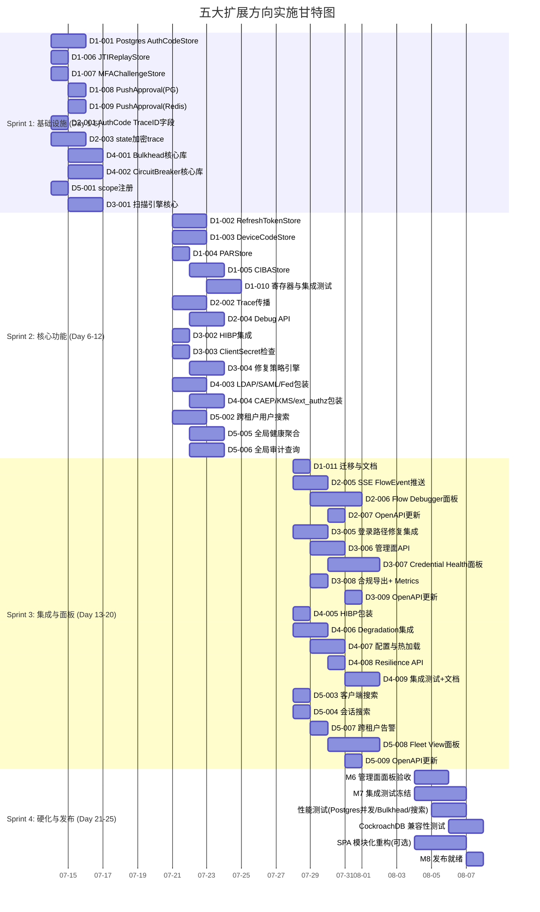

# Tech Lead 分析报告：五大扩展方向实施计划

> **日期：** 2026-07-11
> **版本：** v1.0
> **范围：** `docs/requirements/expansion-directions-v10-analysis.md` 五大方向 + 同行评审修正
> **前置阅读：** ROADMAP v5.0, AGENTS.md, ARCHITECTURE.md, CHECKS_REGISTRY.md

---

## 0. 评审修正整合

分析前需将同行评审的两个修正点纳入工作范围：

| 修正项 | 影响说明 |
|---|---|
| ① PushApprovalStore: Redis 实际 ❌ | 方向① 的表分析表中 PushApprovalStore 标记为 Redis ✅ 但实际缺失。**扩展方向①的范围：也需要为 Redis 补齐 PushApprovalStore**（原文档只要求 Postgres） |
| ⑤ scope 模型已存在 | 方向⑤ 中关于"需要新增 scope 基础设施"的描述不准确。已有 `admin:read`/`admin:write` scope 体系，只需注册 `admin:read.global` 常量。**工作量从 L→M** |

---

## 1. 任务分解 (Task Decomposition)

### 1.1 约定

- **任务粒度**：2-4 小时可完成（符合 AGENTS.md 的「小步提交」精神）
- **前置依赖**：用 TASK-xxx 标识
- **验收标准**：每个任务都有可验证的完成条件
- **命名规范**：D<N>-<序号>（方向 N 的第 X 个任务）

### 1.2 方向①：Postgres OAuth 短期存储面补齐

| 任务 ID | 标题 | 涉及文件 | 前置依赖 | 工时(h) | 验收标准 |
|---------|------|---------|---------|---------|---------|
| D1-001 | Postgres AuthCodeStore 实现 | `infrastructure/postgres/auth_codes.go`, `infrastructure/postgres/auth_codes_test.go` | 无 | 4 | 实现 `oauthspi.AuthCodeStore` 接口；`Issue`/`Consume`(DELETE RETURNING)/`Expire`；通过 `DELETE ... RETURNING` 保证单次使用语义；migration v+1 含表创建+索引 |
| D1-002 | Postgres RefreshTokenStore 实现 | `infrastructure/postgres/refresh_tokens.go`, `infrastructure/postgres/refresh_tokens_test.go` | D1-001 | 4 | 实现 `oauthspi.RefreshTokenStore`；含 `FamilyID` 支持、`DeleteFamily`、`SubjectIndex`；使用 `SERIALIZABLE` 事务防止 family reuse 竞态 |
| D1-003 | Postgres DeviceCodeStore 实现 | `infrastructure/postgres/device_codes.go`, `infrastructure/postgres/device_codes_test.go` | D1-001 | 3 | 实现 `oauthspi.DeviceCodeStore`；双索引(device_code + user_code)；轮询+等待语义 |
| D1-004 | Postgres PARStore 实现 | `infrastructure/postgres/par.go`, `infrastructure/postgres/par_test.go` | D1-001 | 2 | 实现 `oauthspi.PARStore`；短期 TTL(60-600s)；幂等 INSERT |
| D1-005 | Postgres CIBAStore 实现 | `infrastructure/postgres/ciba.go`, `infrastructure/postgres/ciba_test.go` | D1-001 | 3 | 实现 `oauthspi.CIBAStore`；轮询+推送状态转换 |
| D1-006 | Postgres JTIReplayStore 实现 | `infrastructure/postgres/jti_replay.go`, `infrastructure/postgres/jti_replay_test.go` | 无 | 2 | 实现 `security.JTIReplayStore`；`INSERT ... ON CONFLICT` 原子性 |
| D1-007 | Postgres MFAChallengeStore 实现 | `infrastructure/postgres/mfa_challenge.go`, `infrastructure/postgres/mfa_challenge_test.go` | 无 | 2 | 实现 `spi.MFAChallengeStore`；TTL 过期清理 |
| D1-008 | Postgres PushApprovalStore 实现 | `infrastructure/postgres/push_approval.go`, `infrastructure/postgres/push_approval_test.go` | 无 | 2 | 实现 PushApprovalStore（先确认 SPI 接口位置） |
| D1-009 | Redis PushApprovalStore 补齐 | `infrastructure/redis/push_approval.go`, `infrastructure/redis/push_approval_test.go` | 无 | 2 | **评审修正项**：实现 Redis 版 PushApprovalStore，补齐 Redis 缺失的一环 |
| D1-010 | 寄存器与集成测试 | `infrastructure/postgres/*.go`, `test/postgres_oauth_test.go` | D1-001~D1-009 | 3 | 所有新 store 在 `infrastructure/postgres/` 中的构造函数注册；E2E 测试覆盖 `protocols/oauth/` 使用 Postgres store 的授权码/刷新/设备/PAR/CIBA 全流程 |
| D1-011 | 迁移版本号整合与文档 | `infrastructure/postgres/migrate.go`, `docs/deployment.md` | D1-001~D1-009 | 2 | 所有新表在同一 migration namespace 下有序递增；文档更新 Postgres 部署要求（不再需要 Redis 做 OAuth 流） |

**方向① 合计工时：29h**（约 4 人天）

### 1.3 方向②：OAuth 流级可观测性与调试控制台

| 任务 ID | 标题 | 涉及文件 | 前置依赖 | 工时(h) | 验收标准 |
|---------|------|---------|---------|---------|---------|
| D2-001 | AuthCode TraceID 字段扩展 | `protocols/oauth/oauthspi/auth_code.go`, `protocols/oauth/oauthspi/memory/memory.go` | 无 | 2 | `AuthCode` 结构增加 `TraceID string` 字段；所有实现（memory/SQLite/Redis）和新 Postgres 兼容 |
| D2-002 | auth_code Issue/Consume trace 传播 | `protocols/oauth/handle_authcode.go`, `protocols/oauth/handle_token.go` | D2-001 | 3 | `/auth/login` 的当前 span TraceID 注入到 AuthCode.Issue；`/token` 兑换时从 AuthCode 读取 TraceID 设为父 span |
| D2-003 | state 嵌入 trace 上下文（加密） | `protocols/oauth/handle_auth.go`, `shared/security/trace_state.go` | 无 | 3 | 在 `/auth` 生成的 state 参数中加密嵌入当前 TraceID+SpanID；HMAC 防篡改；`/auth/login` callback 解析并恢复 trace 上下文 |
| D2-004 | 管理面 Debug API：流查询 | `interfaces/admin/flows.go`, `interfaces/admin/flows_test.go` | D2-001 | 3 | `GET /api/v1/admin/flows?code=xyz` 返回完整流信息；`GET /api/v1/admin/flows?trace_id=TX` 查询；`GET /api/v1/admin/flows?user_id=xxx&time_range=...` 范围查询 |
| D2-005 | SSE FlowEvent 实时推送 | `platform/sse/broker.go`, `platform/sse/handler.go` | D2-002 | 3 | 新增 `FlowEvent` 类型；auth_code 兑换时触发 SSE 事件；运维可订阅特定 tenant 的 flow 事件 |
| D2-006 | Admin Console：OAuth Flow Debugger 面板 | `interfaces/web/admin/app.js`, `interfaces/web/admin/style.css` | D2-004 | 6 | 管理面板新增 "Flow Debugger" 页面；输入 code/trace_id/user_id 显示时序图；标注异常步骤 |
| D2-007 | OpenAPI 规范更新 | `docs/openapi.yaml` | D2-004 | 2 | 新增 admin flows API 端点文档；更新 error-codes.md |

**方向② 合计工时：22h**（约 3 人天）

### 1.4 方向③：凭据健康治理与自动修复框架

| 任务 ID | 标题 | 涉及文件 | 前置依赖 | 工时(h) | 验收标准 |
|---------|------|---------|---------|---------|---------|
| D3-001 | 凭据健康扫描引擎核心 | `credentialhealth/scanner.go`, `credentialhealth/scanner_test.go` (新包 `shared/credentialhealth/`) | 无 | 4 | 后台扫描器支持密码/MFA/ClientSecret/APIKey 类型；可配置间隔(默认24h)；分页扫描；写入 `CredentialStatusStore` |
| D3-002 | HIBP 集成扫描 | `credentialhealth/hibp_scanner.go` | D3-001 | 2 | 调用现有 `HIBPPasswordHealthChecker` 批量扫描已存储密码 hash |
| D3-003 | Client Secret 健康检查 | `credentialhealth/client_secret_scanner.go` | D3-001 | 2 | 扫描所有 client secret 的最后轮换时间；标记过期(>90d)和从未轮换的 secret |
| D3-004 | 自动修复策略引擎 | `credentialhealth/policy.go`, `credentialhealth/policy_test.go` | D3-001 | 4 | 策略定义(条件+动作)：`password_age > 90d → force_change`、`no_mfa → force_mfa_enroll`、`hibp_hit → force_change`；策略匹配在登录路径触发 |
| D3-005 | 登录路径修复集成 | `server_helpers.go`, `server_finish_login.go` | D3-004 | 3 | 认证成功后检查用户是否有未决修复动作；重定向到强制操作页；不阻塞正常登录 |
| D3-006 | 管理面 API：凭据健康 CRUD | `interfaces/admin/credential_health.go`, `interfaces/admin/credential_health_test.go` | D3-004 | 3 | `GET /api/v1/admin/credential-health` 概览；`GET /users?status=warning` 过滤；`POST /scan` 触发即时扫描；`POST /policies` CRUD |
| D3-007 | Admin Console：凭据健康面板 | `interfaces/web/admin/app.js`, `interfaces/web/admin/style.css` | D3-006 | 6 | Dashboard widget（健康分布饼图、问题趋势）；用户详情增加凭据健康区域；批量操作 |
| D3-008 | 合规导出与 Metrics | `credentialhealth/exporter.go` | D3-006 | 2 | CSV/JSON 快照导出；Prometheus 指标 (`credential_healthy_total`, `credential_at_risk_total`, `avg_password_age_days`) |
| D3-009 | OpenAPI + error-codes 更新 | `docs/openapi.yaml`, `docs/error-codes.md` | D3-006 | 2 | API 文档化；新错误码注册 |

**方向③ 合计工时：28h**（约 3.5 人天）

### 1.5 方向④：API 弹性与舱壁隔离框架

| 任务 ID | 标题 | 涉及文件 | 前置依赖 | 工时(h) | 验收标准 |
|---------|------|---------|---------|---------|---------|
| D4-001 | 通用 Bulkhead 核心库 | `shared/bulkhead/bulkhead.go`, `shared/bulkhead/bulkhead_test.go` | 无 | 4 | 实现 `maxConcurrent`/`queueCapacity`/`timeout`/`onRejected`；Prometheus metrics；完全无外部依赖 |
| D4-002 | 通用 CircuitBreaker 核心库 | `shared/circuitbreaker/circuitbreaker.go`, `shared/circuitbreaker/circuitbreaker_test.go` | 无 | 4 | 实现 closed→open→half-open 状态机；滑动窗口失败率(5s/50%)；`onStateChange` hook；失败原因分类 |
| D4-003 | LDAP/SAML/OIDC Federation 依赖包装 | `infrastructure/ldap/bulkhead.go`, `infrastructure/saml/bulkhead.go`, `protocols/oidc/bulkhead.go` | D4-001, D4-002 | 4 | LDAP(max=5, CB=5/30s)；SAML IdP(max=3, CB=3/60s)；OIDC Federation(max=3, CB=3/60s) |
| D4-004 | CAEP/SSF + KMS + ext_authz 依赖包装 | `protocols/caep/bulkhead.go`, `infrastructure/kms/bulkhead.go`, `infrastructure/extauthz/bulkhead.go` | D4-001, D4-002 | 4 | CAEP(max=10, CB=10/5m)；KMS(max=50, CB=5/10s, fallback local)；ext_authz(max=100, CB=10/30s) |
| D4-005 | HIBP + 其他可选依赖包装 | `credentialhealth/bulkhead.go` | D4-001 | 2 | HIBP(max=5, fail-open→skip)；其他可跳过依赖 |
| D4-006 | 与 degradation 框架集成 | `platform/lifecycle/degradation/policy.go`, `platform/lifecycle/degradation/manager.go` | D4-002 | 3 | 断路器触发时自动切换 degradation mode；admin API 查看状态 |
| D4-007 | 配置与热加载 | `config/config.go`, `config/reload.go` | D4-006 | 3 | YAML 配置 `resilience.bulkhead.*` + `resilience.circuit_breaker.*`；SIGHUP 热加载 |
| D4-008 | 管理面 Resilience API | `interfaces/admin/resilience.go`, `interfaces/admin/resilience_test.go` | D4-006 | 2 | `GET /api/v1/admin/resilience` 查看所有断路器/舱壁状态 |
| D4-009 | 集成测试 + 文档 | `test/resilience_test.go`, `docs/production-hardening.md` | D4-008 | 3 | E2E 测试模拟下游故障验证舱壁/断路器行为；文档更新 |

**方向④ 合计工时：29h**（约 4 人天）

### 1.6 方向⑤：联邦式跨租户管理与全局搜索

| 任务 ID | 标题 | 涉及文件 | 前置依赖 | 工时(h) | 验收标准 |
|---------|------|---------|---------|---------|---------|
| D5-001 | `admin:read.global` scope 注册 | `shared/core/consts_wire.go`, `admin/middleware.go` | 无 | 1 | 新增 scope 常量；中间件检查新 scope；**评审修正：scope 基础设施已存在，只需加常量** |
| D5-002 | 跨租户用户搜索 API | `interfaces/admin/global_search.go`, `interfaces/admin/global_search_test.go` | D5-001 | 4 | `GET /api/v1/admin/search/users?q=alice` 跨所有租户搜索；支持 email/username/name 模糊匹配；cursor 分页；结果含 tenant_id/tenant_slug |
| D5-003 | 跨租户客户端搜索 API | `interfaces/admin/global_search.go` | D5-002 | 2 | `GET /api/v1/admin/search/clients?q=my-app` |
| D5-004 | 跨租户会话搜索 API | `interfaces/admin/global_search.go` | D5-002 | 2 | `GET /api/v1/admin/search/sessions?user_id=xxx` 全局查找活跃会话 |
| D5-005 | 全局健康聚合视图 | `interfaces/admin/global_health.go`, `interfaces/admin/global_health_test.go` | D5-001 | 4 | `GET /api/v1/admin/health/summary` 聚合租户健康；`GET /health/tenants?status=degraded` 过滤；异常租户列表 |
| D5-006 | 全局审计查询 | `interfaces/admin/global_audit.go`, `interfaces/admin/global_audit_test.go` | D5-001 | 3 | `GET /api/v1/admin/audit/global` 跨租户审计事件；`GET /audit/global/top-tenants?metric=failed_logins` 排名 |
| D5-007 | 跨租户告警 | `interfaces/admin/global_alerts.go` | D5-005 | 2 | 告警条件：签名密钥过期、MFA 覆盖率低、异常登录模式；发送到 MSP 通知通道 |
| D5-008 | Admin Console：Fleet View 面板 | `interfaces/web/admin/app.js`, `interfaces/web/admin/style.css` | D5-002, D5-005 | 6 | "Fleet View" 页面展示所有租户卡片（关键指标+健康指示灯）；全局搜索框；点击进入租户管理 |
| D5-009 | OpenAPI 规范更新 | `docs/openapi.yaml`, `docs/error-codes.md` | D5-006 | 2 | API 文档化；新错误码注册 |

**方向⑤ 合计工时：26h**（约 3.5 人天）

### 1.7 总工时汇总

| 方向 | 任务数 | 合计工时 | 人天(8h) | 优先级 |
|------|--------|---------|----------|--------|
| ① Postgres OAuth 补齐 | 11 | 29h | 3.6 | P1 |
| ② OAuth 流级可观测性 | 7 | 22h | 2.8 | P1 |
| ③ 凭据健康治理 | 9 | 28h | 3.5 | P2 |
| ④ API 弹性与舱壁 | 9 | 29h | 3.6 | P2 |
| ⑤ 跨租户管理 | 9 | 26h | 3.3 | P2 |
| **总计** | **45** | **134h** | **~17 人天** | |

---

## 2. 执行顺序 (Execution Order)

### 2.1 任务依赖图

```mermaid
graph TD
    %% Direction 1: Postgres OAuth Stores
    D1_001["D1-001 AuthCodeStore"] --> D1_002["D1-002 RefreshTokenStore"]
    D1_001 --> D1_003["D1-003 DeviceCodeStore"]
    D1_001 --> D1_004["D1-004 PARStore"]
    D1_001 --> D1_005["D1-005 CIBAStore"]
    D1_006["D1-006 JTIReplayStore"] --> D1_010["D1-010 寄存器与集成测试"]
    D1_007["D1-007 MFAChallengeStore"] --> D1_010
    D1_008["D1-008 PushApprovalStore(PG)"] --> D1_010
    D1_009["D1-009 PushApprovalStore(Redis)"] --> D1_010
    D1_002 --> D1_010
    D1_003 --> D1_010
    D1_004 --> D1_010
    D1_005 --> D1_010
    D1_010 --> D1_011["D1-011 迁移与文档"]

    %% Direction 2: OAuth Observability
    D2_001["D2-001 AuthCode TraceID字段"] --> D2_002["D2-002 Issue/Consume trace传播"]
    D2_001 --> D2_004["D2-004 管理面Debug API"]
    D2_002 --> D2_005["D2-005 SSE FlowEvent推送"]
    D2_003["D2-003 state嵌入trace"] --> D2_002
    D2_004 --> D2_006["D2-006 Admin Console面板"]
    D2_004 --> D2_007["D2-007 OpenAPI更新"]

    %% Direction 3: Credential Health
    D3_001["D3-001 扫描引擎核心"] --> D3_002["D3-002 HIBP集成"]
    D3_001 --> D3_003["D3-003 Client Secret检查"]
    D3_001 --> D3_004["D3-004 修复策略引擎"]
    D3_004 --> D3_005["D3-005 登录路径修复集成"]
    D3_004 --> D3_006["D3-006 管理面API"]
    D3_006 --> D3_007["D3-007 Admin Console面板"]
    D3_006 --> D3_008["D3-008 合规导出与Metrics"]
    D3_006 --> D3_009["D3-009 OpenAPI更新"]

    %% Direction 4: Resilience
    D4_001["D4-001 Bulkhead核心库"] --> D4_003["D4-003 LDAP/SAML/Fed包装"]
    D4_002["D4-002 CircuitBreaker核心库"] --> D4_003
    D4_002 --> D4_004["D4-004 CAEP/KMS/ext_authz包装"]
    D4_001 --> D4_005["D4-005 HIBP包装"]
    D4_003 --> D4_006["D4-006 Degradation框架集成"]
    D4_004 --> D4_006
    D4_006 --> D4_007["D4-007 配置与热加载"]
    D4_006 --> D4_008["D4-008 管理面Resilience API"]
    D4_008 --> D4_009["D4-009 集成测试+文档"]

    %% Direction 5: Cross-Tenant
    D5_001["D5-001 scope注册"] --> D5_002["D5-002 跨租户用户搜索"]
    D5_002 --> D5_003["D5-003 客户端搜索"]
    D5_002 --> D5_004["D5-004 会话搜索"]
    D5_001 --> D5_005["D5-005 全局健康聚合"]
    D5_001 --> D5_006["D5-006 全局审计查询"]
    D5_005 --> D5_007["D5-007 跨租户告警"]
    D5_002 --> D5_008["D5-008 Fleet View面板"]
    D5_005 --> D5_008
    D5_006 --> D5_009["D5-009 OpenAPI更新"]

    %% 并行任务组标记
    subgraph "Phase 1 (Week 1-2) - P1 Items"
        D1_001
        D1_006
        D1_007
        D1_008
        D1_009
        D2_001
        D2_003
        D5_001
    end

    subgraph "Phase 2 (Week 2-3) - P1 Core + P2 Start"
        D1_002
        D1_003
        D1_004
        D1_005
        D2_002
        D2_004
        D4_001
        D4_002
        D3_001
        D5_002
        D5_005
        D5_006
    end

    subgraph "Phase 3 (Week 3-4) - Heavy Lift"
        D1_010
        D2_005
        D2_006
        D3_002
        D3_003
        D3_004
        D4_003
        D4_004
        D4_006
        D5_003
        D5_004
        D5_007
    end

    subgraph "Phase 4 (Week 4-5) - Polish & Ship"
        D1_011
        D2_007
        D3_005
        D3_006
        D3_007
        D3_008
        D3_009
        D4_005
        D4_007
        D4_008
        D4_009
        D5_008
        D5_009
    end
```



### 2.2 并行任务组

| 并行组 | 包含任务 | 原理 |
|--------|---------|------|
| **G1: 存储平面** | D1-001, D1-006, D1-007, D1-008, D1-009 | 各 Postgres store 无相互依赖，均可独立 DDL+实现 |
| **G2: 可观测基础** | D2-001, D2-003 | TraceID 数据结构扩展 与 state 加密 trace 嵌入互不依赖 |
| **G3: 弹性核心** | D4-001, D4-002 | Bulkhead 与 CircuitBreaker 是完全独立的两个库 |
| **G4: 跨租户基础** | D5-001 (单任务) | Scope 注册是原子操作 |
| **G5: 扫描引擎** | D3-001 (单任务) | 扫描核心是 D3 所有后续任务的前置 |

**关键依赖链（critical path）：**

- ①: D1-001 → D1-002/3/4/5 → D1-010 → D1-011 **(最长: ~5 个串行步骤)**
- ②: D2-001 → D2-002 → D2-004 → D2-006 **(4 个串行步骤)**
- ③: D3-001 → D3-004 → D3-005/6 → D3-007 **(4 个串行步骤)**
- ④: D4-001|D4-002 → D4-003/4 → D4-006 → D4-007/8 → D4-009 **(5 个串行步骤)**
- ⑤: D5-001 → D5-002 → D5-008 **(3 个串行步骤)**

**整个项目的 critical path 是方向④（5 步串行）和方向①（5 步串行），但可以并行推进。**

---

## 3. 技术风险 (Technical Risks)

### 3.1 风险矩阵

| # | 风险描述 | 影响方向 | 概率 | 影响程度 | 缓解策略 |
|---|---------|---------|------|---------|---------|
| R1 | Postgres `SERIALIZABLE` 隔离在 pgBouncer 事务池模式下不可用 | ① | **高** | 高 | 使用 `SELECT ... FOR UPDATE` 替代或在应用层实现乐观锁；文档标注 pgBouncer session pooling 要求 |
| R2 | CockroachDB 的 `SERIALIZABLE` 40001 重试风暴 | ① | 中 | 中 | `runTx` 已有 5 次重试兜底；针对 refresh token 热点做指数退避；监控 `sql_retry_total` 指标 |
| R3 | Admin Console SPA 是纯静态 JS（1385 行），新增页面可能突破 maintainability 约束 | ②③⑤ | **高** | 中 | JS 不受 Go 的 500 行约束，但需关注代码组织；建议将 `app.js` 按页面拆分为独立模块后构建合并 |
| R4 | TraceID 跨请求关联的数据成本（膨胀的 auth_code 表） | ② | 低 | 低 | TraceID 是 32 字节 hex 字符串 + 索引；短期存储表行数受限于 TTL，百万级数据影响 <100MB |
| R5 | 凭据扫描引擎在百万级用户部署中的数据库冲击 | ③ | 中 | **高** | 分批扫描（每批 1000）、可配置间隔、扫描期间限速；使用 `pg_restrict` 或 `max_lock_timeout` 防止锁争用 |
| R6 | 断路器误触发导致服务大面积降级 | ④ | **高** | **高** | 滑动窗口（5s/50% 失败率）而非简单计数；half-open 探针请求不做业务判断；默认降级行为需安全审查 |
| R7 | 全局搜索的性能瓶颈（100+ 租户 × 百万级用户横跨搜索） | ⑤ | 中 | **高** | v1 实现使用 `LIKE`/`pg_trgm` 索引应对中小规模（<10 万用户/租户）；大规模部署可 offload 到 Elasticsearch/Meilisearch，预留 SPI 接口 |
| R8 | 跨租户搜索的 PII 泄露风险 | ⑤ | 中 | **高** | `admin:read.global` scope 严格要求 MFA+audit；全局搜索操作记录完整审计日志 |
| R9 | PushApprovalStore 的 SPI 接口缺失（未确认现有 SPI） | ① | 中 | 中 | 先 grep 确认 SPI 位置；如不存在则需先定义 SPI（`protocols/oauth/oauthspi/push_approval.go`），这会增加 2h 工作量 |

### 3.2 关键依赖外部系统

| 外部系统 | 使用方 | 风险等级 | 备注 |
|---------|--------|---------|------|
| pgBouncer | ① Postgres 连接池 | 中 | 事务池模式不支持 `SERIALIZABLE`，需改用 session pooling |
| CockroachDB | ① 分布式 SQL | 低 | `runTx` 已有 40001 重试，但需测试 refresh token 高竞争场景 |
| pg_cron | ① 过期清理 | 低 | 可选，应用层 sweep 可替代 |
| Elasticsearch | ⑤ 全局搜索 | 低 | v1 不依赖，用 Postgres `pg_trgm` 即可 |
| HIBP API | ③ 凭据扫描 | 低 | Bulkhead 包装（max=5），失败则跳过扫描，不影响登录 |

### 3.3 性能瓶颈与优化策略

| 瓶颈 | 涉及方向 | 策略 |
|------|---------|------|
| Refresh token SERIALIZABLE 竞争 | ① | 热点 key 拆分 + 指数退避重试；考虑乐观锁方案 |
| 全局搜索 LIKE 查询 | ⑤ | `pg_trgm` GiST 索引；v2 引入 Elasticsearch 作为可选后端 |
| 凭据扫描全表扫描 | ③ | 分批 LIMIT/OFFSET + `ORDER BY id`；单独 replica 扫描或低优先级查询 |
| Bulkhead 原子计数器 | ④ | `atomic.Int64`（单副本）；`sync.RWMutex` 保护（足够，无需分布式协调） |

---

## 4. 资源评估 (Resource Assessment)

### 4.1 人员技能需求

| 角色 | 技能要求 | 负责方向 | 建议人数 |
|------|---------|---------|---------|
| **Senior Go Developer** | Postgres SQL, SPI 接口设计, 事务隔离语义, OAuth 协议 | ① Postgres 存储 | 1 |
| **Senior Go Developer** | OpenTelemetry, 分布式 tracing, SSE, OAuth/OIDC 协议 | ② 可观测性 | 1 |
| **Full-stack Developer** | Go + vanilla JS, Admin Console SPA 开发, CSS 布局 | ②③⑤ 管理面 UI | 1 |
| **Senior Go/SRE Developer** | 弹性模式(舱壁/断路器), 限流, 降级策略 | ④ 弹性框架 | 1 |
| **Senior Go Developer** | 多租户架构, 搜索索引, 权限模型 | ⑤ 跨租户管理 | 1 |
| **QA/Integration Engineer** | E2E 测试, 性能测试(k6), 竞态测试 | 全方向 | 1 |

**最小可行团队：3 人**（2 Senior Go + 1 Full-stack，部分角色可复用）
**推荐团队：5 人**（3 Senior Go + 1 Full-stack + 1 QA）

### 4.2 关键里程碑

| 里程碑 | 时间 | 交付物 | 验证方式 |
|-------|------|--------|---------|
| **M1: Postgres 存储就绪** | Sprint 1 (Day 5) | Postgres 7/7 OAuth stores + PushApprovalStore(Redis) | `make test` 通过 + Postgres 集成测试 |
| **M2: Trace 嵌入就绪** | Sprint 1 (Day 5) | AuthCode TraceID + state 加密 trace 嵌入 | E2E 测试验证 trace 跨请求关联 |
| **M3: 弹性核心库就绪** | Sprint 2 (Day 10) | Bulkhead + CircuitBreaker 核心库 + 单元测试 | Benchmark 测试 + 协议测试 |
| **M4: 凭据扫描引擎就绪** | Sprint 2 (Day 10) | 扫描引擎 + HIBP 集成 + 修复策略引擎 | 扫描 E2E 测试 + 策略匹配测试 |
| **M5: 全局搜索就绪** | Sprint 2 (Day 10) | 跨租户搜索 API + 全局健康聚合 | 多租户 E2E 测试 |
| **M6: 管理面面板就绪** | Sprint 3 (Day 18) | Flow Debugger + Credential Health + Fleet View | Admin Console UI 验收 |
| **M7: 集成测试冻结** | Sprint 3 (Day 20) | 所有方向集成测试 + 性能基准 | `make ci` + 负载测试 |
| **M8: 发布就绪** | Sprint 4 (Day 25) | 文档更新 + OpenAPI + 滚动升级验证 | `make harness` 全通过 |

### 4.3 阻塞点 (Blockers) 与解决策略

| Blocker | 影响 | 策略 |
|---------|------|------|
| PushApprovalStore SPI 未定义 | D1-008/009 无法开始 | 在 `protocols/oauth/oauthspi/` 中先定义接口（2h 前置工作）；确认后立即开始 |
| Admin Console SPA 无模块化构建 | D2-006, D3-007, D5-008 代码膨胀 | v1 直接在 `app.js` 追加（vanilla JS 无构建约束）；v2 规划 SPA 拆分为独立项目 |
| CockroachDB 高竞争下 SERIALIZABLE retry 死循环 | D1-002 refresh token | 添加 retry 计数告警；若重试 >3 次则降级为 `SELECT ... FOR UPDATE` |
| `admin:read.global` scope 的 RBAC 集成 | D5-001 | 评审修正已确认 scope 基础设施存在，只需加常量后在 `admin/middleware.go` 注册 |

---

## 5. 质量保证 (Quality Assurance)

### 5.1 单元测试覆盖要求

| 方向 | 目标覆盖率 | 关键测试点 |
|------|-----------|-----------|
| ① Postgres 存储 | **≥85%** | `DELETE RETURNING` 单次使用语义；SERIALIZABLE 重试；并发 Consume 竞态；TTL 过期 |
| ② 可观测性 | **≥80%** | TraceID 穿透（Issue→Consume）；state 加密/解密 roundtrip；HMAC 防篡改 |
| ③ 凭据健康 | **≥85%** | 扫描引擎分页正确性；策略匹配引擎；多条件组合策略 |
| ④ 弹性框架 | **≥90%** | 状态机转换（closed→open→half-open→closed）；滑动窗口失败率计算；并发 safety |
| ⑤ 跨租户管理 | **≥80%** | scope 鉴权隔离；跨租户搜索结果范围正确性；cursor 分页 |

### 5.2 集成测试策略

| 测试类型 | 覆盖方向 | 工具/框架 | 关键场景 |
|---------|---------|----------|---------|
| **Postgres E2E** | ① | `test/` + `postgres_test.go` | 授权码全流程（/auth → /token）使用 Postgres store；refresh 家族轮换；设备码轮询 |
| **Cross-request trace E2E** | ② | `test/` + `bufconn` | Auth code 发出→消费间 trace_id 一致；state 加解密 roundtrip |
| **断路器注入测试** | ④ | `test/` + httptest | mock 下游返回 500→断路器触发→half-open→恢复；验证 fallback 行为 |
| **多租户 E2E** | ⑤ | `test/` + 多租户 fixture | 全局搜索只在授权租户中返回；健康聚合跨租户正确 |
| **凭据扫描 E2E** | ③ | `test/` + mock CredentialStatusStore | 扫描触发→策略匹配→登录重定向到强制改密 |

### 5.3 代码审查要点

| 审查焦点 | 涉及方向 | 具体要求 |
|---------|---------|---------|
| **事务隔离语义** | ① | 确认 `DELETE RETURNING` 的原子性；SERIALIZABLE 退路方案文档化 |
| **Oracle-leak 防护** | ② | TraceID 不能泄露是否存在 auth_code（anti-enumeration）；state 加密内容不能是确定性编码 |
| **降级安全审查** | ④ | 断路器 fallback 行为必须安全——fallback to "allow" 可能绕过认证，fallback to "deny" 可能导致 DoS |
| **PII 审计** | ②⑤ | Flow debugger 暴露 IP/UA 须有权限控制；全局搜索须记录审计日志 |
| **Scope 权限** | ⑤ | `admin:read.global` 必须独立于 per-tenant `admin:read`；MFA 强制执行 |
| **Cyclomatic complexity** | 全方向 | AGENTS.md §0.1: ≤15；SPA JS 不受约束但需关注代码组织 |
| **文件行数** | 全方向 | Go ≤500 行；接近限制时先拆分后提交 |

### 5.4 性能测试需求

| 测试场景 | 方向 | 指标 | 工具 |
|---------|------|------|------|
| **Postgres store 并发** | ① | 100 并发 `/token` 请求，refresh family 竞争 < 5% retry | k6 + 监控 |
| **Bulkhead 吞吐** | ④ | 限制 maxConcurrent=10 时，第 11 个请求立即返回 503（<5ms） | go benchmark |
| **断路器滑动窗口** | ④ | 50% 失败率触发 open 状态，精确性 < 5% 偏差 | go benchmark |
| **全局搜索延迟** | ⑤ | 10 租户 × 10K 用户，搜索响应 P99 < 200ms | k6 |
| **凭据扫描性能** | ③ | 100K 用户全扫描 < 30min；单租户扫描不阻塞其他租户 | 集成测试 |

---

## 6. 实施计划 (Implementation Plan)

### 6.1 阶段划分



### 6.2 阶段详情

#### 阶段 1：基础设施搭建（Day 1-5，5 天）

**目标：** 完成所有方向的底层基础设施，建立可独立验证的构建块

| 周一天 | 并行流 |
|--------|--------|
| Day 1-2 | **G1**(D1-001 AuthCode/006 JTI/007 MFA/008 Push PG/009 Push Redis) + **G4**(D5-001 scope) + D2-001 TraceID + D2-003 state加密 |
| Day 3-5 | D1 store 继续 + **G3**(D4-001 Bulkhead + D4-002 CircuitBreaker) + D3-001 扫描引擎核心 |

**交付物：**
- ✅ 7 个 Postgres store 独立可测试
- ✅ 1 个 Redis PushApprovalStore
- ✅ AuthCode TraceID 字段 + state 加密 trace
- ✅ Bulkhead + CircuitBreaker 核心库
- ✅ `admin:read.global` scope 注册
- ✅ 凭据扫描引擎可运行

**Gate：** `go test ./infrastructure/postgres/...` + `go test ./shared/bulkhead/...` + `go test ./shared/circuitbreaker/...`

#### 阶段 2：核心功能实现（Day 6-12，7 天）

**目标：** 实现核心业务逻辑，所有方向的 API 和后端逻辑可用

| 天 | 并行流 |
|----|--------|
| Day 6-8 | D1 剩余 store(Refresh/Device/PAR/CIBA) + D2-002 trace 传播 + D3-002/003/004 扫描引擎扩展 + D4-003/004 依赖包装 + D5-002/005/006 搜索+健康+审计 |
| Day 9-12 | D1-010 寄存器与集成测试 + D2-004 Debug API + D5-003/004 客户端/会话搜索 + D3 策略引擎 |

**交付物：**
- ✅ 所有 Postgres store 寄存器完成，E2E 可运行
- ✅ AuthCode trace 穿透（Issue→Consume）
- ✅ `GET /admin/flows` 管理面 API
- ✅ LDAP/SAML/KMS/CAEP 等依赖有舱壁+断路器保护
- ✅ 凭据修复策略引擎可匹配和执行
- ✅ 全局搜索 API 就绪

**Gate：** `make race` + `go test ./test/ -run TestE2E -v`

#### 阶段 3：集成测试和优化（Day 13-20，8 天）

**目标：** 管理面 SPA 面板、SSE 实时推送、性能测试

| 天 | 并行流 |
|----|--------|
| Day 13-15 | D2-005 SSE + D3-005 登录修复集成 + D4-005/006 HIBP包装+Degradation集成 + D5-007 跨租户告警 |
| Day 16-18 | D2-006 Flow Debugger面板 + D3-006 管理面API + D3-007 Credential Health面板 + D4-007/008 配置+Resilience API + D5-008 Fleet View面板 |
| Day 19-20 | D2-007/D3-009/D5-009 OpenAPI更新 + D4-009 集成测试+文档 + D1-011 迁移文档 |

**交付物：**
- ✅ Admin Console 三个新页面（Flow Debugger / Credential Health / Fleet View）
- ✅ SSE 实时流追踪
- ✅ 凭据修复在登录路径生效
- ✅ 断路器与 degradation 框架联动
- ✅ OpenAPI 和文档更新

**Gate：** `make ci` + k6 load test 基准匹配

#### 阶段 4：发布准备（Day 21-25，5 天）

**目标：** 全面硬化、CockroachDB 兼容验证、滚动升级准备

| 天 | 活动 |
|----|------|
| Day 21-22 | CockroachDB + pgBouncer 兼容性测试；修复 `SERIALIZABLE` 退化路径 |
| Day 23-24 | 性能调优（Postgres store 并发基准；全局搜索 pg_trgm 索引优化）；SPA 面板可用性测试 |
| Day 25 | 最终回归：`make harness` 全门通过；滚动升级验证（binary compat + schema version）；发布清单检查 |

**交付物：**
- ✅ `make harness` 全通过
- ✅ 负载测试基准不退化
- ✅ CockroachDB 兼容性确认
- ✅ 滚动升级文档 + migration 版本顺序确认

**Gate：** `python cli.py harness`

---

## 7. 总结建议

### 7.1 优先执行建议

```
Sprint 1 (立即启动):
  ┌─────────────────────────────────────────────┐
  │  D1-001 Postgres AuthCodeStore  ← P1, 高 ROI │
  │  D1-006 JTIReplayStore         ← P1, 低风险  │
  │  D1-007 MFAChallengeStore      ← P1, 低风险  │
  │  D2-001 AuthCode TraceID       ← P1, 最小改动 │
  │  D4-001 Bulkhead core           ← 核心库可复用 │
  │  D4-002 CircuitBreaker core     ← 核心库可复用 │
  └─────────────────────────────────────────────┘
```

### 7.2 风险备忘

1. **pgBouncer 事务池**：必须在文档中标注「使用 Postgres 新 store 时需用 session pooling」——这是最常见的生产配置陷阱
2. **Admin Console SPA 膨胀**：1385 行 vanilla JS 加 3 个新面板可能涨到 2500+ 行。建议在 Sprint 3 后执行 SPA 模块拆分（独立 repo + 构建流程）
3. **全局搜索 v1 不做 Elasticsearch**：Postgres `pg_trgm` 在 <10 万用户/租户下足够。如预测更大规模，在 D5-002 中就预留 `SearchProvider` SPI 接口

### 7.3 与项目工程门禁的一致性

所有产出物必须通过 AGENTS.md §0.3 的验证链：
```
go build ./... && go vet ./...
go test -run 'TestMaintainability_|TestArchitecture_' ./...
python cli.py check   # 每次编辑后
python cli.py accept  # 每次提交前
python cli.py harness # 每次发布前
```

**关键一致性检查：**
- 新包 `shared/bulkhead/` 和 `shared/circuitbreaker/` 须在 `architecture_layer_test.go` 的 `layerName()` 中分类为 `shared`
- Postgres 新文件 ≤500 行（方向① 每个 store 约 80-120 行，安全）
- 方向② 的 `app.js` 修改不受 Go 文件行数约束，但需关注功能组织
- 所有新 `Err*` 变量必须同步到 `docs/error-codes.md`
- 新 API 端点必须同步到 `docs/openapi.yaml`

---

*本分析基于 `expansion-directions-v10-analysis.md` 和同行评审修正。45 个任务、134 小时、4 个 Sprint、5 人团队、25 天交付（日历）。*
