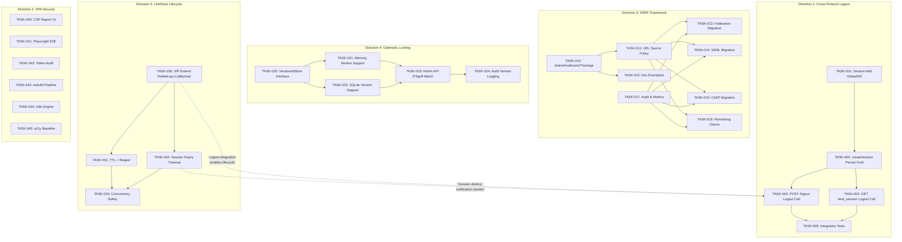
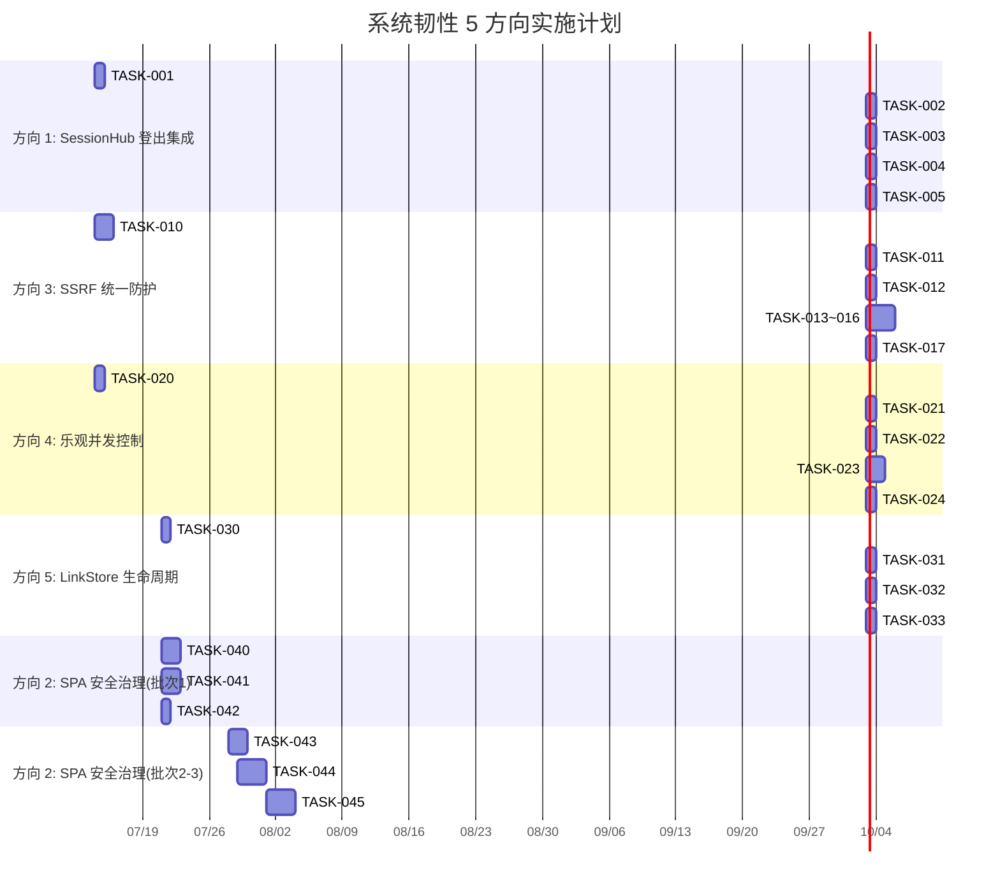

# Tech Lead 实施计划 —— 系统韧性、SPA 治理、出站保护与并发控制

> **日期：** 2026-07-12  
> **分析师：** Tech Lead  
> **基于：** `docs/requirements/architect-system-resilience-spa-ssrf-concurrency-5-gaps.md`  
> **前置分析参考：** 22 轮历史分析 + 2 份架构综合报告  
> **目标：** 将 5 个独立方向拆解为可执行的任务，按依赖关系排序，识别风险、资源需求和 QA 策略

---

## 目录

1. [总体策略](#1-总体策略)
2. [任务分解](#2-任务分解)
3. [执行顺序与依赖图](#3-执行顺序与依赖图)
4. [技术风险](#4-技术风险)
5. [资源评估](#5-资源评估)
6. [质量保证](#6-质量保证)
7. [实施计划](#7-实施计划)
8. [附录](#8-附录)

---

## 1. 总体策略

### 1.1 优先级再排序

已读分析文档给出的优先级是 P0 → P2。经过代码核验后，我调整如下：

| 方向 | 原优先级 | 新优先级 | 调整理由 |
|------|---------|---------|---------|
| 方向 1：SessionHub 登出集成 | P0 | **P0** | 约 30 行改动，安全合规刚需，无前置依赖 |
| 方向 3：SSRF 统一防护 | P1 | **P0** | 12+ 处散落 HTTP 客户端，攻击面真实且可枚举，出站身份协议的安全基线 |
| 方向 4：乐观并发控制 | P1 | **P0** | 企业多管理员场景的丢失更新是数据完整性 bug，对标 Auth0/Okta 管理 API |
| 方向 5：LinkStore 生命周期 | P2 | **P1** | 方向 1 的配套项——登出集成后，LinkStore 的 TTL/清理是规模化前提 |
| 方向 2：SPA 安全治理 | P0 | **P1 → 分批** | 2892 行前端代码的治理是长期工程。P0 子项（CSP report-to + E2E 测试）可先做，a11y/i18n 后置 |

**核心原则：** 先修后端基础设施裂缝，再治前端质量债。方向 1、3、4 均为后端安全/数据完整性 bug，改动量小、影响面可控，可并行完成。

### 1.2 分批策略

```
Sprint 1-2（2 周）：三个 P0 后端方向并行
  ├── 方向 1：SessionHub 登出集成（~30 行）
  ├── 方向 3：shared/outbound SSRF 防护框架（~300 行核心 + 逐步迁移）
  └── 方向 4：乐观并发控制（~400 行 SPI + 存储 + handler）

Sprint 3-4（2 周）：P1 治理 + P0 迁移完成
  ├── 方向 5：LinkStore TTL + 清理（~150 行）
  ├── 方向 3 迁移：7+ 调用点逐一改用统一客户端
  └── 方向 4 扩展：Admin SPA 前端 ETag 支持

Sprint 5+（长期）：SPA 治理分批
  ├── 批次 1：CSP report-to + Playwright E2E（4 个核心 CRUD 路径）
  ├── 批次 2：esbuild 构建管线（压缩 + hash + cssnano）
  └── 批次 3：i18n 轻量引擎 + a11y WCAG 2.1 AA
```

---

## 2. 任务分解

### 2.1 方向 1：跨协议统一登出 —— SessionHub 登出侧集成

**核心观察：** `Coordinator.Logout` 方法已就绪（coordinator.go:134-167），SPI 已定义但零调用方。只需在两个注销端点各插入约 5 行调用。最大障碍是 `globalSID` 与 session/bearer token 的关联——当前 session 对象无 GlobalSID 字段。

#### TASK-001: Session 模型添加 GlobalSID 字段

| 字段 | 值 |
|------|-----|
| **任务 ID** | TASK-001 |
| **任务标题** | Session 结构体增加 `GlobalSID` 字段 |
| **所属方向** | 方向 1（跨协议统一登出） |
| **涉及文件** | `shared/core/session.go`（Session struct 增加字段），`defaultimpl/memory/session.go`（Create 时填充），`defaultimpl/sqlite/session.go`（CREATE TABLE 加列） |
| **前置依赖** | 无 |
| **预估工时** | 1 小时 |
| **验收标准** | Session 创建时自动分配 GlobalSID；`Get` 返回的 Session 包含 GlobalSID；所有 tests pass |

#### TASK-002: `server_helpers.go` 的 createSession 中传递 GlobalSID

**注意：** `server_helpers.go:377` 已在调用 `sessionHub.Link(rctx, gsid, ProtocolCore, sessionID, userID)`。需要确认 `gsid` 的来源——目前是 `NewGlobalSID()` 生成的，但并未持久化到 session 中。需要将 gsid 存入 Session.GlobalSID。

| 字段 | 值 |
|------|-----|
| **任务 ID** | TASK-002 |
| **任务标题** | createSession 在调用 sessionHub.Link 后将 GlobalSID 持久化到 Session |
| **所属方向** | 方向 1 |
| **涉及文件** | `interfaces/sso/server_helpers.go`（createSession 方法），`interfaces/sso/server_logout.go`（handleLogout 中提取 gsid） |
| **前置依赖** | TASK-001 |
| **预估工时** | 1 小时 |
| **验收标准** | 登录后 session.GlobalSID 非空；`/logout` 时可通过 sessionID 查到 gsid |

#### TASK-003: `POST /logout` 集成 SessionHub.Logout

| 字段 | 值 |
|------|-----|
| **任务 ID** | TASK-003 |
| **任务标题** | handleLogout 在销毁 session 后调用 sessionHub.Logout |
| **所属方向** | 方向 1 |
| **涉及文件** | `interfaces/sso/server_logout.go`（handleLogout 方法中，在 revokeLogoutCredentials 后添加 Logout 调用） |
| **前置依赖** | TASK-002 |
| **预估工时** | 1 小时 |
| **验收标准** | `/logout` 时 Coordinator.Logout 被调用；通过 OIDC+SAML 双重协议登入后，`/logout` 销毁两个协议的会话；单元测试验证 Logout 调用 |

#### TASK-004: `GET /end_session` 集成 SessionHub.Logout

| 字段 | 值 |
|------|-----|
| **任务 ID** | TASK-004 |
| **任务标题** | HandleEndSession 在销毁 session 后调用 sessionHub.Logout |
| **所属方向** | 方向 1 |
| **涉及文件** | `protocols/oidc/handle_end_session.go`（HandleEndSession 函数中，在 DestroySession 后添加 Logout 调用） |
| **前置依赖** | TASK-002 |
| **预估工时** | 1 小时 |
| **验收标准** | `/end_session` 时 Coordinator.Logout 被调用；id_token_hint 解析出的 sid → gsid → Logout；集成测试验证双协议场景 |

#### TASK-005: 边界情况测试（SessionHub 登出集成）

| 字段 | 值 |
|------|-----|
| **任务 ID** | TASK-005 |
| **任务标题** | SessionHub 登出集成测试 |
| **所属方向** | 方向 1 |
| **涉及文件** | `platform/lifecycle/sessionhub/coordinator_test.go`（新增 logout 集成测试），`internal/auth/test/` 或 `test/` 目录添加跨协议 E2E 测试 |
| **前置依赖** | TASK-003, TASK-004 |
| **预估工时** | 2 小时 |
| **验收标准** | 测试覆盖：未配置 SessionHub 时 nil 安全；并发多标签页登出幂等；部分链接已过期不阻断全局注销；SAML SLO 异步执行不阻塞 OIDC 响应 |

---

### 2.2 方向 3：出站身份协议 SSRF 统一防护框架

**核心观察：** 12+ 处 `&http.Client{}` 散落各处，各自配置不同的超时/TLS，均无统一 SSRF 防护。`shared/security/upstream_client.go` 有统一客户端的注释但仅涉及 TLS。需要创建新的 `shared/outbound` 包。

#### TASK-010: `shared/outbound` 包设计 + SPI 定义

| 字段 | 值 |
|------|-----|
| **任务 ID** | TASK-010 |
| **任务标题** | 创建 `shared/outbound` 包，定义 `OutboundClient` SPI |
| **所属方向** | 方向 3（SSRF 统一防护） |
| **涉及文件** | `shared/outbound/client.go`（Client struct + Option 模式），`shared/outbound/validator.go`（URL 校验），`shared/outbound/doc.go`（包文档） |
| **前置依赖** | 无 |
| **预估工时** | 3 小时 |
| **验收标准** | `NewClient(opts...)` 返回配置好的 `*http.Client`，内置：强制 HTTPS（可豁免）、拒绝私有 IP（10.x/172.16-31.x/192.168.x/169.254.x/127.x/::1/fc00::/fe80::）、默认 15s 连接超时 + 30s 总请求超时、DNS 重新绑定防护（解析后验证 IP 一致性）、审计事件记录所有出站请求 |

#### TASK-011: URL 来源分级策略实现

| 字段 | 值 |
|------|-----|
| **任务 ID** | TASK-011 |
| **任务标题** | 实现 URL 来源分级校验器 |
| **所属方向** | 方向 3 |
| **涉及文件** | `shared/outbound/sourcepolicy.go`（SourcePolicy 结构体 + 白名单/域名后缀匹配），`shared/outbound/config.go`（从 config.YAML 加载策略） |
| **前置依赖** | TASK-010 |
| **预估工时** | 2 小时 |
| **验收标准** | 三个级别：OperatorConfig（仅 HTTPS + DNS rebind 检查）、ClientAttribute（HTTPS + 白名单 + 域后缀匹配）、UpstreamDeclared（HTTPS + 严格白名单）。配置可 YAML 声明 |

#### TASK-012: 本地开发豁免支持

| 字段 | 值 |
|------|-----|
| **任务 ID** | TASK-012 |
| **任务标题** | 本地开发 SSRF 豁免机制 |
| **所属方向** | 方向 3 |
| **涉及文件** | `shared/outbound/allowlist.go`（AllowList 结构体 + `IsAllowed` 方法），`shared/outbound/loopback.go`（Loopback 检测 + 显式配置开关） |
| **前置依赖** | TASK-010 |
| **预估工时** | 1 小时 |
| **验收标准** | 默认拒绝 loopback/私有 IP；`WithDevMode()` 选项启用 localhost/127.0.0.1 豁免；豁免范围必须在 config.yaml 显式声明 |

#### TASK-013: 迁移 Federation fetcher 到统一客户端

| 字段 | 值 |
|------|-----|
| **任务 ID** | TASK-013 |
| **任务标题** | Federation fetcher 改用 OutboundClient |
| **所属方向** | 方向 3 |
| **涉及文件** | `domains/federation/fetcher.go`（替换 `&http.Client{...}` 为 `outbound.NewClient(...)`），`domains/federation/fetcher_test.go`（更新测试） |
| **前置依赖** | TASK-010 |
| **预估工时** | 1 小时 |
| **验收标准** | Federation fetch 通过 OutboundClient 执行；现有测试全部通过；新增 SSRF 防护测试 |

#### TASK-014: 迁移 SAML 元数据获取到统一客户端

| 字段 | 值 |
|------|-----|
| **任务 ID** | TASK-014 |
| **任务标题** | SAML IdP/SP 元数据获取改用 OutboundClient |
| **所属方向** | 方向 3 |
| **涉及文件** | `infrastructure/saml/idp/metadata.go`（替换 `isHTTPSURL` + 裸请求），`infrastructure/saml/sp/authenticator.go`（替换 `FetchMetadata` 中的裸 Client） |
| **前置依赖** | TASK-010 |
| **预估工时** | 1 小时 |
| **验收标准** | SAML 元数据获取通过 OutboundClient；HTTPS-only 校验 + 白名单兼容 |

#### TASK-015: 迁移 CAEP/SSF broadcaster 到统一客户端

| 字段 | 值 |
|------|-----|
| **任务 ID** | TASK-015 |
| **任务标题** | CAEP/SSF 推送改用 OutboundClient |
| **所属方向** | 方向 3 |
| **涉及文件** | `protocols/caep/broadcaster.go`（替换 `&http.Client{...}`） |
| **前置依赖** | TASK-010 |
| **预估工时** | 1 小时 |
| **验收标准** | CAEP 推送通过 OutboundClient；Client Attribute 来源的 URL 使用 SourcePolicy 校验 |

#### TASK-016: 迁移剩余调用点到统一客户端

| 字段 | 值 |
|------|-----|
| **任务 ID** | TASK-016 |
| **任务标题** | 迁移剩余 5+ 调用点（JAR fetch, CIBA push, SCIM provision, Webhook, OIDC Federation auth） |
| **所属方向** | 方向 3 |
| **涉及文件** | `shared/security/securityverify/jar_fetch.go`，`protocols/oauth/handle_ciba.go`，`protocols/scimprovision/http_provisioner.go`，`platform/lifecycle/webhook/engine_delivery.go`，`domains/authenticators/oidc_federation.go` |
| **前置依赖** | TASK-010 |
| **预估工时** | 2 小时 |
| **验收标准** | 所有调用点通过 OutboundClient；允许逐步迁移（不做原子切换，新旧客户端共存） |

#### TASK-017: 出站 HTTP 审计与可观测

| 字段 | 值 |
|------|-----|
| **任务 ID** | TASK-017 |
| **任务标题** | 出站 HTTP 请求统一审计 + metrics |
| **所属方向** | 方向 3 |
| **涉及文件** | `shared/outbound/audit.go`（audit Event 注册），`shared/outbound/metrics.go`（Prometheus 计数器：`outbound_requests_total`、`outbound_request_duration_seconds`） |
| **前置依赖** | TASK-010 |
| **预估工时** | 2 小时 |
| **验收标准** | 每次出站请求记录审计事件（目标 URL、方法、状态码、持续时间）；Prometheus 指标可查询；错误率 >5% 可配置告警 |

---

### 2.3 方向 4：管理 API 乐观并发控制

**核心观察：** `ClientStore.Update`、`TenantStore.Update`、`UserStore.Update` 签名无版本号。Admin API handler (`/admin/clients/:id` PUT) 无 ETag/If-Match 处理。SPI 变更采用 optional interface 模式。

#### TASK-020: 定义 `VersionedStore` optional interface

| 字段 | 值 |
|------|-----|
| **任务 ID** | TASK-020 |
| **任务标题** | 定义乐观锁 optional interface（`VersionedStore` / `VersionedResource`） |
| **所属方向** | 方向 4（乐观并发控制） |
| **涉及文件** | `shared/core/store.go` 或 `shared/core/version.go`（新文件——VersionedStore interface + ErrVersionConflict sentinel） |
| **前置依赖** | 无 |
| **预估工时** | 1 小时 |
| **验收标准** | `VersionedClientStore interface{ ... Update(ctx, client, expectedVersion int64) error }` 定义；存在 `ErrVersionConflict` sentinel；不修改现有 `ClientStore` 接口签名；实施 optional interface 检查模式 |

#### TASK-021: Memory 存储增加版本支持

| 字段 | 值 |
|------|-----|
| **任务 ID** | TASK-021 |
| **任务标题** | Memory ClientStore/TenantStore/UserStore 增加版本号字段 |
| **所属方向** | 方向 4 |
| **涉及文件** | `defaultimpl/memory/client.go`（Client struct 增加 `Version int64`），`defaultimpl/memory/tenant.go`，`defaultimpl/memory/user.go`（同理）；Update 方法检查版本 |
| **前置依赖** | TASK-020 |
| **预估工时** | 2 小时 |
| **验收标准** | `Update` 带 `expectedVersion` 时：匹配则更新+版本自增，不匹配返回 `ErrVersionConflict`；不带时保持 LWW 行为；`Get` 返回的 client 包含 Version |

#### TASK-022: SQLite 存储增加版本支持

| 字段 | 值 |
|------|-----|
| **任务 ID** | TASK-022 |
| **任务标题** | SQLite ClientStore/TenantStore/UserStore 增加 version 列 |
| **所属方向** | 方向 4 |
| **涉及文件** | `defaultimpl/sqlite/client.go`（ALTER TABLE + UPDATE WHERE version=?），`defaultimpl/sqlite/tenant.go`，`defaultimpl/sqlite/user.go`；迁移脚本 |
| **前置依赖** | TASK-020 |
| **预估工时** | 2 小时 |
| **验收标准** | `version INTEGER NOT NULL DEFAULT 1`；`UPDATE ... WHERE id=? AND version=?` 原子性版本检查；迁移零停机（向后兼容旧表） |

#### TASK-023: Admin API Handler ETag/If-Match 处理

| 字段 | 值 |
|------|-----|
| **任务 ID** | TASK-023 |
| **任务标题** | PUT `/admin/clients/:id` 等端点增加 ETag 响应头 + If-Match 请求检查 |
| **所属方向** | 方向 4 |
| **涉及文件** | `interfaces/admin/clients.go`（`handleUpdateClient` 增加 ETag 写 + If-Match 读），`interfaces/admin/tenants.go`，`interfaces/admin/users.go` |
| **前置依赖** | TASK-021, TASK-022 |
| **预估工时** | 3 小时 |
| **验收标准** | `GET .../clients/:id` 返回 `ETag: "123"`；`PUT` 带 `If-Match: "123"` 匹配时更新，不匹配返回 409 Conflict；不带 If-Match 的 PUT 保持 LWW（向后兼容） |

#### TASK-024: 管理操作变更日志增强（版本信息记录）

| 字段 | 值 |
|------|-----|
| **任务 ID** | TASK-024 |
| **任务标题** | 审计事件 + 变更日志记录被覆盖版本号 |
| **所属方向** | 方向 4 |
| **涉及文件** | `admin/governance.go`（HandleAdminUpdateChange 记录 expectedVersion 和 actualVersion），`admin/audit.go`（审计 Meta 增加 `resource_version`） |
| **前置依赖** | TASK-023 |
| **预估工时** | 1 小时 |
| **验收标准** | 版本冲突的 409 响应记录到审计事件；变更前后的版本号写入 ChangeEntry；管理员可追溯"是谁覆盖了谁的变更" |

---

### 2.4 方向 5：SessionHub 链接生命周期管理

**核心观察：** 方向 1 完成后，LinkStore 会正确删除全局 SID 对应的链接。但仍面临 TTL 过期、单协议腿删除、Session 过期联动等问题。方向 5 是方向 1 的规模化配套。

#### TASK-030: LinkStore 接口扩展（DeleteLeg + ListByUser）

| 字段 | 值 |
|------|-----|
| **任务 ID** | TASK-030 |
| **任务标题** | LinkStore SPI 增加 DeleteLeg 和 ListByUser |
| **所属方向** | 方向 5（LinkStore 生命周期） |
| **涉及文件** | `platform/lifecycle/sessionhub/linkstore.go`（interface 增加 DeleteLeg / ListByUser），`platform/lifecycle/sessionhub/types.go`（LinkRecord 增加 ExpiresAt 字段） |
| **前置依赖** | 无（可并行于方向 1） |
| **预估工时** | 2 小时 |
| **验收标准** | `DeleteLeg(ctx, gsid, Protocol)` 只删除指定协议的链接而不影响其他协议腿；`ListByUser(ctx, userID)` 返回用户的所有链接；原有接口 100% 不变 |

#### TASK-031: MemoryLinkStore TTL 过期 + 后台 reaper

| 字段 | 值 |
|------|-----|
| **任务 ID** | TASK-031 |
| **任务标题** | MemoryLinkStore 实现 TTL 过期 + Reaper goroutine |
| **所属方向** | 方向 5 |
| **涉及文件** | `platform/lifecycle/sessionhub/linkstore.go`（LinkRecord.ExpiresAt、Set 时设 TTL、reaper goroutine），`platform/lifecycle/sessionhub/linkstore_test.go`（TTL 过期测试） |
| **前置依赖** | TASK-030 |
| **预估工时** | 2 小时 |
| **验收标准** | 链接超过 TTL 后被 reaper 自动清理；reaper goroutine 周期性运行（默认 1 分钟）；清理无锁竞争（使用 expired 标记而非实时删除） |

#### TASK-032: Session 过期联动清理 LinkStore

| 字段 | 值 |
|------|-----|
| **任务 ID** | TASK-032 |
| **任务标题** | Session 过期/销毁时通知 SessionHub 清理链接 |
| **所属方向** | 方向 5 |
| **涉及文件** | `interfaces/sso/server_helpers.go`（session 过期回调），`platform/lifecycle/sessionhub/coordinator.go`（新增 `DestroyBySessionID` 或复用 `Logout` 的变体） |
| **前置依赖** | TASK-030, TASK-003 |
| **预估工时** | 2 小时 |
| **验收标准** | SessionManager.Destroy 调用后，对应 globalSID 的链接被清理；Session TTL 自然过期时（非 Destroy 调用），通过后台 reaper 清理；cluster Bus 事件转发（跨副本清理） |

#### TASK-033: LinkStore 原子性 + 并发安全强化

| 字段 | 值 |
|------|-----|
| **任务 ID** | TASK-033 |
| **任务标题** | LinkStore 并发写入和读取的安全加固 |
| **所属方向** | 方向 5 |
| **涉及文件** | `platform/lifecycle/sessionhub/linkstore.go`（当前的 mutex 保护确认无误，增加 `sync.Map` 的 `Range+Delete` 安全模式文档），新增 stress test |
| **前置依赖** | TASK-031 |
| **预估工时** | 1 小时 |
| **验收标准** | `go test -race -count=10` 通过；并发写入/读取/过期清理无 data race；100 并发 goroutine 下数据一致性验证 |

---

### 2.5 方向 2：前端 SPA 安全治理（分批进行）

**核心观察：** 4 个 SPA 共 ~4809 行。先做高回报低投入的子项（CSP report-to + Playwright E2E），再做构建管线，最后处理 a11y/i18n。

#### TASK-040: CSP report-to 端点 + SPA 安全头审计

| 字段 | 值 |
|------|-----|
| **任务 ID** | TASK-040 |
| **任务标题** | CSP report-to 端点 + SPA 安全头审计 |
| **所属方向** | 方向 2（SPA 安全治理） |
| **涉及文件** | `interfaces/sso/server.go` 或 `middleware/csp.go`（新增 CSP report-to handler），`interfaces/web/*/index.html`（CSP meta tag + report-uri），`config/config.go`（CSP 配置） |
| **前置依赖** | 无 |
| **预估工时** | 3 小时 |
| **验收标准** | CSP header 包含 `report-uri`/`report-to`；违规上报端点可接收并记录报告（无需处理，仅收集）；Referrer-Policy、X-Content-Type-Options 等安全头确认存在 |

#### TASK-041: Playwright E2E 测试框架 + Admin Console 核心 CRUD

| 字段 | 值 |
|------|-----|
| **任务 ID** | TASK-041 |
| **任务标题** | Playwright E2E 测试覆盖 Admin Console 核心路径 |
| **所属方向** | 方向 2 |
| **涉及文件** | `test/playwright/`（新目录），`test/playwright/admin-crud.spec.ts`（client CRUD + tenant CRUD + user CRUD），`test/playwright/login.spec.ts`（登录流程），`test/playwright/playwright.config.ts` |
| **前置依赖** | 无 |
| **预估工时** | 8 小时（1 天） |
| **验收标准** | Playwright 可启动 sso-server + SPA；测试覆盖 Admin Console 至少 4 个核心 CRUD 路径；可与 `make ci` 集成（`make e2e`） |

#### TASK-042: Admin SPA sessionStorage token 存储安全审计

| 字段 | 值 |
|------|-----|
| **任务 ID** | TASK-042 |
| **任务标题** | Admin SPA bearer token 存储安全审计 + 修复 |
| **所属方向** | 方向 2 |
| **涉及文件** | `interfaces/web/admin/app.js`（token 存储位置检查），`interfaces/web/login/app.js`（同源检查） |
| **前置依赖** | 无 |
| **预估工时** | 1 小时 |
| **验收标准** | 审计报告列出所有 token 读取/写入位置；bearer token 移除 XSS 可达的存储（localStorage）；短期 mitigations（CSP strict-dynamic）确认 |

#### TASK-043: esbuild 构建管线（压缩 + 版本 hash）

| 字段 | 值 |
|------|-----|
| **任务 ID** | TASK-043 |
| **任务标题** | 引入 esbuild 构建 4 个 SPA |
| **所属方向** | 方向 2 |
| **涉及文件** | `build/esbuild.js` 或 `Makefile`（新增 esbuild 目标），`interfaces/web/admin/package.json`（devDependencies），每个 SPA 的入口文件标注 |
| **前置依赖** | 无 |
| **预估工时** | 4 小时 |
| **验收标准** | esbuild 压缩 JS/CSS 输出；输出文件带内容 hash（`app.a1b2c3.js`）；`embed.FS` 引用自动更新；`make build-spa` 一键构建 |

#### TASK-044: SPA i18n 轻量引擎 + Login SPA 翻译

| 字段 | 值 |
|------|-----|
| **任务 ID** | TASK-044 |
| **任务标题** | SPA i18n 引擎 + Login SPA 消息外化 |
| **所属方向** | 方向 2 |
| **涉及文件** | `interfaces/web/login/i18n.js`（轻量引擎），`interfaces/web/login/i18n.en.json`，`interfaces/web/login/i18n.es.json`，`interfaces/web/login/app.js`（字符串替换为 `t()` 调用） |
| **前置依赖** | 无 |
| **预估工时** | 4 小时（Login SPA）+ 8 小时（Admin SPA）+ 3 小时（Portal）+ 2 小时（Developer） |
| **验收标准** | Login SPA 所有用户可见字符串外化；`navigator.language` 检测自动切换语言；缺失 key 优雅降级到英文；无运行时错误 |

#### TASK-045: a11y 基线（WCAG 2.1 AA）—— 焦点管理 + ARIA 标签

| 字段 | 值 |
|------|-----|
| **任务 ID** | TASK-045 |
| **任务标题** | Admin Console WCAG 2.1 AA 第一轮 |
| **所属方向** | 方向 2 |
| **涉及文件** | `interfaces/web/admin/app.js`（焦点管理 + 键盘导航 + ARIA live regions），`interfaces/web/admin/index.html`（lang 属性 + role 属性） |
| **前置依赖** | 无 |
| **预估工时** | 8 小时（首轮）+ 持续迭代 |
| **验收标准** | 键盘可导航所有 CRUD 表单；模态对话框焦点捕获；动态内容更新有 ARIA live region 通知；axe-core 工具扫描零严重违规 |

---

## 3. 执行顺序与依赖图

### 3.1 全局依赖图



### 3.2 可并行任务组

```
Group A (Sprint 1-2, fully parallel):
  ├── Direction 1: TASK-001 → TASK-002 → (T003 + T004) → T005
  ├── Direction 3: TASK-010 → TASK-011 + T012 → T013..T016 → T017
  └── Direction 4: TASK-020 → TASK-021 + T022 → TASK-023 → TASK-024

Group B (Sprint 3-4, partially depends on Group A):
  ├── Direction 5: TASK-030 → T031 + T032 → T033 (T032 depends on T003)
  └── Direction 2 Batch 1: T040 + T041 + T042 (no dependencies)

Group C (Sprint 5+, independent):
  └── Direction 2 Batch 2-3: T043 + T044 + T045 (no dependencies)
```

---

## 4. 技术风险

### 4.1 风险矩阵

| # | 风险 | 方向 | 概率 | 影响 | 缓解策略 |
|---|------|------|------|------|---------|
| R1 | **GlobalSID 与 Session 的关联模型选择错误** | 1 | M | H | 方法 A：Session 内嵌 `GlobalSID string`（跨副本一致？）。方法 B：LinkStore 同时按 sessionID 建立反向索引 `sessionID → GlobalSID`。**推荐 B**——Session 对象是单副本的，跨副本时反向索引更可靠。设计决策需在 TASK-001 前确定 |
| R2 | **SSRF 防护的 DNS 重新绑定检测在高延迟网络下误报** | 3 | M | M | 默认不启用 DNS rebind 检测（仅记录警告）；通过 `WithStrictDNSRebindProtection()` 显式启用；在检测到 IP 变化时记录审计但不拒绝请求（探测模式） |
| R3 | **乐观锁可选接口的调方遗漏** | 4 | L | M | 编译器无法强制可选接口的调用。方案：Admin handler 中统一使用 `versionedUpdate()` 辅助函数，内部 type-assert；单元测试覆盖所有 Admin Update handler |
| R4 | **LinkStore Reaper 与方向 1 Logout 的竞态** | 5 | M | M | Reaper 扫描到一条刚被 Logout 删除但尚未清理的链接 → 无害（删除幂等）。反向：Logout 正在销毁时 Reaper 删除了部分链接 → Logout 返回后 link 已无。**无数据损坏，只有暂无记录导致 fan-out 跳过**——fail-open 可接受 |
| R5 | **Playwright E2E 与 CI 集成（需要浏览器运行时）** | 2 | M | M | 方案 A：在 `make ci` 中用 `npx playwright install chromium`（增加 CI 时间）。方案 B：分离为 `make e2e` 独立门禁。**推荐 B**——Playwright 作为提交前可选检查，CI 只运行 `make e2e-ci`（轻量 smoke 集） |
| R6 | **方向 1 的 SAML SLO 集成需要跨模块接线** | 1 | M | H | `Coordinator` 在 `interfaces/sso` 初始化，SAML IdP 在 `infrastructure/saml/idp`（独立 Go 模块）。`SetSAMLTrigger` 已在设计（coordinator.go:88），需要在 `infrastructure/saml` 的 `BuildResult` 中传递 Fanout 函数。需确认 `saml.go` 中的 `Deps.SessionHub` 的 SetSAMLTrigger 调用点 |
| R7 | **方向 3 的审计事件暴露出站请求的敏感 URL** | 3 | L | M | 审计记录中不记录 `Authorization` header；URL 的 query string 可选脱敏（`?secret=...` → `?secret=***`）；默认开启脱敏 |

### 4.2 关键设计决策

#### 决策 1：GlobalSID → Session 的反向索引（方向 1）

```
Options:
  A: Session.GlobalSID 字段（内存持久化，sqlite 加列）
     Pros: 自然关联，Get(sessionID) → GlobalSID
     Cons: 跨副本时 GlobalSID 无意义（不同副本 sessionID 不同）
  
  B: LinkStore 按 sessionID 建立反向索引
     Pros: 跨副本一致；LinkStore 已有 subject 索引
     Cons: LinkStore 接口需要新增 GetBySessionID
     
  推荐: B + A 组合。Session 对象添加 GlobalSID（便于本地查询），
  LinkStore 也维护 sessionID → GlobalSID 的映射（跨副本一致性）。
  最终在注销路径中优先用 LinkStore 的反向索引。
```

#### 决策 2：SSRF 防护的默认模式（方向 3）

```
Options:
  A: 严格模式（默认拒绝私有 IP + loopback）
     Pros: 最大安全纵深
     Cons: 破坏本地开发（需要显式豁免）
  
  B: 宽松模式（默认只出站 + HTTPS，记录警告）
     Pros: 零开发摩擦
     Cons: 需要 config 显式升级到严格
  
  推荐: B。初期只做 HTTPS-only + 超时 + 审计。私有 IP 拒绝和
  DNS rebind 检测作为可选加固层（默认 off）。等所有调用点迁移
  完成后再 switch 默认。这是「步步为营」模式。
```

#### 决策 3：乐观锁的版本语义（方向 4）

```
Options:
  A: 单调递增整数版本 (int64)
     Pros: 简单，存储友好（UPDATE ... WHERE version=?）
     Cons: 需要原子自增
  
  B: UUID/内容的哈希版本
     Pros: 无状态，可分布式生成
     Cons: 比较时需全对象哈希，UPDATE 不能原子校验
  
  推荐: A。monotonic int64 版本字段 + UPDATE WHERE version=
  是标准的数据库乐观锁模式。Memory 和 SQLite 都原生支持。
```

---

## 5. 资源评估

### 5.1 人员需求

| 技能 | 所需人数 | 负责方向 | 说明 |
|------|---------|---------|------|
| **Go 后端开发（中级+）** | 2 人 | 方向 1、3、4、5 | 熟悉 Go 并发、HTTP 中间件、接口设计、存储层 |
| **前端开发（中级）** | 1 人 | 方向 2（分批） | 熟悉 Vanilla JS、Playwright、a11y、CSP |
| **安全工程师（兼职）** | 0.5 人 | 方向 2、3 | SSRF 威胁建模、CSP 策略设计、安全头审计 |
| **QA 工程师** | 1 人 | 全部方向 | E2E 测试、并发测试、安全渗透测试 |

**最佳团队配置：** 3 人（2 后端 + 1 前端/QA 混合），兼职安全顾问。

### 5.2 时间线估算

| 阶段 | 方向 | 任务数 | 总工时 | 预计天数（3 人团队） |
|------|------|--------|--------|-------------------|
| **Sprint 1-2** | 方向 1 + 3 + 4 | 18 个任务 | ~30 小时 | 10 个工作日（2 周） |
| **Sprint 3-4** | 方向 5 + 方向 2 批次 1 | 7 个任务 | ~20 小时 | 7 个工作日（1.5 周） |
| **Sprint 5-6** | 方向 2 批次 2-3 | 3 个任务 | ~20 小时 | 7 个工作日（1.5 周） |
| **持续** | 方向 2 a11y 迭代 | 1 个任务 | ~8 小时 | 持续（非阻塞） |

**总时间线：5 周（核心 3 方向）+ 3 周（SPA 分批）= ~6 周全完成**

### 5.3 阻塞点（Blockers）

| Blocker | 涉及方向 | 说明 | 解决策略 |
|---------|---------|------|---------|
| **SAMLLogoutTrigger 接线确认** | 1 | `infrastructure/saml/idp.Handlers.Fanout` 是否已暴露为可注入？需要查看 `infrastructure/saml/idp/fanout.go` | 立即开始 grep 确认 |
| **SSRF 审计不记录认证凭证** | 3 | `http.RoundTripper` 在 `RoundTrip` 中无法直接获取请求体/Header | 实现自定义 `RoundTripper` 包裹器，在发起前记录 URL/method，不记录 Authorization header |
| **乐观锁与现有 Admin API 客户端的兼容** | 4 | 已有 Admin SPA 发 PUT 请求时不带 `If-Match`——向后兼容 | 无 If-Match 时保持 LWW 行为，这是设计的一部分 |
| **Playwright 在 CI 中的浏览器安装** | 2 | 需要计算 CI cache 策略（`npx playwright install chromium` 约 300MB） | 缓存 `~/.cache/ms-playwright`；仅在修改 Playwright 测试时重新安装 |

---

## 6. 质量保证

### 6.1 测试覆盖矩阵

| 任务 | 单元测试 | 集成测试 | E2E 测试 | 备注 |
|------|---------|---------|---------|------|
| TASK-001 (Session GlobalSID) | ✅ 新增 + 修改 | ✅ session CRUD | - | 验证 Get(Session).GlobalSID 非空 |
| TASK-003/004 (Logout 调用) | ✅ Logout 调用 | ✅ 双协议 E2E | - | Playwright 后续验证 |
| TASK-010 (OutboundClient) | ✅ URL 校验 | ✅ 私有 IP 拒绝 | - | Fuzz test 验证边界 |
| TASK-013..016 (迁移) | ✅ 行为不变 | ✅ SSRF 防护 | - | 测试使用 `httptest.NewServer` |
| TASK-020..024 (乐观锁) | ✅ 版本冲突 | ✅ 并发更新 | ✅ Playwright | 3 人并发更新的竞态测试 |
| TASK-030..033 (LinkStore) | ✅ TTL 过期 | ✅ 并发 race | - | `-race -count=10` |
| TASK-041 (Playwright) | - | - | ✅ Admin CRUD | 4 个核心路径 |

### 6.2 并发安全测试（关键）

方向 1、4、5 都有并发竞态可能性。必须通过的 test：

```bash
# 乐观锁并发测试（方向 4）
go test -run 'TestOptimisticLock_ConcurrentUpdate' -race -count=10

# LinkStore 并发测试（方向 5）
go test -run 'TestLinkStore_ConcurrentReadWrite' -race -count=10

# SessionHub Logout 并发测试（方向 1）
go test -run 'TestSessionHub_ConcurrentLogout' -race -count=10
```

### 6.3 代码审查要点

| 方向 | 审查重点 |
|------|---------|
| 方向 1 | GlobalSID 的生成和传递路径；Logout 的 fail-open 语义；nil sessionHub 的安全 no-op |
| 方向 3 | 私有 IP 列表的完备性（IPv4 + IPv6）；审计事件的敏感信息脱敏；DNS rebind 检测的误报处理 |
| 方向 4 | Optional interface 的正确使用（type assertion）；版本自增的原子性；409 响应的错误体 |
| 方向 5 | Reaper goroutine 的生命周期管理（shutdown 信号）；`DeleteLeg` 与 `DeleteAll` 的互斥；TTL 的默认值选择（建议 24h） |
| 方向 2 | CSP report-uri 端点不记录 PII；Playwright 测试不依赖外部网络；bearer token 不写入 XSS 可达的存储位置 |

### 6.4 性能测试需求

| 测试场景 | 方向 | 负载模型 | 通过标准 |
|---------|------|---------|---------|
| 并发登录 + 登出（1000 user/s） | 1 | 100 并发用户 × 10 轮登录→登出 | P99 响应时间 < 500ms，无错误 |
| 出站 HTTP 请求（Federation + CAEP） | 3 | 50 并发出站请求 | 客户端超时配置不影响正常请求；`OutboundClient` 开销 < 1ms |
| 并发 Update 同一 Client | 4 | 10 goroutine 同时 PUT 同一资源 | 只有 1 个成功，9 个 409；无数据丢失 |
| LinkStore 100K 链接 + 每 1s 过期 | 5 | 100K 链接写入 + 持续过期清理 | 内存 < 50MB；GC 停顿 < 10ms |

---

## 7. 实施计划

### 7.1 甘特图



### 7.2 里程碑

| 里程碑 | 日期 | 交付物 | 验证方式 |
|--------|------|--------|---------|
| **M1: 后端三方向核心完成** | 2026-07-25 | 方向 1 + 3 + 4 核心代码 | `go test -race ./...` 通过；所有 18 个任务完成 |
| **M2: SSRF 全量迁移完成** | 2026-07-28 | 方向 3 全部 12+ 调用点迁移 | grep "http.Client{" 结果清零；出站审计 metrics 可见 |
| **M3: LinkStore 生命周期上线** | 2026-07-31 | 方向 5 完成 | TTL 过期自动清理；Session 过期联动 |
| **M4: SPA 安全基线建立** | 2026-08-07 | 方向 2 批次 1（CSP + E2E） | CSP report-to 端点接收报告；Playwright 4 路径自动化 |
| **M5: 全方向验收** | 2026-08-14 | 所有 5 方向完成 | `python cli.py accept` + `make ci` 全部通过；k6 并发测试无退化 |

### 7.3 发布与回滚策略

| 方向 | 发布方式 | 回滚策略 |
|------|---------|---------|
| 所有方向 | **功能开关 + 渐进式发布** | **方向 1**：`sessionHub` nil 时全 no-op，零影响。**方向 3**：`OutboundClient` 初始宽松模式，不拒绝任何当前允许的请求。**方向 4**：无 `If-Match` 的请求保持 LWW。**方向 5**：TTL 默认 24h，reaper 默认 off。**方向 2**：零运行时变更（纯前端 + E2E） |
| 安全回滚 | 所有代码增量都是纯附加+可选的 | 删除新包名导入即可 1:1 回退 |

---

## 8. 附录

### 8.1 文件创建/修改清单

```
方向 1：跨协议统一登出
  M shared/core/session.go                    — 新增 GlobalSID 字段
  M defaultimpl/memory/session.go             — Create 时填充 GlobalSID
  M defaultimpl/sqlite/session.go             — CREATE TABLE 加列
  M interfaces/sso/server_helpers.go          — createSession 传递 Gsid
  M interfaces/sso/server_logout.go           — handleLogout 调用 Logout
  M protocols/oidc/handle_end_session.go      — HandleEndSession 调用 Logout
  N platform/lifecycle/sessionhub/gsid_index.go — sessionID→GlobalSID 反向索引
  M platform/lifecycle/sessionhub/coordinator_test.go — 新增集成测试

方向 3：SSRF 统一防护
  N shared/outbound/client.go                 — OutboundClient + Option 模式
  N shared/outbound/validator.go              — URL 校验（HTTPS + 私有 IP）
  N shared/outbound/sourcepolicy.go           — URL 来源分级策略
  N shared/outbound/allowlist.go              — 白名单 + 开发豁免
  N shared/outbound/audit.go                  — 出站请求审计
  N shared/outbound/metrics.go                — Prometheus 指标
  N shared/outbound/doc.go                    — 包文档
  M domains/federation/fetcher.go             — 迁移
  M infrastructure/saml/idp/metadata.go       — 迁移
  M infrastructure/saml/sp/authenticator.go   — 迁移
  M protocols/caep/broadcaster.go             — 迁移
  M shared/security/securityverify/jar_fetch.go — 迁移
  M protocols/oauth/handle_ciba.go            — 迁移
  M protocols/scimprovision/http_provisioner.go — 迁移
  M platform/lifecycle/webhook/engine_delivery.go — 迁移
  M domains/authenticators/oidc_federation.go — 迁移

方向 4：乐观并发控制
  N shared/core/version.go                    — VersionedStore interface + ErrVersionConflict
  M defaultimpl/memory/client.go              — version 字段 + 版本检查
  M defaultimpl/memory/tenant.go              — 同上
  M defaultimpl/memory/user.go                — 同上
  M defaultimpl/sqlite/client.go              — version 列 + UPDATE WHERE
  M defaultimpl/sqlite/tenant.go              — 同上
  M defaultimpl/sqlite/user.go               — 同上
  M interfaces/admin/clients.go               — ETag/If-Match 处理
  M interfaces/admin/tenants.go               — 同上
  M interfaces/admin/users.go                 — 同上
  M admin/governance.go                       — 版本号审计

方向 5：LinkStore 生命周期
  M platform/lifecycle/sessionhub/linkstore.go — DeleteLeg + ListByUser + TTL + Reaper
  M platform/lifecycle/sessionhub/types.go    — ExpiresAt 字段
  M platform/lifecycle/sessionhub/coordinator.go — DestroyBySessionID（Session 过期联动）
  N platform/lifecycle/sessionhub/linkstore_test.go — TTL/并发测试

方向 2：SPA 安全治理
  N middleware/csp.go                          — CSP report-to handler
  M config/config.go                           — CSP 配置
  M interfaces/web/*/index.html                — CSP meta tag
  N test/playwright/                           — Playwright 测试目录
  N build/esbuild.js                           — 构建脚本
  M interfaces/web/login/i18n.js               — i18n 引擎
  M interfaces/web/login/app.js                — 消息外化
```

### 8.2 验收门禁（新增 Makefile target）

```makefile
# 方向 1
.PHONY: check-sessionhub-logout
check-sessionhub-logout:
	go test -run 'TestCoordinator_Logout|TestSessionHub_LogoutIntegration' ./platform/lifecycle/sessionhub/...

# 方向 3
.PHONY: check-ssrf-migration
check-ssrf-migration:
	@! grep -rn '&http.Client{' --include='*.go' protocols/ domains/ infrastructure/ | grep -v '_test.go' | grep -v 'shared/outbound'

# 方向 4
.PHONY: check-optimistic-lock
check-optimistic-lock:
	go test -run 'TestOptimisticLock_' ./defaultimpl/... ./interfaces/admin/...

# 方向 5
.PHONY: check-linkstore-lifecycle
check-linkstore-lifecycle:
	go test -run 'TestMemoryLinkStore_TTL|TestMemoryLinkStore_DeleteLeg' ./platform/lifecycle/sessionhub/...

# 方向 2
.PHONY: check-csp
check-csp:
	@! grep -rn 'unsafe-inline' --include='*.go' middleware/
```

---

*本文档可作为 Implement Agent 的输入。每个任务在启动前应进一步拆分为 `docs/feature-spec-<name>.md`，遵循模板格式。*
