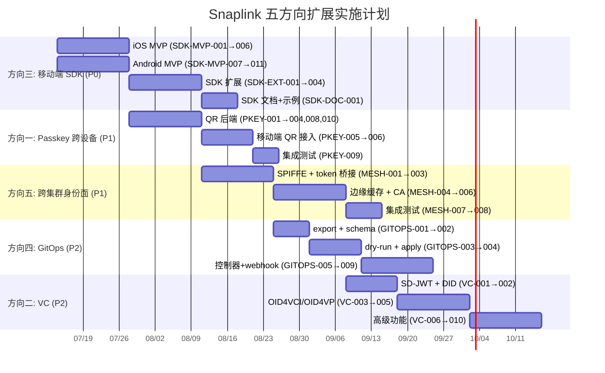

# Tech Lead 分析：Snaplink 下五个高价值扩展方向

> **分析日期**：2026-07-11  
> **分析角色**：Tech Lead  
> **输入文档**：`docs/requirements/high-value-expansion-directions.md`（~16KB）  
> **交叉引用**：`docs/deferred-backlog.md`、`docs/architecture/DIRECTORY_MAP.md`、`docs/agent-os/TODO.md`、`AGENTS.md`

---

## 0. 执行摘要

本文档对分析文档提出的五个方向进行**可执行化分解**。核心判断：

| 方向 | 优先级 | 可行性 | 前置依赖 | 建议启动时间 |
|---|---|---|---|---|
| **方向三**：原生移动端 SDK | P0 | 高（独立，无基础设施依赖） | 无 | 立即 |
| **方向一**：Passkey 跨设备认证 | P1 | 中高（依赖现有 WebAuthn） | 方向三（协同） | 方向三启动后 2 周 |
| **方向五**：跨集群工作负载身份面 | P1 | 中（需 SPIFFE + cluster.Bus 演进） | 方向四（部分重叠配置面） | Q3 |
| **方向四**：声明式 GitOps 身份基础设施 | P2 | 高（已有 configaudit、Drift CRD） | 无 | 方向三之后 |
| **方向二**：Verifiable Credentials | P2 | 中（标准未稳定，需跟踪） | 无 | Q4（待 eIDAS ARF 2.0） |

**关键协同**：方向三（移动 SDK）和方向一（Passkey 跨设备）存在强协同——移动 SDK 可作为 QR 码扫描的**本地桥接层**，建议联合规划。

---

## 1. 任务分解

### 1.1 方向三：原生移动端 SDK（P0）

| 任务 ID | 任务标题 | 涉及文件 | 前置依赖 | 预估工时 | 验收标准 |
|---|---|---|---|---|---|
| SDK-MVP-001 | iOS SDK 包结构 + Package.swift 脚手架 | `infrastructure/sdk/swift/`（新建） | 无 | 2h | `swift build` 通过，生成空 Framework |
| SDK-MVP-002 | OAuth 授权码 + PKCE 流程（iOS） | `swift/Sources/OAuth/AuthorizationFlow.swift`, `swift/Sources/OAuth/PKCE.swift` | SDK-MVP-001 | 4h | 可通过 ASWebAuthenticationSession 完成授权码交换 |
| SDK-MVP-003 | DPoP 原生支持（iOS SecKey） | `swift/Sources/DPoP/DPoPManager.swift` | SDK-MVP-002 | 4h | SecKey 生成的 DPoP proof 可通过服务端验证 |
| SDK-MVP-004 | Keychain Token 安全存储 | `swift/Sources/Storage/KeychainTokenStore.swift` | SDK-MVP-002 | 3h | Token 写入 Keychain 并在 App 重启后恢复 |
| SDK-MVP-005 | Token 自动刷新 + 旋转同步 | `swift/Sources/Auth/TokenRefresher.swift` | SDK-MVP-004 | 4h | Refresh token 过期前自动执行旋转，失败队列重试 |
| SDK-MVP-006 | iOS 最小可用 SDK 集成测试 | `swift/Tests/`（集成测试） | SDK-MVP-005 | 3h | 使用 mock server 完整的 OAuth 流程通过 |
| SDK-MVP-007 | Android SDK 包结构 + Gradle 脚手架 | `infrastructure/sdk/kotlin/`（新建） | 无 | 2h | `./gradlew build` 通过 |
| SDK-MVP-008 | OAuth 授权码 + PKCE 流程（Android） | `kotlin/snaplink-android/src/main/java/.../OAuthFlow.kt` | SDK-MVP-007 | 4h | Chrome Custom Tab 完成完整授权码交换 |
| SDK-MVP-009 | DPoP 原生支持（Android KeyStore） | `kotlin/.../DPoP/AndroidKeyStoreDPoP.kt` | SDK-MVP-008 | 4h | Android KeyStore 签名的 DPoP 通过验证 |
| SDK-MVP-010 | EncryptedSharedPreferences Token 存储 | `kotlin/.../Storage/SecureTokenStore.kt` | SDK-MVP-008 | 3h | Token 写入 EncryptedSharedPreferences 并在 App 恢复 |
| SDK-MVP-011 | Android 最小可用 SDK 集成测试 | `kotlin/.../tests/` | SDK-MVP-010 | 3h | 使用 mock server 完整流程通过 |
| SDK-EXT-001 | App Attestation 服务端验证端点（iOS DeviceCheck） | `protocols/oauth/handle_attestation.go`（新建） | SDK-MVP-006 | 4h | 服务端验证 iOS attestation 对象并绑定到 client |
| SDK-EXT-002 | Play Integrity 服务端验证端点（Android） | `protocols/oauth/handle_playintegrity.go`（新建） | SDK-MVP-011 | 4h | 服务端验证 Android integrity token 并绑定到 client |
| SDK-EXT-003 | Push MFA 原生集成（APNs） | `swift/.../MFA/PushMFAManager.swift` + `protocols/oauth/handle_mfa_push.go` | SDK-MVP-005 | 6h | 接收 APNs push 并自动完成 MFA challenge |
| SDK-EXT-004 | Push MFA 原生集成（FCM） | `kotlin/.../MFA/PushMFAManager.kt` | SDK-MVP-011 | 6h | 接收 FCM push 并自动完成 MFA challenge |
| SDK-DOC-001 | SDK 文档 + 示例 App | `docs/sdks/ios/`, `docs/sdks/android/` + 各平台 example app | SDK-MVP-006, SDK-MVP-011 | 4h | 开发者按文档可在 15 分钟内完成 SSO 集成 |

### 1.2 方向一：Passkey 跨设备认证（P1）

| 任务 ID | 任务标题 | 涉及文件 | 前置依赖 | 预估工时 | 验收标准 |
|---|---|---|---|---|---|
| PKEY-001 | QR 码会话数据结构 + 存储 + 状态机 | `domains/webauthn/hybrid/session.go`, `domains/webauthn/hybrid/store.go` | 无 | 6h | 会话可创建、状态机流转（pending→connected→authenticated→expired），单次使用 + 短 TTL |
| PKEY-002 | QR 码会话发起端点（REST） | `protocols/oauth/handle_hybrid_qr.go`（新建） | PKEY-001 | 4h | `POST /hybrid/qr` 返回 QR 码数据 + 会话 ID，Cache-Control: no-store |
| PKEY-003 | WebSocket 中继端点 + CTAP 帧编排 | `protocols/oauth/hybrid_ws.go`（新建） | PKEY-002 | 8h | WebSocket 连接可传输 CTAP2 帧，支持 CBOR 编码 |
| PKEY-004 | Hybrid Authenticator 客户端 JS SDK | `interfaces/web/hybrid/hybrid-auth.js`（新建） | PKEY-002, PKEY-003 | 6h | 浏览器端 JS 可扫描 QR 码（通过移动端），完成跨设备认证 |
| PKEY-005 | 移动端 QR 码扫描接入（iOS） | `swift/.../Passkey/HybridQRScanner.swift` | SDK-MVP-005, PKEY-003 | 4h | iOS App 可扫描 QR 码 + WebSocket 中继完成认证 |
| PKEY-006 | 移动端 QR 码扫描接入（Android） | `kotlin/.../Passkey/HybridQRScanner.kt` | SDK-MVP-011, PKEY-003 | 4h | Android App 可扫描 QR 码 + WebSocket 中继完成认证 |
| PKEY-007 | 降级：无摄像头 CLI 模式（设备名 + 推送） | `protocols/oauth/hybrid_cli.go`（新建） | SDK-EXT-003 | 4h | 命令行输入设备名 → 推送通知 → 完成认证 |
| PKEY-008 | AMR 映射表更新 + 审计事件 | `shared/core/consts.go`（amr 映射） | PKEY-002 | 1h | 跨设备认证生成 `["hwd", "hybrid"]` AMR 并正确审计 |
| PKEY-009 | 集成测试 + FIDO2 Hybrid Conformance | `test/hybrid_test.go`（新建） | PKEY-004 | 6h | 完整的 QR 码→WebSocket→认证→令牌发放流程通过 |
| PKEY-010 | Privacy CA（EID 隧道）实现 | `domains/webauthn/hybrid/eid_tunnel.go`（新建） | PKEY-003 | 6h | EID 密钥协商 + 隧道终止，用户隐私受保护 |

### 1.3 方向五：跨集群工作负载身份面（P1）

| 任务 ID | 任务标题 | 涉及文件 | 前置依赖 | 预估工时 | 验收标准 |
|---|---|---|---|---|---|
| MESH-001 | SPIFFE trust domain bundle 自动同步 | `platform/cluster/spiffe_bundle_sync.go`（新建） | 无 | 6h | 集群 A 的 SPIFFE root 自动同步到集群 B，验证 JWT-SVID 跨域通过 |
| MESH-002 | 跨集群 token 桥接端点 | `protocols/oauth/handle_cross_cluster_token_exchange.go`（新建） | MESH-001 | 6h | 集群 A 的 JWT 可在集群 B 交换为集群 B 的本地 token（act chain 保持） |
| MESH-003 | 工作负载身份注册表（CRD + API） | `platform/cluster/workload_registry.go` + `cmd/sso-operator/crd/` | MESH-001 | 6h | 注册/注销工作负载身份，支持 SPIFFE ID → 元数据映射 |
| MESH-004 | 边缘身份缓存 + 压缩吊销集 | `platform/cluster/edge_cache.go`（新建） | MESH-002 | 8h | 边缘可用缓存做出认证决策（可配置 fail-open/close），吊销集使用 CRLite 风格 |
| MESH-005 | 跨集群 mTLS CA 生命周期管理器 | `platform/cluster/cross_cluster_ca.go`（新建） | MESH-003 | 8h | 签发跨集群 mTLS 证书，自动轮换，吊销传播 |
| MESH-006 | 联邦信任旋转协调协议 | `platform/cluster/trust_rotation.go`（新建） | MESH-005 | 6h | 信任锚旋转时所有参与集群协调切换窗口，避免断裂 |
| MESH-007 | 冷启动初始信任播送 | `platform/cluster/bootstrap_trust.go`（新建） | MESH-001 | 4h | 新集群加入时从已有集群获取初始 trust bundle 和策略 |
| MESH-008 | 集成测试 + 跨集群场景 | `test/mesh_test.go`（新建） | MESH-007 | 8h | 3 集群场景：跨集群认证 + 令牌交换 + 吊销传播通过 |

### 1.4 方向四：声明式 GitOps 身份基础设施（P2）

| 任务 ID | 任务标题 | 涉及文件 | 前置依赖 | 预估工时 | 验收标准 |
|---|---|---|---|---|---|
| GITOPS-001 | 全量导出 YAML 端点（GET /admin/config/export） | `protocols/admin/handle_config_export.go`（新建） | 无 | 4h | 导出当前运行配置为 Git-ready YAML（clients / users / tenants / permissions / policies） |
| GITOPS-002 | YAML schema 定义 + 验证 | `config/schema/config_v1.yaml`（新建） | GITOPS-001 | 4h | 导出的 YAML 可通过 schema 验证，schema 支持 JSON Schema 校验 |
| GITOPS-003 | 三向 diff + dry-run 端点（POST /admin/config/dry-run） | `protocols/admin/handle_config_dryrun.go`（新建） | GITOPS-001 | 6h | 提交期望 YAML → 与运行中 + Git HEAD diff → 返回 RFC 6902 patch 差异 |
| GITOPS-004 | 声明式 APPLY 端点（POST /admin/config/apply） | `protocols/admin/handle_config_apply.go`（新建） | GITOPS-003 | 6h | dry-run 通过后 apply，支持"保留"语义（未声明的字段保持不变） |
| GITOPS-005 | Git 仓库同步控制器 | `platform/configaudit/git_sync.go`（新建，或 `cmd/sso-operator/controller/gitops.go`） | GITOPS-004 | 8h | 监听 Git 仓库变化 → 自动 APPLY，支持 Poll 和 WebHook |
| GITOPS-006 | 敏感字段加密集成（age/SOPS） | `platform/configaudit/secret_encryption.go`（新建） | GITOPS-001 | 4h | `age` 加密的 secret 在 Git 中安全存储，apply 时自动解密 |
| GITOPS-007 | PR 差异预览 webhook（GitHub / GitLab） | `platform/configaudit/pr_webhook.go`（新建） | GITOPS-003 | 6h | 新建 PR 自动评论配置差异预览，审批后自动 apply |
| GITOPS-008 | 回滚自动令牌吊销 / 会话失效 | `platform/configaudit/rollback_revoke.go`（新建） | GITOPS-004 | 6h | `git revert` → apply 后自动吊销受影响 client 的活跃 token + 终止会话 |
| GITOPS-009 | 依赖拓扑排序 + DAG 验证 | `platform/configaudit/dag_validate.go`（新建） | GITOPS-004 | 4h | 检测循环依赖 / 悬挂引用 → apply 前拒绝 |

### 1.5 方向二：Verifiable Credentials（P2）

| 任务 ID | 任务标题 | 涉及文件 | 前置依赖 | 预估工时 | 验收标准 |
|---|---|---|---|---|---|
| VC-001 | SD-JWT 核心库（salted hash disclosure） | `domains/verifiable/sdjwt.go`（新建） | 无 | 6h | Issuer 生成 SD-JWT，Holder 可选择性披露字段，Verifier 可验证 |
| VC-002 | DID 解析器（did:web + did:key） | `domains/verifiable/did_resolver.go`（新建） | 无 | 4h | `did:web:example.com` 和 `did:key:z6Mk...` 可正确解析为 DID Document |
| VC-003 | credential_offer 端点 | `protocols/oauth/handle_credential_offer.go`（新建） | VC-001 | 6h | 符合 OID4VCI 规范的 credential_offer 响应，支持 deferred issuance |
| VC-004 | credential 端点（VC 签发） | `protocols/oauth/handle_credential.go`（新建） | VC-003 | 8h | 按 OID4VCI 规范签发 SD-JWT VC，签名密钥从现有 signingkeys 派生 |
| VC-005 | presentation_definition 处理 + VP 验证端点 | `protocols/oauth/handle_presentation.go`（新建） | VC-001, VC-002 | 8h | Wallet 可提交 VP，服务端按 presentation_definition 验证 |
| VC-006 | Status List 2021 实现 | `domains/verifiable/status_list.go`（新建） | VC-004 | 4h | 签发时写入状态列表，撤销时异步更新，端点 `/.well-known/status-list/{id}` |
| VC-007 | Holder Binding 密钥管理 | `domains/verifiable/holder_binding.go`（新建） | VC-001 | 3h | 用户密钥（从现有 WebAuthn / DPoP 派生）绑定到 VC |
| VC-008 | 凭证吊销异步传播 | `domains/verifiable/revocation_propagation.go`（新建） | VC-006 | 4h | 吊销事件通过 cluster.Bus 传播，wallet 可接收状态变更推送 |
| VC-009 | EUDI Wallet ARF profile 适配 | `domains/verifiable/eidas_profile.go`（新建） | VC-004, VC-005 | 6h | 签发符合 ARF 的 PID，claim 名称和格式对齐 eIDAS 要求 |
| VC-010 | 集成测试 + 标准 conformance | `test/vc_test.go`（新建） | VC-009 | 6h | 使用 OID4VCI / OID4VP test suite 基础场景通过 |

---

## 2. 执行顺序与依赖图

### 2.1 总体依赖关系

```mermaid
graph TD
    %% === Group: Mobile SDK (P0) ===
    subgraph "Phase 1: 移动端 SDK (P0)"
        SDK-MVP-001[iOS 包结构] --> SDK-MVP-002[OAuth 授权码+PKCE]
        SDK-MVP-002 --> SDK-MVP-003[DPoP SecKey]
        SDK-MVP-002 --> SDK-MVP-004[Keychain 存储]
        SDK-MVP-003 --> SDK-MVP-005[Token 自动刷新]
        SDK-MVP-004 --> SDK-MVP-005
        SDK-MVP-005 --> SDK-MVP-006[iOS 集成测试]
        SDK-MVP-007[Android 包结构] --> SDK-MVP-008[OAuth 授权码+PKCE]
        SDK-MVP-008 --> SDK-MVP-009[DPoP KeyStore]
        SDK-MVP-008 --> SDK-MVP-010[Secure 存储]
        SDK-MVP-009 --> SDK-MVP-011[Android 集成测试]
        SDK-MVP-010 --> SDK-MVP-011
    end

    %% === Phase 2: Extensions ===
    subgraph "Phase 2: SDK 扩展"
        SDK-MVP-005 --> SDK-EXT-001[App Attestation 服务端]
        SDK-MVP-011 --> SDK-EXT-002[Play Integrity 服务端]
        SDK-MVP-005 --> SDK-EXT-003[iOS Push MFA]
        SDK-MVP-011 --> SDK-EXT-004[Android Push MFA]
        SDK-MVP-006 --> SDK-DOC-001[SDK 文档+示例]
        SDK-MVP-011 --> SDK-DOC-001
    end

    %% === Phase 2 parallel: Passkey Hybrid ===
    subgraph "Phase 2: Passkey 跨设备 (P1)"
        PKEY-001[QR 会话存储+状态机] --> PKEY-002[QR 端点]
        PKEY-002 --> PKEY-003[WebSocket 中继]
        PKEY-002 --> PKEY-008[AMR 映射+审计]
        PKEY-003 --> PKEY-004[JS Hybrid Adapter]
        SDK-MVP-003 --> PKEY-005[iOS QR 扫描]
        SDK-MVP-009 --> PKEY-006[Android QR 扫描]
        PKEY-003 --> PKEY-005
        PKEY-003 --> PKEY-006
        PKEY-003 --> PKEY-007[CLI 降级]
        SDK-EXT-003 --> PKEY-007
        PKEY-004 --> PKEY-009[集成测试]
        PKEY-005 --> PKEY-009
        PKEY-006 --> PKEY-009
        PKEY-003 --> PKEY-010[Privacy CA]
    end

    %% === Phase 3: GitOps (P2) ===
    subgraph "Phase 3: GitOps (P2)"
        GITOPS-001[导出端点] --> GITOPS-002[YAML schema]
        GITOPS-001 --> GITOPS-006[secret 加密]
        GITOPS-002 --> GITOPS-003[dry-run 端点]
        GITOPS-003 --> GITOPS-004[APPLY 端点]
        GITOPS-004 --> GITOPS-005[Git 同步控制器]
        GITOPS-004 --> GITOPS-008[回滚吊销]
        GITOPS-004 --> GITOPS-009[DAG 验证]
        GITOPS-003 --> GITOPS-007[PR webhook]
        GITOPS-005 --> GITOPS-007
    end

    %% === Phase 3 parallel: Mesh (P1) ===
    subgraph "Phase 3: 跨集群身份面 (P1)"
        MESH-001[SPIFFE bundle 同步] --> MESH-002[token 桥接]
        MESH-001 --> MESH-007[冷启动信信任播送]
        MESH-001 --> MESH-003[工作负载注册表]
        MESH-002 --> MESH-004[边缘身份缓存]
        MESH-003 --> MESH-005[跨集群 mTLS CA]
        MESH-005 --> MESH-006[联邦信任旋转]
        MESH-004 --> MESH-008[集成测试]
        MESH-006 --> MESH-008
        MESH-007 --> MESH-008
    end

    %% === Phase 4: Verifiable Credentials (P2) ===
    subgraph "Phase 4: Verifiable Credentials (P2)"
        VC-001[SD-JWT 核心] --> VC-003[credential_offer 端点]
        VC-002[DID 解析器] --> VC-005[VP 验证端点]
        VC-001 --> VC-004[credential 端点]
        VC-001 --> VC-007[Holder Binding]
        VC-004 --> VC-006[Status List]
        VC-004 --> VC-009[eIDAS ARF Profile]
        VC-005 --> VC-009
        VC-006 --> VC-008[吊销传播]
        VC-009 --> VC-010[集成测试]
        VC-005 --> VC-010
    end

    %% Cross-group dependencies
    GITOPS-005 -.->|"配置复用"| MESH-003
    VC-002 -.->|"DID 解析器"| MESH-001
```



### 2.2 可并行执行的任务组

| 并行组 | 包含任务 | 负责人技能 |
|---|---|---|
| **组 A**（iOS SDK） | SDK-MVP-001→006 | iOS / Swift 工程师 |
| **组 B**（Android SDK） | SDK-MVP-007→011 | Android / Kotlin 工程师 |
| **组 C**（Passkey 后端） | PKEY-001→004, PKEY-008, PKEY-010 | Go 后端 + 密码学工程师 |
| **组 D**（Passkey 移动端） | PKEY-005, PKEY-006 | 移动工程师（iOS + Android） |
| **组 E**（GitOps 后端） | GITOPS-001→004, GITOPS-006, GITOPS-009 | Go 后端工程师 |
| **组 F**（GitOps 集成） | GITOPS-005, GITOPS-007, GITOPS-008 | DevOps / K8s 工程师 |
| **组 G**（Mesh 核心） | MESH-001→004, MESH-007 | Go 后端 + SPIFFE 工程师 |
| **组 H**（Mesh 高级） | MESH-005, MESH-006, MESH-008 | 安全 + 分布式系统工程师 |
| **组 I**（VC 核心） | VC-001→006 | 密码学 + 标准协议工程师 |
| **组 J**（VC 合规） | VC-007→010 | 安全 + 合规工程师 |

---

## 3. 技术风险

### 3.1 方向三：移动端 SDK

| 风险 | 等级 | 说明 | 缓解措施 |
|---|---|---|---|
| DPoP 原生实现的 SecKey / KeyStore 兼容性 | **中** | 不同 iOS / Android 版本对 key 存储的 API 差异（如 iOS 16 新增 `SecureEnclave.Curve`、Android KeyStore 在 API 28+ 行为变化） | SDK 最低支持版本定为 iOS 15+ / Android 12+（覆盖 ~90% 设备）；编写版本兼容性测试矩阵 |
| Keychain 数据因 iCloud 备份泄漏 | **中** | 默认 Keychain 备份到 iCloud，高安全性场景需要 kSecAttrSynchronizable 控制 | 暴露 `Accessibility` 配置参数，文档说明各级别的安全含义 |
| iOS App Attestation 环境配置 | **低** | 需要 Apple Developer 账号的 App Attestation Environment 配置，sandbox 和 production 环境分别配置 | 详细文档 + 自动化脚本处理环境配置，CI 中使用 sandbox 环境测试 |
| Android Play Integrity 的 nonce 传递 | **低** | nonce 需要在服务端生成、在客户端验证之间安全传递 | 使用已建立的 DPoP jwk thumbprint 作为 nonce 的一部分，绑定设备证明到授权流程 |
| 离线 token 刷新的竞争条件 | **中** | 多个网络请求同时触发 token 刷新可能导致重复刷新或刷新失败后仍使用过期 token | 使用 `actor`（Swift） / `Mutex`（Kotlin） 串行化刷新操作；添加请求队列的锁机制 |

### 3.2 方向一：Passkey 跨设备认证

| 风险 | 等级 | 说明 | 缓解措施 |
|---|---|---|---|
| QR 码 replay 攻击 | **高** | 一次性 QR 码如果在 TTL 内被截获，攻击者可复用 | 强制单次使用 + 短 TTL（30 秒）+ 绑定到发起会话的 IP/User-Agent |
| WebSocket 中继的安全传输 | **高** | CTAP2 帧包含 FIDO2 凭证签名，需要 TLS 保护 | 强制 WSS（WebSocket Secure），不支持明文 WS |
| BLE 实现的复杂性 | **高** | FIDO2 Hybrid Transport 规范中的 BLE 部分（GATT、MTU 协商、蓝牙 4.0/5.x 兼容性）复杂度高 | **分阶段策略**：V1 仅实现 WebSocket 中继模式（覆盖"手机扫桌面"场景），V2 再添加 BLE 模式 |
| 无摄像头设备的降级体验 | **中** | CLI / SSH 场景没有摄像头扫描 QR 码 | 通过设备名匹配 + push 通知 + OTC（一次性代码）替代 QR 码 |
| Privacy CA 的 EID 隧道实现 | **中** | EID 密钥协商需要 ed25519 密钥交换，隧道终止逻辑复杂 | 复用现有的 `security` 包中的 ed25519 实现；EID 隧道作为可选模式 |
| 浏览器兼容性（JS Hybrid Adapter） | **中** | WebAuthn `get()` 的 hybrid 参数在不同浏览器支持不一致 | 使用功能检测 + polyfill 线程降级；详细记录兼容性矩阵 |

### 3.3 方向五：跨集群工作负载身份面

| 风险 | 等级 | 说明 | 缓解措施 |
|---|---|---|---|
| SPIFFE trust domain 联合的标准化状态 | **中** | SPIFFE 规范在 trust domain federation 部分仍在演进，不同实现（SPIRE、Istio）的行为有差异 | 先支持最简原语（bundle 交换 + 信任链验证），再对齐标准化 |
| 跨集群令牌的 act chain 保证 | **高** | 在 token 桥接时要保持 act claim 的连续性，确保审计可追溯 | 使用 RFC 8693 `act` chain 显式记录，每次桥接追加而不是替换 |
| 边缘缓存的最终一致性窗口 | **高** | 吊销事件到达边缘有延迟，可能导致边缘在吊销窗口内仍接受已吊销的令牌 | 使用有界 TTL（默认 30s）+ 短轮询 + CRLite 压缩吊销集（非全量 CRL 传输） |
| 冷启动信任播送 | **中** | 新集群加入时如何安全获取初始 trust bundle | 使用 out-of-band 共享的 bootstrap token 作为初始信任锚；支持 manual seed + automatic sync 两种模式 |
| 跨集群 CA 的密钥安全管理 | **高** | 跨集群 CA 的私钥保存在多个集群中，密钥泄露风险增加 | CA 私钥使用 KMS 保护（复用现有的 `kms/` 包）；CA 设计为仅签发短期（24h）证书，缩短泄露窗口 |

### 3.4 方向四：GitOps 身份基础设施

| 风险 | 等级 | 说明 | 缓解措施 |
|---|---|---|---|
| 声明式全量 vs 运行时部分更新的语义冲突 | **高** | APPLY 时"未声明字段 = 保持不变"还是"清空" | 默认使用"保留（保守）语义"，但 dry-run diff 中标记"隐式继承"；提供 `--strict` 模式 |
| 并发 GitOps 与运行时 API 写入的冲突 | **高** | Git 同步控制器和 admin API 同时修改同一资源 | 使用乐观锁（`resource_version` / `updated_at`）；Last-Writer-Wins 策略 + 审计警告 |
| Secret 的零知识 diff | **中** | Git diff 不应显示 secret 明文，但 operator 需要检测 secret 是否变更 | 使用 per-cluster HMAC 做 blinded hash diff，实际值在 apply 时从 target 集群读取 |
| 跨版本 schema 迁移 | **中** | YAML schema v1 → v2 迁移后，旧的 YAML 文件需要迁移 | 使用 `config/schema` 中的版本转换器（`v1toV2`），apply 前自动检测和转换 |

### 3.5 方向二：Verifiable Credentials

| 风险 | 等级 | 说明 | 缓解措施 |
|---|---|---|---|
| OID4VCI / OID4VP 标准未稳定 | **高** | OID4VCI 和 OID4VP 核心规范处于 Final Implementation Draft 阶段，eIDAS ARF 仍在迭代 | 跟踪 IETF / OIDF 标准变化；实现使用 feature flags 控制开关；等主要规范进入 REC 后正式发布 |
| SD-JWT 的 hash 性能瓶颈 | **中** | 包含大量字段的 VC 需要为每个字段计算 salted hash，Issuer 端生成和 Holder 端验证的 CPU 开销 | 对大 VC 使用异步 / 预计算策略；支持选择性披露的字段限制在必要范围 |
| DID 解析器的 SSRF 风险 | **高** | `did:web` 指向内网地址可能导致 SSRF | 解析器强制 DNS 解析到公网 IP + URL 白名单 + IP 黑名单（10.x / 172.16-31.x / 192.168.x / 127.x） |
| Status List 的缓存一致性和高并发 | **中** | 大量 wallet 同时查询状态列表可能导致缓存穿透 | 使用边缘 CDN + `Cache-Control: immutable, max-age=3600` + 短 TTL 的本地缓存 |
| eIDAS 2.0 合规的高投入 | **高** | EUDI Wallet ARF 持续演进，跨成员国协调 | 投入专人跟踪 ARF 变化；先实现 MVP（符合 basic profile），再逐步对齐 full profile |

---

## 4. 资源评估

### 4.1 团队架构建议

建议组建三个并行团队（共 6-8 人）：

```
团队 A（产品体验）← 2-3 人
  ├── iOS 工程师（1 人）：SDK-MVP-001→006, SDK-EXT-001, SDK-EXT-003, PKEY-005
  ├── Android 工程师（1 人）：SDK-MVP-007→011, SDK-EXT-002, SDK-EXT-004, PKEY-006
  └── Go 后端工程师（1 人，shared）：SDK-EXT-001, SDK-EXT-002, SDK-DOC-001

团队 B（认证与标准）← 2-3 人
  ├── Go + 密码学工程师（1 人）：PKEY-001→004, PKEY-008→010
  ├── Go + 安全工程师（1 人）：VC-001→007
  └── Go + 标准工程师（1 人，shared）：VC-008→010, PKEY-009

团队 C（基础设施）← 2 人
  ├── Go + K8s 工程师（1 人）：GITOPS-001→009, MESH-001→003
  └── Go + 分布式系统工程师（1 人）：MESH-004→008
```

### 4.2 关键里程碑

| 里程碑 | 预计时间 | 交付内容 | 依赖 |
|---|---|---|---|
| **M1** | Day 14 | iOS/Android MVP SDK 发布（alpha） | SDK-MVP-001→011 |
| **M2** | Day 28 | Passkey 跨设备认证 V1（WebSocket only） | PKEY-001→004, PKEY-008→009 |
| **M3** | Day 35 | 移动端 + Passkey 联合体验完成 | PKEY-005, PKEY-006 |
| **M4** | Day 42 | SDK 扩展（App Attestation + Push MFA） | SDK-EXT-001→004 |
| **M5** | Day 56 | GitOps 核心（export + apply + Git 同步） | GITOPS-001→006 |
| **M6** | Day 70 | 跨集群身份面 V1（bundle 同步 + token 桥接） | MESH-001→004 |
| **M7** | Day 84 | Verifiable Credentials MVP | VC-001→006 |
| **M8** | Day 98 | 跨集群 mTLS + 旋转协调 | MESH-005→008 |
| **M9** | Day 112 | GitOps PR webhook + 回滚 | GITOPS-007→009 |
| **M10** | Day 126 | VC eIDAS profile + 全部集成测试 | VC-007→010 |

### 4.3 阻塞点与解决策略

| 阻塞点 | 影响范围 | 解决策略 |
|---|---|---|
| OID4VCI/OID4VP 规范未正式 REC | 方向二 | 实现使用 feature flags；先基于最新的 Implementer's Draft；等 REC 后移除 flag |
| Apple Developer Program 账号（$99/年）配置 | 方向三 SDK-EXT-001 | CI 中使用 Xcode 的 sandbox attestation 环境；文档说明 production 配置步骤 |
| SPIFFE Federation 规范的实现差异 | 方向五 MESH-001 | 先与 SPIRE 的 federation 实现对齐（SPIRE 生态最广）；使用抽象层支持多种后端 |
| GitOps 与已有 admin API 的语义冲突 | 方向四 GITOPS-004 | 建立"声明式配置 > 运行时 API"的警告链；审计日志记录冲突事件 |
| eIDAS ARF 持续变化 | 方向二 VC-009 | 模块化 ARF profile 实现：每个版本独立文件，版本选择通过配置文件控制 |

---

## 5. 质量保证

### 5.1 单元测试覆盖要求

| 模块 | 最低覆盖率 | 关键测试场景 |
|---|---|---|
| SDK（iOS/Android） | 80% | OAuth 流程完整路径、token 存储读写、DPoP proof 签名与验证、刷新竞争条件、离线队列 |
| Passkey Hybrid | 85% | QR 会话状态机（6 种状态转换）、WebSocket 帧序编排、单次使用 + 过期、AMR 映射 |
| GitOps | 80% | 三向 diff 逻辑、YAML ↔ 内部模型的序列化/反序列化、DAG 依赖检测、secret 加密/解密 |
| Workload Mesh | 80% | trust bundle 同步、act chain 传播、边缘缓存 TTL 行为、CA 签发与轮换 |
| Verifiable Credentials | 85% | SD-JWT hash 生成与验证、DID 解析（包括 SSRF 防护）、Status List 缓存一致性 |

### 5.2 集成测试策略

| 场景 | 测试方式 | 工具 | 频率 |
|---|---|---|---|
| 移动 SDK + 真实后端 | HTTP mock server + bufconn | `test/` (Go `httptest`) + App 端 XCTest / Espresso | 每次 SDK 构建 |
| Passkey Hybrid 完整流程 | 启动 WebSocket server + 浏览器自动化 | `test/hybrid_test.go` + Playwright | CI 每日 |
| GitOps apply 端到端 | 启动临时 Git 仓库 + controller | `test/gitops_test.go` | CI 每次 |
| 跨集群 mesh 场景 | 3 个 Docker 容器模拟集群 | `test/mesh_test.go` + kind (Kubernetes in Docker) | CI 每周 |
| VC issuance + presentation | mock wallet ↔ server | `test/vc_test.go` | CI 每次 |
| 并发安全（race condition） | `go test -race -count=10` | Go race detector | CI 每次 |

### 5.3 代码审查要点

| 领域 | 审查重点 |
|---|---|
| **SDK** | 不要暴露原始 token 在日志中；Keychain 存储的 access group 控制；DPoP nonce 的时序攻击防护 |
| **Passkey** | QR 码单次使用 TTL 的硬编码值合理吗？WebSocket 连接是否经过认证？CTAP 帧的解码边界检查 |
| **GitOps** | APPLY 的幂等性保证；并发写入时的 fencing 策略；secret 解密失败的行为（中止 vs 跳过） |
| **Mesh** | act chain 是否在桥接时正确保持？边缘缓存的 TTL 是否对抗吊销窗口？冷启动信任播送是否可重放攻击？ |
| **VC** | SD-JWT 的 hash 碰撞防护；DID 解析器的 SSRF 白名单有效吗？Status List 更新的原子性 |

### 5.4 性能测试需求

| 场景 | 测试负载 | 预期指标 | 工具 |
|---|---|---|---|
| SDK token 刷新并发 | 100 并发请求竞争刷新 | 99% 在 500ms 内完成，无重复刷新 | k6 + iOS/Android 模拟器集群 |
| Passkey QR 会话生命周期 | 1000 会话/秒 | P99 创建 < 10ms，内存 < 64MB | Go 基准测试 + pprof |
| GitOps diff 大配置 | 10000 资源 YAML（~50MB） | diff < 5s，apply < 30s | `go bench` + 临时 Git 仓库 |
| 边缘缓存认证决策 | 10000 req/s，95% 缓存命中 | P99 < 5ms | k6 + mock gRPC endpoint |
| VC Status List 并发 | 10000 wallet 同时查询 | 缓存命中率 > 99%，P99 < 10ms | k6 + CDN 仿真 |

---

## 6. 实施计划

### 6.1 甘特图（Mermaid Gantt）



### 6.2 分阶段详细计划

#### 阶段 1：基础设施与 MVP（Day 1–14）

**目标**：移动端 SDK MVP + Passkey 后端基础设施

```
Week 1 (Day 1-7)
├── 团队 A (iOS)
│   ├── SDK-MVP-001: iOS 包结构脚手架 (2h)
│   ├── SDK-MVP-002: OAuth 授权码 + PKCE (4h)
│   ├── SDK-MVP-003: DPoP SecKey 实现 (4h)
│   └── SDK-MVP-004: Keychain token 存储 (3h)
├── 团队 A (Android)
│   ├── SDK-MVP-007: Android 包结构脚手架 (2h)
│   ├── SDK-MVP-008: OAuth 授权码 + PKCE (4h)
│   ├── SDK-MVP-009: DPoP KeyStore 实现 (4h)
│   └── SDK-MVP-010: EncryptedSharedPreferences (3h)
└── 团队 B (Passkey 后端)
    ├── PKEY-001: QR 会话存储 + 状态机 (6h)
    └── PKEY-002: QR 会话发起端点 (4h)

Week 2 (Day 8-14)
├── 团队 A (iOS)
│   ├── SDK-MVP-005: Token 自动刷新 (4h)
│   └── SDK-MVP-006: iOS 集成测试 (3h)
├── 团队 A (Android)
│   ├── SDK-MVP-011: Android 集成测试 (3h)
│   └── SDK-DOC-001 (开始): 示例 App (2h)
└── 团队 B
    ├── PKEY-003: WebSocket 中继端点 (8h)
    ├── PKEY-008: AMR 映射 + 审计 (1h)
    └── PKEY-010: Privacy CA (6h) — 可推迟到 V2
```

**里程碑 M1**：iOS/Android MVP SDK 首次发布（Day 14）

#### 阶段 2：扩展功能与交叉集成（Day 15–35）

**目标**：SDK 扩展（App Attestation / Push MFA）+ Passkey 跨设备体验 + GitOps 开端

```
Week 3-4 (Day 15-28)
├── 团队 A (iOS)
│   ├── SDK-EXT-001: App Attestation 服务端 (4h)
│   └── SDK-EXT-003: Push MFA (6h)
├── 团队 A (Android)
│   ├── SDK-EXT-002: Play Integrity 服务端 (4h)
│   └── SDK-EXT-004: Push MFA (6h)
├── 团队 B
│   ├── PKEY-004: JS Hybrid Adapter SDK (6h)
│   ├── PKEY-005: iOS QR 扫描接入 (4h)
│   ├── PKEY-006: Android QR 扫描接入 (4h)
│   └── PKEY-009: 集成测试 (6h)
└── 团队 C (开始 GitOps)
    └── GITOPS-001: 全量导出端点 (4h)

Week 5 (Day 29-35)
├── 团队 A: SDK-DOC-001 完成 (2h)
├── 团队 B
│   ├── PKEY-007: CLI 降级模式 (4h)
│   └── PKEY-010: Privacy CA (6h)
└── 团队 C
    ├── GITOPS-002: YAML schema (4h)
    └── GITOPS-006: secret 加密 (4h)
```

**里程碑 M2**（Day 28）：Passkey 跨设备 V1（WebSocket only, "手机扫桌面 QR 码"场景通过）
**里程碑 M3**（Day 35）：移动 SDK + Passkey 联合体验完成

#### 阶段 3：基础设施深度化（Day 36–70）

**目标**：GitOps 核心交付 + 跨集群身份面 V1

```
Week 6-8 (Day 36-56)
├── 团队 B (转战 Mesh)
│   ├── MESH-001: SPIFFE bundle 同步 (6h)
│   ├── MESH-007: 冷启动信任播送 (4h)
│   └── MESH-002: token 桥接端点 (6h)
├── 团队 C (GitOps 核心)
│   ├── GITOPS-003: dry-run 端点 (6h)
│   ├── GITOPS-009: DAG 验证 (4h)
│   └── GITOPS-004: APPLY 端点 (6h)
└── 团队 A (转到非 SDK 窗口期)
    └── 代码审查 + SDK bug 修复

Week 9-10 (Day 57-70)
├── 团队 B (Mesh 高级)
│   ├── MESH-003: 工作负载注册表 (6h)
│   ├── MESH-004: 边缘身份缓存 (8h)
│   └── MESH-008: 集成测试 (8h)
└── 团队 C (GitOps 集成)
    ├── GITOPS-005: Git 同步控制器 (8h)
    ├── GITOPS-007: PR webhook (6h)
    └── GITOPS-008: 回滚吊销 (6h)
```

**里程碑 M4**（Day 42）：SDK 扩展完成（App Attestation + Push MFA 全流程通过）
**里程碑 M5**（Day 56）：GitOps 核心交付（export + dry-run + apply + Git 同步通过）
**里程碑 M6**（Day 70）：跨集群身份面 V1（bundle 同步 + token 桥接 + 边缘缓存通过）

#### 阶段 4：前沿标准与收尾（Day 71–126）

**目标**：VC MVP + 跨集群 mTLS + GitOps 全特性 + 全局集成测试

```
Week 11-13 (Day 71-91)
├── 团队 B (VC 核心)
│   ├── VC-001: SD-JWT 核心 (6h)
│   ├── VC-002: DID 解析器 (4h)
│   │   → 注意：DID 解析器可被 Mesh 复用（依赖标记）
│   ├── VC-003: credential_offer 端点 (6h)
│   └── VC-004: credential 端点 (8h)
├── 团队 C (Mesh mTLS)
│   ├── MESH-005: 跨集群 mTLS CA (8h)
│   └── MESH-006: 联邦信任旋转 (6h)
│   └── MESH-008: completion (2h)
└── 团队 A
    └── 文档完善 + 社区集成示例

Week 14-16 (Day 92-112)
├── 团队 B (VC 高级 + 合规)
│   ├── VC-005: VP 端点 (8h)
│   ├── VC-006: Status List (4h)
│   ├── VC-007: Holder Binding (3h)
│   └── VC-009: eIDAS ARF profile (6h)
└── 团队 C (GitOps 最终特性)
    └── GITOPS-005→009 集成完成 + 测试

Week 17-18 (Day 113-126)
├── 团队 B: VC 集成测试 + conformance (VC-008, VC-010) (10h)
├── 所有团队: 全局集成测试 + 性能基准
└── 最终：回归测试 + 文档 + 发布准备
```

**里程碑 M7**（Day 84）：Verifiable Credentials MVP 交付
**里程碑 M8**（Day 98）：跨集群 mTLS + 信任旋转完成
**里程碑 M9**（Day 112）：GitOps 全特性交付（含 PR webhook + 回滚吊销）
**里程碑 M10**（Day 126）：全部五个方向交付 + 全局集成测试通过

---

## 7. 关键建议

### 7.1 立即执行项（Day 1）

1. **注册 SDK 包名**：在 Swift Package Index 和 Maven Central 注册 `snaplink-sso` 包名（避免抢注）
2. **创建仓库目录结构**：
   ```
   infrastructure/sdk/
   ├── swift/              # iOS Swift Package
   └── kotlin/             # Android Kotlin SDK
   ```
3. **启动标准跟踪**：订阅 OIDF（OpenID Foundation）mailing list 跟踪 OID4VCI/OID4VP REC 进展
4. **设置 CI 流水线**：为 SDK 添加独立的 CI 构建（`ci-sdk.yml`），包含跨平台测试

### 7.2 协同/交叉建议

- **方向三 + 方向一协同**：移动 SDK 作为 QR 码扫描器 + CTAP 中继客户端，iOS `ASWebAuthenticationSession` 与 passkey `ASAuthorization` 共用同一个认证会话上下文。**建议联合设计**：在 SDK 中提供统一的 `HybridAuthDelegate`。
- **方向五 + 方向四协同**：跨集群联邦的信任锚、策略、注册表配置天然适合声明式 GitOps。**建议联合设计**：在 `GITOPS-001` 导出中包括 mesh 的信任配置，在 `GITOPS-004` apply 中验证 mesh 依赖。
- **方向二 + 方向一协同**：Passkey 可以作为 VC 的 holder binding 机制（用户 WebAuthn 密钥绑定到 DID Document）。**建议预留接口**：`verifiable.HolderBinding` 适配 `webauthn.Credential`。

### 7.3 不做项（明确排除）

> 帮助团队聚焦，避免范围蔓延。

| 排除项 | 原因 | 替代方案 |
|---|---|---|
| 方向二的 BBS+ 签名 | 标准未成熟（仍在 IETF CFRG），BBS-2023 草案多处未定 | 先只支持 SD-JWT，BBS+ 作为 V2 |
| 方向一的 BLE 模式 V1 | BLE 实现复杂度高，回报不如 WebSocket 中继 | V1 仅 WebSocket，V2 BLE |
| 方向五的完整 CRLite 实现 | CRLite 需要大量基础设施（Bloom filter 重建 + CDN 分发） | V1 使用短 TTL 全量 CRL，V2 CRLite |
| 方向四的 Terraform Provider | 超出"声明式 GitOps"范围，属于 IAAC | 先专注于 YAML 声明式，Terraform 作为社区贡献 |

---

## 8. 风险驱动的替代路径

如果某个方向遇到不可预期的障碍，建议以下降级/替代路径：

| 主路径障碍 | 降级路径 | 切换条件 |
|---|---|---|
| 方向三 App Attestation 配置受阻 | 先用 common key-based DPoP（不绑定硬件），再升级 | Apple Developer 账号审批 > 2 周 |
| 方向一 QR 码 + WebSocket 复杂度超预期 | 退回到简单的 OTC 一次性码（用户手动输入） | WebSocket 实现超过 2 个 sprint |
| 方向五 SPIFFE bundle 同步不稳定 | 先用共享 etcd 作为信任锚存储，再过渡到 SPIFFE | SPIFFE federation 兼容性问题持续 > 1 sprint |
| 方向二 OID4VCI 标准 BREAKING CHANGE | feature flag 切回旧实现，延迟发布 | 标准变更影响核心接口 |
| 方向四 GitOps 语义冲突频发 | 先只做"导出 YAML + 人工 diff"，不做自动 APPLY | 三轮 review 仍存在语义分歧 |

---

## 附录 A：与 deferred-backlog.md 交叉比对结果

| 原 backlog 条目 | 对应新方向 | 状态 |
|---|---|---|
| 声明式多集群配置治理（partial：diff only） | 方向四（完全覆盖，扩展为完整 GitOps） | **补全**：扩展 diff → apply + Git 同步 + webhook + 回滚 |
| （无对应条目） | 方向三：移动 SDK | **全新** |
| （无对应条目） | 方向一：Passkey 跨设备 | **全新**（FIDO2 Hybrid 不在 backlog 中） |
| （无对应条目） | 方向五：跨集群工作负载身份面 | **全新** |
| （无对应条目） | 方向二：Verifiable Credentials | **全新** |

## 附录 B：文件路径映射

| 新包 | 架构层 | 归类依据 |
|---|---|---|
| `infrastructure/sdk/swift/` | infrastructure | 具体平台实现（iOS SDK） |
| `infrastructure/sdk/kotlin/` | infrastructure | 具体平台实现（Android SDK） |
| `domains/webauthn/hybrid/` | domains | 业务能力（webauthn 的子域） |
| `protocols/oauth/hybrid_*.go` | protocols | OAuth 协议扩展（跨设备认证端点） |
| `domains/verifiable/` | domains | 业务能力（VC 核心逻辑） |
| `platform/cluster/spiffe_bundle_sync.go` | platform | 跨切面基础能力（集群通信） |
| `platform/cluster/workload_registry.go` | platform | 跨切面基础能力（工作负载注册） |
| `platform/configaudit/gitops*.go` | platform | 跨切面基础能力（配置审计的扩展） |
| `protocols/admin/handle_config_*.go` | protocols | 协议层（admin API 端点） |

---

*分析完毕。此文档可作为 Feature Spec 的前置输入——每个方向可按 AGENTS.md 工作流（Architect → feature-spec → Implement → Review）进一步细化。*
