# Tech Lead 实施计划：五项新扩展方向的 Peer Review 落地

> **分析师：** Tech Lead  
> **日期：** 2026-07-11  
> **基准文档：**  
> - `docs/results/expansion-directions-v12-analysis.out.arch.md`（原始分析）  
> - `docs/results/architect-fresh-code-scan-2026-07-11.out.arch.md`（代码扫描）  
> - Peer Review 反馈（用户提供的分析报告）  
> - `docs/tech-lead-analysis-five-directions.md`（前序分析）  
> **方法：** 代码库 grep 核验 + 工程依赖推演 + 风险与资源评估

---

## 目录

1. [方向优先级重评估](#1-方向优先级重评估)
2. [任务分解与依赖图](#2-任务分解与依赖图)
3. [执行顺序与并行任务组](#3-执行顺序与并行任务组)
4. [技术风险评估](#4-技术风险评估)
5. [资源评估与里程碑](#5-资源评估与里程碑)
6. [质量保证策略](#6-质量保证策略)
7. [分阶段实施计划](#7-分阶段实施计划)
8. [对 Peer Review 建议的逐项裁决](#8-对-peer-review-建议的逐项裁决)

---

## 1. 方向优先级重评估

### 原始优先级（来自输入分析）

```
方向① 令牌绑定传播与委派链安全  P1 ─── 安全漏洞修复
方向② 联邦化跨实例威胁情报       P2 ─── 战略价值
方向③ 多区域 Active-Active 数据面 P3 ─── 架构级投入
方向④ 应用所有者身份可观测性     P1 ─── 企业价值
方向⑤ 密码算法生命周期管理       P1 ─── 风险管理
```

### 调整后优先级（Tech Lead 视角，纳入 Peer Review 建议）

```
P0 │ 方向① 令牌绑定传播          ← 升级：安全漏洞，但有类型不匹配边界情况
P0 │ 方向④ 应用所有者可观测性     ← 最被低估的高价值方向，企业需求最高
   │
P1 ├ 方向⑤ 密码算法生命周期管理   ← 风险预备，PQC 迁移基线
   │
P2 ├ 方向② 联邦化威胁情报         ← 价值明确但有 GDPR 合规前置条件
   │
P3 ├ 方向③ 多区域 Active-Active   ← 必须建立在方向①+⑤ 成熟之上
```

### 调整理由

| 方向 | 调整 | 理由 |
|------|------|------|
| **方向①** | P1→P0 | Peer Review 确认了安全价值，但补充了类型不匹配的 fail-closed 边界情况——这是隐式安全缺口，越早修复越好。改动面集中在 `protocols/oauth/` + 新增 `protocols/oauth/cnfpropagation/`，工作量 M 级。 |
| **方向④** | 保持 P0 | Peer Review 称之为"最被低估的高价值方向"。在企业环境中，"我的应用怎么挂了"是最高频的 identity incident ticket。需要 async batch（Peer Review 建议）。工作量 L 级但可并行。 |
| **方向⑤** | P1→保持 P1 | PQC 迁移是全球身份行业的确定性未来。但双签发（JWT 不支持双签名——Peer Review 正确指出）需要协议层双签发（JWKS 双公钥）而非 JWT 层。建议 Phase 1 仅做状态机框架 + API，Phase 2 做实际的双签发路径。 |
| **方向②** | P2→保持 P2 | Peer Review 指出 GDPR 第 49 条合规风险——即使 SHA-256 哈希也可能还原个人信息。这需要在 Phase 1 就包含数据共享协议模板 + 传输加密，增加了合规前置工作。 |
| **方向③** | P3→保持 P3 | XXL 评估准确。Peer Review 的两点建议（DR 简化 + kid 命名空间）很好，但不足以提前优先级——方向③ 必须建立在方向① 的绑定传播和方向⑤ 的双签发成熟之上。 |

### 跨方向共性建议的分级

| 建议 | 优先级 | 影响范围 |
|------|--------|---------|
| **统一指标命名约定** | P0（立即执行） | 所有方向 |
| **统一 `extensions/` 目录** | P1（Phase 1 执行） | 方向①/②/④ 的 SPI |
| **异步批量 `RecordTokenEvent`** | P0（方向④ 必须） | 方向④ |
| **区域标签横切关注点** | Phase 2（方向③ 启动前） | 方向③ |

---

## 2. 任务分解

### 2.1 方向①：令牌绑定传播与委派链安全（P0）

| 任务 ID | 标题 | 涉及文件 | 前置依赖 | 预估工时 | 验收标准 |
|---------|------|---------|---------|---------|---------|
| TASK-101 | 建立 `protocols/oauth/cnfpropagation/` 包 | `protocols/oauth/cnfpropagation/cnf.go`（新建） | 无 | 4h | `cnf.go` 包含 `ExtractConfirmation()`、`StampConfirmation()`、`PropagateCNF()` 三个纯函数；单元测试覆盖 DPoP/JKT/mTLS/X5T 三种绑定类型 |
| TASK-102 | 定义 `BindingPropagationConfig` SPI | `protocols/extensions/bindingpropagation.go`（新建） | TASK-101 | 3h | SPI 定义见 §8 附录；默认实现（所有绑定传播 + 类型不匹配 fail-closed）；memory 实现用于测试；接口 guard |
| TASK-103 | token exchange 路径集成 cnf 传播 | `protocols/oauth/oauthwire/token_exchange_helpers.go`、`protocols/oauth/txntoken/` | TASK-101, TASK-102 | 6h | DPoP-bound access_token 交换后，新 token 携带 `cnf` claim；类型不匹配（DPoP token → refresh token）返回 `invalid_target` + 审计记录 `type_mismatch` |
| TASK-104 | `act` chain `cnf` 快照传播 | `protocols/oauth/cnfpropagation/act.go`（新建） | TASK-103 | 4h | 多跳 token exchange 中，每跳的 `cnf` 在 `act` 链中新增快照；链深度边界（现有）限制快照长度 |
| TASK-105 | Metrics + 审计事件注入 | `platform/metrics/consts.go`（新增 `NameTokenExchangeCNFPropagatedTotal` + `NameTokenExchangeCNFTypeMismatchTotal`），`audit/`（新增 `EventTokenExchangeCNFPropagated` + `EventTokenExchangeCNFTypeMismatch`） | TASK-103 | 2h | `sso_token_exchange_cnf_propagated_total` 带 `subject_type`/`target_type` 标签；`sso_token_exchange_cnf_type_mismatch_total` 带 `reason` 标签 |
| TASK-106 | 迁移窗口：存量 token 的 cnf 缺失处理 | `protocols/oauth/cnfpropagation/compat.go`（新建） | TASK-103 | 2h | 存量 token 无 `cnf` 时跳过传播（向后兼容）；日志记录 `cnf_missing` 但不导致失败 |
| TASK-107 | 集成测试：多跳 token exchange + cnf 传播验证 | `protocols/oauth/cnfpropagation/cnf_test.go`（集成测试），`test/cnf_e2e_test.go`（E2E） | TASK-103~106 | 6h | bufconn 测试双跳 token exchange：DPoP→access→refresh；验证每跳 `cnf` 正确传播；类型不匹配 case 返回 400 |

**方向① 总计：** ~27 小时（约 3.5 开发日）

### 2.2 方向④：应用所有者身份可观测性（P0）

| 任务 ID | 标题 | 涉及文件 | 前置依赖 | 预估工时 | 验收标准 |
|---------|------|---------|---------|---------|---------|
| TASK-401 | `ClientMetricsCollector` SPI + `TokenEvent` 结构体 | `protocols/extensions/clientmetrics.go`（新建） | 无 | 3h | SPI 定义 `RecordTokenEvent(ctx, TokenEvent)`；`TokenEvent` 包含 ClientID/Kind/Endpoint/Status/Latency/Timestamp；接口 guard；memory 实现 |
| TASK-402 | 异步批处理实现（Bounded Queue + Drain Loop） | `domains/clientmetrics/collector.go`（新建），`domains/clientmetrics/batch.go`（新建） | TASK-401 | 6h | 有界队列（默认 2048） + 后台 drain goroutine；批量写入每 500ms 或 1000 条（Peer Review 建议）；nil-safe；`Close(ctx)` 确保排空 |
| TASK-403 | `ClientMetricsStore` SPI + 内存/SQLite 实现 | `domains/clientmetrics/store.go`（新建），`domains/clientmetrics/memory/`（新建），`domains/clientmetrics/sqlite/`（新建） | TASK-402 | 6h | `Store` SPI：`RecordBatch(ctx, []TokenEvent)` + `QueryByClient(ctx, clientID, timeRange) ([]ClientMetricSnapshot, error)` + `Prune(ctx, before time.Time) error`；SQLite 表 `client_metrics`（client_id, kind, endpoint, status, count, window_start, window_end） |
| TASK-404 | 客户端基数允许列表 + `other` 桶 | `domains/clientmetrics/allowlist.go`（新建），`platform/metrics/metrics_client.go`（新建） | TASK-402 | 4h | `WithClientMetricsAllowlist(clients ...string)` 选项；不在允许列表中的客户端映射到 `"other"`；`EnableClientMetrics(allowlist)` 模式匹配现有 `EnableTenantMetrics` |
| TASK-405 | Prometheus 指标注册 + `sso_client_token_events_total` | `platform/metrics/consts.go`（新增 `NameClientTokenEventsTotal` + `NameClientEventDroppedTotal`），`platform/metrics/metrics_client.go` | TASK-404 | 3h | `sso_client_token_events_total` 带 client/kind/endpoint/status 标签（仅允许列表中的客户端有独立值）；`sso_client_event_dropped_total` 无标签 |
| TASK-406 | Admin API `GET /api/v1/admin/clients/:id/metrics` | `grpcserver/admin_clients.go`（扩展），`proto/admin/v1/`（扩展 proto） | TASK-403, TASK-405 | 6h | gRPC + HTTP gateway；支持时间范围查询（`start_time`/`end_time`）；返回 `ClientMetricsSnapshot[]`（kind/endpoint/count/p50/p95/p99 latencies）；绝不返回其他客户端数据 |
| TASK-407 | Token 关键路径埋点（Issue/Exchange/Refresh/Introspect/Revoke） | `protocols/oauth/token.go`、`protocols/oauth/refresh.go`、`protocols/oauth/introspect.go`、`protocols/oauth/revoke.go`、`protocols/oauth/userinfo.go` | TASK-402 | 6h | 每个签发/消费/吊销路径调用 `collector.RecordTokenEvent`（异步，不阻塞）；`Offer` 超时或队列满时 drop（fail-open） |
| TASK-408 | Admin Console 客户端指标面板 | `interfaces/admin/spa/`（扩展） | TASK-406 | 8h | 客户端详情页新增"Metrics"选项卡；展示签发率/成功率/p95 延迟；时间范围选择器（1h/24h/7d） |
| TASK-409 | E2E 测试：客户端可观测性数据流 | `test/client_metrics_e2e_test.go`（新建） | TASK-406, TASK-407 | 4h | 签发 100 token → 等待 drain（1s）→ 查询 `/admin/clients/:id/metrics` 验证计数器正确；验证 `client="other"` 桶行为 |

**方向④ 总计：** ~46 小时（约 6 个开发日）

### 2.3 方向⑤：密码算法生命周期管理（P1）

| 任务 ID | 标题 | 涉及文件 | 前置依赖 | 预估工时 | 验收标准 |
|---------|------|---------|---------|---------|---------|
| TASK-501 | `AlgorithmMigrationPlan` SPI + `MigrationPhase` 状态机 | `protocols/extensions/alglifecycle.go`（新建），`platform/alglifecycle/migration.go`（新建） | 无 | 6h | 状态机：`Announce` → `DualIssuance` → `CutoverDeadline` → `Cleanup`；SPI `Plan()`/`Advance()`/`Rollback()`/`Phase()`；内存实现用于测试 |
| TASK-502 | 集群范围截止时间协调（扩展 cluster.Bus） | `platform/cluster/bus.go`（新增 `KindAlgorithmMigrationPhase`），`platform/alglifecycle/coordinator.go`（新建） | TASK-501 | 6h | 新增 `KindAlgorithmMigrationPhase` 事件种类 + `Event.AlgMigration` 字段（`oldAlg`, `newAlg`, `deadline`）；订阅者更新本地 `MigrationPhase`；fallback 到 TTL（fail-open） |
| TASK-503 | 协议层双签发（JWKS 双公钥） | `platform/signingkeys/registry.go`（扩展 `Announcement` 添加 `MigrationPhase`），`protocols/oauth/issuer.go`（扩展签发路径） | TASK-501 | 8h | 双签发期间 JWKS 同时包含新旧公钥；旧 alg 签旧 token（verify-only），新 alg 签新 token；JWKS 的 `kid` 带算法后缀（`{kid}-rs256`/`{kid}-eddsa`） |
| TASK-504 | `alg_migration` 发现文档元数据 | `protocols/oidc/discovery_doc_cache.go`（扩展），`protocols/oidc/discovery.go`（扩展） | TASK-503 | 3h | `/.well-known/openid-configuration` 新增 `alg_migration` 字段：`{"current":"EdDSA","previous":"RS256","deadline":"2026-09-01T00:00:00Z"}` |
| TASK-505 | 管理 API：算法迁移控制面 | `grpcserver/admin_alglifecycle.go`（新建），`proto/admin/v1/`（扩展 proto） | TASK-502 | 6h | `POST /api/v1/admin/alg-migration/start`（指定 old_alg/new_alg/deadline）；`POST .../advance`（推进阶段）；`POST .../rollback`（回滚）；`GET .../status`（返回当前阶段 + 指标） |
| TASK-506 | 回滚程序：双签发期安全退出 | `platform/alglifecycle/rollback.go`（新建） | TASK-503, TASK-505 | 4h | 回滚时：不清除已有新算法签发的 token（保持可验证）；JWKS 保留新旧公钥；`Advance(Cleanup)` 前可无限停留在 `DualIssuance` 阶段 |
| TASK-507 | Metrics + 告警规则 | `platform/metrics/consts.go`（新增 `NameAlgMigrationPhase` gauge + `NameAlgMigrationCutoverTotal` + `NameAlgUsageRatio`），`platform/metrics/credential_rotation.go`（扩展） | TASK-501~506 | 4h | `sso_alg_migration_phase`（0=Announce,1=DualIssuance,2=Cutover,3=Cleanup）；`sso_alg_usage_ratio`（旧 alg 签发数/新 alg 签发数）；告警：距离截-止时间 <7d 且 `usage_ratio > 0.1` |
| TASK-508 | 集成测试：算法迁移 E2E | `platform/alglifecycle/migration_test.go`（集成测试），`test/alg_migration_e2e_test.go`（E2E） | TASK-503~507 | 6h | 完整迁移生命周期：Post ed25519→Post es256；验证双签发期 JWKS 包含两个公钥；验证截止时间后旧密钥被移除；验证回滚路径 |

**方向⑤ 总计：** ~43 小时（约 5.5 开发日）

### 2.4 方向②：联邦化跨实例威胁情报（P2）

| 任务 ID | 标题 | 涉及文件 | 前置依赖 | 预估工时 | 验收标准 |
|---------|------|---------|---------|---------|---------|
| TASK-201 | `ThreatIndicator` 结构体 + `ThreatFeedStore` SPI | `protocols/extensions/threatintel.go`（新建），`domains/threatintel/store.go`（新建） | 无 | 4h | `ThreatIndicator` 包含 ID/Type/Source/Subject(hashed)/IssuedAt/ExpiresAt/Payload/Confidence；`ThreatFeedStore` SPI（Store/Query/Delete） |
| TASK-202 | 内存 + SQLite 威胁指标存储 | `domains/threatintel/memory/`（新建），`domains/threatintel/sqlite/`（新建） | TASK-201 | 6h | SQLite 表 `threat_indicators`（id, type, source, subject_hash, confidence, issued_at, expires_at, payload）；TTL 过期扫描（默认 24h）；幂等插入 |
| TASK-203 | CAEP 事件发射 + 接收扩展现有 Broadcaster | `protocols/caep/threatintel/threat_emitter.go`（新建），`protocols/caep/threatintel/threat_receiver.go`（新建） | TASK-201 | 6h | 扩展现有 CAEP `Broadcaster` 支持 `ThreatIndicatorEvent` 类型；接收端验证 `iss` + 信任链（`domains/federation/`）；`jti` replay 防护 |
| TASK-204 | 跨实例 FederatedBus SPI | `protocols/extensions/federatedbus.go`（新建），`platform/cluster/federated/federated_bus.go`（新建） | TASK-203 | 8h | `FederatedBus` SPI 用于跨实例指标传播（非 cluster.Bus 的替代，而是它的补充）；`PublishThreat(ctx, indicator)` + `SubscribeThreat(ctx) <-chan ThreatIndicator`；mTLS 传输加密 |
| TASK-205 | **GDPR 合规数据共享协议模板 + 传输加密（Peer Review 建议）** | `docs/compliance/gdpr-data-sharing-template.md`（新建），`protocols/caep/threatintel/compliance.go`（新建） | TASK-204 | 4h | 数据共享协议模板（英文 + 法律审查版本）；传输加密要求文档（mTLS + TLS 1.3 + cipher suite 白名单）；subject_hash 盐值管理指南 |
| TASK-206 | 联邦信任链验证（重用 `domains/federation/`） | `protocols/caep/threatintel/trust.go`（新建） | TASK-203 | 4h | 接收威胁指标前验证发送方的联邦实体配置（`federation.GetEntityConfiguration()`）；信任链验证 fail-closed； |
| TASK-207 | 指标 + 审计事件 | `platform/metrics/consts.go`（新增 `NameThreatIntelReceivedTotal` + `NameThreatIntelPublishedTotal`），`audit/`（新增 `EventThreatIntelReceived` + `EventThreatIntelPublished`） | TASK-206 | 2h | `sso_threat_intel_received_total` 带 source/type 标签；`sso_threat_intel_published_total` 带 type 标签 |
| TASK-208 | 指标撤回机制（SET 事件派生） | `protocols/caep/threatintel/withdraw.go`（新建） | TASK-206 | 3h | 发布后可通过 CAEP SET 事件撤回；撤回后远端删除指标；撤回自身不可撤回（防循环） |

**方向② 总计：** ~37 小时（约 5 个开发日）

### 2.5 方向③：多区域 Active-Active 数据面（P3）

| 任务 ID | 标题 | 涉及文件 | 前置依赖 | 预估工时 | 验收标准 |
|---------|------|---------|---------|---------|---------|
| TASK-301 | 区域标签横切关注点：kid 命名空间 + 审计/指标/跟踪区域标签 | `platform/signingkeys/registry.go`（kid 扩展 `{region}:{local-kid}`），`shared/core/event.go`（`SetMeta` 增加 region），`platform/metrics/consts.go`（新增 `LabelRegion`） | 方向⑤ 双签发（TASK-503） | 8h | kid 格式 `eu-west-1:abcd1234`；审计事件 `SetMeta(e, "region", regionID)`；Prometheus 所有指标可选带 `region` 标签 |
| TASK-302 | DR 协调器简化：全局 zone outage 处理 | `platform/cluster/dr_coordinator.go`（重构），`docs/dr-framework.md`（更新） | TASK-301 | 6h | DR 协调器不再处理逐节点故障，集中处理全局区域中断；区域健康检查通过 gRPC heartbeat；区域级 `sso_region_health_up` 指标 |
| TASK-303 | 跨区域会话复制（gRPC 双向流） | `domains/session/replicated/session_replicator.go`（新建），`grpcserver/session_replication.proto`（新建 proto） | TASK-301 | 12h | gRPC 双向流复制 session 变更；异步写远程（本地立即返回）；冲突解决 LWW（last-writer-wins）；熔断器保护（方向二/现有 resilience 包） |
| TASK-304 | 区域感知 JWKS 分发 + 验证 | `protocols/oidc/jwks.go`（扩展 `JWKS()` 支持区域过滤），`platform/signingkeys/registry.go`（广告携带 region 标签） | TASK-301 | 4h | `JWKS(regionFilter)` 仅返回指定区域的公钥；Validate 接受所有区域的公钥（交集）；区域过滤器可选（默认返回全部） |
| TASK-305 | 跨区域 token 验证指标 | `platform/metrics/consts.go`（新增 `NameCrossRegionTokenValidationTotal`），`protocols/oauth/validate.go`（扩展） | TASK-303, TASK-304 | 3h | `sso_cross_region_token_validation_total` 带 source_region/result 标签；监控跨区域验证失败率 |
| TASK-306 | 多区域 E2E 测试（bufconn 模拟双 region） | `test/multi_region_v2_e2e_test.go`（新建） | TASK-301~305 | 10h | bufconn 模拟 eu-west-1 + us-east-1 两个 region；验证 cross-region session 复制；验证 kid 区域命名空间；验证区域级 JWKS 过滤 |

**方向③ 总计：** ~43 小时（约 5.5 开发日）

### 2.6 跨方向基础设施

| 任务 ID | 标题 | 涉及文件 | 前置依赖 | 预估工时 | 验收标准 |
|---------|------|---------|---------|---------|---------|
| TASK-X01 | 建立 `protocols/extensions/` 统一扩展点目录 | `protocols/extensions/bindingpropagation.go`、`protocols/extensions/threatintel.go`、`protocols/extensions/clientmetrics.go`、`protocols/extensions/alglifecycle.go` | 无 | 2h | 目录创建 + 3 个 SPI 迁移到该目录（从各自包中移动，保留别名向后兼容） |
| TASK-X02 | 统一指标命名规范审查 | `platform/metrics/consts.go`（审查所有新指标命名），`docs/metrics-naming-convention.md`（新建） | 无 | 3h | 所有新指标使用 `sso_` 前缀 + `_total` 后缀（counter）或 `_seconds`（histogram）；标签名称使用 `snake_case`；有界基数文档注明 |
| TASK-X03 | 根目录门禁检查 + `layerName()` 注册 | `architecture_layer_test.go`（注册新包 `protocols/extensions/`、`domains/clientmetrics/`、`platform/alglifecycle/`、`domains/threatintel/`） | 所有 Phase 1 方向 | 2h | `TestArchitecture_ImportBoundaries` 通过；所有新包在 `layerName()` 中有分类 |

**跨方向总计：** ~7 小时（约 1 个开发日）

---

## 3. 执行顺序与并行任务组

```mermaid
graph TD
    %% ===== 跨方向基础设施 =====
    X01["TASK-X01<br/>protocols/extensions/ 目录<br/>2h"] --> TASK102
    X01 --> TASK201
    X01 --> TASK401
    X01 --> TASK501
    X02["TASK-X02<br/>统一指标命名规范<br/>3h"] --> TASK105
    X02 --> TASK207
    X02 --> TASK405
    X02 --> TASK507
    X02 --> TASK305

    %% ===== 方向① 令牌绑定传播（P0） =====
    T101["TASK-101<br/>cnfpropagation 包<br/>4h"] --> T102["TASK-102<br/>BindingPropagationConfig SPI<br/>3h"]
    T101 --> T104["TASK-104<br/>act chain cnf 快照<br/>4h"]
    T102 --> T103["TASK-103<br/>token exchange 集成 cnf 传播<br/>6h"]
    T103 --> T105["TASK-105<br/>Metrics + 审计事件注入<br/>2h"]
    T103 --> T106["TASK-106<br/>存量 token 兼容处理<br/>2h"]
    T103 --> T107["TASK-107<br/>集成测试 + E2E<br/>6h"]

    %% ===== 方向④ 应用所有者可观测性（P0） =====
    T401["TASK-401<br/>ClientMetricsCollector SPI<br/>3h"] --> T402["TASK-402<br/>异步批处理实现<br/>6h"]
    T402 --> T403["TASK-403<br/>ClientMetricsStore SPI+实现<br/>6h"]
    T402 --> T404["TASK-404<br/>允许列表 + other 桶<br/>4h"]
    T403 --> T405["TASK-405<br/>Prometheus 指标注册<br/>3h"]
    T403 --> T406["TASK-406<br/>Admin API 指标查询<br/>6h"]
    T405 --> T407["TASK-407<br/>Token 关键路径埋点<br/>6h"]
    T406 --> T408["TASK-408<br/>Admin Console 指标面板<br/>8h"]
    T406 --> T409["TASK-409<br/>E2E 测试<br/>4h"]

    %% ===== 方向⑤ 算法生命周期管理（P1） =====
    T501["TASK-501<br/>AlgorithmMigrationPlan SPI+状态机<br/>6h"] --> T502["TASK-502<br/>集群截止时间协调<br/>6h"]
    T501 --> T503["TASK-503<br/>协议层双签发（JWKS 双公钥）<br/>8h"]
    T502 --> T505["TASK-505<br/>Admin API 迁移控制面<br/>6h"]
    T503 --> T504["TASK-504<br/>alg_migration 发现文档<br/>3h"]
    T503 --> T506["TASK-506<br/>回滚程序<br/>4h"]
    T502 --> T507["TASK-507<br/>Metrics + 告警规则<br/>4h"]
    T505 --> T508["TASK-508<br/>集成测试 + E2E<br/>6h"]

    %% ===== 方向② 联邦化威胁情报（P2） =====
    T201["TASK-201<br/>ThreatIndicator SPI+ThreatFeedStore<br/>4h"] --> T202["TASK-202<br/>Memory + SQLite 威胁指标存储<br/>6h"]
    T201 --> T203["TASK-203<br/>CAEP 事件发射/接收扩展<br/>6h"]
    T203 --> T204["TASK-204<br/>FederatedBus SPI<br/>8h"]
    T204 --> T205["TASK-205<br/>GDPR 合规数据共享协议模板<br/>4h"]
    T203 --> T206["TASK-206<br/>联邦信任链验证（重用 federation/）<br/>4h"]
    T204 --> T207["TASK-207<br/>Metrics + 审计事件<br/>2h"]
    T204 --> T208["TASK-208<br/>指标撤回机制<br/>3h"]

    %% ===== 方向③ 多区域 Active-Active（P3） =====
    T503 -.-> T301["TASK-301<br/>区域标签横切关注点<br/>(依赖双签发成熟)<br/>8h"]
    T301 --> T302["TASK-302<br/>DR 协调器简化<br/>6h"]
    T301 --> T303["TASK-303<br/>跨区域 session 复制<br/>12h"]
    T301 --> T304["TASK-304<br/>区域感知 JWKS 分发<br/>4h"]
    T303 --> T305["TASK-305<br/>跨区域验证指标<br/>3h"]
    T303 --> T306["TASK-306<br/>多区域 E2E 测试<br/>10h"]

    %% 串行路径声明
    X02 -.-> T105
    X02 -.-> T207
    X02 -.-> T405

    %% ===== 并行任务组标注 =====
    subgraph Phase1_Group_A["Phase 1 并行组 A：方向① 令牌绑定"]
        T101
        T102
        T104
    end

    subgraph Phase1_Group_B["Phase 1 并行组 B：方向④ 可观测性基线"]
        T401
        T402
        T403
        T404
    end

    subgraph Phase1_Group_C["Phase 1 并行组 C：方向⑤ 算法生命周期 SPI"]
        T501
    end

    subgraph Phase2_Group_D["Phase 2 并行组 D：方向①+④+⑤ 集成"]
        T103
        T105
        T106
        T107
        T405
        T406
        T407
        T408
        T409
        T502
        T503
        T504
        T505
        T506
        T507
        T508
    end

    subgraph Phase3_Group_E["Phase 3：方向② 威胁情报"]
        T201
        T202
        T203
        T204
        T205
        T206
        T207
        T208
    end

    subgraph Phase4_Group_F["Phase 4：方向③ 多区域 Active-Active"]
        T301
        T302
        T303
        T304
        T305
        T306
    end
```



### 并行策略

| 并行组 | 方向 | 描述 | 人力资源建议 |
|--------|------|------|-------------|
| **组 A** | ① | 方向① 的核心 SPI + cnf 包 | 1 安全协议工程师 |
| **组 B** | ④ | 方向④ 的 SPI + 异步管道 + 存储 | 1 后端工程师 |
| **组 C** | ⑤ | 方向⑤ 的 SPI + 状态机 | 1 安全基础设施工程师 |
| **组 D** | ①+④+⑤ | 所有方向的集成 + 测试 + E2E | 组 A+B+C 并行 |
| **组 E** | ② | 威胁情报全部 | 1-2 后端工程师 |
| **组 F** | ③ | Active-Active 全部 | 2 基础设施工程师 |

---

## 4. 技术风险评估

### 4.1 关键技术难点

| 方向 | 技术难点 | 难度 | 缓解策略 |
|------|---------|------|---------|
| **方向①** | 类型不匹配的处理——DPoP-bound token 交换为无绑定能力的 refresh token 时 fail-closed 决策 | M | Peer Review 建议的 fail-closed 是正确选择；通过 `BindingPropagationConfig.OnTypeMismatch` SPI 允许 operator 覆盖 |
| **方向①** | `act` 链中 `cnf` 快照的序列化格式——JWT claim 的嵌套 JSON 可能膨胀 | M | 限制 `act` 链深度（已有）+ `cnf` 快照只包含 thumprint（不含完整证书），~50 bytes/跳 |
| **方向④** | 客户端基数管理——防止 Prometheus 标签爆炸 | H | 严格 opt-in allowlist 模式（`WithClientMetricsAllowlist`）；不在列表中的客户端映射到 `client="other"`；与 `EnableTenantMetrics` 一致的策略 |
| **方向④** | 每个客户端的时间序列存储——Prometheus 不适合 per-client-id 标签 | H | 内部有界时间序列桶（`domains/clientmetrics/`）+ 独立于 Prometheus 的存储；近期数据保留（默认 7d）；管理 API 直接查存储而非 Prometheus |
| **方向⑤** | JWT 不支持双签名——双签发必须在协议层而非 JWT 层 | M | Peer Review 正确指出——JWKS 同时包含新旧公钥；旧 alg 签旧 token，新 alg 签新 token；非嵌套 JWT |
| **方向⑤** | 截止时间协调——集群内所有节点对"何时切换"达成一致 | M | 扩展 `cluster.Bus` 的 `KindAlgorithmMigrationPhase` 事件；每个节点独立校验 deadline（fail-safe：只推迟不提前） |
| **方向②** | GDPR 第 49 条数据跨境合规——即使 SHA-256 哈希也可能还原个人信息 | H | Peer Review 建议必须遵守：数据共享协议模板 + 传输加密（mTLS + TLS 1.3）+ 盐值管理规范 + 法律审查 |
| **方向③** | 跨区域 session 复制延迟——同步 vs 异步选择 | H | read-local, write-async-remote；最终一致性 + LWW 冲突解决；熔断器保护跨区域 gRPC 连接 |

### 4.2 外部依赖评估

| 依赖 | 方向 | 必要性 | 评估 |
|------|------|--------|------|
| 无新数据库 | 所有 | — | 所有方向 Phase 1 不需要新数据库后端（内存 + SQLite 足够） |
| 无新消息队列 | 方向②/③ | — | 现有 cluster.Bus（etcd/memory）Phase 1 足够；Kafka 是 Phase 2 选项 |
| `go-acme/lego` | 方向③ | 不需要 | 方向③ 不需要 ACME（那是另一组方向的工作） |
| `domains/federation/` | 方向② | **重用** | 联邦信任链验证直接重用已有包（TASK-206） |
| `protocols/caep/` | 方向② | **重用** | 威胁指标发布/订阅基于现有 CAEP Broadcaster |

### 4.3 性能影响

| 方向 | 热路径影响 | 优化策略 |
|------|-----------|---------|
| 方向① | token exchange 路径 +1 次 `cnf` 提取/注入 | `cnf` 提取是纯内存操作（从 JWT payload 读取 `cnf` claim）~1µs；`act` 链快照追加 ~5µs |
| 方向④ | token 关键路径 +1 次 `RecordTokenEvent` | **必须异步**（Peer Review 要求）：`Offer` 到有界队列（~100ns 无竞争）；队列满时 drop（fail-open） |
| 方向⑤ | 签发路径 +1 次算法选择判断 | 状态机检查是 ~50ns 的 `atomic.Load`；双签发期无额外开销（签发路径只选一个算法） |
| 方向② | token 关键路径 +1 次威胁指标查询 | 可选的（`WithThreatIntel`）；查询走 SQLite 主键索引 + 内存缓存；启用后 ~100µs |
| 方向③ | 读路径 +1 次一致性级别判断；写路径 +1 次 gRPC 转发 | 本地读（`LocalRead`）短路为零开销；跨区转发增加 1 次 RTT（同 region ~1-5ms，跨 region 50-200ms） |

---

## 5. 资源评估与里程碑

### 5.1 团队建议

| 角色 | 技能要求 | 建议人数 | 负责方向 |
|------|---------|---------|---------|
| **安全协议工程师** | OAuth/OIDC/RFC 8693, DPoP, mTLS, JWT, 签名算法 | 1 | 方向① 全部 + 方向⑤ 集成 |
| **后端工程师（存储）** | Go, SQLite, 异步队列, Prometheus metrics, gRPC | 1-2 | 方向④ SPI+存储+API + 方向② 存储 |
| **安全基础设施工程师** | 签名密钥管理, 集群总线, 状态机, 证书生命周期 | 1 | 方向⑤ 全部 + 方向③ kid 命名空间 |
| **后端工程师（联邦）** | CAEP/SSF, Federation, compliance/GDPR | 1 | 方向② 全部 |
| **基础设施工程师** | gRPC, 跨区域网络, DR, 集群拓扑 | 2 | 方向③ 全部 |
| **前端工程师** | Vanilla JS, admin SPA, Grafana 面板 | 1 | 方向④ Admin Console 面板 |
| **Tech Lead / 架构师** | 跨方向协调, code review, 设计决策 | 1（兼职） | 所有方向 |

**最小团队：** 4-5 人（安全协议 + 后端 ×2 + 基础设施 + 前端兼职）

### 5.2 关键里程碑

| 里程碑 | 时间（人周） | 交付物 | 验收标准 |
|--------|-------------|--------|---------|
| **M1: Phase 1 基线完成** | 4 周（5 人） | 方向①/④/⑤ SPI + 基础实现 | 所有 SPI 通过 interface guard；内存实现测试通过；`python cli.py accept` 全绿 |
| **M2: Phase 1 集成完成** | 8 周（5 人） | token exchange cnf 传播 + client metrics 埋点 + 算法迁移 API | 3 个方向 E2E 测试通过；Admin API 文档完整；指标注册到 Prometheus |
| **M3: Phase 2 完成** | 12 周（3 人） | 方向② 威胁情报全链路 | 跨实例威胁指标发布/接收 E2E；GDPR 合规文档完成；联邦信任链验证集成 |
| **M4: Phase 3 完成** | 18 周（4 人） | 方向③ 多区域 Active-Active 基础 | 双区域 E2E 测试通过；kid 命名空间上线；DR 协调器简化上线 |
| **M5: 全面发布** | 20 周 | 所有方向文档 + dashboards + 告警 | `make ci` 全绿；Grafana 面板就绪；运营 runbook 完成 |

### 5.3 阻塞点（Blockers）与解决策略

| 阻塞点 | 影响方向 | 描述 | 解决策略 |
|--------|---------|------|---------|
| **RFC 8693 类型不匹配标准缺失** | 方向① | RFC 未定义当 subject_token 有绑定但 target_token 不支持时的行为 | 参考 Peer Review 建议：fail-closed。通过 `BindingPropagationConfig` SPI 允许 operator 覆盖（默认 fail-closed） |
| **GDPR 第 49 条法律审查** | 方向② | 跨区域威胁指标共享需要法律审查 | Phase 1 包含数据共享协议模板（TASK-205），但不能取代法律审查。提前通知法务团队 |
| **JWT 双签名标准缺失** | 方向⑤ | JWT 规范不支持双签名 | 协议层双签发（JWKS 双公钥）而非 JWT 层——这是妥协但被 Peer Review 认可 |
| **跨区域 gRPC 连接延迟** | 方向③ | 跨 region gRPC 转发增加用户感知延迟 | read-local, write-async-remote；`/token` 等关键路径使用 LeaderRead 但接受 50-200ms 额外延迟 |

---

## 6. 质量保证策略

### 6.1 单元测试覆盖要求

| 方向 | 最低覆盖率 | 关键测试文件 | 测试重点 |
|------|-----------|-------------|---------|
| **方向①** | 90%+ | `cnfpropagation/cnf_test.go`, `cnfpropagation/act_test.go` | 3 种绑定类型提取/注入；类型不匹配 4 种组合；存量 token 兼容；多跳 act 链 |
| **方向④** | 85%+ | `clientmetrics/collector_test.go`, `clientmetrics/store_test.go` | 异步批处理排队/排空；队列满 drop；允许列表过滤；并发安全（`-race`） |
| **方向⑤** | 90%+ | `alglifecycle/migration_test.go`, `alglifecycle/rollback_test.go` | 状态机 4 阶段转换；截止时间协调；回滚路径；集群事件处理 |
| **方向②** | 85%+ | `threatintel/store_test.go`, `threatintel/trust_test.go` | 幂等插入；TTL 过期；联邦信任链验证；撤回机制 |
| **方向③** | 80%+ | `session/replicated/session_replicator_test.go`, `signingkeys/kid_namespace_test.go` | 跨区域 session 复制；LWW 冲突解决；kid 命名空间解析 |

### 6.2 集成测试策略

| 测试套件 | 方向 | 方法 | 运行频率 |
|---------|------|------|---------|
| `protocols/oauth/cnfpropagation/cnf_integration_test.go` | ① | bufconn 模拟 token exchange 完整路径；验证 cnf 在各跳的传播 | CI 每次提交 |
| `test/client_metrics_e2e_test.go` | ④ | 签发 100 token → 等待 drain → 查询 metrics API 验证计数 | CI 每次提交 |
| `test/alg_migration_e2e_test.go` | ⑤ | 完整迁移生命周期 E2E（Announce→DualIssuance→Cutover→Cleanup） | CI 每天 + 预发布 |
| `test/threat_intel_e2e_test.go` | ② | 双实例 bufconn：一个发布威胁指标，另一个接收 | CI 每周 |
| `test/multi_region_v2_e2e_test.go` | ③ | 双 region bufconn + gRPC 模拟延迟；验证 session 复制 + kid 命名空间 | CI 每周 |

### 6.3 代码审查要点

| 审查领域 | 重点关注 |
|---------|---------|
| **方向① 安全** | `cnf` 提取是否覆盖所有绑定类型（DPoP/mTLS/自签名）；类型不匹配是否 fall-closed；`act` 链深度边界是否限制 |
| **方向④ 性能** | `RecordTokenEvent` 是否真正异步（`Offer` 不阻塞）；队列满是否 drop 而非阻塞；`Close` 是否等待排空 |
| **方向⑤ 可靠性** | 截止时间协调是否 fail-safe（只推迟不提前）；回滚是否不清除已有新算法签发的 token；`AlgorithmMigrationPlan` 是否线程安全 |
| **方向② 合规** | 威胁指标 subject_hash 是否使用盐值；传输加密是否强制；数据共享协议是否引用 |
| **方向③ 一致性** | read-local 是否存在读到已撤销 token 的风险；LWW 冲突解决是否合理；kid 命名空间变更是否向后兼容 |

### 6.4 性能测试需求

| 方向 | 测试场景 | 目标 | 工具 |
|------|---------|------|------|
| **方向①** | token exchange 1000 QPS 下的 cnf 传播延迟 | P99 < 5ms 增加 | k6 |
| **方向④** | token 签发 5000 QPS 下的 RecordTokenEvent 排空 | drop rate < 0.1%；热路径延迟增加 < 1µs | 内建 benchmark + k6 |
| **方向⑤** | 双签发期 JWKS 大小增加对 `/jwks` 响应时间影响 | P99 < 50ms（双公钥） | k6 |
| **方向③** | 跨区域转发 200ms 延迟模拟下的 `/token` P99 | P99 < 500ms（含转发） | bufconn + 延迟模拟 |

### 6.5 安全审查清单

```
方向① 安全审查
  □ cnf 传播是否在 token exchange 的所有出口路径上强制执行？
  □ 类型不匹配（DPoP → refresh_token）是否 fail-closed 返回 400？
  □ 存量无 cnf token 是否不报错（向后兼容）？
  □ act 链 cnf 快照是否不泄露完整证书/私钥材料？
  
方向④ 安全审查
  □ ClientMetricsQuery API 是否验证调用者是否有权查询目标 client？
  □ per-client 指标存储是否与其他 client 的数据隔离？
  □ "other"桶是否防止通过排除枚举推断 client 存在性？
  
方向⑤ 安全审查
  □ 双签发期间旧密钥是否仍保密（仅在 JWKS 中发布公钥）？
  □ 回滚程序是否验证不引入旧算法降级攻击？
  □ 截止时间协调是否防重放攻击？
  
方向② 安全审查
  □ subject_hash 是否使用租户级盐值（非全局盐值）？
  □ 威胁指标传输是否强制 mTLS + TLS 1.3？
  □ 联邦信任链验证是否 fail-closed？
  
方向③ 安全审查
  □ kid 命名空间是否防止区域间 kid 冲突？
  □ 跨区域 session 复制是否加密（gRPC TLS）？
  □ 区域健康检查是否防欺骗？
```

---

## 7. 分阶段实施计划

### 阶段 1：SPI+基础实现（4 周，5 人并行）

```
Week 1-2                    Week 3-4
┌────────────────────┐     ┌────────────────────┐
│ 方向① SPI + cnf 包  │     │ 方向① token exchange 集成
│ TASK-101,102,104   │     │ TASK-103,106      │
│                    │     │                    │
│ 方向④ SPI + 异步管道 │     │ 方向④ 存储 + 允许列表
│ TASK-401,402       │     │ TASK-403,404       │
│                    │     │                    │
│ 方向⑤ SPI + 状态机  │     │ 方向①+④+⑤ Metrics
│ TASK-501           │     │ TASK-105,405,507   │
│                    │     │                    │
│ 跨方向 TASK-X01,X02│     │ 跨方向 TASK-X03    │
└────────────────────┘     └────────────────────┘
```

**交付物：**
- `protocols/oauth/cnfpropagation/` 包（cnf 提取 + 注入 + act 链快照）
- `protocols/extensions/` 目录含 3 个 SPI
- `domains/clientmetrics/` 异步批处理 + 存储 + 允许列表
- `platform/alglifecycle/` 状态机
- 所有新 Prometheus 指标（后缀为 `_total` 或 `_seconds`）
- `architecture_layer_test.go` 注册新包
- 单元测试覆盖率 ≥ 85%

### 阶段 2：集成 + API + 测试（4 周，5 人并行）

```
Week 5-6                    Week 7-8
┌────────────────────┐     ┌────────────────────┐
│ 方向① 集成测试+E2E  │     │ 方向④ Admin Console
│ TASK-105,107       │     │ TASK-408           │
│                    │     │                    │
│ 方向④ Admin API    │     │ 方向④ E2E 测试
│ TASK-406,407       │     │ TASK-409           │
│                    │     │                    │
│ 方向⑤ 集群协调+双签发│     │ 方向⑤ Admin API+回滚+E2E
│ TASK-502,503,504   │     │ TASK-505,506,508   │
└────────────────────┘     └────────────────────┘
```

**交付物：**
- Token exchange 完整 cnf 传播路径（方向①）
- `GET /api/v1/admin/clients/:id/metrics` API + Admin Console 面板（方向④）
- `POST /api/v1/admin/alg-migration/*` API + 双签发 JWKS（方向⑤）
- bufconn E2E 测试覆盖所有三个方向的端到端路径
- `make ci` 全绿

### 阶段 3：方向② 威胁情报（4 周，3 人）

```
Week 9-10                   Week 11-12
┌────────────────────┐     ┌────────────────────┐
│ 方向② SPI + 存储   │     │ 方向② 联邦信任链验证
│ TASK-201,202       │     │ TASK-206           │
│                    │     │                    │
│ 方向② CAEP 集成    │     │ 方向② 指标撤回+合规
│ TASK-203,204       │     │ TASK-207,208       │
│                    │     │ 方向② GDPR 模板    │
│                    │     │ TASK-205           │
└────────────────────┘     └────────────────────┘
```

**交付物：**
- 跨实例威胁指标发布/接收（基于 CAEP Broadcaster）
- `ThreatFeedStore` 内存 + SQLite 实现
- 联邦信任链验证集成
- GDPR 数据共享协议模板
- `sso_threat_intel_*` 指标

### 阶段 4：方向③ 多区域 Active-Active（6 周，4 人）

```
Week 13-15                  Week 16-18
┌────────────────────┐     ┌────────────────────┐
│ 方向③ kid 命名空间  │     │ 方向③ 区域感知 JWKS
│ TASK-301           │     │ TASK-304           │
│                    │     │                    │
│ 方向③ DR 协调器简化 │     │ 方向③ 跨区域验证指标
│ TASK-302           │     │ TASK-305           │
│                    │     │                    │
│ 方向③ 跨区域 session│     │ 方向③ E2E 测试
│ TASK-303           │     │ TASK-306           │
└────────────────────┘     └────────────────────┘
```

**交付物：**
- kid 命名空间（`{region}:{local-kid}`）
- 审计/指标/跟踪区域的统一标签横切关注点
- DR 协调器简化为全局 zone outage 处理
- 跨区域 session 复制（gRPC 双向流）
- 双区域 bufconn E2E 测试

### 阶段 5：发布准备（2 周）

```
Week 19-20
┌────────────────────────────────────────────┐
│ 运营 Runbook 编写                          │
│ Grafana 面板 + 告警规则最终审查              │
│ docs/ 文档更新（error-codes.md, openapi.yaml）│
│ AGENTS.md 扩展方向指南更新                   │
│ 性能测试 + 调优                             │
│ `make ci` + `python cli.py harness` 全绿    │
│ 发布 Changelog + 版本标记                    │
└────────────────────────────────────────────┘
```

---

## 8. 对 Peer Review 建议的逐项裁决

### 8.1 Peer Review 已接受建议

| 建议 | 来源 | 裁决 | 对应任务 |
|------|------|------|---------|
| 方向①：类型不匹配（DPoP access_token → 无绑定能力 refresh_token）应 fail-closed | 方向① 边界情况 | ✅ **接受**。默认 `OnTypeMismatch` 返回 error → `400 invalid_target` | TASK-102, TASK-103 |
| 方向②：GDPR 第 49 条数据跨境合规——数据共享协议模板 + 传输加密 | 方向② 合规边界 | ✅ **接受**。Phase 1 强制包含 | TASK-205 |
| 方向③：DR 协调器只处理全局 zone outage | 方向③ 建议 1 | ✅ **接受**。简化 DR 流程，每个区域作为其他区域的热备 | TASK-302 |
| 方向③：kid 命名空间扩展到审计事件/指标标签/跟踪 ID | 方向③ 建议 2 | ✅ **接受**。Phase 1 预留 region 标签，Phase 3 具体实现 | TASK-301 |
| 方向④：`RecordTokenEvent` 必须异步批量 | 方向④ 建议 | ✅ **接受**。500ms/1000 条批量写 | TASK-402 |
| 方向⑤：双签发是协议层（JWKS 双公钥），非 JWT 层 | 方向⑤ 建议 | ✅ **接受**。JWKS 同时包含新旧公钥 + 旧 alg 签旧 token | TASK-503 |
| 跨方向：统一指标命名约定 | 共性建议 A | ✅ **接受**。审查所有新指标命名，遵循 `sso_` 前缀 + `_total`/`_seconds` | TASK-X02 |
| 跨方向：统一 `extensions/` 目录 | 共性建议 B | ✅ **接受**。`protocols/extensions/` 收录方向①/②/④/⑤ 的 SPI | TASK-X01 |

### 8.2 部分采纳/延迟处理的建议

| 建议 | 裁决 | 理由 | 处理方式 |
|------|------|------|---------|
| 方向②：SHA-256 哈希配合盐值泄露可能还原个人信息 | ✅ **接受**但降级为文档规范 | 盐值管理是一个运营安全（OpSec）问题而非代码问题；代码层面已经使用 SHA-256，盐值旋转由 operator 通过配置控制 | TASK-205 包含盐值管理指南；不出专用盐值轮换 API（YAGNI） |
| 方向③：区域标签扩展到审计事件/指标/跟踪 | ✅ **接受**但 Phase 3（Active-Active 启动前） | 无 Active-Active 需求前添加区域标签是无意义的复杂性——单 region 部署不需要 region 标签 | TASK-301 在 Phase 4 |
| 方向⑤：双签发期间两个 JWT 分别在并行 header 或嵌套 JWT | ❌ **不采纳嵌套 JWT** | 嵌套 JWT（`JWT(JWT)`）增加验证复杂度且不被标准支持。JWKS 双公钥方案更符合 OAuth 生态 | TASK-503 使用协议层双签发 |

### 8.3 从 Peer Review 新增的任务

| 新增任务 | 理由 | 工时 |
|---------|------|------|
| TASK-205 GDPR 合规数据共享协议模板 | Peer Review 方向② 建议 | 4h |
| TASK-302 DR 协调器简化 | Peer Review 方向③ 建议 1 | 6h |
| TASK-X02 统一指标命名规范审查 | Peer Review 跨方向建议 A | 3h |
| TASK-X01 建立 `protocols/extensions/` 目录 | Peer Review 跨方向建议 B | 2h |

### 8.4 对建议的补充分析

**关于方向① 类型不匹配的场景细化：**

Peer Review 指出的边界情况确实存在。但还有两个细分场景需要考虑：

```
场景 A: subject_token = DPoP-bound access_token, 
         actor_token = bearer refresh_token（无 cnf）
         → 类型不匹配，fail-closed

场景 B: subject_token = DPoP-bound access_token,
         actor_token = DPoP-bound access_token（有 cnf）
         → 类型匹配，传播 actor_token 的 cnf（而非 subject_token 的）

场景 C: subject_token = bearer access_token（无 cnf）,
         actor_token = DPoP-bound access_token（有 cnf）
         → 传播 actor_token 的 cnf（委托人的绑定比主体的绑定更重要）
```

TASK-102 的 `BindingPropagationConfig` SPI 应覆盖这三个场景的 `BindingOverride()`。

**关于方向④ 异步批量与现有 `TokenUsageRecorder` 的关系：**

`domains/tokenusage/` 的 `Recorder` 已经是异步队列模式。TASK-402 的 `ClientMetricsCollector` 应重用相同的设计模式（有界队列 + drain goroutine + nil-safe hooks），但不一定要共享同一个队列——因为两个系统的排空频率和写入目标不同（client metrics 按 500ms/1000 条批量写 SQLite，token usage 按 1s/100 条批量写 Store）。

建议的架构关系：

```
token hot path → (async) → ClientMetricsCollector.BoundedQueue ──drain──→ ClientMetricsStore (SQLite)
                            TokenUsageRecorder.BoundedQueue   ──drain──→ TokenUsageStore (SQLite)
```

两者共享 "有界队列 + drain" 模式但独立运行，避免一个系统的背压影响另一个。

---

## 附录 A：关键接口设计草图

### A.1 `BindingPropagationConfig` SPI

```go
// protocols/extensions/bindingpropagation.go

package extensions

// BindingPropagationConfig controls how `cnf` claims propagate during
// token exchange (RFC 8693). The default implementation enforces
// strict propagation: every exchange carries the binding forward, and
// type mismatches fail closed.
//
// Nil (the default when the SPI is not wired) is a no-op — byte-
// identical to a build without this feature.
type BindingPropagationConfig interface {
	// BindingOverride returns whether a `cnf` claim should be propagated
	// from the inbound token(s) to the outbound token during an exchange.
	// Returning false means "no cnf propagation" (a no-op).
	//
	// subjectBinding is the binding type of the subject_token ("dpop",
	// "tls_client_auth", or ""). requestedBinding is the binding
	// capability of the requested_token_type ("dpop", "tls", or "").
	BindingOverride(ctx context.Context, subjectBinding, requestedBinding string) bool

	// OnTypeMismatch is called when the subject_token carries a binding
	// (e.g. "dpop") but the requested_token_type does not support binding
	// (""). An error fails the exchange closed (the default); nil logs
	// a warning and proceeds without cnf.
	OnTypeMismatch(ctx context.Context, subjectBinding, requestedBinding string) error
}
```

### A.2 `ClientMetricsCollector` SPI

```go
// protocols/extensions/clientmetrics.go

package extensions

import "context"

type TokenEvent struct {
	ClientID  string
	Kind      string // "issued" | "exchanged" | "introspected" | "revoked" | "refreshed"
	Endpoint  string // "token" | "introspect" | "revoke" | "userinfo"
	Status    string // "success" | "failure"
	Latency   int64  // nanoseconds
	Timestamp int64  // unix nanos
}

// ClientMetricsCollector records per-client token operation metrics.
// Implementations MUST be non-blocking (async batch). The default
// memory implementation uses a bounded queue + draining goroutine
// (every 500ms or 1000 events, whichever comes first).
//
// Nil (the default) is a no-op — byte-identical to a build without
// this feature. Mirroring the Metrics nil-safety pattern.
type ClientMetricsCollector interface {
	RecordTokenEvent(ctx context.Context, event TokenEvent)
}
```

### A.3 `AlgorithmMigrationPlan` SPI

```go
// protocols/extensions/alglifecycle.go

package extensions

import "context"

type MigrationPhase int

const (
	PhaseAnnounce     MigrationPhase = iota // 0: announcing migration plan
	PhaseDualIssuance                       // 1: both old+new algs active
	PhaseCutover                            // 2: new alg primary, old alg verify-only
	PhaseCleanup                            // 3: old alg removed from JWKS
)

// AlgorithmMigrationPlan defines a coordinated signing-algorithm
// migration. The lifecycle is: Announce → DualIssuance → Cutover →
// Cleanup. Rollback is allowed from DualIssuance back to Announce
// (the old alg never left). From Cutover onward, rollback means
// "re-add old alg to JWKS" (fail-safe: only ever widens verify set).
//
// Nil (the default) is a no-op — the server uses its existing single-
// algorithm signing strategy.
type AlgorithmMigrationPlan interface {
	// Plan returns the current migration phase.
	Phase(ctx context.Context) MigrationPhase
	// Advance moves the migration to the next phase. Errors if the
	// transition is invalid (e.g. Announce → Cutover skipping
	// DualIssuance).
	Advance(ctx context.Context) error
	// Rollback reverts to the previous phase. From DualIssuance back
	// to Announce; from Cutover back to DualIssuance (re-adds old alg
	// to signing set).
	Rollback(ctx context.Context) error
}
```

### A.4 `ThreatIndicator` + `ThreatFeedStore` SPI

```go
// protocols/extensions/threatintel.go

package extensions

import "context"

type ThreatIndicator struct {
	ID         string            // de-dup key (SHA-256 of source+subject+type)
	Type       string            // "compromised_credential" | "token_harvest" | "session_replay"
	Source     string            // "ssf_feed" | "local_anomaly" | "admin_report"
	Subject    string            // SHA-256(subject + tenant_salt)
	IssuedAt   int64             // unix nanos
	ExpiresAt  int64             // unix nanos (0 = no expiry)
	Payload    []byte            // optional structured metadata
	Confidence float64           // 0.0 - 1.0
}

// ThreatFeedStore is the persistence layer for cross-instance threat
// indicators. Implementations MUST be idempotent (Store of a duplicate
// ID is a no-op).
type ThreatFeedStore interface {
	Store(ctx context.Context, indicators []ThreatIndicator) error
	Query(ctx context.Context, filter ThreatFeedFilter) ([]ThreatIndicator, error)
	Delete(ctx context.Context, ids []string) error
	// PruneExpired removes indicators whose ExpiresAt is in the past.
	// Called periodically by a background goroutine.
	PruneExpired(ctx context.Context) (int, error)
}

type ThreatFeedFilter struct {
	Types   []string // empty = any
	Sources []string // empty = any
	Since   int64    // unix nanos
	Limit   int
}
```

---

## 附录 B：门禁遵从性检查

| 门禁 | 检查项 | 通过标准 |
|------|--------|---------|
| `architecture_layer_test.go` | 注册 `protocols/extensions/`、`domains/clientmetrics/`、`platform/alglifecycle/`、`domains/threatintel/` | `TestArchitecture_ImportBoundaries` 通过 |
| 文件 ≤ 500 行 | 所有新增 `.go` 文件 | 新增文件除 E2E 测试外均 ≤ 500 行 |
| 函数 ≤ 50 行 | 所有新增函数 | 每个函数 ≤ 50 行（复杂状态机函数可分拆） |
| 循环复杂度 ≤ 15 | 所有新增函数 | 纯函数（cnf 提取/匹配）复杂度 ≤ 8 |
| 目录深度 ≤ 3 | 新建目录 | 所有新建包深度 ≤ 3（如 `domains/clientmetrics/sqlite/`） |
| Go 文件数 ≤ 10/目录 | 新建目录 | 每个新建目录文件 ≤ 10 |
| 子目录数 ≤ 15/目录 | 新建目录 | 每个新建父目录子目录 ≤ 15 |
| `go build ./...` | 所有变更 | 编译通过 |
| `go vet ./...` | 所有变更 | vet 无警告 |
| `-race` 测试 | 涉及 goroutine 的测试 | `go test -race` 通过 |
| 指标命名约定 | 所有新指标 | `sso_` 前缀 + `_total`/`_seconds` 后缀 |
| 文件头注释 | 所有新 `.go` 文件 | 含包文档注释 |
| `python cli.py check` | 每次编辑后 | 通过 |
| `python cli.py accept` | 每次提交前 | 通过 |
