# Tech Lead 深度分析：五项真正新扩展方向的工程实施规划

> **角色：** Tech Lead  
> **日期：** 2026-07-12  
> **基准文档：**  
> - `docs/requirements/architect-global-scan-v2-true-new-gaps-2026-07-12.md`（原始分析）  
> - 审查报告（代码级核验 + 与 50+ 历史文档零重叠确认）  
> - AGENTS.md 工程门禁体系  
>
> **代码基验证基准：** 全代码库 ~93,000 行 Go，2244 `.go` 文件，~200 包，12 嵌套子模块  
> **验证结论：** ✅ 5 方向均属真正新缺口，与所有已有分析文档零重叠；代码准确率 95%+

---

## 目录

1. [方向优先级重评估](#1-方向优先级重评估)  
2. [任务分解](#2-任务分解)  
3. [执行顺序与依赖图](#3-执行顺序与依赖图)  
4. [技术风险识别](#4-技术风险识别)  
5. [资源评估与里程碑](#5-资源评估与里程碑)  
6. [质量保证策略](#6-质量保证策略)  
7. [分阶段实施计划](#7-分阶段实施计划)  
8. [代码核验发现补充](#8-代码核验发现补充)

---

## 1. 方向优先级重评估

### 调整后优先级（Tech Lead 视角）

| 方向 | 文档优先级 | 调整后优先级 | 调整依据 |
|------|-----------|-------------|---------|
| ① 认证流水线中间件引擎 | P1 | **P1** | 差异化能力，中等投入(L)，市场价值高 |
| ② 批量运维治理 | P2 | **P2** | 高价值但工程量 XL，适合分批交付 |
| ③ 用户通知基础设施 | P1 | **P1** | 低投入(L)，高可见度，与方向⑤可协同 |
| ④ 跨协议会话桥接 | P2 | **P2→P1** | **升级理由**：核心引擎（sessionhub）已完成，剩余工作量 S-M（2-3 周），具备即时交付条件 |
| ⑤ 密码生命周期策略管理 | P1 | **P1** | 合规刚需，中等投入(M)，PasswordHistoryStore/PolicyValidator 已定义需集成 |

### 总体推荐执行顺序

```
Phase 1 (Weeks 1-3) │ 方向③ 通知基建 (L, 3周) + 方向④ 会话桥接 (S-M, 2周)  ← 极速交付
                      │ 方向⑤ 密码策略 (M, 4周)  ← 合规刚需
                      │
Phase 2 (Weeks 4-6)  │ 方向① 认证流水线 (L, 5-6周)  ← 差异化能力
                      │
Phase 3 (Weeks 7-10) │ 方向② 批量治理 分批交付 (XL, 8周) 
                      │   ├ 第一批：Session扩展+吊销日志查询 (3周)
                      │   ├ 第二批：批量Session API (2-3周)
                      │   └ 第三批：SLO框架 (2-3周)
```

### 为什么调整方向④优先级

审查报告确认：
- `sessionhub` 包已完整实现（`Coordinator.Link()`/`Logout()`、`GlobalSID`、`LinkRecord`）
- `Coordinator.Logout()` 已实现 **OIDC→SAML 和 SAML→OIDC 双向登出传播**
- 剩余缺口规模小：管理面查询 API(S) + 用户面扩展(S) + 集成验证(M) = **~2-3 周**
- 交付后可立即为 SAML+OIDC 双协议栈客户提供增量价值

---

## 2. 任务分解

每个方向拆解为 **2-4 小时** 可独立验证的任务。所有任务遵循"一次一个变更"原则——每个 task 产出可编译、可测试的增量。

### 方向①：认证流水线中间件引擎（P1, ~120h）

#### Phase 1: SPI 定义与核心类型（~16h）

| 任务 ID | 标题 | 涉及文件 | 前置 | 工时 | 验收标准 |
|---------|------|---------|------|------|---------|
| AP-001 | 定义 `LoginPhase` 枚举 + `AuthHook` SPI | `shared/core/auth_pipeline.go`（新建） | — | 3h | `LoginPhase` 类型包含 5 个 phase 常量；`AuthHook` 接口含 `Phase()`, `Execute(HookInput) (*HookOutput, error)`；`HookInput`/`HookOutput` 结构体定义 |
| AP-002 | 定义 `HookRegistry` 数据结构 + 注册方法 | `shared/core/auth_pipeline.go`（追加） | AP-001 | 2h | `HookRegistry` 结构体（map[LoginPhase][]AuthHook）；`Register(hook) error` 方法；`ExecutePhase(ctx, phase, in) error` 方法 |
| AP-003 | 定义 Hook 元数据（Priority, FailClosed, Timeout） | `shared/core/auth_pipeline.go`（追加） | AP-001 | 2h | `AuthHookConfig` 含 `Priority int`, `FailClosed bool`, `Timeout time.Duration`；按 priority 排序 |
| AP-004 | 定义 SPI 的 Option 函数 `WithAuthHook` | `interfaces/sso/options_auth.go`（新建） | AP-002 | 2h | `WithAuthHook(hooks ...AuthHook) Option` 注册到 `Server.authHooks` |
| AP-005 | 定义审计事件常量 + metrics 指标 | `shared/core/consts.go`, `platform/metrics/` | AP-002 | 2h | `EventAuthHookExecuted` + `EventAuthHookFailed`；`auth_hook_execution_duration_seconds` 直方图 |
| AP-006 | 定义 Hook 构造辅助函数 | `shared/core/auth_pipeline.go`（追加） | AP-001 | 2h | `NewPreAuthenticateHook`, `NewPostAuthenticateHook`, `NewPreTokenIssuanceHook` 等 |
| AP-007 | 单元测试：Hook 注册+执行+排序+错误传播 | `shared/core/auth_pipeline_test.go`（新建） | AP-006 | 3h | 100% 分支覆盖；验证优先级排序；验证 `FailClosed=true` 阻断流程；验证 `FailClosed=false` 不阻断 |

#### Phase 2: Hook Registry 集成到 Server（~16h）

| 任务 ID | 标题 | 涉及文件 | 前置 | 工时 | 验收标准 |
|---------|------|---------|------|------|---------|
| AP-008 | Server 结构体集成 `HookRegistry` | `interfaces/sso/server.go`（修改） | AP-004 | 2h | `Server` 新增 `authHooks HookRegistry` 字段；`NewServer` 初始化 |
| AP-009 | 在 `handleLogin` 中嵌入 `PreAuthenticate` 钩子调用点 | `interfaces/sso/handler_login.go` | AP-008 | 3h | 认证前、IP/请求验证之前调用 `ExecutePhase(ctx, PhasePreAuthenticate, in)`；钩子返回错误→映射到适当 HTTP 错误码 |
| AP-010 | 在 `handleLogin` 中嵌入 `PostAuthenticate` 钩子调用点 | `interfaces/sso/handler_login.go` | AP-008 | 2h | 认证成功后、MFA 之前调用；可修改 `AuthResult` |
| AP-011 | 在 `token.Issue` 前嵌入 `PreTokenIssuance` 钩子调用点 | `protocols/oauth/token.go` | AP-008 | 3h | Token 签发前调用；可修改 Claims maps；零钩子时零开销 |
| AP-012 | 在 `handleLogin` 失败路径嵌入 `OnLoginFailed` 钩子 | `interfaces/sso/handler_login.go` | AP-008 | 2h | 认证失败时调用；仅通知用途；审计事件 |
| AP-013 | 在 `token.Issue` 后嵌入 `PostTokenIssuance` 钩子 | `protocols/oauth/token.go` | AP-008 | 2h | Token 签发后调用；仅通知用途；审计事件 |
| AP-014 | 零钩子性能基准测试 + 验证开销 | `interfaces/sso/auth_pipeline_bench_test.go`（新建） | AP-009~013 | 2h | `len(hooks)==0` 路径零分配；单次检查 < 10ns |

#### Phase 3: WASM 适配器 + 示例 Hook（~20h）

| 任务 ID | 标题 | 涉及文件 | 前置 | 工时 | 验收标准 |
|---------|------|---------|------|------|---------|
| AP-015 | 创建 `platform/lifecycle/authpipeline/` 目录 + package | `platform/lifecycle/authpipeline/doc.go`（新建） | AP-006 | 1h | 目录结构就绪；package doc 说明职责 |
| AP-016 | WASM AuthHook 适配器（复用 wasmauthz 沙箱） | `platform/lifecycle/authpipeline/wasm_hook.go`（新建） | AP-015, WASM 引擎 | 6h | 将 wasmauthz engine 适配为 `AuthHook`；复用 wazero 运行时；`WithWASMGuestMemory` 配置 |
| AP-017 | 内置 Hook：IP 白名单跳过 MFA | `platform/lifecycle/authpipeline/ip_skip_mfa.go`（新建） | AP-009~010 | 4h | `PhasePostAuthenticate` 钩子；配置 CIDR 白名单；匹配时跳过 MFA |
| AP-018 | 内置 Hook：新用户 Profile 补齐检查 | `platform/lifecycle/authpipeline/profile_completion.go`（新建） | AP-009~010 | 4h | `PhasePreAuthenticate` 钩子；检查必要 attributes；缺失时返回 `profile_incomplete` |
| AP-019 | 内置 Hook：异步 SIEM 通知（登录失败） | `platform/lifecycle/authpipeline/siem_notify.go`（新建） | AP-012 | 3h | `PhaseOnLoginFailed` 钩子；异步发送 webhook；fail-open |
| AP-020 | 集成测试：所有内置 Hook E2E | `platform/lifecycle/authpipeline/hooks_test.go`（新建） | AP-017~019 | 6h | 每个内置 Hook 独立 E2E 测试；含成功/失败/超时场景 |

#### Phase 4: 文档 + 示例（~8h）

| 任务 ID | 标题 | 涉及文件 | 前置 | 工时 | 验收标准 |
|---------|------|---------|------|------|---------|
| AP-021 | 编写 `docs/auth-pipeline-hooks.md` | `docs/auth-pipeline-hooks.md`（新建） | AP-020 | 4h | 包含 Hook 类型说明、SPI 定义、注册方式、执行顺序、5 个内置 Hook 文档、性能说明 |
| AP-022 | 更新 `docs/openapi.yaml` 含 WebHook 相关错误码 | `docs/openapi.yaml` | AP-021 | 2h | 新增 `profile_incomplete`、`hook_timeout`、`hook_rejected` 等错误码 |
| AP-023 | 更新 `docs/error-codes.md` | `docs/error-codes.md` | AP-022 | 1h | 新增 Err* 对应 |
| AP-024 | 更新 `docs/config-reference.md` | `docs/config-reference.md` | AP-021 | 1h | 新增 auth_pipeline 配置段 |

**方向①小计：~56h**

---

### 方向②：令牌与会话批量运维治理（P2, 分批交付）

#### Batch 1: Session 扩展 + 吊销日志查询（~44h）

| 任务 ID | 标题 | 涉及文件 | 前置 | 工时 | 验收标准 |
|---------|------|---------|------|------|---------|
| SG-001 | Session 增加 `LastActiveAt` 字段 | `shared/core/types_auth.go`（修改） | — | 2h | `Session` 新增 `LastActiveAt time.Time`；`SessionMeta` 不含此字段（从 session 刷新路径自动更新） |
| SG-002 | SessionManager 增加 `UpdateLastActive` 方法 | `shared/core/spi.go`（修改） | SG-001 | 2h | `SessionManager` 新增 `UpdateLastActive(ctx, sessionID) error` 可选接口；memory + sqlite 实现 |
| SG-003 | `SessionManager` 扩展 `ListByFilter` SPI | `shared/core/spi.go`（修改） | SG-001 | 4h | `SessionFilter{TenantID, ClientID, UserID, IP, MaxLastActive, MinCreated, Limit, Offset}`；`ListByFilter(ctx, filter) ([]Session, error)` |
| SG-004 | Memory SessionManager 实现 `ListByFilter` | `defaultimpl/memory/session.go` | SG-003 | 3h | 内存遍历过滤；O(n) 可接受（n 为 session 数量） |
| SG-005 | SQLite SessionManager 实现 `ListByFilter` | `defaultimpl/sqlite/session.go` | SG-003 | 4h | SQL 查询 `WHERE ip=? AND last_active_at <= ? ...`；索引 `(ip, last_active_at)` |
| SG-006 | 创建 `RevocationLogStore` SPI + 内存实现 | `shared/spi/revocation_log.go`（新建）, `defaultimpl/memory/revocation_log.go`（新建） | — | 4h | `RecordRevocation(ctx, entry) error`, `QueryRevocations(ctx, filter) ([]RevocationEntry, error)`, `RevocationEntry{TokenID, Subject, ClientID, ActorID, Reason, RevokedAt}` |
| SG-007 | SQLite RevocationLogStore 实现 | `defaultimpl/sqlite/revocation_log.go`（新建） | SG-006 | 4h | SQLite 表 `revocation_log`；按日期/Actor/Subject/Client 索引 |
| SG-008 | 在单条/批量吊销路径注入 `RevocationLogStore.Record()` | `interfaces/sso/handler_revoke.go`, `interfaces/admin/token_portfolio.go` | SG-006 | 3h | 每次 RevokeToken / DeleteAllForSubject / DeleteAllForClient 记录 |
| SG-009 | `GET /api/v1/admin/tokens/revoked` 查询 API | `interfaces/admin/revocation_log.go`（新建） | SG-007 | 6h | 分页+日期范围+按 Admin/Subject/Client 过滤；`admin:read` scope |
| SG-010 | `DELETE /api/v1/admin/tokens/revoked` 清理 API | `interfaces/admin/revocation_log.go`（追加） | SG-009 | 3h | 清除指定日期前的吊销日志（数据保留策略） |
| SG-011 | Session 刷新路径更新 `LastActiveAt` | `interfaces/sso/handler_refresh.go` | SG-002 | 3h | Refresh 路径调用 `SessionManager.UpdateLastActive()`；无额外 I/O |
| SG-012 | 集成测试 + 性能测试 | `test/bulk_governance_test.go`（新建） | SG-005, SG-008, SG-010 | 6h | 验证 `ListByFilter` 正确性；10000 session 场景性能测试（< 50ms） |

**Batch 1 小计：~44h**

#### Batch 2: 批量 Session API（~24h）

| 任务 ID | 标题 | 涉及文件 | 前置 | 工时 | 验收标准 |
|---------|------|---------|------|------|---------|
| SG-013 | 创建 `platform/lifecycle/batchjob` 包 + 后台 Job SPI | `platform/lifecycle/batchjob/doc.go`（新建）, `platform/lifecycle/batchjob/job.go`（新建） | — | 6h | `Job` 接口含 `Execute(ctx, progress) error`, `Status()`；`ProgressTracker{Total, Done, Failed, LastError}` |
| SG-014 | `MemoryJobStore` + `SQLiteJobStore` 实现 | `platform/lifecycle/batchjob/memory.go`, `platform/lifecycle/batchjob/sqlite.go`（新建） | SG-013 | 4h | 作业状态持久化；支持取消（`Cancel(ctx, jobID)`） |
| SG-015 | `DELETE /api/v1/admin/sessions` 批量 session 删除 | `interfaces/admin/sessions.go`（新建） | SG-003, SG-013 | 8h | filter 参数（tenant_id, client_id, max_last_active, user_id）；`confirm: true` 门禁；大结果集进入后台 Job |
| SG-016 | `GET /api/v1/admin/sessions/stats` 批量 session 统计 | `interfaces/admin/sessions.go`（追加） | SG-003 | 4h | 返回按条件过滤后的 session 总数、分布计数 |
| SG-017 | 审计事件 + 文档 | `docs/openapi.yaml`, `platform/audit/consts.go` | SG-015 | 2h | `admin_sessions_bulk_terminated` 事件；`admin_sessions_bulk_stats` 事件；OpenAPI 更新 |

**Batch 2 小计：~24h**

#### Batch 3: SLO 框架（~24h）

| 任务 ID | 标题 | 涉及文件 | 前置 | 工时 | 验收标准 |
|---------|------|---------|------|------|---------|
| SG-018 | SLO 核心类型定义（SLI/SLO/Budget） | `platform/slo/types.go`（新建）, `platform/slo/doc.go`（新建） | — | 4h | `SLI{Name, Window, Total, Success}`, `SLO{Budget float64, Window time.Duration}` |
| SG-019 | SLI 指标注册 + Prometheus collector | `platform/slo/metrics.go`（新建） | SG-018 | 4h | `WithSLIRegister(name, metricVec)`；Prometheus `slo_*` 指标；`slo_violations_total` 计数器 |
| SG-020 | 定义三个基础 SLI（token_issuance, token_verify, login） | `interfaces/sso/server.go`, `protocols/oauth/token.go` | SG-019 | 6h | `token_issuance_availability`, `token_verify_latency_p99`, `login_availability` 指标注入 |
| SG-021 | SLO 状态检查 + `/readyz` 集成 | `interfaces/sso/server_health.go` | SG-020 | 4h | `SLO.Breach()` 检查 28d rolling window；违反时 `Ready=false`（可配置 `fail_open`） |
| SG-022 | SLO 配置 + `WithSLO` Option | `config/config.go`, `interfaces/sso/options_slo.go`（新建） | SG-020 | 4h | `WithSLO(name string, window time.Duration, budget float64) Option`；配置段 `slo:` |
| SG-023 | SLO 基准测试 + 文档 | `platform/slo/slo_test.go`, `docs/slo.md`（新建） | SG-022 | 2h | 性能基准 + 配置参考 |

**Batch 3 小计：~24h**

**方向②总计：~92h**

---

### 方向③：用户通知基础设施（P1, ~52h）

#### Phase 1: 核心 SPI + 存储（~16h）

| 任务 ID | 标题 | 涉及文件 | 前置 | 工时 | 验收标准 |
|---------|------|---------|------|------|---------|
| NT-001 | 定义 `NotificationEvent` 核心类型 | `shared/core/notification.go`（新建） | — | 2h | `NotificationEvent{ID, SubjectID, TenantID, Type, Title, Body, Severity, Channel, CreatedAt, ReadAt}`；`NotificationType` 字符串枚举 |
| NT-002 | 定义 `NotificationStore` SPI | `shared/core/notification.go`（追加） | NT-001 | 2h | `Create(ctx, event) error`, `ListBySubject(ctx, subjectID, since, limit) ([]NotificationEvent, error)`, `MarkRead(ctx, id) error`, `UnreadCount(ctx, subjectID) (int, error)`, `DeleteForSubject(ctx, subjectID) error`（GDPR 擦除） |
| NT-003 | Memory NotificationStore 实现 | `defaultimpl/memory/notification.go`（新建） | NT-002 | 3h | 并发安全；LRU 过期清理；`UnreadCount` O(1) 通过计数 map |
| NT-004 | SQLite NotificationStore 实现 | `defaultimpl/sqlite/notification.go`（新建） | NT-002 | 4h | 表 `notifications(id, subject_id, tenant_id, type, title, body, severity, channel, created_at, read_at)`；索引 `(subject_id, created_at)`；自动清理 >90d 已读记录 |
| NT-005 | 定义 `NotificationSender` SPI | `shared/core/notification.go`（追加） | NT-001 | 1h | `Send(ctx, event) error`；错误由调用方处理（fail-open） |
| NT-006 | `NotificationPreference` 类型 + Store SPI | `shared/core/notification.go`（追加） | NT-001 | 2h | `NotificationPreference{SubjectID, EventType, Channel, Enabled}`；`NotificationPreferenceStore` SPI |
| NT-007 | Memory/SQLite NotificationPreference 实现 | `defaultimpl/memory/notification.go`, `defaultimpl/sqlite/notification.go`（追加） | NT-006 | 2h | 默认偏好：`in_app` 通道对所有事件类型启用 |

#### Phase 2: 事件路由引擎 + 内置 Sender（~20h）

| 任务 ID | 标题 | 涉及文件 | 前置 | 工时 | 验收标准 |
|---------|------|---------|------|------|---------|
| NT-008 | 创建 `platform/notification/` 包 | `platform/notification/doc.go`（新建）, `platform/notification/router.go`（新建） | NT-002 | 6h | `Router` 消费 `audit.Event` 通道；事件→通知类型映射表；按用户偏好分发；聚合冷却（5min 窗口同一 `{SubjectID, Type}` 不重复）；fail-open |
| NT-009 | 事件→通知映射配置 | `platform/notification/router.go`（追加） | NT-008 | 2h | `NewRouter(mapping map[audit.EventType]NotificationType, preferenceStore, senders map[NotificationChannel]NotificationSender)` |
| NT-010 | 内置 Sender：in-app（写入 NotificationStore） | `platform/notification/sender_inapp.go`（新建） | NT-002 | 3h | 实现 `NotificationSender`；写入 `NotificationStore.Create()` |
| NT-011 | 内置 Sender：email（复用 `emailsmtp.Sender`） | `platform/notification/sender_email.go`（新建） | NT-005, NT-006 | 4h | 适配 `emailsmtp.Sender` 为 `NotificationSender`；新增通用通知模板（`templates/notification_password_expiring.html`, `templates/notification_new_device.html` 等） |
| NT-012 | 事件路由引擎在 `Server` 中的初始化和生命周期 | `interfaces/sso/server.go`（修改） | NT-008 | 3h | `Server` 新增 `notificationRouter *notification.Router`；`Start()` 启动 goroutine；`Shutdown()` 优雅关闭 |
| NT-013 | 聚合冷却集成测试 + 通知风暴测试 | `platform/notification/router_test.go`（新建） | NT-008~010 | 4h | 100 次同一事件在 1 秒内的聚合测试；验证冷却窗口和计数器 |

#### Phase 3: 用户面 API + UI（~12h）

| 任务 ID | 标题 | 涉及文件 | 前置 | 工时 | 验收标准 |
|---------|------|---------|------|------|---------|
| NT-014 | `GET /me/notifications` API | `interfaces/sso/handler_notifications.go`（新建） | NT-003 | 3h | 分页（`?limit=20&before_id=`）；支持 `?unread_only=true`；返回 `{notifications[], unread_count, has_more}` |
| NT-015 | `POST /me/notifications/{id}/read` API | `interfaces/sso/handler_notifications.go`（追加） | NT-002 | 1h | 标记已读 |
| NT-016 | `GET /me/notifications/preferences` + `PUT /me/notifications/preferences` | `interfaces/sso/handler_notifications.go`（追加） | NT-006 | 2h | 返回当前用户的偏好；PUT 更新偏好 |
| NT-017 | User Portal 通知面板集成 | `web/portal/`（SPA 修改） | NT-014~016 | 6h | 右上角铃铛图标；未读计数徽章（WebSocket/SSE 实时更新）；下拉列表显示最近 5 条通知；"查看全部"链接到通知页面 |

#### Phase 4: 文档 + 错误码（~4h）

| 任务 ID | 标题 | 涉及文件 | 前置 | 工时 | 验收标准 |
|---------|------|---------|------|------|---------|
| NT-018 | 文档 `docs/notifications.md` + OpenAPI 更新 | `docs/notifications.md`（新建）, `docs/openapi.yaml` | NT-016 | 3h | 包含所有 API 文档、事件→通知映射表、配置参考 |
| NT-019 | 更新 `docs/error-codes.md` | `docs/error-codes.md` | NT-018 | 1h | 新增 `ErrNotificationStore` 等 |

**方向③总计：~52h**

---

### 方向④：跨协议会话桥接（P1, ~28h）

> **注意**：核心引擎（`sessionhub`）已完成。本方向仅补齐管理面+用户面+集成验证。

#### Phase 1: 统一 Session 查询 API（~12h）

| 任务 ID | 标题 | 涉及文件 | 前置 | 工时 | 验收标准 |
|---------|------|---------|------|------|---------|
| CB-001 | `LinkStore.ListBySubject(ctx, subject)` 方法 | `platform/lifecycle/sessionhub/linkstore.go`（修改） | — | 2h | `LinkStore` 接口新增方法；MemoryLinkStore 实现（内存遍历） |
| CB-002 | `GET /api/v1/admin/sessions/unified?user_id=` API | `interfaces/admin/sessions.go`（新建） | CB-001 | 4h | 返回该用户在 OIDC + SAML 下的所有 session，按 `GlobalSID` 分组；`admin:read` |
| CB-003 | `GET /api/v1/admin/sessions/unified/:gsid` 详情 API | `interfaces/admin/sessions.go`（追加） | CB-001 | 3h | 返回指定 GlobalSID 的所有 LinkRecord 详情 |
| CB-004 | 集成测试：管理面统一查询 | `test/session_bridge_admin_test.go`（新建） | CB-002, CB-003 | 3h | 建立 OIDC+SAML 会话对；验证统一查询返回正确 |

#### Phase 2: 用户面扩展（~6h）

| 任务 ID | 标题 | 涉及文件 | 前置 | 工时 | 验收标准 |
|---------|------|---------|------|------|---------|
| CB-005 | `GET /me/sessions?include_linked=true` 扩展 | `interfaces/sso/handler_sessions.go`（修改） | CB-001 | 3h | `include_linked=true` 时返回 linked SAML sessions；用户 Portal session 列表显示关联标记 |
| CB-006 | User Portal SAML session 标识 | `web/portal/`（SPA 修改） | CB-005 | 3h | Session 列表中显示"联邦身份"标记；hover 显示协议信息 |

#### Phase 3: 循环防护 + 集成验证（~10h）

| 任务 ID | 标题 | 涉及文件 | 前置 | 工时 | 验收标准 |
|---------|------|---------|------|------|---------|
| CB-007 | Logout 循环防护：协议标记防止反向传播 | `platform/lifecycle/sessionhub/coordinator.go`（修改） | — | 4h | `OIDC→SAML` 传播携带标记；SAML handler 收到标记后不触发 OIDC 反向注销；使用 `context.WithValue` 传播 |
| CB-008 | SAML SLO handler 集成验证 | `infrastructure/saml/`（核验/修改） | CB-007 | 3h | 确认 `infrastructure/saml/saml.go` 中 `linkGlobalSession` 调用 `Coordinator.Link()`；确认 SAML IdP-initiated SLO 路径调用 `Coordinator.Logout()`；增加集成测试 |
| CB-009 | `ListBySubject` SQLite 实现（可选但推荐） | `platform/lifecycle/sessionhub/sqlite.go`（新建） | CB-001 | 3h | SQLite LinkStore 实现 `ListBySubject`（当前仅有 memory 实现） |

**方向④总计：~28h**

---

### 方向⑤：密码生命周期策略管理（P1, ~40h）

#### Phase 1: User 实体扩展 + SPI（~12h）

| 任务 ID | 标题 | 涉及文件 | 前置 | 工时 | 验收标准 |
|---------|------|---------|------|------|---------|
| PL-001 | 定义 `UserPasswordMeta` 类型 | `shared/core/types.go`（追加） | — | 2h | `UserPasswordMeta{PasswordSetAt, PasswordExpiresAt, ForcePasswordChange}`；`UserProvider.PasswordMeta(ctx, userID) (*UserPasswordMeta, error)` SPI 方法 |
| PL-002 | Memory UserProvider 实现 `PasswordMeta` | `defaultimpl/memory/user_provider.go` | PL-001 | 2h | 内部 map `map[string]UserPasswordMeta` 存储 |
| PL-003 | SQLite UserProvider 实现 `PasswordMeta` | `defaultimpl/sqlite/user_provider.go` | PL-001 | 3h | 新增表 `user_password_meta(user_id, password_set_at, password_expires_at, force_password_change)` |
| PL-004 | `PasswordHistoryStore.Record()` 在改密路径集成 | `domains/authenticators/stored_password.go`, `interfaces/sso/handler_password.go`, `interfaces/admin/users.go` | — | 5h | **这是关键缺口集成任务**：在 `SetPassword` 成功后调用 `PasswordHistoryStore.Record(userID, newHash)`；在 `SetPassword` 前调用 `PasswordHistoryStore.CheckHistory(userID, newPassword)` + 返回错误（历史密码重用） |
| PL-005 | SQLite PasswordHistoryStore 实现（当前仅有 memory） | `domains/authenticators/sqlite_password_history.go`（新建） | PL-004 | 4h | SQLite `password_history(user_id, hash, created_at)`；保留最近 N 条 |

#### Phase 2: 登录路径密码生命周期检查（~12h）

| 任务 ID | 标题 | 涉及文件 | 前置 | 工时 | 验收标准 |
|---------|------|---------|------|------|---------|
| PL-006 | 登录路径密码过期检查 | `interfaces/sso/handler_login.go`（修改） | PL-001 | 4h | 密码验证成功后、Token 签发前检查 `PasswordExpiresAt`；已过期→`password_expired` 错误（非 `invalid_grant`，文档 §5 确认不构成 oracle leak）；`ForcePasswordChange`→`password_change_required` 错误 |
| PL-007 | 即将过期 token 中嵌入 `password_expiring` claim | `protocols/oauth/token.go`（修改） | PL-001 | 2h | 密码距过期 ≤ 配置阈值时，Token 嵌入 `password_expiring: <days>` claim + HTTP header `X-Password-Expiring: <days>` |
| PL-008 | Hosted Login SPA 处理 `password_expired` / `password_change_required` 错误 | `web/login/`（SPA 修改） | PL-006 | 4h | 自动跳转至改密页面；支持 ForcePasswordChange 改密后清除标记 |
| PL-009 | 改密成功后清除 `ForcePasswordChange` + 重置 `PasswordExpiresAt` | `interfaces/sso/handler_password.go`（修改） | PL-006 | 2h | `SetPassword` 成功后调用 `PasswordMeta Store` 更新字段 |

#### Phase 3: Admin API + 配置（~10h）

| 任务 ID | 标题 | 涉及文件 | 前置 | 工时 | 验收标准 |
|---------|------|---------|------|------|---------|
| PL-010 | `GET /api/v1/admin/users/{id}/password-status` | `interfaces/admin/users.go`（修改） | PL-001 | 3h | 返回密码年龄、过期日、ForcePasswordChange 状态、最近修改时间 |
| PL-011 | `POST /api/v1/admin/users/{id}/expire-password` | `interfaces/admin/users.go`（修改） | PL-001 | 2h | 设置 `ForcePasswordChange=true`；触发下次登录强制改密 |
| PL-012 | `POST /api/v1/admin/users/{id}/clear-force-change` | `interfaces/admin/users.go`（修改） | PL-001 | 1h | 清除 `ForcePasswordChange` 标记 |
| PL-013 | `POST /api/v1/admin/users/bulk-expire-password` | `interfaces/admin/users.go`（修改） | PL-011 | 4h | 支持 `tenant_id` + `user_id[]` 过滤；后台批量设置 `ForcePasswordChange=true` |

#### Phase 4: 配置 + 通知集成（~6h）

| 任务 ID | 标题 | 涉及文件 | 前置 | 工时 | 验收标准 |
|---------|------|---------|------|------|---------|
| PL-014 | 密码策略配置段集成（MaxAge, HistoryCount, NotifyBefore） | `config/config.go`, `interfaces/sso/options.go` | PL-001 | 3h | 将 `config.policy` 映射到 `PasswordPolicyConfig`；`MaxAgeDays` 接入 `PasswordExpiresAt` 计算；`NotifyBeforeExpiry` 接入方向③通知引擎 |
| PL-015 | 密码过期通知（复用方向③通知引擎） | `platform/notification/router.go`（配置） | PL-014, NT-008 | 3h | 密码即将过期时 → `NotificationTypePasswordExpiring` 通知；密码已过期时 → `NotificationTypePasswordExpired` 通知 |

**方向⑤总计：~40h**

---

### 工作量汇总

| 方向 | Phase 1 | Phase 2 | Phase 3 | Phase 4 | 总工时 | 开发日(8h) |
|------|---------|---------|---------|---------|--------|-----------|
| ① 认证流水线 | 16h | 16h | 20h | 8h | **~56h** | ~7d |
| ② 批量治理(B1) | — | — | — | — | **~44h** | ~5.5d |
| ② 批量治理(B2) | — | — | — | — | **~24h** | ~3d |
| ② 批量治理(B3) | — | — | — | — | **~24h** | ~3d |
| ③ 通知基础设施 | 16h | 20h | 12h | 4h | **~52h** | ~6.5d |
| ④ 会话桥接 | 12h | 6h | 10h | — | **~28h** | ~3.5d |
| ⑤ 密码策略 | 12h | 12h | 10h | 6h | **~40h** | ~5d |
| **全方向总计** | | | | | **~268h** | ~33.5d |

---

## 3. 执行顺序与依赖图

### 方向间依赖关系

```
方向③（通知基建）→ 支持方向⑤密码过期通知（NT-008 通知路由引擎被 PL-015 复用）
方向⑤（密码策略）依赖方向③的 PL-015（联合交付）

方向② B1（Session扩展）独立，不依赖其他方向
方向② B2（批量Session API）依赖 B1（SG-003 ListByFilter）
方向② B3（SLO框架）独立，不依赖 B1/B2

方向①（认证流水线）独立
方向④（会话桥接）独立，核心引擎已完成
```

### 全任务依赖图

```mermaid
graph TD
    %% 方向③：通知基础设施
    NT001["NT-001 NotificationEvent类型 2h"] --> NT002["NT-002 NotificationStore SPI 2h"]
    NT002 --> NT003["NT-003 Memory实现 3h"]
    NT002 --> NT004["NT-004 SQLite实现 4h"]
    NT001 --> NT005["NT-005 NotificationSender SPI 1h"]
    NT001 --> NT006["NT-006 偏好类型+Store SPI 2h"]
    NT006 --> NT007["NT-007 偏好实现 2h"]
    NT008["NT-008 事件路由引擎 6h"] --> NT009["NT-009 映射配置 2h"]
    NT003 --> NT010["NT-010 in-app Sender 3h"]
    NT005 --> NT011["NT-011 email Sender 4h"]
    NT008 --> NT012["NT-012 Server集成 3h"]
    NT012 --> NT013["NT-013 聚合测试 4h"]
    NT003 --> NT014["NT-014 GET /me/notifications 3h"]
    NT002 --> NT015["NT-015 POST /me/notifications/read 1h"]
    NT006 --> NT016["NT-016 偏好API 2h"]
    NT014 --> NT017["NT-017 UI集成 6h"]
    NT016 --> NT018["NT-018 文档 3h"]
    NT018 --> NT019["NT-019 错误码 1h"]

    %% 方向⑤：密码策略（依赖方向③的NT008用于PL-015）
    PL001["PL-001 UserPasswordMeta 2h"] --> PL002["PL-002 Memory实现 2h"]
    PL001 --> PL003["PL-003 SQLite实现 3h"]
    PL004["PL-004 PasswordHistoryStore集成 5h"] --> PL005["PL-005 SQLite实现 4h"]
    PL001 --> PL006["PL-006 登录过期检查 4h"]
    PL006 --> PL007["PL-007 token expiring claim 2h"]
    PL006 --> PL008["PL-008 SPA改密跳转 4h"]
    PL008 --> PL009["PL-009 改密清除标记 2h"]
    PL001 --> PL010["PL-010 password-status API 3h"]
    PL010 --> PL011["PL-011 expire-password API 2h"]
    PL010 --> PL012["PL-012 clear-force-change API 1h"]
    PL011 --> PL013["PL-013 bulk-expire API 4h"]
    PL001 --> PL014["PL-014 配置集成 3h"]
    PL014 --> PL015["PL-015 密码过期通知方向③协作 3h"]
    NT008 -.-> PL015

    %% 方向①：认证流水线
    AP001["AP-001 AuthHook SPI 3h"] --> AP002["AP-002 HookRegistry 2h"]
    AP001 --> AP003["AP-003 Hook元数据 2h"]
    AP002 --> AP004["AP-004 WithAuthHook Option 2h"]
    AP002 --> AP005["AP-005 审计+metrics 2h"]
    AP001 --> AP006["AP-006 构造辅助函数 2h"]
    AP006 --> AP007["AP-007 单元测试 3h"]
    AP004 --> AP008["AP-008 Server集成 2h"]
    AP008 --> AP009["AP-009 PreAuthenticate 注入 3h"]
    AP008 --> AP010["AP-010 PostAuthenticate 注入 2h"]
    AP008 --> AP011["AP-011 PreTokenIssuance 注入 3h"]
    AP008 --> AP012["AP-012 OnLoginFailed 注入 2h"]
    AP008 --> AP013["AP-013 PostTokenIssuance 注入 2h"]
    AP013 --> AP014["AP-014 零钩子基准测试 2h"]
    AP015["AP-015 目录创建 1h"] --> AP016["AP-016 WASM适配器 6h"]
    AP010 --> AP017["AP-017 IP跳过MFA Hook 4h"]
    AP010 --> AP018["AP-018 Profile补齐Hook 4h"]
    AP012 --> AP019["AP-019 SIEM通知Hook 3h"]
    AP016 --> AP020["AP-020 集成测试 6h"]
    AP020 --> AP021["AP-021 文档 4h"]
    AP021 --> AP022["AP-022 OpenAPI 2h"]
    AP021 --> AP023["AP-023 错误码 1h"]
    AP021 --> AP024["AP-024 配置参考 1h"]

    %% 方向②：批量治理 Batch 1
    SG001["SG-001 LastActiveAt字段 2h"] --> SG002["SG-002 UpdateLastActive 2h"]
    SG001 --> SG003["SG-003 ListByFilter SPI 4h"]
    SG003 --> SG004["SG-004 Memory实现 3h"]
    SG003 --> SG005["SG-005 SQLite实现 4h"]
    SG006["SG-006 RevocationLogStore SPI 4h"] --> SG007["SG-007 SQLite实现 4h"]
    SG006 --> SG008["SG-008 注入Record() 3h"]
    SG007 --> SG009["SG-009 查询API 6h"]
    SG009 --> SG010["SG-010 清理API 3h"]
    SG002 --> SG011["SG-011 刷新路径更新 3h"]
    SG005 --> SG012["SG-012 集成测试 6h"]
    SG008 --> SG012

    %% 方向② Batch 2
    SG013["SG-013 batchjob包 6h"] --> SG015["SG-015 批量Session删除 8h"]
    SG003 --> SG015
    SG003 --> SG016["SG-016 Session统计 4h"]
    SG015 --> SG017["SG-017 审计+文档 2h"]

    %% 方向② Batch 3
    SG018["SG-018 SLO类型 4h"] --> SG019["SG-019 指标 4h"]
    SG019 --> SG020["SG-020 三个SLI注入 6h"]
    SG020 --> SG021["SG-021 /readyz集成 4h"]
    SG020 --> SG022["SG-022 配置+Option 4h"]
    SG022 --> SG023["SG-023 基准+文档 2h"]

    %% 方向④：会话桥接
    CB001["CB-001 ListBySubject方法 2h"] --> CB002["CB-002 统一查询API 4h"]
    CB001 --> CB003["CB-003 详情API 3h"]
    CB002 --> CB004["CB-004 集成测试 3h"]
    CB001 --> CB005["CB-005 用户面扩展 3h"]
    CB005 --> CB006["CB-006 UI标识 3h"]
    CB007["CB-007 循环防护 4h"] --> CB008["CB-008 SAML集成验证 3h"]
    CB001 --> CB009["CB-009 SQLite实现 3h"]

    %% 并行组标注
    subgraph Phase1_Notify["Phase 1A: 通知基建 (Week 1-3)"]
        NT001
        NT002
        NT003
        NT004
        NT005
        NT006
        NT007
        NT008
        NT009
        NT010
        NT011
        NT012
        NT013
    end

    subgraph Phase1_Password["Phase 1B: 密码策略 (Week 1-4)"]
        PL001
        PL002
        PL003
        PL004
        PL005
    end

    subgraph Phase1_Bridge["Phase 1C: 会话桥接 (Week 1-3)"]
        CB001
        CB002
        CB003
        CB004
        CB005
        CB006
        CB007
        CB008
        CB009
    end

    subgraph Phase2["Phase 2: 认证流水线 (Week 4-9)"]
        AP001
        AP002
        AP003
        AP004
        AP005
        AP006
        AP007
        AP008
        AP009
        AP010
        AP011
        AP012
        AP013
        AP014
        AP015
        AP016
        AP017
        AP018
        AP019
        AP020
        AP021
        AP022
        AP023
        AP024
    end

    subgraph Phase3_B1["Phase 3A: 批量治理 Batch1 (Week 7-10)"]
        SG001
        SG002
        SG003
        SG004
        SG005
        SG006
        SG007
        SG008
        SG009
        SG010
        SG011
        SG012
    end

    subgraph Phase3_B2["Phase 3B: 批量治理 Batch2 (Week 10-12)"]
        SG013
        SG015
        SG016
        SG017
    end

    subgraph Phase3_B3["Phase 3C: 批量治理 Batch3 (Week 11-14)"]
        SG018
        SG019
        SG020
        SG021
        SG022
        SG023
    end
```



### 并行执行组

| 并行组 | 包含任务 | 说明 |
|--------|---------|------|
| **A：通知+桥接+密码 SPI 并行** | NT-001~012, CB-001~009, PL-001~005 | 三个方向无互相依赖，可同时开工 |
| **B：通知 UI + 密码集成** | NT-014~017, PL-006~009 | 通知 UI 与密码登录检查无依赖 |
| **C：认证流水线全量** | AP-001~024 | 独立方向，但需等待方向③通知引擎就绪？（否，完全独立） |
| **D：批量治理 B1** | SG-001~012 | 独立方向，不依赖其他方向 |
| **E：批量治理 B2+B3** | SG-013~023 | 依赖 B1 的 ListByFilter、独立于 B1 的 SLO 框架可并行 |

---

## 4. 技术风险识别

### 4.1 分方向风险矩阵

| 方向 | 风险 | 等级 | 缓解策略 |
|------|------|------|---------|
| **① 认证流水线** | Hook 顺序执行导致预认证 hook 阻塞全流程 | 中 | 每个 hook 独立 context timeout（默认 5s）；超时后 `FailClosed` 决定继续或拒绝 |
| **① 认证流水线** | WASM Hook 沙箱逃逸或资源耗尽 | 高 | 复用 `wasmauthz` 已有的 wazero 沙箱；`WithWASMGuestMemory` 硬上限；与授权 WASM 共享运行时 |
| **① 认证流水线** | PreTokenIssuance 修改 claims 导致签名不一致 | 低 | `HookOutput.Claims` 仅在该阶段可修改；claims 映射在修改后传递给签发器 |
| **② 批量治理** | `ListByFilter` 在百万 session 规模下性能差（Memory 实现 O(n)） | 中 | Memory 实现在小型部署使用；SQLite 加索引 `(ip, last_active_at, tenant_id)`；大部署推荐 PostgreSQL |
| **② 批量治理** | 批量 session 操作在大型结果集上超时 | 中 | 后台 Job（`batchjob` 包）+ chunked cursor（每次 1000）；可取消 Job |
| **② 批量治理** | SLO 指标在新部署冷启动期误触发告警 | 中 | `min_data_points` 配置（默认 100）；28d rolling window；`fail_open` 默认 false |
| **③ 通知基础设施** | 通知风暴：安全事件（如密码泄露）触发 10000+ 通知 | 高 | 聚合冷却（5min 同一 `{SubjectID, Type}` 合并为一条）；批量通知模板；管理员可设置频率上限 |
| **③ 通知基础设施** | 事件→通知路由引擎丢失审计事件 | 中 | `audit.Event` 通道有缓冲（默认 1000）；满时丢弃+日志+指标；fail-open |
| **③ 通知基础设施** | 邮件通知渲染模板 XSS 漏洞 | 中 | 所有模板输出经 HTML 转义；模板不可由用户控制；仅管理员可管理模板 |
| **④ 会话桥接** | 循环防护标记丢失导致 SAML↔OIDC 无限循环 | 中 | 使用 `context.WithValue` 传播传播标记；标记为 `sessionhub:` 前缀避免冲突；集成测试验证 |
| **④ 会话桥接** | SAML SLO handler 未正确调用 `Coordinator.Logout()` | 高 | **已验证**：需确认 `infrastructure/saml/saml.go` 中 `linkGlobalSession` 调用 `Coordinator.Link()`；SAML IdP-initiated SLO 路径调用 `Coordinator.Logout()`。需要集成测试 |
| **⑤ 密码策略** | `ForcePasswordChange` 与已存在的认证流程冲突 | 中 | 标记不影响密码验证本身→只在验证成功后检查；不影响 OIDC/SAML 联邦用户（`PasswordSetAt` 为零值跳过） |
| **⑤ 密码策略** | `PasswordHistoryStore` 已在代码中定义但从未被集成使用 | 低 | 这是**确认的缺口**——只需在 3 个 `SetPassword` 路径（memory/sqlite/redis）各加入 2 次调用即可 |
| **⑤ 密码策略** | 密码过期 vs 密码错误的不同错误码构成 oracle leak | 中 | **已分析**：`password_expired` 返回时攻击者已提供正确密码，不构成 oracle leak（AGENTS.md §3 Anti-Enumeration → 密码已通过验证） |
| **综合** | 文件 >500 行门禁（`maintainability_budget_test.go`） | 中 | 每个 task 含"受影响的文件可能超 500 行→需先拆分"检查点；对 `handler_login.go` 等大文件需预先规划重构 |

### 4.2 文件容量预警

| 已有大文件 | 当前行数 | 风险 | 操作 |
|-----------|---------|------|------|
| `interfaces/sso/handler_login.go` | ~480+ | ⚠️ 方向①/⑤修改此文件可能超 500 行 | 先拆分为 `handler_login_core.go` + `handler_login_hooks.go` |
| `interfaces/admin/users.go` | ~300+ | ⚠️ 方向⑤添加 4 个端点可能超 500 行 | 方向⑤ admin API 放入 `interfaces/admin/password_lifecycle.go`（新建） |
| `shared/core/spi.go` | ~400+ | ⚠️ 添加 SessionManager 新方法可能超 500 行 | 目标：保持现有 file size，使用 `spi_session.go`（新建）存放扩展 SPI |
| `platform/lifecycle/sessionhub/coordinator.go` | ~120 | ✅ 安全 | 方向④可放心修改 |

### 4.3 外部依赖

| 依赖 | 方向 | 类型 | 风险 |
|------|------|------|------|
| wazero（WASM 运行时） | ① | 现有依赖（引用实现） | ✅ 已在 `wasmauthz` 中使用 |
| `emailsmtp.Sender` | ③ | 现有依赖 | ✅ 已在密码重置中使用 |
| Hosted Login SPA（Vue/React） | ⑤ | 现有 SPA | ⚠️ 需要前端开发能力 |
| User Portal SPA | ③, ④ | 现有 SPA | ⚠️ 需要前端开发能力 |
| Admin Console SPA | ② | 现有 SPA | ⚠️ 需要前端开发能力 |

---

## 5. 资源评估与里程碑

### 5.1 人员需求

| 角色 | 所需技能 | 建议数量 | 负责方向 |
|------|---------|---------|---------|
| **高级 Go 工程师** | 并发编程、HTTP 中间件、SPI 设计、WASM | 1 人 | 方向①（认证流水线全栈，含 WASM 适配器） |
| **后端 Go 工程师 A** | OAuth/OIDC/SAML 协议理解、session 管理、配额系统 | 1 人 | 方向②（批量治理 Session/SLO）+ 方向④（会话桥接） |
| **后端 Go 工程师 B** | 密码认证、策略引擎、审计系统 | 1 人 | 方向③（通知基础设施）+ 方向⑤（密码策略） |
| **前端工程师** | Vue/React SPA、WebSocket/SSE | 0.5 人 | 方向③通知面板 UI + 方向② Admin 批量操作 UI + 方向⑤ 改密 SPA 集成 |

**最小团队：2 人**（1 高级 Go + 1 后端 Go），优先完成方向③+⑤+④（~3-6 周）
**推荐配置：3 人**（1 高级 + 2 后端），10-12 周完成全部五项
**全配配置：3.5 人**（+0.5 前端），8-10 周完成

### 5.2 关键里程碑

```
Week 1-3  │ 方向③：通知基础设施交付（NT-001~013, ~3.5 人周）
           │ 方向④：会话桥接交付（CB-001~009, ~1.5 人周）
           │ 方向⑤：UserPasswordMeta + PasswordHistoryStore 集成（PL-001~005, ~2 人周）
           │ → 同期三线并行，3 人团队可在 3 周内完成 Phase 1A/1B/1C
           │ → 交付物：通知路由引擎+存储+邮件、Session 统一查询 API、密码生命周期的底层 SPI
           │ → 门禁：go test ./... -race; python cli.py check
           │
Week 4-6  │ 方向③：通知 UI + 偏好 API 交付（NT-014~019, ~1 人周）
           │ 方向⑤：密码登录检查 + SPA 改密 + Admin API（PL-006~015, ~2 人周）
           │ → 交付方向③+⑤全量
           │ → 交付物：User Portal 通知面板、密码过期自动拦截+强制改密
           │ → 门禁：go test ./... -race -count=5; make ci
           │
Week 4-9  │ 方向①：认证流水线交付（AP-001~024, ~4 人周，与方向③+⑤ 后半程并行）
           │ → 交付物：AuthHook SPI + 注册器 + 5 个内置 Hook + WASM 适配器
           │ → 门禁：go test ./... -race -count=10; python cli.py acceptance
           │
Week 7-10 │ 方向② B1：Session 扩展+吊销日志查询交付（SG-001~012, ~3 人周）
           │ → 交付物：ListByFilter、LastActiveAt、RevocationLogStore、GET revoked API
           │ → 门禁：go test ./... -race; 10000 session 基准测试
           │
Week 10-12│ 方向② B2：批量 Session API 交付（SG-013~017, ~1.5 人周）
           │ → 交付物：DELETE /admin/sessions、批量 Job 框架
           │
Week 11-14│ 方向② B3：SLO 框架交付（SG-018~023, ~1.5 人周）
           │ → 交付物：SLI/SLO 类型、3 基础 SLI、/readyz 集成
           │
Week 14-16│ 全方向文档收尾 + ROADMAP v6.0 更新 + 性能回归
```

### 5.3 阻塞点与解决策略

| 阻塞点 | 影响 | 解决策略 |
|--------|------|---------|
| `handler_login.go` 超过 500 行门禁（方向①/⑤同时修改） | 方向①+⑤ | 改前先提取 `handler_login.go`：将 >450+ 行的文件拆分为 `handler_login_core.go`（核心认证逻辑）+ `handler_login_hooks.go`（Hook 调用点）+ `handler_login_password.go`（密码生命周期检查）。遵循 `skills/split-large-file.md` |
| SAML SLO handler 未完整集成 sessionhub | 方向④ | 需要访问 `infrastructure/saml/`（独立 Go 模块）。阅读该模块的 `Deps` 接口确认 `SessionHub` 字段是否已正确注入 |
| Hosted Login SPA 代码结构不熟悉 | 方向⑤ | 需要确认 SPA 的技术栈（Vue vs React）和改密页面位置。提前阅读前端代码 |
| 方向③通知引擎需要审计事件→通知映射的完备性 | 方向③ | 需要与团队确认所有用户相关 `audit.EventType` 列表。最小可用先覆盖 5 个高优先级事件类型 |
| 批量治理 `ListByFilter` 在 SQLite 上的索引策略 | 方向② | 初始索引 `(tenant_id, client_id)` + `(ip)` + `(last_active_at)`，后续根据实际查询模式调整 |

---

## 6. 质量保证策略

### 6.1 单元测试覆盖要求

| 任务组 | 测试要求 | 覆盖率目标 |
|--------|---------|-----------|
| **AP-001~007（AuthHook SPI）** | 每个 phase 执行正确性；error 传播；优先级排序；FailClosed 行为 | 100% 分支 |
| **AP-016（WASM 适配器）** | WASM hook 加载/执行/超时/失败；与 wasmauthz 沙箱共享 | 100% 关键路径 |
| **AP-017~019（内置 Hook）** | IP 白名单匹配/不匹配；Profile 补齐检查；SIEM webhook 发送 | 90%+ |
| **SG-001~005（Session 扩展）** | `ListByFilter` 每字段过滤正确性；`LastActiveAt` 更新；边界值（零值、空） | 100% 分支 |
| **SG-006~010（RevocationLogStore）** | Record/Query/Cleanup 数据完整性；分页；并发写入 | 90%+ |
| **SG-013~015（batchjob）** | Job 执行/进度追踪/取消/持久化；并发安全 | 100% 分支 |
| **SG-018~022（SLO）** | SLO breach 计算；rolling window 正确性；冷启动保护 | 100% 分支 |
| **NT-001~007（通知核心）** | Create/List/MarkRead/UnreadCount/DeleteForSubject；并发 | 100% 分支 |
| **NT-008~013（通知路由引擎）** | 事件→通知映射；聚合冷却；按偏好分发；重试；失败隔离 | 90%+ |
| **NT-014~016（通知 API）** | 分页；权限；偏好 CRUD；边界情况 | 90%+ |
| **CB-001~009（会话桥接）** | `ListBySubject`；循环防护标记传播；Logout 执行顺序 | 100% 分支 |
| **PL-001~005（密码 SPI）** | `PasswordMeta` 读写；`PasswordHistoryStore` 集成；历史检查 | 100% 分支 |
| **PL-006~009（登录检查）** | 密码过期→`password_expired`；`ForcePasswordChange`→`password_change_required`；联邦用户跳过 | 100% 分支 |
| **PL-010~013（Admin API）** | CRUD 端点的每个状态码；bulk expire 的过滤和限流 | 90%+ |

### 6.2 集成测试策略

| 测试场景 | 范围 | 策略 |
|---------|------|------|
| **Auth Hook 全链路 E2E** | 方向① | bufconn 启动 Server + 注册一个 `PreAuthenticate` Hook（拒绝特定 IP）→ 验证 403 返回 |
| **WASM Hook E2E** | 方向① | 加载 WASM 二进制作为 PreAuthenticate Hook → 验证执行和 error 返回 |
| **批量 Session E2E** | 方向② | 创建 N 个 session → `ListByFilter` 验证 → `DELETE /admin/sessions` 验证 |
| **吊销日志 E2E** | 方向② | 创建并吊销 token → 查询吊销日志 API → 验证记录 |
| **SLO 检测 E2E** | 方向② | 模拟足够失败请求触发 SLO breach → 验证 `/readyz` 状态变为不健康 |
| **通知 E2E** | 方向③ | 触发 `EventNewDeviceLogin` → 验证应用内通知创建 → 验证 GET /me/notifications 返回 |
| **邮件通知 E2E** | 方向③ | 配置邮件 Sender → 触发通知事件 → 验证邮件发送（mailhog） |
| **跨协议登出 E2E** | 方向④ | 建立 OIDC + SAML 双 session → OIDC 登出 → 验证 SAML session 也被终止 |
| **循环防护 E2E** | 方向④ | OIDC→SAML→OIDC 传播 → 验证不会无限循环 |
| **密码过期 E2E** | 方向⑤ | 设置过期密码 → 登录 → 验证 `password_expired` 错误 → 改密 → 重新登录成功 |
| **密码历史 E2E** | 方向⑤ | 设置密码 A → 改密为 B → 尝试改密回 A → 验证拒绝 |
| **强制改密 E2E** | 方向⑤ | Admin 设置 `ForcePasswordChange=true` → 用户登录 → 验证 `password_change_required` 错误 → 改密 → 登录成功 |

### 6.3 代码审查要点

| 方向 | 审查要点 |
|------|---------|
| **所有方向** | ✅ 文件 ≤500 行, 函数 ≤50 行, cyclo ≤15, import 方向正确 |
| **方向①** | Hook 超时和 fail-closed 默认值；WASM 沙箱复用；PreTokenIssuance claims 修改安全性；零钩子零开销保证 |
| **方向②** | `ListByFilter` 索引策略；后台 Job 取消传播；SLO rolling window 边界；`confirm` 门禁强度 |
| **方向③** | 事件路由引擎 goroutine 泄漏；聚合冷却实现（时间窗口竞态）；模板渲染 XSS；GDPR 擦除覆盖 |
| **方向④** | 循环防护标记传播路径；unexported `samlTrigger()` 并发安全（已有 `sync.RWMutex` ✅）；
  确保 `ListBySubject` 不被用作权限提升（仅 admin API 调用） |
| **方向⑤** | oracle-leak 加固（`password_expired` 不构成信息泄露 ✅）；
  PasswordHistoryStore 集成位置正确性（3 个 SetPassword 路径全部覆盖）；
  联邦用户跳过检查的一致性 |

### 6.4 性能测试需求

| 场景 | 工具 | 阈值 | 条件 |
|------|------|------|------|
| 零 Hook 空载 | Go benchmark (AP-014) | < 10ns, 0 alloc | `len(hooks)==0` 检查 |
| 10 Hook 注册 | Go benchmark | 注册 < 1µs, phase 执行 < 5µs | 按 order 遍历 |
| `ListByFilter` 100k session | Go benchmark (SG-012) | 内存 < 50ms, SQLite < 20ms | 4 字段过滤 |
| RevocationLogStore 查询 | Go benchmark | 100k 记录中查询 < 10ms | 索引命中 |
| 通知事件路由 | Go benchmark | 1000 事件/秒吞吐, P99 < 10ms | 含聚合冷却 |
| 密码过期检查 | Go benchmark | 单次检查 < 5µs | 无额外 I/O |
| SLO breach 检查 | Go benchmark | 单次检查 < 1µs | 28d window 全量 |

---

## 7. 分阶段实施计划

### 阶段一：基础设施搭建与速赢（第 1-3 周）

```
Week 1            │ Week 2            │ Week 3
──────────────────┼──────────────────┼──────────────────
NT-001~003（核心   │ NT-006~009（事件   │ NT-012~013（服务
  类型+SPI+Memory）│   路由+映射配置）  │   器集成+测试）
NT-004（SQLite）  │ NT-010（in-app    │ CB-004（桥接集成
NT-005（Sender    │   Sender）        │   测试完成）
  SPI）           │ NT-011（email     │ CB-009（SQLite
CB-001（ListBy    │   Sender）        │   实现）
  Subject）       │ CB-002（统一查询   │ PL-004（Password
CB-007（循环防护）  │   API）           │   History集成）
PL-001~003（User   │ CB-005（用户面     │ PL-005（SQLite
  PasswordMeta）   │   扩展）          │   实现）
                  │ CB-007（循环防护    │
                  │   完成）           │
                  │ CB-008（SAML验证）  │
```

**交付物：**
- 通知基础设施：NotificationStore(3 impl) + NotificationSender + 事件路由引擎 ✅
- 会话桥接：ListBySubject API + 循环防护 + SAML 验证 ✅
- 密码 SPI：UserPasswordMeta(2 impl) + PasswordHistoryStore 集成 + SQLite 实现 ✅

**门禁：** `python cli.py check` + `go test ./... -race` 全通过

### 阶段二：核心功能实现（第 4-6 周）

```
Week 4            │ Week 5            │ Week 6
──────────────────┼──────────────────┼──────────────────
NT-014~017（通知   │ AP-001~007（Auth  │ AP-012~014（剩余
  UI+偏好API）     │   Hook SPI+测试）  │   Phase 注入）
PL-006~009（密码   │ AP-008~010（Server│ AP-015~016（WASM
  登录检查+SPA）   │   集成+Phase注入）│   适配器）
PL-010~013（Admin  │ AP-011（PreToken  │ PL-014~015（配置
  API）            │   Issuance注入）  │   集成+通知联动）
                  │                   │
```

**交付物：**
- **方向③全量交付**：通知引擎 + 用户 Portal 通知面板 + 偏好 API ✅
- **方向⑤全量交付**：密码过期/强制改密/历史检查 → 登录拦截 → SPA 改密 → Admin API ✅
- **方向① Phase 1+2**：AuthHook SPI + Server 集成 + 审计/metrics ✅

**门禁：** `go test ./... -race -count=5` + E2E 场景覆盖

### 阶段三：深度集成与认证流水线（第 7-9 周）

```
Week 7            │ Week 8            │ Week 9
──────────────────┼──────────────────┼──────────────────
AP-016~020（内置   │ AP-021~024（文档   │ SG-006~009（Revoca-
  Hook+WASM+测试） │   完成）           │   tionLogStore+API）
SG-001~005（Session│ SG-006~008（Revoca-│ SG-010~012（清理
  扩展+ListByFilter│   tionLogStore+记 │   API+测试）
  +LastActiveAt）  │   录注入）         │ SG-013（batchjob
                  │ SG-011（刷新路径    │   包）
                  │   更新）            │
```

**交付物：**
- **方向①全量交付**：5 个内置 Hook + WASM 适配器 + 完整文档 ✅
- **方向② Batch1 交付**：Session 扩展 + LastActiveAt + ListByFilter + RevocationLogStore ✅

**门禁：** `make ci` + E2E 全场景 + 性能回归

### 阶段四：高级治理与发布准备（第 10-14 周）

```
Week 10-11        │ Week 12-13        │ Week 14
──────────────────┼──────────────────┼──────────────────
SG-014~017（批量   │ SG-020~023（SLI   │ 全方向 E2E 回归
  Session API+     │   注入+SLO+readyz │ 性能基线验证
  Job框架+审计）   │   +配置+文档）     │ ROADMAP v6.0
SG-018~019（SLO    │                   │ 运维手册更新
  类型+指标）       │                   │ openapi.yaml 最终更新
                  │                   │
```

**交付物：**
- **方向② Batch2 交付**：批量 Session API + 后台 Job 框架 ✅
- **方向② Batch3 交付**：SLI/SLO 框架 + /readyz 集成 ✅
- 全方向 E2E 测试覆盖 ✅
- 运维手册 + API 文档更新 ✅
- ROADMAP.md v6.0 ✅

**门禁：** `python cli.py harness` 全通过 + `make ci`

---

## 8. 代码核验发现补充

### 8.1 对文档的纠正项

| 文档声明 | 实际代码 | 纠正建议 |
|---------|---------|---------|
| 方向②: "SessionRecord 无 IP 字段" | `Session.IP string` 已存在（`types_auth.go:24`） | ✅ 审查报告已修正：文档应改为"缺少 LastActiveAt 字段；ListByFilter 方法不存在" |
| 方向④: "SessionBridge / LinkedSession 实体不存在" | `GlobalSID` + `LinkRecord` + `Coordinator` 已存在（`sessionhub/`） | ✅ 审查报告已识别：sessionhub 包已完成核心逻辑 |
| 方向④: "跨协议 Session 关联机制不存在" | `Coordinator.Link()` 已实现（`coordinator.go:68-76`） | 文档 Scope 已正确识别缺口在管理面查询 API |
| 方向⑤: "PasswordHistoryStore 不存在" | `PasswordHistoryStore` 接口 + `MemoryPasswordHistoryStore` 已存在（`stored_password.go`） | 文档应改为"已定义但从未被任何 SetPassword 路径调用" |

### 8.2 额外缺口发现

| 发现 | 涉及方向 | 说明 |
|------|---------|------|
| `Session` 已有 `TrustScore`/`TrustSetAt`/`StepUpRequired` 字段 | 方向① | Pipeline Hook 在 `PreTokenIssuance` 阶段操作信任分时，Session 类型已可直接承接 |
| `SessionTrustManager` 已定义（含 `MarkStepUp`/`SetTrust`） | 方向① | 已为 continuous-verification 和 trust-decay 提供 SPI 支持 |
| `PasswordPolicyConfig.MaxAgeDays` 已定义但未使用 | 方向⑤ | 配置值存在于 `spi/reg_gate.go`，需在登录路径执行 |
| 方向④ + `coordinator.go` 中 `terminateLegs()` 对 `ProtocolOIDC` 无处理 | 方向④ | 当前仅处理 `ProtocolCore` 和 `ProtocolSAML`，未来扩展 OIDC 协议 leg 时需注意 |

### 8.3 建议的文档修正（最终版）

方向②修正后的缺口描述应改为：
> **Session 已有 `IP` 和 `UserAgent` 字段但缺少 `LastActiveAt` 字段；`SessionManager` 缺少 `ListByFilter` 方法（不支持按 IP/Tenant/MaxLastActive 等条件的批量索引）；缺少吊销日志查询 API；缺少 SLO 框架。**

方向⑤修正后的缺口描述应改为：
> **`PasswordHistoryStore`（接口 + Memory 实现）已存在，`PasswordPolicyValidator` 已存在，`MaxAgeDays` 已定义——但均未集成到密码变更/登录路径。`User` 实体缺少 `PasswordSetAt`/`PasswordExpiresAt`/`ForcePasswordChange` 字段。**

---

## 附录 A：全方向任务编号速查表

| 方向 | 任务编号范围 | 任务数 | 总工时 |
|------|------------|-------|--------|
| ① 认证流水线 | AP-001 ~ AP-024 | 24 | ~56h |
| ② B1 批量治理 | SG-001 ~ SG-012 | 12 | ~44h |
| ② B2 批量治理 | SG-013 ~ SG-017 | 5 | ~24h |
| ② B3 批量治理 | SG-018 ~ SG-023 | 6 | ~24h |
| ③ 通知基础设施 | NT-001 ~ NT-019 | 19 | ~52h |
| ④ 会话桥接 | CB-001 ~ CB-009 | 9 | ~28h |
| ⑤ 密码策略 | PL-001 ~ PL-015 | 15 | ~40h |
| **总计** | | **90** | **~268h** |

## 附录 B：不做事清单

| 不会做的 | 理由 |
|---------|------|
| 不重写现有的硬编码认证流水线 | 现有链保留为默认路径；Hook 是在坐标点注入的切面 |
| 不做真实的邮件/SMS 发送集成 | 邮件复用 `emailsmtp`；SMS 仅提供 SPI + 模板，不绑定 Twilio |
| 不引入新的外部消息队列用于通知 | 审计事件 channel + 聚合冷却缓冲足够 |
| 不重写 sessionhub 核心引擎 | ✅ 已完成；仅补齐管理面 API 和循环防护 |
| 不做 WebSocket/SSE 实时通知推送 | 初期 User Portal 通过轮询 `GET /me/notifications`；SSE 作为后续优化 |
| 不改变现有 `SetPassword`/`VerifyPassword` 的接口签名 | PasswordHistoryStore 集成在服务层，不修改底层存储 SPI |
| 不引入全局 SLO 告警（Alertmanager）| SLO 仅在 `/readyz` 暴露就绪状态；告警集成由运维自行配置 |

---

*本文档基于对 `docs/requirements/architect-global-scan-v2-true-new-gaps-2026-07-12.md` 的深度分析生成。所有任务对标 AGENTS.md 门禁体系（文件≤500 行、函数≤50 行、cyclo≤15、import 方向正确）。最终实现应以 feature-spec 和 ADR 为准。*
